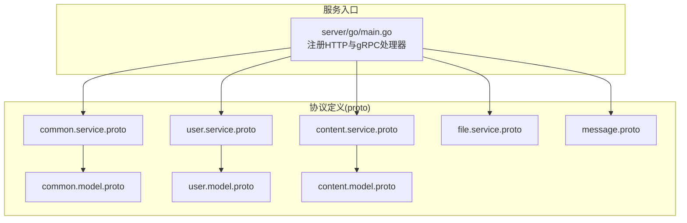
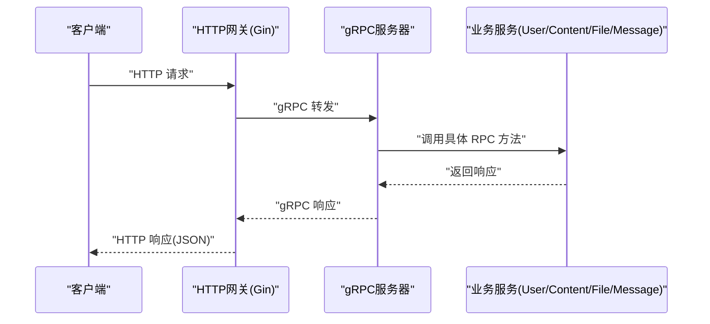
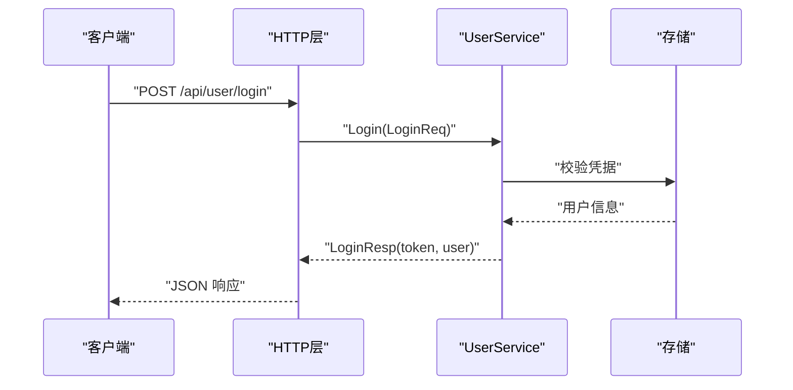
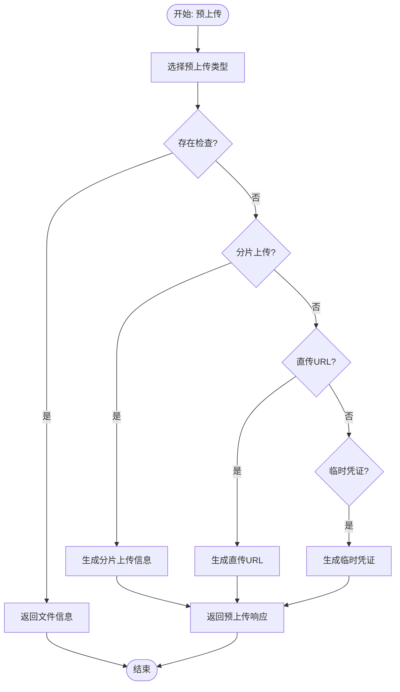
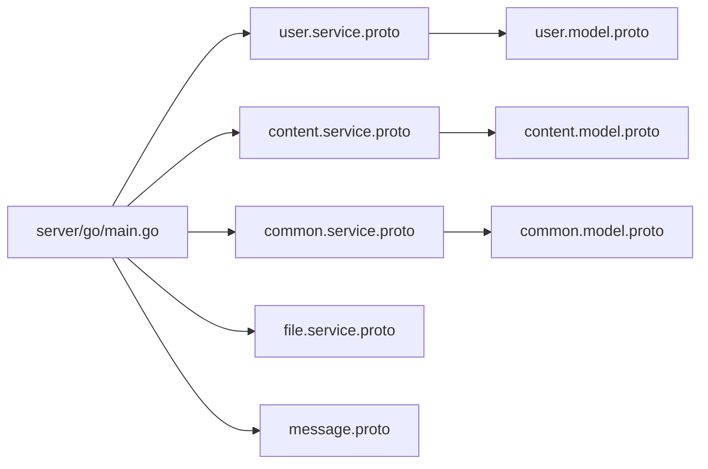

# API参考

<cite>
**本文档引用的文件**
- [proto/README.md](file://proto/README.md)
- [proto/common/common.service.proto](file://proto/common/common.service.proto)
- [proto/common/common.model.proto](file://proto/common/common.model.proto)
- [proto/user/user.service.proto](file://proto/user/user.service.proto)
- [proto/user/user.model.proto](file://proto/user/user.model.proto)
- [proto/content/content.service.proto](file://proto/content/content.service.proto)
- [proto/content/content.model.proto](file://proto/content/content.model.proto)
- [proto/file/file.service.proto](file://proto/file/file.service.proto)
- [proto/message/message.proto](file://proto/message/message.proto)
- [server/go/main.go](file://server/go/main.go)
</cite>

## 目录
1. [简介](#简介)
2. [项目结构](#项目结构)
3. [核心组件](#核心组件)
4. [架构总览](#架构总览)
5. [详细组件分析](#详细组件分析)
6. [依赖关系分析](#依赖关系分析)
7. [性能考量](#性能考量)
8. [故障排查指南](#故障排查指南)
9. [结论](#结论)
10. [附录](#附录)

## 简介
本文件为 Hoper API 的全面参考文档，覆盖 gRPC 与 HTTP 接口规范，包含用户服务、内容服务、文件服务与消息服务的完整 API 列表。文档提供每个端点的请求/响应模型、参数说明、错误码定义、认证授权机制、权限控制与安全考虑，并给出版本管理与迁移建议。同时，结合仓库中的 proto 定义与服务入口，帮助开发者快速理解与集成。

## 项目结构
Hoper 后端采用 Go 语言实现，基于 gRPC 与 HTTP（通过 grpc-gateway）双栈暴露服务；API 定义集中在 proto 目录，服务入口位于 server/go/main.go 中统一注册各模块的 HTTP 与 gRPC 处理器。

**图表来源**
- [server/go/main.go:55-67](file://server/go/main.go#L55-L67)
- [proto/common/common.service.proto:18-136](file://proto/common/common.service.proto#L18-L136)
- [proto/user/user.service.proto:26-288](file://proto/user/user.service.proto#L26-L288)
- [proto/content/content.service.proto:18-94](file://proto/content/content.service.proto#L18-L94)
- [proto/file/file.service.proto:20-62](file://proto/file/file.service.proto#L20-L62)
- [proto/message/message.proto:71-74](file://proto/message/message.proto#L71-L74)

**章节来源**
- [server/go/main.go:28-68](file://server/go/main.go#L28-L68)

## 核心组件
- 公共服务（CommonService）
  - 属性与标签的增删改查、邮件发送、国际化文案等能力
- 用户服务（UserService）
  - 用户注册、登录、激活、密码重置、资料编辑、关注/取关、操作日志、OAuth 授权与令牌发放
- 内容服务（ContentService）
  - 收藏夹与合集的创建/编辑/查询、用户内容统计
- 文件服务（FileService）
  - 文件 URL 获取、预上传（含分片/临时凭证/直传URL等策略）
- 消息服务（Message）
  - 基于 gRPC 的消息发送/接收（MQMessage、ClientMessage、ServerMessage）

**章节来源**
- [proto/common/common.service.proto:18-136](file://proto/common/common.service.proto#L18-L136)
- [proto/user/user.service.proto:26-288](file://proto/user/user.service.proto#L26-L288)
- [proto/content/content.service.proto:18-94](file://proto/content/content.service.proto#L18-L94)
- [proto/file/file.service.proto:20-62](file://proto/file/file.service.proto#L20-L62)
- [proto/message/message.proto:71-74](file://proto/message/message.proto#L71-L74)

## 架构总览
Hoper 服务通过统一入口启动，注册 HTTP 与 gRPC 处理器，gRPC 方法通过 google.api.http 映射到 HTTP REST 端点，便于多语言 SDK 与浏览器调用。

**图表来源**
- [server/go/main.go:55-67](file://server/go/main.go#L55-L67)
- [proto/user/user.service.proto:32-130](file://proto/user/user.service.proto#L32-L130)
- [proto/content/content.service.proto:23-92](file://proto/content/content.service.proto#L23-L92)
- [proto/file/file.service.proto:26-61](file://proto/file/file.service.proto#L26-L61)
- [proto/common/common.service.proto:23-135](file://proto/common/common.service.proto#L23-L135)

## 详细组件分析

### 公共服务（CommonService）
- 功能概览
  - 属性管理：新增、详情、修改、列表
  - 标签管理：新增、详情、修改、列表
  - 邮件发送
  - 国际化文案获取
- HTTP 映射
  - 属性：POST /api/attr、GET /api/attr/{id}、PUT /api/attr/{id}、GET /api/attr
  - 标签：POST /api/tag、GET /api/tag/{id}、PUT /api/tag/{id}、GET /api/tag
  - 邮件：POST /api/sendMail
  - 本地化：GET /api/locale
- gRPC 方法
  - AddAttr、AttrInfo、EditAttr、AttrList、AddTag、TagInfo、EditTag、TagList、SendMail、Locale
- 数据模型
  - Attr、Tag、TagGroup、Area、Media、Dict、Enum、Mail、sms、Category、DataType、DocType 等
- 错误码
  - 通过枚举定义，如 DataType、MediaType、Platform、BanReason、DocType 等

**章节来源**
- [proto/common/common.service.proto:18-136](file://proto/common/common.service.proto#L18-L136)
- [proto/common/common.model.proto:19-213](file://proto/common/common.model.proto#L19-L213)

### 用户服务（UserService）
- 功能概览
  - 验证码发送、注册验证、注册、简易注册、账户激活
  - 登录、登出、鉴权信息、忘记密码、重置密码
  - 用户资料编辑、获取用户信息、批量基础用户信息、关注/取关、操作日志
  - OAuth 授权与令牌发放
- HTTP 映射
  - 验证码：GET /api/sendVerifyCode
  - 注册验证：POST /api/user/signupVerify
  - 注册：POST /api/user
  - 简易注册：POST /api/v2/user
  - 激活：GET /api/user/active/{id}/{secret}
  - 编辑：PUT /api/user/{id}
  - 登录：POST /api/user/login
  - 登出：GET /api/user/logout
  - 鉴权：GET /api/auth
  - 忘记密码：GET /api/user/forgetPassword
  - 重置密码：PATCH /api/user/resetPassword/{id}/{secret}
  - 获取用户：GET /api/user/{id}
  - 操作日志：GET /api/user/actionLog
  - 基础用户列表：POST /api/baseUserList
  - 关注：GET /api/user/follow
  - 取消关注：DELETE /api/user/follow
  - OAuth 授权：GET /oauth/authorize
  - OAuth 令牌：POST /oauth/access_token
- gRPC 方法
  - VerifyCode、SignupVerify、Signup、EasySignup、Active、Edit、Login、Logout、AuthInfo、ForgetPassword、ResetPassword、Info、ActionLogList、BaseList、Follow、delFollow、OauthAuthorize、OauthToken
- 认证与权限
  - 鉴权接口支持 OAuth2 与 Authorization 两种方式
  - 部分接口要求读/写权限范围
- 数据模型
  - User、UserExt、Follow、ScoreLog、BannedLog、ActionLog、Resume、UserBase、AccessDevice、Device、Auth、Role、Gender、UserStatus、BannedType、DeviceType、Action、UserErr 等

**图表来源**
- [proto/user/user.service.proto:119-130](file://proto/user/user.service.proto#L119-L130)
- [proto/user/user.model.proto:20-172](file://proto/user/user.model.proto#L20-L172)

**章节来源**
- [proto/user/user.service.proto:26-288](file://proto/user/user.service.proto#L26-L288)
- [proto/user/user.model.proto:19-269](file://proto/user/user.model.proto#L19-L269)

### 内容服务（ContentService）
- 功能概览
  - 收藏夹列表（完整/精简）、创建、修改
  - 合集创建、修改
  - 用户内容统计
- HTTP 映射
  - 收藏夹列表：GET /api/content/fav/{userId}
  - 精简收藏夹：GET /api/content/tinyFav/{userId}
  - 创建收藏夹：POST /api/content/fav
  - 修改收藏夹：PUT /api/content/fav/{id}
  - 创建合集：POST /api/content/set
  - 修改合集：PUT /api/content/set/{id}
  - 用户统计：GET /api/content/userStatistics/{id}
- gRPC 方法
  - FavList、TinyFavList、AddFav、EditFav、AddSet、EditSet、GetUserStatistics
- 数据模型
  - Content、Container、Favorite、UserStatistics、ContentType、ViewPermission、ContainerType 等

**章节来源**
- [proto/content/content.service.proto:18-94](file://proto/content/content.service.proto#L18-L94)
- [proto/content/content.model.proto:43-122](file://proto/content/content.model.proto#L43-L122)

### 文件服务（FileService）
- 功能概览
  - 批量获取文件 URL（POST/GET）
  - 预上传（PreUpload），支持多种上传策略（存在检查、分片上传、直传URL、临时凭证）
- HTTP 映射
  - 批量获取URL：POST /api/urls、GET /api/urls
  - 预上传：POST /api/preUpload
- gRPC 方法
  - GetUrls、GetUrl、PreUpload
- 数据模型
  - File、PreUploadType、Credentials、MultipartUpload、PreUploadResp、UploadPart

**图表来源**
- [proto/file/file.service.proto:51-117](file://proto/file/service.proto#L51-L117)

**章节来源**
- [proto/file/file.service.proto:20-122](file://proto/file/file.service.proto#L20-L122)

### 消息服务（Message）
- 功能概览
  - 发送消息（MQMessage）
  - 接收消息（ClientMessage）
- gRPC 方法
  - Send(MQMessage) → Empty
  - Receive(ClientMessage) → Empty
- 数据模型
  - ClientCmd、ServerCmd、MQMessage、ClientMessage、ServerMessage、JoinGroupReq/Resp、ClientMeta

**章节来源**
- [proto/message/message.proto:19-74](file://proto/message/message.proto#L19-L74)

## 依赖关系分析
- 协议与模型
  - 各服务 proto 依赖公共模型（common.model.proto）与时间/枚举/基础模型等工具包
- 服务注册
  - 服务入口统一注册 HTTP 与 gRPC 处理器，分别对应各模块 API

**图表来源**
- [server/go/main.go:55-67](file://server/go/main.go#L55-L67)
- [proto/user/user.service.proto:1-15](file://proto/user/user.service.proto#L1-L15)
- [proto/content/content.service.proto:1-12](file://proto/content/content.service.proto#L1-L12)
- [proto/common/common.service.proto:1-12](file://proto/common/common.service.proto#L1-L12)
- [proto/file/file.service.proto:1-8](file://proto/file/file.service.proto#L1-L8)
- [proto/message/message.proto:1-11](file://proto/message/message.proto#L1-L11)

**章节来源**
- [server/go/main.go:55-67](file://server/go/main.go#L55-L67)

## 性能考量
- gRPC 与 HTTP 并行：gRPC 提供低开销、强类型通信；HTTP 通过 google.api.http 映射便于多语言与浏览器调用
- 预上传策略：根据文件大小与场景选择直传URL、分片上传或临时凭证，降低单点压力
- 分页与列表：合理使用分页参数（pageNo/pageSize）避免一次性返回大量数据
- 缓存与异步：对高频读取的静态资源与列表数据可引入缓存与异步处理

## 故障排查指南
- gRPC 网关问题
  - 若遇到 grpc-gateway 对 gogo/empty 的兼容性问题，需按 proto/README.md 的指引进行处理
- 认证失败
  - 确认鉴权头（Authorization/OAuth2）正确传递，且具备所需 scope
- 参数校验
  - 严格遵循字段长度、类型与必填约束，避免因校验失败导致 4xx
- 错误码定位
  - 用户相关错误码集中于 UserErr 枚举，可据此快速定位问题类别

**章节来源**
- [proto/README.md:1-7](file://proto/README.md#L1-L7)
- [proto/user/user.model.proto:246-257](file://proto/user/user.model.proto#L246-L257)

## 结论
Hoper API 以清晰的协议定义与统一的服务入口，提供了覆盖用户、内容、文件与消息的完整能力矩阵。通过 gRPC 与 HTTP 的双栈设计，既保证了高性能通信，又兼顾了易用性与生态兼容。建议在生产环境中结合鉴权、限流与监控体系，确保稳定与安全。

## 附录

### 版本管理与迁移
- 版本标记
  - 在各服务的 openapiv2_operation 中可见版本标签（如 v1.0.0），用于标识接口版本
- 迁移建议
  - 新增接口时保持向后兼容，避免破坏性变更
  - 对废弃字段与方法保留一段时间并标注弃用提示
  - 通过版本标签区分不同版本的接口，逐步引导客户端升级

**章节来源**
- [proto/common/common.service.proto:29-31](file://proto/common/common.service.proto#L29-L31)
- [proto/user/user.service.proto:20-24](file://proto/user/user.service.proto#L20-L24)

### 认证与授权机制
- 鉴权方式
  - OAuth2 与 Authorization 双通道，部分接口要求读/写权限
- 权限控制
  - 用户资料编辑等接口明确标注安全需求，需确保调用方具备相应权限
- 安全考虑
  - 登录/重置密码等敏感流程需配合验证码与安全传输
  - 文件上传建议启用预签名与访问控制，防止未授权访问

**章节来源**
- [proto/user/user.service.proto:107-116](file://proto/user/user.service.proto#L107-L116)
- [proto/user/user.service.proto:153-167](file://proto/user/user.service.proto#L153-L167)

### SDK 使用指南（多语言）
- Go 客户端
  - 使用生成的 protobuf 客户端与 grpc-gateway 适配器，按服务入口注册处理器
- JavaScript/Web
  - 通过 google.api.http 映射生成的 HTTP 客户端，直接调用 REST 端点
- 移动端
  - 建议优先使用 gRPC 客户端，若受限则使用 HTTP 客户端并遵循鉴权与限流策略

**章节来源**
- [server/go/main.go:55-67](file://server/go/main.go#L55-L67)