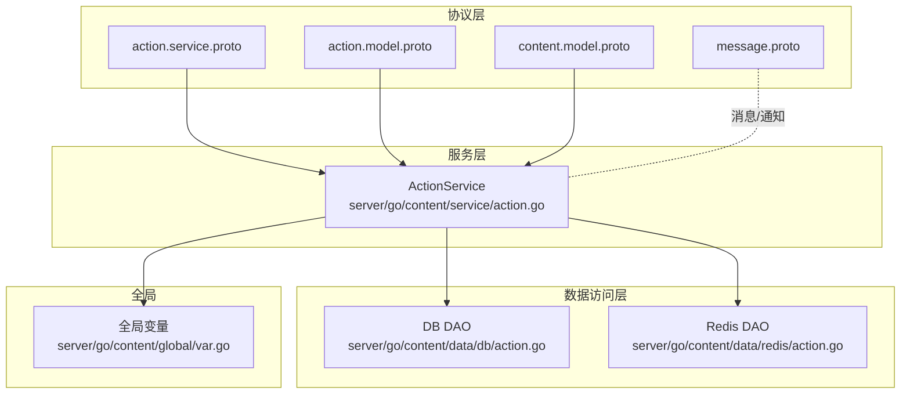
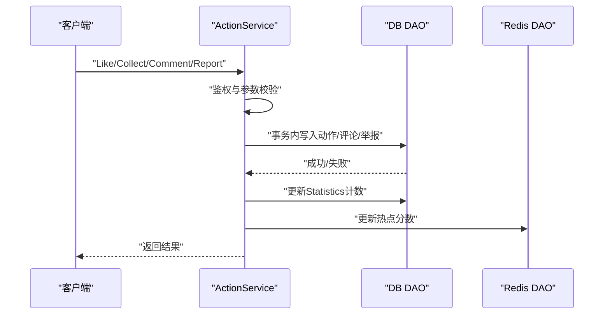
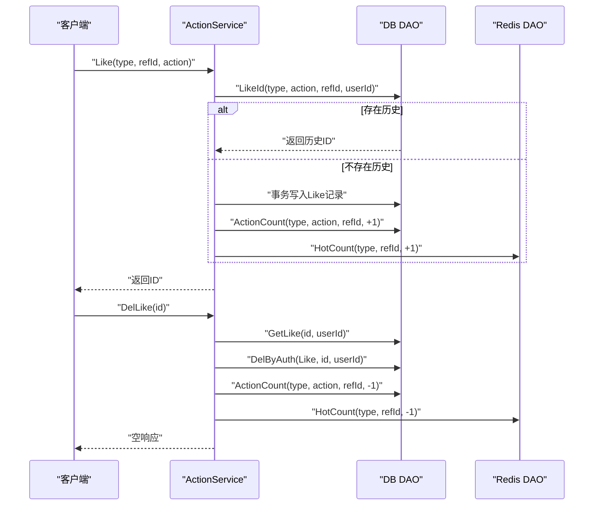
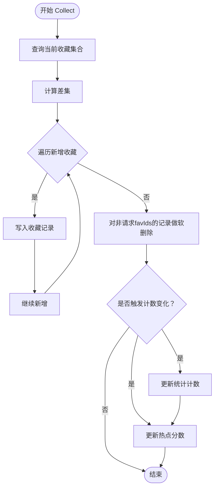
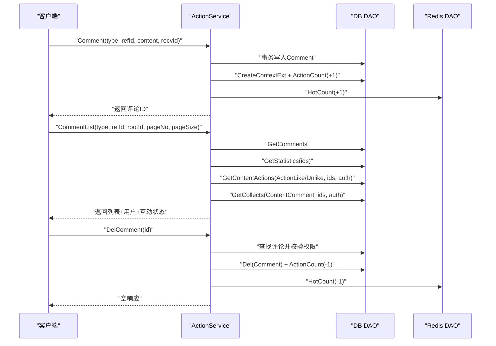
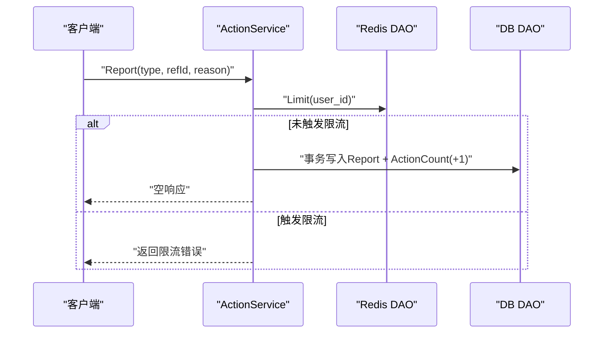
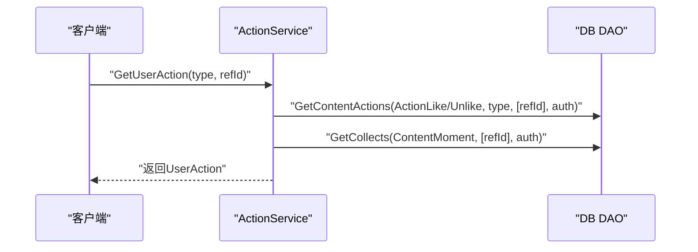
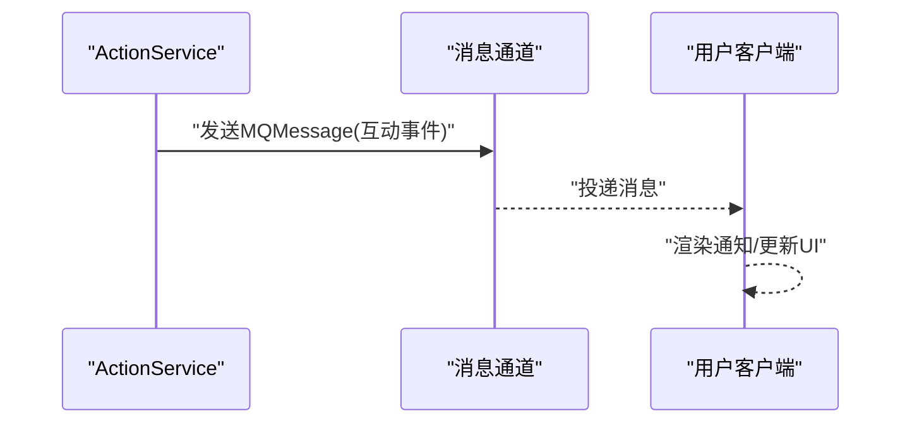
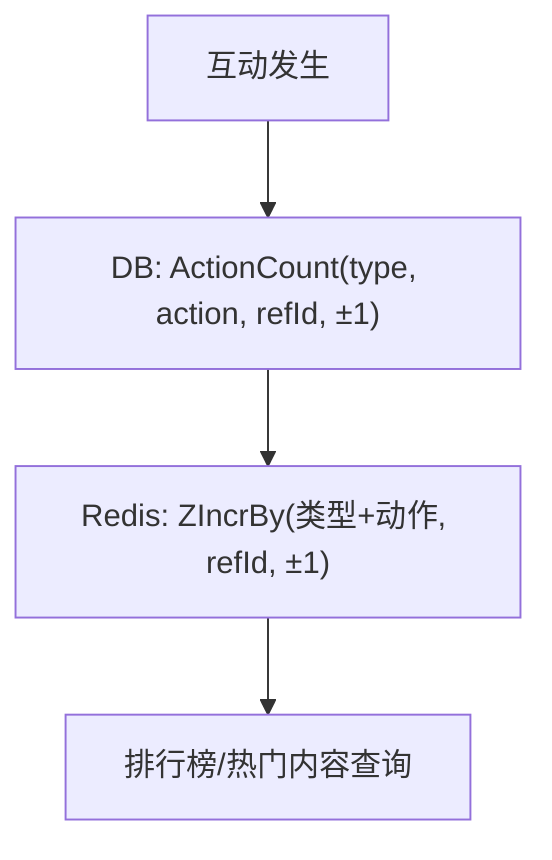
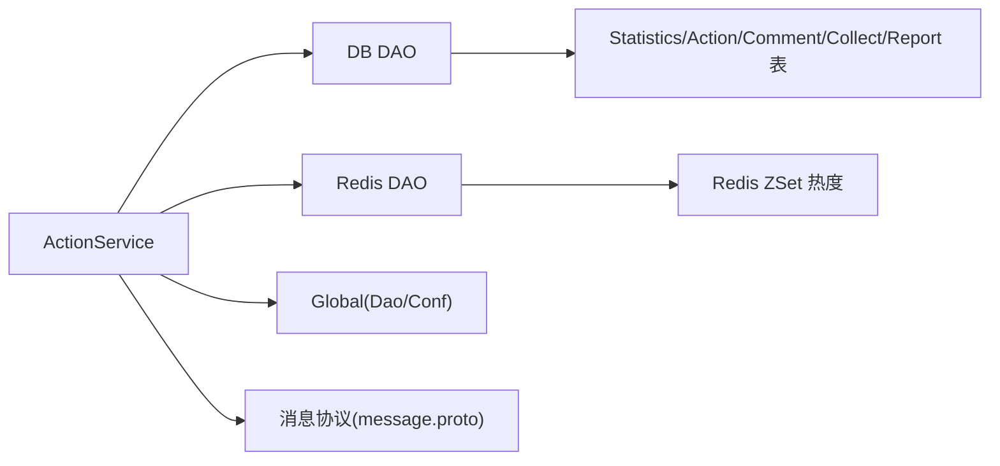

# 互动行为API

<cite>
**本文档引用的文件**
- [action.service.proto](file://proto/content/action.service.proto)
- [action.model.proto](file://proto/content/action.model.proto)
- [content.model.proto](file://proto/content/content.model.proto)
- [action.go（服务实现）](file://server/go/content/service/action.go)
- [action.go（数据库DAO）](file://server/go/content/data/db/action.go)
- [action.go（Redis DAO）](file://server/go/content/data/redis/action.go)
- [var.go（全局变量）](file://server/go/content/global/var.go)
- [message.proto（消息协议）](file://proto/message/message.proto)
</cite>

## 目录
1. [简介](#简介)
2. [项目结构](#项目结构)
3. [核心组件](#核心组件)
4. [架构总览](#架构总览)
5. [详细组件分析](#详细组件分析)
6. [依赖分析](#依赖分析)
7. [性能考虑](#性能考虑)
8. [故障排查指南](#故障排查指南)
9. [结论](#结论)
10. [附录](#附录)

## 简介
本文件为“互动行为API”的完整技术文档，覆盖点赞/取消点赞、收藏/取消收藏、评论、举报、获取用户对内容的互动状态等核心能力，并结合仓库现有代码梳理了以下关键主题：
- API接口定义与调用流程
- 实时通知与消息推送（基于消息协议）
- 状态同步与统计更新（数据库与Redis）
- 统计计算、热度聚合与排行榜基础能力
- 风控与频率限制（基于现有限流实现）
- 推荐与个性化（基于现有统计与缓存的扩展建议）
- 批量操作与第三方集成（基于现有接口的扩展建议）
- 错误处理、性能优化与安全防护

## 项目结构
围绕互动行为的核心文件组织如下：
- 协议定义：proto/content/action.service.proto、action.model.proto、content.model.proto
- 服务实现：server/go/content/service/action.go
- 数据访问层：server/go/content/data/db/action.go、server/go/content/data/redis/action.go
- 全局配置与DAO：server/go/content/global/var.go
- 消息协议：proto/message/message.proto

图表来源
- [action.service.proto:23-108](file://proto/content/action.service.proto#L23-L108)
- [action.model.proto:20-134](file://proto/content/action.model.proto#L20-L134)
- [content.model.proto:125-135](file://proto/content/content.model.proto#L125-L135)
- [action.go（服务实现）:26-411](file://server/go/content/service/action.go#L26-L411)
- [action.go（数据库DAO）:19-168](file://server/go/content/data/db/action.go#L19-L168)
- [action.go（Redis DAO）:12-31](file://server/go/content/data/redis/action.go#L12-L31)
- [var.go（全局变量）:7-12](file://server/go/content/global/var.go#L7-L12)
- [message.proto:28-74](file://proto/message/message.proto#L28-L74)

章节来源
- [action.service.proto:1-171](file://proto/content/action.service.proto#L1-L171)
- [action.model.proto:1-171](file://proto/content/action.model.proto#L1-L171)
- [content.model.proto:1-187](file://proto/content/content.model.proto#L1-L187)
- [action.go（服务实现）:1-411](file://server/go/content/service/action.go#L1-L411)
- [action.go（数据库DAO）:1-168](file://server/go/content/data/db/action.go#L1-L168)
- [action.go（Redis DAO）:1-31](file://server/go/content/data/redis/action.go#L1-L31)
- [var.go（全局变量）:1-13](file://server/go/content/global/var.go#L1-L13)
- [message.proto:1-74](file://proto/message/message.proto#L1-L74)

## 核心组件
- 服务接口：ActionService（点赞/取消点赞、评论、评论列表、收藏、举报、用户互动状态查询）
- 数据模型：Action/Like/UnLike/Collect/Report/Comment/Statistics/UserAction 等
- 统计与热度：Statistics 表示各类互动计数；Redis ZSet 用于热点聚合
- 消息协议：MQMessage/ClientMessage/ServerMessage 定义消息通道与命令类型

章节来源
- [action.service.proto:23-108](file://proto/content/action.service.proto#L23-L108)
- [action.model.proto:20-134](file://proto/content/action.model.proto#L20-L134)
- [content.model.proto:117-128](file://proto/content/content.model.proto#L117-L128)
- [message.proto:28-74](file://proto/message/message.proto#L28-L74)

## 架构总览
互动行为API采用“协议定义 → 服务实现 → 数据访问层（DB/Redis）”的分层架构。服务层负责鉴权、事务控制、统计更新与缓存同步；数据访问层封装数据库与Redis操作；消息协议提供消息/通知能力。

图表来源
- [action.go（服务实现）:30-77](file://server/go/content/service/action.go#L30-L77)
- [action.go（数据库DAO）:19-51](file://server/go/content/data/db/action.go#L19-L51)
- [action.go（Redis DAO）:12-20](file://server/go/content/data/redis/action.go#L12-L20)

## 详细组件分析

### 1) 点赞/取消点赞（Like/DelLike）
- 接口定义
  - Like：POST /api/action/like
  - DelLike：DELETE /api/action/like/{id}
- 流程要点
  - 鉴权后根据类型、动作、关联ID与用户ID查询是否存在历史记录
  - 若不存在则在事务中写入动作记录并更新统计计数
  - 同步更新Redis热点分数
  - 取消点赞时校验存在性与权限，执行软删除并回滚统计与热度

图表来源
- [action.service.proto:28-47](file://proto/content/action.service.proto#L28-L47)
- [action.go（服务实现）:30-108](file://server/go/content/service/action.go#L30-L108)
- [action.go（数据库DAO）:53-106](file://server/go/content/data/db/action.go#L53-L106)
- [action.go（Redis DAO）:12-20](file://server/go/content/data/redis/action.go#L12-L20)

章节来源
- [action.service.proto:28-47](file://proto/content/action.service.proto#L28-L47)
- [action.go（服务实现）:30-108](file://server/go/content/service/action.go#L30-L108)
- [action.go（数据库DAO）:53-106](file://server/go/content/data/db/action.go#L53-L106)
- [action.go（Redis DAO）:12-20](file://server/go/content/data/redis/action.go#L12-L20)

### 2) 收藏/取消收藏（Collect）
- 接口定义：POST /api/action/collect
- 流程要点
  - 获取当前用户的收藏集合，计算与请求favIds的差集
  - 对新增项逐个写入收藏记录
  - 对不在请求中的旧收藏执行软删除
  - 当从“无收藏”到“有收藏”或反之，更新统计计数与热点分数

图表来源
- [action.service.proto:78-87](file://proto/content/action.service.proto#L78-L87)
- [action.go（服务实现）:192-254](file://server/go/content/service/action.go#L192-L254)
- [action.go（数据库DAO）:141-150](file://server/go/content/data/db/action.go#L141-L150)
- [action.go（Redis DAO）:12-20](file://server/go/content/data/redis/action.go#L12-L20)

章节来源
- [action.service.proto:78-87](file://proto/content/action.service.proto#L78-L87)
- [action.go（服务实现）:192-254](file://server/go/content/service/action.go#L192-L254)
- [action.go（数据库DAO）:141-150](file://server/go/content/data/db/action.go#L141-L150)
- [action.go（Redis DAO）:12-20](file://server/go/content/data/redis/action.go#L12-L20)

### 3) 评论/评论列表/删除评论（Comment/CommentList/DelComment）
- 接口定义
  - Comment：POST /api/action/comment
  - CommentList：GET /api/action/comment
  - DelComment：DELETE /api/action/comment/{id}
- 流程要点
  - 评论写入在事务中完成，同时更新评论计数与上下文扩展
  - 评论列表按根节点分页查询，补充统计与用户信息，按登录态填充用户互动状态
  - 删除评论时校验权限（评论作者或内容作者），执行软删除并回滚统计与热度

图表来源
- [action.service.proto:48-77](file://proto/content/action.service.proto#L48-L77)
- [action.go（服务实现）:110-190](file://server/go/content/service/action.go#L110-L190)
- [action.go（数据库DAO）:152-167](file://server/go/content/data/db/action.go#L152-L167)
- [action.go（Redis DAO）:12-20](file://server/go/content/data/redis/action.go#L12-L20)

章节来源
- [action.service.proto:48-77](file://proto/content/action.service.proto#L48-L77)
- [action.go（服务实现）:110-190](file://server/go/content/service/action.go#L110-L190)
- [action.go（数据库DAO）:152-167](file://server/go/content/data/db/action.go#L152-L167)
- [action.go（Redis DAO）:12-20](file://server/go/content/data/redis/action.go#L12-L20)

### 4) 举报（Report）
- 接口定义：POST /api/action/report
- 流程要点
  - 鉴权后进行限流检查（基于Redis限流策略）
  - 事务内写入举报记录并更新统计计数

图表来源
- [action.service.proto:88-97](file://proto/content/action.service.proto#L88-L97)
- [action.go（服务实现）:256-290](file://server/go/content/service/action.go#L256-L290)
- [action.go（Redis DAO）:12-20](file://server/go/content/data/redis/action.go#L12-L20)
- [action.go（数据库DAO）:19-51](file://server/go/content/data/db/action.go#L19-L51)

章节来源
- [action.service.proto:88-97](file://proto/content/action.service.proto#L88-L97)
- [action.go（服务实现）:256-290](file://server/go/content/service/action.go#L256-L290)
- [action.go（Redis DAO）:12-20](file://server/go/content/data/redis/action.go#L12-L20)
- [action.go（数据库DAO）:19-51](file://server/go/content/data/db/action.go#L19-L51)

### 5) 用户互动状态（GetUserAction）
- 接口定义：GET /api/userAction/{type}/{refId}
- 能力：返回当前用户对该内容的点赞/取消赞/收藏状态（likeId/unlikeId/collectIds）

图表来源
- [action.service.proto:98-107](file://proto/content/action.service.proto#L98-L107)
- [action.go（服务实现）:379-410](file://server/go/content/service/action.go#L379-L410)
- [action.go（数据库DAO）:119-150](file://server/go/content/data/db/action.go#L119-L150)

章节来源
- [action.service.proto:98-107](file://proto/content/action.service.proto#L98-L107)
- [action.go（服务实现）:379-410](file://server/go/content/service/action.go#L379-L410)
- [action.go（数据库DAO）:119-150](file://server/go/content/data/db/action.go#L119-L150)

### 6) 实时通知与消息推送
- 消息协议
  - MQMessage/ClientMessage/ServerMessage 提供消息体、类型与收发方标识
  - ClientCmd/ServerCmd 定义命令枚举
- 应用场景
  - 互动事件可作为消息投递至MQMessage，由下游服务转发至目标用户或群组
  - 结合WebSocket/长连接可实现实时推送

图表来源
- [message.proto:28-74](file://proto/message/message.proto#L28-L74)

章节来源
- [message.proto:1-74](file://proto/message/message.proto#L1-L74)

### 7) 统计计算与热度聚合
- 统计模型
  - Statistics：包含点赞、浏览、不喜欢、举报、评论、收藏、分享等计数字段
- 更新策略
  - 通过 ActionCount 在事务中原子更新对应列
  - Redis ZSet 以“内容类型名+动作名”为键，refId 为成员，增量为分数，用于热点聚合

图表来源
- [action.model.proto:117-128](file://proto/content/action.model.proto#L117-L128)
- [action.go（数据库DAO）:19-51](file://server/go/content/data/db/action.go#L19-L51)
- [action.go（Redis DAO）:22-30](file://server/go/content/data/redis/action.go#L22-L30)

章节来源
- [action.model.proto:117-128](file://proto/content/action.model.proto#L117-L128)
- [action.go（数据库DAO）:19-51](file://server/go/content/data/db/action.go#L19-L51)
- [action.go（Redis DAO）:22-30](file://server/go/content/data/redis/action.go#L22-L30)

### 8) 风控与频率限制
- 现状
  - 举报接口已集成限流检查（基于Redis限流策略）
- 建议
  - 将限流策略扩展至Like/Collect/Comment等高频接口
  - 引入IP/用户维度的滑动窗口限流、黑名单与异常检测

章节来源
- [action.go（服务实现）:256-266](file://server/go/content/service/action.go#L256-L266)
- [action.go（Redis DAO）:12-20](file://server/go/content/data/redis/action.go#L12-L20)

### 9) 推荐与个性化（扩展建议）
- 基于现有统计与缓存
  - 利用Redis ZSet热点分数与用户互动历史构建协同特征
  - 结合用户画像（用户统计模型）与内容标签/属性进行召回与排序
- 注意
  - 本仓库未提供专门的推荐服务实现，以上为基于现有统计与缓存的扩展思路

章节来源
- [content.model.proto:110-122](file://proto/content/content.model.proto#L110-L122)
- [action.go（Redis DAO）:12-20](file://server/go/content/data/redis/action.go#L12-L20)

### 10) 批量操作与第三方集成（扩展建议）
- 批量操作
  - 可在服务层增加批量Like/Collect/Comment接口，统一事务与统计更新
- 第三方集成
  - 通过OpenAPI注解与GraphQL注解，可对外暴露REST与GraphQL两种接入方式
  - 通过消息协议与MQ实现异步通知与外部系统对接

章节来源
- [action.service.proto:24-26](file://proto/content/action.service.proto#L24-L26)
- [action.service.proto:33-36](file://proto/content/action.service.proto#L33-L36)
- [action.service.proto:53-56](file://proto/content/action.service.proto#L53-L56)
- [action.service.proto:93-96](file://proto/content/action.service.proto#L93-L96)

## 依赖分析
- 服务层依赖
  - 鉴权：auth(ctx, true)（服务内部实现）
  - DAO：DB DAO与Redis DAO
  - 全局：global.Dao、global.Conf
- 数据模型依赖
  - ContentType/ActionType/CommentType/Statistics/UserAction 等
- 消息协议依赖
  - MQMessage/ClientMessage/ServerMessage 用于消息/通知

图表来源
- [action.go（服务实现）:35-40](file://server/go/content/service/action.go#L35-L40)
- [var.go（全局变量）:7-12](file://server/go/content/global/var.go#L7-L12)
- [action.go（数据库DAO）:19-51](file://server/go/content/data/db/action.go#L19-L51)
- [action.go（Redis DAO）:12-20](file://server/go/content/data/redis/action.go#L12-L20)
- [message.proto:28-74](file://proto/message/message.proto#L28-L74)

章节来源
- [action.go（服务实现）:1-411](file://server/go/content/service/action.go#L1-L411)
- [var.go（全局变量）:1-13](file://server/go/content/global/var.go#L1-L13)
- [action.go（数据库DAO）:1-168](file://server/go/content/data/db/action.go#L1-L168)
- [action.go（Redis DAO）:1-31](file://server/go/content/data/redis/action.go#L1-L31)
- [message.proto:1-74](file://proto/message/message.proto#L1-L74)

## 性能考虑
- 事务与原子性
  - 评论、点赞/取消、举报均在事务中完成，确保统计与记录一致性
- 缓存与热点
  - Redis ZSet用于热点聚合，减少高并发下的DB压力
- 查询优化
  - LikeId/GetContentActions/GetCollects等查询均带索引条件，避免全表扫描
- 写入优化
  - 统计更新采用表达式累加，避免读取-计算-写入的竞态

章节来源
- [action.go（服务实现）:52-65](file://server/go/content/service/action.go#L52-L65)
- [action.go（数据库DAO）:19-51](file://server/go/content/data/db/action.go#L19-L51)
- [action.go（Redis DAO）:12-20](file://server/go/content/data/redis/action.go#L12-L20)

## 故障排查指南
- 常见错误
  - 权限不足：删除评论时若非本人且非内容作者，返回权限错误
  - 参数非法：取消点赞时若无历史记录，返回参数错误
  - 数据库/Redis错误：事务失败或缓存写入失败时返回相应错误码
- 排查步骤
  - 检查鉴权头与用户ID
  - 核对ContentType/ActionType/RefId是否匹配
  - 查看事务日志与统计更新结果
  - 校验Redis热点键是否存在与分数是否正确

章节来源
- [action.go（服务实现）:87-93](file://server/go/content/service/action.go#L87-L93)
- [action.go（服务实现）:163-173](file://server/go/content/service/action.go#L163-L173)
- [action.go（数据库DAO）:53-64](file://server/go/content/data/db/action.go#L53-L64)

## 结论
本API以清晰的协议定义与分层实现覆盖了核心互动行为，并通过数据库与Redis协同实现高效统计与热点聚合。消息协议为实时通知提供了基础能力。建议后续在风控（限流/异常检测）、推荐与个性化、批量操作与第三方集成方面进一步完善，以满足更复杂的业务场景。

## 附录
- 关键接口一览
  - 点赞/取消点赞：POST /api/action/like, DELETE /api/action/like/{id}
  - 评论：POST /api/action/comment, GET /api/action/comment, DELETE /api/action/comment/{id}
  - 收藏：POST /api/action/collect
  - 举报：POST /api/action/report
  - 用户互动状态：GET /api/userAction/{type}/{refId}
- 数据模型要点
  - Statistics：点赞/浏览/不喜欢/举报/评论/收藏/分享计数
  - UserAction：当前用户对内容的互动状态
- 消息协议要点
  - MQMessage/ClientMessage/ServerMessage：消息体、类型与收发标识
  - ClientCmd/ServerCmd：命令枚举

章节来源
- [action.service.proto:28-107](file://proto/content/action.service.proto#L28-L107)
- [action.model.proto:117-134](file://proto/content/action.model.proto#L117-L134)
- [message.proto:28-74](file://proto/message/message.proto#L28-L74)