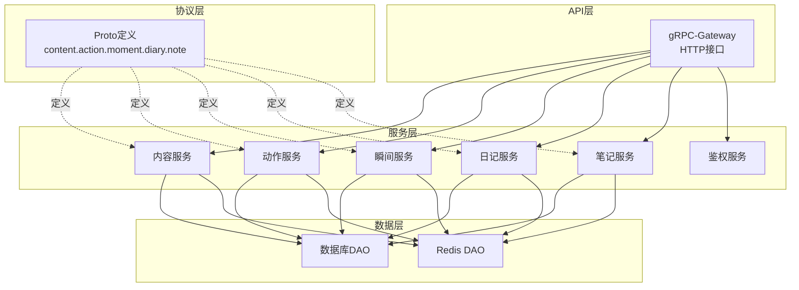
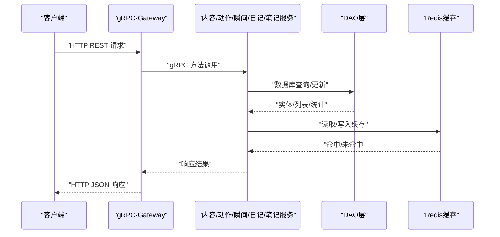
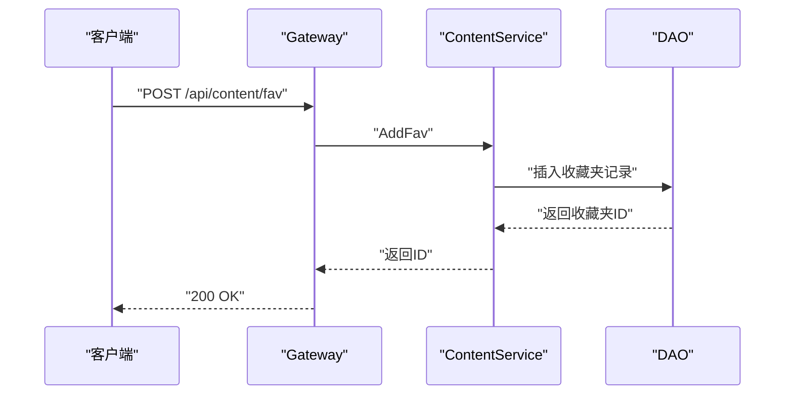
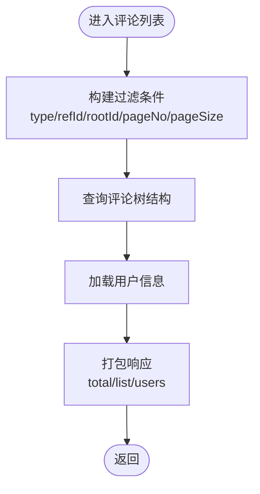
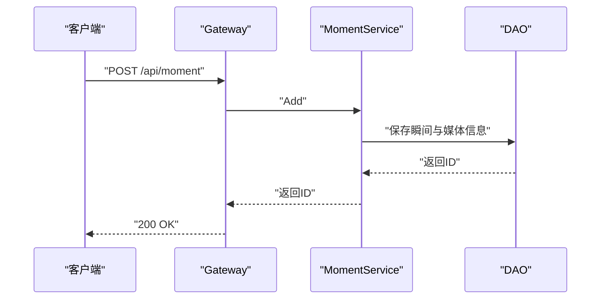
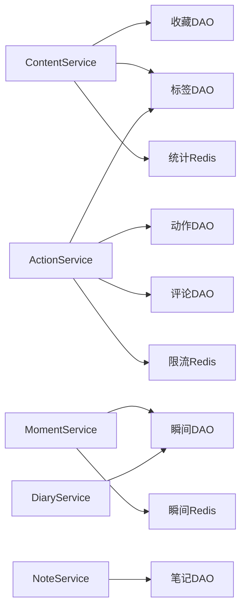

# 内容服务API

<cite>
**本文档引用的文件**
- [content.service.proto](file://proto/content/content.service.proto)
- [action.service.proto](file://proto/content/action.service.proto)
- [moment.service.proto](file://proto/content/moment.service.proto)
- [diary.service.proto](file://proto/content/diary.service.proto)
- [note.service.proto](file://proto/content/note.service.proto)
- [content.model.proto](file://proto/content/content.model.proto)
- [action.model.proto](file://proto/content/action.model.proto)
- [moment.model.proto](file://proto/content/moment.model.proto)
- [article.model.proto](file://proto/content/article.model.proto)
- [content.go](file://server/go/content/service/content.go)
- [action.go](file://server/go/content/service/action.go)
- [moment.go](file://server/go/content/service/moments.go)
- [diary.go](file://server/go/content/service/diary.go)
- [note.go](file://server/go/content/service/note.go)
- [auth.go](file://server/go/content/service/auth.go)
- [gin.go](file://server/go/content/api/gin.go)
- [grpc.go](file://server/go/content/api/grpc.go)
- [dao.go](file://server/go/content/data/dao.go)
- [action.dao.go](file://server/go/content/data/db/action.go)
- [content.dao.go](file://server/go/content/data/db/content.go)
- [fav.dao.go](file://server/go/content/data/db/fav.go)
- [moment.dao.go](file://server/go/content/data/db/moment.go)
- [tag.dao.go](file://server/go/content/data/db/tag.go)
- [action.redis.dao.go](file://server/go/content/data/redis/action.go)
- [stats.redis.dao.go](file://server/go/content/data/redis/stats.go)
- [limit.redis.dao.go](file://server/go/content/data/redis/limit.go)
- [moment.redis.dao.go](file://server/go/content/data/redis/moment.go)
- [apidoc.openapi.json](file://server/go/apidoc/api.openapi.json)
</cite>

## 目录
1. [简介](#简介)
2. [项目结构](#项目结构)
3. [核心组件](#核心组件)
4. [架构总览](#架构总览)
5. [详细组件分析](#详细组件分析)
6. [依赖关系分析](#依赖关系分析)
7. [性能考量](#性能考量)
8. [故障排查指南](#故障排查指南)
9. [结论](#结论)
10. [附录](#附录)

## 简介
本文件为内容服务API的权威文档，覆盖动态发布、内容管理、点赞评论、收藏分享、内容分类与标签、内容审核与推荐、多媒体处理、统计与分析、权限控制与隐私保护等全栈能力。基于gRPC-Gateway与OpenAPI生成HTTP接口，统一提供RESTful API与GraphQL支持，配套Go服务层与DAO层实现，Redis缓存与限流策略保障高并发场景。

## 项目结构
内容服务由Proto定义、服务实现、数据访问层与API网关四层构成：
- Proto层：定义服务接口、消息体与枚举（内容、动作、瞬间、日记、笔记）
- 服务层：业务逻辑封装（内容、动作、瞬间、日记、笔记、鉴权）
- 数据层：数据库DAO与Redis DAO（动作、内容、收藏、瞬间、标签、统计、限流）
- API层：gRPC-Gateway与OpenAPI集成，提供HTTP接口与Swagger文档

图表来源
- [gin.go](file://server/go/content/api/gin.go)
- [grpc.go](file://server/go/content/api/grpc.go)
- [content.go](file://server/go/content/service/content.go)
- [action.go](file://server/go/content/service/action.go)
- [moment.go](file://server/go/content/service/moments.go)
- [diary.go](file://server/go/content/service/diary.go)
- [note.go](file://server/go/content/service/note.go)
- [dao.go](file://server/go/content/data/dao.go)

章节来源
- [gin.go](file://server/go/content/api/gin.go)
- [grpc.go](file://server/go/content/api/grpc.go)

## 核心组件
- 内容服务：收藏夹与合集管理、用户内容统计
- 动作服务：点赞/取消点赞、评论/评论列表/删除评论、收藏、举报、用户操作查询
- 瞬间服务：详情、新增、修改、列表、删除
- 日记服务：日记本与日记的CRUD与分页
- 笔记服务：笔记创建
- 鉴权服务：权限校验与安全控制
- 数据层：数据库DAO与Redis DAO，含统计、限流、动作缓存

章节来源
- [content.service.proto](file://proto/content/content.service.proto)
- [action.service.proto](file://proto/content/action.service.proto)
- [moment.service.proto](file://proto/content/moment.service.proto)
- [diary.service.proto](file://proto/content/diary.service.proto)
- [note.service.proto](file://proto/content/note.service.proto)
- [content.go](file://server/go/content/service/content.go)
- [action.go](file://server/go/content/service/action.go)
- [moment.go](file://server/go/content/service/moments.go)
- [diary.go](file://server/go/content/service/diary.go)
- [note.go](file://server/go/content/service/note.go)
- [auth.go](file://server/go/content/service/auth.go)

## 架构总览
内容服务采用“协议驱动 + 服务编排 + 数据访问 + 缓存”的分层架构。gRPC-Gateway将HTTP请求映射到对应服务方法；服务层负责业务规则与鉴权；DAO层对接数据库与Redis；模型层通过Proto定义统一的数据契约。

图表来源
- [gin.go](file://server/go/content/api/gin.go)
- [grpc.go](file://server/go/content/api/grpc.go)
- [dao.go](file://server/go/content/data/dao.go)
- [action.redis.dao.go](file://server/go/content/data/redis/action.go)
- [stats.redis.dao.go](file://server/go/content/data/redis/stats.go)

## 详细组件分析

### 内容服务（收藏夹/合集/统计）
- 接口概览
  - 收藏夹列表：GET /api/content/fav/{userId}
  - 收藏夹精简列表：GET /api/content/tinyFav/{userId}
  - 创建收藏夹：POST /api/content/fav
  - 修改收藏夹：PUT /api/content/fav/{id}
  - 创建合集：POST /api/content/set
  - 修改合集：PUT /api/content/set/{id}
  - 用户内容统计：GET /api/content/userStatistics/{id}

- 关键模型
  - 收藏夹/FavList/FavListReq/AddFavReq/TinyFavListResp/TinyFavorites
  - 合集/AddSetReq
  - 用户统计/UserStatistics

- 权限与安全
  - 用户ID字段在请求中以只读方式传递，防止客户端篡改
  - 收藏夹/合集均支持匿名开关与排序字段

- 典型流程（创建收藏夹）

图表来源
- [content.service.proto](file://proto/content/content.service.proto)
- [content.dao.go](file://server/go/content/data/db/content.go)

章节来源
- [content.service.proto](file://proto/content/content.service.proto)
- [content.dao.go](file://server/go/content/data/db/content.go)

### 动作服务（点赞/评论/收藏/举报/用户操作）
- 接口概览
  - 点赞：POST /api/action/like
  - 取消点赞：DELETE /api/action/like/{id}
  - 评论：POST /api/action/comment
  - 评论列表：GET /api/action/comment
  - 删除评论：DELETE /api/action/comment/{id}
  - 收藏：POST /api/action/collect
  - 举报：POST /api/action/report
  - 用户操作：GET /api/userAction/{type}/{refId}

- 关键模型
  - LikeReq/CommentReq/CollectReq/ReportReq/CommentListReq/CommentListResp
  - Like/UnLike/Collect/Report/Comment/Statistics/UserAction

- 流程图（评论列表）

图表来源
- [action.service.proto](file://proto/content/action.service.proto)
- [action.dao.go](file://server/go/content/data/db/action.go)

章节来源
- [action.service.proto](file://proto/content/action.service.proto)
- [action.dao.go](file://server/go/content/data/db/action.go)

### 瞬间服务（Moment）
- 接口概览
  - 详情：GET /api/moment/{id}
  - 新增：POST /api/moment（body:*）
  - 修改：PUT /api/moment/{id}（body:*）
  - 列表：GET /api/moment
  - 删除：DELETE /api/moment/{id}

- 关键模型
  - Moment/AddMomentReq/MomentListReq/MomentListResp
  - 支持图片数组、标签、地区、权限、匿名、排序

- 典型流程（新增瞬间）

图表来源
- [moment.service.proto](file://proto/content/moment.service.proto)
- [moment.dao.go](file://server/go/content/data/db/moment.go)

章节来源
- [moment.service.proto](file://proto/content/moment.service.proto)
- [moment.dao.go](file://server/go/content/data/db/moment.go)

### 日记服务（Diary）
- 接口概览
  - 日记本详情：GET /api/diaryBook/{id}
  - 日记本列表：GET /api/diaryBook
  - 创建日记本：POST /api/diaryBook
  - 修改日记本：PUT /api/diaryBook/{id}
  - 日记详情：GET /api/diary/{id}
  - 新增日记：POST /api/diary（body:*）
  - 修改日记：PUT /api/diary/{id}（body:*）
  - 日记列表：GET /api/diary
  - 删除日记：DELETE /api/diary/{id}

- 关键模型
  - Diary/DiaryBook/AddDiaryBookReq/AddDiaryReq/DiaryListReq/DiaryListResp
  - 支持日记本与日记的权限、匿名、地区、标签、排序

章节来源
- [diary.service.proto](file://proto/content/diary.service.proto)
- [moment.dao.go](file://server/go/content/data/db/moment.go)

### 笔记服务（Note）
- 接口概览
  - 创建笔记：POST /api/note（body:*）

- 关键模型
  - Note/CreateNoteReq

章节来源
- [note.service.proto](file://proto/content/note.service.proto)

### 权限控制与隐私设置
- 视图权限枚举（ViewPermission）：无限制、仅自己、主页、陌生人、屏蔽部分人、开放部分人
- 匿名开关：收藏夹/合集/瞬间/日记支持匿名字段
- 用户ID只读：多处请求中userId字段标记为只读，防止客户端伪造
- 鉴权中间件：服务层对敏感操作进行鉴权校验

章节来源
- [content.model.proto](file://proto/content/content.model.proto)
- [moment.model.proto](file://proto/content/moment.model.proto)
- [action.service.proto](file://proto/content/action.service.proto)
- [auth.go](file://server/go/content/service/auth.go)

### 内容分类、标签系统
- 内容标签：ContentTag（type/refId/tagId/relativity）
- 内容属性：ContentAttr（type/refId/attrId/value/userId/status）
- 瞬间/日记/文章模型内嵌标签、地区、用户信息
- 支持标签与属性的多对多关联

章节来源
- [content.model.proto](file://proto/content/content.model.proto)
- [article.model.proto](file://proto/content/article.model.proto)
- [moment.model.proto](file://proto/content/moment.model.proto)

### 内容审核与推荐机制
- 举报模型：Report（type/refId/reason/remark）
- 审核记录：ContentDel（type/refId/reason/remark）
- 统计模型：Statistics（like/browse/unlike/report/comment/collect/share）
- 推荐：基于Statistics与用户行为的缓存策略（Redis）

章节来源
- [action.model.proto](file://proto/content/action.model.proto)
- [stats.redis.dao.go](file://server/go/content/data/redis/stats.go)

### 多媒体内容处理
- 瞬间模型支持图片数组与类型（单视频/音频/多图片）
- 日记/文章模型支持标签、地区、用户信息
- 文件服务（file.service.proto）用于媒体资源存储与访问（参考proto/file/file.service.proto）

章节来源
- [moment.model.proto](file://proto/content/moment.model.proto)
- [article.model.proto](file://proto/content/article.model.proto)

### 内容统计与数据分析
- 统计聚合：Statistics模型提供各维度计数
- Redis统计DAO：提供热点内容的快速读取
- 限流策略：Redis限流DAO用于防刷与保护

章节来源
- [action.model.proto](file://proto/content/action.model.proto)
- [stats.redis.dao.go](file://server/go/content/data/redis/stats.go)
- [limit.redis.dao.go](file://server/go/content/data/redis/limit.go)

## 依赖关系分析
- 服务依赖
  - ContentService依赖收藏夹与合集DAO
  - ActionService依赖动作、评论、收藏、举报DAO
  - MomentService/ DiaryService/ NoteService依赖各自DAO
  - 所有服务均依赖鉴权模块
- 数据依赖
  - DAO层依赖数据库连接与事务
  - Redis层提供统计、限流、动作缓存
- 协议依赖
  - 所有服务方法由Proto定义，HTTP路由由gRPC-Gateway自动生成

图表来源
- [content.go](file://server/go/content/service/content.go)
- [action.go](file://server/go/content/service/action.go)
- [moment.go](file://server/go/content/service/moments.go)
- [diary.go](file://server/go/content/service/diary.go)
- [note.go](file://server/go/content/service/note.go)
- [fav.dao.go](file://server/go/content/data/db/fav.go)
- [action.dao.go](file://server/go/content/data/db/action.go)
- [moment.dao.go](file://server/go/content/data/db/moment.go)
- [tag.dao.go](file://server/go/content/data/db/tag.go)
- [stats.redis.dao.go](file://server/go/content/data/redis/stats.go)
- [limit.redis.dao.go](file://server/go/content/data/redis/limit.go)
- [moment.redis.dao.go](file://server/go/content/data/redis/moment.go)

章节来源
- [dao.go](file://server/go/content/data/dao.go)

## 性能考量
- 缓存优先：热点内容与统计通过Redis缓存，降低数据库压力
- 限流保护：针对高频接口配置Redis限流，避免滥用
- 批量查询：评论列表按根节点与分页查询，减少冗余数据传输
- 异步处理：建议将重计算（如推荐）放入后台队列，接口快速返回

## 故障排查指南
- 常见错误码与定位
  - 参数校验失败：检查请求体字段与验证注解（如required、长度约束）
  - 权限不足：确认用户ID与对象归属关系，查看ViewPermission与匿名设置
  - 资源不存在：确认ID有效性与软删除状态
- 日志与追踪
  - 服务层打印关键操作日志，便于定位问题
  - OpenAPI文档可辅助验证请求格式与参数
- Redis异常
  - 统计/限流/动作缓存不可用时，服务层回退至数据库读取

章节来源
- [apidoc.openapi.json](file://server/go/apidoc/api.openapi.json)
- [auth.go](file://server/go/content/service/auth.go)

## 结论
内容服务API以Proto为核心，结合gRPC-Gateway提供一致的HTTP接口，配合服务层与DAO层实现完整的动态发布、内容管理、动作交互、权限控制与缓存策略。通过标签与属性体系支撑内容分类与推荐，满足高并发下的稳定性与扩展性需求。

## 附录
- OpenAPI文档：可通过服务启动后访问OpenAPI页面查看完整接口清单与示例
- SDK使用：建议基于gRPC-Gateway生成的OpenAPI进行SDK封装，统一处理鉴权与错误码