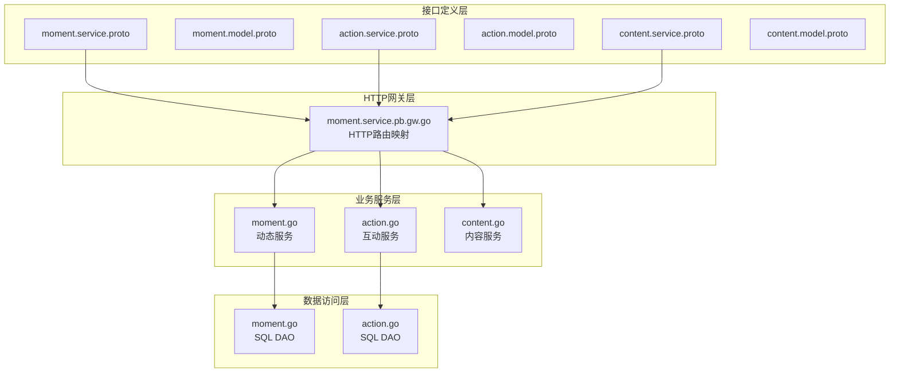
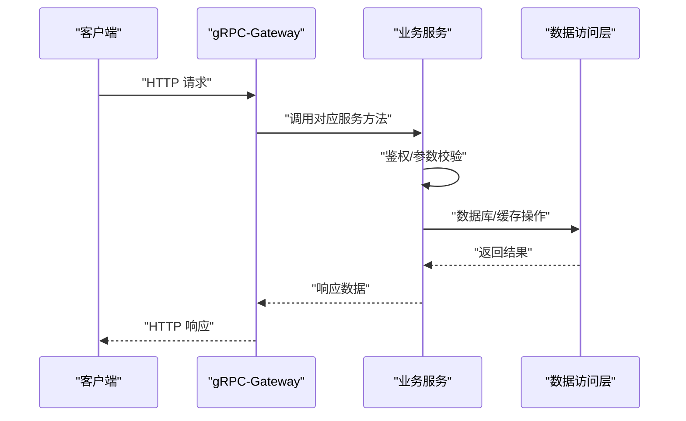
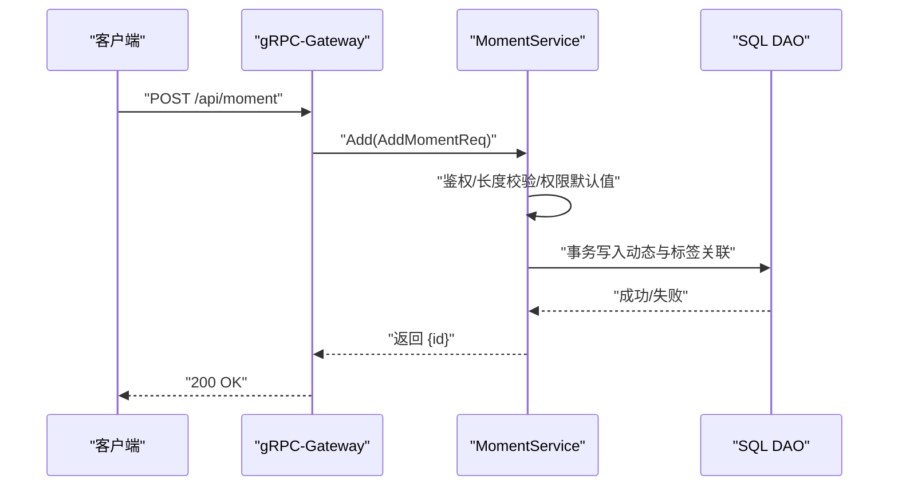
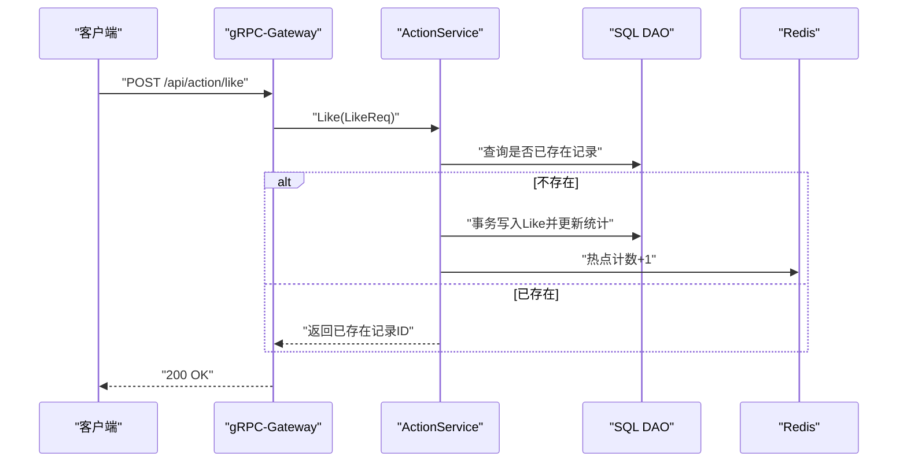
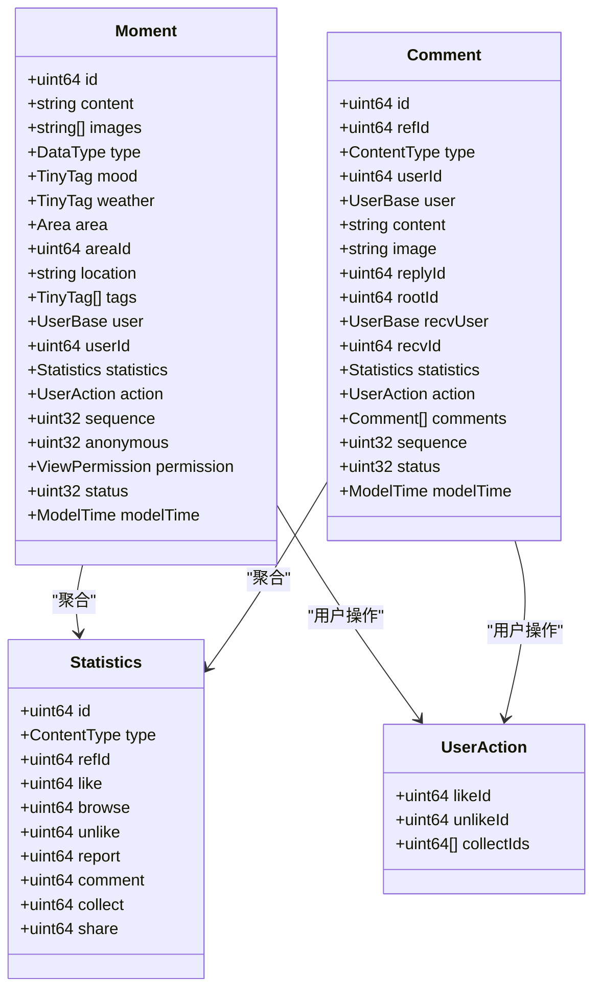
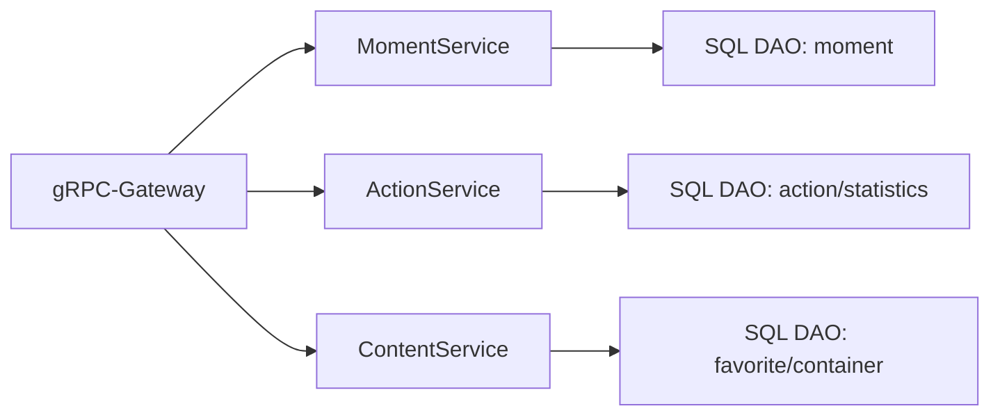

# 动态内容API

<cite>
**本文档引用的文件**
- [moment.service.proto](file://proto/content/moment.service.proto)
- [moment.model.proto](file://proto/content/moment.model.proto)
- [action.service.proto](file://proto/content/action.service.proto)
- [action.model.proto](file://proto/content/action.model.proto)
- [content.service.proto](file://proto/content/content.service.proto)
- [content.model.proto](file://proto/content/content.model.proto)
- [moment.go](file://server/go/content/service/moment.go)
- [action.go](file://server/go/content/service/action.go)
- [content.go](file://server/go/content/service/content.go)
- [moment.go](file://server/go/content/data/db/moment.go)
- [action.go](file://server/go/content/data/db/action.go)
- [moment.service.pb.gw.go](file://server/go/protobuf/content/moment.service.pb.gw.go)
</cite>

## 目录
1. [简介](#简介)
2. [项目结构](#项目结构)
3. [核心组件](#核心组件)
4. [架构总览](#架构总览)
5. [详细组件分析](#详细组件分析)
6. [依赖关系分析](#依赖关系分析)
7. [性能考虑](#性能考虑)
8. [故障排查指南](#故障排查指南)
9. [结论](#结论)
10. [附录](#附录)

## 简介
本文件为动态内容API的完整RESTful接口文档，覆盖动态（瞬间）的创建、编辑、删除、查询、列表、热门推荐等能力，并包含评论、点赞、收藏、举报等互动功能，以及收藏夹、合集、用户统计等扩展能力。文档基于gRPC-Gateway与Protobuf定义，提供HTTP接口映射、数据模型说明、权限与隐私控制、内容审核机制、统计与搜索、标签系统等。

## 项目结构
动态内容API由以下层次构成：
- 接口定义层：通过Proto文件定义服务、消息与枚举，统一跨语言契约
- HTTP网关层：gRPC-Gateway将HTTP请求映射到对应gRPC服务方法
- 业务服务层：Go实现的服务逻辑，负责鉴权、参数校验、调用DAO与外部服务
- 数据访问层：SQL DAO封装数据库操作，Redis用于热点计数等缓存场景
- 模型与枚举：统一的数据结构与状态枚举，确保前后端一致性

**图表来源**
- [moment.service.proto:23-85](file://proto/content/moment.service.proto#L23-L85)
- [action.service.proto:23-108](file://proto/content/action.service.proto#L23-L108)
- [content.service.proto:18-94](file://proto/content/content.service.proto#L18-L94)
- [moment.service.pb.gw.go:239-307](file://server/go/protobuf/content/moment.service.pb.gw.go#L239-L307)
- [moment.go:34-329](file://server/go/content/service/moment.go#L34-L329)
- [action.go:26-411](file://server/go/content/service/action.go#L26-L411)
- [content.go:20-153](file://server/go/content/service/content.go#L20-L153)
- [moment.go:13-28](file://server/go/content/data/db/moment.go#L13-L28)
- [action.go:19-168](file://server/go/content/data/db/action.go#L19-L168)

**章节来源**
- [moment.service.proto:1-116](file://proto/content/moment.service.proto#L1-L116)
- [action.service.proto:1-171](file://proto/content/action.service.proto#L1-L171)
- [content.service.proto:1-144](file://proto/content/content.service.proto#L1-L144)
- [moment.service.pb.gw.go:239-307](file://server/go/protobuf/content/moment.service.pb.gw.go#L239-L307)

## 核心组件
- 动态服务（MomentService）
  - 提供动态详情、新增、列表、删除接口；支持匿名、权限控制、标签、地理位置、图片等多媒体字段
- 互动服务（ActionService）
  - 提供点赞/取消点赞、评论、评论列表、收藏、举报、用户当前操作查询等
- 内容服务（ContentService）
  - 提供收藏夹与合集的创建、修改、列表等能力，以及用户内容统计

**章节来源**
- [moment.service.proto:23-85](file://proto/content/moment.service.proto#L23-L85)
- [action.service.proto:23-108](file://proto/content/action.service.proto#L23-L108)
- [content.service.proto:18-94](file://proto/content/content.service.proto#L18-L94)

## 架构总览
动态内容API采用“Proto定义 + gRPC-Gateway + 业务服务 + DAO”的分层架构。HTTP请求经由gRPC-Gateway映射到对应服务方法，服务层完成鉴权与业务逻辑，DAO层执行数据库与缓存操作。

**图表来源**
- [moment.service.pb.gw.go:239-307](file://server/go/protobuf/content/moment.service.pb.gw.go#L239-L307)
- [moment.go:42-115](file://server/go/content/service/moment.go#L42-L115)
- [action.go:30-77](file://server/go/content/service/action.go#L30-L77)
- [content.go:28-63](file://server/go/content/service/content.go#L28-L63)

## 详细组件分析

### 动态服务（MomentService）
- 接口清单
  - GET /api/moment/{id}：动态详情
  - POST /api/moment：新建动态
  - PUT /api/moment/{id}：更新动态（当前未实现）
  - GET /api/moment：动态列表
  - DELETE /api/moment/{id}：删除动态
- 数据模型要点
  - 文本内容、图片数组、类型（文本/图片/视频等）、心情、天气、地区、位置、标签、匿名、权限、统计、用户信息等
- 权限与隐私
  - 支持匿名显示与多种查看权限（公开、仅自己、主页、陌生人、屏蔽、开放）
  - 详情与列表在匿名状态下会隐藏用户信息
- 审核机制
  - 状态字段为只读，便于后端统一管理审核流程
- 热门推荐
  - 通过Redis热点计数进行热度排序（点赞/评论/收藏等行为触发）

**图表来源**
- [moment.service.proto:40-50](file://proto/content/moment.service.proto#L40-L50)
- [moment.go:123-211](file://server/go/content/service/moment.go#L123-L211)
- [moment.service.pb.gw.go:239-252](file://server/go/protobuf/content/moment.service.pb.gw.go#L239-L252)

**章节来源**
- [moment.service.proto:23-85](file://proto/content/moment.service.proto#L23-L85)
- [moment.model.proto:19-46](file://proto/content/moment.model.proto#L19-L46)
- [moment.go:42-115](file://server/go/content/service/moment.go#L42-L115)
- [moment.go:216-312](file://server/go/content/service/moment.go#L216-L312)
- [moment.go:314-328](file://server/go/content/service/moment.go#L314-L328)

### 互动服务（ActionService）
- 接口清单
  - POST /api/action/like：点赞/取消点赞/浏览
  - DELETE /api/action/like/{id}：取消点赞
  - POST /api/action/comment：发表评论
  - GET /api/action/comment：评论列表
  - DELETE /api/action/comment/{id}：删除评论
  - POST /api/action/collect：收藏（支持多收藏夹）
  - POST /api/action/report：举报
  - GET /api/userAction/{type}/{refId}：查询用户对某内容的操作
- 数据模型要点
  - 评论支持回复/根评论、图片、接收人等
  - 统一的统计字段（点赞、浏览、不喜欢、举报、评论、收藏、分享）
  - 用户当前操作（likeId/unlikeId/collectIds）
- 权限与审核
  - 删除评论需验证作者或内容作者身份
  - 举报触发限制与统计更新
- 热度与统计
  - 点赞/评论/收藏/举报等行为更新统计表
  - Redis热点计数用于热门排序

**图表来源**
- [action.service.proto:28-47](file://proto/content/action.service.proto#L28-L47)
- [action.go:30-77](file://server/go/content/service/action.go#L30-L77)
- [action.go:19-51](file://server/go/content/data/db/action.go#L19-L51)

**章节来源**
- [action.service.proto:23-108](file://proto/content/action.service.proto#L23-L108)
- [action.model.proto:95-115](file://proto/content/action.model.proto#L95-L115)
- [action.go:30-108](file://server/go/content/service/action.go#L30-L108)
- [action.go:110-190](file://server/go/content/service/action.go#L110-L190)
- [action.go:192-254](file://server/go/content/service/action.go#L192-L254)
- [action.go:256-290](file://server/go/content/service/action.go#L256-L290)
- [action.go:292-372](file://server/go/content/service/action.go#L292-L372)
- [action.go:379-410](file://server/go/content/service/action.go#L379-L410)
- [action.go:19-51](file://server/go/content/data/db/action.go#L19-L51)

### 内容服务（ContentService）
- 接口清单
  - GET /api/content/fav/{userId}：收藏夹列表
  - GET /api/content/tinyFav/{userId}：精简收藏夹列表
  - POST /api/content/fav：创建收藏夹
  - PUT /api/content/fav/{id}：修改收藏夹
  - POST /api/content/set：创建合集
  - PUT /api/content/set/{id}：修改合集
  - GET /api/content/userStatistics/{id}：用户内容统计
- 数据模型要点
  - 收藏夹与合集支持匿名、权限、排序、封面等
  - 用户统计包含各类内容数量

**章节来源**
- [content.service.proto:18-94](file://proto/content/content.service.proto#L18-L94)
- [content.model.proto:90-122](file://proto/content/content.model.proto#L90-L122)
- [content.go:28-108](file://server/go/content/service/content.go#L28-L108)
- [content.go:111-152](file://server/go/content/service/content.go#L111-L152)

### 数据模型与枚举
- 动态（Moment）
  - 字段：id、content、images、type、mood、weather、area、areaId、location、tags、user、userId、statistics、action、sequence、anonymous、permission、status、modelTime
  - 支持文本、图片、视频等多媒体类型
- 互动（Action/Comment/Like/Collect/Report）
  - 统一的ContentType标识、RefId关联、用户信息、时间戳、状态
  - 评论支持树形结构（rootId/replyId）
- 权限与容器
  - ViewPermission枚举定义可见范围
  - Container/Favorite结构支持收藏夹与合集

**图表来源**
- [moment.model.proto:19-46](file://proto/content/moment.model.proto#L19-L46)
- [action.model.proto:95-134](file://proto/content/action.model.proto#L95-L134)
- [content.model.proto:110-122](file://proto/content/content.model.proto#L110-L122)

**章节来源**
- [moment.model.proto:19-46](file://proto/content/moment.model.proto#L19-L46)
- [action.model.proto:95-134](file://proto/content/action.model.proto#L95-L134)
- [content.model.proto:110-122](file://proto/content/content.model.proto#L110-L122)

## 依赖关系分析
- 服务到DAO的依赖
  - MomentService依赖SQL DAO进行动态的增删改查与统计聚合
  - ActionService依赖SQL DAO进行点赞/评论/收藏/举报等操作与统计更新，并调用Redis进行热点计数
  - ContentService依赖SQL DAO进行收藏夹与合集的CRUD
- HTTP网关到服务的依赖
  - gRPC-Gateway根据Proto注解自动注册HTTP路由，将HTTP动词映射到对应RPC方法

**图表来源**
- [moment.service.pb.gw.go:239-307](file://server/go/protobuf/content/moment.service.pb.gw.go#L239-L307)
- [moment.go:34-36](file://server/go/content/service/moment.go#L34-L36)
- [action.go:26-28](file://server/go/content/service/action.go#L26-L28)
- [content.go:20-22](file://server/go/content/service/content.go#L20-L22)

**章节来源**
- [moment.go:42-115](file://server/go/content/service/moment.go#L42-L115)
- [action.go:30-77](file://server/go/content/service/action.go#L30-L77)
- [content.go:28-63](file://server/go/content/service/content.go#L28-L63)

## 性能考虑
- 热点计数
  - 通过Redis对点赞/评论/收藏等行为进行增量计数，降低数据库压力
- 批量查询与聚合
  - 列表接口一次性拉取动态、标签、统计、用户基础信息并聚合，减少多次往返
- 事务与幂等
  - 新增动态、评论、收藏等关键路径使用事务保证一致性；点赞/取消点赞通过唯一索引避免重复
- 分页与排序
  - 列表接口支持分页与按创建时间倒序排序，满足大数据量场景

[本节为通用性能建议，不直接分析具体文件]

## 故障排查指南
- 常见错误码
  - 参数无效：输入内容长度不足、必填字段缺失
  - 权限不足：非本人操作（删除评论需验证作者或内容作者）
  - 资源不存在：动态/评论/收藏夹不存在
  - 数据库错误：SQL执行异常
  - Redis错误：热点计数写入失败
- 排查步骤
  - 检查请求参数与鉴权头
  - 查看服务日志定位错误位置
  - 验证数据库事务是否回滚
  - 确认Redis连接与键空间状态

**章节来源**
- [moment.go:125-127](file://server/go/content/service/moment.go#L125-L127)
- [action.go:87-93](file://server/go/content/service/action.go#L87-L93)
- [action.go:163-173](file://server/go/content/service/action.go#L163-L173)
- [action.go:72-75](file://server/go/content/service/action.go#L72-L75)
- [action.go:143-144](file://server/go/content/service/action.go#L143-L144)

## 结论
动态内容API以Proto定义为核心，结合gRPC-Gateway提供清晰的HTTP接口，配合完善的业务服务与DAO层，实现了从动态发布、编辑、删除、查询到互动、统计、权限控制的全链路能力。通过Redis热点计数与批量聚合查询，兼顾了性能与可维护性。后续可在评论树形结构、搜索与标签系统方面进一步完善。

[本节为总结性内容，不直接分析具体文件]

## 附录

### 接口定义与示例路径
- 动态详情
  - 方法：GET
  - 路径：/api/moment/{id}
  - 示例路径：[moment.service.proto:29-38](file://proto/content/moment.service.proto#L29-L38)
- 新建动态
  - 方法：POST
  - 路径：/api/moment
  - 示例路径：[moment.service.proto:40-50](file://proto/content/moment.service.proto#L40-L50)
- 更新动态
  - 方法：PUT
  - 路径：/api/moment/{id}
  - 示例路径：[moment.service.proto:52-62](file://proto/content/moment.service.proto#L52-L62)
- 动态列表
  - 方法：GET
  - 路径：/api/moment
  - 示例路径：[moment.service.proto:64-73](file://proto/content/moment.service.proto#L64-L73)
- 删除动态
  - 方法：DELETE
  - 路径：/api/moment/{id}
  - 示例路径：[moment.service.proto:75-84](file://proto/content/moment.service.proto#L75-L84)

- 点赞/取消点赞
  - 方法：POST/DELETE
  - 路径：/api/action/like、/api/action/like/{id}
  - 示例路径：[action.service.proto:28-47](file://proto/content/action.service.proto#L28-L47)
- 发表评论
  - 方法：POST
  - 路径：/api/action/comment
  - 示例路径：[action.service.proto:48-57](file://proto/content/action.service.proto#L48-L57)
- 评论列表
  - 方法：GET
  - 路径：/api/action/comment
  - 示例路径：[action.service.proto:58-67](file://proto/content/action.service.proto#L58-L67)
- 删除评论
  - 方法：DELETE
  - 路径：/api/action/comment/{id}
  - 示例路径：[action.service.proto:68-77](file://proto/content/action.service.proto#L68-L77)
- 收藏
  - 方法：POST
  - 路径：/api/action/collect
  - 示例路径：[action.service.proto:78-87](file://proto/content/action.service.proto#L78-L87)
- 举报
  - 方法：POST
  - 路径：/api/action/report
  - 示例路径：[action.service.proto:88-97](file://proto/content/action.service.proto#L88-L97)
- 用户操作
  - 方法：GET
  - 路径：/api/userAction/{type}/{refId}
  - 示例路径：[action.service.proto:98-107](file://proto/content/action.service.proto#L98-L107)

- 收藏夹列表
  - 方法：GET
  - 路径：/api/content/fav/{userId}
  - 示例路径：[content.service.proto:23-32](file://proto/content/content.service.proto#L23-L32)
- 精简收藏夹列表
  - 方法：GET
  - 路径：/api/content/tinyFav/{userId}
  - 示例路径：[content.service.proto:33-42](file://proto/content/content.service.proto#L33-L42)
- 创建收藏夹
  - 方法：POST
  - 路径：/api/content/fav
  - 示例路径：[content.service.proto:43-52](file://proto/content/content.service.proto#L43-L52)
- 修改收藏夹
  - 方法：PUT
  - 路径：/api/content/fav/{id}
  - 示例路径：[content.service.proto:53-62](file://proto/content/content.service.proto#L53-L62)
- 创建合集
  - 方法：POST
  - 路径：/api/content/set
  - 示例路径：[content.service.proto:63-72](file://proto/content/content.service.proto#L63-L72)
- 修改合集
  - 方法：PUT
  - 路径：/api/content/set/{id}
  - 示例路径：[content.service.proto:73-82](file://proto/content/content.service.proto#L73-L82)
- 用户统计
  - 方法：GET
  - 路径：/api/content/userStatistics/{id}
  - 示例路径：[content.service.proto:83-92](file://proto/content/content.service.proto#L83-L92)

### 数据模型字段说明
- 动态（Moment）
  - content：动态文本内容
  - images：图片URL数组
  - type：内容类型（文本/图片/视频等）
  - mood/weather：心情/天气标签
  - area/areaId/location：地区与位置
  - tags：标签数组
  - anonymous：是否匿名
  - permission：查看权限
  - statistics：统计信息（点赞/浏览/评论/收藏等）
  - action：用户当前操作（likeId/unlikeId/collectIds）
- 评论（Comment）
  - content/image：评论内容与图片
  - replyId/rootId：回复与根评论ID
  - recvId/recvUser：接收人信息
  - comments：子评论集合
- 统计（Statistics）
  - like/browse/unlike/report/comment/collect/share：各维度计数

**章节来源**
- [moment.model.proto:19-46](file://proto/content/moment.model.proto#L19-L46)
- [action.model.proto:95-128](file://proto/content/action.model.proto#L95-L128)
- [content.model.proto:110-122](file://proto/content/content.model.proto#L110-L122)