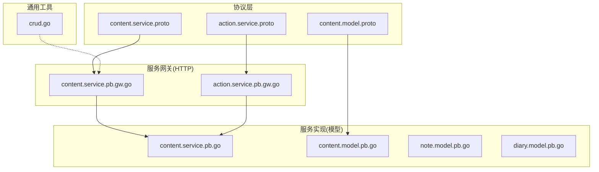
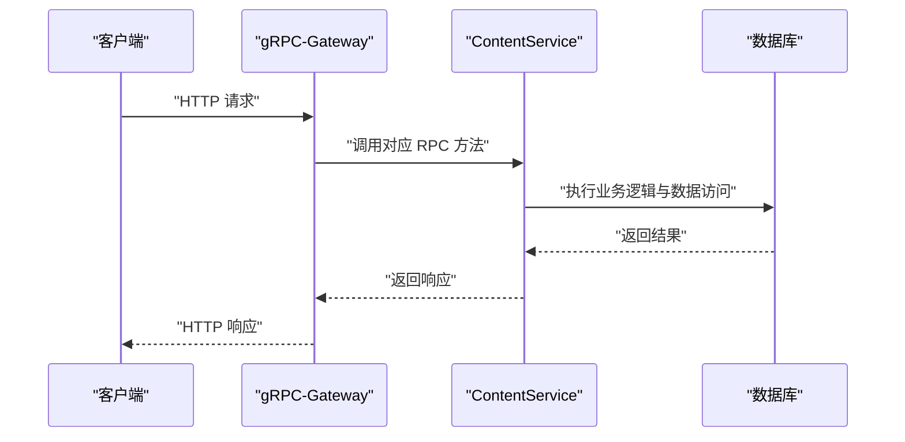
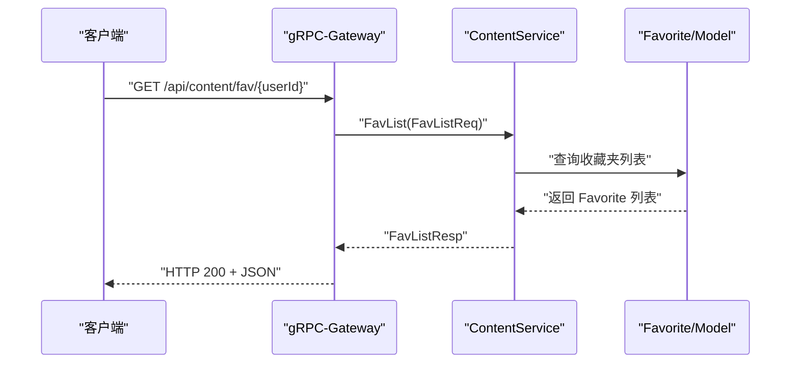
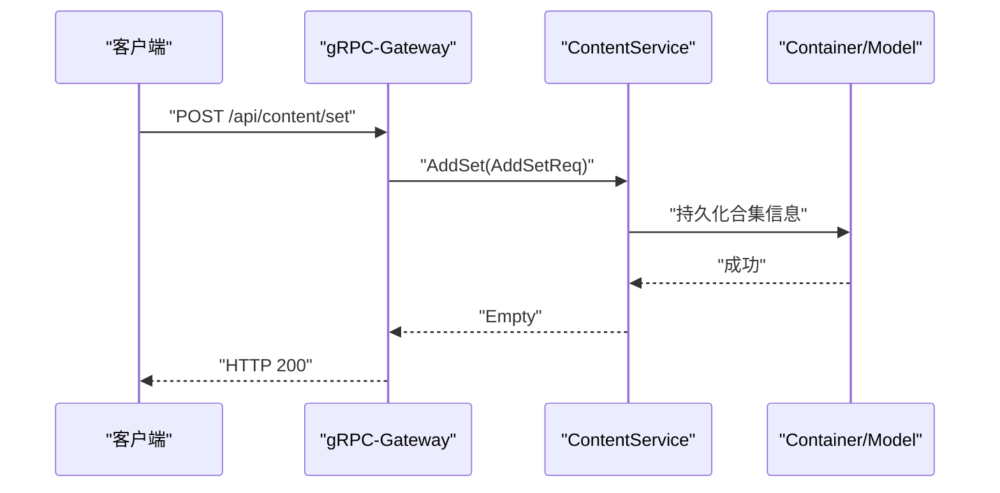
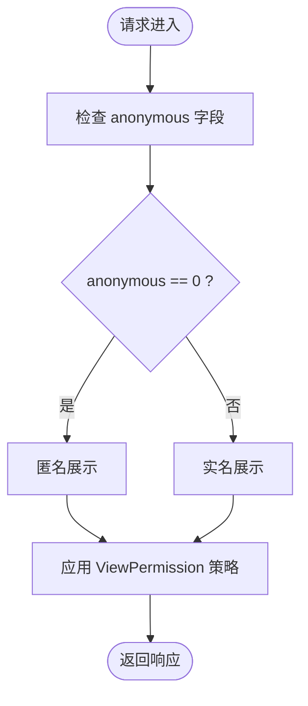
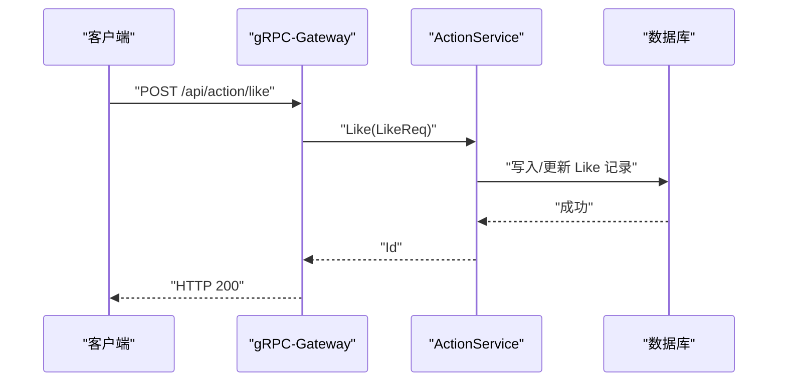
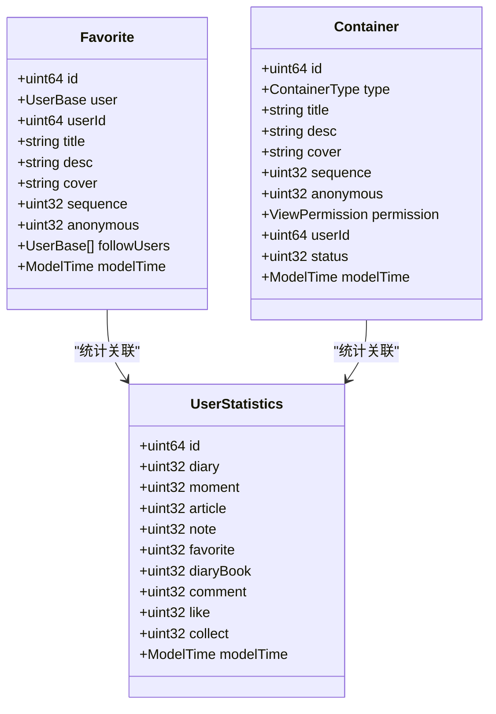
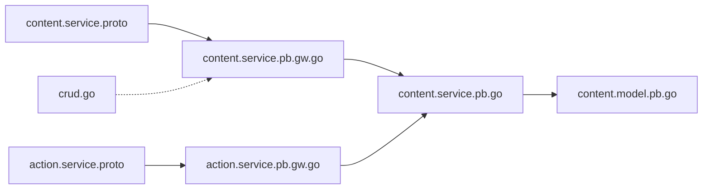

# 收藏夹与合集API

<cite>
**本文档引用的文件**
- [content.service.proto](file://proto/content/content.service.proto)
- [content.model.proto](file://proto/content/content.model.proto)
- [action.service.proto](file://proto/content/action.service.proto)
- [content.service.pb.gw.go](file://server/go/protobuf/content/content.service.pb.gw.go)
- [action.service.pb.gw.go](file://server/go/protobuf/content/action.service.pb.gw.go)
- [content.service.pb.go](file://server/go/protobuf/content/content.service.pb.go)
- [content.model.pb.go](file://server/go/protobuf/content/content.model.pb.go)
- [note.model.pb.go](file://server/go/protobuf/content/note.model.pb.go)
- [diary.model.pb.go](file://server/go/protobuf/content/diary.model.pb.go)
- [crud.go](file://thirdparty/scaffold/gin/crud/crud.go)
</cite>

## 目录
1. [简介](#简介)
2. [项目结构](#项目结构)
3. [核心组件](#核心组件)
4. [架构总览](#架构总览)
5. [详细组件分析](#详细组件分析)
6. [依赖关系分析](#依赖关系分析)
7. [性能考量](#性能考量)
8. [故障排查指南](#故障排查指南)
9. [结论](#结论)
10. [附录](#附录)

## 简介
本文件为“收藏夹与合集API”的权威技术文档，覆盖以下能力域：
- 收藏夹：创建、编辑、删除、查询（完整列表与精简列表）、关注、统计
- 合集：创建、编辑、内容归档、分类管理、公开设置
- 权限控制：匿名收藏、公开/私密/主页可见等策略
- 社交功能：点赞、评论、收藏、举报、用户行为查询
- 统计与推荐：用户内容统计、热门/推荐算法接口（按需扩展）
- 批量与导入导出：批量管理、内容去重（按需扩展）

本API基于gRPC-Gateway与OpenAPI注解生成HTTP接口，模型定义采用Protocol Buffers，服务层通过Go实现。

## 项目结构
围绕收藏夹与合集的核心文件组织如下：
- 协议定义：proto/content/*.proto
- 服务网关：server/go/protobuf/content/*service*.pb.gw.go
- 模型定义：server/go/protobuf/content/*model*.pb.go
- 通用CRUD脚手架：thirdparty/scaffold/gin/crud/crud.go

**图表来源**
- [content.service.proto:18-94](file://proto/content/content.service.proto#L18-L94)
- [content.model.proto:90-122](file://proto/content/content.model.proto#L90-L122)
- [action.service.proto:23-108](file://proto/content/action.service.proto#L23-L108)
- [content.service.pb.gw.go:420-453](file://server/go/protobuf/content/content.service.pb.gw.go#L420-L453)
- [action.service.pb.gw.go:439-472](file://server/go/protobuf/content/action.service.pb.gw.go#L439-L472)
- [content.service.pb.go:32-54](file://server/go/protobuf/content/content.service.pb.go#L32-L54)
- [content.model.pb.go:90-122](file://server/go/protobuf/content/content.model.pb.go#L90-L122)
- [note.model.pb.go:106-120](file://server/go/protobuf/content/note.model.pb.go#L106-L120)
- [diary.model.pb.go:243-257](file://server/go/protobuf/content/diary.model.pb.go#L243-L257)
- [crud.go:24-28](file://thirdparty/scaffold/gin/crud/crud.go#L24-L28)

**章节来源**
- [content.service.proto:1-144](file://proto/content/content.service.proto#L1-L144)
- [content.model.proto:1-187](file://proto/content/content.model.proto#L1-L187)
- [action.service.proto:1-171](file://proto/content/action.service.proto#L1-L171)
- [content.service.pb.gw.go:312-500](file://server/go/protobuf/content/content.service.pb.gw.go#L312-L500)
- [action.service.pb.gw.go:434-472](file://server/go/protobuf/content/action.service.pb.gw.go#L434-L472)
- [crud.go:1-28](file://thirdparty/scaffold/gin/crud/crud.go#L1-L28)

## 核心组件
- ContentService：收藏夹与合集相关接口
- ActionService：点赞、评论、收藏、举报、用户行为查询
- 模型：Favorite、Container、UserStatistics、ViewPermission、ContentType等

关键字段与枚举：
- Favorite：id、userId、title、desc、cover、sequence、anonymous、followUsers、modelTime
- Container：id、type、title、desc、cover、sequence、anonymous、permission、userId、status、modelTime
- UserStatistics：id、diary、moment、article、note、favorite、diaryBook、comment、like、collect
- ViewPermission：无限制、仅自己、主页、陌生人、屏蔽部分人、开放部分人
- ContentType：瞬间、笔记、日记、日记本、收藏夹、收藏、评论

**章节来源**
- [content.model.proto:90-122](file://proto/content/content.model.proto#L90-L122)
- [content.model.proto:166-175](file://proto/content/content.model.proto#L166-L175)
- [content.model.proto:125-135](file://proto/content/content.model.proto#L125-L135)
- [content.model.proto:74-88](file://proto/content/content.model.proto#L74-L88)

## 架构总览
API通过gRPC-Gateway将gRPC服务映射为HTTP REST接口，请求在HTTP层完成路由与参数绑定后转发至gRPC服务实现。

**图表来源**
- [content.service.pb.gw.go:420-453](file://server/go/protobuf/content/content.service.pb.gw.go#L420-L453)
- [action.service.pb.gw.go:439-472](file://server/go/protobuf/content/action.service.pb.gw.go#L439-L472)

## 详细组件分析

### 收藏夹API
- 获取收藏夹列表
  - 方法：GET
  - 路径：/api/content/fav/{userId}
  - 请求体：无
  - 响应：FavListResp（total: int64, list: repeated Favorite）
- 获取收藏夹精简列表
  - 方法：GET
  - 路径：/api/content/tinyFav/{userId}
  - 请求体：无
  - 响应：TinyFavListResp（total: int64, list: repeated TinyFavorites）
- 创建收藏夹
  - 方法：POST
  - 路径：/api/content/fav
  - 请求体：AddFavReq（id、userId、title、description、cover、sequence、anonymous）
  - 响应：request.Id
- 编辑收藏夹
  - 方法：PUT
  - 路径：/api/content/fav/{id}
  - 请求体：AddFavReq
  - 响应：google.protobuf.Empty
- 删除收藏夹
  - 方法：DELETE
  - 路径：/api/content/fav/{id}
  - 请求体：无
  - 响应：google.protobuf.Empty
- 用户内容统计
  - 方法：GET
  - 路径：/api/content/userStatistics/{id}
  - 请求体：无
  - 响应：UserStatistics

**图表来源**
- [content.service.proto:23-32](file://proto/content/content.service.proto#L23-L32)
- [content.service.proto:44-52](file://proto/content/content.service.proto#L44-L52)
- [content.service.proto:54-62](file://proto/content/content.service.proto#L54-L62)
- [content.service.pb.gw.go:422-431](file://server/go/protobuf/content/content.service.pb.gw.go#L422-L431)

**章节来源**
- [content.service.proto:23-62](file://proto/content/content.service.proto#L23-L62)
- [content.service.proto:121-133](file://proto/content/content.service.proto#L121-L133)
- [content.service.pb.gw.go:316-347](file://server/go/protobuf/content/content.service.pb.gw.go#L316-L347)

### 合集API
- 创建合集
  - 方法：POST
  - 路径：/api/content/set
  - 请求体：AddSetReq（id、userId、type、title、description、cover、sequence、anonymous）
  - 响应：google.protobuf.Empty
- 编辑合集
  - 方法：PUT
  - 路径：/api/content/set/{id}
  - 请求体：AddSetReq
  - 响应：google.protobuf.Empty
- 删除合集
  - 方法：DELETE
  - 路径：/api/content/set/{id}
  - 请求体：无
  - 响应：google.protobuf.Empty

**图表来源**
- [content.service.proto:63-82](file://proto/content/content.service.proto#L63-L82)
- [content.service.pb.gw.go:349-369](file://server/go/protobuf/content/content.service.pb.gw.go#L349-L369)

**章节来源**
- [content.service.proto:63-82](file://proto/content/content.service.proto#L63-L82)
- [content.service.pb.gw.go:349-369](file://server/go/protobuf/content/content.service.pb.gw.go#L349-L369)

### 权限与匿名机制
- 匿名字段：收藏夹与合集均支持anonymous字段（0-匿名，1-实名），用于控制展示方式
- 查看权限：ViewPermission枚举支持多种可见范围（无限制、仅自己、主页、陌生人、屏蔽部分人、开放部分人）
- 用户ID：请求体中userId字段用于鉴权与归属校验

**图表来源**
- [content.model.proto:96-98](file://proto/content/content.model.proto#L96-L98)
- [content.model.proto:80-82](file://proto/content/content.model.proto#L80-L82)
- [content.model.proto:166-175](file://proto/content/content.model.proto#L166-L175)

**章节来源**
- [content.model.proto:96-98](file://proto/content/content.model.proto#L96-L98)
- [content.model.proto:80-82](file://proto/content/content.model.proto#L80-L82)
- [content.model.proto:166-175](file://proto/content/content.model.proto#L166-L175)

### 社交与互动API
- 点赞/取消点赞
  - 方法：POST/DELETE
  - 路径：/api/action/like、/api/action/like/{id}
  - 请求体：LikeReq（type、refId、action、userId）
  - 响应：Id/Empty
- 评论/评论列表/删除评论
  - 方法：POST/GET/DELETE
  - 路径：/api/action/comment、/api/action/comment、/api/action/comment/{id}
  - 请求体：CommentReq（type、refId、user、content、image、replyId、rootId、recvId、sequence）
  - 响应：Id/CommentListResp/Empty
- 收藏
  - 方法：POST
  - 路径：/api/action/collect
  - 请求体：CollectReq（type、refId、userId、favIds[]）
  - 响应：Empty
- 举报
  - 方法：POST
  - 路径：/api/action/report
  - 请求体：ReportReq（type、refId、userId、delReason）
  - 响应：Empty
- 用户行为查询
  - 方法：GET
  - 路径：/api/userAction/{type}/{refId}
  - 请求体：无
  - 响应：UserAction

**图表来源**
- [action.service.proto:28-47](file://proto/content/action.service.proto#L28-L47)
- [action.service.proto:48-77](file://proto/content/action.service.proto#L48-L77)
- [action.service.proto:78-97](file://proto/content/action.service.proto#L78-L97)
- [action.service.proto:98-107](file://proto/content/action.service.proto#L98-L107)
- [action.service.pb.gw.go:441-472](file://server/go/protobuf/content/action.service.pb.gw.go#L441-L472)

**章节来源**
- [action.service.proto:28-107](file://proto/content/action.service.proto#L28-L107)
- [action.service.pb.gw.go:434-472](file://server/go/protobuf/content/action.service.pb.gw.go#L434-L472)

### 数据模型与关系

**图表来源**
- [content.model.proto:90-122](file://proto/content/content.model.proto#L90-L122)
- [content.model.proto:74-88](file://proto/content/content.model.proto#L74-L88)
- [content.model.proto:110-122](file://proto/content/content.model.proto#L110-L122)

**章节来源**
- [content.model.proto:90-122](file://proto/content/content.model.proto#L90-L122)
- [content.model.proto:74-88](file://proto/content/content.model.proto#L74-L88)
- [content.model.proto:110-122](file://proto/content/content.model.proto#L110-L122)

## 依赖关系分析
- 协议到网关：content.service.proto/action.service.proto 定义RPC，对应 pb.gw.go 注册HTTP路由
- 网关到服务：gRPC-Gateway 将HTTP请求转换为gRPC调用
- 服务到模型：服务实现依赖生成的pb.go模型进行序列化/反序列化与数据库交互
- 通用CRUD：crud.go 提供统一的CRUD路由注册模式，便于扩展其他资源

**图表来源**
- [content.service.proto:18-94](file://proto/content/content.service.proto#L18-L94)
- [action.service.proto:23-108](file://proto/content/action.service.proto#L23-L108)
- [content.service.pb.gw.go:420-453](file://server/go/protobuf/content/content.service.pb.gw.go#L420-L453)
- [action.service.pb.gw.go:439-472](file://server/go/protobuf/content/action.service.pb.gw.go#L439-L472)
- [content.service.pb.go:32-54](file://server/go/protobuf/content/content.service.pb.go#L32-L54)
- [content.model.pb.go:90-122](file://server/go/protobuf/content/content.model.pb.go#L90-L122)
- [crud.go:24-28](file://thirdparty/scaffold/gin/crud/crud.go#L24-L28)

**章节来源**
- [content.service.pb.gw.go:420-453](file://server/go/protobuf/content/content.service.pb.gw.go#L420-L453)
- [action.service.pb.gw.go:439-472](file://server/go/protobuf/content/action.service.pb.gw.go#L439-L472)
- [crud.go:24-28](file://thirdparty/scaffold/gin/crud/crud.go#L24-L28)

## 性能考量
- 序列号排序：sequence字段用于同级排序与置顶，建议在查询时按sequence降序并配合分页
- 权限过滤：ViewPermission应在查询阶段即做权限过滤，避免返回敏感数据
- 批量操作：建议在服务层合并事务，减少往返开销
- 缓存策略：对热门收藏夹列表与用户统计可引入缓存，降低数据库压力

## 故障排查指南
- HTTP 404/405：确认请求方法与路径是否匹配，检查gRPC-Gateway路由注册
- HTTP 500：检查服务日志与数据库连接状态；确认请求体字段与模型定义一致
- 权限错误：核对userId与anonymous、ViewPermission配置是否符合预期
- 参数校验失败：根据validator注解与模型字段约束检查请求体

**章节来源**
- [content.service.pb.gw.go:316-347](file://server/go/protobuf/content/content.service.pb.gw.go#L316-L347)
- [action.service.pb.gw.go:441-472](file://server/go/protobuf/content/action.service.pb.gw.go#L441-L472)

## 结论
本API以Protocol Buffers为契约，结合gRPC-Gateway实现REST风格接口，覆盖收藏夹与合集的全生命周期管理，并提供权限控制、匿名展示、社交互动与用户统计能力。建议在生产环境完善鉴权中间件、缓存与监控体系，持续演进推荐与热门算法接口。

## 附录
- 快速集成步骤
  - 前端：使用OpenAPI/Swagger文档生成SDK或直接调用HTTP接口
  - 后端：通过gRPC客户端直连或经由gRPC-Gateway访问
  - 鉴权：在网关层注入OAuth/JWT中间件，校验userId与权限
- 扩展建议
  - 批量导入导出：新增Import/Export接口，支持去重与冲突处理
  - 推荐算法：新增GetRecommendations接口，返回热门/个性化内容
  - 主题与封面：扩展Favorite/Container模型字段，提供上传与裁剪接口