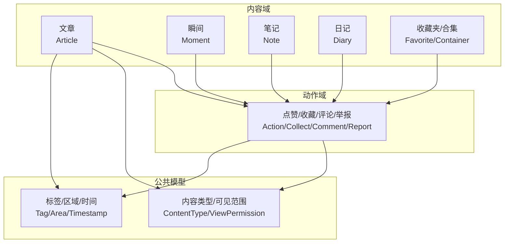
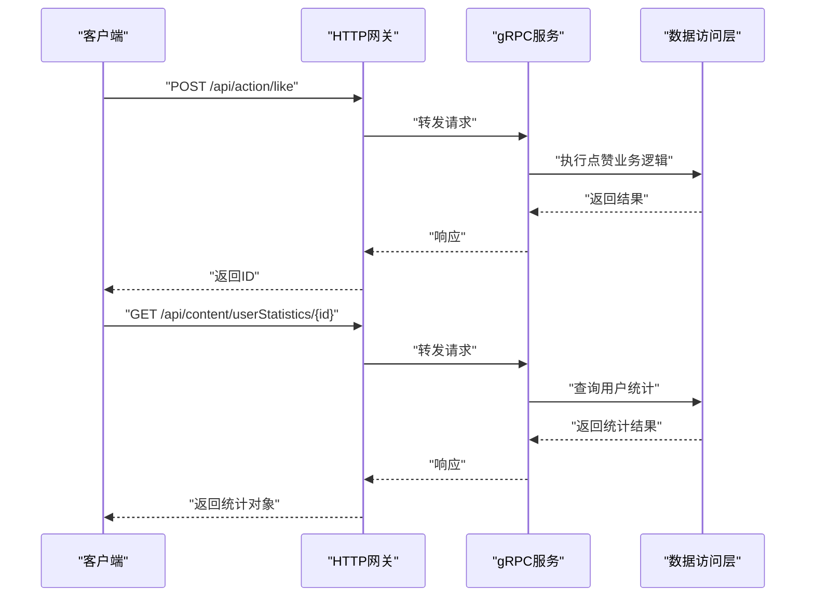
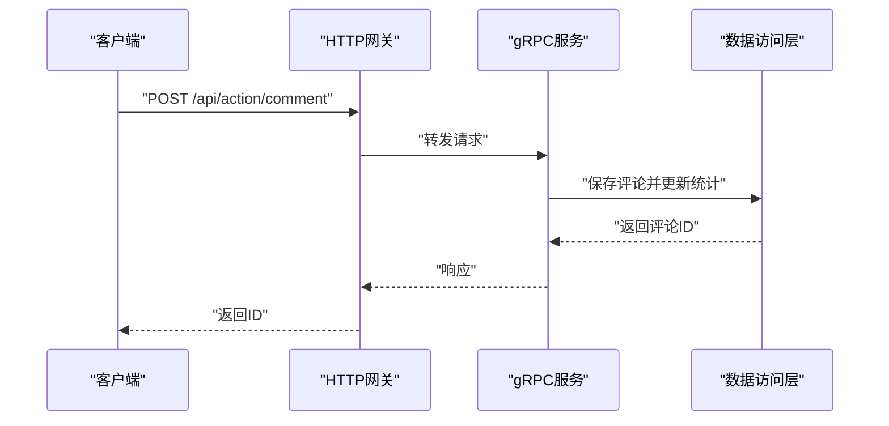
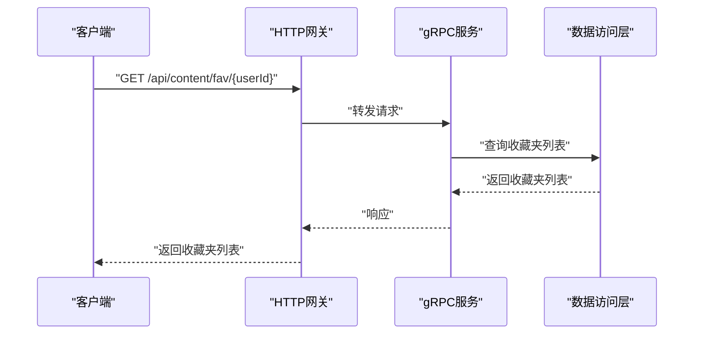
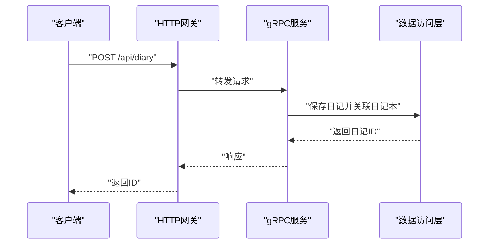
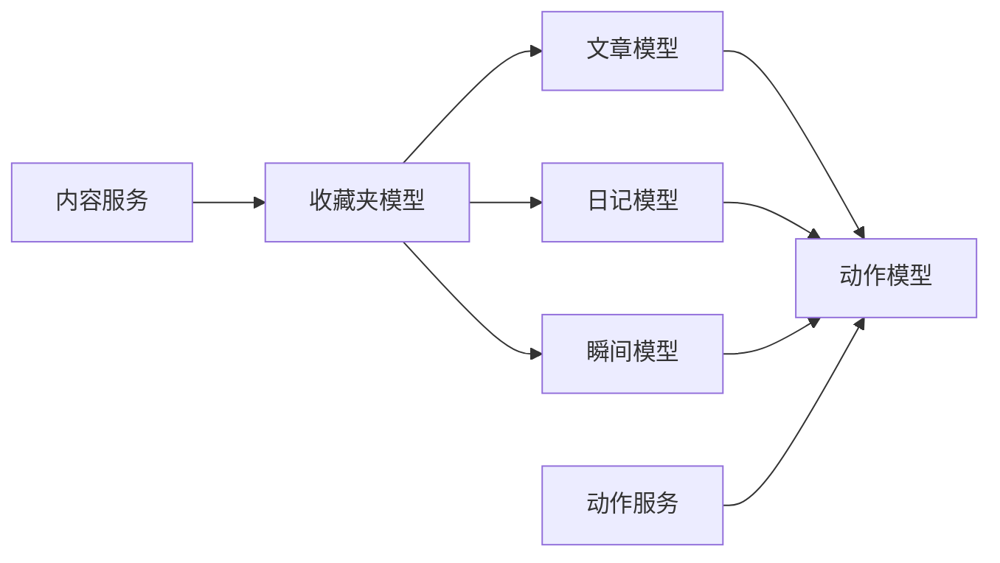

# 文章内容API

<cite>
**本文档引用的文件**
- [article.model.proto](file://proto/content/article.model.proto)
- [content.service.proto](file://proto/content/content.service.proto)
- [content.model.proto](file://proto/content/content.model.proto)
- [action.service.proto](file://proto/content/action.service.proto)
- [action.model.proto](file://proto/content/action.model.proto)
- [diary.service.proto](file://proto/content/diary.service.proto)
- [diary.model.proto](file://proto/content/diary.model.proto)
- [note.service.proto](file://proto/content/note.service.proto)
- [moment.service.proto](file://proto/content/moment.service.proto)
- [api.openapi.json](file://server/go/apidoc/api.openapi.json)
</cite>

## 目录
1. [简介](#简介)
2. [项目结构](#项目结构)
3. [核心组件](#核心组件)
4. [架构总览](#架构总览)
5. [详细组件分析](#详细组件分析)
6. [依赖关系分析](#依赖关系分析)
7. [性能考量](#性能考量)
8. [故障排查指南](#故障排查指南)
9. [结论](#结论)
10. [附录](#附录)

## 简介
本文件为“文章内容API”的权威技术文档，覆盖文章从草稿到发布的全生命周期，以及内容编辑、格式化、预览、分类标签、SEO支持、阅读统计、点赞收藏、评论互动、推荐与分发、版权保护与防盗链、导出分享嵌入、数据分析与后台管理等能力。文档基于仓库中的Proto定义与服务契约，结合HTTP映射与GraphQL标注，提供清晰的接口规范与集成指引。

## 项目结构
围绕内容与动作两大领域，API采用按功能域划分的服务组织方式：
- 内容域：文章、瞬间、笔记、日记、收藏夹/合集等
- 动作域：点赞、收藏、评论、举报、用户行为查询等
- 公共模型：内容类型、可见范围、标签、区域、时间戳、软删除等

图表来源
- [content.model.proto:125-187](file://proto/content/content.model.proto#L125-L187)
- [action.model.proto:137-171](file://proto/content/action.model.proto#L137-L171)

章节来源
- [content.model.proto:1-187](file://proto/content/content.model.proto#L1-187)
- [action.model.proto:1-171](file://proto/content/action.model.proto#L1-171)

## 核心组件
- 文章模型（Article）：包含标题、简介、摘要、正文、文本类型、标签、地区、权限、状态、创建时间、软删除等字段，并内嵌用户、点赞/收藏/评论用户集合。
- 内容服务（ContentService）：提供收藏夹/合集管理、用户内容统计等接口。
- 动作服务（ActionService）：提供点赞/取消点赞、评论、评论列表、收藏、举报、用户行为查询等接口。
- 日记服务（DiaryService）：提供日记本与日记的CRUD、列表、详情等接口。
- 笔记服务（NoteService）：提供笔记创建接口。
- 瞬间服务（MomentService）：提供瞬间的CRUD、列表、详情等接口。

章节来源
- [article.model.proto:17-44](file://proto/content/article.model.proto#L17-L44)
- [content.service.proto:18-94](file://proto/content/content.service.proto#L18-L94)
- [action.service.proto:23-108](file://proto/content/action.service.proto#L23-L108)
- [diary.service.proto:19-122](file://proto/content/diary.service.proto#L19-L122)
- [note.service.proto:21-40](file://proto/content/note.service.proto#L21-L40)
- [moment.service.proto:23-84](file://proto/content/moment.service.proto#L23-L84)

## 架构总览
下图展示文章内容API在HTTP与gRPC之间的映射关系，以及与GraphQL的标注：

图表来源
- [action.service.proto:29-47](file://proto/content/action.service.proto#L29-L47)
- [content.service.proto:84-92](file://proto/content/content.service.proto#L84-L92)

## 详细组件分析

### 文章内容API（Article）
- 能力范围
  - 发布/编辑/删除：通过通用内容模型与服务进行统一管理
  - 草稿管理：通过状态字段与权限控制实现草稿态与发布态切换
  - 内容编辑与格式化：通过正文字段承载富文本或Markdown内容
  - 预览功能：通过列表/详情接口返回渲染后的字段组合
  - 分类与标签：通过标签集合与内容标签关联实现
  - SEO支持：通过标题、简介、摘要、标签等字段支撑SEO元信息
  - 审核与发布：通过状态字段与权限控制实现审核流
  - 阅读统计、点赞收藏、评论互动：通过动作域接口实现
  - 推荐与分发：通过用户行为与内容统计进行个性化分发
  - 版权保护与防盗链：通过权限控制与平台分享记录实现
  - 导出与分享：通过平台分享记录与第三方集成实现
  - 数据分析与后台管理：通过用户统计与内容统计接口提供后台支持

- 关键字段说明
  - 标题、简介、摘要、正文、文本类型、标签、地区、位置、权限、状态、创建时间、软删除
  - 用户与点赞/收藏/评论用户集合

- 接口映射（基于Proto注解）
  - 文章详情/列表/新增/编辑/删除：通过通用内容模型与服务进行统一管理
  - 收藏夹/合集：通过内容服务提供
  - 用户统计：通过内容服务提供

章节来源
- [article.model.proto:17-44](file://proto/content/article.model.proto#L17-L44)
- [content.model.proto:43-70](file://proto/content/content.model.proto#L43-L70)
- [content.service.proto:18-94](file://proto/content/content.service.proto#L18-L94)

### 动作域API（Like/Collect/Comment/Report）
- 能力范围
  - 点赞/取消点赞：支持按内容类型与引用ID进行操作
  - 收藏：支持将内容加入收藏夹
  - 评论：支持评论与回复，支持树形结构
  - 举报：支持举报原因与备注
  - 用户行为查询：支持查询用户对某内容的操作状态

- 接口映射（基于Proto注解）
  - 点赞/取消点赞：POST/DELETE /api/action/like
  - 评论：POST /api/action/comment；GET /api/action/comment 查询列表
  - 收藏：POST /api/action/collect
  - 举报：POST /api/action/report
  - 用户行为：GET /api/userAction/{type}/{refId}

图表来源
- [action.service.proto:49-77](file://proto/content/action.service.proto#L49-L77)

章节来源
- [action.service.proto:23-108](file://proto/content/action.service.proto#L23-L108)
- [action.model.proto:95-134](file://proto/content/action.model.proto#L95-L134)

### 收藏夹与合集API（ContentService）
- 能力范围
  - 收藏夹列表/精简列表：支持按用户ID查询
  - 创建/修改收藏夹：支持标题、描述、封面、排序、匿名等
  - 创建/修改合集：支持类型、标题、描述、封面、排序、匿名等
  - 用户内容统计：支持按用户统计各类内容数量

- 接口映射（基于Proto注解）
  - 收藏夹列表：GET /api/content/fav/{userId}
  - 精简收藏夹列表：GET /api/content/tinyFav/{userId}
  - 创建收藏夹：POST /api/content/fav
  - 修改收藏夹：PUT /api/content/fav/{id}
  - 创建合集：POST /api/content/set
  - 修改合集：PUT /api/content/set/{id}
  - 用户统计：GET /api/content/userStatistics/{id}

图表来源
- [content.service.proto:24-42](file://proto/content/content.service.proto#L24-L42)

章节来源
- [content.service.proto:18-94](file://proto/content/content.service.proto#L18-L94)
- [content.model.proto:90-122](file://proto/content/content.model.proto#L90-L122)

### 日记API（DiaryService）
- 能力范围
  - 日记本：详情、列表、创建、修改
  - 日记：详情、新增、编辑、列表、删除
  - 支持标签、地区、权限、匿名等

- 接口映射（基于Proto注解）
  - 日记本详情：GET /api/diaryBook/{id}
  - 日记本列表：GET /api/diaryBook
  - 创建日记本：POST /api/diaryBook
  - 修改日记本：PUT /api/diaryBook/{id}
  - 日记详情：GET /api/diary/{id}
  - 新建日记：POST /api/diary
  - 修改日记：PUT /api/diary/{id}
  - 日记列表：GET /api/diary
  - 删除日记：DELETE /api/diary/{id}

图表来源
- [diary.service.proto:78-99](file://proto/content/diary.service.proto#L78-L99)

章节来源
- [diary.service.proto:19-122](file://proto/content/diary.service.proto#L19-L122)
- [diary.model.proto:19-44](file://proto/content/diary.model.proto#L19-L44)

### 笔记API（NoteService）
- 能力范围
  - 笔记创建：支持标题、内容、公开名等

- 接口映射（基于Proto注解）
  - 创建笔记：POST /api/note

章节来源
- [note.service.proto:21-40](file://proto/content/note.service.proto#L21-L40)

### 瞬间API（MomentService）
- 能力范围
  - 瞬间的详情、新增、编辑、列表、删除
  - 支持媒体类型、标签、地区、权限、匿名等

- 接口映射（基于Proto注解）
  - 瞬间详情：GET /api/moment/{id}
  - 新增瞬间：POST /api/moment
  - 编辑瞬间：PUT /api/moment/{id}
  - 瞬间列表：GET /api/moment
  - 删除瞬间：DELETE /api/moment/{id}

章节来源
- [moment.service.proto:23-84](file://proto/content/moment.service.proto#L23-L84)

### 内容模型与枚举
- 内容类型（ContentType）：涵盖瞬间、笔记、日记、日记本、收藏夹、收藏、评论等
- 可见范围（ViewPermission）：支持全部、仅自己、主页、陌生人、屏蔽、开放等
- 标签与属性：通过多对多关联实现灵活的内容标签与属性管理

章节来源
- [content.model.proto:125-187](file://proto/content/content.model.proto#L125-L187)
- [content.model.proto:19-70](file://proto/content/content.model.proto#L19-L70)

## 依赖关系分析
- 服务耦合
  - 文章/日记/瞬间等均依赖动作域（点赞、收藏、评论、举报）
  - 收藏夹/合集依赖内容域进行内容聚合
  - 用户统计依赖各内容域与动作域的数据汇总
- 外部依赖
  - HTTP网关与gRPC服务之间通过Proto注解映射
  - GraphQL通过标注支持查询与变更
- 潜在循环依赖
  - 当前模型采用消息内嵌与多对多关联，未见直接循环依赖

图表来源
- [content.model.proto:43-101](file://proto/content/content.model.proto#L43-L101)
- [action.model.proto:21-134](file://proto/content/action.model.proto#L21-L134)

章节来源
- [content.model.proto:1-187](file://proto/content/content.model.proto#L1-187)
- [action.model.proto:1-171](file://proto/content/action.model.proto#L1-171)

## 性能考量
- 查询优化
  - 合理使用索引字段（如type/id、userId、createdAt等）
  - 列表接口建议分页参数（pageNo/pageSize）避免一次性加载过多数据
- 写入优化
  - 批量操作与事务处理，减少多次往返
  - 对热点内容使用缓存（Redis）降低数据库压力
- 统计计算
  - 采用异步任务或延迟计算，避免阻塞主流程
- 权限控制
  - 在服务层统一校验权限，避免越权访问

## 故障排查指南
- 常见错误码
  - 参数校验失败：检查请求体与路径参数是否符合Proto注解要求
  - 权限不足：确认用户身份与内容权限设置
  - 重复操作：如重复点赞/收藏需在前端或服务层去重
- 日志与追踪
  - 结合OpenAPI文档与服务日志定位问题
  - 使用GraphQL查询与gRPC追踪工具定位调用链
- 数据一致性
  - 对关键操作（点赞/收藏/评论）进行幂等处理
  - 对软删除与状态字段进行一致性校验

章节来源
- [api.openapi.json:1-164](file://server/go/apidoc/api.openapi.json#L1-L164)

## 结论
本文档基于仓库中的Proto定义与服务注解，系统梳理了文章内容API的全生命周期能力与接口规范。通过统一的内容模型与动作模型，配合HTTP/gRPC与GraphQL的多入口支持，能够满足从草稿到发布的全流程需求，并为SEO、互动、推荐、版权保护、导出分享、数据分析等高级能力提供坚实基础。

## 附录
- 开放API文档
  - 项目内置OpenAPI文档可用于生成SDK与联调
- 集成建议
  - 前端：优先使用GraphQL查询减少网络开销
  - 后端：统一通过HTTP网关接入，确保鉴权与限流策略一致
  - 第三方：通过分享记录与平台枚举扩展更多渠道