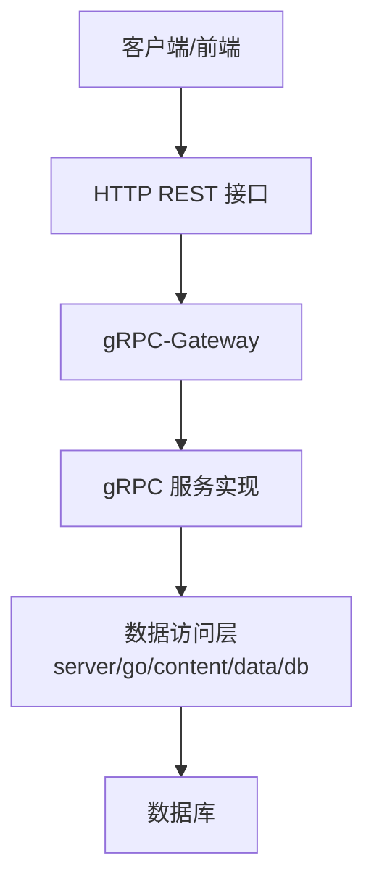
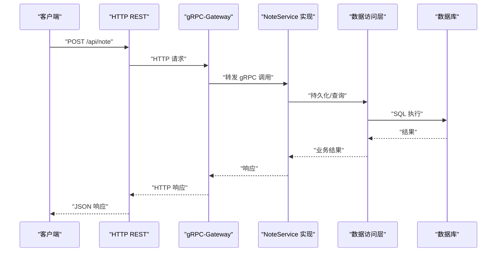
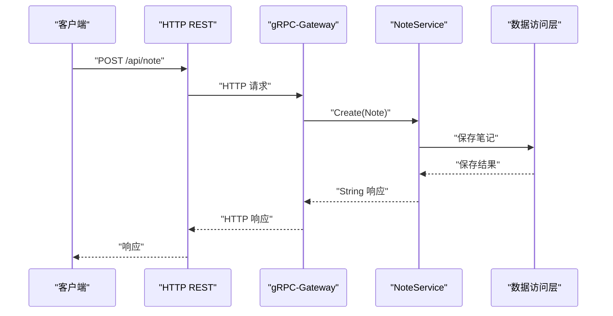
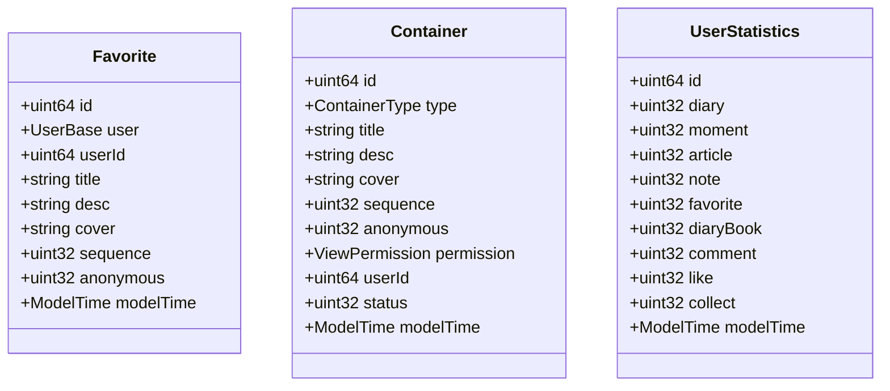
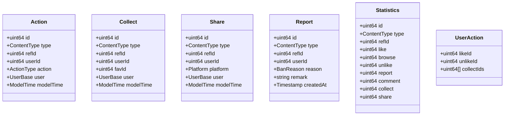
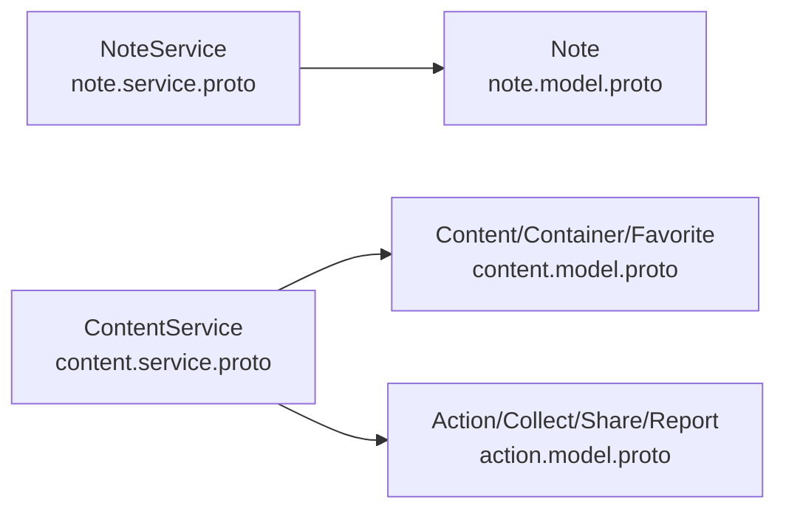

# 笔记内容API

<cite>
**本文档引用的文件**
- [note.service.proto](file://proto/content/note.service.proto)
- [note.model.proto](file://proto/content/note.model.proto)
- [content.service.proto](file://proto/content/content.service.proto)
- [content.model.proto](file://proto/content/content.model.proto)
- [action.model.proto](file://proto/content/action.model.proto)
- [diary.service.proto](file://proto/content/diary.service.proto)
- [moment.service.proto](file://proto/content/moment.service.proto)
- [note.go](file://server/go/content/service/note.go)
- [content.go](file://server/go/content/data/db/content.go)
</cite>

## 目录
1. [简介](#简介)
2. [项目结构](#项目结构)
3. [核心组件](#核心组件)
4. [架构总览](#架构总览)
5. [详细组件分析](#详细组件分析)
6. [依赖关系分析](#依赖关系分析)
7. [性能考虑](#性能考虑)
8. [故障排查指南](#故障排查指南)
9. [结论](#结论)
10. [附录](#附录)

## 简介
本文件为笔记内容API的全面技术文档，覆盖RESTful接口规范与协议定义，包括笔记的创建、编辑、删除、查询等基础能力；笔记草稿保存、正式发布、版本管理、内容编辑等扩展能力；笔记分类（收藏夹/合集）、标签系统、搜索过滤等组织能力；富文本编辑器集成方案（Markdown渲染、图片上传、代码高亮）；权限控制、协作编辑、历史版本回滚；统计、收藏、分享；以及导出、打印、PDF生成等周边能力。本文档同时提供接口调用流程图与时序图，帮助开发者快速理解并正确集成。

## 项目结构
围绕笔记内容API，后端采用gRPC-Gateway + OpenAPI v2 + Protobuf的现代化微服务架构。前端通过HTTP REST调用gRPC-Gateway代理，gRPC-Gateway再转发到对应的gRPC服务实现。模型定义集中在proto目录，服务实现位于server/go/content/service与server/go/content/data/db。

图表来源
- [note.service.proto:21-40](file://proto/content/note.service.proto#L21-L40)
- [content.service.proto:18-94](file://proto/content/content.service.proto#L18-L94)

章节来源
- [note.service.proto:1-47](file://proto/content/note.service.proto#L1-L47)
- [content.service.proto:1-144](file://proto/content/content.service.proto#L1-L144)

## 核心组件
- 笔记服务（NoteService）
  - 提供笔记创建等核心能力，当前已定义创建接口，其余CRUD接口在后续迭代中逐步完善。
- 内容服务（ContentService）
  - 提供收藏夹、合集、用户统计等聚合内容能力，支持收藏夹列表、创建/修改收藏夹、创建/修改合集、用户内容统计等。
- 动作模型（Action/Collect/Like/Share/Report等）
  - 定义点赞、收藏、分享、举报等用户行为与统计维度，支撑协作与社交功能。
- 数据模型（Content/Container/Favorite/UserStatistics等）
  - 定义笔记、容器（收藏夹/合集）、收藏关系、用户统计等数据结构与枚举。

章节来源
- [note.service.proto:21-40](file://proto/content/note.service.proto#L21-L40)
- [content.service.proto:18-94](file://proto/content/content.service.proto#L18-L94)
- [action.model.proto:21-171](file://proto/content/action.model.proto#L21-L171)
- [content.model.proto:43-122](file://proto/content/content.model.proto#L43-L122)

## 架构总览
下图展示从HTTP请求到gRPC服务再到数据层的整体调用链路，以及OpenAPI注解如何驱动Swagger文档生成。

图表来源
- [note.service.proto:27-37](file://proto/content/note.service.proto#L27-L37)
- [note.go:14-16](file://server/go/content/service/note.go#L14-L16)

章节来源
- [note.service.proto:15-19](file://proto/content/note.service.proto#L15-L19)
- [note.go:10-16](file://server/go/content/service/note.go#L10-L16)

## 详细组件分析

### 笔记服务（NoteService）
- 服务定位：提供笔记的创建、编辑、删除、查询等基础能力。
- 当前实现：已定义创建接口，返回字符串值作为占位响应；其他CRUD接口待补充。
- 接口定义（基于proto注解）
  - 创建笔记
    - 方法：POST
    - 路径：/api/note
    - 请求体：*（全量字段）
    - 返回：字符串值
    - GraphQL：MUTATION
- 业务建议
  - 建议增加编辑、删除、详情、列表接口，并引入草稿状态、发布状态、版本号字段。
  - 引入富文本/Markdown内容字段与图片上传能力，结合文件服务完成附件管理。

图表来源
- [note.service.proto:27-37](file://proto/content/note.service.proto#L27-L37)
- [note.go:14-16](file://server/go/content/service/note.go#L14-L16)

章节来源
- [note.service.proto:21-40](file://proto/content/note.service.proto#L21-L40)
- [note.model.proto:16-24](file://proto/content/note.model.proto#L16-L24)
- [note.go:10-16](file://server/go/content/service/note.go#L10-L16)

### 内容服务（ContentService）
- 服务定位：提供收藏夹、合集、用户统计等聚合内容能力。
- 接口定义（基于proto注解）
  - 收藏夹列表
    - 方法：GET
    - 路径：/api/content/fav/{userId}
  - 精简收藏夹列表
    - 方法：GET
    - 路径：/api/content/tinyFav/{userId}
  - 创建收藏夹
    - 方法：POST
    - 路径：/api/content/fav
  - 修改收藏夹
    - 方法：PUT
    - 路径：/api/content/fav/{id}
  - 创建合集
    - 方法：POST
    - 路径：/api/content/set
  - 修改合集
    - 方法：PUT
    - 路径：/api/content/set/{id}
  - 用户内容统计
    - 方法：GET
    - 路径：/api/content/userStatistics/{id}
- 数据模型
  - 收藏夹（Favorite）：包含id、用户、标题、描述、封面、排序、匿名、时间戳等。
  - 合集（Container）：包含id、类型、标题、描述、封面、排序、匿名、权限、用户、状态、时间戳等。
  - 用户统计（UserStatistics）：包含各类内容计数（日记、瞬间、文章、笔记、收藏夹、收藏、评论、点赞、收藏、收集等）。

图表来源
- [content.model.proto:90-101](file://proto/content/content.model.proto#L90-L101)
- [content.model.proto:74-88](file://proto/content/content.model.proto#L74-L88)
- [content.model.proto:110-122](file://proto/content/content.model.proto#L110-L122)

章节来源
- [content.service.proto:18-94](file://proto/content/content.service.proto#L18-L94)
- [content.model.proto:90-122](file://proto/content/content.model.proto#L90-L122)

### 动作与协作（Action/Collect/Like/Share/Report）
- 动作模型（Action）：统一记录用户对内容的操作类型（浏览、点赞、不喜欢、评论、收藏、分享、举报、回馈、赞同、删除）。
- 收藏（Collect）：支持将内容归档至收藏夹，关联用户与收藏夹。
- 分享（Share）：记录分享平台与时间。
- 举报（Report）：记录举报原因与备注。
- 统计（Statistics）：聚合点赞、浏览、不喜欢、举报、评论、收藏、分享等指标。
- 用户动作（UserAction）：返回当前用户对内容的具体动作状态（如收藏ID列表）。

图表来源
- [action.model.proto:21-171](file://proto/content/action.model.proto#L21-L171)

章节来源
- [action.model.proto:21-171](file://proto/content/action.model.proto#L21-L171)

### 权限控制与可见范围
- 视图权限（ViewPermission）：支持无限制、仅自己、主页、陌生人、屏蔽部分人、开放部分人等策略。
- 匿名开关（anonymous）：用于控制是否匿名展示。
- 用户ID（userId）：用于校验操作权限与归属关系。

章节来源
- [content.model.proto:166-175](file://proto/content/content.model.proto#L166-L175)
- [content.model.proto:65-68](file://proto/content/content.model.proto#L65-L68)
- [content.model.proto:98-99](file://proto/content/content.model.proto#L98-L99)

### 富文本编辑器集成方案
- Markdown渲染：建议在客户端或服务端使用Markdown渲染库，将content字段渲染为HTML。
- 图片上传：结合文件服务上传图片，返回URL并替换content中的占位符。
- 代码高亮：在渲染阶段启用语法高亮插件，确保代码块可读性。
- 富文本与纯文本混合：content字段可同时承载Markdown与内嵌HTML，以满足复杂排版需求。

[本节为概念性说明，不直接分析具体文件，故无章节来源]

### 版本管理与历史回滚
- 建议在数据层引入版本表，记录每次编辑的快照与差异。
- 回滚接口：提供按版本号回滚的接口，确保历史版本可恢复。
- 草稿与发布：草稿状态与发布状态分离，发布后生成首个版本快照。

[本节为概念性说明，不直接分析具体文件，故无章节来源]

### 搜索与过滤
- 标签过滤：通过ContentTag关联表按标签筛选内容。
- 属性过滤：通过ContentAttr关联表按自定义属性筛选。
- 时间范围：结合ModelTime创建/更新时间进行分页与筛选。
- 地理位置：通过areaId/location进行地理范围过滤。

章节来源
- [content.model.proto:19-40](file://proto/content/content.model.proto#L19-L40)

### 统计、收藏、分享
- 统计接口：用户内容统计，便于前端展示个人创作概览。
- 收藏：通过Collect模型记录收藏关系，支持批量查询与去重。
- 分享：通过Share模型记录分享平台与时间，便于运营分析。

章节来源
- [content.service.proto:84-92](file://proto/content/content.service.proto#L84-L92)
- [action.model.proto:64-83](file://proto/content/action.model.proto#L64-L83)
- [action.model.proto:75-83](file://proto/content/action.model.proto#L75-L83)

### 导出、打印、PDF生成
- 导出：支持导出Markdown/HTML/JSON等格式，便于跨平台迁移。
- 打印：在渲染后输出适合打印的样式，保留图片与格式。
- PDF生成：服务端或客户端使用PDF引擎生成PDF，支持封面、目录与页码。

[本节为概念性说明，不直接分析具体文件，故无章节来源]

## 依赖关系分析
- 协议依赖：note.service.proto依赖note.model.proto；content.service.proto依赖content.model.proto与action.model.proto。
- 服务依赖：NoteService依赖数据访问层实现；ContentService依赖收藏夹/合集/统计等数据模型。
- 注解驱动：OpenAPI注解与GraphQL注解用于生成Swagger文档与GraphQL schema。

图表来源
- [note.service.proto:3](file://proto/content/note.service.proto#L3)
- [content.service.proto:3](file://proto/content/content.service.proto#L3)

章节来源
- [note.service.proto:1-47](file://proto/content/note.service.proto#L1-L47)
- [content.service.proto:1-144](file://proto/content/content.service.proto#L1-L144)

## 性能考虑
- 缓存策略：热门笔记与收藏夹列表可引入Redis缓存，降低数据库压力。
- 分页与索引：列表接口需配合分页参数与数据库索引，避免全表扫描。
- 并发写入：创建/编辑接口建议引入幂等键与乐观锁，防止重复提交。
- 渲染性能：富文本渲染可在服务端异步执行，或在客户端预渲染，减少阻塞。

[本节提供一般性指导，不直接分析具体文件，故无章节来源]

## 故障排查指南
- HTTP 404/405：确认请求路径与方法是否匹配proto注解定义。
- 参数校验失败：检查请求体字段是否符合验证规则（如标题长度）。
- 权限不足：核对userId与资源归属关系，确认ViewPermission配置。
- 服务未注册：确认gRPC-Gateway与OpenAPI文档生成已正确初始化。

章节来源
- [note.service.proto:27-37](file://proto/content/note.service.proto#L27-L37)
- [content.service.proto:24-32](file://proto/content/content.service.proto#L24-L32)

## 结论
本笔记内容API以Protobuf为核心，结合gRPC-Gateway与OpenAPI注解，提供了清晰的REST接口定义与可扩展的服务架构。当前已具备笔记创建与内容聚合的基础能力，建议尽快补齐笔记CRUD、版本管理、协作编辑、富文本渲染与导出打印等能力，以满足完整的笔记场景需求。

## 附录

### 接口清单与规范

- 笔记创建
  - 方法：POST
  - 路径：/api/note
  - 请求体：*（全量字段）
  - 返回：字符串值
  - GraphQL：MUTATION
- 收藏夹列表
  - 方法：GET
  - 路径：/api/content/fav/{userId}
- 精简收藏夹列表
  - 方法：GET
  - 路径：/api/content/tinyFav/{userId}
- 创建收藏夹
  - 方法：POST
  - 路径：/api/content/fav
- 修改收藏夹
  - 方法：PUT
  - 路径：/api/content/fav/{id}
- 创建合集
  - 方法：POST
  - 路径：/api/content/set
- 修改合集
  - 方法：PUT
  - 路径：/api/content/set/{id}
- 用户内容统计
  - 方法：GET
  - 路径：/api/content/userStatistics/{id}

章节来源
- [note.service.proto:27-37](file://proto/content/note.service.proto#L27-L37)
- [content.service.proto:24-92](file://proto/content/content.service.proto#L24-L92)