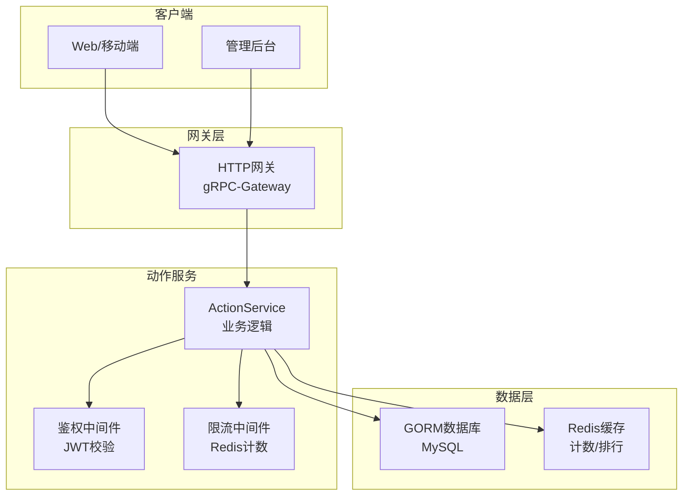
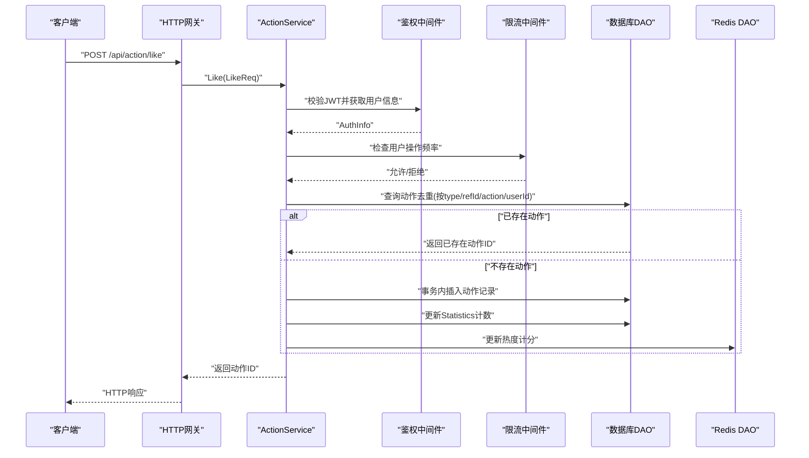
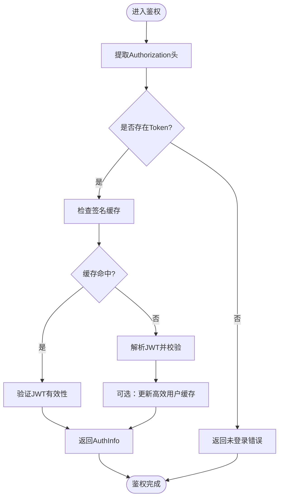
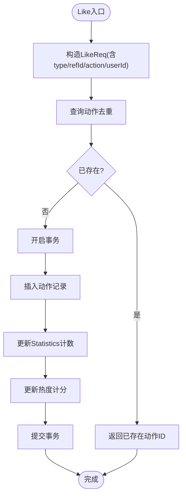
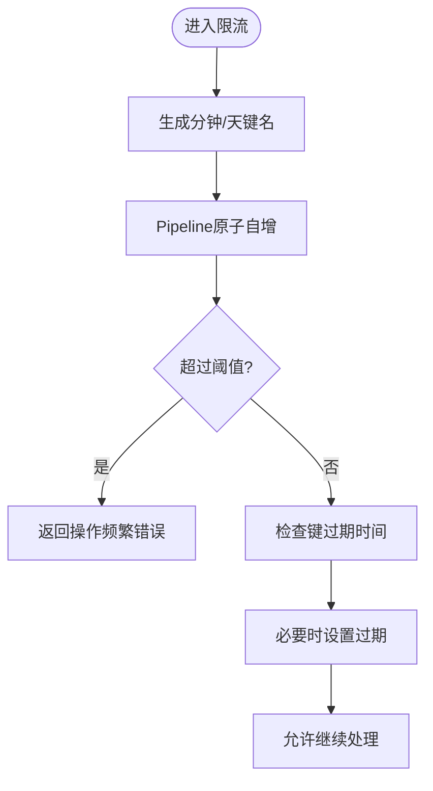
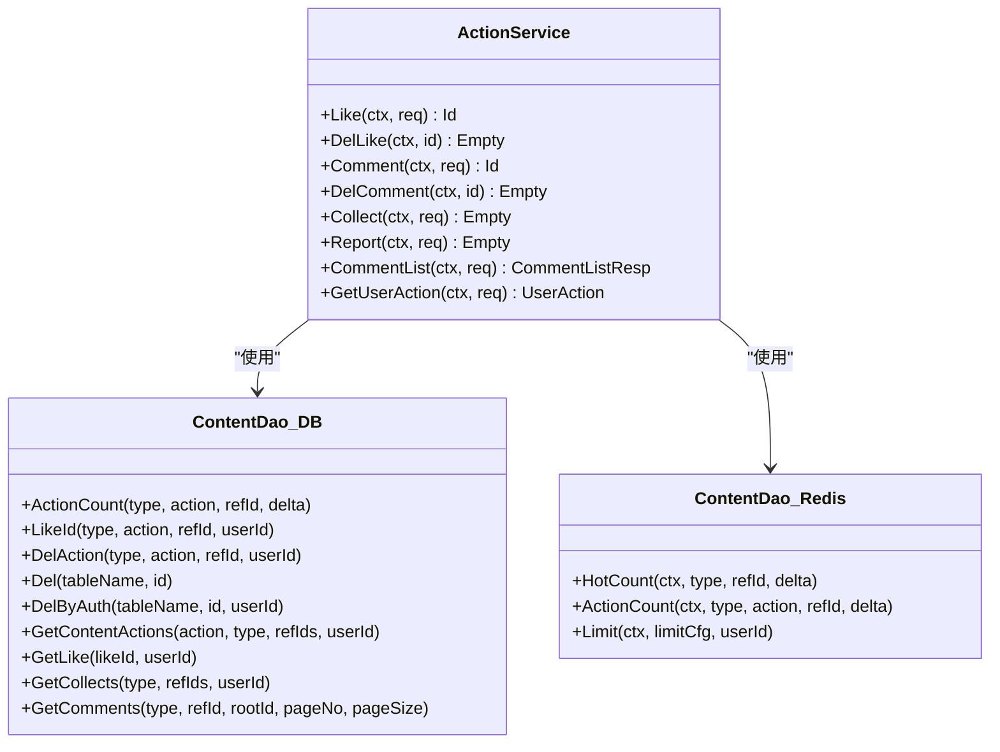

# 动作服务API

<cite>
**本文档引用的文件**
- [action.service.proto](file://proto/content/action.service.proto)
- [action.model.proto](file://proto/content/action.model.proto)
- [action.service.go](file://server/go/content/service/action.go)
- [action.db.dao.go](file://server/go/content/data/db/action.go)
- [action.redis.dao.go](file://server/go/content/data/redis/action.go)
- [action.redis.limit.go](file://server/go/content/data/redis/limit.go)
- [action.auth.go](file://server/go/user/service/auth.go)
- [action.custom.config.go](file://server/go/content/global/custom.go)
- [action.grpc.gateway.go](file://server/go/protobuf/content/action.service.pb.gw.go)
- [action.model.go](file://server/go/content/model/model.go)
- [action.config.toml](file://server/go/config/config.toml)
</cite>

## 目录
1. [简介](#简介)
2. [项目结构](#项目结构)
3. [核心组件](#核心组件)
4. [架构总览](#架构总览)
5. [详细组件分析](#详细组件分析)
6. [依赖关系分析](#依赖关系分析)
7. [性能考虑](#性能考虑)
8. [故障排查指南](#故障排查指南)
9. [结论](#结论)

## 简介
本文件为动作服务API的权威技术文档，覆盖点赞、收藏、分享、举报等用户交互动作的完整接口规范。文档详细说明动作类型定义、动作状态管理、动作统计与历史查询、动作去重机制、动作撤销、批量操作与审计能力，并给出权限控制、频率限制与防刷策略的实现方式。同时记录服务的性能优化、缓存策略与数据一致性保障，以及动作通知、提醒与排行榜功能的接口定义。

## 项目结构
动作服务位于内容域（content）下，采用gRPC/HTTP双栈暴露，通过OpenAPI标注生成文档；数据层包含数据库DAO与Redis DAO，分别负责持久化与热点计分；鉴权通过JWT校验并结合用户信息缓存；限流策略基于Redis实现分钟/天级计数与过期控制。

图表来源
- [action.service.go:1-411](file://server/go/content/service/action.go#L1-L411)
- [action.grpc.gateway.go:440-472](file://server/go/protobuf/content/action.service.pb.gw.go#L440-L472)
- [action.redis.dao.go:1-31](file://server/go/content/data/redis/action.go#L1-L31)
- [action.db.dao.go:1-168](file://server/go/content/data/db/action.go#L1-L168)

章节来源
- [action.service.proto:1-171](file://proto/content/action.service.proto#L1-L171)
- [action.service.go:1-411](file://server/go/content/service/action.go#L1-L411)

## 核心组件
- 动作服务接口：提供Like/DelLike、Comment/DelComment、Collect、Report、GetUserAction等接口，支持HTTP REST风格路由与GraphQL标注。
- 数据模型：定义Action、Like、UnLike、Report、Collect、Share、Comment、Statistics、UserAction等消息体及ActionType、CommentType、LikeStatus枚举。
- 数据访问层：数据库DAO负责动作去重、计数更新、删除软删、评论查询；Redis DAO负责热度计分与动作计数。
- 鉴权与限流：鉴权中间件从请求头提取JWT并校验；限流中间件对用户在分钟/天维度进行计数与过期控制。
- 统计与排行：通过Redis有序集合维护内容热度与动作维度排行，支持热榜查询。

章节来源
- [action.service.proto:23-108](file://proto/content/action.service.proto#L23-L108)
- [action.model.proto:20-171](file://proto/content/action.model.proto#L20-L171)
- [action.service.go:30-411](file://server/go/content/service/action.go#L30-L411)
- [action.db.dao.go:19-168](file://server/go/content/data/db/action.go#L19-L168)
- [action.redis.dao.go:12-31](file://server/go/content/data/redis/action.go#L12-L31)

## 架构总览
动作服务采用“接口层-业务层-数据层”的分层架构。接口层通过gRPC-Gateway将HTTP请求映射到gRPC方法；业务层执行鉴权、限流、事务与统计更新；数据层通过GORM与Redis协同，保证一致性与高性能。

图表来源
- [action.service.go:30-77](file://server/go/content/service/action.go#L30-L77)
- [action.db.dao.go:53-64](file://server/go/content/data/db/action.go#L53-L64)
- [action.redis.dao.go:12-20](file://server/go/content/data/redis/action.go#L12-L20)
- [action.grpc.gateway.go:441-450](file://server/go/protobuf/content/action.service.pb.gw.go#L441-L450)

## 详细组件分析

### 接口定义与路由
- 点赞/取消点赞
  - POST /api/action/like -> Like(LikeReq) 返回动作ID
  - DELETE /api/action/like/{id} -> DelLike(Id) 删除指定动作
- 评论/评论列表/删除评论
  - POST /api/action/comment -> Comment(CommentReq) 返回评论ID
  - GET /api/action/comment -> CommentList(CommentListReq) 返回评论列表与用户信息
  - DELETE /api/action/comment/{id} -> DelComment(Id) 删除评论
- 收藏
  - POST /api/action/collect -> Collect(CollectReq) 批量收藏/取消收藏
- 举报
  - POST /api/action/report -> Report(ReportReq) 提交举报
- 用户动作查询
  - GET /api/userAction/{type}/{refId} -> GetUserAction(ContentReq) 返回用户对该内容的动作状态

章节来源
- [action.service.proto:28-108](file://proto/content/action.service.proto#L28-L108)
- [action.grpc.gateway.go:441-472](file://server/go/protobuf/content/action.service.pb.gw.go#L441-L472)

### 动作类型与状态
- 动作类型ActionType：浏览(ActionBrowse)、点赞(ActionLike)、不喜欢(ActionUnlike)、评论(ActionComment)、收藏(ActionCollect)、分享(ActionShare)、举报(ActionReport)、回馈(ActionGive)、赞同(ActionApprove)、删除(ActionDelete)。
- 评论类型CommentType：瞬间、日记、日记本、文章。
- 点赞状态LikeStatus：点赞、不喜欢。
- 用户动作UserAction：包含用户的点赞/不喜欢ID与收藏夹ID列表。

章节来源
- [action.model.proto:137-171](file://proto/content/action.model.proto#L137-L171)

### 权限控制
- 鉴权流程：从请求头提取JWT，校验签名与有效期，若缓存命中则直接返回用户信息；否则通过密钥解析并可选地更新高效用户哈希缓存。
- 删除评论权限：仅内容作者或评论作者可删除；否则返回权限不足错误。

图表来源
- [action.auth.go:22-61](file://server/go/user/service/auth.go#L22-L61)

章节来源
- [action.auth.go:22-61](file://server/go/user/service/auth.go#L22-L61)

### 动作去重机制
- 查询去重：根据type、refId、action、userId组合查询是否已存在对应动作，避免重复提交。
- 实现要点：使用原生SQL查询单条记录ID，确保索引命中；若存在则直接返回ID，不重复写入。

图表来源
- [action.service.go:30-77](file://server/go/content/service/action.go#L30-L77)
- [action.db.dao.go:53-64](file://server/go/content/data/db/action.go#L53-L64)

章节来源
- [action.db.dao.go:53-64](file://server/go/content/data/db/action.go#L53-L64)

### 动作撤销
- 取消点赞：根据动作ID与用户ID查询原始动作，执行软删除并回滚计数与热度。
- 删除评论：校验删除权限后软删除评论并回滚计数与热度。

章节来源
- [action.service.go:79-108](file://server/go/content/service/action.go#L79-L108)
- [action.service.go:148-190](file://server/go/content/service/action.go#L148-L190)

### 批量操作
- 批量收藏：Collect接口支持传入多个favIds，内部计算差集，新增缺失的收藏并删除多余的收藏；仅在首次收藏或取消收藏时更新统计计数与热度。

章节来源
- [action.service.go:192-254](file://server/go/content/service/action.go#L192-L254)
- [action.db.dao.go:141-150](file://server/go/content/data/db/action.go#L141-L150)

### 动作统计与历史
- 统计模型Statistics：包含点赞、不喜欢、浏览、评论、收藏、分享、举报等计数字段。
- 历史查询：CommentList接口返回评论列表、用户基础信息、评论统计与当前用户动作状态；支持分页与根节点筛选。

章节来源
- [action.model.proto:117-128](file://proto/content/action.model.proto#L117-L128)
- [action.service.go:292-372](file://server/go/content/service/action.go#L292-L372)

### 动作审计
- 审计字段：所有动作模型嵌入ModelTime（包含创建/更新/删除时间），Report模型包含举报原因与备注、创建时间戳。
- 软删除：删除类操作（动作、评论、收藏）均采用软删除策略，保留审计痕迹。

章节来源
- [action.model.proto:21-29](file://proto/content/action.model.proto#L21-L29)
- [action.model.proto:52-61](file://proto/content/action.model.proto#L52-L61)
- [action.db.dao.go:76-106](file://server/go/content/data/db/action.go#L76-L106)

### 动作频率限制与防刷
- 限流策略：基于Redis对用户在分钟/天维度进行计数，超过阈值则拒绝请求；键名包含用户ID，过期时间分别为分钟与自然日。
- 触发场景：举报接口在事务前执行限流检查，其他动作接口可按需扩展。

图表来源
- [action.redis.limit.go:17-59](file://server/go/content/data/redis/limit.go#L17-L59)
- [action.service.go:256-289](file://server/go/content/service/action.go#L256-L289)

章节来源
- [action.redis.limit.go:17-59](file://server/go/content/data/redis/limit.go#L17-L59)
- [action.custom.config.go:7-15](file://server/go/content/global/custom.go#L7-L15)

### 缓存策略与数据一致性
- 热度与动作计数：通过Redis有序集合维护内容热度与动作维度计数，支持快速排行与查询。
- 一致性保障：动作类操作在事务内完成插入与计数更新，失败则回滚；热点计分与统计更新均在事务内完成，确保最终一致。
- 缓存穿透：评论列表屏蔽敏感字段，避免泄露；用户信息通过用户服务批量拉取。

章节来源
- [action.redis.dao.go:12-31](file://server/go/content/data/redis/action.go#L12-L31)
- [action.db.dao.go:19-51](file://server/go/content/data/db/action.go#L19-L51)
- [action.service.go:292-372](file://server/go/content/service/action.go#L292-L372)

### 通知、提醒与排行榜
- 通知与提醒：当前接口未直接暴露通知/提醒字段，可在调用方或下游服务中基于动作事件触发通知。
- 排行榜：通过Redis有序集合维护内容热度与动作维度排行键，支持外部查询与展示。

章节来源
- [action.redis.dao.go:12-31](file://server/go/content/data/redis/action.go#L12-L31)

## 依赖关系分析

图表来源
- [action.service.go:26-411](file://server/go/content/service/action.go#L26-L411)
- [action.db.dao.go:1-168](file://server/go/content/data/db/action.go#L1-L168)
- [action.redis.dao.go:1-31](file://server/go/content/data/redis/action.go#L1-L31)

章节来源
- [action.service.go:26-411](file://server/go/content/service/action.go#L26-L411)
- [action.db.dao.go:1-168](file://server/go/content/data/db/action.go#L1-L168)
- [action.redis.dao.go:1-31](file://server/go/content/data/redis/action.go#L1-L31)

## 性能考虑
- 索引与查询：动作去重查询使用复合索引（type/ref_id/action/user_id），确保低延迟。
- 事务批处理：动作与统计更新在同一事务内完成，减少锁竞争与不一致风险。
- Redis热点：使用ZSet维护热度与动作计数，支持O(logN)增量与查询；Pipeline减少RTT。
- 分页与屏蔽：评论列表分页查询并屏蔽敏感字段，降低网络与渲染开销。
- 配置中心：环境配置通过配置中心加载，便于在不同环境调整限流阈值与缓存策略。

章节来源
- [action.db.dao.go:53-64](file://server/go/content/data/db/action.go#L53-L64)
- [action.redis.dao.go:12-31](file://server/go/content/data/redis/action.go#L12-L31)
- [action.config.toml:1-41](file://server/go/config/config.toml#L1-L41)

## 故障排查指南
- 未登录/鉴权失败：检查Authorization头是否正确传递，确认JWT签名与有效期；关注鉴权缓存命中情况。
- 权限不足：删除评论时需为评论作者或内容作者，否则返回权限错误。
- 操作频繁：触发限流错误时，检查Redis键值与过期时间，确认阈值配置是否合理。
- 数据库错误：事务内插入失败或计数更新异常，查看具体错误码与日志定位。
- Redis错误：热点计分或动作计数失败，检查Redis连接与Pipeline执行结果。

章节来源
- [action.auth.go:22-61](file://server/go/user/service/auth.go#L22-L61)
- [action.service.go:79-108](file://server/go/content/service/action.go#L79-L108)
- [action.redis.limit.go:17-59](file://server/go/content/data/redis/limit.go#L17-L59)
- [action.db.dao.go:19-51](file://server/go/content/data/db/action.go#L19-L51)

## 结论
动作服务API以清晰的接口定义、完善的动作类型与状态管理、严格的权限与限流控制为基础，结合Redis热点计分与数据库事务，实现了高并发下的稳定与一致性。建议在生产环境中配合配置中心动态调整限流阈值，并通过监控与日志持续优化热点键与查询路径。