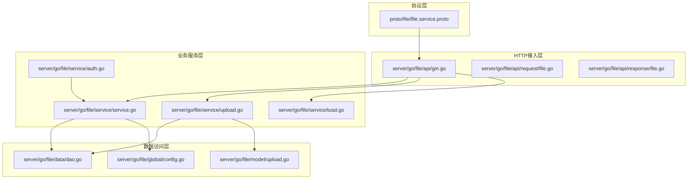
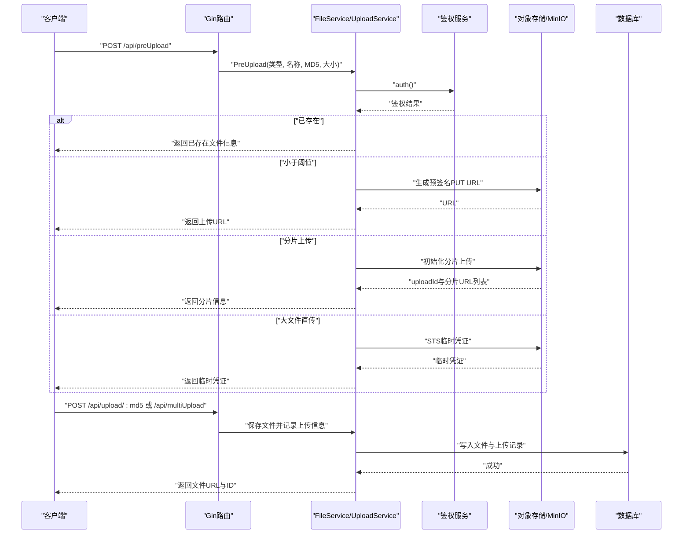
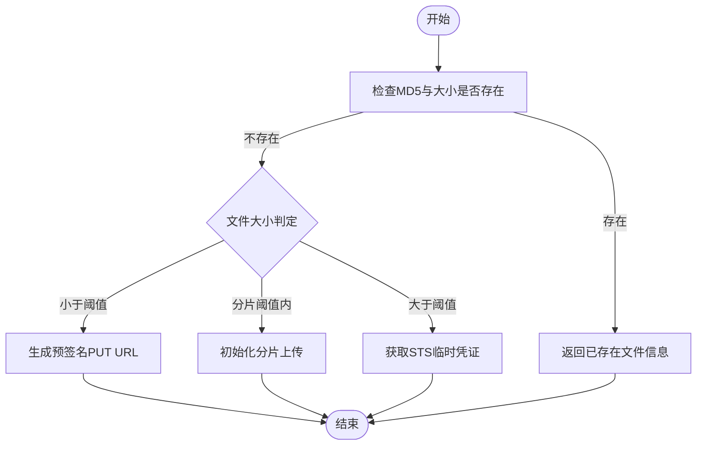
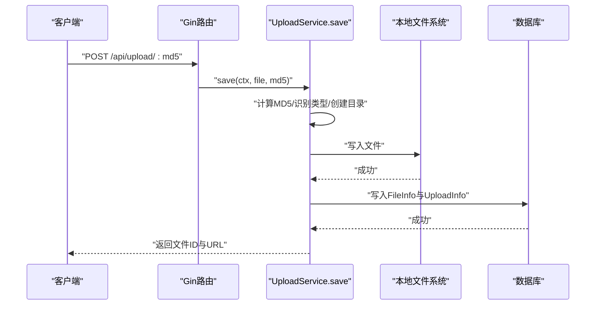
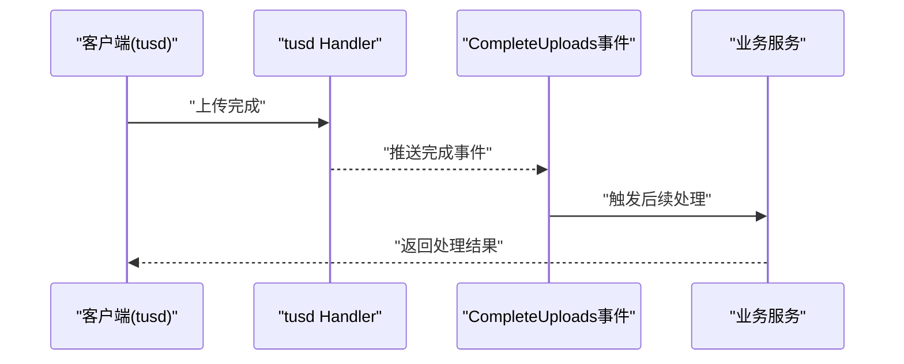
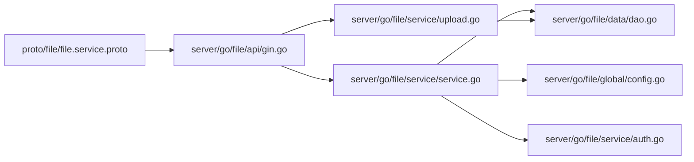
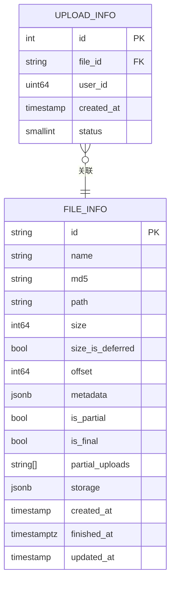

# 文件服务API

<cite>
**本文引用的文件**
- [file.service.proto](file://proto/file/file.service.proto)
- [gin.go](file://server/go/file/api/gin.go)
- [file.go（请求）](file://server/go/file/api/request/file.go)
- [file.go（响应）](file://server/go/file/api/response/file.go)
- [upload.go（服务）](file://server/go/file/service/upload.go)
- [service.go（文件服务）](file://server/go/file/service/service.go)
- [auth.go（鉴权）](file://server/go/file/service/auth.go)
- [dao.go（数据访问）](file://server/go/file/data/dao.go)
- [upload.go（模型）](file://server/go/file/model/upload.go)
- [config.go（全局配置）](file://server/go/file/global/config.go)
- [tusd.go（tusd集成）](file://server/go/file/service/tusd.go)
</cite>

## 目录
1. [简介](#简介)
2. [项目结构](#项目结构)
3. [核心组件](#核心组件)
4. [架构总览](#架构总览)
5. [详细组件分析](#详细组件分析)
6. [依赖关系分析](#依赖关系分析)
7. [性能考量](#性能考量)
8. [故障排查指南](#故障排查指南)
9. [结论](#结论)
10. [附录](#附录)

## 简介
本文件服务API提供完整的文件上传、下载、删除、管理能力，并支持分片上传、断点续传、并发上传与大文件处理。同时覆盖文件类型识别、格式转换、缩略图生成、内容审核等扩展能力的接口定义与集成思路；并说明CDN集成、文件存储策略与缓存机制的API说明；记录权限控制、访问限制与安全保护的实现方式；最后提供上传进度跟踪、文件元数据管理与批量操作的接口规范。

## 项目结构
文件服务位于后端 Go 工程的 file 子模块，采用“协议定义 → HTTP/GPRC 接入 → 业务服务 → 数据访问 → 存储/对象存储”的分层组织方式。协议通过 proto 定义，HTTP 层由 Gin 注册路由，业务服务封装上传策略与鉴权，DAO 层对接数据库，底层可选集成 MinIO 或本地文件系统，亦可接入 tusd 支持断点续传。

**图表来源**
- [file.service.proto](file://proto/file/file.service.proto)
- [gin.go](file://server/go/file/api/gin.go)
- [service.go（文件服务）](file://server/go/file/service/service.go)
- [upload.go（服务）](file://server/go/file/service/upload.go)
- [tusd.go（tusd集成）](file://server/go/file/service/tusd.go)
- [auth.go（鉴权）](file://server/go/file/service/auth.go)
- [dao.go（数据访问）](file://server/go/file/data/dao.go)
- [upload.go（模型）](file://server/go/file/model/upload.go)
- [config.go（全局配置）](file://server/go/file/global/config.go)

**章节来源**
- [file.service.proto](file://proto/file/file.service.proto)
- [gin.go](file://server/go/file/api/gin.go)
- [service.go（文件服务）](file://server/go/file/service/service.go)
- [upload.go（服务）](file://server/go/file/service/upload.go)
- [tusd.go（tusd集成）](file://server/go/file/service/tusd.go)
- [auth.go（鉴权）](file://server/go/file/service/auth.go)
- [dao.go（数据访问）](file://server/go/file/data/dao.go)
- [upload.go（模型）](file://server/go/file/model/upload.go)
- [config.go（全局配置）](file://server/go/file/global/config.go)

## 核心组件
- 协议与路由
  - 使用 proto 定义 FileService 的 HTTP 映射与 OpenAPI 元数据，包括预上传、获取URL等接口。
  - Gin 路由注册静态资源与上传相关接口，统一通过包装器桥接到服务层。
- 预上传与分片策略
  - 根据文件大小选择直传URL、分片上传或STS临时凭证，满足不同场景的大文件与高并发需求。
- 本地上传与存储
  - 支持单文件与多文件上传，自动计算MD5、按类型与日期归档到本地目录，持久化文件与上传记录。
- 对象存储集成
  - 通过 MinIO 客户端生成预签名URL或发起分片上传，支持STS临时凭证用于前端直传。
- 断点续传
  - 提供 tusd 集成入口，便于扩展断点续传与进度跟踪。
- 鉴权与权限
  - 统一鉴权调用用户服务，确保上传与管理操作的安全性。
- 元数据与批量操作
  - 模型支持元数据字段与部分上传标记，便于后续实现批量操作与状态管理。

**章节来源**
- [file.service.proto](file://proto/file/file.service.proto)
- [gin.go](file://server/go/file/api/gin.go)
- [service.go（文件服务）](file://server/go/file/service/service.go)
- [upload.go（服务）](file://server/go/file/service/upload.go)
- [tusd.go（tusd集成）](file://server/go/file/service/tusd.go)
- [auth.go（鉴权）](file://server/go/file/service/auth.go)
- [dao.go（数据访问）](file://server/go/file/data/dao.go)
- [upload.go（模型）](file://server/go/file/model/upload.go)
- [config.go（全局配置）](file://server/go/file/global/config.go)

## 架构总览
下图展示从客户端到服务端的关键交互：HTTP 请求经路由进入服务层，根据文件大小与策略选择本地落盘或对象存储直传；鉴权通过用户服务完成；最终持久化到数据库与存储介质。

**图表来源**
- [gin.go](file://server/go/file/api/gin.go)
- [service.go（文件服务）](file://server/go/file/service/service.go)
- [upload.go（服务）](file://server/go/file/service/upload.go)
- [auth.go（鉴权）](file://server/go/file/service/auth.go)

## 详细组件分析

### 预上传与分片策略
- 接口定义
  - 预上传接口接收文件名称、MD5、大小等参数，返回预上传类型与相应凭据或URL。
- 策略选择
  - 已存在：若数据库已存在该MD5与大小的文件，则直接返回文件信息。
  - 小文件直传：生成短期有效的预签名PUT URL，前端直传至对象存储。
  - 分片上传：初始化分片上传并返回各分片的预签名URL，支持并发上传。
  - 大文件直传：通过STS获取临时凭证，前端以临时凭证直传。
- 参数与返回
  - 请求体包含预上传类型、文件名、MD5、大小。
  - 返回体包含类型、文件信息、上传URL、分片信息或临时凭证。

**图表来源**
- [service.go（文件服务）](file://server/go/file/service/service.go)
- [file.service.proto](file://proto/file/file.service.proto)

**章节来源**
- [service.go（文件服务）](file://server/go/file/service/service.go)
- [file.service.proto](file://proto/file/file.service.proto)

### 本地上传与存储
- 接口定义
  - GET /api/preUpload 与带参数的预上传路由。
  - POST /api/upload/:md5 与 POST /api/multiUpload 批量上传。
- 处理流程
  - 解析表单，校验最大上传大小。
  - 鉴权通过后，若未提供MD5则计算文件MD5。
  - 按文件类型与日期生成存储目录，写入文件并记录文件信息与上传记录。
- 返回
  - 成功返回文件ID与URL；失败返回错误码。

**图表来源**
- [gin.go](file://server/go/file/api/gin.go)
- [upload.go（服务）](file://server/go/file/service/upload.go)

**章节来源**
- [gin.go](file://server/go/file/api/gin.go)
- [upload.go（服务）](file://server/go/file/service/upload.go)

### 断点续传（tusd）
- 集成方式
  - 初始化 FileStore 并组合为 StoreComposer，创建 HTTP Handler 并挂载到 /api/v2/files/ 前缀。
  - 后台监听 CompleteUploads 事件，可在完成后执行后续处理（如元数据写入、缩略图生成等）。
- 适用场景
  - 高可靠性上传、网络不稳定环境下的续传与进度跟踪。

**图表来源**
- [tusd.go（tusd集成）](file://server/go/file/service/tusd.go)

**章节来源**
- [tusd.go（tusd集成）](file://server/go/file/service/tusd.go)

### 鉴权与权限控制
- 鉴权调用
  - 服务层统一通过 auth(ctx, update) 调用用户服务进行鉴权。
- 权限约束
  - 上传前必须登录有效；后续可结合用户角色与文件访问策略实现更细粒度的权限控制。

**章节来源**
- [auth.go（鉴权）](file://server/go/file/service/auth.go)

### 元数据与批量操作
- 元数据
  - 模型支持 JSONB 元数据字段与部分上传标记，可用于记录格式信息、审核状态、缩略图路径等。
- 批量操作
  - 当前批量上传接口支持多文件并发保存；可在此基础上扩展批量查询、更新与删除。

**章节来源**
- [upload.go（模型）](file://server/go/file/model/upload.go)
- [upload.go（服务）](file://server/go/file/service/upload.go)

## 依赖关系分析
- 协议到路由
  - proto 定义的 RPC 映射到 Gin 路由，统一通过包装器桥接服务层。
- 服务到数据
  - 服务层通过 DAO 访问数据库，持久化文件与上传记录。
- 存储与对象存储
  - 本地存储与 MinIO 客户端并存，策略由预上传决策决定。
- 鉴权依赖
  - 服务层依赖用户服务进行鉴权。

**图表来源**
- [file.service.proto](file://proto/file/file.service.proto)
- [gin.go](file://server/go/file/api/gin.go)
- [service.go（文件服务）](file://server/go/file/service/service.go)
- [upload.go（服务）](file://server/go/file/service/upload.go)
- [dao.go（数据访问）](file://server/go/file/data/dao.go)
- [config.go（全局配置）](file://server/go/file/global/config.go)
- [auth.go（鉴权）](file://server/go/file/service/auth.go)

**章节来源**
- [file.service.proto](file://proto/file/file.service.proto)
- [gin.go](file://server/go/file/api/gin.go)
- [service.go（文件服务）](file://server/go/file/service/service.go)
- [upload.go（服务）](file://server/go/file/service/upload.go)
- [dao.go（数据访问）](file://server/go/file/data/dao.go)
- [config.go（全局配置）](file://server/go/file/global/config.go)
- [auth.go（鉴权）](file://server/go/file/service/auth.go)

## 性能考量
- 上传大小限制
  - 全局配置包含最大上传大小，避免过大请求占用资源。
- 分片策略
  - 大文件采用分片上传，提升并发与稳定性；合理设置分片数量与大小。
- 对象存储直传
  - 小文件与分片场景使用预签名URL，减少服务端中转带宽压力。
- 缓存与CDN
  - 建议在对象存储侧启用CDN加速，结合预签名URL与短时效策略降低延迟。
- 并发与限流
  - 建议在网关层对上传接口实施速率限制与IP白名单，防止滥用。

[本节为通用指导，不直接分析具体文件]

## 故障排查指南
- 常见错误与定位
  - 上传失败：检查表单解析、最大上传大小限制、文件类型与扩展名。
  - 鉴权失败：确认用户登录状态与鉴权服务可用性。
  - 对象存储异常：检查Bucket权限、Endpoint、STS策略与凭证有效期。
- 日志与追踪
  - 服务层使用日志组件输出错误上下文，便于定位问题。
- 回滚与清理
  - 分片上传失败时应调用 AbortMultipartUpload 清理未完成的分片。

**章节来源**
- [upload.go（服务）](file://server/go/file/service/upload.go)
- [service.go（文件服务）](file://server/go/file/service/service.go)

## 结论
本文件服务API通过协议驱动、策略化的预上传与分片机制，结合本地存储与对象存储直传，满足中小到大文件的多种上传场景。配合鉴权、元数据与批量操作能力，可进一步扩展为完善的文件管理平台。建议在生产环境中完善CDN与缓存策略、加强安全防护与监控告警。

[本节为总结性内容，不直接分析具体文件]

## 附录

### 接口清单与规范

- 预上传
  - 方法与路径：POST /api/preUpload
  - 请求体：预上传类型、文件名、MD5、大小
  - 返回体：预上传类型、文件信息、上传URL、分片信息、临时凭证
  - 场景：小文件直传、分片上传、大文件直传
  - 参考
    - [file.service.proto](file://proto/file/file.service.proto)
    - [service.go（文件服务）](file://server/go/file/service/service.go)

- 获取URL
  - 方法与路径：GET /api/urls（查询参数形式），POST /api/urls（JSON形式）
  - 请求体：ids数组
  - 返回体：文件列表（含ID与URL）
  - 参考
    - [file.service.proto](file://proto/file/file.service.proto)
    - [service.go（文件服务）](file://server/go/file/service/service.go)

- 上传
  - 单文件
    - 方法与路径：POST /api/upload/:md5
    - 请求体：multipart/form-data，字段名为file
    - 返回体：文件ID与URL
    - 参考
      - [gin.go](file://server/go/file/api/gin.go)
      - [upload.go（服务）](file://server/go/file/service/upload.go)
  - 多文件
    - 方法与路径：POST /api/multiUpload
    - 请求体：multipart/form-data，字段名为file[]
    - 返回体：每个文件的名称与路径
    - 参考
      - [gin.go](file://server/go/file/api/gin.go)
      - [upload.go（服务）](file://server/go/file/service/upload.go)

- 断点续传（tusd）
  - 路径：/api/v2/files/
  - 行为：完成事件监听，触发后续处理
  - 参考
    - [tusd.go（tusd集成）](file://server/go/file/service/tusd.go)

- 鉴权
  - 调用：auth(ctx, update)
  - 依赖：用户服务
  - 参考
    - [auth.go（鉴权）](file://server/go/file/service/auth.go)

- 配置
  - 上传目录、最大上传大小、允许扩展名、Bucket等
  - 参考
    - [config.go（全局配置）](file://server/go/file/global/config.go)

### 数据模型（简化）

**图表来源**
- [upload.go（模型）](file://server/go/file/model/upload.go)