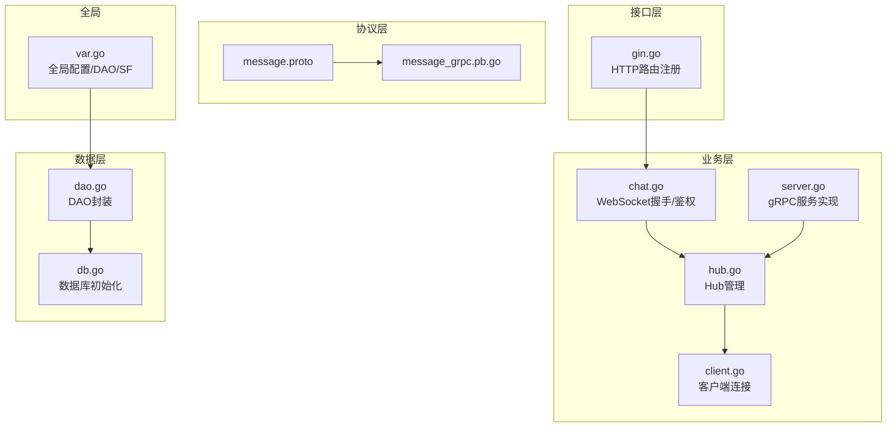
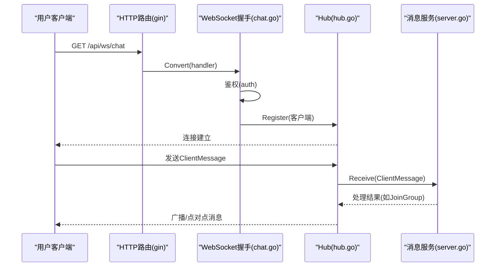
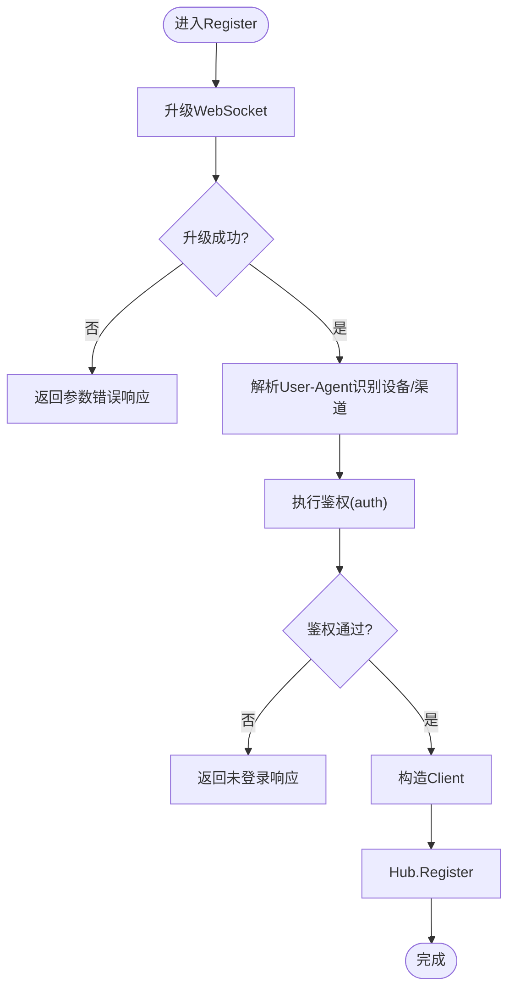
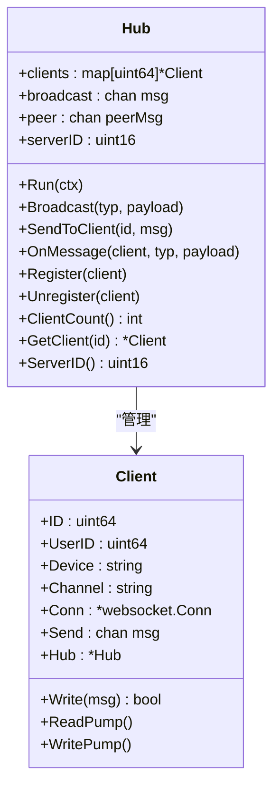
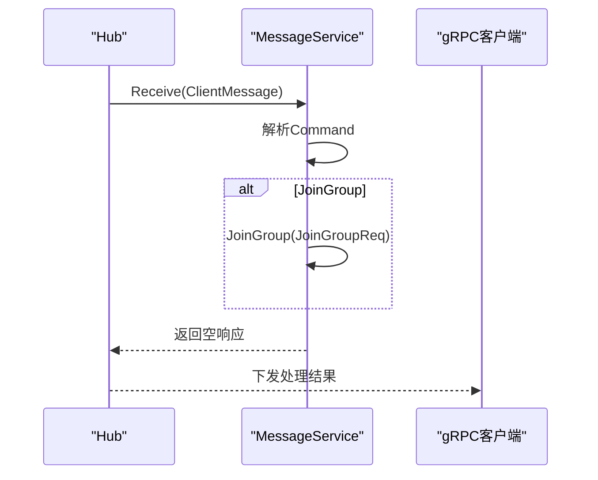
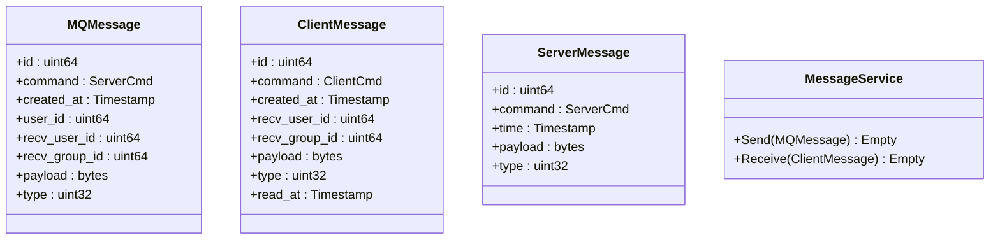
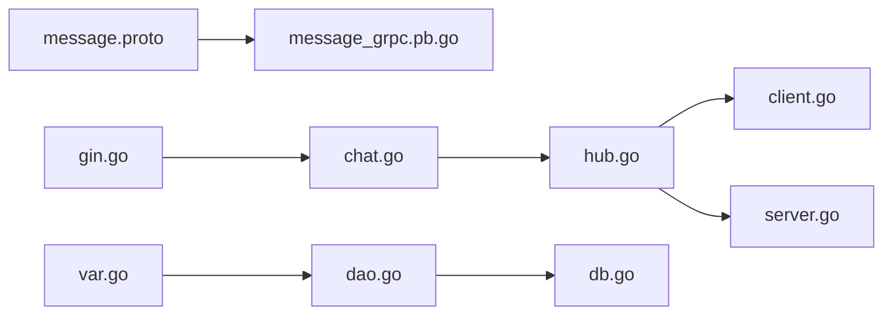

# 消息服务API

<cite>
**本文引用的文件**
- [message.proto](file://proto/message/message.proto)
- [gin.go](file://server/go/message/api/gin.go)
- [chat.go](file://server/go/message/service/chat.go)
- [client.go](file://server/go/message/service/client.go)
- [hub.go](file://server/go/message/service/hub.go)
- [server.go](file://server/go/message/service/server.go)
- [dao.go](file://server/go/message/data/dao.go)
- [db.go](file://server/go/message/data/db.go)
- [var.go](file://server/go/message/global/var.go)
- [message_grpc.pb.go](file://server/go/protobuf/message/message_grpc.pb.go)
</cite>

## 目录
1. [简介](#简介)
2. [项目结构](#项目结构)
3. [核心组件](#核心组件)
4. [架构总览](#架构总览)
5. [详细组件分析](#详细组件分析)
6. [依赖关系分析](#依赖关系分析)
7. [性能考量](#性能考量)
8. [故障排查指南](#故障排查指南)
9. [结论](#结论)
10. [附录](#附录)

## 简介
本文件为消息服务API的权威文档，覆盖实时聊天、私信系统、群组消息、通知推送等消息相关能力。内容包括：
- WebSocket连接管理：握手、鉴权、设备/渠道识别、连接生命周期
- 消息发送接收：点对点、广播、群组加入流程
- 消息类型与格式：文本、二进制、图片、文件、视频、音频
- 消息状态与送达确认：已读时间字段
- 加密、持久化、检索与统计：当前仓库未实现，提供扩展建议
- 群组管理、@提及、搜索与归档：当前仓库未实现，提供扩展建议
- 性能优化、负载均衡与高可用：基于Hub与多实例的实现思路

## 项目结构
消息服务位于Go后端工程的message模块，采用分层设计：
- 协议层：Proto定义消息模型与gRPC服务
- 接口层：HTTP路由注册WebSocket升级
- 业务层：WebSocket Hub、客户端、消息服务实现
- 数据层：DAO封装与数据库访问
- 全局层：配置、DAO引用与Snowflake ID生成器

**图表来源**
- [message.proto:1-74](file://proto/message/message.proto#L1-L74)
- [message_grpc.pb.go:129-147](file://server/go/protobuf/message/message_grpc.pb.go#L129-L147)
- [gin.go:1-12](file://server/go/message/api/gin.go#L1-L12)
- [chat.go:1-54](file://server/go/message/service/chat.go#L1-L54)
- [client.go:1-65](file://server/go/message/service/client.go#L1-L65)
- [hub.go:1-165](file://server/go/message/service/hub.go#L1-L165)
- [server.go:1-44](file://server/go/message/service/server.go#L1-L44)
- [dao.go:1-14](file://server/go/message/data/dao.go#L1-L14)
- [db.go:1-2](file://server/go/message/data/db.go#L1-L2)
- [var.go:1-12](file://server/go/message/global/var.go#L1-L12)

**章节来源**
- [message.proto:1-74](file://proto/message/message.proto#L1-L74)
- [gin.go:1-12](file://server/go/message/api/gin.go#L1-L12)
- [chat.go:1-54](file://server/go/message/service/chat.go#L1-L54)
- [client.go:1-65](file://server/go/message/service/client.go#L1-L65)
- [hub.go:1-165](file://server/go/message/service/hub.go#L1-L165)
- [server.go:1-44](file://server/go/message/service/server.go#L1-L44)
- [dao.go:1-14](file://server/go/message/data/dao.go#L1-L14)
- [db.go:1-2](file://server/go/message/data/db.go#L1-L2)
- [var.go:1-12](file://server/go/message/global/var.go#L1-L12)

## 核心组件
- Proto消息模型与服务
  - MQMessage：服务间消息载体，含发送方、接收方、类型、载荷与时间戳
  - ClientMessage：客户端消息，含命令、接收用户/群组、类型、载荷与已读时间
  - ServerMessage：服务端消息，含命令、时间、类型与载荷
  - JoinGroupReq/Resp：群组加入请求/响应
  - Message服务：Send、Receive两个RPC方法
- WebSocket Hub
  - 维护客户端集合、广播/点对点通道、本节点ID
  - 提供注册/注销、广播、点对点发送、客户端数量统计等
- 客户端连接
  - 封装WebSocket连接、发送通道、设备/渠道信息
  - ReadPump/WritePump分离读写循环，支持预编译消息
- gRPC消息服务
  - Send：服务间消息入口（当前空实现）
  - Receive：客户端消息入口，支持群组加入命令
- DAO与数据库
  - DAO封装与GORM集成，提供数据库访问入口
- 全局变量
  - Dao/Conf引用全局配置与DAO
  - Snowflake ID生成器

**章节来源**
- [message.proto:28-74](file://proto/message/message.proto#L28-L74)
- [hub.go:18-165](file://server/go/message/service/hub.go#L18-L165)
- [client.go:13-65](file://server/go/message/service/client.go#L13-L65)
- [server.go:13-44](file://server/go/message/service/server.go#L13-L44)
- [dao.go:7-14](file://server/go/message/data/dao.go#L7-L14)
- [var.go:8-12](file://server/go/message/global/var.go#L8-L12)

## 架构总览
消息服务采用“HTTP升级WebSocket + gRPC消息处理”的混合架构：
- HTTP路由负责WebSocket握手与鉴权
- Hub统一管理连接，负责消息分发
- gRPC服务处理业务逻辑（如群组加入），并将结果通过Hub下发

**图表来源**
- [gin.go:9-11](file://server/go/message/api/gin.go#L9-L11)
- [chat.go:16-53](file://server/go/message/service/chat.go#L16-L53)
- [hub.go:108-127](file://server/go/message/service/hub.go#L108-L127)
- [server.go:22-38](file://server/go/message/service/server.go#L22-L38)

## 详细组件分析

### WebSocket连接管理
- 握手与升级
  - 使用gorilla/websocket Upgrader，允许任意来源跨域，读写缓冲均为1024
  - 成功后根据User-Agent识别设备类型(PC/iPhone/Android)与渠道(MicroMessenger/微信)
- 鉴权
  - 调用auth函数进行鉴权，失败返回未登录错误
- 客户端注册
  - 构造Client并注册到Hub，启动ReadPump/WritePump协程

**图表来源**
- [chat.go:16-53](file://server/go/message/service/chat.go#L16-L53)

**章节来源**
- [chat.go:16-53](file://server/go/message/service/chat.go#L16-L53)

### Hub与消息分发
- Hub职责
  - 维护客户端映射、广播/点对点通道
  - 支持本机广播、本机点对点发送、客户端注册/注销、统计
- OnMessage处理
  - 反序列化ClientMessage，填充ReadAt时间戳
  - 调用Message.Receive RPC，处理命令（如JoinGroup）

**图表来源**
- [hub.go:18-165](file://server/go/message/service/hub.go#L18-L165)
- [client.go:13-65](file://server/go/message/service/client.go#L13-L65)

**章节来源**
- [hub.go:18-165](file://server/go/message/service/hub.go#L18-L165)
- [client.go:13-65](file://server/go/message/service/client.go#L13-L65)

### gRPC消息服务
- Send
  - 服务间消息入口，当前为空实现，预留扩展
- Receive
  - 解析ClientMessage命令，目前支持JoinGroup命令
  - 调用JoinGroup处理并返回

**图表来源**
- [server.go:22-38](file://server/go/message/service/server.go#L22-L38)
- [message_grpc.pb.go:129-147](file://server/go/protobuf/message/message_grpc.pb.go#L129-L147)

**章节来源**
- [server.go:17-44](file://server/go/message/service/server.go#L17-L44)
- [message_grpc.pb.go:129-147](file://server/go/protobuf/message/message_grpc.pb.go#L129-L147)

### Proto消息模型与服务
- 消息类型
  - 类型枚举：text、binary、image、file、video、audio
- 消息字段
  - MQMessage/MQMessage：发送方、接收方、时间戳、类型、载荷
  - ClientMessage：命令、接收用户/群组、类型、载荷、已读时间
  - ServerMessage：命令、时间、类型、载荷
- 服务接口
  - Send：MQMessage -> Empty
  - Receive：ClientMessage -> Empty

**图表来源**
- [message.proto:28-74](file://proto/message/message.proto#L28-L74)
- [server.go:13-15](file://server/go/message/service/server.go#L13-L15)

**章节来源**
- [message.proto:19-74](file://proto/message/message.proto#L19-L74)

### 数据层与全局配置
- DAO封装
  - 提供GetDao工厂方法，返回gorm.DB封装对象
- 数据库初始化
  - db.go占位，实际初始化在全局模块
- 全局变量
  - Dao/Conf引用全局配置与DAO
  - Snowflake ID生成器用于分布式唯一ID

**章节来源**
- [dao.go:7-14](file://server/go/message/data/dao.go#L7-L14)
- [db.go:1-2](file://server/go/message/data/db.go#L1-L2)
- [var.go:8-12](file://server/go/message/global/var.go#L8-L12)

## 依赖关系分析
- 协议与实现
  - message.proto定义消息模型与服务
  - message_grpc.pb.go提供gRPC服务描述
- 接口与业务
  - gin.go注册WebSocket路由
  - chat.go负责握手与鉴权
  - hub.go与client.go构成Hub与客户端模型
  - server.go实现gRPC服务
- 数据与全局
  - dao.go/db.go提供DAO与数据库访问
  - var.go提供全局配置与Snowflake

**图表来源**
- [message.proto:1-74](file://proto/message/message.proto#L1-L74)
- [message_grpc.pb.go:129-147](file://server/go/protobuf/message/message_grpc.pb.go#L129-L147)
- [gin.go:1-12](file://server/go/message/api/gin.go#L1-L12)
- [chat.go:1-54](file://server/go/message/service/chat.go#L1-L54)
- [hub.go:1-165](file://server/go/message/service/hub.go#L1-L165)
- [client.go:1-65](file://server/go/message/service/client.go#L1-L65)
- [server.go:1-44](file://server/go/message/service/server.go#L1-L44)
- [dao.go:1-14](file://server/go/message/data/dao.go#L1-L14)
- [db.go:1-2](file://server/go/message/data/db.go#L1-L2)
- [var.go:1-12](file://server/go/message/global/var.go#L1-L12)

**章节来源**
- [message.proto:1-74](file://proto/message/message.proto#L1-L74)
- [message_grpc.pb.go:129-147](file://server/go/protobuf/message/message_grpc.pb.pb.go#L129-L147)
- [gin.go:1-12](file://server/go/message/api/gin.go#L1-L12)
- [chat.go:1-54](file://server/go/message/service/chat.go#L1-L54)
- [hub.go:1-165](file://server/go/message/service/hub.go#L1-L165)
- [client.go:1-65](file://server/go/message/service/client.go#L1-L65)
- [server.go:1-44](file://server/go/message/service/server.go#L1-L44)
- [dao.go:1-14](file://server/go/message/data/dao.go#L1-L14)
- [db.go:1-2](file://server/go/message/data/db.go#L1-L2)
- [var.go:1-12](file://server/go/message/global/var.go#L1-L12)

## 性能考量
- 连接与通道
  - Hub使用带缓冲的广播/点对点通道，避免阻塞
  - 客户端发送通道默认非阻塞写入，防止写入阻塞导致连接堆积
- 预编译消息
  - Hub在广播时预编译消息，减少重复序列化开销
- 缓冲区大小
  - WebSocket升级时读写缓冲均为1024，可根据实际吞吐调优
- 并发模型
  - Hub与客户端均使用读写锁保护客户端映射，降低锁竞争
- 扩展建议
  - 引入Redis Pub/Sub实现跨实例广播
  - 使用连接池与限流策略控制并发
  - 对热点用户/群组采用本地缓存与批量写入

[本节为通用性能指导，不直接分析具体文件]

## 故障排查指南
- WebSocket握手失败
  - 检查升级错误与跨域策略
  - 确认User-Agent识别与设备/渠道逻辑
- 鉴权失败
  - 确认auth函数返回与错误码
  - 检查未登录响应码
- 消息处理异常
  - Hub在反序列化失败时会回显错误
  - gRPC Receive命令解析失败需检查payload与命令类型
- 连接断开
  - ReadPump/WritePump异常关闭时，确保Unregister清理资源
  - 检查CloseGoingAway与CloseAbnormalClosure场景

**章节来源**
- [chat.go:16-53](file://server/go/message/service/chat.go#L16-L53)
- [hub.go:108-127](file://server/go/message/service/hub.go#L108-L127)
- [client.go:35-65](file://server/go/message/service/client.go#L35-L65)

## 结论
消息服务已实现WebSocket连接管理与基础消息分发框架，具备良好的扩展性。后续可在以下方面完善：
- 消息持久化与检索：引入数据库表结构与索引策略
- 加密与安全：端到端加密与传输加密
- 群组管理与@提及：完善群组加入/退出、@提醒机制
- 搜索与归档：全文检索与历史归档
- 性能与高可用：跨实例广播、负载均衡与限流

[本节为总结性内容，不直接分析具体文件]

## 附录

### API定义与协议规范

- WebSocket连接
  - 路径：GET /api/ws/chat
  - 握手：HTTP升级为WebSocket
  - 鉴权：鉴权失败返回未登录错误
  - 设备/渠道：根据User-Agent识别
  - 生命周期：注册、读写循环、注销

- gRPC消息服务
  - 服务名：chat.Message
  - 方法：
    - Send(MQMessage) -> Empty
    - Receive(ClientMessage) -> Empty
  - 命令：
    - ClientCmdJoinGroup：加入群组

- 消息类型与格式
  - 类型枚举：text、binary、image、file、video、audio
  - 字段：
    - MQMessage：发送方、接收方、时间戳、类型、载荷
    - ClientMessage：命令、接收用户/群组、类型、载荷、已读时间
    - ServerMessage：命令、时间、类型、载荷

- 消息状态与送达确认
  - 已读时间：ClientMessage.read_at由Hub填充

- 群组管理
  - JoinGroupReq：group_id
  - JoinGroupResp：空

**章节来源**
- [gin.go:9-11](file://server/go/message/api/gin.go#L9-L11)
- [chat.go:16-53](file://server/go/message/service/chat.go#L16-L53)
- [hub.go:108-127](file://server/go/message/service/hub.go#L108-L127)
- [server.go:22-38](file://server/go/message/service/server.go#L22-L38)
- [message.proto:19-74](file://proto/message/message.proto#L19-L74)

### 扩展功能建议

- 消息加密
  - 传输加密：TLS
  - 内容加密：端到端加密，结合密钥轮换

- 消息持久化
  - 表结构：消息表、会话表、群组表
  - 索引：按用户、群组、时间排序索引
  - 分片：按用户ID哈希分片

- 消息检索与统计
  - 检索：全文索引、标签过滤、时间范围
  - 统计：消息量、活跃用户、群组规模

- 群组管理与@提及
  - 群组：创建、邀请、退群、禁言
  - @：@列表、@提醒、免打扰

- 消息搜索与归档
  - 搜索：关键词、表情、文件类型
  - 归档：历史消息导出、冷存储

- 性能优化与高可用
  - 负载均衡：Nginx/Ingress
  - 跨实例广播：Redis Pub/Sub
  - 限流：令牌桶/漏桶
  - 缓存：热点消息与用户会话

[本节为概念性扩展建议，不直接分析具体文件]