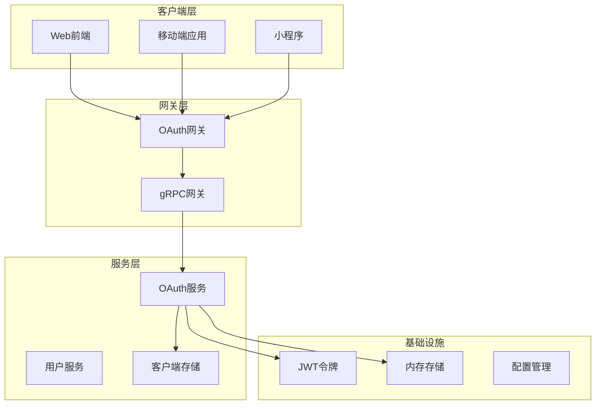
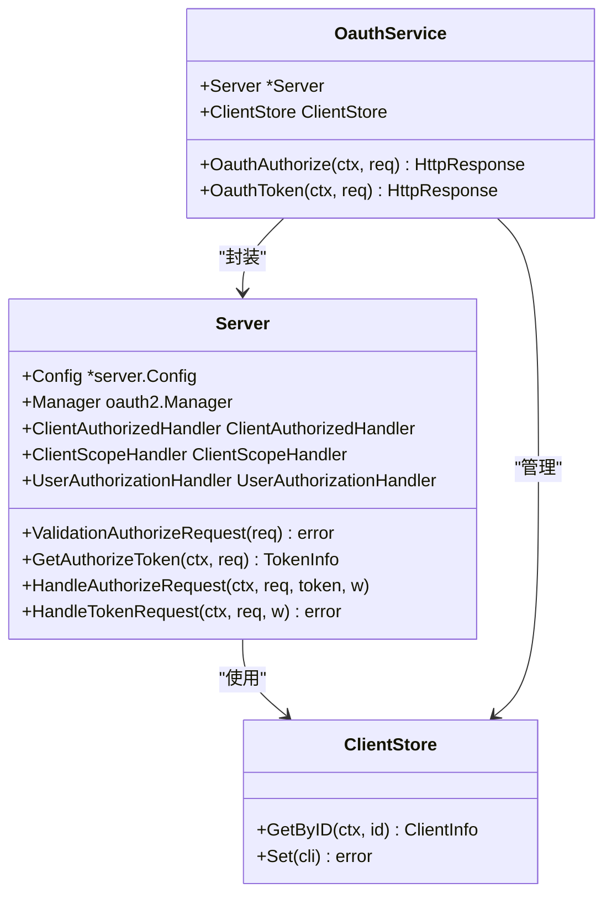
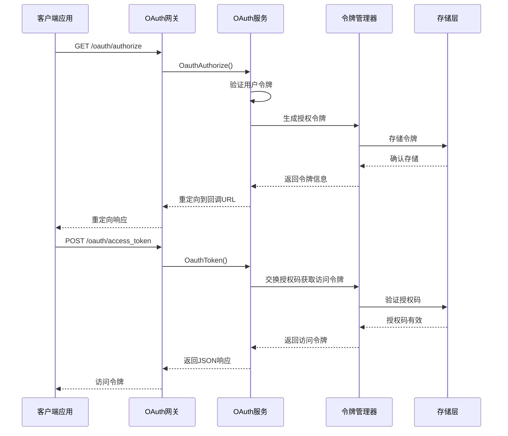
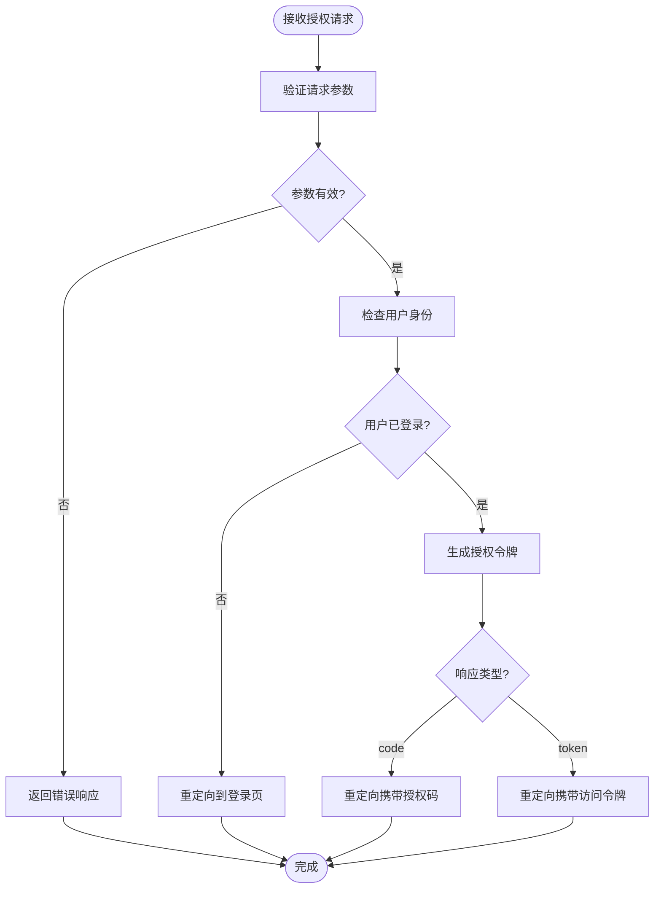
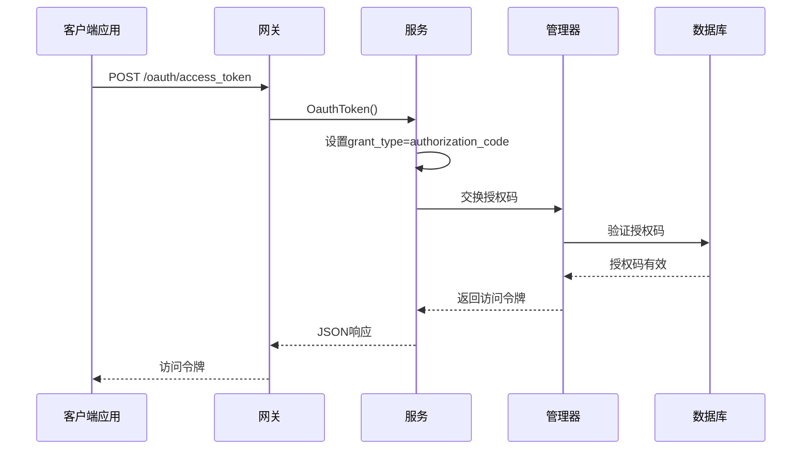
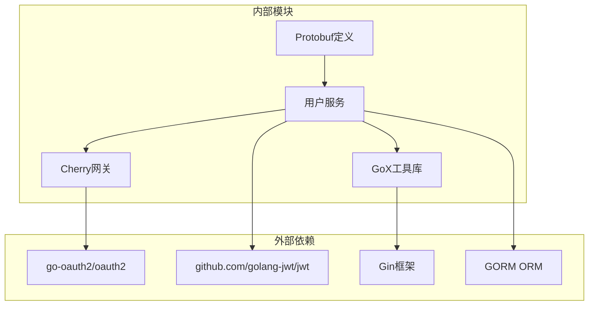

# OAuth第三方登录API

<cite>
**本文档引用的文件**
- [oauth.go](file://thirdparty/cherry/gateway/oauth.go)
- [oauth.go](file://thirdparty/gox/net/http/oauth/oauth.go)
- [oauth.go](file://server/go/user/service/oauth.go)
- [oauth.proto](file://thirdparty/protobuf/_proto/hopeio/oauth/oauth.proto)
- [oauth.pb.go](file://thirdparty/protobuf/oauth/oauth.pb.go)
- [user.service.proto](file://proto/user/user.service.proto)
- [gin.go](file://server/go/user/api/gin.go)
- [oauth_test.go](file://thirdparty/gox/net/http/oauth/oauth_test.go)
- [user.service.pb.gw.go](file://server/go/protobuf/user/user.service.pb.gw.go)
</cite>

## 目录
1. [简介](#简介)
2. [项目结构](#项目结构)
3. [核心组件](#核心组件)
4. [架构概览](#架构概览)
5. [详细组件分析](#详细组件分析)
6. [依赖关系分析](#依赖关系分析)
7. [性能考虑](#性能考虑)
8. [故障排除指南](#故障排除指南)
9. [结论](#结论)

## 简介

本文件为HopeIO平台的OAuth第三方登录API提供完整的技术文档。该系统实现了标准的OAuth 2.0授权框架，支持多种第三方平台的授权登录，包括微信、QQ、GitHub等主流平台。

系统基于Go语言开发，采用微服务架构，通过gRPC网关提供RESTful API接口。核心功能包括OAuth授权、令牌获取、用户信息同步等完整的第三方登录流程。

## 项目结构



**图表来源**
- [oauth.go:26-45](file://thirdparty/cherry/gateway/oauth.go#L26-L45)
- [oauth.go:30-70](file://server/go/user/service/oauth.go#L30-L70)

**章节来源**
- [oauth.go:1-46](file://thirdparty/cherry/gateway/oauth.go#L1-L46)
- [oauth.go:1-145](file://server/go/user/service/oauth.go#L1-L145)

## 核心组件

### OAuth授权服务器

OAuth授权服务器是整个系统的中枢，负责处理所有OAuth相关的认证和授权逻辑。



**图表来源**
- [oauth.go:26-50](file://thirdparty/gox/net/http/oauth/oauth.go#L26-L50)
- [oauth.go:72-84](file://server/go/user/service/oauth.go#L72-L84)

### 请求模型

OAuth请求模型定义了所有必要的参数字段：

| 字段名 | 类型 | 必填 | 描述 |
|--------|------|------|------|
| responseType | string | 是 | 授权响应类型（code/token） |
| clientID | string | 是 | 客户端标识符 |
| scope | string | 否 | 权限范围 |
| redirectURI | string | 是 | 重定向地址 |
| state | string | 否 | 防CSRF状态参数 |
| userID | string | 否 | 用户标识符 |
| accessTokenExp | int64 | 否 | 访问令牌过期时间 |
| clientSecret | string | 否 | 客户端密钥 |
| code | string | 否 | 授权码 |
| refreshToken | string | 否 | 刷新令牌 |
| grantType | string | 否 | 授权类型 |
| accessType | string | 否 | 访问类型 |
| loginURI | string | 否 | 登录页面地址 |

**章节来源**
- [oauth.proto:14-28](file://thirdparty/protobuf/_proto/hopeio/oauth/oauth.proto#L14-L28)
- [oauth.pb.go:29-46](file://thirdparty/protobuf/oauth/oauth.pb.go#L29-L46)

## 架构概览



**图表来源**
- [oauth.go:26-45](file://thirdparty/cherry/gateway/oauth.go#L26-L45)
- [oauth.go:103-144](file://server/go/user/service/oauth.go#L103-L144)

## 详细组件分析

### OAuth授权端点

#### 授权端点：/oauth/authorize

**HTTP方法**：GET  
**请求参数**：
- responseType: 授权响应类型（默认：code）
- clientID: 客户端标识符
- redirectURI: 重定向地址
- scope: 权限范围
- state: 防CSRF状态参数
- accessType: 访问类型

**响应格式**：
- 成功：HTTP 302 重定向到redirectURI
- 失败：包含错误信息的JSON对象

**错误码**：
- 400: invalid_request - 请求参数无效
- 401: unauthorized_client - 客户端未授权
- 403: invalid_scope - 权限范围无效
- 500: server_error - 服务器内部错误



**图表来源**
- [oauth.go:181-205](file://thirdparty/gox/net/http/oauth/oauth.go#L181-L205)

**章节来源**
- [oauth.go:26-37](file://thirdparty/cherry/gateway/oauth.go#L26-L37)
- [oauth.go:101-113](file://thirdparty/gox/net/http/oauth/oauth.go#L101-L113)
- [oauth.go:181-205](file://thirdparty/gox/net/http/oauth/oauth.go#L181-L205)

### 令牌交换端点

#### 令牌交换端点：/oauth/access_token

**HTTP方法**：POST  
**请求参数**：
- grant_type: 授权类型（authorization_code）
- client_id: 客户端标识符
- client_secret: 客户端密钥
- redirect_uri: 重定向地址
- code: 授权码

**响应格式**：
```json
{
  "access_token": "字符串",
  "token_type": "Bearer",
  "expires_in": 86400,
  "refresh_token": "字符串",
  "scope": "字符串"
}
```

**错误码**：
- 400: invalid_request - 请求参数无效
- 401: invalid_client - 客户端认证失败
- 400: invalid_grant - 授权码无效
- 400: unsupported_grant_type - 不支持的授权类型



**图表来源**
- [oauth.go:118-144](file://server/go/user/service/oauth.go#L118-L144)
- [oauth.go:326-338](file://thirdparty/gox/net/http/oauth/oauth.go#L326-L338)

**章节来源**
- [oauth.go:39-44](file://thirdparty/cherry/gateway/oauth.go#L39-L44)
- [oauth.go:292-324](file://thirdparty/gox/net/http/oauth/oauth.go#L292-L324)
- [oauth.go:326-338](file://thirdparty/gox/net/http/oauth/oauth.go#L326-L338)

### 第三方平台集成

系统支持多种第三方平台的OAuth集成，包括：

#### 微信登录
- 授权URL：`https://open.weixin.qq.com/connect/oauth2/authorize`
- 回调地址：`/oauth/wechat/callback`
- 需要参数：appid、redirect_uri、response_type、scope、state

#### QQ登录
- 授权URL：`https://graph.qq.com/oauth2.0/authorize`
- 回调地址：`/oauth/qq/callback`
- 需要参数：response_type、client_id、redirect_uri、scope、state

#### GitHub登录
- 授权URL：`https://github.com/login/oauth/authorize`
- 回调地址：`/oauth/github/callback`
- 需要参数：client_id、redirect_uri、scope、state

**章节来源**
- [oauth_test.go:23-32](file://thirdparty/gox/net/http/oauth/oauth_test.go#L23-L32)

## 依赖关系分析



**图表来源**
- [oauth.go:3-28](file://server/go/user/service/oauth.go#L3-L28)
- [oauth.go:9-24](file://thirdparty/gox/net/http/oauth/oauth.go#L9-L24)

**章节来源**
- [oauth.go:30-70](file://server/go/user/service/oauth.go#L30-L70)
- [oauth.go:38-50](file://thirdparty/gox/net/http/oauth/oauth.go#L38-L50)

## 性能考虑

### 令牌存储策略
系统使用内存存储作为默认实现，适用于单实例部署。对于生产环境，建议：

1. **Redis集群**：提供高可用性和分布式共享
2. **数据库持久化**：确保令牌在服务重启后不丢失
3. **缓存预热**：启动时加载常用令牌到内存

### 并发处理
- 使用连接池管理数据库连接
- 实现令牌并发安全机制
- 限制同时进行的授权请求数量

### 缓存策略
- 用户信息缓存：减少数据库查询压力
- 客户端配置缓存：避免重复加载
- 错误统计缓存：监控系统健康状况

## 故障排除指南

### 常见错误及解决方案

| 错误类型 | 错误码 | 可能原因 | 解决方案 |
|----------|--------|----------|----------|
| 授权失败 | 400 | 参数缺失或格式错误 | 检查所有必需参数是否正确传递 |
| 客户端认证失败 | 401 | client_id或client_secret错误 | 验证客户端配置和密钥 |
| 授权码无效 | 400 | 授权码已过期或被使用 | 确保授权码在5分钟内使用 |
| 权限不足 | 403 | scope超出客户端权限范围 | 调整scope或申请更高权限 |
| 服务器错误 | 500 | 内部服务异常 | 检查服务日志和依赖服务状态 |

### 调试工具

1. **日志分析**：查看服务启动日志和错误日志
2. **网络抓包**：使用curl或浏览器开发者工具分析请求响应
3. **令牌验证**：使用jwt.io验证JWT令牌的有效性
4. **数据库检查**：验证令牌存储和客户端配置

**章节来源**
- [oauth.go:243-290](file://thirdparty/gox/net/http/oauth/oauth.go#L243-L290)
- [oauth.go:340-356](file://thirdparty/gox/net/http/oauth/oauth.go#L340-L356)

## 结论

HopeIO的OAuth第三方登录API提供了完整的OAuth 2.0实现，支持多种第三方平台的集成。系统具有以下特点：

1. **标准化实现**：完全符合OAuth 2.0标准
2. **灵活扩展**：支持自定义客户端和权限控制
3. **高性能设计**：内存存储和并发优化
4. **易于集成**：提供清晰的API接口和错误处理

通过合理的配置和部署，该系统可以满足大多数第三方登录场景的需求，并为未来的功能扩展提供了良好的基础。