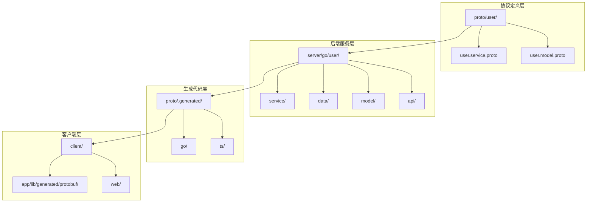
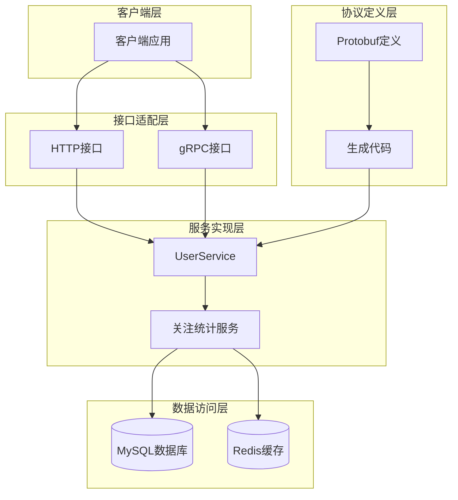
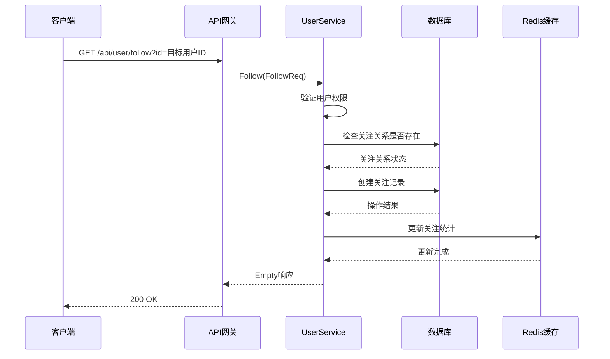
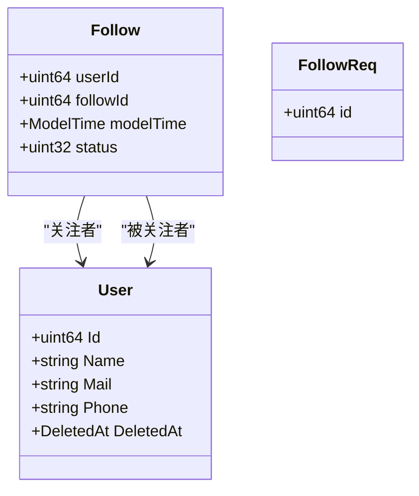
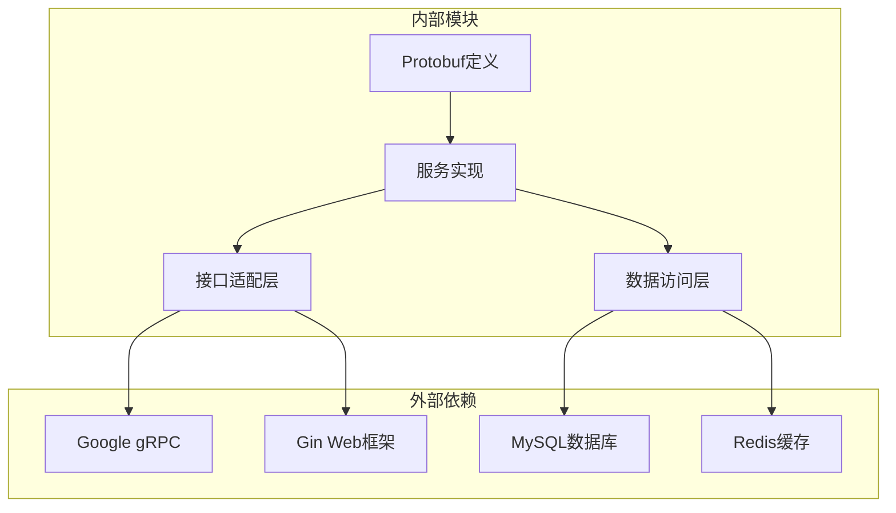

# 关注系统API

<cite>
**本文档引用的文件**
- [proto/user/user.service.proto](file://proto/user/user.service.proto)
- [server/go/user/service/stats.go](file://server/go/user/service/stats.go)
- [server/go/user/data/db/db.go](file://server/go/user/data/db/db.go)
- [server/go/user/data/redis/redis.go](file://server/go/user/data/redis/redis.go)
- [server/go/user/api/gin.go](file://server/go/user/api/gin.go)
- [server/go/user/api/grpc.go](file://server/go/user/api/grpc.go)
- [server/go/protobuf/user/user.service.pb.go](file://server/go/protobuf/user/user.service.pb.go)
- [proto/.generated/go/user/user.service.pb.go](file://proto/.generated/go/user/user.service.pb.go)
- [proto/.generated/ts/src/user/user.service.ts](file://proto/.generated/ts/src/user/user.service.ts)
- [proto/.generated/ts/src/user/user.model.ts](file://proto/.generated/ts/src/user/user.model.ts)
- [client/app/lib/generated/protobuf/user/user.model.pb.dart](file://client/app/lib/generated/protobuf/user/user.model.pb.dart)
</cite>

## 目录
1. [简介](#简介)
2. [项目结构](#项目结构)
3. [核心组件](#核心组件)
4. [架构概览](#架构概览)
5. [详细组件分析](#详细组件分析)
6. [依赖分析](#依赖分析)
7. [性能考虑](#性能考虑)
8. [故障排除指南](#故障排除指南)
9. [结论](#结论)

## 简介

关注系统API是HopeIO平台的核心社交功能模块，负责管理用户之间的关注关系。该系统实现了完整的社交关系管理功能，包括用户关注、取消关注、关注列表查询、粉丝列表查询等核心接口。

系统采用微服务架构，基于gRPC和HTTP协议提供双栈API支持，通过Protobuf定义数据契约，确保前后端数据传输的一致性和高效性。关注关系数据存储在关系型数据库中，同时利用Redis缓存关键统计数据，保证系统的高性能和可扩展性。

## 项目结构

关注系统API主要分布在以下目录结构中：

**图表来源**
- [proto/user/user.service.proto:1-425](file://proto/user/user.service.proto#L1-L425)
- [server/go/user/service/stats.go:1-65](file://server/go/user/service/stats.go#L1-L65)

**章节来源**
- [proto/user/user.service.proto:1-425](file://proto/user/user.service.proto#L1-L425)
- [server/go/user/service/stats.go:1-65](file://server/go/user/service/stats.go#L1-L65)

## 核心组件

关注系统API由多个核心组件构成，每个组件承担特定的职责：

### 协议定义组件
- **UserService**: 定义用户关注相关的RPC接口
- **FollowReq**: 关注请求消息定义
- **Follow**: 关注关系数据模型

### 服务实现组件
- **UserService**: 实现关注业务逻辑
- **UserDao**: 数据访问层实现
- **RedisDao**: 缓存数据访问层

### 接口适配组件
- **Gin注册器**: HTTP接口适配
- **GRPC注册器**: gRPC接口适配

**章节来源**
- [proto/user/user.service.proto:236-258](file://proto/user/user.service.proto#L236-L258)
- [server/go/user/service/stats.go:16-64](file://server/go/user/service/stats.go#L16-L64)

## 架构概览

关注系统采用分层架构设计，确保关注功能的可维护性和可扩展性：

**图表来源**
- [server/go/user/api/gin.go:10-15](file://server/go/user/api/gin.go#L10-L15)
- [server/go/user/api/grpc.go:9-12](file://server/go/user/api/grpc.go#L9-L12)

## 详细组件分析

### 关注接口定义

关注系统提供了完整的关注关系管理接口，所有接口都通过Protobuf定义并自动生成相应的代码。

#### 关注接口 (Follow)
- **HTTP方法**: GET
- **URL模式**: `/api/user/follow`
- **请求参数**: 
  - `id`: 目标用户ID (uint64)
- **响应格式**: google.protobuf.Empty
- **认证要求**: 需要授权头

#### 取消关注接口 (DelFollow)
- **HTTP方法**: DELETE
- **URL模式**: `/api/user/follow`
- **请求参数**: 
  - `id`: 目标用户ID (uint64)
- **响应格式**: BaseListResp
- **认证要求**: 需要授权头

**图表来源**
- [proto/user/user.service.proto:236-258](file://proto/user/user.service.proto#L236-L258)
- [server/go/user/service/stats.go:17-40](file://server/go/user/service/stats.go#L17-L40)

**章节来源**
- [proto/user/user.service.proto:236-258](file://proto/user/user.service.proto#L236-L258)
- [server/go/user/service/stats.go:17-40](file://server/go/user/service/stats.go#L17-L40)

### 关注关系数据模型

关注关系通过Follow消息定义，包含以下关键字段：

**图表来源**
- [proto/.generated/ts/src/user/user.model.ts:1091-1184](file://proto/.generated/ts/src/user/user.model.ts#L1091-L1184)
- [client/app/lib/generated/protobuf/user/user.model.pb.dart:490-527](file://client/app/lib/generated/protobuf/user/user.model.pb.dart#L490-L527)

**章节来源**
- [proto/.generated/ts/src/user/user.model.ts:1091-1184](file://proto/.generated/ts/src/user/user.model.ts#L1091-L1184)
- [client/app/lib/generated/protobuf/user/user.model.pb.dart:490-527](file://client/app/lib/generated/protobuf/user/user.model.pb.dart#L490-L527)

### 数据访问层实现

数据访问层提供了关注关系的持久化操作，包括存在性检查和关系创建：

#### 关注关系存在性检查
- **SQL查询**: 使用EXISTS子查询检查关注关系
- **删除软删除**: 自动过滤deleted_at不为空的记录
- **性能优化**: 使用LIMIT 1避免全表扫描

#### 关注关系创建
- **事务处理**: 确保数据一致性
- **时间戳**: 自动记录创建和更新时间
- **状态管理**: 默认状态为激活

**章节来源**
- [server/go/user/data/db/db.go:173-182](file://server/go/user/data/db/db.go#L173-L182)
- [server/go/user/data/db/db.go:32-36](file://server/go/user/data/db/db.go#L32-L36)

### 缓存策略

系统采用Redis缓存关注统计数据，提高查询性能：

#### 用户扩展信息缓存
- **缓存键**: user_ext:{userId}
- **缓存字段**: 
  - Follow: 关注数量
  - Followed: 粉丝数量
- **更新策略**: 关注/取消关注时实时更新

#### 登录用户信息缓存
- **缓存键**: login_user:{userId}
- **缓存内容**: 用户基本信息和角色
- **过期时间**: 基于配置的令牌有效期

**章节来源**
- [server/go/user/data/redis/redis.go:186-204](file://server/go/user/data/redis/redis.go#L186-L204)
- [server/go/user/data/redis/redis.go:30-44](file://server/go/user/data/redis/redis.go#L30-L44)

## 依赖分析

关注系统API的依赖关系呈现清晰的分层结构：

**图表来源**
- [server/go/user/api/gin.go:10-15](file://server/go/user/api/gin.go#L10-L15)
- [server/go/user/api/grpc.go:9-12](file://server/go/user/api/grpc.go#L9-L12)

### 主要依赖关系

1. **协议依赖**: Protobuf定义作为所有接口的契约基础
2. **框架依赖**: Gin和gRPC提供HTTP和RPC接口支持
3. **数据依赖**: GORM ORM处理数据库操作
4. **缓存依赖**: Redis提供高性能缓存支持

**章节来源**
- [server/go/user/api/gin.go:10-15](file://server/go/user/api/gin.go#L10-L15)
- [server/go/user/api/grpc.go:9-12](file://server/go/user/api/grpc.go#L9-L12)

## 性能考虑

关注系统在设计时充分考虑了性能优化：

### 查询优化
- **索引策略**: 在user_id和follow_id上建立复合索引
- **查询优化**: 使用EXISTS替代COUNT提高查询效率
- **缓存命中**: 关注统计信息缓存减少数据库压力

### 写入优化
- **批量操作**: 支持批量关注操作
- **异步处理**: 非关键操作异步执行
- **事务控制**: 合理使用事务保证数据一致性

### 缓存策略
- **热点数据**: 关注统计信息缓存
- **失效策略**: 基于配置的自动过期
- **内存管理**: 合理的内存使用和回收

## 故障排除指南

### 常见问题及解决方案

#### 关注失败
**问题描述**: 用户无法关注其他用户
**可能原因**:
- 用户权限不足
- 目标用户不存在
- 数据库连接异常

**解决步骤**:
1. 检查用户认证状态
2. 验证目标用户ID有效性
3. 查看数据库连接日志

#### 取消关注异常
**问题描述**: 取消关注操作失败
**可能原因**:
- 关注关系不存在
- 数据库事务冲突
- 缓存同步延迟

**解决步骤**:
1. 确认关注关系状态
2. 检查数据库事务日志
3. 清理相关缓存数据

#### 性能问题
**问题描述**: 关注操作响应缓慢
**可能原因**:
- 数据库索引缺失
- 缓存配置不当
- 并发访问过高

**解决步骤**:
1. 分析数据库查询计划
2. 检查缓存命中率
3. 调整并发限制

**章节来源**
- [server/go/user/service/stats.go:25-38](file://server/go/user/service/stats.go#L25-L38)
- [server/go/user/data/db/db.go:173-182](file://server/go/user/data/db/db.go#L173-L182)

## 结论

关注系统API通过精心设计的架构和实现，为用户提供了一个高效、可靠的社交关系管理功能。系统采用现代化的技术栈，结合Protobuf协议定义、gRPC和HTTP双栈支持，以及Redis缓存优化，确保了良好的性能和可扩展性。

主要特点包括：
- **完整的功能覆盖**: 支持关注、取消关注、关系查询等核心功能
- **高性能设计**: 通过缓存和索引优化提升系统性能
- **可靠的数据一致性**: 使用事务和软删除机制保证数据安全
- **灵活的接口支持**: 同时支持HTTP和gRPC两种协议
- **完善的错误处理**: 提供详细的错误码和异常处理机制

未来可以考虑的功能增强包括：
- 关注关系的批量操作支持
- 关注统计的实时更新机制
- 社交推荐算法的集成
- 关注关系的审计日志功能