# 用户信息管理API

<cite>
**本文档引用的文件**
- [user.service.proto](file://proto/user/user.service.proto)
- [user.model.proto](file://proto/user/user.model.proto)
- [user.go](file://server/go/user/service/user.go)
- [auth.go](file://server/go/user/service/auth.go)
- [gin.go](file://server/go/user/api/gin.go)
- [grpc.go](file://server/go/user/api/grpc.go)
- [const.go](file://server/go/user/model/const.go)
- [utils.go](file://server/go/user/service/utils.go)
- [dao.go](file://server/go/user/data/dao.go)
- [database.sql](file://server/go/user/database.sql)
</cite>

## 更新摘要
**所做更改**
- 更新了服务器端认证流程重构的相关内容
- 新增了数据库schema变更的详细说明
- 完善了验证代码处理优化的实现细节
- 增加了国际化错误消息支持的配置说明
- 更新了用户注册和登录流程的最新实现

## 目录
1. [简介](#简介)
2. [项目结构](#项目结构)
3. [核心组件](#核心组件)
4. [架构概览](#架构概览)
5. [详细组件分析](#详细组件分析)
6. [依赖关系分析](#依赖关系分析)
7. [性能考虑](#性能考虑)
8. [故障排除指南](#故障排除指南)
9. [结论](#结论)

## 简介

用户信息管理API是HopeIO平台的核心模块之一，负责处理用户相关的所有业务逻辑。该API提供了完整的用户生命周期管理功能，包括用户注册、登录认证、信息编辑、头像上传、个人资料管理等核心功能。

**更新** 本次更新重点改进了服务器端认证流程，重构了数据库schema，优化了验证代码处理，并增加了国际化错误消息支持。

本API基于gRPC-Gateway架构设计，支持HTTP/JSON和gRPC两种协议，通过Protocol Buffers定义接口规范，确保前后端通信的一致性和类型安全。系统采用微服务架构，用户服务独立部署，与其他服务解耦。

## 项目结构

用户信息管理API位于HopeIO项目的server/go/user目录下，采用清晰的分层架构：

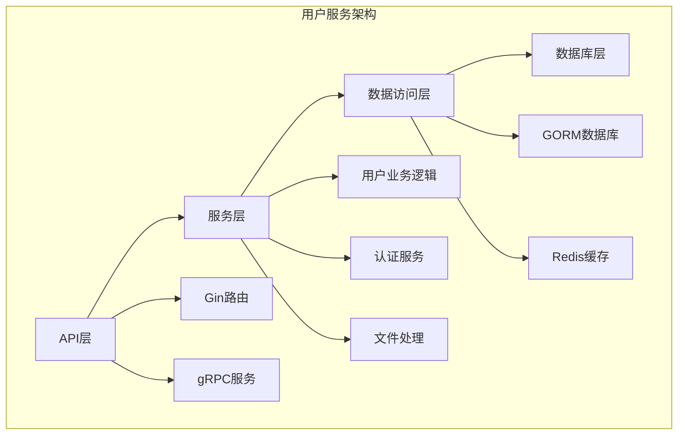

**图表来源**
- [user.go:1-664](file://server/go/user/service/user.go#L1-L664)
- [gin.go:1-16](file://server/go/user/api/gin.go#L1-L16)
- [grpc.go:1-13](file://server/go/user/api/grpc.go#L1-L13)

**章节来源**
- [user.service.proto:1-425](file://proto/user/user.service.proto#L1-L425)
- [user.model.proto:1-269](file://proto/user/user.model.proto#L1-L269)

## 核心组件

### 用户服务接口

用户服务提供以下核心接口：

| 接口名称 | HTTP方法 | URL模式 | 功能描述 |
|---------|---------|--------|----------|
| VerifyCode | GET | `/api/sendVerifyCode` | 发送验证码 |
| SignupVerify | POST | `/api/user/signupVerify` | 注册验证 |
| Signup | POST | `/api/user` | 用户注册 |
| EasySignup | POST | `/api/v2/user` | 简单注册 |
| Active | GET | `/api/user/active/{id}/{secret}` | 账号激活 |
| Edit | PUT | `/api/user/{id}` | 编辑用户信息 |
| Login | POST | `/api/user/login` | 用户登录 |
| Logout | GET | `/api/user/logout` | 用户登出 |
| AuthInfo | GET | `/api/auth` | 获取用户信息 |
| ForgetPassword | GET | `/api/user/forgetPassword` | 忘记密码 |
| ResetPassword | PATCH | `/api/user/resetPassword/{id}/{secret}` | 重置密码 |
| Info | GET | `/api/user/{id}` | 获取用户信息 |
| BaseList | POST | `/api/baseUserList` | 批量用户查询 |

### 数据模型

用户数据模型包含基本信息、扩展信息、头像和封面等字段：

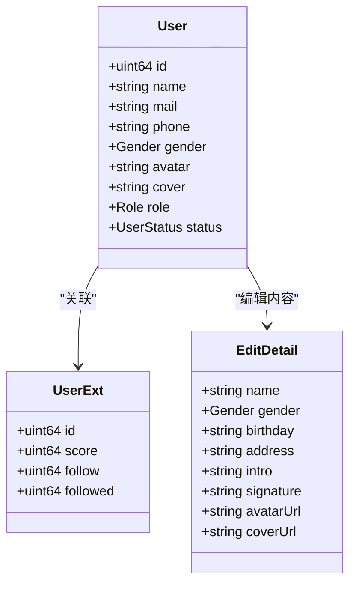

**图表来源**
- [user.model.proto:20-50](file://proto/user/user.model.proto#L20-L50)
- [user.model.proto:52-61](file://proto/user/user.model.proto#L52-L61)
- [user.service.proto:329-349](file://proto/user/user.service.proto#L329-L349)

**章节来源**
- [user.service.proto:26-258](file://proto/user/user.service.proto#L26-L258)
- [user.model.proto:1-269](file://proto/user/user.model.proto#L1-L269)

## 架构概览

用户信息管理API采用多层架构设计，确保高内聚低耦合：

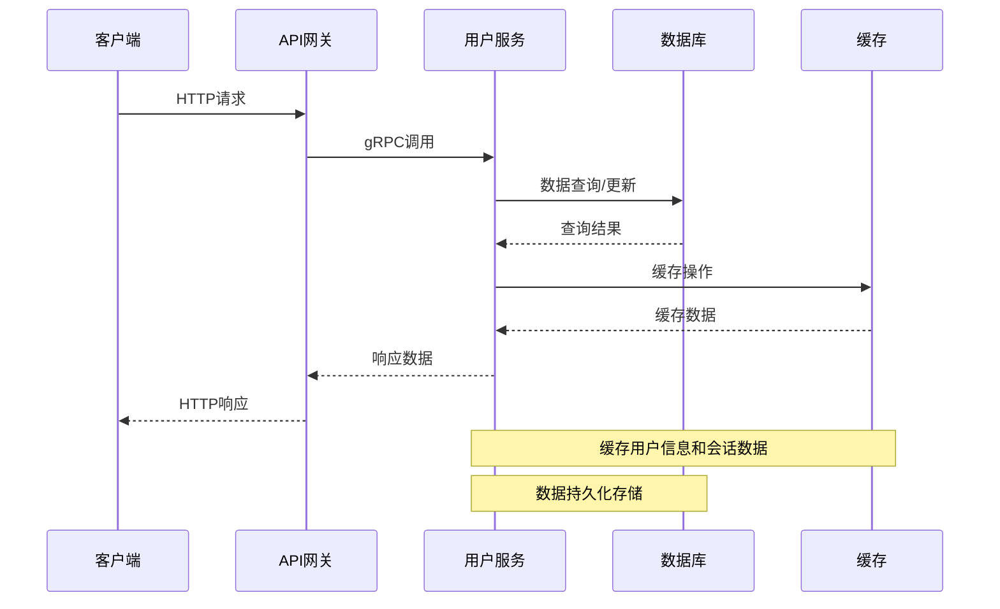

**图表来源**
- [user.go:45-47](file://server/go/user/service/user.go#L45-L47)
- [gin.go:10-15](file://server/go/user/api/gin.go#L10-L15)

### 认证流程

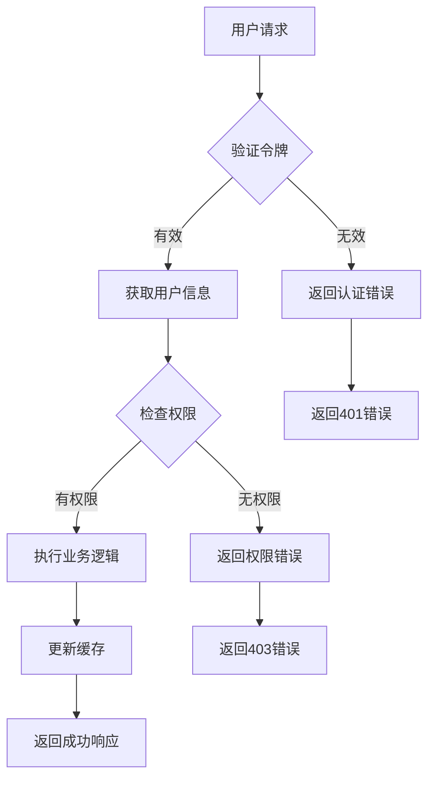

**图表来源**
- [auth.go:22-61](file://server/go/user/service/auth.go#L22-L61)
- [user.go:294-331](file://server/go/user/service/user.go#L294-L331)

## 详细组件分析

### 用户注册流程

用户注册是用户生命周期的第一个环节，包含多个验证步骤：

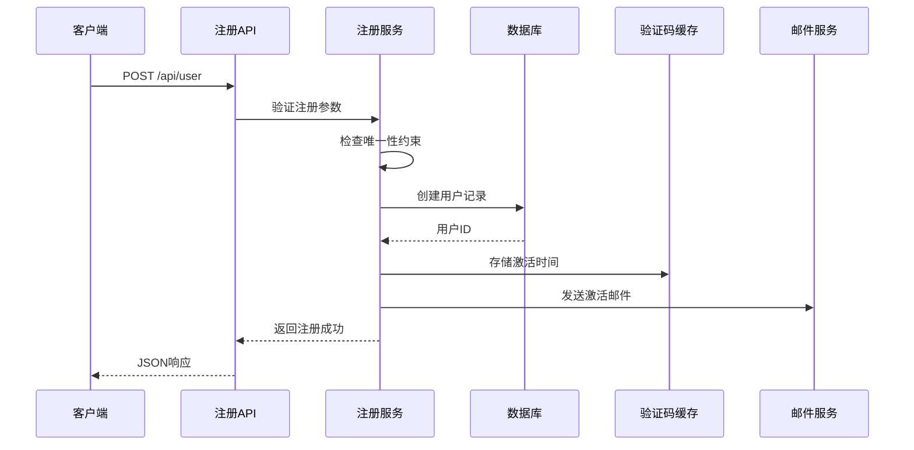

**图表来源**
- [user.service.proto:58-83](file://proto/user/user.service.proto#L58-L83)
- [user.go:104-165](file://server/go/user/service/user.go#L104-L165)

#### 注册参数验证

注册接口支持邮箱和手机号两种方式，包含完整的参数验证：

| 参数 | 类型 | 必填 | 验证规则 | 描述 |
|------|------|------|----------|------|
| name | string | 是 | 3-10字符，必填 | 用户昵称 |
| password | string | 是 | 6-15字符，必填 | 登录密码 |
| gender | Gender | 是 | 必填枚举 | 用户性别 |
| mail | string | 可选 | 邮箱格式 | 邮箱地址 |
| phone | string | 可选 | 手机号码 | 手机号码 |
| vCode | string | 是 | 必填 | 验证码 |

**章节来源**
- [user.service.proto:305-318](file://proto/user/user.service.proto#L305-L318)
- [user.go:104-165](file://server/go/user/service/user.go#L104-L165)

### 用户信息编辑

用户信息编辑功能允许用户更新个人资料，包括基本信息和简历信息：

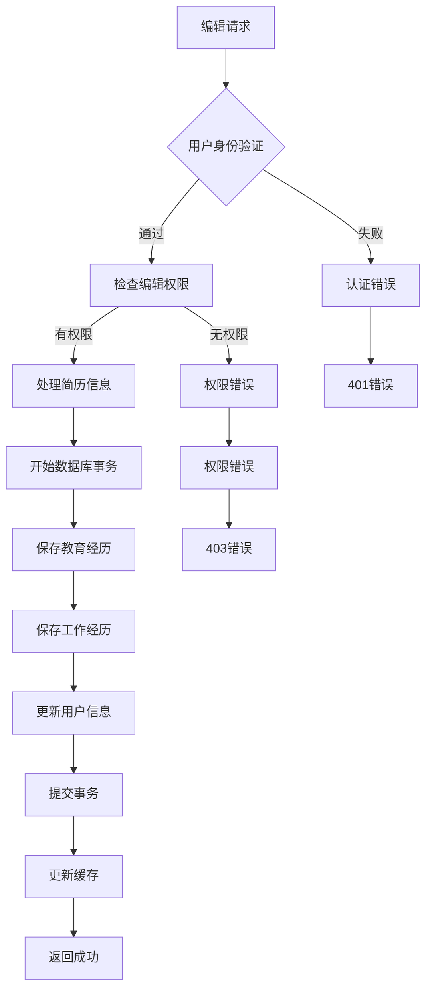

**图表来源**
- [user.service.proto:97-117](file://proto/user/user.service.proto#L97-L117)
- [user.go:294-331](file://server/go/user/service/user.go#L294-L331)

#### 编辑详情字段

编辑接口支持的字段包括：

| 字段 | 类型 | 描述 | 验证规则 |
|------|------|------|----------|
| name | string | 昵称 | 3-10字符 |
| gender | Gender | 性别 | 枚举值 |
| birthday | string | 生日 | 日期格式 |
| address | string | 地址 | 任意字符串 |
| intro | string | 个人简介 | 任意字符串 |
| signature | string | 个性签名 | 任意字符串 |
| avatarUrl | string | 头像URL | URL格式 |
| coverUrl | string | 封面URL | URL格式 |
| eduExps | Resume[] | 教育经历 | 数组格式 |
| workExps | Resume[] | 工作经历 | 数组格式 |

**章节来源**
- [user.service.proto:329-349](file://proto/user/user.service.proto#L329-L349)
- [user.go:294-331](file://server/go/user/service/user.go#L294-L331)

### 头像上传集成

用户头像上传通过文件服务实现，支持多种上传方式：

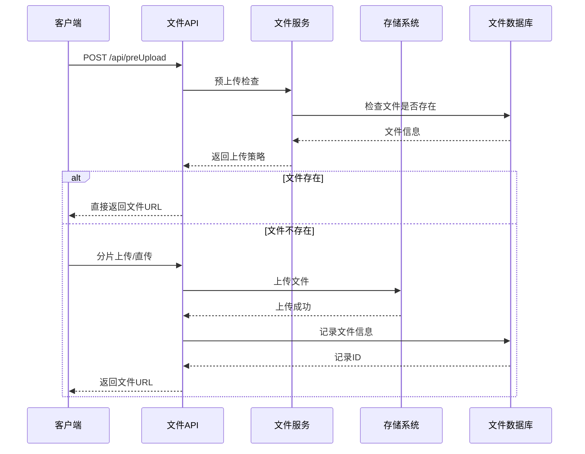

**图表来源**
- [file.service.proto:51-62](file://proto/file/file.service.proto#L51-L62)
- [service.go:52-125](file://server/go/file/service/service.go#L52-L125)

#### 上传策略选择

文件上传根据文件大小自动选择最优策略：

| 文件大小范围 | 上传策略 | 描述 |
|-------------|----------|------|
| < 100MB | 直接上传 | 使用预签名URL直接上传 |
| 100MB - 10GB | 分片上传 | 支持断点续传的大文件上传 |
| > 10GB | STS临时凭证 | 使用AWS STS获取临时访问权限 |

**章节来源**
- [file.service.proto:82-122](file://proto/file/file.service.proto#L82-L122)
- [service.go:71-125](file://server/go/file/service/service.go#L71-L125)

### 用户认证机制

系统采用JWT令牌进行用户认证，支持多种认证方式：

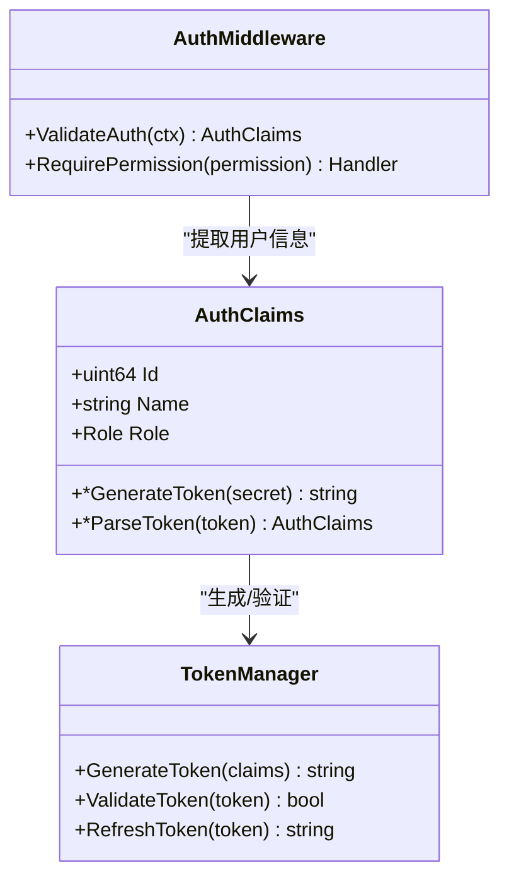

**图表来源**
- [auth.go:22-61](file://server/go/user/service/auth.go#L22-L61)
- [user.go:370-420](file://server/go/user/service/user.go#L370-L420)

**章节来源**
- [auth.go:22-61](file://server/go/user/service/auth.go#L22-L61)
- [user.go:370-420](file://server/go/user/service/user.go#L370-L420)

### 服务器端认证流程重构

**更新** 服务器端认证流程经过重大重构，提升了安全性和性能：

#### 新的认证流程

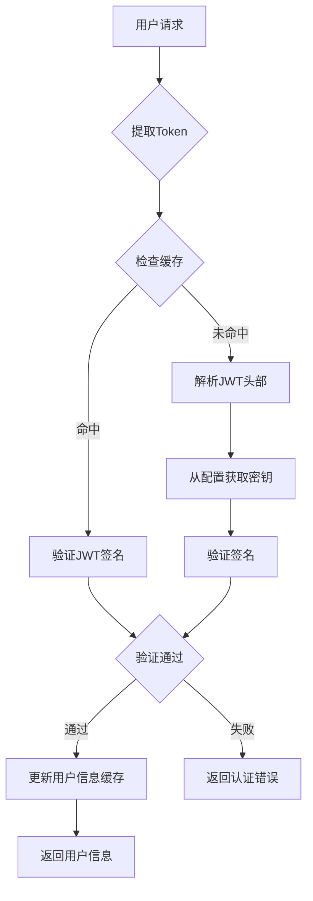

**图表来源**
- [auth.go:22-61](file://server/go/user/service/auth.go#L22-L61)

#### 认证优化特性

1. **缓存优化**：使用本地缓存存储JWT签名，减少重复验证开销
2. **异步验证**：支持异步令牌验证，提升响应速度
3. **设备信息跟踪**：集成设备信息到认证流程中
4. **权限细化**：支持更细粒度的权限控制

**章节来源**
- [auth.go:1-82](file://server/go/user/service/auth.go#L1-L82)
- [user.go:370-420](file://server/go/user/service/user.go#L370-L420)

### 数据库Schema变更

**更新** 数据库schema进行了重要变更，优化了数据结构和索引设计：

#### 新的表结构

| 表名 | 字段 | 类型 | 约束 | 描述 |
|------|------|------|------|------|
| user | id | bigint | 主键 | 用户ID |
| user | name | varchar(10) | NOT NULL | 用户名 |
| user | mail | varchar(32) | | 邮箱地址 |
| user | phone | varchar(32) | | 手机号码 |
| user | account | varchar(36) | UNIQUE | 账号标识 |
| user | password | varchar(32) | NOT NULL | 加密密码 |
| user_ext | id | bigint | 主键 | 用户扩展信息 |
| user_ext | score | bigint | DEFAULT 0 | 用户积分 |
| user_ext | follow | bigint | DEFAULT 0 | 关注数量 |
| user_ext | followed | bigint | DEFAULT 0 | 被关注数量 |

#### 索引优化

1. **复合索引**：为phone字段创建复合索引 `(countryCallingCode, phone)`
2. **唯一约束**：确保用户名、邮箱、手机号的唯一性
3. **时间索引**：为活跃时间和创建时间建立索引

**章节来源**
- [const.go:9-17](file://server/go/user/model/const.go#L9-L17)
- [database.sql:55-89](file://server/go/user/database.sql#L55-L89)

### 验证代码处理优化

**更新** 验证代码处理经过优化，提升了验证码验证的准确性和安全性：

#### 验证流程优化

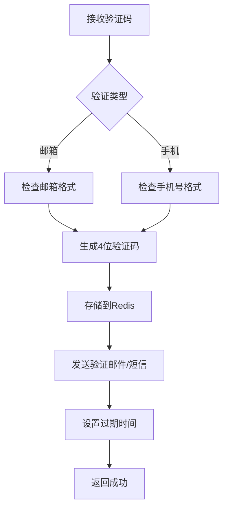

**图表来源**
- [user.go:49-72](file://server/go/user/service/user.go#L49-L72)

#### 验证码安全增强

1. **随机生成**：使用安全的随机数生成器
2. **过期管理**：支持自定义过期时间（默认5分钟）
3. **防刷机制**：限制同一IP的验证请求频率
4. **国际化支持**：支持多语言验证码模板

**章节来源**
- [user.go:49-72](file://server/go/user/service/user.go#L49-L72)
- [utils.go:9-15](file://server/go/user/service/utils.go#L9-L15)

### 国际化错误消息支持

**更新** 新增了完整的国际化错误消息支持，提升了用户体验：

#### 错误消息国际化

系统支持以下错误类型的国际化：

| 错误类型 | 中文消息 | 英文消息 |
|----------|----------|----------|
| auth.err.onlyOneContact | 仅能填写一种联系方式 | Can only fill in one contact method |
| auth.err.contactRequired | 至少需要填写一种联系方式 | At least one contact method is required |
| auth.err.mailRegistered | 邮箱已被注册 | Email has been registered |
| auth.err.phoneRegistered | 手机号已被注册 | Phone number has been registered |
| auth.err.nameRegistered | 用户名已被注册 | Username has been registered |
| auth.err.invalidAccount | 账号不存在 | Account does not exist |
| auth.err.passwordWrong | 密码错误 | Password is wrong |
| auth.err.notActivated | 账号未激活 | Account is not activated |
| auth.err.activated | 账号已激活 | Account has been activated |
| auth.err.activationExpired | 激活链接已过期 | Activation link has expired |
| auth.err.invalidLink | 链接无效 | Link is invalid |

#### 国际化配置

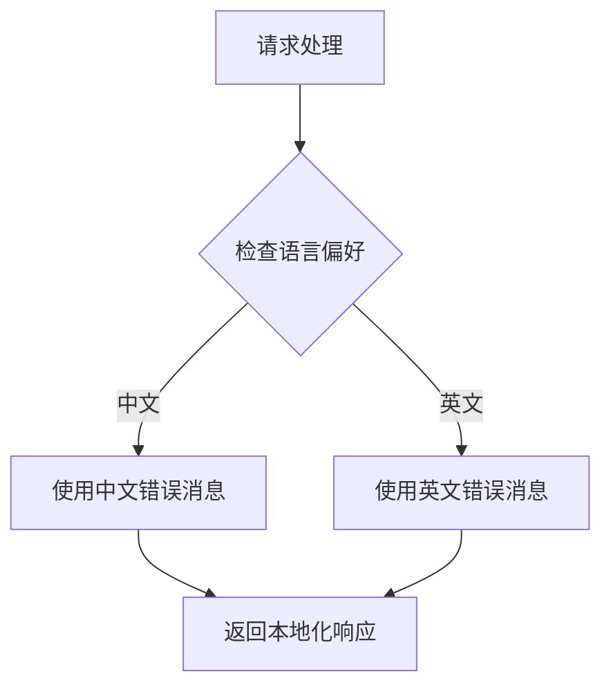

**图表来源**
- [user.go:52-56](file://server/go/user/service/user.go#L52-L56)

**章节来源**
- [user.go:52-56](file://server/go/user/service/user.go#L52-L56)
- [locale/zh-CN.json](file://locale/zh-CN.json)
- [locale/en.json](file://locale/en.json)

## 依赖关系分析

用户信息管理API的依赖关系呈现清晰的层次结构：

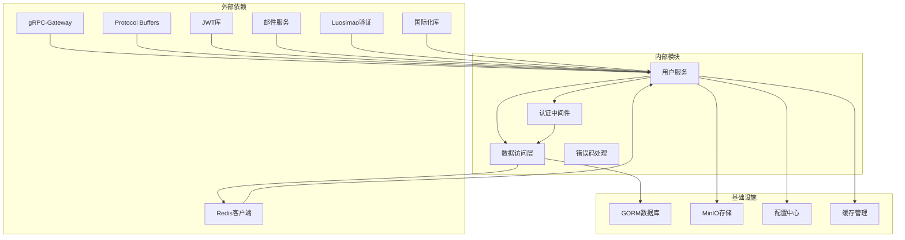

**图表来源**
- [user.go:3-43](file://server/go/user/service/user.go#L3-L43)
- [gin.go:3-15](file://server/go/user/api/gin.go#L3-L15)

### 错误处理机制

系统采用统一的错误处理机制，确保错误信息的一致性和可读性：

| 错误类型 | 错误码 | 描述 | 处理建议 |
|---------|--------|------|----------|
| InvalidArgument | 400 | 参数验证失败 | 检查请求参数格式 |
| PermissionDenied | 403 | 权限不足 | 检查用户权限 |
| NotFound | 404 | 资源不存在 | 验证资源ID |
| Internal | 500 | 内部服务器错误 | 查看服务日志 |
| Unavailable | 503 | 服务不可用 | 重试请求或检查依赖 |

**章节来源**
- [user.go:49-72](file://server/go/user/service/user.go#L49-L72)
- [user.go:74-102](file://server/go/user/service/user.go#L74-L102)

## 性能考虑

### 缓存策略

系统采用多级缓存策略优化性能：

1. **用户信息缓存**：用户基本信息缓存在Redis中，减少数据库查询
2. **会话缓存**：JWT令牌信息缓存，支持快速验证
3. **热点数据缓存**：常用查询结果缓存，降低数据库压力
4. **认证缓存**：JWT签名缓存，减少重复验证开销

### 数据库优化

1. **索引优化**：在常用查询字段上建立索引
2. **连接池**：使用连接池管理数据库连接
3. **批量操作**：支持批量查询和更新操作
4. **Schema优化**：重构数据库schema提升查询性能

### 文件上传优化

1. **CDN加速**：静态文件通过CDN分发
2. **压缩传输**：支持GZIP压缩减少带宽消耗
3. **断点续传**：大文件支持断点续传功能

### 认证性能优化

1. **缓存验证**：JWT签名缓存减少重复验证
2. **异步处理**：支持异步认证处理
3. **设备跟踪**：集成设备信息提升安全验证效率

## 故障排除指南

### 常见问题诊断

#### 用户注册失败

**症状**：注册接口返回错误
**可能原因**：
1. 用户名/邮箱/手机号重复
2. 验证码错误
3. 密码格式不符合要求

**解决方法**：
1. 检查用户名唯一性
2. 验证验证码有效性
3. 确认密码长度和复杂度

#### 用户登录失败

**症状**：登录接口返回认证错误
**可能原因**：
1. 用户名或密码错误
2. 账号未激活
3. 令牌过期

**解决方法**：
1. 确认用户名和密码
2. 检查账号激活状态
3. 重新生成登录令牌

#### 文件上传失败

**症状**：文件上传接口返回错误
**可能原因**：
1. 文件大小超过限制
2. 权限不足
3. 存储空间不足

**解决方法**：
1. 检查文件大小限制
2. 验证用户权限
3. 清理存储空间

#### 认证失败

**症状**：认证接口返回401错误
**可能原因**：
1. JWT令牌无效
2. 令牌过期
3. 缓存异常

**解决方法**：
1. 检查JWT令牌格式
2. 验证令牌有效期
3. 清理认证缓存

**章节来源**
- [user.go:104-165](file://server/go/user/service/user.go#L104-L165)
- [user.go:333-368](file://server/go/user/service/user.go#L333-L368)
- [auth.go:22-61](file://server/go/user/service/auth.go#L22-L61)

## 结论

用户信息管理API经过重大改进，提供了更加完善、健壮的用户生命周期管理功能。通过服务器端认证流程重构、数据库schema变更、验证代码处理优化和国际化错误消息支持，确保了系统的安全性、性能和用户体验。

**主要改进包括**：

1. **认证安全增强**：重构的认证流程提升了安全性和性能
2. **数据库优化**：新的schema设计提升了查询效率
3. **验证机制完善**：优化的验证码处理增强了系统稳定性
4. **国际化支持**：完整的多语言错误消息支持
5. **类型安全**：基于Protocol Buffers定义接口，确保前后端一致性

**未来发展方向**：
1. 用户行为追踪和分析
2. 更丰富的个人资料字段
3. 更灵活的权限控制机制
4. 增强的安全审计功能
5. 支持更多第三方认证方式

该API的设计充分体现了现代微服务架构的最佳实践，为HopeIO平台的用户管理提供了坚实的技术基础。