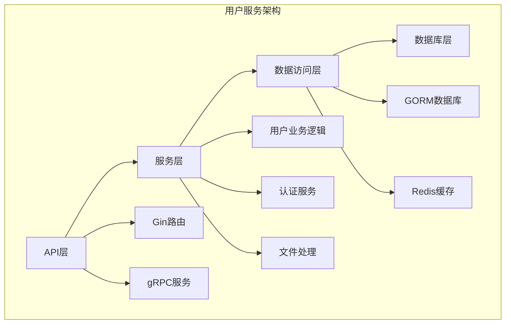
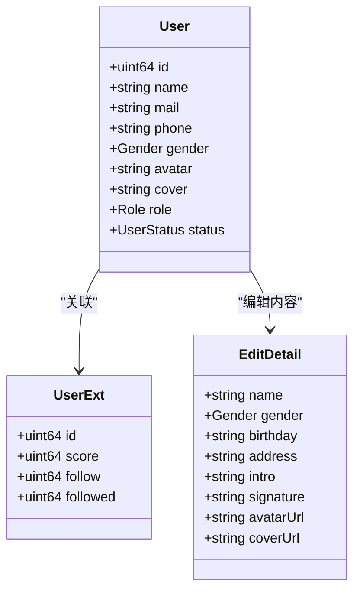
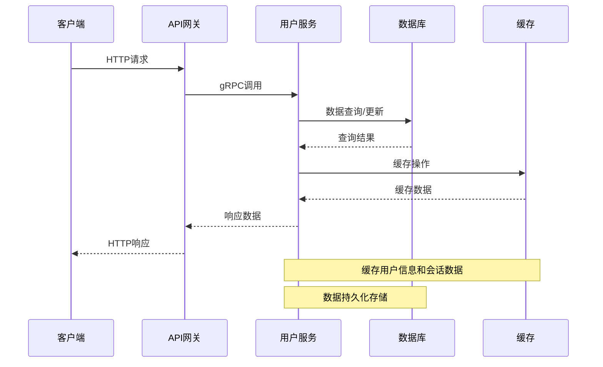
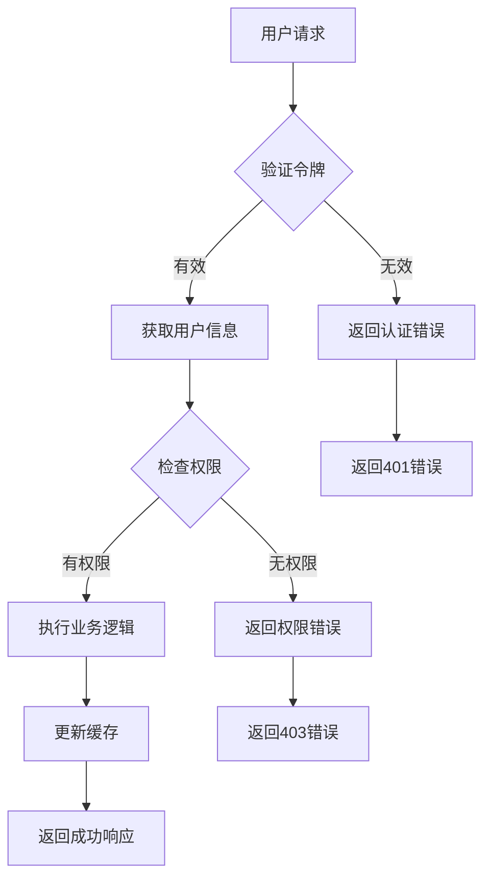
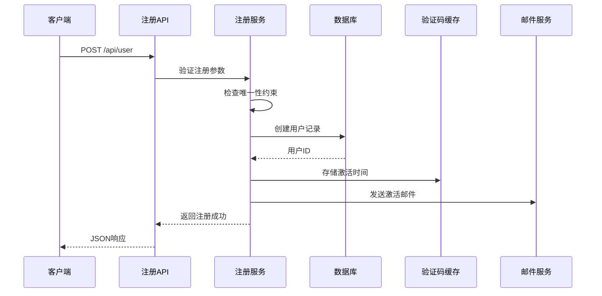
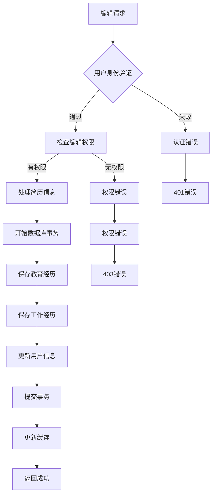
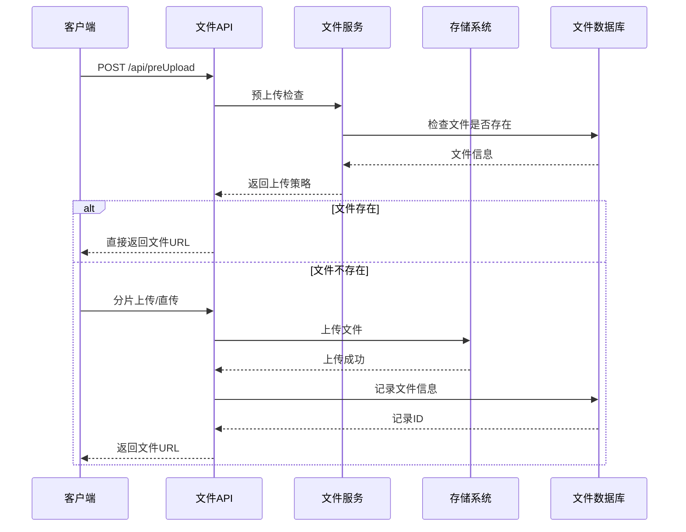
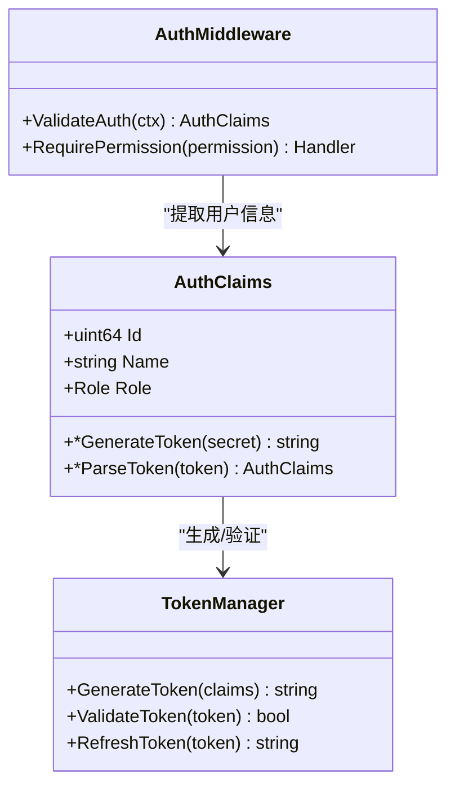
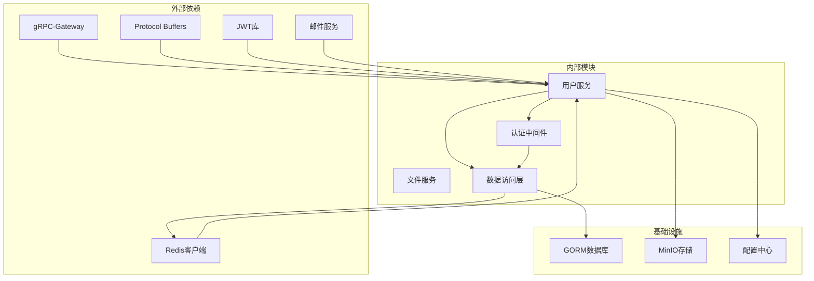

# 用户信息管理API

<cite>
**本文档引用的文件**
- [user.service.proto](file://proto/user/user.service.proto)
- [user.model.proto](file://proto/user/user.model.proto)
- [user.go](file://server/go/user/service/user.go)
- [gin.go](file://server/go/user/api/gin.go)
- [grpc.go](file://server/go/user/api/grpc.go)
- [const.go](file://server/go/user/model/const.go)
- [file.service.proto](file://proto/file/file.service.proto)
- [upload.go](file://server/go/file/service/upload.go)
- [service.go](file://server/go/file/service/service.go)
- [file_gin.go](file://server/go/file/api/gin.go)
</cite>

## 目录
1. [简介](#简介)
2. [项目结构](#项目结构)
3. [核心组件](#核心组件)
4. [架构概览](#架构概览)
5. [详细组件分析](#详细组件分析)
6. [依赖关系分析](#依赖关系分析)
7. [性能考虑](#性能考虑)
8. [故障排除指南](#故障排除指南)
9. [结论](#结论)

## 简介

用户信息管理API是HopeIO平台的核心模块之一，负责处理用户相关的所有业务逻辑。该API提供了完整的用户生命周期管理功能，包括用户注册、登录认证、信息编辑、头像上传、个人资料管理等核心功能。

本API基于gRPC-Gateway架构设计，支持HTTP/JSON和gRPC两种协议，通过Protocol Buffers定义接口规范，确保前后端通信的一致性和类型安全。系统采用微服务架构，用户服务独立部署，与其他服务解耦。

## 项目结构

用户信息管理API位于HopeIO项目的server/go/user目录下，采用清晰的分层架构：

**图表来源**
- [user.go:1-664](file://server/go/user/service/user.go#L1-L664)
- [gin.go:1-16](file://server/go/user/api/gin.go#L1-L16)
- [grpc.go:1-13](file://server/go/user/api/grpc.go#L1-L13)

**章节来源**
- [user.service.proto:1-425](file://proto/user/user.service.proto#L1-L425)
- [user.model.proto:1-269](file://proto/user/user.model.proto#L1-L269)

## 核心组件

### 用户服务接口

用户服务提供以下核心接口：

| 接口名称 | HTTP方法 | URL模式 | 功能描述 |
|---------|---------|--------|----------|
| VerifyCode | GET | `/api/sendVerifyCode` | 发送验证码 |
| SignupVerify | POST | `/api/user/signupVerify` | 注册验证 |
| Signup | POST | `/api/user` | 用户注册 |
| EasySignup | POST | `/api/v2/user` | 简单注册 |
| Active | GET | `/api/user/active/{id}/{secret}` | 账号激活 |
| Edit | PUT | `/api/user/{id}` | 编辑用户信息 |
| Login | POST | `/api/user/login` | 用户登录 |
| Logout | GET | `/api/user/logout` | 用户登出 |
| AuthInfo | GET | `/api/auth` | 获取用户信息 |
| ForgetPassword | GET | `/api/user/forgetPassword` | 忘记密码 |
| ResetPassword | PATCH | `/api/user/resetPassword/{id}/{secret}` | 重置密码 |
| Info | GET | `/api/user/{id}` | 获取用户信息 |
| BaseList | POST | `/api/baseUserList` | 批量用户查询 |

### 数据模型

用户数据模型包含基本信息、扩展信息、头像和封面等字段：

**图表来源**
- [user.model.proto:20-50](file://proto/user/user.model.proto#L20-L50)
- [user.model.proto:52-61](file://proto/user/user.model.proto#L52-L61)
- [user.service.proto:329-349](file://proto/user/user.service.proto#L329-L349)

**章节来源**
- [user.service.proto:26-258](file://proto/user/user.service.proto#L26-L258)
- [user.model.proto:1-269](file://proto/user/user.model.proto#L1-L269)

## 架构概览

用户信息管理API采用多层架构设计，确保高内聚低耦合：

**图表来源**
- [user.go:45-47](file://server/go/user/service/user.go#L45-L47)
- [gin.go:10-15](file://server/go/user/api/gin.go#L10-L15)

### 认证流程

**图表来源**
- [user.go:456-463](file://server/go/user/service/user.go#L456-L463)
- [user.go:294-331](file://server/go/user/service/user.go#L294-L331)

## 详细组件分析

### 用户注册流程

用户注册是用户生命周期的第一个环节，包含多个验证步骤：

**图表来源**
- [user.service.proto:58-83](file://proto/user/user.service.proto#L58-L83)
- [user.go:104-165](file://server/go/user/service/user.go#L104-L165)

#### 注册参数验证

注册接口支持邮箱和手机号两种方式，包含完整的参数验证：

| 参数 | 类型 | 必填 | 验证规则 | 描述 |
|------|------|------|----------|------|
| name | string | 是 | 3-10字符，必填 | 用户昵称 |
| password | string | 是 | 6-15字符，必填 | 登录密码 |
| gender | Gender | 是 | 必填枚举 | 用户性别 |
| mail | string | 可选 | 邮箱格式 | 邮箱地址 |
| phone | string | 可选 | 手机号码 | 手机号码 |
| vCode | string | 是 | 必填 | 验证码 |

**章节来源**
- [user.service.proto:305-318](file://proto/user/user.service.proto#L305-L318)
- [user.go:104-165](file://server/go/user/service/user.go#L104-L165)

### 用户信息编辑

用户信息编辑功能允许用户更新个人资料，包括基本信息和简历信息：

**图表来源**
- [user.service.proto:97-117](file://proto/user/user.service.proto#L97-L117)
- [user.go:294-331](file://server/go/user/service/user.go#L294-L331)

#### 编辑详情字段

编辑接口支持的字段包括：

| 字段 | 类型 | 描述 | 验证规则 |
|------|------|------|----------|
| name | string | 昵称 | 3-10字符 |
| gender | Gender | 性别 | 枚举值 |
| birthday | string | 生日 | 日期格式 |
| address | string | 地址 | 任意字符串 |
| intro | string | 个人简介 | 任意字符串 |
| signature | string | 个性签名 | 任意字符串 |
| avatarUrl | string | 头像URL | URL格式 |
| coverUrl | string | 封面URL | URL格式 |
| eduExps | Resume[] | 教育经历 | 数组格式 |
| workExps | Resume[] | 工作经历 | 数组格式 |

**章节来源**
- [user.service.proto:329-349](file://proto/user/user.service.proto#L329-L349)
- [user.go:294-331](file://server/go/user/service/user.go#L294-L331)

### 头像上传集成

用户头像上传通过文件服务实现，支持多种上传方式：

**图表来源**
- [file.service.proto:51-62](file://proto/file/file.service.proto#L51-L62)
- [service.go:52-125](file://server/go/file/service/service.go#L52-L125)

#### 上传策略选择

文件上传根据文件大小自动选择最优策略：

| 文件大小范围 | 上传策略 | 描述 |
|-------------|----------|------|
| < 100MB | 直接上传 | 使用预签名URL直接上传 |
| 100MB - 10GB | 分片上传 | 支持断点续传的大文件上传 |
| > 10GB | STS临时凭证 | 使用AWS STS获取临时访问权限 |

**章节来源**
- [file.service.proto:82-122](file://proto/file/file.service.proto#L82-L122)
- [service.go:71-125](file://server/go/file/service/service.go#L71-L125)

### 用户认证机制

系统采用JWT令牌进行用户认证，支持多种认证方式：

**图表来源**
- [user.go:370-420](file://server/go/user/service/user.go#L370-L420)
- [user.go:456-463](file://server/go/user/service/user.go#L456-L463)

**章节来源**
- [user.go:370-420](file://server/go/user/service/user.go#L370-L420)
- [user.go:456-463](file://server/go/user/service/user.go#L456-L463)

## 依赖关系分析

用户信息管理API的依赖关系呈现清晰的层次结构：

**图表来源**
- [user.go:3-43](file://server/go/user/service/user.go#L3-L43)
- [gin.go:3-15](file://server/go/user/api/gin.go#L3-L15)

### 错误处理机制

系统采用统一的错误处理机制，确保错误信息的一致性和可读性：

| 错误类型 | 错误码 | 描述 | 处理建议 |
|---------|--------|------|----------|
| InvalidArgument | 400 | 参数验证失败 | 检查请求参数格式 |
| PermissionDenied | 403 | 权限不足 | 检查用户权限 |
| NotFound | 404 | 资源不存在 | 验证资源ID |
| Internal | 500 | 内部服务器错误 | 查看服务日志 |
| Unavailable | 503 | 服务不可用 | 重试请求或检查依赖 |

**章节来源**
- [user.go:49-72](file://server/go/user/service/user.go#L49-L72)
- [user.go:74-102](file://server/go/user/service/user.go#L74-L102)

## 性能考虑

### 缓存策略

系统采用多级缓存策略优化性能：

1. **用户信息缓存**：用户基本信息缓存在Redis中，减少数据库查询
2. **会话缓存**：JWT令牌信息缓存，支持快速验证
3. **热点数据缓存**：常用查询结果缓存，降低数据库压力

### 数据库优化

1. **索引优化**：在常用查询字段上建立索引
2. **连接池**：使用连接池管理数据库连接
3. **批量操作**：支持批量查询和更新操作

### 文件上传优化

1. **CDN加速**：静态文件通过CDN分发
2. **压缩传输**：支持GZIP压缩减少带宽消耗
3. **断点续传**：大文件支持断点续传功能

## 故障排除指南

### 常见问题诊断

#### 用户注册失败

**症状**：注册接口返回错误
**可能原因**：
1. 用户名/邮箱/手机号重复
2. 验证码错误
3. 密码格式不符合要求

**解决方法**：
1. 检查用户名唯一性
2. 验证验证码有效性
3. 确认密码长度和复杂度

#### 用户登录失败

**症状**：登录接口返回认证错误
**可能原因**：
1. 用户名或密码错误
2. 账号未激活
3. 令牌过期

**解决方法**：
1. 确认用户名和密码
2. 检查账号激活状态
3. 重新生成登录令牌

#### 文件上传失败

**症状**：文件上传接口返回错误
**可能原因**：
1. 文件大小超过限制
2. 权限不足
3. 存储空间不足

**解决方法**：
1. 检查文件大小限制
2. 验证用户权限
3. 清理存储空间

**章节来源**
- [user.go:104-165](file://server/go/user/service/user.go#L104-L165)
- [user.go:333-368](file://server/go/user/service/user.go#L333-L368)
- [upload.go:35-69](file://server/go/file/service/upload.go#L35-L69)

## 结论

用户信息管理API提供了完整、健壮的用户生命周期管理功能。通过清晰的架构设计、完善的错误处理机制和优化的性能策略，确保了系统的稳定性和可扩展性。

该API的主要优势包括：
1. **类型安全**：基于Protocol Buffers定义接口，确保前后端一致性
2. **认证完善**：支持多种认证方式，确保安全性
3. **性能优化**：多级缓存和数据库优化策略
4. **扩展性强**：模块化设计支持功能扩展
5. **易于维护**：清晰的代码结构和文档

未来可以考虑的功能增强：
1. 用户行为追踪和分析
2. 更丰富的个人资料字段
3. 多语言支持
4. 更灵活的权限控制机制