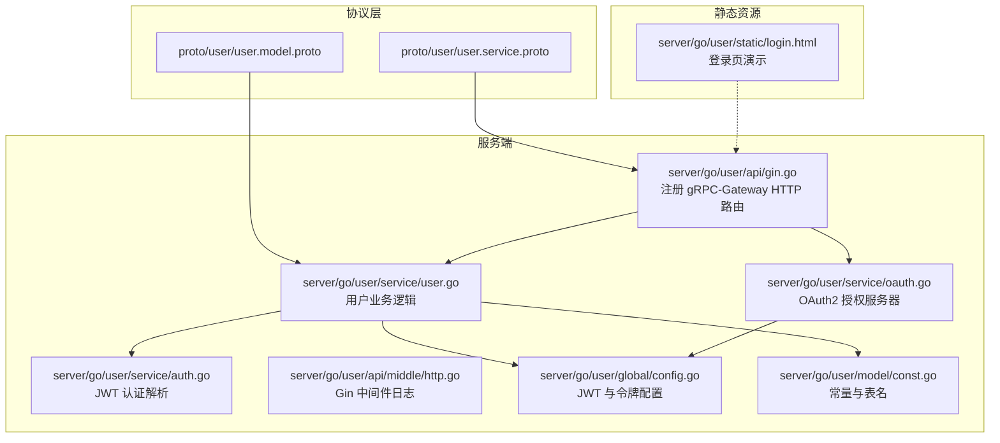
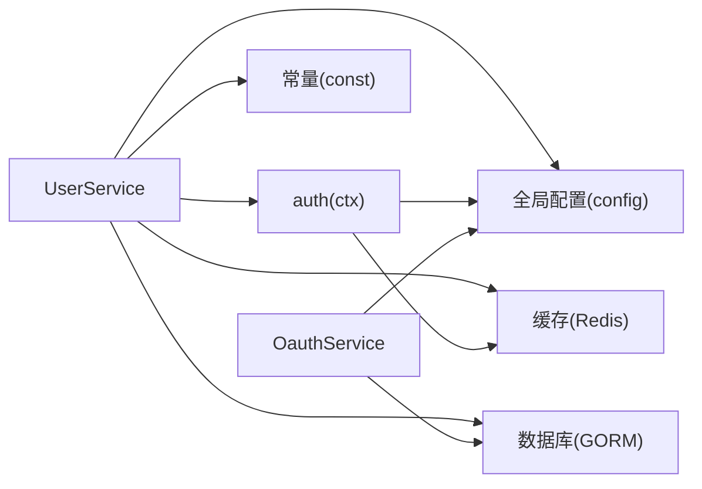

# 用户服务API

<cite>
**本文档引用的文件**
- [proto/user/user.service.proto](file://proto/user/user.service.proto)
- [proto/user/user.model.proto](file://proto/user/user.model.proto)
- [server/go/user/api/gin.go](file://server/go/user/api/gin.go)
- [server/go/user/service/user.go](file://server/go/user/service/user.go)
- [server/go/user/service/auth.go](file://server/go/user/service/auth.go)
- [server/go/user/service/oauth.go](file://server/go/user/service/oauth.go)
- [server/go/user/service/utils.go](file://server/go/user/service/utils.go)
- [server/go/user/api/middle/http.go](file://server/go/user/api/middle/http.go)
- [server/go/user/global/config.go](file://server/go/user/global/config.go)
- [server/go/user/model/const.go](file://server/go/user/model/const.go)
- [server/go/user/static/login.html](file://server/go/user/static/login.html)
</cite>

## 目录
1. [简介](#简介)
2. [项目结构](#项目结构)
3. [核心组件](#核心组件)
4. [架构总览](#架构总览)
5. [详细组件分析](#详细组件分析)
6. [依赖关系分析](#依赖关系分析)
7. [性能考量](#性能考量)
8. [故障排查指南](#故障排查指南)
9. [结论](#结论)
10. [附录](#附录)

## 简介
本文件为“用户服务API”的权威技术文档，覆盖用户注册、登录、认证、信息管理、关注系统、验证码发送、用户激活、密码重置、OAuth 授权与令牌签发等全部用户相关接口。文档严格依据仓库中的协议与后端实现，提供每个API的HTTP方法、URL模式、请求参数、响应格式、错误码以及认证与权限控制说明，并给出多语言客户端调用示例的参考路径。

## 项目结构
用户服务位于 Go 后端子模块中，通过 gRPC-Gateway 将 gRPC 服务映射为 HTTP/JSON 接口，同时支持 OpenAPI 文档生成。前端静态登录页用于演示登录流程并跳转到 OAuth 授权页。



**图表来源**
- [proto/user/user.service.proto:26-288](file://proto/user/user.service.proto#L26-L288)
- [server/go/user/api/gin.go:10-15](file://server/go/user/api/gin.go#L10-L15)
- [server/go/user/service/user.go:46-664](file://server/go/user/service/user.go#L46-L664)
- [server/go/user/service/auth.go:22-61](file://server/go/user/service/auth.go#L22-L61)
- [server/go/user/service/oauth.go:30-144](file://server/go/user/service/oauth.go#L30-L144)
- [server/go/user/global/config.go:14-27](file://server/go/user/global/config.go#L14-L27)
- [server/go/user/model/const.go:5-23](file://server/go/user/model/const.go#L5-L23)
- [server/go/user/static/login.html:1-29](file://server/go/user/static/login.html#L1-L29)

**章节来源**
- [proto/user/user.service.proto:26-288](file://proto/user/user.service.proto#L26-L288)
- [server/go/user/api/gin.go:10-15](file://server/go/user/api/gin.go#L10-L15)

## 核心组件
- 协议与模型
  - 用户服务接口定义与 OpenAPI 元数据在 [proto/user/user.service.proto:26-288](file://proto/user/user.service.proto#L26-L288)。
  - 用户、扩展信息、关注、操作日志等模型在 [proto/user/user.model.proto:19-269](file://proto/user/user.model.proto#L19-L269)。
- 服务实现
  - 用户业务逻辑集中在 [server/go/user/service/user.go:46-664](file://server/go/user/service/user.go#L46-L664)，包括注册、登录、激活、编辑、密码重置、信息查询、关注等。
  - JWT 认证解析与设备信息提取在 [server/go/user/service/auth.go:22-81](file://server/go/user/service/auth.go#L22-L81)。
  - OAuth2 授权服务器封装在 [server/go/user/service/oauth.go:30-144](file://server/go/user/service/oauth.go#L30-L144)。
- HTTP 映射与路由
  - gRPC-Gateway 在 [server/go/user/api/gin.go:10-15](file://server/go/user/api/gin.go#L10-L15) 注册 UserService 与 OauthService 的 HTTP 路由。
- 配置与常量
  - JWT 令牌配置与归一化在 [server/go/user/global/config.go:14-27](file://server/go/user/global/config.go#L14-L27)。
  - 表名与常量（激活/重置/验证码有效期）在 [server/go/user/model/const.go:5-23](file://server/go/user/model/const.go#L5-L23)。
- 中间件与静态资源
  - Gin 日志中间件在 [server/go/user/api/middle/http.go:14-16](file://server/go/user/api/middle/http.go#L14-L16)。
  - 登录页演示在 [server/go/user/static/login.html:1-29](file://server/go/user/static/login.html#L1-L29)。

**章节来源**
- [proto/user/user.service.proto:26-288](file://proto/user/user.service.proto#L26-L288)
- [proto/user/user.model.proto:19-269](file://proto/user/user.model.proto#L19-L269)
- [server/go/user/service/user.go:46-664](file://server/go/user/service/user.go#L46-L664)
- [server/go/user/service/auth.go:22-81](file://server/go/user/service/auth.go#L22-L81)
- [server/go/user/service/oauth.go:30-144](file://server/go/user/service/oauth.go#L30-L144)
- [server/go/user/api/gin.go:10-15](file://server/go/user/api/gin.go#L10-L15)
- [server/go/user/global/config.go:14-27](file://server/go/user/global/config.go#L14-L27)
- [server/go/user/model/const.go:5-23](file://server/go/user/model/const.go#L5-L23)
- [server/go/user/api/middle/http.go:14-16](file://server/go/user/api/middle/http.go#L14-L16)
- [server/go/user/static/login.html:1-29](file://server/go/user/static/login.html#L1-L29)

## 架构总览
用户服务采用“gRPC + gRPC-Gateway + HTTP/JSON”混合架构，结合 JWT 与 OAuth2 实现认证与授权。OpenAPI 元数据由 proto 文件生成，便于文档化与 SDK 生成。

```mermaid
sequenceDiagram
participant Client as "客户端"
participant Gateway as "gRPC-Gateway(HTTP)"
participant UserService as "UserService"
participant Auth as "认证中间件"
participant DB as "数据库(GORM)"
participant Redis as "缓存(Reids)"
Client->>Gateway : "POST /api/user/login"
Gateway->>UserService : "Login(LoginReq)"
UserService->>DB : "按账号查询用户"
UserService->>UserService : "校验密码/状态"
UserService->>Redis : "写入最近活跃时间"
UserService-->>Gateway : "LoginResp(token,user)"
Gateway-->>Client : "Set-Cookie : token=...; HttpOnly"
Note over Client,Gateway : "后续请求携带 Cookie 或 Authorization"
Client->>Gateway : "GET /api/auth"
Gateway->>UserService : "AuthInfo(Empty)"
UserService->>Auth : "解析JWT/校验签名"
Auth-->>UserService : "AuthInfo"
UserService-->>Gateway : "Auth"
Gateway-->>Client : "Auth"
```

**图表来源**
- [server/go/user/api/gin.go:10-15](file://server/go/user/api/gin.go#L10-L15)
- [server/go/user/service/user.go:334-421](file://server/go/user/service/user.go#L334-L421)
- [server/go/user/service/auth.go:22-61](file://server/go/user/service/auth.go#L22-L61)
- [proto/user/user.service.proto:144-169](file://proto/user/user.service.proto#L144-L169)

## 详细组件分析

### 用户认证与权限控制
- JWT 令牌
  - 登录成功后服务端通过 Set-Cookie 返回 HttpOnly 的 token，并设置 Max-Age 与过期时间。
  - 认证中间件从请求头解析 Authorization 或 Cookie，校验 JWT 签名与有效期，并将用户信息注入上下文。
- OAuth2 集成
  - 提供授权端点与令牌签发端点，内部通过 JWT Access Token 生成与校验完成授权流程。
- 权限要求
  - 部分接口标注了 OAuth2 与 Authorization 两种安全需求，需满足其一。

**章节来源**
- [server/go/user/service/user.go:371-421](file://server/go/user/service/user.go#L371-L421)
- [server/go/user/service/auth.go:22-61](file://server/go/user/service/auth.go#L22-L61)
- [server/go/user/service/oauth.go:30-144](file://server/go/user/service/oauth.go#L30-L144)
- [proto/user/user.service.proto:107-115](file://proto/user/user.service.proto#L107-L115)

### 验证码发送
- 端点
  - GET /api/sendVerifyCode
- 请求参数
  - mail: 邮箱（可选）
  - phone: 手机号（可选）
  - action: 操作类型（如注册、激活、重置密码）
  - vCode: 图形验证码
- 行为
  - 校验输入合法性（仅允许填写邮箱或手机号其一），生成4位数字验证码并写入 Redis，有效期见常量。
  - 若为邮箱则发送邮件；若为手机号则在调试模式下输出验证码便于联调。
- 错误码
  - 参数非法、Redis 写入失败、图形验证码校验失败等。

**章节来源**
- [proto/user/user.service.proto:32-42](file://proto/user/user.service.proto#L32-L42)
- [server/go/user/service/user.go:50-73](file://server/go/user/service/user.go#L50-L73)
- [server/go/user/model/const.go:20-23](file://server/go/user/model/const.go#L20-L23)

### 注册验证
- 端点
  - POST /api/user/signupVerify
- 请求参数
  - mail: 邮箱（可选）
  - phone: 手机号（可选）
- 行为
  - 校验输入合法性，检查邮箱/手机号是否已被注册。
- 错误码
  - 输入非法、邮箱/手机号已被注册。

**章节来源**
- [proto/user/user.service.proto:44-56](file://proto/user/user.service.proto#L44-L56)
- [server/go/user/service/user.go:75-103](file://server/go/user/service/user.go#L75-L103)

### 用户注册
- 端点
  - POST /api/user
- 请求参数
  - name: 昵称（必填，长度限制）
  - gender: 性别（必填）
  - mail: 邮箱（可选）
  - phone: 手机号（可选）
  - password: 密码（必填，长度限制）
  - vCode: 验证码（必填）
- 行为
  - 校验输入与验证码，检查用户名/邮箱/手机号唯一性，创建用户并写入激活时间键到 Redis，必要时发送激活邮件。
- 响应
  - 成功返回提示文本。
- 错误码
  - 参数非法、验证码校验失败、用户名/邮箱/手机号重复、数据库错误等。

**章节来源**
- [proto/user/user.service.proto:58-70](file://proto/user/user.service.proto#L58-L70)
- [server/go/user/service/user.go:105-166](file://server/go/user/service/user.go#L105-L166)

### 简易注册（V2）
- 端点
  - POST /api/v2/user
- 请求参数
  - 同上注册请求
- 行为
  - 创建即激活用户，直接返回登录响应（含 token 与用户信息）。
- 响应
  - LoginResp（包含 token 与 user）。

**章节来源**
- [proto/user/user.service.proto:72-83](file://proto/user/user.service.proto#L72-L83)
- [server/go/user/service/user.go:620-664](file://server/go/user/service/user.go#L620-L664)

### 用户激活
- 端点
  - GET /api/user/active/{id}/{secret}
- 请求参数
  - id: 用户ID
  - secret: 激活密钥（基于时间戳、邮箱、密码计算的哈希）
- 行为
  - 校验激活链接有效性与有效期，更新用户状态为已激活，并触发自动登录。
- 错误码
  - 已激活、链接过期、无效链接、数据库错误等。

**章节来源**
- [proto/user/user.service.proto:85-96](file://proto/user/user.service.proto#L85-L96)
- [server/go/user/service/user.go:261-293](file://server/go/user/service/user.go#L261-L293)

### 登录
- 端点
  - POST /api/user/login
- 请求参数
  - 支持账号（邮箱/手机号/用户名）与密码，以及图形验证码。
- 行为
  - 校验验证码，按账号查询用户，校验密码与状态；未激活则发送激活邮件并提示。
  - 登录成功后写入用户扩展信息最近活跃时间，返回 token 并设置 HttpOnly Cookie。
- 响应
  - LoginResp（包含 token 与 user）。

**章节来源**
- [proto/user/user.service.proto:118-130](file://proto/user/user.service.proto#L118-L130)
- [server/go/user/service/user.go:334-369](file://server/go/user/service/user.go#L334-L369)

### 退出
- 端点
  - GET /api/user/logout
- 行为
  - 更新用户扩展信息最近活跃时间，清理登录缓存，设置过期 Cookie。
- 响应
  - 空对象。

**章节来源**
- [proto/user/user.service.proto:131-142](file://proto/user/user.service.proto#L131-L142)
- [server/go/user/service/user.go:423-455](file://server/go/user/service/user.go#L423-L455)

### 获取认证信息
- 端点
  - GET /api/auth
- 安全要求
  - 需要 OAuth2 或 Authorization 任一认证方式。
- 行为
  - 解析 JWT，返回当前用户身份信息。
- 响应
  - Auth（包含 id、name、role、status）。

**章节来源**
- [proto/user/user.service.proto:144-169](file://proto/user/user.service.proto#L144-L169)
- [server/go/user/service/user.go:457-464](file://server/go/user/service/user.go#L457-L464)

### 忘记密码（发送重置邮件）
- 端点
  - GET /api/user/forgetPassword
- 请求参数
  - 支持邮箱/手机号账号与图形验证码。
- 行为
  - 校验验证码，按账号查找用户，写入重置时间键到 Redis，发送重置邮件。
- 响应
  - 提示文本。

**章节来源**
- [proto/user/user.service.proto:171-182](file://proto/user/user.service.proto#L171-L182)
- [server/go/user/service/user.go:489-524](file://server/go/user/service/user.go#L489-L524)

### 重置密码
- 端点
  - PATCH /api/user/resetPassword/{id}/{secret}
- 请求参数
  - id: 用户ID
  - secret: 重置密钥（基于时间戳、邮箱、旧密码计算的哈希）
  - password: 新密码（请求体字段名为 password）
- 行为
  - 校验重置链接有效性与有效期，更新用户密码并清理 Redis 键。
- 响应
  - 提示文本。

**章节来源**
- [proto/user/user.service.proto:184-195](file://proto/user/user.service.proto#L184-L195)
- [server/go/user/service/user.go:526-558](file://server/go/user/service/user.go#L526-L558)

### 获取用户信息
- 端点
  - GET /api/user/{id}
- 行为
  - 校验登录态，若未传 id 则默认取当前用户；返回用户与扩展信息。
- 响应
  - UserResp（包含 user 与 uerExt）。

**章节来源**
- [proto/user/user.service.proto:197-208](file://proto/user/user.service.proto#L197-L208)
- [server/go/user/service/user.go:466-487](file://server/go/user/service/user.go#L466-L487)

### 基础用户列表
- 端点
  - POST /api/baseUserList
- 请求参数
  - ids: 用户ID数组
  - pageNo: 页码
  - pageSize: 每页大小
- 行为
  - 仅允许内部调用（通过特定 Header 校验），返回用户基础信息列表与总数。
- 响应
  - BaseListResp（包含 total 与 list）。

**章节来源**
- [proto/user/user.service.proto:222-234](file://proto/user/user.service.proto#L222-L234)
- [server/go/user/service/user.go:573-594](file://server/go/user/service/user.go#L573-L594)

### 关注/取消关注
- 端点
  - GET /api/user/follow（关注）
  - DELETE /api/user/follow（取消关注）
- 请求参数
  - id: 被关注用户ID（GET/DELETE 查询参数）
- 行为
  - 关注/取消关注目标用户。
- 响应
  - 关注接口返回空对象；取消关注接口返回基础列表响应。

**章节来源**
- [proto/user/user.service.proto:236-257](file://proto/user/user.service.proto#L236-L257)
- [server/go/user/service/user.go:236-257](file://server/go/user/service/user.go#L236-L257)

### OAuth 授权与令牌签发
- 授权端点
  - GET /oauth/authorize
  - 通过内部 JWT 令牌解析用户 ID，再交由 OAuth2 服务器处理授权。
- 令牌端点
  - POST /oauth/access_token
  - 使用授权码换取访问令牌，返回标准 HTTP 响应（包含状态码与头部）。

**章节来源**
- [proto/user/user.service.proto:260-288](file://proto/user/user.service.proto#L260-L288)
- [server/go/user/service/oauth.go:103-144](file://server/go/user/service/oauth.go#L103-L144)

## 依赖关系分析



**图表来源**
- [server/go/user/service/user.go:46-664](file://server/go/user/service/user.go#L46-L664)
- [server/go/user/service/auth.go:22-61](file://server/go/user/service/auth.go#L22-L61)
- [server/go/user/service/oauth.go:30-144](file://server/go/user/service/oauth.go#L30-L144)
- [server/go/user/global/config.go:14-27](file://server/go/user/global/config.go#L14-L27)
- [server/go/user/model/const.go:5-23](file://server/go/user/model/const.go#L5-L23)

**章节来源**
- [server/go/user/service/user.go:46-664](file://server/go/user/service/user.go#L46-L664)
- [server/go/user/service/auth.go:22-61](file://server/go/user/service/auth.go#L22-L61)
- [server/go/user/service/oauth.go:30-144](file://server/go/user/service/oauth.go#L30-L144)
- [server/go/user/global/config.go:14-27](file://server/go/user/global/config.go#L14-L27)
- [server/go/user/model/const.go:5-23](file://server/go/user/model/const.go#L5-L23)

## 性能考量
- 缓存策略
  - 登录态与用户信息在 Redis 与内存缓存中进行读写，减少数据库压力。
- 事务与批量
  - 编辑用户资料时对简历等子资源采用事务写入，保证一致性。
- 速率限制与验证码
  - 验证码有效期短、图形验证码校验严格，降低暴力破解风险。
- 日志与可观测性
  - Gin 中间件记录请求 URI，便于问题定位。

**章节来源**
- [server/go/user/service/user.go:295-332](file://server/go/user/service/user.go#L295-L332)
- [server/go/user/api/middle/http.go:14-16](file://server/go/user/api/middle/http.go#L14-L16)
- [server/go/user/model/const.go:20-23](file://server/go/user/model/const.go#L20-L23)

## 故障排查指南
- 登录失败
  - 检查账号是否存在、密码是否正确、账号是否已激活。
  - 若未激活，确认邮件是否收到并点击激活链接。
- 验证码问题
  - 确认仅填写邮箱或手机号其一；检查 Redis 是否可用；调试模式下确认控制台输出。
- 密码重置
  - 确认重置链接未过期；检查邮箱是否收到重置邮件。
- OAuth 授权
  - 确认内部调用 Header 正确；检查授权码与回调地址配置。
- Cookie 与跨域
  - 确认浏览器允许 HttpOnly Cookie；如遇跨域，检查服务端 CORS 设置与 Cookie 属性。

**章节来源**
- [server/go/user/service/user.go:334-369](file://server/go/user/service/user.go#L334-L369)
- [server/go/user/service/user.go:50-73](file://server/go/user/service/user.go#L50-L73)
- [server/go/user/service/user.go:489-524](file://server/go/user/service/user.go#L489-L524)
- [server/go/user/service/oauth.go:103-144](file://server/go/user/service/oauth.go#L103-L144)

## 结论
用户服务API以清晰的协议定义与严谨的服务实现为基础，结合 JWT 与 OAuth2 提供完善的认证与授权能力。通过 gRPC-Gateway 与 OpenAPI 元数据，既满足高性能微服务通信，又便于前端与第三方客户端对接。建议在生产环境中强化安全配置（如 HTTPS、CORS、CSRF）、完善监控与告警，并持续优化缓存与数据库索引。

## 附录

### API 端点一览与示例调用路径
- 验证码发送
  - 方法: GET
  - 路径: /api/sendVerifyCode
  - 示例: [server/go/user/static/login.html:8-21](file://server/go/user/static/login.html#L8-L21)
- 注册验证
  - 方法: POST
  - 路径: /api/user/signupVerify
  - 示例: [server/go/user/service/user.go:75-103](file://server/go/user/service/user.go#L75-L103)
- 用户注册
  - 方法: POST
  - 路径: /api/user
  - 示例: [server/go/user/service/user.go:105-166](file://server/go/user/service/user.go#L105-L166)
- 简易注册
  - 方法: POST
  - 路径: /api/v2/user
  - 示例: [server/go/user/service/user.go:620-664](file://server/go/user/service/user.go#L620-L664)
- 用户激活
  - 方法: GET
  - 路径: /api/user/active/{id}/{secret}
  - 示例: [server/go/user/service/user.go:261-293](file://server/go/user/service/user.go#L261-L293)
- 登录
  - 方法: POST
  - 路径: /api/user/login
  - 示例: [server/go/user/service/user.go:334-369](file://server/go/user/service/user.go#L334-L369)
- 退出
  - 方法: GET
  - 路径: /api/user/logout
  - 示例: [server/go/user/service/user.go:423-455](file://server/go/user/service/user.go#L423-L455)
- 获取认证信息
  - 方法: GET
  - 路径: /api/auth
  - 示例: [server/go/user/service/user.go:457-464](file://server/go/user/service/user.go#L457-L464)
- 忘记密码
  - 方法: GET
  - 路径: /api/user/forgetPassword
  - 示例: [server/go/user/service/user.go:489-524](file://server/go/user/service/user.go#L489-L524)
- 重置密码
  - 方法: PATCH
  - 路径: /api/user/resetPassword/{id}/{secret}
  - 示例: [server/go/user/service/user.go:526-558](file://server/go/user/service/user.go#L526-L558)
- 获取用户信息
  - 方法: GET
  - 路径: /api/user/{id}
  - 示例: [server/go/user/service/user.go:466-487](file://server/go/user/service/user.go#L466-L487)
- 基础用户列表
  - 方法: POST
  - 路径: /api/baseUserList
  - 示例: [server/go/user/service/user.go:573-594](file://server/go/user/service/user.go#L573-L594)
- 关注/取消关注
  - 方法: GET/DELETE
  - 路径: /api/user/follow
  - 示例: [server/go/user/service/user.go:236-257](file://server/go/user/service/user.go#L236-L257)
- OAuth 授权
  - 方法: GET
  - 路径: /oauth/authorize
  - 示例: [server/go/user/service/oauth.go:103-116](file://server/go/user/service/oauth.go#L103-L116)
- OAuth 令牌签发
  - 方法: POST
  - 路径: /oauth/access_token
  - 示例: [server/go/user/service/oauth.go:118-144](file://server/go/user/service/oauth.go#L118-L144)

### 错误码参考
- 通用错误
  - 参数非法、权限不足、数据库错误、Redis 错误、内部错误、不可用等。
- 登录相关
  - 用户名或密码错误、未激活账号、无权限、登录超时、Token 错误、未登录。
- 密码重置
  - 无效链接、无效账号、重置成功等。

**章节来源**
- [proto/user/user.model.proto:246-257](file://proto/user/user.model.proto#L246-L257)
- [server/go/user/service/user.go:334-369](file://server/go/user/service/user.go#L334-L369)
- [server/go/user/service/user.go:526-558](file://server/go/user/service/user.go#L526-L558)