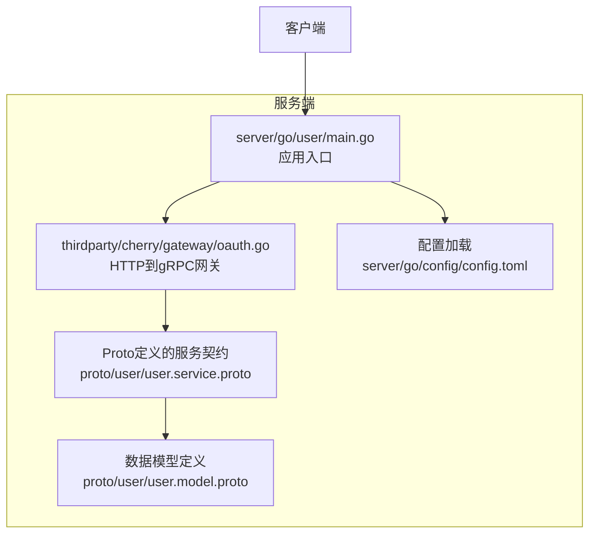
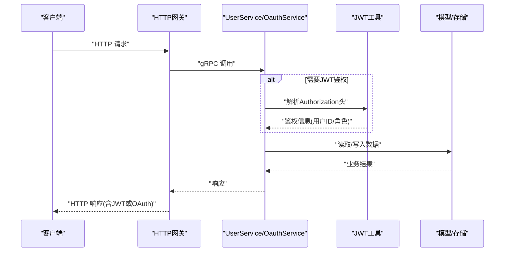
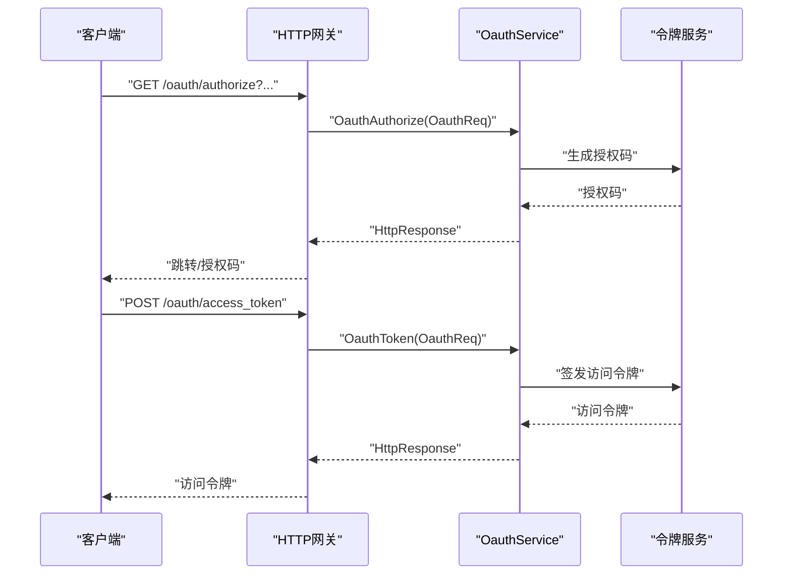
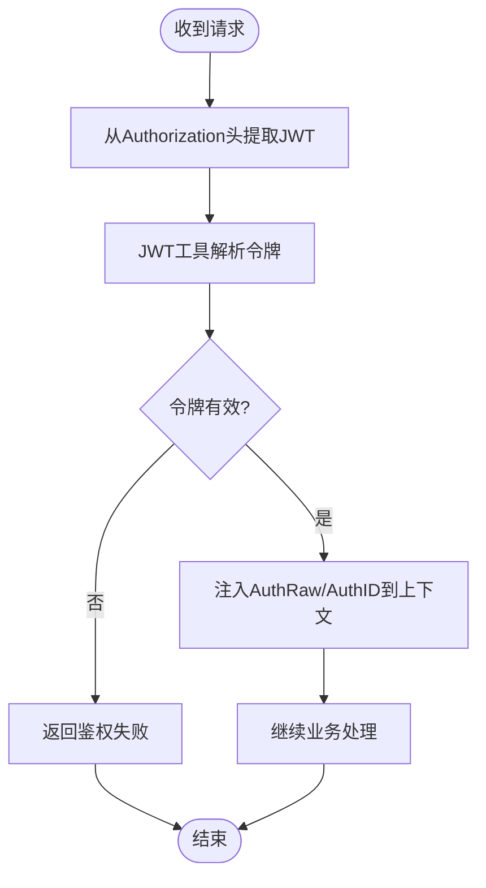
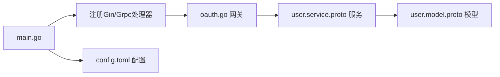

# 认证授权API

<cite>
**本文档引用的文件**
- [server/go/user/main.go](file://server/go/user/main.go)
- [proto/user/user.service.proto](file://proto/user/user.service.proto)
- [proto/user/user.model.proto](file://proto/user/user.model.proto)
- [thirdparty/cherry/gateway/oauth.go](file://thirdparty/cherry/gateway/oauth.go)
- [thirdparty/scaffold/jwt/jwt.go](file://thirdparty/scaffold/jwt/jwt.go)
- [server/go/config/config.toml](file://server/go/config/config.toml)
- [server/go/apidoc/api.openapi.json](file://server/go/apidoc/api.openapi.json)
</cite>

## 目录
1. [简介](#简介)
2. [项目结构](#项目结构)
3. [核心组件](#核心组件)
4. [架构总览](#架构总览)
5. [详细组件分析](#详细组件分析)
6. [依赖分析](#依赖分析)
7. [性能考虑](#性能考虑)
8. [故障排除指南](#故障排除指南)
9. [结论](#结论)
10. [附录](#附录)

## 简介
本文件为用户认证授权API的权威技术文档，覆盖以下核心能力：
- 用户登录、注册、验证码发送、账户激活、密码重置、登出
- JWT令牌生成与验证机制
- OAuth授权流程
- 权限控制与安全策略
- 完整的OpenAPI定义与错误码说明
- 多语言客户端调用示例（以路径形式给出）

该系统基于gRPC-Gateway与OpenAPI注解，通过Proto文件定义服务契约，结合JWT与OAuth实现统一的认证授权体系。

## 项目结构
认证相关的核心位于server/go/user模块，采用“入口程序 + Proto服务定义 + 网关适配 + JWT/OAuth工具”的分层结构：
- 入口程序负责初始化配置与启动HTTP/GRPC网关
- Proto定义了用户服务与OAuth服务的REST映射
- Cherry网关将HTTP请求转换为gRPC调用，并处理OAuth端点
- JWT工具提供令牌解析与上下文注入

**图表来源**
- [server/go/user/main.go:10-15](file://server/go/user/main.go#L10-L15)
- [thirdparty/cherry/gateway/oauth.go:26-45](file://thirdparty/cherry/gateway/oauth.go#L26-L45)
- [proto/user/user.service.proto:26-288](file://proto/user/user.service.proto#L26-L288)
- [proto/user/user.model.proto:19-269](file://proto/user/user.model.proto#L19-L269)
- [server/go/config/config.toml:1-41](file://server/go/config/config.toml#L1-L41)

**章节来源**
- [server/go/user/main.go:10-15](file://server/go/user/main.go#L10-L15)
- [proto/user/user.service.proto:26-288](file://proto/user/user.service.proto#L26-L288)
- [thirdparty/cherry/gateway/oauth.go:26-45](file://thirdparty/cherry/gateway/oauth.go#L26-L45)
- [server/go/config/config.toml:1-41](file://server/go/config/config.toml#L1-L41)

## 核心组件
- 用户服务(UserService)
  - 提供登录、注册、验证码发送、账户激活、密码重置、登出、权限查询等接口
  - 使用Google API注解将gRPC映射为REST风格URL
- OAuth服务(OauthService)
  - 提供授权码获取与令牌签发两个端点
  - 通过Cherry网关直接暴露HTTP接口
- JWT工具
  - 提供令牌解析、上下文注入与鉴权信息提取
- OpenAPI定义
  - 自动生成OpenAPI 3.0文档，包含请求/响应Schema与错误码

**章节来源**
- [proto/user/user.service.proto:26-288](file://proto/user/user.service.proto#L26-L288)
- [thirdparty/cherry/gateway/oauth.go:21-45](file://thirdparty/cherry/gateway/oauth.go#L21-L45)
- [thirdparty/scaffold/jwt/jwt.go:12-54](file://thirdparty/scaffold/jwt/jwt.go#L12-L54)
- [server/go/apidoc/api.openapi.json:1-164](file://server/go/apidoc/api.openapi.json#L1-L164)

## 架构总览
下图展示了从客户端到服务端的关键交互路径，包括JWT鉴权与OAuth授权两种模式：

**图表来源**
- [thirdparty/cherry/gateway/oauth.go:26-45](file://thirdparty/cherry/gateway/oauth.go#L26-L45)
- [thirdparty/scaffold/jwt/jwt.go:41-54](file://thirdparty/scaffold/jwt/jwt.go#L41-L54)
- [proto/user/user.service.proto:118-195](file://proto/user/user.service.proto#L118-L195)

## 详细组件分析

### 用户服务(UserService)接口清单
以下为认证相关的主要端点，均通过Google API注解映射为REST风格URL。

- 发送验证码
  - 方法: GET
  - URL: /api/sendVerifyCode
  - 请求参数: 支持邮箱或手机号，以及操作类型与验证码校验
  - 响应: 空对象
  - 错误码: 参考用户错误枚举
  - 示例请求路径: [proto/user/user.service.proto:32-42](file://proto/user/user.service.proto#L32-L42)

- 注册验证
  - 方法: POST
  - URL: /api/user/signupVerify
  - 请求体: 邮箱/手机号
  - 响应: 空对象
  - 示例请求路径: [proto/user/user.service.proto:44-56](file://proto/user/user.service.proto#L44-L56)

- 用户注册
  - 方法: POST
  - URL: /api/user
  - 请求体: 昵称、性别、邮箱、手机号、密码、验证码
  - 响应: 字符串值(成功提示或令牌)
  - 示例请求路径: [proto/user/user.service.proto:58-70](file://proto/user/user.service.proto#L58-L70)

- 简易注册
  - 方法: POST
  - URL: /api/v2/user
  - 请求体: 昵称、性别、邮箱、手机号、密码、验证码
  - 响应: 登录响应(LoginResp)，包含用户信息与令牌
  - 示例请求路径: [proto/user/user.service.proto:72-83](file://proto/user/user.service.proto#L72-L83)

- 账户激活
  - 方法: GET
  - URL: /api/user/active/{id}/{secret}
  - 路径参数: id(用户ID)、secret(激活密钥)
  - 响应: 登录响应(LoginResp)
  - 示例请求路径: [proto/user/user.service.proto:85-96](file://proto/user/user.service.proto#L85-L96)

- 用户登录
  - 方法: POST
  - URL: /api/user/login
  - 请求体: 邮箱/手机号、密码、验证码
  - 响应: 登录响应(LoginResp)，包含用户信息与令牌
  - 示例请求路径: [proto/user/user.service.proto:118-130](file://proto/user/user.service.proto#L118-L130)

- 用户登出
  - 方法: GET
  - URL: /api/user/logout
  - 请求: 无
  - 响应: 空对象
  - 示例请求路径: [proto/user/user.service.proto:131-142](file://proto/user/user.service.proto#L131-L142)

- 获取用户信息(AuthInfo)
  - 方法: GET
  - URL: /api/auth
  - 请求: 无
  - 响应: 用户授权信息(Auth)
  - 安全要求: 支持OAuth2与Authorization两种方式
  - 示例请求路径: [proto/user/user.service.proto:144-169](file://proto/user/user.service.proto#L144-L169)

- 忘记密码
  - 方法: GET
  - URL: /api/user/forgetPassword
  - 请求: 邮箱/手机号
  - 响应: 字符串值(提示信息)
  - 示例请求路径: [proto/user/user.service.proto:171-182](file://proto/user/user.service.proto#L171-L182)

- 重置密码
  - 方法: PATCH
  - URL: /api/user/resetPassword/{id}/{secret}
  - 路径参数: id(用户ID)、secret(重置密钥)
  - 请求体: password(新密码)
  - 响应: 字符串值(提示信息)
  - 示例请求路径: [proto/user/user.service.proto:184-195](file://proto/user/user.service.proto#L184-L195)

- 编辑用户资料(受保护)
  - 方法: PUT
  - URL: /api/user/{id}
  - 路径参数: id(用户ID)
  - 请求体: detail(用户详情字段集合)
  - 响应: 空对象
  - 安全要求: Authorization头携带JWT
  - 示例请求路径: [proto/user/user.service.proto:98-117](file://proto/user/user.service.proto#L98-L117)

- 关注/取消关注
  - 关注: GET /api/user/follow
  - 取消关注: DELETE /api/user/follow
  - 请求: id(目标用户ID)
  - 响应: 成功/失败提示
  - 示例请求路径: [proto/user/user.service.proto:236-257](file://proto/user/user.service.proto#L236-L257)

**章节来源**
- [proto/user/user.service.proto:32-195](file://proto/user/user.service.proto#L32-L195)
- [proto/user/user.service.proto:98-117](file://proto/user/user.service.proto#L98-L117)
- [proto/user/user.service.proto:236-257](file://proto/user/user.service.proto#L236-L257)

### OAuth授权流程
- 授权端点
  - 方法: GET
  - URL: /oauth/authorize
  - 功能: 授权码获取
  - 示例请求路径: [proto/user/user.service.proto:264-274](file://proto/user/user.service.proto#L264-L274)

- 令牌端点
  - 方法: POST
  - URL: /oauth/access_token
  - 功能: 通过授权码换取访问令牌
  - 示例请求路径: [proto/user/user.service.proto:276-287](file://proto/user/user.service.proto#L276-L287)

- 网关适配
  - Cherry网关将HTTP请求转换为gRPC调用，自动从Header提取Authorization头并注入到gRPC元数据
  - 示例适配逻辑路径: [thirdparty/cherry/gateway/oauth.go:26-45](file://thirdparty/cherry/gateway/oauth.go#L26-L45)

**图表来源**
- [thirdparty/cherry/gateway/oauth.go:26-45](file://thirdparty/cherry/gateway/oauth.go#L26-L45)
- [proto/user/user.service.proto:264-287](file://proto/user/user.service.proto#L264-L287)

**章节来源**
- [proto/user/user.service.proto:264-287](file://proto/user/user.service.proto#L264-L287)
- [thirdparty/cherry/gateway/oauth.go:26-45](file://thirdparty/cherry/gateway/oauth.go#L26-L45)

### JWT令牌生成与验证
- 令牌生成
  - 登录成功后返回包含token的LoginResp
  - 示例响应结构路径: [proto/user/user.service.proto:363-367](file://proto/user/user.service.proto#L363-L367)

- 令牌验证
  - 通过Authorization头携带JWT
  - JWT工具从gRPC元数据解析令牌，注入原始令牌与用户ID到上下文
  - 示例解析逻辑路径: [thirdparty/scaffold/jwt/jwt.go:41-54](file://thirdparty/scaffold/jwt/jwt.go#L41-L54)

**图表来源**
- [thirdparty/scaffold/jwt/jwt.go:41-54](file://thirdparty/scaffold/jwt/jwt.go#L41-L54)

**章节来源**
- [proto/user/user.service.proto:363-367](file://proto/user/user.service.proto#L363-L367)
- [thirdparty/scaffold/jwt/jwt.go:41-54](file://thirdparty/scaffold/jwt/jwt.go#L41-L54)

### 数据模型与错误码
- 用户模型(User)
  - 关键字段: id、name、mail、countryCallingCode、phone、account、password、gender、birthday、address、intro、signature、avatar、cover、role、realName、idNo、activatedAt、modelTime、bannedAt、status
  - 示例模型路径: [proto/user/user.model.proto:19-50](file://proto/user/user.model.proto#L19-L50)

- 用户状态(UserStatus)
  - 枚举: 未激活、已激活、已冻结、已注销
  - 示例枚举路径: [proto/user/user.model.proto:228-236](file://proto/user/user.model.proto#L228-L236)

- 用户错误(UserErr)
  - 枚举: 用户名或密码错误、未激活账号、无权限、登录超时、Token错误、未登录
  - 示例枚举路径: [proto/user/user.model.proto:246-257](file://proto/user/user.model.proto#L246-L257)

**章节来源**
- [proto/user/user.model.proto:19-50](file://proto/user/user.model.proto#L19-L50)
- [proto/user/user.model.proto:228-236](file://proto/user/user.model.proto#L228-L236)
- [proto/user/user.model.proto:246-257](file://proto/user/user.model.proto#L246-L257)

## 依赖分析
- 组件耦合
  - 入口程序仅负责启动与注册路由，耦合度低
  - 网关层负责HTTP到gRPC的协议转换，职责清晰
  - JWT工具与OAuth网关分别处理鉴权与授权，边界明确
- 外部依赖
  - gRPC-Gateway用于将Proto注解映射为HTTP
  - Gin作为HTTP框架
  - OpenAPI文档自动生成

**图表来源**
- [server/go/user/main.go:10-15](file://server/go/user/main.go#L10-L15)
- [thirdparty/cherry/gateway/oauth.go:26-45](file://thirdparty/cherry/gateway/oauth.go#L26-L45)
- [proto/user/user.service.proto:26-288](file://proto/user/user.service.proto#L26-L288)
- [proto/user/user.model.proto:19-269](file://proto/user/user.model.proto#L19-L269)
- [server/go/config/config.toml:1-41](file://server/go/config/config.toml#L1-L41)

**章节来源**
- [server/go/user/main.go:10-15](file://server/go/user/main.go#L10-L15)
- [thirdparty/cherry/gateway/oauth.go:26-45](file://thirdparty/cherry/gateway/oauth.go#L26-L45)
- [proto/user/user.service.proto:26-288](file://proto/user/user.service.proto#L26-L288)
- [proto/user/user.model.proto:19-269](file://proto/user/user.model.proto#L19-L269)
- [server/go/config/config.toml:1-41](file://server/go/config/config.toml#L1-L41)

## 性能考虑
- 令牌解析开销
  - JWT解析与签名验证在每次受保护请求中执行，建议缓存近期频繁访问的用户信息
- 网关转发
  - HTTP到gRPC的转换存在少量额外开销，可通过连接复用与合理的并发配置优化
- 数据库访问
  - 用户状态与权限查询应建立必要索引，避免慢查询影响整体吞吐
- 并发与限流
  - 在网关层增加速率限制与熔断策略，防止恶意请求冲击

## 故障排除指南
- 鉴权失败
  - 现象: 返回“未登录/Token错误/无权限”
  - 排查: 确认Authorization头格式正确；检查令牌是否过期；确认用户状态正常
  - 参考错误码路径: [proto/user/user.model.proto:246-257](file://proto/user/user.model.proto#L246-L257)
- 登录失败
  - 现象: “用户名或密码错误/未激活账号”
  - 排查: 确认凭证与验证码；检查账户激活状态
  - 参考错误码路径: [proto/user/user.model.proto:251-252](file://proto/user/user.model.proto#L251-L252)
- OAuth流程异常
  - 现象: 授权码无法换取令牌
  - 排查: 确认授权端点参数与令牌端点请求体格式；检查服务端日志
  - 参考端点路径: [proto/user/user.service.proto:264-287](file://proto/user/user.service.proto#L264-L287)

**章节来源**
- [proto/user/user.model.proto:246-257](file://proto/user/user.model.proto#L246-L257)
- [proto/user/user.model.proto:251-252](file://proto/user/user.model.proto#L251-L252)
- [proto/user/user.service.proto:264-287](file://proto/user/user.service.proto#L264-L287)

## 结论
本认证授权API通过Proto定义清晰的服务契约，结合gRPC-Gateway与OpenAPI实现REST风格接口，配合JWT与OAuth提供完善的鉴权与授权能力。建议在生产环境中强化安全策略（如速率限制、令牌刷新、审计日志）与监控告警，确保系统稳定与安全。

## 附录

### OpenAPI文档与Schema
- OpenAPI文档由Proto注解自动生成，包含各端点的请求/响应Schema与错误码定义
- 可直接用于SDK生成与API测试
- 文档位置: [server/go/apidoc/api.openapi.json:1-164](file://server/go/apidoc/api.openapi.json#L1-L164)

**章节来源**
- [server/go/apidoc/api.openapi.json:1-164](file://server/go/apidoc/api.openapi.json#L1-L164)

### 多语言客户端调用示例（路径）
- Go
  - 登录认证: [proto/user/user.service.proto:118-130](file://proto/user/user.service.proto#L118-L130)
  - 令牌刷新: [proto/user/user.service.proto:276-287](file://proto/user/user.service.proto#L276-L287)
  - 权限验证: [proto/user/user.service.proto:144-169](file://proto/user/user.service.proto#L144-L169)
- JavaScript/TypeScript
  - 使用OpenAPI生成的SDK进行调用，参考: [server/go/apidoc/api.openapi.json:1-164](file://server/go/apidoc/api.openapi.json#L1-L164)
- Python
  - 通过HTTP直连REST端点，参考: [proto/user/user.service.proto:32-195](file://proto/user/user.service.proto#L32-L195)

**章节来源**
- [proto/user/user.service.proto:32-195](file://proto/user/user.service.proto#L32-L195)
- [proto/user/user.service.proto:118-169](file://proto/user/user.service.proto#L118-L169)
- [proto/user/user.service.proto:276-287](file://proto/user/user.service.proto#L276-L287)
- [server/go/apidoc/api.openapi.json:1-164](file://server/go/apidoc/api.openapi.json#L1-L164)