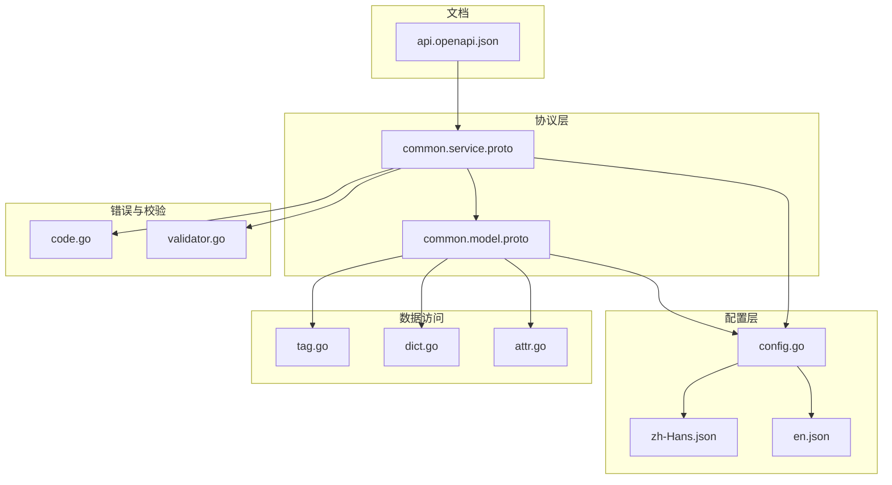
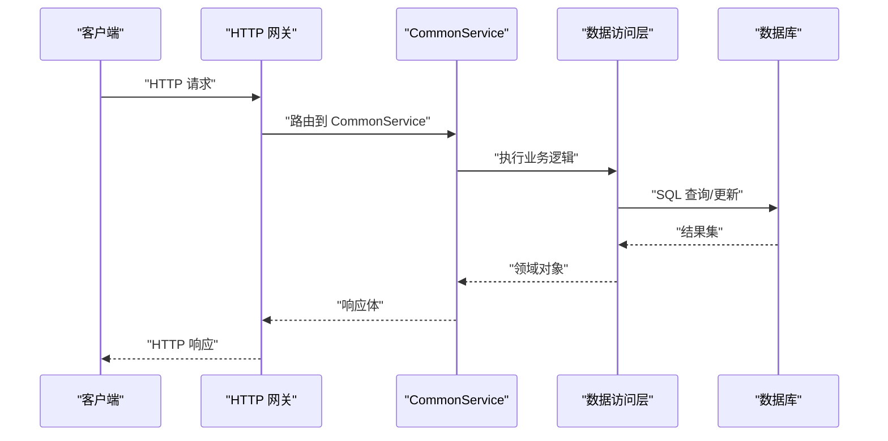
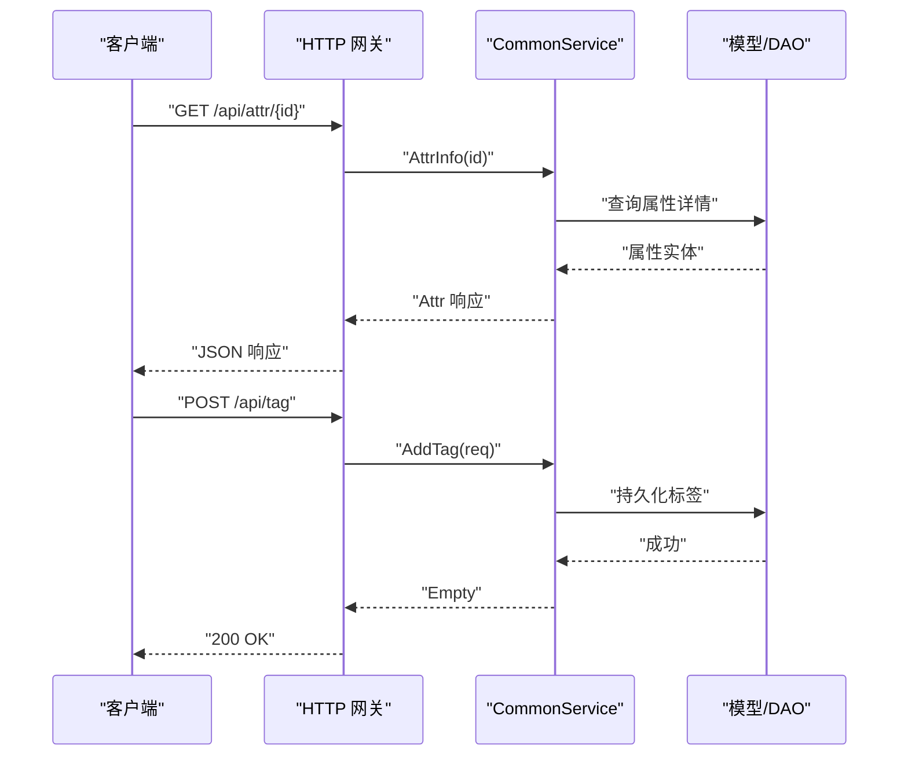
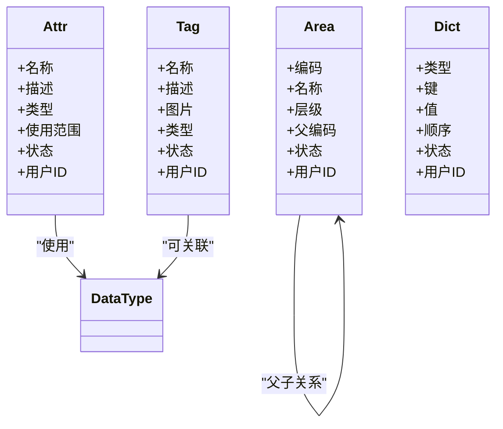
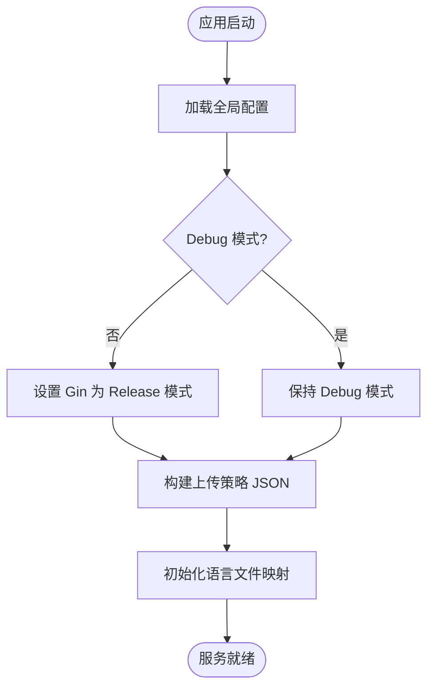
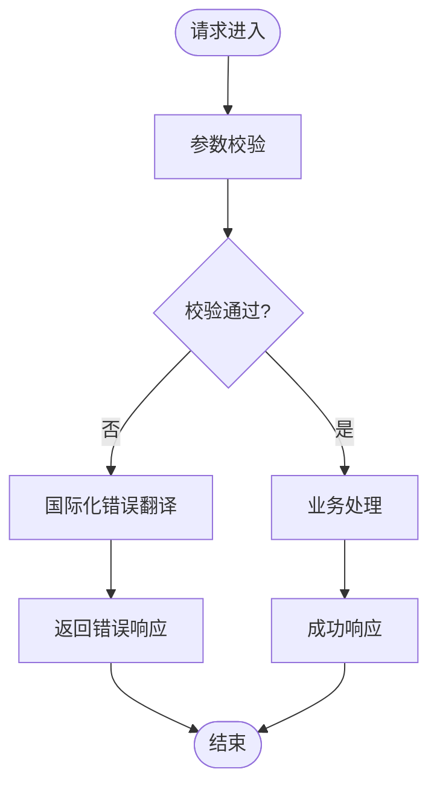
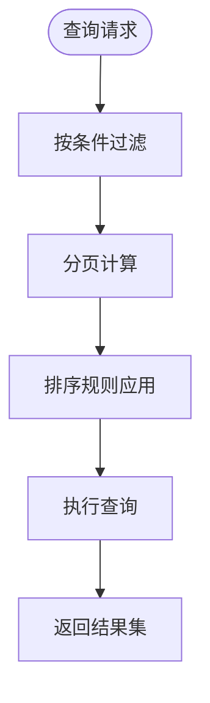
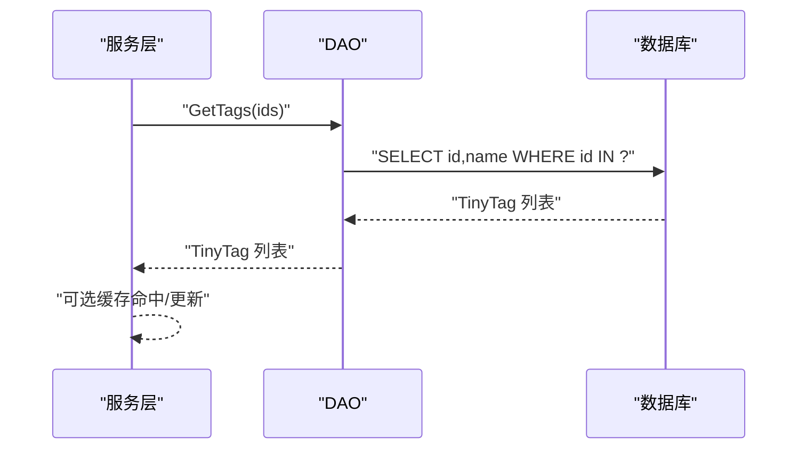
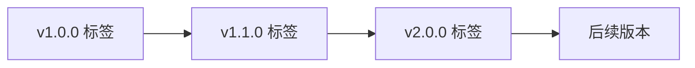
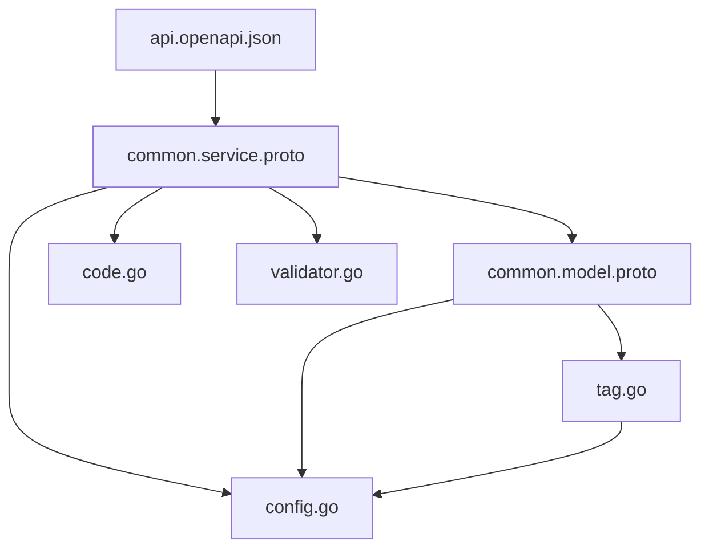

# 通用服务API

<cite>
**本文档引用的文件**
- [common.service.proto](file://proto/common/common.service.proto)
- [common.model.proto](file://proto/common/common.model.proto)
- [config.go](file://server/go/global/config.go)
- [dict.go](file://thirdparty/gox/types/dict.go)
- [attr.go](file://thirdparty/gox/types/model/attr.go)
- [tag.go](file://server/go/common/data/db/tag.go)
- [code.go](file://thirdparty/gox/errors/code.go)
- [validator.go](file://thirdparty/gox/validator/validator.go)
- [api.openapi.json](file://server/go/apidoc/api.openapi.json)
- [zh-Hans.json](file://locale/zh-Hans.json)
- [en.json](file://locale/en.json)
</cite>

## 目录
1. [引言](#引言)
2. [项目结构](#项目结构)
3. [核心组件](#核心组件)
4. [架构总览](#架构总览)
5. [详细组件分析](#详细组件分析)
6. [依赖分析](#依赖分析)
7. [性能考虑](#性能考虑)
8. [故障排查指南](#故障排查指南)
9. [结论](#结论)
10. [附录](#附录)

## 引言
本文件为通用服务API的全面技术文档，覆盖系统通用功能、工具类接口与辅助服务的完整接口规范。重点包括：
- 系统配置、字典数据、地区信息、时间处理等通用服务能力
- 通用验证、通用过滤、通用排序与通用分页的接口定义
- 通用错误处理、通用响应格式、通用异常码与通用国际化支持的实现方式
- 通用服务的性能优化、缓存策略与扩展机制
- 版本管理、向后兼容性与升级迁移指导

## 项目结构
通用服务API主要由以下层次构成：
- 协议层：基于 Protocol Buffers 的通用服务定义，统一对外接口契约
- 数据模型层：通用数据模型（字典、地区、标签、媒体等）
- 配置层：全局配置与本地化配置
- 错误与校验层：统一错误码与国际化校验
- 文档层：OpenAPI 规范导出，便于生成交互式文档

**图表来源**
- [common.service.proto:1-136](file://proto/common/common.service.proto#L1-L136)
- [common.model.proto:1-213](file://proto/common/common.model.proto#L1-L213)
- [config.go:1-126](file://server/go/global/config.go#L1-L126)
- [tag.go:1-36](file://server/go/common/data/db/tag.go#L1-L36)
- [dict.go:1-13](file://thirdparty/gox/types/dict.go#L1-L13)
- [attr.go:1-9](file://thirdparty/gox/types/model/attr.go#L1-L9)
- [code.go:1-54](file://thirdparty/gox/errors/code.go#L1-L54)
- [validator.go:1-74](file://thirdparty/gox/validator/validator.go#L1-L74)
- [api.openapi.json:1-164](file://server/go/apidoc/api.openapi.json#L1-L164)

**章节来源**
- [common.service.proto:1-136](file://proto/common/common.service.proto#L1-L136)
- [common.model.proto:1-213](file://proto/common/common.model.proto#L1-L213)
- [config.go:1-126](file://server/go/global/config.go#L1-L126)
- [api.openapi.json:1-164](file://server/go/apidoc/api.openapi.json#L1-L164)

## 核心组件
- 通用服务接口：提供属性与标签的增删改查、邮件发送、多语言资源查询等能力
- 通用数据模型：定义通用实体（属性、标签、地区、字典、枚举等）
- 全局配置：站点URL、上传策略、国际化默认语言与文件映射、用户令牌有效期等
- 统一错误码：标准错误码集合与消息注册
- 国际化校验：基于翻译器的字段校验错误国际化输出
- OpenAPI 文档：接口契约与示例的可视化导出

**章节来源**
- [common.service.proto:18-136](file://proto/common/common.service.proto#L18-L136)
- [common.model.proto:19-213](file://proto/common/common.model.proto#L19-L213)
- [config.go:19-126](file://server/go/global/config.go#L19-L126)
- [code.go:9-54](file://thirdparty/gox/errors/code.go#L9-L54)
- [validator.go:22-74](file://thirdparty/gox/validator/validator.go#L22-L74)
- [api.openapi.json:1-164](file://server/go/apidoc/api.openapi.json#L1-L164)

## 架构总览
通用服务采用“协议驱动 + 数据模型 + 配置 + 错误与校验 + 文档”的分层架构，通过 Protobuf 定义服务契约，结合 Gin/HTTP 网关与 OpenAPI 导出，形成可演进、可扩展、可文档化的通用能力。

**图表来源**
- [common.service.proto:18-136](file://proto/common/common.service.proto#L18-L136)
- [tag.go:13-35](file://server/go/common/data/db/tag.go#L13-L35)

## 详细组件分析

### 通用服务接口（CommonService）
- 属性管理：新增、详情、修改、列表
- 标签管理：新增、详情、修改、列表
- 发送邮件：邮件发送请求
- 本地化资源：按语言返回消息键值对

接口定义要点：
- HTTP 映射：通过 google.api.http 注解将 RPC 映射为 RESTful 路径
- GraphQL 支持：通过 graphql.proto 注解标注查询/变更类型
- OpenAPI 标签：通过 protoc-gen-openapiv2 注解标注版本标签

**图表来源**
- [common.service.proto:23-135](file://proto/common/common.service.proto#L23-L135)

**章节来源**
- [common.service.proto:18-136](file://proto/common/common.service.proto#L18-L136)

### 通用数据模型
- 属性（Attr）：名称、描述、类型、使用范围、状态、用户ID等
- 标签（Tag）：名称、描述、图片、类型、状态、用户ID等
- 地区（Area）：编码、名称、层级、父编码、用户ID、状态等
- 字典（Dict）：类型、键、值、顺序、用户ID、状态等
- 枚举（DataType、MediaType 等）：标准化的数据类型与媒体类型

**图表来源**
- [common.model.proto:19-213](file://proto/common/common.model.proto#L19-L213)

**章节来源**
- [common.model.proto:19-213](file://proto/common/common.model.proto#L19-L213)

### 全局配置与国际化
- 配置项：分页大小、站点URL、上传策略、用户令牌有效期与密钥、默认语言与语言文件映射等
- 国际化：前端与后端的语言包，支持键值替换与复数/占位符语法

**图表来源**
- [config.go:38-68](file://server/go/global/config.go#L38-L68)

**章节来源**
- [config.go:19-126](file://server/go/global/config.go#L19-L126)
- [zh-Hans.json:1-40](file://locale/zh-Hans.json#L1-L40)
- [en.json:1-40](file://locale/en.json#L1-L40)

### 统一错误处理与响应格式
- 错误码：标准错误码集合，支持运行时注册自定义消息
- 响应格式：OpenAPI 中定义的错误响应结构，包含 code 与 msg 字段
- 国际化：校验错误通过翻译器输出本地化消息

**图表来源**
- [code.go:9-54](file://thirdparty/gox/errors/code.go#L9-L54)
- [validator.go:48-74](file://thirdparty/gox/validator/validator.go#L48-L74)
- [api.openapi.json:4-33](file://server/go/apidoc/api.openapi.json#L4-L33)

**章节来源**
- [code.go:9-54](file://thirdparty/gox/errors/code.go#L9-L54)
- [validator.go:22-74](file://thirdparty/gox/validator/validator.go#L22-L74)
- [api.openapi.json:4-33](file://server/go/apidoc/api.openapi.json#L4-L33)

### 通用过滤、排序与分页
- 过滤：属性与标签列表请求支持按名称过滤
- 分页：标签列表请求包含页码与每页数量字段
- 排序：地区模型支持按 sequence 排序（示例）

**图表来源**
- [common.service.proto:155-198](file://proto/common/common.service.proto#L155-L198)
- [common.model.proto:142-153](file://proto/common/common.model.proto#L142-L153)

**章节来源**
- [common.service.proto:155-198](file://proto/common/common.service.proto#L155-L198)
- [common.model.proto:142-153](file://proto/common/common.model.proto#L142-L153)

### 数据访问与缓存策略
- 标签查询：按 ID 或名称批量查询精简标签信息
- 缓存建议：热点标签与常用字典可引入本地缓存或 Redis 缓存，降低数据库压力

**图表来源**
- [tag.go:13-35](file://server/go/common/data/db/tag.go#L13-L35)

**章节来源**
- [tag.go:1-36](file://server/go/common/data/db/tag.go#L1-L36)

### 扩展机制与版本管理
- 协议扩展：在 common.service.proto 中新增 RPC 或消息字段，保持向后兼容
- 版本标签：通过 OpenAPI 注解为接口打上版本标签，便于文档与客户端管理
- 向后兼容：新增字段标记为可选，避免破坏现有客户端

**图表来源**
- [common.service.proto:29-31](file://proto/common/common.service.proto#L29-L31)
- [common.service.proto:111-113](file://proto/common/common.service.proto#L111-L113)

**章节来源**
- [common.service.proto:18-136](file://proto/common/common.service.proto#L18-L136)

## 依赖分析
- 协议依赖：common.service.proto 依赖 common.model.proto 与第三方注解
- 服务依赖：服务实现依赖数据模型、DAO、配置与错误/校验模块
- 文档依赖：OpenAPI 导出依赖协议注解与响应结构

**图表来源**
- [common.service.proto:1-136](file://proto/common/common.service.proto#L1-L136)
- [common.model.proto:1-213](file://proto/common/common.model.proto#L1-L213)
- [config.go:1-126](file://server/go/global/config.go#L1-L126)
- [code.go:1-54](file://thirdparty/gox/errors/code.go#L1-L54)
- [validator.go:1-74](file://thirdparty/gox/validator/validator.go#L1-L74)
- [tag.go:1-36](file://server/go/common/data/db/tag.go#L1-L36)
- [api.openapi.json:1-164](file://server/go/apidoc/api.openapi.json#L1-L164)

**章节来源**
- [common.service.proto:1-136](file://proto/common/common.service.proto#L1-L136)
- [common.model.proto:1-213](file://proto/common/common.model.proto#L1-L213)
- [config.go:1-126](file://server/go/global/config.go#L1-L126)
- [code.go:1-54](file://thirdparty/gox/errors/code.go#L1-L54)
- [validator.go:1-74](file://thirdparty/gox/validator/validator.go#L1-L74)
- [tag.go:1-36](file://server/go/common/data/db/tag.go#L1-L36)
- [api.openapi.json:1-164](file://server/go/apidoc/api.openapi.json#L1-L164)

## 性能考虑
- 数据访问：批量查询标签，减少往返；合理索引（如标签名称唯一索引）
- 缓存：热点数据（标签、字典、地区）引入缓存；注意缓存失效策略
- 序列化：Protobuf 传输体积小，配合 HTTP/2 提升吞吐
- 日志与监控：统一错误码与日志埋点，便于性能分析与告警

## 故障排查指南
- 参数校验失败：检查字段注解与翻译器配置，确保本地化消息正确输出
- 数据库错误：查看 DAO 层错误包装与日志，定位 SQL 问题
- 国际化异常：确认语言包文件存在且键值正确，检查默认语言配置

**章节来源**
- [validator.go:48-74](file://thirdparty/gox/validator/validator.go#L48-L74)
- [tag.go:18-21](file://server/go/common/data/db/tag.go#L18-L21)
- [config.go:33-36](file://server/go/global/config.go#L33-L36)

## 结论
通用服务API以 Protobuf 为契约，结合统一错误码、国际化校验与 OpenAPI 文档，提供了可扩展、可演进的通用能力。通过合理的分页、过滤与排序设计，以及缓存与性能优化策略，能够满足多场景下的通用需求。版本标签与向后兼容性设计，为长期维护与升级提供了保障。

## 附录
- 通用数据模型补充：字典键值对、地区层级关系、媒体类型等
- 工具类接口：属性与标签的 CRUD、邮件发送、本地化资源查询
- 配置清单：站点URL、上传策略、令牌有效期、默认语言与语言文件映射

**章节来源**
- [common.model.proto:49-213](file://proto/common/common.model.proto#L49-L213)
- [dict.go:9-12](file://thirdparty/gox/types/dict.go#L9-L12)
- [attr.go:3-8](file://thirdparty/gox/types/model/attr.go#L3-L8)
- [config.go:19-126](file://server/go/global/config.go#L19-L126)