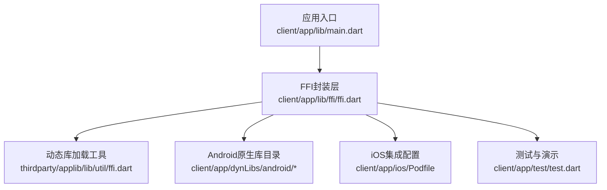
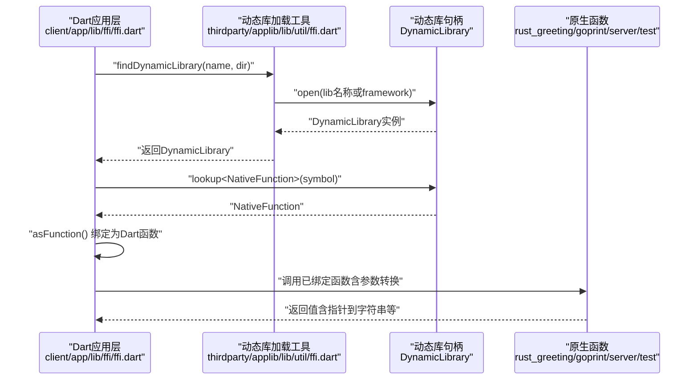
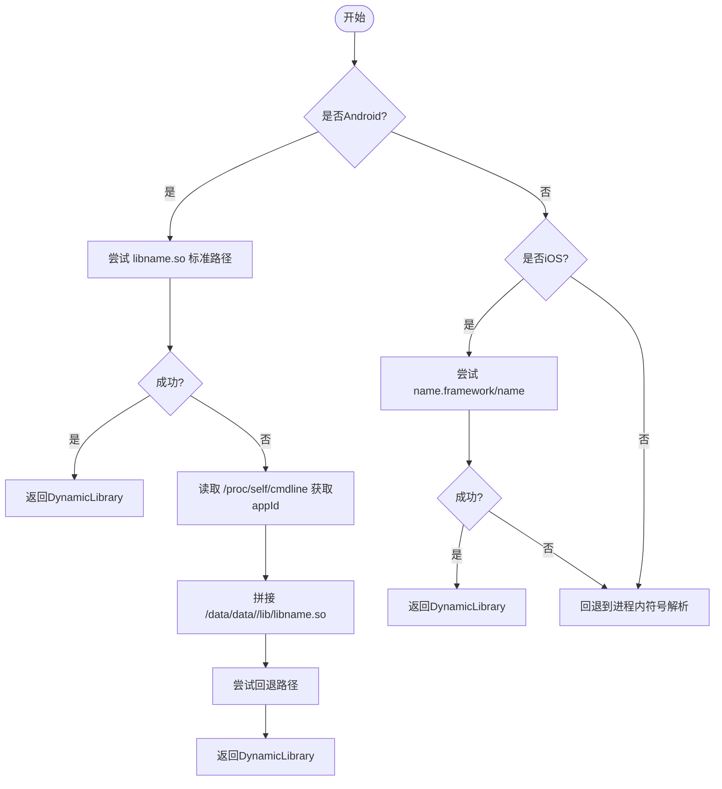
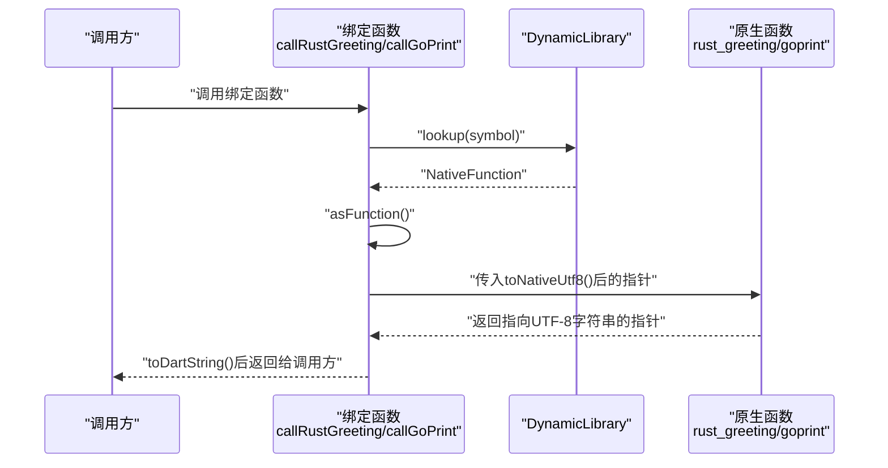
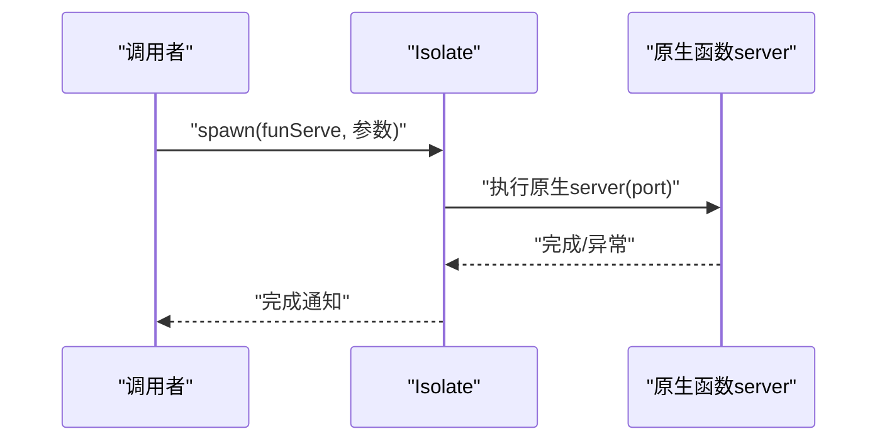
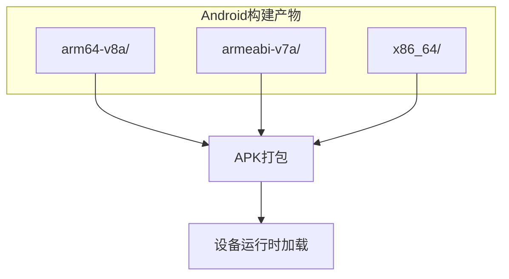
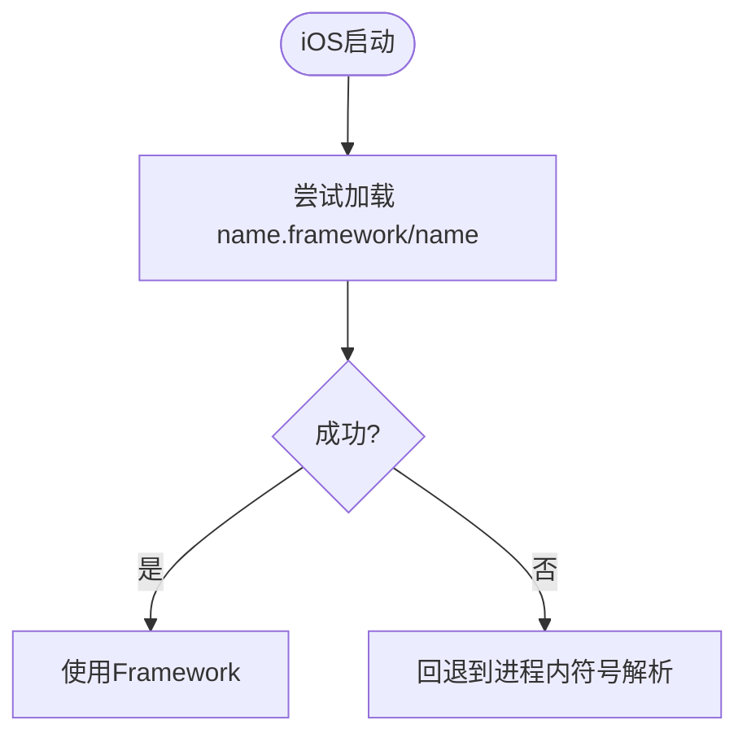
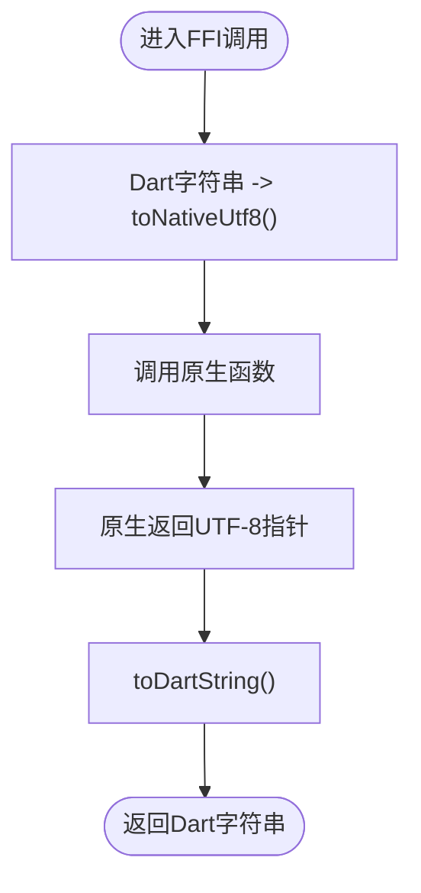
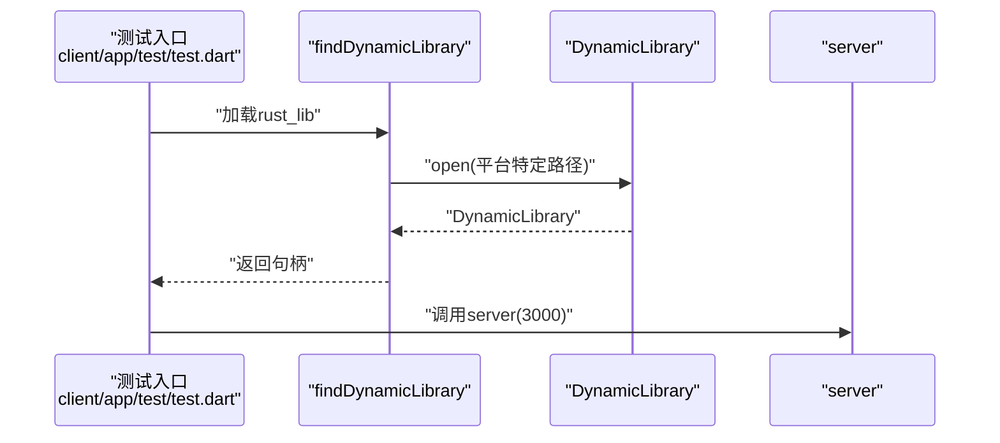
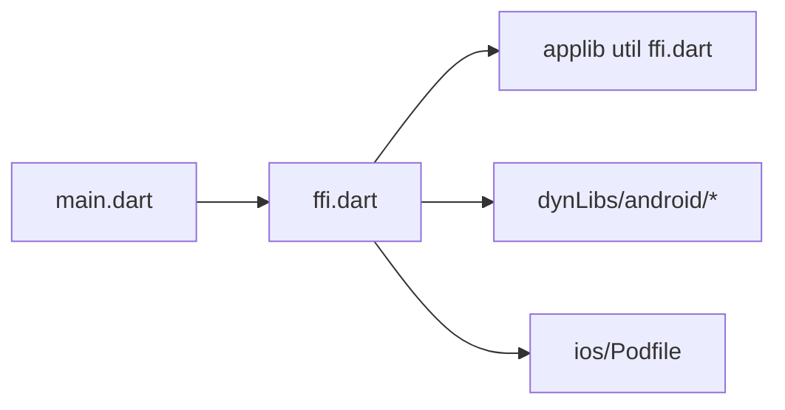

# FFI与原生插件集成

<cite>
**本文档引用的文件**
- [client/app/lib/main.dart](file://client/app/lib/main.dart)
- [client/app/lib/ffi/ffi.dart](file://client/app/lib/ffi/ffi.dart)
- [thirdparty/applib/lib/util/ffi.dart](file://thirdparty/applib/lib/util/ffi.dart)
- [client/app/test/test.dart](file://client/app/test/test.dart)
- [client/app/android/build.gradle.kts](file://client/app/android/build.gradle.kts)
- [client/app/ios/Podfile](file://client/app/ios/Podfile)
- [client/app/dynLibs/android/arm64-v8a/up](file://client/app/dynLibs/android/arm64-v8a/up)
- [client/app/dynLibs/android/armeabi-v7a/up](file://client/app/dynLibs/android/armeabi-v7a/up)
</cite>

## 目录
1. [引言](#引言)
2. [项目结构](#项目结构)
3. [核心组件](#核心组件)
4. [架构总览](#架构总览)
5. [详细组件分析](#详细组件分析)
6. [依赖关系分析](#依赖关系分析)
7. [性能考虑](#性能考虑)
8. [故障排查指南](#故障排查指南)
9. [结论](#结论)
10. [附录](#附录)

## 引言
本文件面向Hoper Flutter项目的FFI（Foreign Function Interface）与原生插件集成，系统性阐述动态库加载、函数绑定、数据类型转换、Android/iOS平台原生库集成、NDK开发与C/C++接口设计、性能优化、内存管理与错误处理，并提供可直接落地的FFI调用示例与最佳实践。

## 项目结构
Hoper Flutter工程中，FFI相关能力主要集中在以下位置：
- 应用入口与全局初始化：client/app/lib/main.dart
- FFI调用封装层：client/app/lib/ffi/ffi.dart
- 跨平台动态库加载工具：thirdparty/applib/lib/util/ffi.dart
- Android原生库放置目录：client/app/dynLibs/android/{abi}/
- iOS集成配置：client/app/ios/Podfile
- 测试与演示：client/app/test/test.dart

**图表来源**
- [client/app/lib/main.dart:1-70](file://client/app/lib/main.dart#L1-L70)
- [client/app/lib/ffi/ffi.dart:1-47](file://client/app/lib/ffi/ffi.dart#L1-L47)
- [thirdparty/applib/lib/util/ffi.dart:1-37](file://thirdparty/applib/lib/util/ffi.dart#L1-L37)
- [client/app/dynLibs/android/arm64-v8a/up:1-1](file://client/app/dynLibs/android/arm64-v8a/up#L1-L1)
- [client/app/dynLibs/android/armeabi-v7a/up:1-1](file://client/app/dynLibs/android/armeabi-v7a/up#L1-L1)
- [client/app/ios/Podfile:1-44](file://client/app/ios/Podfile#L1-L44)
- [client/app/test/test.dart:1-38](file://client/app/test/test.dart#L1-L38)

**章节来源**
- [client/app/lib/main.dart:1-70](file://client/app/lib/main.dart#L1-L70)
- [client/app/lib/ffi/ffi.dart:1-47](file://client/app/lib/ffi/ffi.dart#L1-L47)
- [thirdparty/applib/lib/util/ffi.dart:1-37](file://thirdparty/applib/lib/util/ffi.dart#L1-L37)
- [client/app/dynLibs/android/arm64-v8a/up:1-1](file://client/app/dynLibs/android/arm64-v8a/up#L1-L1)
- [client/app/dynLibs/android/armeabi-v7a/up:1-1](file://client/app/dynLibs/android/armeabi-v7a/up#L1-L1)
- [client/app/ios/Podfile:1-44](file://client/app/ios/Podfile#L1-L44)
- [client/app/test/test.dart:1-38](file://client/app/test/test.dart#L1-L38)

## 核心组件
- 动态库加载工具：统一处理Android/iOS平台的动态库查找与回退逻辑，支持从应用沙盒、系统框架或进程内符号解析。
- FFI函数绑定：通过lookup与asFunction将原生导出函数映射为Dart侧可调用的函数对象。
- 数据类型转换：字符串与指针之间的UTF-8互转，整数等标量类型的传递。
- 并发与隔离：使用Isolate执行原生函数，避免阻塞主线程。
- 平台配置：Android通过Gradle子工程组织构建，iOS通过CocoaPods集成。

**章节来源**
- [thirdparty/applib/lib/util/ffi.dart:5-36](file://thirdparty/applib/lib/util/ffi.dart#L5-L36)
- [client/app/lib/ffi/ffi.dart:8-46](file://client/app/lib/ffi/ffi.dart#L8-L46)
- [client/app/test/test.dart:5-25](file://client/app/test/test.dart#L5-L25)

## 架构总览
下图展示了从Flutter到原生动态库的调用路径与关键交互点：

**图表来源**
- [client/app/lib/ffi/ffi.dart:8-46](file://client/app/lib/ffi/ffi.dart#L8-L46)
- [thirdparty/applib/lib/util/ffi.dart:5-36](file://thirdparty/applib/lib/util/ffi.dart#L5-L36)

## 详细组件分析

### 动态库加载工具（findDynamicLibrary）
- Android优先尝试从应用包内的标准路径加载；失败时回退到/data/data/<appId>/lib/目录，确保多ABI场景可用。
- iOS优先尝试以Framework形式加载；失败则回退至系统提供的进程内符号解析。
- Linux/MacOS/Windows保留原有平台默认行为，便于本地测试。

**图表来源**
- [thirdparty/applib/lib/util/ffi.dart:5-36](file://thirdparty/applib/lib/util/ffi.dart#L5-L36)

**章节来源**
- [thirdparty/applib/lib/util/ffi.dart:5-36](file://thirdparty/applib/lib/util/ffi.dart#L5-L36)

### FFI函数绑定与调用
- 字符串传递：Dart侧将UTF-8编码的字符串转为原生指针，原生函数返回指向UTF-8字符串的指针，再转回Dart侧字符串。
- 数值参数：如整型参数直接按Int32传递。
- 函数绑定：通过lookup获取NativeFunction，再asFunction生成Dart函数对象。
- 并发执行：使用Isolate.spawn启动原生函数，避免阻塞UI线程。

**图表来源**
- [client/app/lib/ffi/ffi.dart:13-32](file://client/app/lib/ffi/ffi.dart#L13-L32)

**章节来源**
- [client/app/lib/ffi/ffi.dart:13-32](file://client/app/lib/ffi/ffi.dart#L13-L32)

### 并发与隔离（Isolate）
- 将可能阻塞的原生函数放入Isolate执行，避免影响UI线程。
- 示例：通过spawn(funServe, 3000)启动server函数。

**图表来源**
- [client/app/lib/ffi/ffi.dart:39-41](file://client/app/lib/ffi/ffi.dart#L39-L41)

**章节来源**
- [client/app/lib/ffi/ffi.dart:39-41](file://client/app/lib/ffi/ffi.dart#L39-L41)

### Android原生库集成
- 原生库放置：将各ABI的动态库置于client/app/dynLibs/android/{abi}/目录，打包时由构建系统复制到APK。
- Gradle配置：根级build.gradle.kts统一管理构建目录与清理任务，保证子工程一致性。
- ABI覆盖：arm64-v8a与armeabi-v7a目录均存在占位文件，确保多ABI支持。

**图表来源**
- [client/app/dynLibs/android/arm64-v8a/up:1-1](file://client/app/dynLibs/android/arm64-v8a/up#L1-L1)
- [client/app/dynLibs/android/armeabi-v7a/up:1-1](file://client/app/dynLibs/android/armeabi-v7a/up#L1-L1)
- [client/app/android/build.gradle.kts:10-17](file://client/app/android/build.gradle.kts#L10-L17)

**章节来源**
- [client/app/dynLibs/android/arm64-v8a/up:1-1](file://client/app/dynLibs/android/arm64-v8a/up#L1-L1)
- [client/app/dynLibs/android/armeabi-v7a/up:1-1](file://client/app/dynLibs/android/armeabi-v7a/up#L1-L1)
- [client/app/android/build.gradle.kts:10-17](file://client/app/android/build.gradle.kts#L10-L17)

### iOS原生库集成
- Podfile：启用use_frameworks!并安装Flutter iOS依赖，确保Framework形式的原生库被正确识别。
- 加载策略：优先尝试Framework加载，失败则回退到进程内符号解析。

**图表来源**
- [client/app/ios/Podfile:30-36](file://client/app/ios/Podfile#L30-L36)
- [thirdparty/applib/lib/util/ffi.dart:21-33](file://thirdparty/applib/lib/util/ffi.dart#L21-L33)

**章节来源**
- [client/app/ios/Podfile:30-36](file://client/app/ios/Podfile#L30-L36)
- [thirdparty/applib/lib/util/ffi.dart:21-33](file://thirdparty/applib/lib/util/ffi.dart#L21-L33)

### 数据类型转换与内存管理
- 字符串：Dart侧使用toNativeUtf8()获得原生指针，原生返回的指针需由Dart侧toDartString()安全释放。
- 整数：按Int32等标量类型直接传递，无需额外转换。
- 内存：确保原生侧分配的字符串在Dart侧及时释放，避免泄漏。

**图表来源**
- [client/app/lib/ffi/ffi.dart:18-32](file://client/app/lib/ffi/ffi.dart#L18-L32)

**章节来源**
- [client/app/lib/ffi/ffi.dart:18-32](file://client/app/lib/ffi/ffi.dart#L18-L32)

### 跨平台兼容性测试
- 本地测试：通过client/app/test/test.dart在桌面环境验证动态库加载与函数绑定。
- 平台差异：Android/iOS加载路径不同，需分别验证Framework与沙盒路径。

**图表来源**
- [client/app/test/test.dart:5-38](file://client/app/test/test.dart#L5-L38)

**章节来源**
- [client/app/test/test.dart:5-38](file://client/app/test/test.dart#L5-L38)

## 依赖关系分析
- FFI封装层依赖动态库加载工具，提供统一的平台适配。
- 应用入口负责全局初始化与错误捕获，间接影响FFI调用的稳定性。
- Android/iOS平台各自维护独立的原生库与构建配置，通过工具函数解耦。

**图表来源**
- [client/app/lib/main.dart:17-69](file://client/app/lib/main.dart#L17-L69)
- [client/app/lib/ffi/ffi.dart:1-47](file://client/app/lib/ffi/ffi.dart#L1-L47)
- [thirdparty/applib/lib/util/ffi.dart:1-37](file://thirdparty/applib/lib/util/ffi.dart#L1-L37)
- [client/app/dynLibs/android/arm64-v8a/up:1-1](file://client/app/dynLibs/android/arm64-v8a/up#L1-L1)
- [client/app/ios/Podfile:1-44](file://client/app/ios/Podfile#L1-L44)

**章节来源**
- [client/app/lib/main.dart:17-69](file://client/app/lib/main.dart#L17-L69)
- [client/app/lib/ffi/ffi.dart:1-47](file://client/app/lib/ffi/ffi.dart#L1-L47)
- [thirdparty/applib/lib/util/ffi.dart:1-37](file://thirdparty/applib/lib/util/ffi.dart#L1-L37)
- [client/app/dynLibs/android/arm64-v8a/up:1-1](file://client/app/dynLibs/android/arm64-v8a/up#L1-L1)
- [client/app/ios/Podfile:1-44](file://client/app/ios/Podfile#L1-L44)

## 性能考虑
- 避免频繁字符串转换：批量处理或缓存中间结果，减少toNativeUtf8()/toDartString()开销。
- 使用Isolate：将CPU密集或阻塞型原生函数放入Isolate，保持UI流畅。
- 动态库加载：尽量在应用启动阶段完成，避免运行时重复加载。
- ABI选择：优先arm64-v8a，同时保留armeabi-v7a以兼容旧设备。

## 故障排查指南
- Android加载失败：确认lib名称与ABI匹配，检查/data/data/<appId>/lib/路径是否存在对应so。
- iOS加载失败：确认Framework名称与Bundle一致，若无Framework则回退到进程内符号解析。
- 字符串乱码：确保原生侧使用UTF-8编码，Dart侧严格使用toNativeUtf8()/toDartString()。
- 桌面测试：参考test.dart在本地验证加载与调用流程。

**章节来源**
- [thirdparty/applib/lib/util/ffi.dart:5-36](file://thirdparty/applib/lib/util/ffi.dart#L5-L36)
- [client/app/test/test.dart:5-38](file://client/app/test/test.dart#L5-L38)

## 结论
Hoper Flutter的FFI体系通过统一的动态库加载工具与清晰的函数绑定封装，实现了跨平台、可扩展的原生调用能力。结合Isolate并发与严格的字符串转换流程，能够在保证性能的同时提升稳定性。建议在实际项目中遵循本文的最佳实践，持续完善Android/iOS的ABI与Framework集成策略，并加强跨平台测试覆盖。

## 附录
- 示例调用路径参考：
  - [client/app/lib/ffi/ffi.dart:18-32](file://client/app/lib/ffi/ffi.dart#L18-L32)
  - [client/app/lib/ffi/ffi.dart:39-41](file://client/app/lib/ffi/ffi.dart#L39-L41)
- 平台加载策略参考：
  - [thirdparty/applib/lib/util/ffi.dart:5-36](file://thirdparty/applib/lib/util/ffi.dart#L5-L36)
- Android构建与原生库放置：
  - [client/app/android/build.gradle.kts:10-17](file://client/app/android/build.gradle.kts#L10-L17)
  - [client/app/dynLibs/android/arm64-v8a/up:1-1](file://client/app/dynLibs/android/arm64-v8a/up#L1-L1)
  - [client/app/dynLibs/android/armeabi-v7a/up:1-1](file://client/app/dynLibs/android/armeabi-v7a/up#L1-L1)
- iOS集成：
  - [client/app/ios/Podfile:30-36](file://client/app/ios/Podfile#L30-L36)