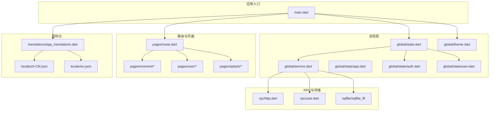
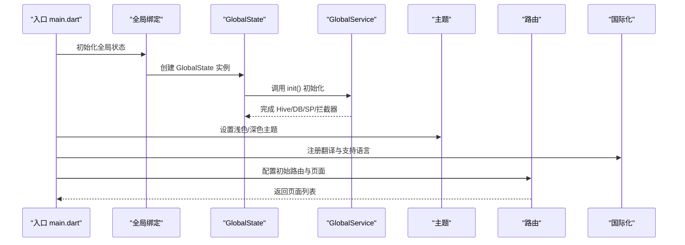
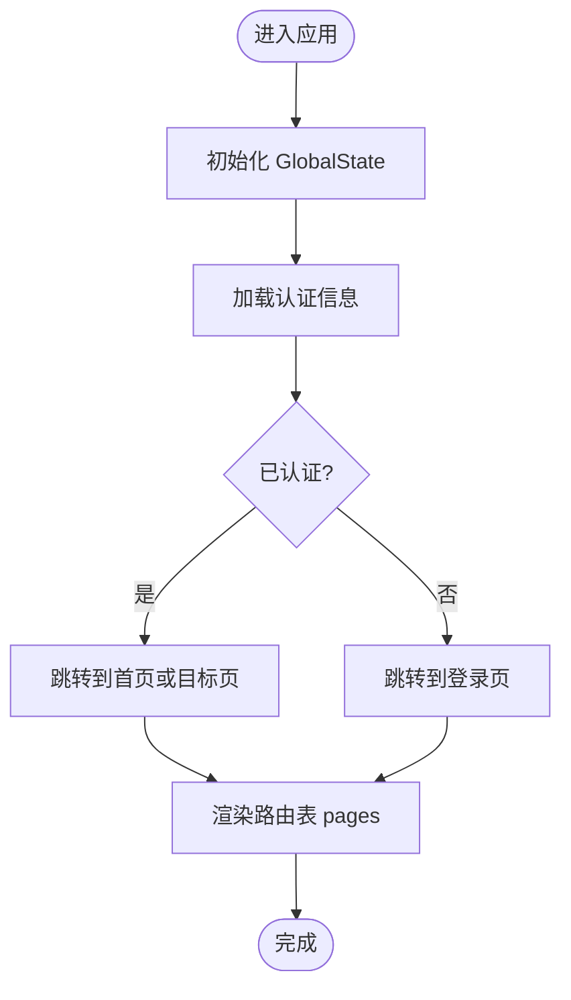
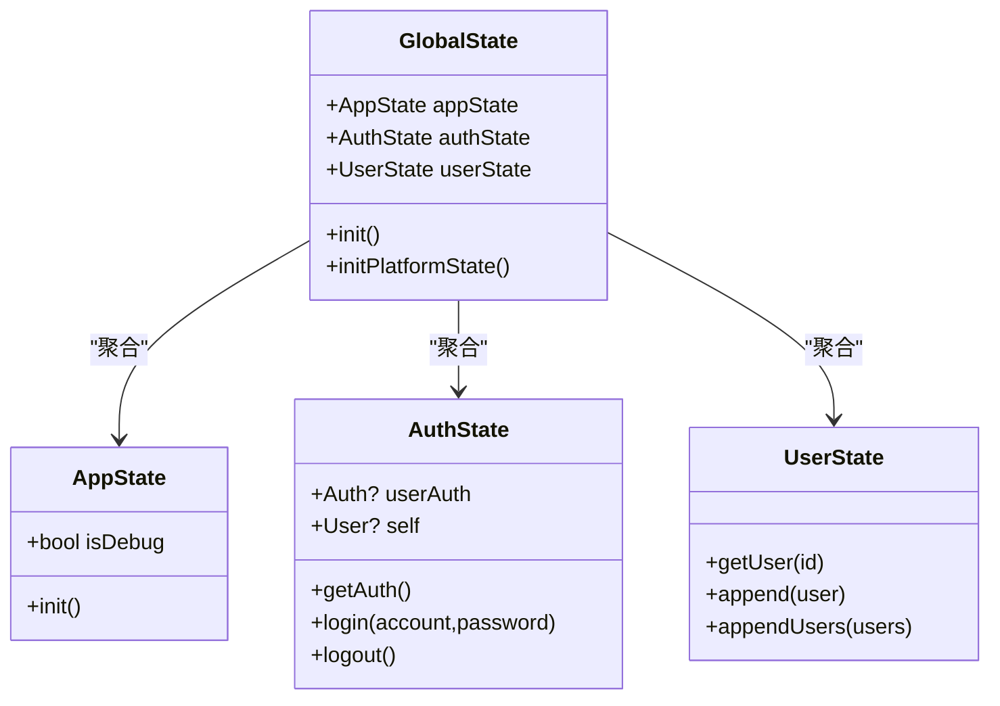
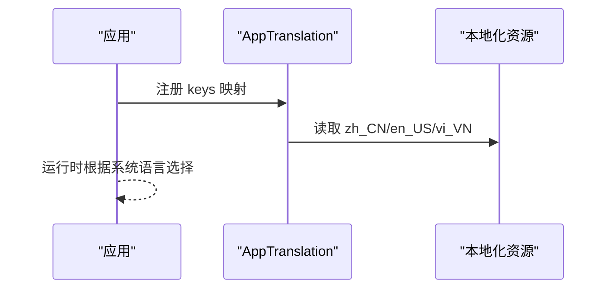
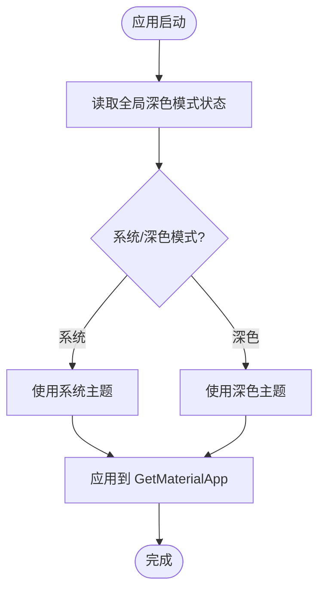
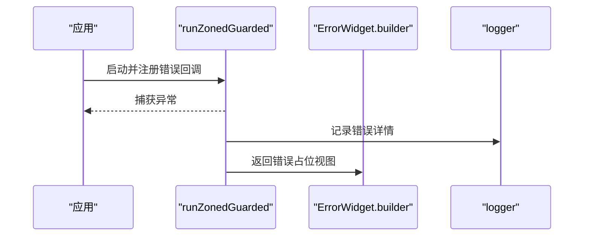
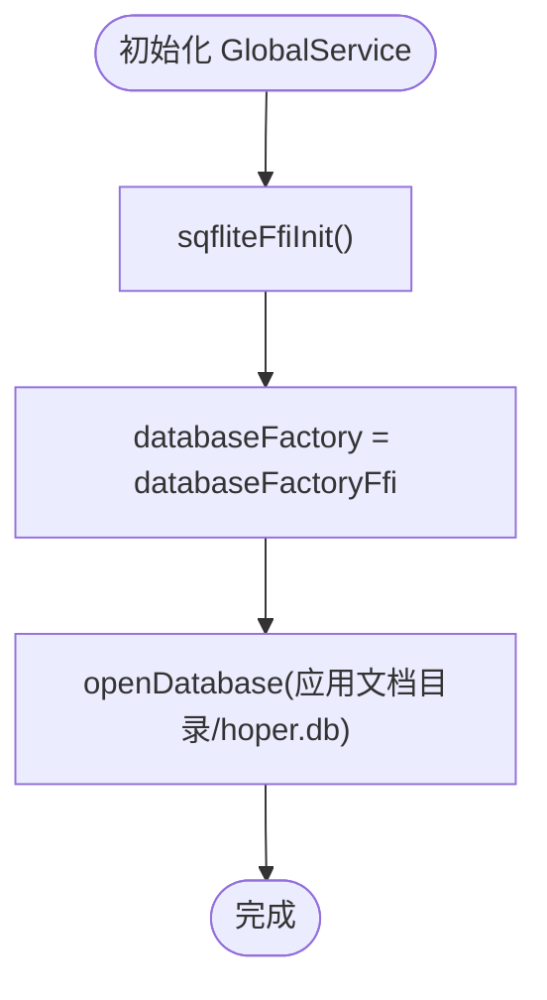
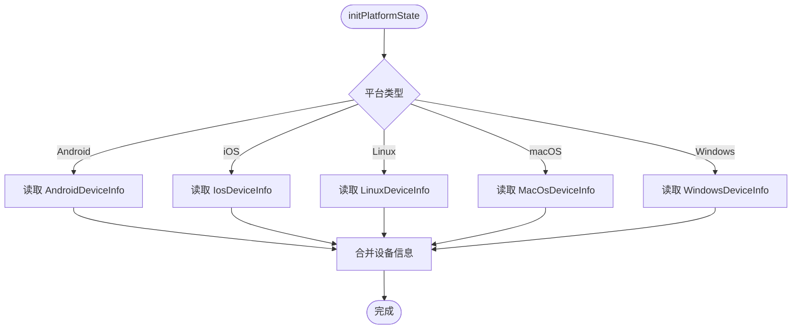
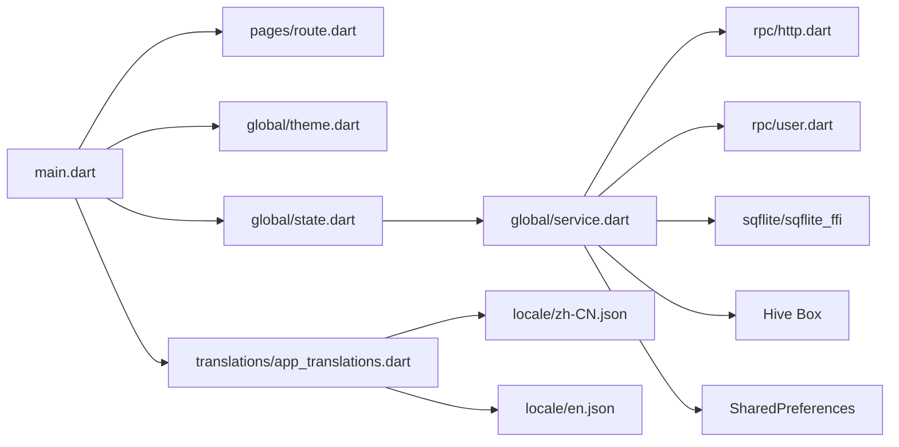

# Flutter 移动端应用

<cite>
**本文档引用的文件**
- [client/app/lib/main.dart](file://client/app/lib/main.dart)
- [client/app/lib/pages/route.dart](file://client/app/lib/pages/route.dart)
- [client/app/lib/global/state.dart](file://client/app/lib/global/state.dart)
- [client/app/lib/global/state/app.dart](file://client/app/lib/global/state/app.dart)
- [client/app/lib/global/state/auth.dart](file://client/app/lib/global/state/auth.dart)
- [client/app/lib/global/state/user.dart](file://client/app/lib/global/state/user.dart)
- [client/app/lib/global/service.dart](file://client/app/lib/global/service.dart)
- [client/app/lib/global/theme.dart](file://client/app/lib/global/theme.dart)
- [client/app/lib/translations/app_translations.dart](file://client/app/lib/translations/app_translations.dart)
- [locale/zh-CN.json](file://locale/zh-CN.json)
- [locale/en.json](file://locale/en.json)
- [client/app/pubspec.yaml](file://client/app/pubspec.yaml)
</cite>

## 目录
1. [简介](#简介)
2. [项目结构](#项目结构)
3. [核心组件](#核心组件)
4. [架构总览](#架构总览)
5. [详细组件分析](#详细组件分析)
6. [依赖关系分析](#依赖关系分析)
7. [性能考虑](#性能考虑)
8. [故障排查指南](#故障排查指南)
9. [结论](#结论)
10. [附录](#附录)

## 简介
本文件面向 Hoper Flutter 移动端应用，系统性梳理其整体架构与实现要点，重点覆盖以下方面：
- 路由与页面导航：基于 GetX 的路由配置与嵌套路由策略
- 状态管理：GetX 控制器与全局状态模型，以及与业务状态的协作
- 国际化：基于 GetX 的多语言翻译机制与本地资源映射
- 主题与外观：Material 3 主题与深色模式切换
- 错误处理：全局错误捕获与本地化提示
- 性能优化：缓存、数据库、网络拦截器与懒初始化
- FFI 与原生：sqflite FFI 初始化与动态库放置策略
- 跨平台兼容：设备信息采集与平台差异处理

## 项目结构
客户端 Flutter 应用位于 client/app，采用按功能域划分的模块化组织方式：
- lib/main.dart：应用入口，初始化全局服务、错误处理、国际化、主题与路由
- lib/pages：页面与控制器，按业务域拆分（如 moment、user、splash 等）
- lib/global：全局状态、服务、主题与工具
- lib/translations：多语言翻译键值映射
- lib/rpc：gRPC/HTTP 客户端封装
- lib/ffi：FFI 动态库放置（按平台架构子目录）
- assets：静态资源（图片、JS、启动页等）

图表来源
- [client/app/lib/main.dart:17-70](file://client/app/lib/main.dart#L17-L70)
- [client/app/lib/pages/route.dart:23-102](file://client/app/lib/pages/route.dart#L23-L102)
- [client/app/lib/global/state.dart:19-200](file://client/app/lib/global/state.dart#L19-L200)
- [client/app/lib/global/service.dart:21-85](file://client/app/lib/global/service.dart#L21-L85)
- [client/app/lib/global/theme.dart:1-72](file://client/app/lib/global/theme.dart#L1-L72)
- [client/app/lib/translations/app_translations.dart:1-15](file://client/app/lib/translations/app_translations.dart#L1-L15)
- [locale/zh-CN.json:1-40](file://locale/zh-CN.json#L1-L40)
- [locale/en.json:1-40](file://locale/en.json#L1-L40)

章节来源
- [client/app/lib/main.dart:17-70](file://client/app/lib/main.dart#L17-L70)
- [client/app/lib/pages/route.dart:23-102](file://client/app/lib/pages/route.dart#L23-L102)
- [client/app/lib/global/state.dart:19-200](file://client/app/lib/global/state.dart#L19-L200)
- [client/app/lib/global/service.dart:21-85](file://client/app/lib/global/service.dart#L21-L85)
- [client/app/lib/global/theme.dart:1-72](file://client/app/lib/global/theme.dart#L1-L72)
- [client/app/lib/translations/app_translations.dart:1-15](file://client/app/lib/translations/app_translations.dart#L1-L15)
- [locale/zh-CN.json:1-40](file://locale/zh-CN.json#L1-L40)
- [locale/en.json:1-40](file://locale/en.json#L1-L40)

## 核心组件
- 全局状态 GlobalState：集中管理应用、认证、用户状态，并负责设备信息采集与初始化流程
- 全局服务 GlobalService：统一初始化日志、Hive Box、SQLite（sqflite FFI）、SharedPreferences、gRPC/HTTP 客户端与拦截器
- 路由系统 Routes：定义命名路由、嵌套路由、鉴权守卫与页面绑定
- 主题系统 AppTheme：提供浅色/深色主题与平台字体适配
- 国际化 AppTranslation：基于 GetX 的多语言键值映射
- 错误处理：通过 runZonedGuarded 与 ErrorWidget.builder 统一捕获与展示

章节来源
- [client/app/lib/global/state.dart:19-200](file://client/app/lib/global/state.dart#L19-L200)
- [client/app/lib/global/service.dart:21-85](file://client/app/lib/global/service.dart#L21-L85)
- [client/app/lib/pages/route.dart:23-102](file://client/app/lib/pages/route.dart#L23-L102)
- [client/app/lib/global/theme.dart:69-72](file://client/app/lib/global/theme.dart#L69-L72)
- [client/app/lib/translations/app_translations.dart:7-14](file://client/app/lib/translations/app_translations.dart#L7-L14)
- [client/app/lib/main.dart:18-25](file://client/app/lib/main.dart#L18-L25)

## 架构总览
应用以“入口 -> 全局 -> 路由/页面 -> RPC/存储”的层次化结构组织，GetX 提供状态与路由能力，全局服务负责基础设施初始化，RPC 层通过 gRPC/HTTP 与后端交互。

图表来源
- [client/app/lib/main.dart:17-70](file://client/app/lib/main.dart#L17-L70)
- [client/app/lib/global/state.dart:39-46](file://client/app/lib/global/state.dart#L39-L46)
- [client/app/lib/global/service.dart:44-83](file://client/app/lib/global/service.dart#L44-L83)
- [client/app/lib/pages/route.dart:56-99](file://client/app/lib/pages/route.dart#L56-L99)

## 详细组件分析

### 路由与页面导航（GetX）
- 命名路由与嵌套路由：通过 Routes 类集中定义常量与动态路由参数，支持子路由嵌套
- 鉴权守卫：authCheck 在访问受保护页面前检查认证状态
- 页面绑定：每个页面可注册对应 Binding 或使用 BindingsBuilder 注入控制器

图表来源
- [client/app/lib/pages/route.dart:26-53](file://client/app/lib/pages/route.dart#L26-L53)
- [client/app/lib/pages/route.dart:56-99](file://client/app/lib/pages/route.dart#L56-L99)
- [client/app/lib/global/state/auth.dart:31-47](file://client/app/lib/global/state/auth.dart#L31-L47)

章节来源
- [client/app/lib/pages/route.dart:23-102](file://client/app/lib/pages/route.dart#L23-L102)
- [client/app/lib/global/state/auth.dart:18-113](file://client/app/lib/global/state/auth.dart#L18-L113)

### 状态管理（GetX）
- GlobalState：单例全局状态容器，聚合 AppState/AuthState/UserState，负责初始化与设备信息读取
- AppState：应用级配置（调试开关、打开次数等）
- AuthState：认证令牌、账户信息持久化与登录/登出流程
- UserState：用户信息缓存（按 ID 映射）

图表来源
- [client/app/lib/global/state.dart:19-200](file://client/app/lib/global/state.dart#L19-L200)
- [client/app/lib/global/state/app.dart:3-21](file://client/app/lib/global/state/app.dart#L3-L21)
- [client/app/lib/global/state/auth.dart:18-113](file://client/app/lib/global/state/auth.dart#L18-L113)
- [client/app/lib/global/state/user.dart:7-25](file://client/app/lib/global/state/user.dart#L7-L25)

章节来源
- [client/app/lib/global/state.dart:19-200](file://client/app/lib/global/state.dart#L19-L200)
- [client/app/lib/global/state/app.dart:3-21](file://client/app/lib/global/state/app.dart#L3-L21)
- [client/app/lib/global/state/auth.dart:18-113](file://client/app/lib/global/state/auth.dart#L18-L113)
- [client/app/lib/global/state/user.dart:7-25](file://client/app/lib/global/state/user.dart#L7-L25)

### 国际化支持机制
- 使用 GetX 的 Translations 体系，AppTranslation 将多语言键值映射到 zh_CN/en_US/vi_VN
- 支持语言在主入口中注册，并设置回退语言
- 本地化资源文件分别提供中文与英文键值

图表来源
- [client/app/lib/translations/app_translations.dart:7-14](file://client/app/lib/translations/app_translations.dart#L7-L14)
- [client/app/lib/main.dart:52-64](file://client/app/lib/main.dart#L52-L64)
- [locale/zh-CN.json:1-40](file://locale/zh-CN.json#L1-L40)
- [locale/en.json:1-40](file://locale/en.json#L1-L40)

章节来源
- [client/app/lib/translations/app_translations.dart:1-15](file://client/app/lib/translations/app_translations.dart#L1-L15)
- [client/app/lib/main.dart:52-64](file://client/app/lib/main.dart#L52-L64)
- [locale/zh-CN.json:1-40](file://locale/zh-CN.json#L1-L40)
- [locale/en.json:1-40](file://locale/en.json#L1-L40)

### 主题切换与外观
- 浅色/深色主题与平台字体适配
- 通过 GetMaterialApp 的 themeMode、theme、darkTheme 控制
- 深色模式开关与全局状态联动

图表来源
- [client/app/lib/main.dart:29-35](file://client/app/lib/main.dart#L29-L35)
- [client/app/lib/global/theme.dart:69-72](file://client/app/lib/global/theme.dart#L69-L72)
- [client/app/lib/global/state.dart:48](file://client/app/lib/global/state.dart#L48)

章节来源
- [client/app/lib/main.dart:29-35](file://client/app/lib/main.dart#L29-L35)
- [client/app/lib/global/theme.dart:1-72](file://client/app/lib/global/theme.dart#L1-L72)
- [client/app/lib/global/state.dart:48](file://client/app/lib/global/state.dart#L48)

### 错误处理机制
- 全局错误捕获：runZonedGuarded 捕获同步/异步异常
- UI 错误兜底：ErrorWidget.builder 统一展示错误占位
- 日志记录：全局 logger 输出错误详情

图表来源
- [client/app/lib/main.dart:18-25](file://client/app/lib/main.dart#L18-L25)
- [client/app/lib/main.dart:66-68](file://client/app/lib/main.dart#L66-L68)
- [client/app/lib/global/service.dart:28](file://client/app/lib/global/service.dart#L28)

章节来源
- [client/app/lib/main.dart:18-25](file://client/app/lib/main.dart#L18-L25)
- [client/app/lib/main.dart:66-68](file://client/app/lib/main.dart#L66-L68)
- [client/app/lib/global/service.dart:28](file://client/app/lib/global/service.dart#L28)

### FFI 动态库与原生集成
- sqflite FFI 初始化：在 GlobalService 中调用 sqfliteFfiInit 并替换 databaseFactory
- 动态库放置：client/app/dynLibs 下按架构目录存放 .so/.dylib（arm64-v8a、armeabi-v7a、x86_64）
- 数据库路径：使用应用文档目录拼接数据库文件路径

图表来源
- [client/app/lib/global/service.dart:60-83](file://client/app/lib/global/service.dart#L60-L83)

章节来源
- [client/app/lib/global/service.dart:60-83](file://client/app/lib/global/service.dart#L60-L83)

### 跨平台兼容性处理
- 设备信息采集：通过 device_info_plus 获取 Android/iOS/Linux/macOS/Windows 信息
- 平台分支：在 GlobalState.initPlatformState 中按平台读取不同设备信息
- 字体适配：Windows 平台设置特定字体族

图表来源
- [client/app/lib/global/state.dart:50-69](file://client/app/lib/global/state.dart#L50-L69)
- [client/app/lib/global/state.dart:71-198](file://client/app/lib/global/state.dart#L71-L198)

章节来源
- [client/app/lib/global/state.dart:50-69](file://client/app/lib/global/state.dart#L50-L69)
- [client/app/lib/global/state.dart:71-198](file://client/app/lib/global/state.dart#L71-L198)

## 依赖关系分析
- 入口依赖：main.dart 依赖路由、主题、国际化与全局状态
- 全局依赖：GlobalState 依赖 GlobalService；GlobalService 依赖日志、Hive、SQLite、SharedPreferences、gRPC/HTTP
- 页面依赖：各页面依赖对应 Binding/Controller，部分页面依赖 Routes 的鉴权守卫
- 国际化依赖：AppTranslation 依赖本地化资源文件

图表来源
- [client/app/lib/main.dart:17-70](file://client/app/lib/main.dart#L17-L70)
- [client/app/lib/pages/route.dart:23-102](file://client/app/lib/pages/route.dart#L23-L102)
- [client/app/lib/global/state.dart:19-200](file://client/app/lib/global/state.dart#L19-L200)
- [client/app/lib/global/service.dart:21-85](file://client/app/lib/global/service.dart#L21-L85)
- [client/app/lib/translations/app_translations.dart:1-15](file://client/app/lib/translations/app_translations.dart#L1-L15)
- [locale/zh-CN.json:1-40](file://locale/zh-CN.json#L1-L40)
- [locale/en.json:1-40](file://locale/en.json#L1-L40)

章节来源
- [client/app/lib/main.dart:17-70](file://client/app/lib/main.dart#L17-L70)
- [client/app/lib/pages/route.dart:23-102](file://client/app/lib/pages/route.dart#L23-L102)
- [client/app/lib/global/state.dart:19-200](file://client/app/lib/global/state.dart#L19-L200)
- [client/app/lib/global/service.dart:21-85](file://client/app/lib/global/service.dart#L21-L85)
- [client/app/lib/translations/app_translations.dart:1-15](file://client/app/lib/translations/app_translations.dart#L1-L15)
- [locale/zh-CN.json:1-40](file://locale/zh-CN.json#L1-L40)
- [locale/en.json:1-40](file://locale/en.json#L1-L40)

## 性能考虑
- 懒初始化：GlobalService.init 中对 Box、DB 初始化使用 Future.wait 并发执行
- 缓存：DefaultCacheManager 提供统一缓存管理
- 数据库：sqflite FFI 减少跨平台性能损耗
- 网络：HTTP 客户端拦截器集中处理请求/响应
- 状态更新：GetX 观察者模式减少不必要的重建

章节来源
- [client/app/lib/global/service.dart:44-83](file://client/app/lib/global/service.dart#L44-L83)
- [client/app/lib/global/state.dart:39-46](file://client/app/lib/global/state.dart#L39-L46)

## 故障排查指南
- 启动崩溃：检查 runZonedGuarded 是否正确捕获异常，查看 ErrorWidget.builder 返回的错误占位
- 认证失败：确认 AuthState.getAuth 是否成功从 Box 读取令牌并设置到 gRPC CallOptions
- 数据库无法打开：核对数据库路径与 sqflite FFI 初始化顺序
- 国际化无效：确认 supportedLocales 与 fallbackLocale 设置，以及 AppTranslation.keys 映射

章节来源
- [client/app/lib/main.dart:18-25](file://client/app/lib/main.dart#L18-L25)
- [client/app/lib/global/state/auth.dart:31-47](file://client/app/lib/global/state/auth.dart#L31-L47)
- [client/app/lib/global/service.dart:60-83](file://client/app/lib/global/service.dart#L60-L83)
- [client/app/lib/translations/app_translations.dart:7-14](file://client/app/lib/translations/app_translations.dart#L7-L14)

## 结论
该 Flutter 应用采用清晰的分层架构与模块化组织，结合 GetX 的路由与状态管理能力，实现了稳定的国际化、主题与错误处理机制。通过 sqflite FFI 与全局服务的懒初始化策略，兼顾了跨平台性能与可维护性。建议后续持续完善 RPC 层的错误码与日志埋点，增强可观测性与用户体验。

## 附录
- 依赖清单参考：pubspec.yaml 中列出的 Flutter、GetX、gRPC、protobuf、sqflite、hive、intl 等依赖
- 动态库放置：client/app/dynLibs 下按架构目录存放原生库文件

章节来源
- [client/app/pubspec.yaml:23-101](file://client/app/pubspec.yaml#L23-L101)