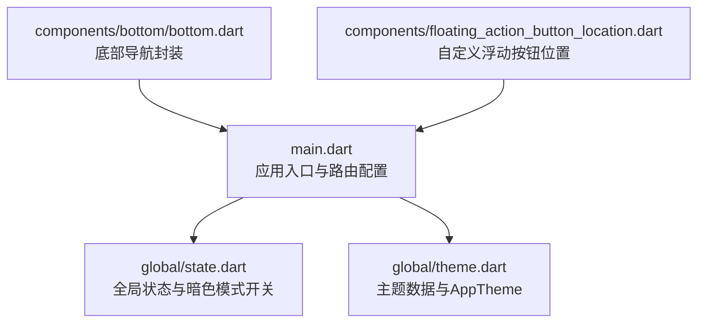
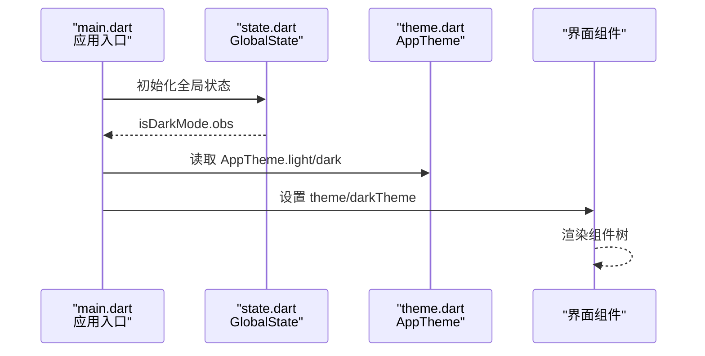
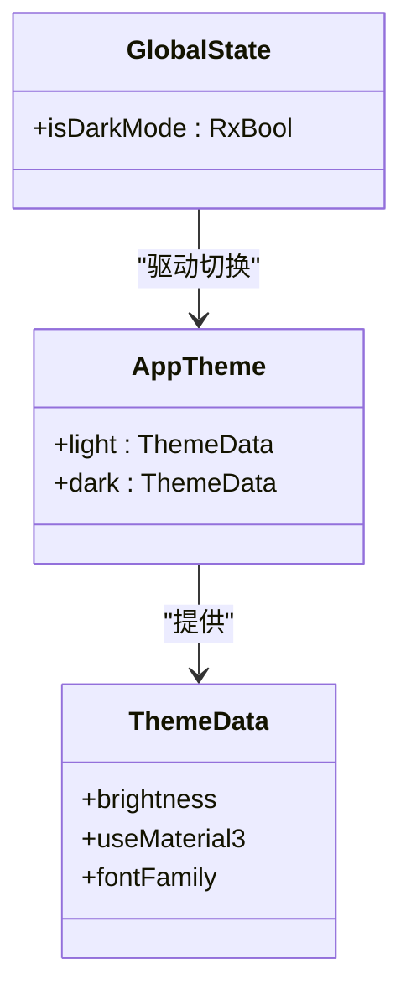
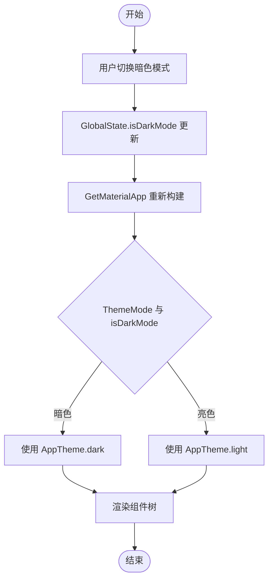
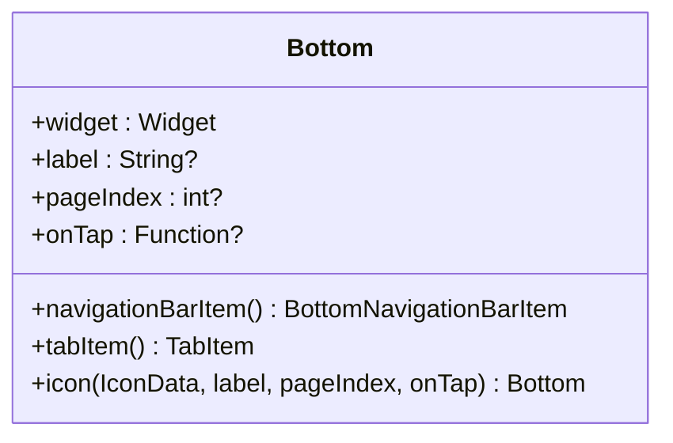
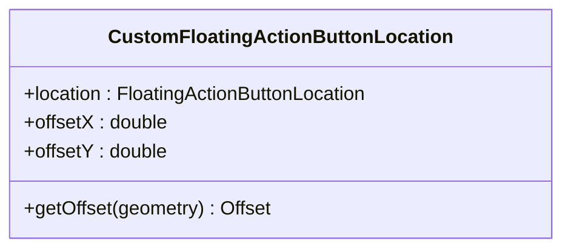
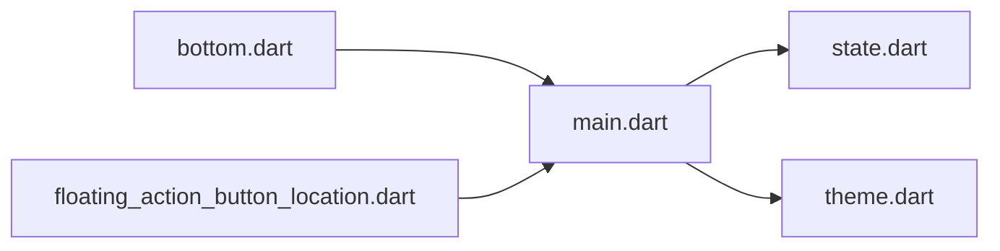

# UI组件与主题系统

<cite>
**本文档引用的文件**
- [main.dart](file://client/app/lib/main.dart)
- [theme.dart](file://client/app/lib/global/theme.dart)
- [state.dart](file://client/app/lib/global/state.dart)
- [bottom.dart](file://client/app/lib/components/bottom/bottom.dart)
- [floating_action_button_location.dart](file://client/app/lib/components/floating_action_button_location.dart)
</cite>

## 目录
1. [简介](#简介)
2. [项目结构](#项目结构)
3. [核心组件](#核心组件)
4. [架构总览](#架构总览)
5. [详细组件分析](#详细组件分析)
6. [依赖关系分析](#依赖关系分析)
7. [性能考虑](#性能考虑)
8. [故障排除指南](#故障排除指南)
9. [结论](#结论)
10. [附录](#附录)

## 简介
本文件面向Hoper Flutter UI组件系统，聚焦以下目标：
- 自定义主题系统：深色/浅色主题切换、颜色体系与字体管理
- 核心UI组件设计原则：按钮、输入框、卡片、列表等的样式定制思路
- 响应式布局与屏幕适配策略、无障碍访问支持
- 组件使用示例：如何创建可复用UI组件、实现主题切换动画、优化组件性能
- UI设计规范与组件开发最佳实践

当前仓库中Flutter客户端位于 client/app/lib，主题与全局状态集中在 global 目录，底部导航与浮动按钮位置等UI组件位于 components 目录。

## 项目结构
Flutter应用入口在 main.dart 中初始化 GetMaterialApp，并通过 global/state.dart 提供全局状态（含暗色模式开关），global/theme.dart 定义主题数据与AppTheme类。components 目录包含可复用UI组件，如底部导航封装与自定义浮动按钮位置。

**图表来源**
- [main.dart:17-70](file://client/app/lib/main.dart#L17-L70)
- [theme.dart:69-72](file://client/app/lib/global/theme.dart#L69-L72)
- [state.dart:19-48](file://client/app/lib/global/state.dart#L19-L48)
- [bottom.dart:7-35](file://client/app/lib/components/bottom/bottom.dart#L7-L35)
- [floating_action_button_location.dart:3-14](file://client/app/lib/components/floating_action_button_location.dart#L3-L14)

**章节来源**
- [main.dart:17-70](file://client/app/lib/main.dart#L17-L70)
- [theme.dart:1-72](file://client/app/lib/global/theme.dart#L1-L72)
- [state.dart:1-200](file://client/app/lib/global/state.dart#L1-L200)
- [bottom.dart:1-35](file://client/app/lib/components/bottom/bottom.dart#L1-L35)
- [floating_action_button_location.dart:1-14](file://client/app/lib/components/floating_action_button_location.dart#L1-L14)

## 核心组件
- 应用入口与主题绑定：main.dart 使用 GetMaterialApp 配置主题模式、明暗主题、本地化与路由。
- 主题系统：theme.dart 定义 ThemeData 与 AppTheme 类，支持明/暗主题及Material3。
- 全局状态：state.dart 提供 isDarkMode.obs，用于驱动主题切换与全局状态管理。
- 底部导航封装：bottom.dart 将图标、标签、页面索引与点击回调统一封装为 Bottom 对象，便于复用。
- 浮动按钮位置：floating_action_button_location.dart 提供自定义浮动按钮位置的实现。

**章节来源**
- [main.dart:29-35](file://client/app/lib/main.dart#L29-L35)
- [theme.dart:69-72](file://client/app/lib/global/theme.dart#L69-L72)
- [state.dart:48-48](file://client/app/lib/global/state.dart#L48-L48)
- [bottom.dart:7-35](file://client/app/lib/components/bottom/bottom.dart#L7-L35)
- [floating_action_button_location.dart:3-14](file://client/app/lib/components/floating_action_button_location.dart#L3-L14)

## 架构总览
下图展示了应用启动到主题渲染的关键流程：入口初始化 -> 获取全局状态 -> 读取暗色模式 -> 渲染明/暗主题。

**图表来源**
- [main.dart:17-70](file://client/app/lib/main.dart#L17-L70)
- [state.dart:19-48](file://client/app/lib/global/state.dart#L19-L48)
- [theme.dart:69-72](file://client/app/lib/global/theme.dart#L69-L72)

## 详细组件分析

### 主题系统与颜色体系
- 主题数据：theme.dart 定义了明/暗主题的基础数据结构，支持 Material3 与平台字体（Windows使用特定字体）。
- AppTheme 类：提供 light/dark 两个静态主题实例，作为 GetMaterialApp 的 theme/darkTheme。
- 暗色模式开关：state.dart 中 isDarkMode 为 Rx 变量，main.dart 依据其值决定 ThemeMode。
- 颜色体系建议：
  - 使用语义化命名的颜色变量，避免硬编码颜色值。
  - 在明/暗主题中保持对比度与可读性，确保文本与背景的可访问性。
  - 为交互元素（如按钮、高亮）提供一致的状态色（默认/悬停/按下/禁用）。

**图表来源**
- [theme.dart:69-72](file://client/app/lib/global/theme.dart#L69-L72)
- [state.dart:48-48](file://client/app/lib/global/state.dart#L48-L48)

**章节来源**
- [theme.dart:1-72](file://client/app/lib/global/theme.dart#L1-L72)
- [state.dart:48-48](file://client/app/lib/global/state.dart#L48-L48)
- [main.dart:29-35](file://client/app/lib/main.dart#L29-L35)

### 深色/浅色主题切换流程
- 触发点：用户在界面中切换暗色模式（例如通过设置页或主题开关）。
- 状态更新：GlobalState.isDarkMode 改变，触发依赖该状态的组件重建。
- 主题应用：GetMaterialApp 根据 ThemeMode 与 isDarkMode 决定使用 light 或 dark 主题。
- 动画过渡：可通过 AnimatedSwitcher、Hero 动画或自定义过渡实现平滑切换（建议在具体页面中按需引入）。

**图表来源**
- [main.dart:29-35](file://client/app/lib/main.dart#L29-L35)
- [state.dart:48-48](file://client/app/lib/global/state.dart#L48-L48)
- [theme.dart:69-72](file://client/app/lib/global/theme.dart#L69-L72)

**章节来源**
- [main.dart:29-35](file://client/app/lib/main.dart#L29-L35)
- [state.dart:48-48](file://client/app/lib/global/state.dart#L48-L48)

### 字体管理与响应式布局
- 字体设置：AppTheme 在 Windows 平台设置特定字体，其他平台保持默认。
- 响应式策略：
  - 使用 MediaQuery 获取屏幕尺寸与密度，按断点调整组件尺寸与间距。
  - 使用 LayoutBuilder 或 OrientationBuilder 实现横竖屏适配。
  - 文本大小采用相对单位（如倍数缩放），保证在不同DPR下的可读性。
- 无障碍支持：
  - 为按钮、输入框等控件设置 semanticLabel 与 tooltip。
  - 确保焦点顺序合理，键盘导航可用。
  - 使用高对比度颜色与可调整的文本缩放。

**章节来源**
- [theme.dart:70-71](file://client/app/lib/global/theme.dart#L70-L71)

### 底部导航组件设计
- 设计原则：统一图标、标签与页面索引；提供点击回调；支持 BottomNavigationBarItem 与 TabItem 两种形态。
- 复用方式：通过构造工厂方法 icon(...) 快速生成底部项；在页面中以列表形式传入导航条。

**图表来源**
- [bottom.dart:7-35](file://client/app/lib/components/bottom/bottom.dart#L7-L35)

**章节来源**
- [bottom.dart:1-35](file://client/app/lib/components/bottom/bottom.dart#L1-L35)

### 浮动按钮位置定制
- 设计目的：在默认浮动按钮位置基础上增加X/Y轴偏移，满足复杂布局需求。
- 使用场景：当底部导航或侧边栏遮挡默认位置时，通过自定义位置提升可用性。

**图表来源**
- [floating_action_button_location.dart:3-14](file://client/app/lib/components/floating_action_button_location.dart#L3-L14)

**章节来源**
- [floating_action_button_location.dart:1-14](file://client/app/lib/components/floating_action_button_location.dart#L1-L14)

### 核心UI组件样式定制（设计原则）
- 按钮：统一圆角、内边距、阴影与禁用态；在明/暗主题下保持足够对比度。
- 输入框：清晰的焦点状态、错误提示与占位符颜色；在暗色模式下提高可读性。
- 卡片：统一阴影层级、圆角与留白；内容区域使用合适的字体大小与行高。
- 列表：头部固定、内容滚动；在暗色模式下降低分割线亮度，提升层次感。
- 一致性：所有组件遵循同一套设计令牌（颜色、字体、间距、圆角），并通过主题系统集中管理。

[本节为概念性指导，不直接分析具体文件]

### 组件使用示例（路径指引）
- 创建可复用底部导航项：参考 [bottom.dart:16-18](file://client/app/lib/components/bottom/bottom.dart#L16-L18) 的工厂方法与 [bottom.dart:20-32](file://client/app/lib/components/bottom/bottom.dart#L20-L32) 的导航项生成。
- 自定义浮动按钮位置：参考 [floating_action_button_location.dart:9-13](file://client/app/lib/components/floating_action_button_location.dart#L9-L13) 的 getOffset 实现。
- 主题切换：参考 [main.dart:31-32](file://client/app/lib/main.dart#L31-L32) 的 ThemeMode 与 [state.dart:48-48](file://client/app/lib/global/state.dart#L48-L48) 的 isDarkMode。

**章节来源**
- [bottom.dart:16-32](file://client/app/lib/components/bottom/bottom.dart#L16-L32)
- [floating_action_button_location.dart:9-13](file://client/app/lib/components/floating_action_button_location.dart#L9-L13)
- [main.dart:31-32](file://client/app/lib/main.dart#L31-L32)
- [state.dart:48-48](file://client/app/lib/global/state.dart#L48-L48)

## 依赖关系分析
- main.dart 依赖 global/state.dart 提供的全局状态，依赖 global/theme.dart 提供的主题数据。
- components 下的 UI 组件通过导入主题与状态实现外观与行为的一致性。
- 无明显循环依赖，耦合度较低，职责清晰。

**图表来源**
- [main.dart:17-70](file://client/app/lib/main.dart#L17-L70)
- [state.dart:19-48](file://client/app/lib/global/state.dart#L19-L48)
- [theme.dart:69-72](file://client/app/lib/global/theme.dart#L69-L72)
- [bottom.dart:7-35](file://client/app/lib/components/bottom/bottom.dart#L7-L35)
- [floating_action_button_location.dart:3-14](file://client/app/lib/components/floating_action_button_location.dart#L3-L14)

**章节来源**
- [main.dart:17-70](file://client/app/lib/main.dart#L17-L70)
- [state.dart:19-48](file://client/app/lib/global/state.dart#L19-L48)
- [theme.dart:69-72](file://client/app/lib/global/theme.dart#L69-L72)
- [bottom.dart:7-35](file://client/app/lib/components/bottom/bottom.dart#L7-L35)
- [floating_action_button_location.dart:3-14](file://client/app/lib/components/floating_action_button_location.dart#L3-L14)

## 性能考虑
- 主题切换性能：尽量减少不必要的重建；对频繁变化的状态使用 Rx 变量并合理拆分组件。
- 布局性能：避免深层嵌套与昂贵的测量；使用 const 构造与不可变小部件。
- 图像与资源：按需加载、缓存与懒加载；在暗色模式下避免过度阴影与高对比度闪烁。
- 动画性能：使用 Transform、Opacity 等轻量动画；避免在动画期间进行重计算。

[本节为通用指导，不直接分析具体文件]

## 故障排除指南
- 页面无法显示：main.dart 中 ErrorWidget.builder 返回居中文本，检查路由与页面初始化逻辑。
- 主题未生效：确认 ThemeMode 与 AppTheme.light/dark 的设置；检查 isDarkMode.obs 是否正确更新。
- 字体显示异常：Windows 平台已设置特定字体，其他平台保持默认；若出现乱码，检查字体资源与系统字体支持。

**章节来源**
- [main.dart:17-25](file://client/app/lib/main.dart#L17-L25)
- [main.dart:29-35](file://client/app/lib/main.dart#L29-L35)
- [theme.dart:70-71](file://client/app/lib/global/theme.dart#L70-L71)

## 结论
Hoper Flutter UI组件系统以 GetX 状态管理与 Material 主题为核心，提供了简洁的主题切换机制与可复用的UI组件。通过统一的颜色与字体管理、响应式布局策略以及无障碍支持，能够快速构建一致且高性能的跨平台界面。后续可在现有基础上扩展更多组件与动画效果，并完善设计令牌与组件库文档。

[本节为总结性内容，不直接分析具体文件]

## 附录
- 设计规范建议
  - 颜色：定义主色、强调色、状态色（成功/警告/错误/信息）与背景色（基础/层级）。
  - 字体：定义标题、正文、辅助文字的字号与字重，确保在不同DPR下的可读性。
  - 间距：建立网格系统（如4dp/8dp倍数），统一组件内外边距与行高。
  - 圆角：定义标准圆角半径，用于按钮、卡片与对话框等。
- 最佳实践
  - 使用 const 构造与不可变小部件，减少重建。
  - 将样式抽取为常量或主题变量，避免散落的硬编码值。
  - 为交互元素提供明确的视觉反馈与无障碍标签。
  - 在暗色模式下测试对比度与可读性，确保符合WCAG标准。

[本节为概念性内容，不直接分析具体文件]