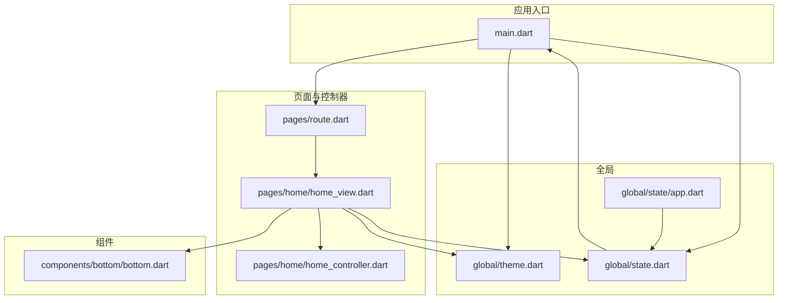
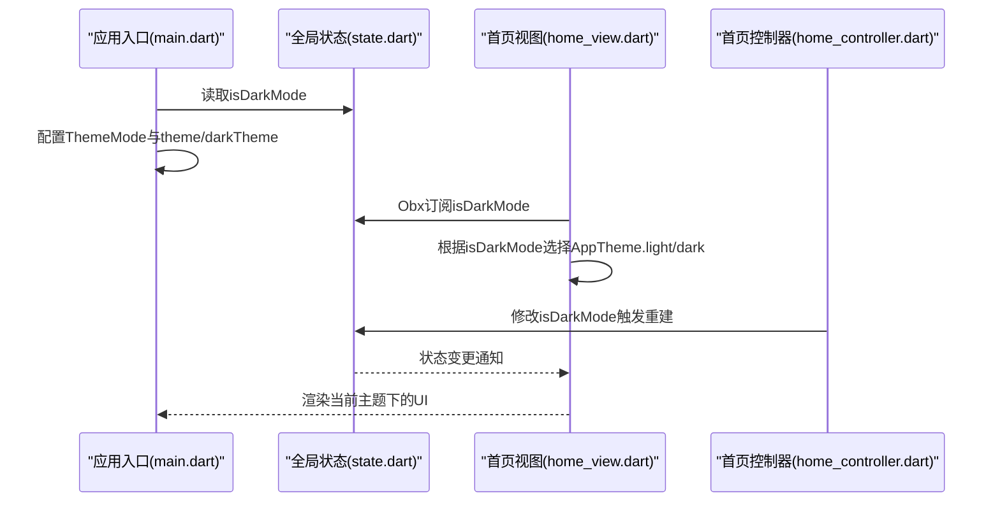
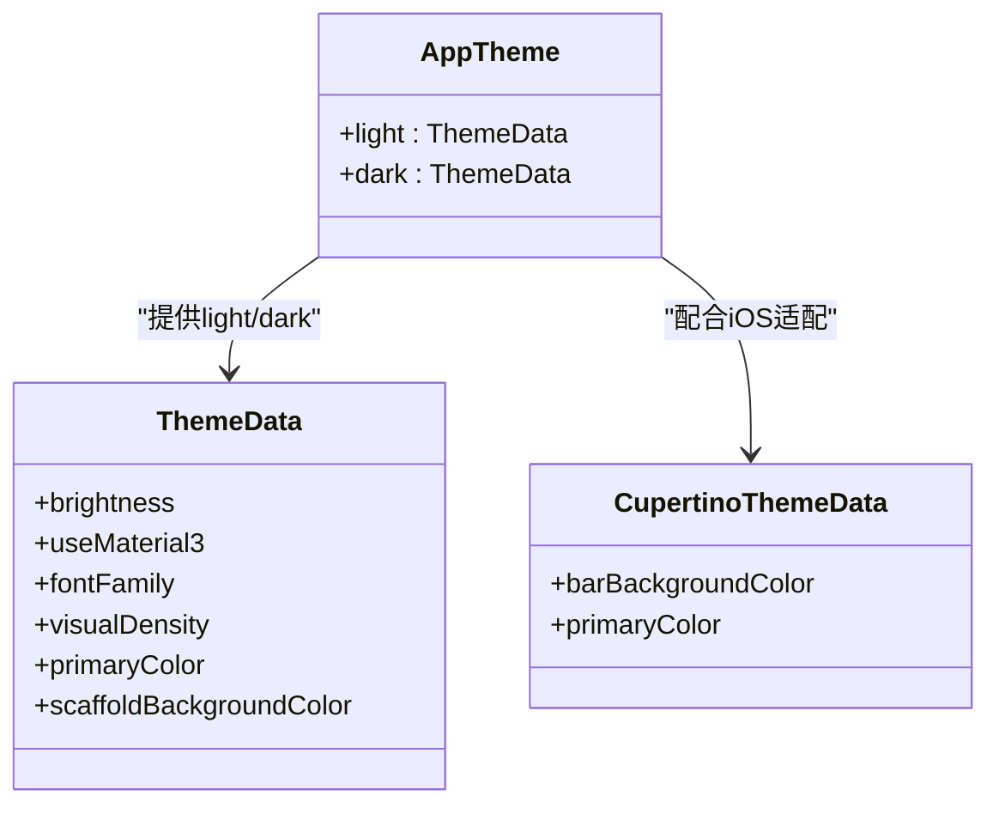
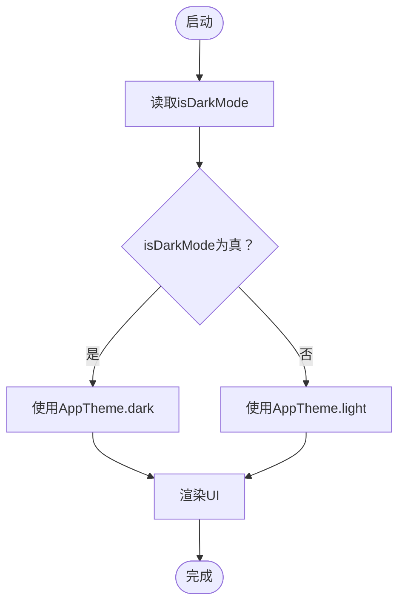
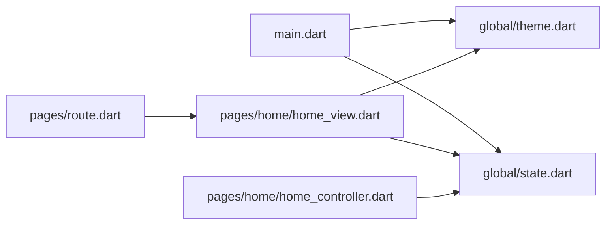

# 主题系统设计

<cite>
**本文引用的文件**
- [client/app/lib/main.dart](file://client/app/lib/main.dart)
- [client/app/lib/global/theme.dart](file://client/app/lib/global/theme.dart)
- [client/app/lib/global/state.dart](file://client/app/lib/global/state.dart)
- [client/app/lib/global/state/app.dart](file://client/app/lib/global/state/app.dart)
- [client/app/lib/pages/route.dart](file://client/app/lib/pages/route.dart)
- [client/app/lib/pages/home/home_view.dart](file://client/app/lib/pages/home/home_view.dart)
- [client/app/lib/pages/home/home_controller.dart](file://client/app/lib/pages/home/home_controller.dart)
- [client/app/lib/components/bottom/bottom.dart](file://client/app/lib/components/bottom/bottom.dart)
</cite>

## 目录
1. [简介](#简介)
2. [项目结构](#项目结构)
3. [核心组件](#核心组件)
4. [架构总览](#架构总览)
5. [详细组件分析](#详细组件分析)
6. [依赖关系分析](#依赖关系分析)
7. [性能考量](#性能考量)
8. [故障排查指南](#故障排查指南)
9. [结论](#结论)
10. [附录](#附录)

## 简介
本文件面向Hoper Flutter主题系统，围绕Material Design 3（M3）主题与Cupertino iOS主题的实现进行系统化技术说明。内容涵盖：
- 浅色与深色主题配置、颜色体系与字体管理策略
- iOS平台适配与Cupertino主题配置
- 主题切换机制与动态主题更新
- 主题数据结构设计原理：ThemeData、CupertinoThemeData的配置项与平台适配逻辑
- 主题定制最佳实践：颜色变量管理、字体样式定义、视觉密度控制
- 具体实现示例：平滑主题切换动画与主题变量的正确使用方式

## 项目结构
Hoper Flutter客户端采用模块化组织，主题系统主要分布在以下位置：
- 应用入口与主题挂载：main.dart
- 主题常量与平台适配：global/theme.dart
- 全局状态与主题模式：global/state.dart、global/state/app.dart
- 页面路由与视图：pages/route.dart、pages/home/home_view.dart
- 控制器与交互：pages/home/home_controller.dart
- 底部导航组件：components/bottom/bottom.dart

图表来源
- [client/app/lib/main.dart:17-69](file://client/app/lib/main.dart#L17-L69)
- [client/app/lib/global/theme.dart:8-72](file://client/app/lib/global/theme.dart#L8-L72)
- [client/app/lib/global/state.dart:19-200](file://client/app/lib/global/state.dart#L19-L200)
- [client/app/lib/global/state/app.dart:3-21](file://client/app/lib/global/state/app.dart#L3-L21)
- [client/app/lib/pages/route.dart:23-102](file://client/app/lib/pages/route.dart#L23-L102)
- [client/app/lib/pages/home/home_view.dart:29-117](file://client/app/lib/pages/home/home_view.dart#L29-L117)
- [client/app/lib/pages/home/home_controller.dart:9-70](file://client/app/lib/pages/home/home_controller.dart#L9-L70)
- [client/app/lib/components/bottom/bottom.dart:7-35](file://client/app/lib/components/bottom/bottom.dart#L7-L35)

章节来源
- [client/app/lib/main.dart:17-69](file://client/app/lib/main.dart#L17-L69)
- [client/app/lib/global/theme.dart:8-72](file://client/app/lib/global/theme.dart#L8-L72)
- [client/app/lib/global/state.dart:19-200](file://client/app/lib/global/state.dart#L19-L200)
- [client/app/lib/global/state/app.dart:3-21](file://client/app/lib/global/state/app.dart#L3-L21)
- [client/app/lib/pages/route.dart:23-102](file://client/app/lib/pages/route.dart#L23-L102)
- [client/app/lib/pages/home/home_view.dart:29-117](file://client/app/lib/pages/home/home_view.dart#L29-L117)
- [client/app/lib/pages/home/home_controller.dart:9-70](file://client/app/lib/pages/home/home_controller.dart#L9-L70)
- [client/app/lib/components/bottom/bottom.dart:7-35](file://client/app/lib/components/bottom/bottom.dart#L7-L35)

## 核心组件
- 主题常量与平台适配：定义浅色/深色Material主题与Cupertino主题，启用M3并按平台设置字体族。
- 全局状态：维护isDarkMode等全局状态，驱动主题模式切换。
- 应用入口：通过GetMaterialApp配置themeMode、theme/darkTheme，并注册本地化委托。
- 视图与控制器：在底部导航等UI中读取当前主题，实现动态主题渲染。

章节来源
- [client/app/lib/global/theme.dart:8-72](file://client/app/lib/global/theme.dart#L8-L72)
- [client/app/lib/global/state.dart:48-48](file://client/app/lib/global/state.dart#L48-L48)
- [client/app/lib/main.dart:29-35](file://client/app/lib/main.dart#L29-L35)
- [client/app/lib/pages/home/home_view.dart:82-115](file://client/app/lib/pages/home/home_view.dart#L82-L115)

## 架构总览
主题系统以“入口配置 + 全局状态 + 组件消费”的方式工作：
- 入口根据全局状态决定ThemeMode，并提供浅/深Material主题与Cupertino主题
- 视图层通过GetX读取当前主题，实现UI元素的颜色与样式随主题变化
- 控制器负责交互事件，如点击切换主题模式

图表来源
- [client/app/lib/main.dart:29-35](file://client/app/lib/main.dart#L29-L35)
- [client/app/lib/global/state.dart:48-48](file://client/app/lib/global/state.dart#L48-L48)
- [client/app/lib/pages/home/home_view.dart:82-115](file://client/app/lib/pages/home/home_view.dart#L82-L115)
- [client/app/lib/pages/home/home_controller.dart:9-70](file://client/app/lib/pages/home/home_controller.dart#L9-L70)

## 详细组件分析

### 主题常量与平台适配（global/theme.dart）
- Material主题
  - 启用M3：useMaterial3为true
  - 字体族：Windows平台设置为“微软雅黑”，其他平台默认
  - 视觉密度：统一使用adaptivePlatformDensity
- 浅色与深色主题
  - 通过brightness区分明暗
  - primaryColor、scaffoldBackgroundColor等关键色值按明暗场景配置
- Cupertino主题
  - 配置barBackgroundColor与primaryColor，用于iOS风格的工具栏与控件色彩

图表来源
- [client/app/lib/global/theme.dart:69-72](file://client/app/lib/global/theme.dart#L69-L72)
- [client/app/lib/global/theme.dart:8-44](file://client/app/lib/global/theme.dart#L8-L44)
- [client/app/lib/global/theme.dart:46-59](file://client/app/lib/global/theme.dart#L46-L59)

章节来源
- [client/app/lib/global/theme.dart:8-72](file://client/app/lib/global/theme.dart#L8-L72)

### 全局状态与主题模式（global/state.dart、global/state/app.dart）
- isDarkMode：GetX可观察布尔值，作为主题模式的开关
- AppState：应用级静态配置与调试开关
- 设备信息：用于平台判断（如Windows字体设置），但主题字体族已在theme.dart中直接配置

图表来源
- [client/app/lib/global/state.dart:48-48](file://client/app/lib/global/state.dart#L48-L48)
- [client/app/lib/pages/home/home_view.dart:82-115](file://client/app/lib/pages/home/home_view.dart#L82-L115)

章节来源
- [client/app/lib/global/state.dart:19-200](file://client/app/lib/global/state.dart#L19-L200)
- [client/app/lib/global/state/app.dart:3-21](file://client/app/lib/global/state/app.dart#L3-L21)

### 应用入口与主题挂载（main.dart）
- GetMaterialApp配置
  - themeMode：由isDarkMode决定ThemeMode
  - theme/darkTheme：分别指向AppTheme.light与AppTheme.dark
  - 本地化委托：包含GlobalMaterial/Cupertino本地化代理
- Builder中添加焦点处理逻辑，提升输入体验

章节来源
- [client/app/lib/main.dart:29-35](file://client/app/lib/main.dart#L29-L35)
- [client/app/lib/main.dart:54-64](file://client/app/lib/main.dart#L54-L64)

### 视图层主题消费（pages/home/home_view.dart）
- Obx订阅isDarkMode，动态选择AppTheme.light/dark
- 在底部导航组件中使用当前主题的canvasColor与primaryColor，确保明暗一致
- 使用ConvexAppBar与TabStyle固定圆点样式，颜色随主题变化

章节来源
- [client/app/lib/pages/home/home_view.dart:82-115](file://client/app/lib/pages/home/home_view.dart#L82-L115)

### 控制器与交互（pages/home/home_controller.dart）
- 负责底部导航点击、页面跳转与时间显示等业务逻辑
- 主题切换通过修改isDarkMode触发Obx重建，从而更新UI主题

章节来源
- [client/app/lib/pages/home/home_controller.dart:9-70](file://client/app/lib/pages/home/home_controller.dart#L9-L70)

### 底部导航组件（components/bottom/bottom.dart）
- 提供TabItem与BottomNavigationBarItem的封装，便于统一风格
- 与主题系统解耦，仅消费主题提供的颜色属性

章节来源
- [client/app/lib/components/bottom/bottom.dart:7-35](file://client/app/lib/components/bottom/bottom.dart#L7-L35)

## 依赖关系分析
- main.dart依赖global/state.dart与global/theme.dart，决定主题模式与主题对象
- home_view.dart依赖global/state.dart与global/theme.dart，消费当前主题
- home_controller.dart不直接依赖主题，但通过修改isDarkMode间接影响主题
- routes.dart定义页面路由，与主题无直接耦合

图表来源
- [client/app/lib/main.dart:29-35](file://client/app/lib/main.dart#L29-L35)
- [client/app/lib/global/theme.dart:69-72](file://client/app/lib/global/theme.dart#L69-L72)
- [client/app/lib/global/state.dart:48-48](file://client/app/lib/global/state.dart#L48-L48)
- [client/app/lib/pages/home/home_view.dart:82-115](file://client/app/lib/pages/home/home_view.dart#L82-L115)
- [client/app/lib/pages/home/home_controller.dart:9-70](file://client/app/lib/pages/home/home_controller.dart#L9-L70)
- [client/app/lib/pages/route.dart:56-99](file://client/app/lib/pages/route.dart#L56-L99)

章节来源
- [client/app/lib/main.dart:29-35](file://client/app/lib/main.dart#L29-L35)
- [client/app/lib/global/state.dart:48-48](file://client/app/lib/global/state.dart#L48-L48)
- [client/app/lib/pages/home/home_view.dart:82-115](file://client/app/lib/pages/home/home_view.dart#L82-L115)
- [client/app/lib/pages/home/home_controller.dart:9-70](file://client/app/lib/pages/home/home_controller.dart#L9-L70)
- [client/app/lib/pages/route.dart:56-99](file://client/app/lib/pages/route.dart#L56-L99)

## 性能考量
- 主题切换使用GetX的Obx监听isDarkMode，避免全树重建，仅在主题相关区域刷新
- AppTheme.light/dark为静态实例，减少重复构造开销
- Windows平台字体设置在AppTheme中一次性完成，避免运行时判断带来的额外成本
- 建议：将常用颜色与字体样式抽取为常量，减少重复计算；对复杂页面采用局部主题包裹，降低主题切换的渲染范围

## 故障排查指南
- 主题未生效
  - 检查main.dart中themeMode与theme/darkTheme是否正确配置
  - 确认isDarkMode初始值与实际期望一致
- 字体显示异常（Windows）
  - 确认AppTheme.fontFamily已设置为“微软雅黑”
  - 检查系统字体安装情况
- iOS工具栏颜色不正确
  - 检查CupertinoThemeData的barBackgroundColor与primaryColor配置
- 主题切换无响应
  - 确认isDarkMode为GetX可观察变量且被Obx包裹消费
  - 检查是否存在覆盖主题颜色的局部样式

章节来源
- [client/app/lib/main.dart:29-35](file://client/app/lib/main.dart#L29-L35)
- [client/app/lib/global/theme.dart:69-72](file://client/app/lib/global/theme.dart#L69-L72)
- [client/app/lib/global/state.dart:48-48](file://client/app/lib/global/state.dart#L48-L48)

## 结论
Hoper Flutter主题系统以清晰的模块划分实现了Material Design 3与Cupertino iOS主题的统一管理。通过全局状态驱动主题模式，结合入口配置与视图消费，形成低耦合、高扩展的主题体系。建议在后续迭代中进一步完善颜色变量集中管理、字体样式的统一规范以及主题切换动画的平滑过渡，以提升用户体验与开发效率。

## 附录
- 最佳实践清单
  - 颜色变量管理：集中定义主色、强调色、背景色与文本色，避免散落硬编码
  - 字体样式定义：统一字号、字重与行高，按平台差异化配置字体族
  - 视觉密度控制：保持VisualDensity一致，避免跨页面密度差异造成违和感
  - 动态主题更新：使用GetX Obx监听主题状态，确保UI即时响应
  - 平滑切换：在需要时引入过渡动画（如CrossFade或Hero），增强主题切换的感知质量