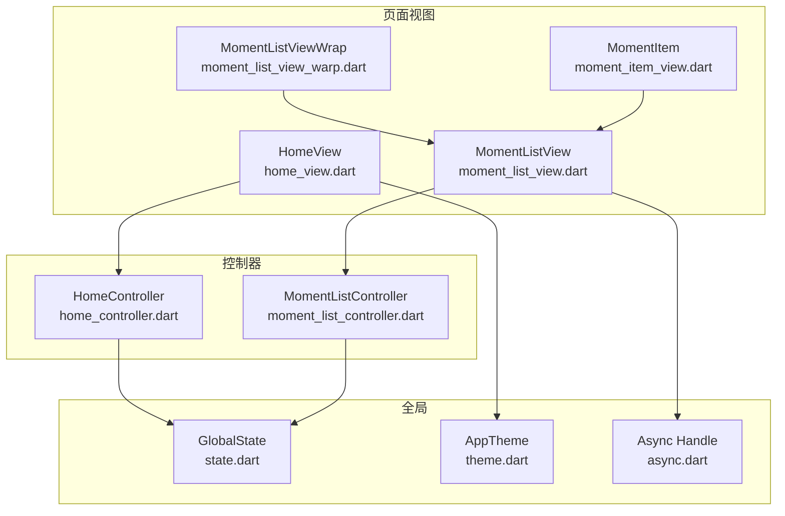
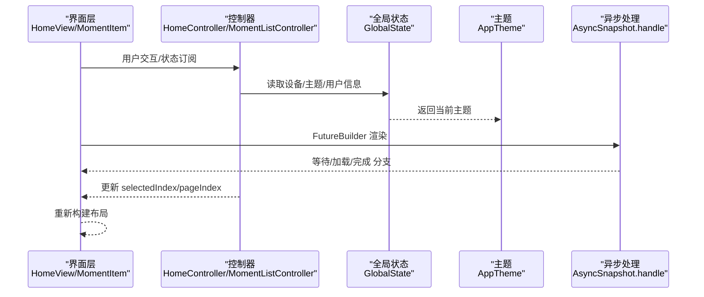
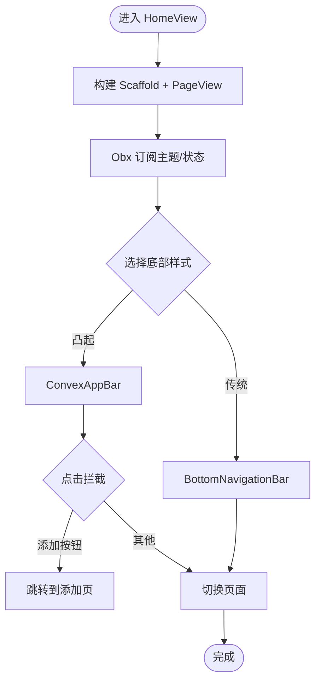
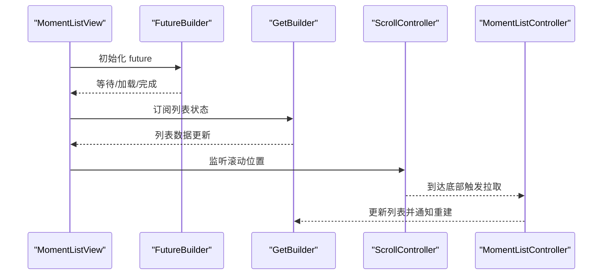
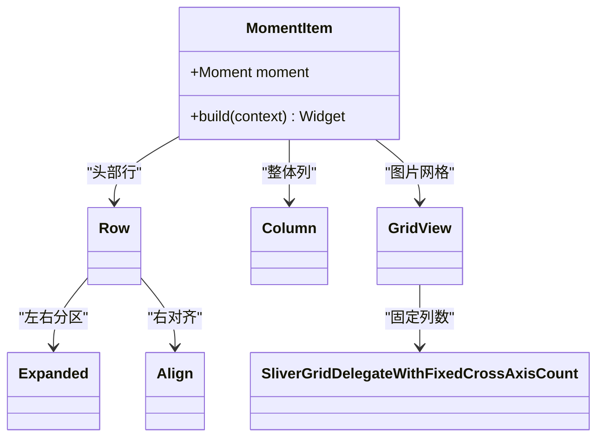
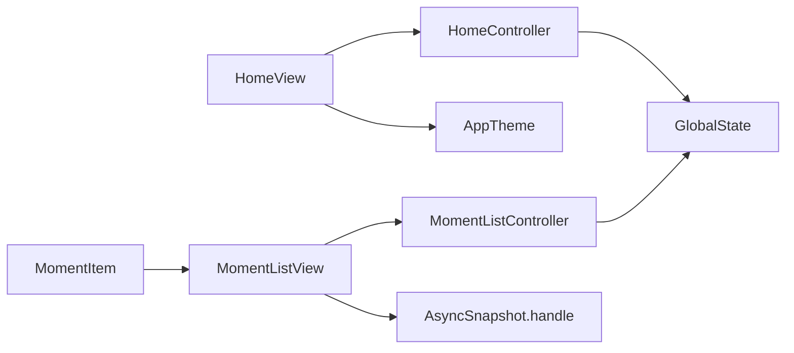

# 响应式布局与适配

<cite>
**本文引用的文件**
- [home_view.dart](file://client/app/lib/pages/home/home_view.dart)
- [home_controller.dart](file://client/app/lib/pages/home/home_controller.dart)
- [moment_list_view.dart](file://client/app/lib/pages/moment/list/moment_list_view.dart)
- [moment_list_view_warp.dart](file://client/app/lib/pages/moment/list/moment_list_view_warp.dart)
- [moment_item_view.dart](file://client/app/lib/pages/moment/item/moment_item_view.dart)
- [moment_list_controller.dart](file://client/app/lib/pages/moment/list/moment_list_controller.dart)
- [theme.dart](file://client/app/lib/global/theme.dart)
- [state.dart](file://client/app/lib/global/state.dart)
- [async.dart](file://thirdparty/applib/lib/util/async.dart)
</cite>

## 目录
1. [简介](#简介)
2. [项目结构](#项目结构)
3. [核心组件](#核心组件)
4. [架构总览](#架构总览)
5. [详细组件分析](#详细组件分析)
6. [依赖关系分析](#依赖关系分析)
7. [性能考量](#性能考量)
8. [故障排查指南](#故障排查指南)
9. [结论](#结论)
10. [附录](#附录)

## 简介
本技术文档围绕 Hoper Flutter 响应式布局系统展开，聚焦以下目标：
- 屏幕尺寸适配策略：断点设计、比例计算与设备兼容性处理
- 布局组件使用：Row、Column、Flexible、Expanded 的灵活运用
- 不同屏幕密度与方向下的布局调整机制
- 响应式设计最佳实践：最小宽度约束、最大宽度限制、弹性布局策略
- 具体布局示例：流畅屏幕适配、横竖屏切换处理、多设备体验优化
- 性能优化与内存管理策略

## 项目结构
本项目采用模块化的 Flutter 结构，响应式布局主要体现在页面视图、控制器与全局状态之间通过 GetX 实现的响应式更新。关键布局相关文件分布如下：
- 页面视图层：home_view.dart、moment_list_view.dart、moment_item_view.dart
- 控制器层：home_controller.dart、moment_list_controller.dart
- 全局状态与主题：state.dart、theme.dart
- 异步状态处理扩展：async.dart
- 包装与缓存：moment_list_view_warp.dart（自动保持状态）

**图表来源**
- [home_view.dart:65-117](file://client/app/lib/pages/home/home_view.dart#L65-L117)
- [moment_list_view.dart:10-51](file://client/app/lib/pages/moment/list/moment_list_view.dart#L10-L51)
- [moment_item_view.dart:34-108](file://client/app/lib/pages/moment/item/moment_item_view.dart#L34-L108)
- [moment_list_view_warp.dart:5-27](file://client/app/lib/pages/moment/list/moment_list_view_warp.dart#L5-L27)
- [home_controller.dart:9-70](file://client/app/lib/pages/home/home_controller.dart#L9-L70)
- [moment_list_controller.dart:10-69](file://client/app/lib/pages/moment/list/moment_list_controller.dart#L10-L69)
- [state.dart:19-200](file://client/app/lib/global/state.dart#L19-L200)
- [theme.dart:8-72](file://client/app/lib/global/theme.dart#L8-L72)
- [async.dart:4-18](file://thirdparty/applib/lib/util/async.dart#L4-L18)

**章节来源**
- [home_view.dart:65-117](file://client/app/lib/pages/home/home_view.dart#L65-L117)
- [moment_list_view.dart:10-51](file://client/app/lib/pages/moment/list/moment_list_view.dart#L10-L51)
- [moment_item_view.dart:34-108](file://client/app/lib/pages/moment/item/moment_item_view.dart#L34-L108)
- [moment_list_view_warp.dart:5-27](file://client/app/lib/pages/moment/list/moment_list_view_warp.dart#L5-L27)
- [home_controller.dart:9-70](file://client/app/lib/pages/home/home_controller.dart#L9-L70)
- [moment_list_controller.dart:10-69](file://client/app/lib/pages/moment/list/moment_list_controller.dart#L10-L69)
- [state.dart:19-200](file://client/app/lib/global/state.dart#L19-L200)
- [theme.dart:8-72](file://client/app/lib/global/theme.dart#L8-L72)
- [async.dart:4-18](file://thirdparty/applib/lib/util/async.dart#L4-L18)

## 核心组件
- 视图与容器
  - HomeView：以 Scaffold + PageView + 自定义底部导航实现多页切换与响应式底部栏
  - MomentListView：基于 FutureBuilder + GetBuilder 的组合，实现加载态与刷新交互
  - MomentItem：内含 Row/Column/Expanded/Grid 组合，展示用户信息、内容与图片网格
  - MomentListViewWrap：通过 AutomaticKeepAliveClientMixin 保持状态，减少重建开销
- 控制器与状态
  - HomeController：管理底部索引、页面索引与持续滚动逻辑
  - MomentListController：封装列表状态、分页请求与增量拉取
  - GlobalState：统一设备信息与主题观察，驱动 UI 响应式更新
- 主题与密度
  - AppTheme：Light/Dark 主题，平台字体适配
  - theme.dart：视觉密度自适应平台密度

**章节来源**
- [home_view.dart:65-117](file://client/app/lib/pages/home/home_view.dart#L65-L117)
- [moment_list_view.dart:10-51](file://client/app/lib/pages/moment/list/moment_list_view.dart#L10-L51)
- [moment_item_view.dart:34-108](file://client/app/lib/pages/moment/item/moment_item_view.dart#L34-L108)
- [moment_list_view_warp.dart:13-27](file://client/app/lib/pages/moment/list/moment_list_view_warp.dart#L13-L27)
- [home_controller.dart:9-70](file://client/app/lib/pages/home/home_controller.dart#L9-L70)
- [moment_list_controller.dart:10-69](file://client/app/lib/pages/moment/list/moment_list_controller.dart#L10-L69)
- [state.dart:19-200](file://client/app/lib/global/state.dart#L19-L200)
- [theme.dart:8-72](file://client/app/lib/global/theme.dart#L8-L72)

## 架构总览
下图展示了从视图到控制器再到全局状态的整体调用链路，以及异步状态处理对布局渲染的影响。

**图表来源**
- [home_view.dart:65-117](file://client/app/lib/pages/home/home_view.dart#L65-L117)
- [moment_list_view.dart:25-51](file://client/app/lib/pages/moment/list/moment_list_view.dart#L25-L51)
- [moment_item_view.dart:34-108](file://client/app/lib/pages/moment/item/moment_item_view.dart#L34-L108)
- [home_controller.dart:27-50](file://client/app/lib/pages/home/home_controller.dart#L27-L50)
- [moment_list_controller.dart:13-28](file://client/app/lib/pages/moment/list/moment_list_controller.dart#L13-L28)
- [state.dart:19-200](file://client/app/lib/global/state.dart#L19-L200)
- [theme.dart:69-72](file://client/app/lib/global/theme.dart#L69-L72)
- [async.dart:4-18](file://thirdparty/applib/lib/util/async.dart#L4-L18)

## 详细组件分析

### HomeView 布局与响应式导航
- 使用 Scaffold + PageView 实现多页面切换，禁用默认滚动以配合自定义导航
- 底部导航采用两种风格：传统 BottomNavigationBar 与 ConvexAppBar，后者支持点击拦截与自定义样式
- Obx 订阅主题与状态变化，实现暗黑模式与颜色随主题切换

**图表来源**
- [home_view.dart:65-117](file://client/app/lib/pages/home/home_view.dart#L65-L117)

**章节来源**
- [home_view.dart:65-117](file://client/app/lib/pages/home/home_view.dart#L65-L117)

### MomentListView 列表布局与异步渲染
- FutureBuilder 驱动初始加载，GetBuilder 负责后续状态更新
- RefreshIndicator 支持下拉刷新；ListView.separated 提供分割线
- 通过 ScrollController 监听到达边缘事件，触发分页拉取

**图表来源**
- [moment_list_view.dart:10-51](file://client/app/lib/pages/moment/list/moment_list_view.dart#L10-L51)
- [moment_list_controller.dart:13-28](file://client/app/lib/pages/moment/list/moment_list_controller.dart#L13-L28)

**章节来源**
- [moment_list_view.dart:10-51](file://client/app/lib/pages/moment/list/moment_list_view.dart#L10-L51)
- [moment_list_controller.dart:10-69](file://client/app/lib/pages/moment/list/moment_list_controller.dart#L10-L69)

### MomentItem 卡片布局与弹性组件
- 头部行：左侧头像与用户信息，右侧关注按钮
- 内容区域：Markdown 文本
- 图片网格：GridView.builder + SliverGridDelegateWithFixedCrossAxisCount，固定列数与子项比例
- 使用 Expanded/Align/Padding 等实现弹性与对齐

**图表来源**
- [moment_item_view.dart:34-108](file://client/app/lib/pages/moment/item/moment_item_view.dart#L34-L108)

**章节来源**
- [moment_item_view.dart:34-108](file://client/app/lib/pages/moment/item/moment_item_view.dart#L34-L108)

### MomentListViewWrap 状态保持与性能
- 通过 AutomaticKeepAliveClientMixin 保持页面状态，避免重建带来的布局抖动
- 在 dispose 中释放资源，确保内存安全

**章节来源**
- [moment_list_view_warp.dart:13-27](file://client/app/lib/pages/moment/list/moment_list_view_warp.dart#L13-L27)

### 主题与密度适配
- AppTheme 提供 Light/Dark 两套主题，支持 Material3 与平台字体
- theme.dart 使用 Adaptive Density，使桌面平台控件更紧凑
- GlobalState 提供设备信息读取，便于按平台定制布局

**章节来源**
- [theme.dart:8-72](file://client/app/lib/global/theme.dart#L8-L72)
- [state.dart:34-69](file://client/app/lib/global/state.dart#L34-L69)

## 依赖关系分析
- 视图依赖控制器与全局状态，控制器依赖服务与模型
- MomentItem 依赖 Moment 数据模型与图片加载库
- 异步状态处理扩展 AsyncSnapshot.handle 统一等待/加载/完成分支

**图表来源**
- [home_view.dart:65-117](file://client/app/lib/pages/home/home_view.dart#L65-L117)
- [moment_list_view.dart:25-51](file://client/app/lib/pages/moment/list/moment_list_view.dart#L25-L51)
- [moment_item_view.dart:34-108](file://client/app/lib/pages/moment/item/moment_item_view.dart#L34-L108)
- [moment_list_controller.dart:10-69](file://client/app/lib/pages/moment/list/moment_list_controller.dart#L10-L69)
- [home_controller.dart:9-70](file://client/app/lib/pages/home/home_controller.dart#L9-L70)
- [state.dart:19-200](file://client/app/lib/global/state.dart#L19-L200)
- [theme.dart:69-72](file://client/app/lib/global/theme.dart#L69-L72)
- [async.dart:4-18](file://thirdparty/applib/lib/util/async.dart#L4-L18)

**章节来源**
- [home_view.dart:65-117](file://client/app/lib/pages/home/home_view.dart#L65-L117)
- [moment_list_view.dart:25-51](file://client/app/lib/pages/moment/list/moment_list_view.dart#L25-L51)
- [moment_item_view.dart:34-108](file://client/app/lib/pages/moment/item/moment_item_view.dart#L34-L108)
- [moment_list_controller.dart:10-69](file://client/app/lib/pages/moment/list/moment_list_controller.dart#L10-L69)
- [home_controller.dart:9-70](file://client/app/lib/pages/home/home_controller.dart#L9-L70)
- [state.dart:19-200](file://client/app/lib/global/state.dart#L19-L200)
- [theme.dart:69-72](file://client/app/lib/global/theme.dart#L69-L72)
- [async.dart:4-18](file://thirdparty/applib/lib/util/async.dart#L4-L18)

## 性能考量
- 减少重建
  - 使用 GetBuilder 精准更新列表片段，避免整树重建
  - MomentListViewWrap 保持页面状态，降低复杂布局重建成本
- 异步渲染
  - AsyncSnapshot.handle 统一等待态，避免空布局或闪烁
- 滚动优化
  - ListView.separated + Physics 控制滚动体验
  - 边缘监听触发分页，避免一次性加载过多数据
- 主题与密度
  - Adaptive Density 与平台字体适配，减少额外计算
- 内存管理
  - 在 Wrap 的 dispose 中释放资源，防止泄漏

**章节来源**
- [moment_list_view_warp.dart:13-27](file://client/app/lib/pages/moment/list/moment_list_view_warp.dart#L13-L27)
- [moment_list_view.dart:25-51](file://client/app/lib/pages/moment/list/moment_list_view.dart#L25-L51)
- [async.dart:4-18](file://thirdparty/applib/lib/util/async.dart#L4-L18)
- [theme.dart:20-24](file://client/app/lib/global/theme.dart#L20-L24)

## 故障排查指南
- 列表不刷新
  - 检查 GetBuilder 的 id 与 update 调用是否匹配
  - 确认控制器 update 是否传入正确的 tag 或 id
- 滚动无分页
  - 确认 ScrollController 的监听是否生效
  - 检查到达边缘判断与分页请求逻辑
- 布局错位
  - 检查 Expanded/Align 的使用是否合理
  - 确认 GridView 的 childAspectRatio 与容器约束
- 主题不生效
  - 确认 Obx 订阅的主题变量是否正确
  - 检查 AppTheme 的 Light/Dark 切换逻辑

**章节来源**
- [moment_list_view.dart:17-23](file://client/app/lib/pages/moment/list/moment_list_view.dart#L17-L23)
- [moment_list_controller.dart:20-28](file://client/app/lib/pages/moment/list/moment_list_controller.dart#L20-L28)
- [moment_item_view.dart:34-108](file://client/app/lib/pages/moment/item/moment_item_view.dart#L34-L108)
- [home_view.dart:81-117](file://client/app/lib/pages/home/home_view.dart#L81-L117)

## 结论
本项目通过 GetX 的响应式机制与 Flutter 原生布局组件，实现了跨设备、跨平台的响应式布局体系。结合异步状态处理、状态保持与主题密度适配，能够在不同屏幕尺寸、方向与密度下提供一致且流畅的用户体验。建议在实际开发中遵循最小/最大宽度约束、弹性布局策略与渐进增强原则，持续优化性能与内存占用。

## 附录
- 断点与比例建议
  - 基于屏幕宽度划分断点，如 480、768、1024 等，配合 Expanded/Flex 实现弹性分配
  - 图片网格使用固定列数与子项比例，保证在不同宽度下保持良好视觉节奏
- 横竖屏切换
  - 使用 OrientationBuilder 或 MediaQuery 查询方向，动态调整布局主轴与交叉轴
  - 对于底部导航，可参考 LandscapeLayout 的线性布局策略
- 最佳实践清单
  - 使用 GetBuilder 精准更新，避免不必要的重建
  - 合理使用 AutomaticKeepAliveClientMixin 保持关键页面状态
  - 通过 AsyncSnapshot.handle 统一加载态，提升交互一致性
  - 依据平台特性启用 Adaptive Density 与字体适配