# 自定义UI组件

<cite>
**本文引用的文件**
- [client/app/pubspec.yaml](file://client/app/pubspec.yaml)
- [client/app/lib/components/bottom/bottom.dart](file://client/app/lib/components/bottom/bottom.dart)
- [client/app/lib/components/sample.dart](file://client/app/lib/components/sample.dart)
- [client/app/lib/components/emoji.dart](file://client/app/lib/components/emoji.dart)
- [client/app/lib/components/signature.dart](file://client/app/lib/components/signature.dart)
- [client/app/lib/components/hero.dart](file://client/app/lib/components/hero.dart)
- [client/app/lib/components/media/media.dart](file://client/app/lib/components/media/media.dart)
- [client/app/lib/components/media/flow.dart](file://client/app/lib/components/media/flow.dart)
- [client/app/lib/components/media/pick.dart](file://client/app/lib/components/media/pick.dart)
- [client/app/lib/components/json_viewer.dart](file://client/app/lib/components/json_viewer.dart)
- [client/app/lib/components/path_provide.dart](file://client/app/lib/components/path_provide.dart)
- [client/app/lib/components/weather/weather_bg.dart](file://client/app/lib/components/weather/weather_bg.dart)
- [client/app/lib/components/weather/weather_cloud_bg.dart](file://client/app/lib/components/weather/weather_cloud_bg.dart)
- [client/app/lib/components/weather/weather_type.dart](file://client/app/lib/components/weather/weather_type.dart)
- [client/app/lib/components/floating_action_button_location.dart](file://client/app/lib/components/floating_action_button_location.dart)
- [client/app/lib/components/snow.dart](file://client/app/lib/components/snow.dart)
</cite>

## 目录
1. [简介](#简介)
2. [项目结构](#项目结构)
3. [核心组件](#核心组件)
4. [架构总览](#架构总览)
5. [组件详解](#组件详解)
6. [依赖分析](#依赖分析)
7. [性能考量](#性能考量)
8. [故障排查指南](#故障排查指南)
9. [结论](#结论)
10. [附录](#附录)

## 简介
本技术文档聚焦于 Hoper Flutter 自定义 UI 组件的设计与实现，覆盖自定义按钮、输入框、媒体选择、JSON 查看器、签名板、天气背景、雪花动画等组件。文档从设计原则、属性与状态管理、事件处理、样式定制与响应式行为、最佳实践、无障碍支持到测试与调试策略进行全面阐述，帮助开发者快速理解并高效复用这些组件。

## 项目结构
客户端 Flutter 应用位于 client/app 下，自定义 UI 组件集中于 lib/components 目录，按功能域划分（如 weather、media、bottom 等），便于维护与扩展。pubspec.yaml 定义了依赖生态，包含媒体、图表、动画、国际化、滑动与手势等常用库。

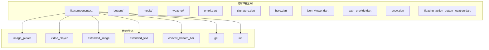

**图表来源**
- [client/app/pubspec.yaml:23-101](file://client/app/pubspec.yaml#L23-L101)

**章节来源**
- [client/app/pubspec.yaml:1-182](file://client/app/pubspec.yaml#L1-L182)

## 核心组件
- 自定义底部导航项封装：以工厂构造与导航项转换，统一图标与标签的生成，便于跨页面复用。
- 示例可复用视图：演示 StatefulWidget 生命周期、异步构建、自动保活与状态管理。
- Emoji 文本渲染：基于特殊文本扩展，将特定占位符替换为内嵌图片，兼顾 Web 平台差异。
- 签名板：自定义画笔与手势追踪，记录路径点并绘制连续线条。
- Hero 图片过渡：增强 Hero 动画的滑出体验，结合外部滑动页状态修正位移与缩放。
- 媒体控制器与选择器：封装图片/视频选择、播放与资源释放；提供流式布局委托。
- JSON 查看器：递归渲染 JSON 结构，支持折叠/展开、层级控制与节点自定义。
- 路径提供器：展示应用各类型目录路径，适配多平台差异。
- 天气背景：组合云层、渐变、雨雪、雷电、夜空等元素，支持动态切换与淡入淡出。
- 雪花动画：基于 AnimationController 的粒子系统，实现自然飘落与边界回弹。
- 自定义浮动按钮位置：在默认位置基础上增加偏移，满足复杂布局需求。

**章节来源**
- [client/app/lib/components/bottom/bottom.dart:7-35](file://client/app/lib/components/bottom/bottom.dart#L7-L35)
- [client/app/lib/components/sample.dart:8-82](file://client/app/lib/components/sample.dart#L8-L82)
- [client/app/lib/components/emoji.dart:5-53](file://client/app/lib/components/emoji.dart#L5-L53)
- [client/app/lib/components/signature.dart:21-47](file://client/app/lib/components/signature.dart#L21-L47)
- [client/app/lib/components/hero.dart:5-97](file://client/app/lib/components/hero.dart#L5-L97)
- [client/app/lib/components/media/media.dart:10-83](file://client/app/lib/components/media/media.dart#L10-L83)
- [client/app/lib/components/media/flow.dart:3-41](file://client/app/lib/components/media/flow.dart#L3-L41)
- [client/app/lib/components/media/pick.dart:9-444](file://client/app/lib/components/media/pick.dart#L9-L444)
- [client/app/lib/components/json_viewer.dart:9-328](file://client/app/lib/components/json_viewer.dart#L9-L328)
- [client/app/lib/components/path_provide.dart:7-209](file://client/app/lib/components/path_provide.dart#L7-L209)
- [client/app/lib/components/weather/weather_bg.dart:12-164](file://client/app/lib/components/weather/weather_bg.dart#L12-L164)
- [client/app/lib/components/weather/weather_cloud_bg.dart:10-585](file://client/app/lib/components/weather/weather_cloud_bg.dart#L10-L585)
- [client/app/lib/components/weather/weather_type.dart:4-128](file://client/app/lib/components/weather/weather_type.dart#L4-L128)
- [client/app/lib/components/floating_action_button_location.dart:3-14](file://client/app/lib/components/floating_action_button_location.dart#L3-L14)
- [client/app/lib/components/snow.dart:9-194](file://client/app/lib/components/snow.dart#L9-L194)

## 架构总览
自定义组件遵循 Flutter 组件化思想，围绕以下关键点组织：
- 属性驱动：通过构造参数与可选回调定义组件能力边界。
- 状态管理：区分局部状态（StatefulWidget）与全局状态（如媒体控制器 mixin）。
- 事件处理：手势、点击、拖拽、播放控制等事件通过回调或控制器暴露。
- 样式与主题：通过主题色、字体、间距与自定义 Painter 实现视觉一致性。
- 响应式与平台差异：针对 Web、iOS、Android 的特性差异进行条件分支与降级处理。
- 无障碍：为关键区域添加语义标注，提升可访问性。

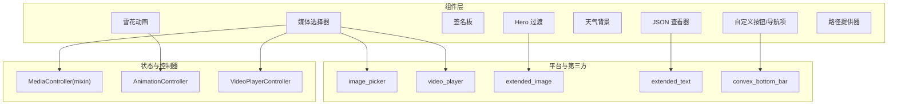

**图表来源**
- [client/app/lib/components/media/media.dart:10-83](file://client/app/lib/components/media/media.dart#L10-L83)
- [client/app/lib/components/media/pick.dart:9-444](file://client/app/lib/components/media/pick.dart#L9-L444)
- [client/app/lib/components/snow.dart:20-98](file://client/app/lib/components/snow.dart#L20-L98)
- [client/app/lib/components/hero.dart:5-97](file://client/app/lib/components/hero.dart#L5-L97)
- [client/app/lib/components/json_viewer.dart:9-328](file://client/app/lib/components/json_viewer.dart#L9-L328)
- [client/app/lib/components/bottom/bottom.dart:7-35](file://client/app/lib/components/bottom/bottom.dart#L7-L35)

## 组件详解

### 自定义底部导航项（Bottom）
- 设计原则：以工厂构造统一图标与标签，提供导航项与凸形标签项两种输出，便于在不同导航容器间切换。
- 属性设计：widget、label、pageIndex、onTap；icon 工厂方法简化图标传参。
- 状态管理：无内部状态，纯属性封装。
- 事件处理：onTap 回调交由上层处理。
- 样式定制：通过传入的 Widget 控制图标样式；label 控制文本与可访问性标签。
- 最佳实践：在路由切换时保持标签与图标的语义一致；避免重复创建实例，复用工厂方法。

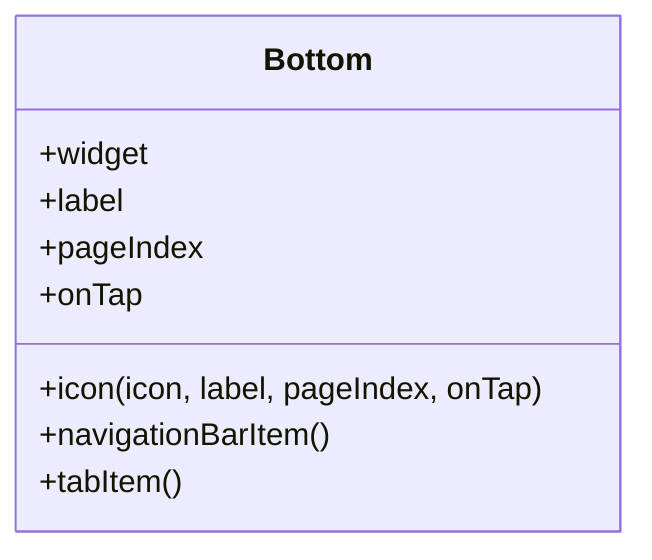

**图表来源**
- [client/app/lib/components/bottom/bottom.dart:7-35](file://client/app/lib/components/bottom/bottom.dart#L7-L35)

**章节来源**
- [client/app/lib/components/bottom/bottom.dart:7-35](file://client/app/lib/components/bottom/bottom.dart#L7-L35)

### 示例可复用视图（SampleView）
- 设计原则：演示 StatefulWidget 生命周期与异步构建，结合自动保活与状态重置。
- 属性设计：tag 字段用于标识实例。
- 状态管理：内部计数 times，配合 FutureBuilder 异步更新 UI。
- 事件处理：addTimes 通过 setState 触发重建。
- 样式与响应式：使用 Center 居中展示；可扩展为卡片、列表等布局。
- 最佳实践：在 didUpdateWidget 中重置内部状态；在 dispose 中释放资源；结合 AutomaticKeepAliveClientMixin 提升切换性能。

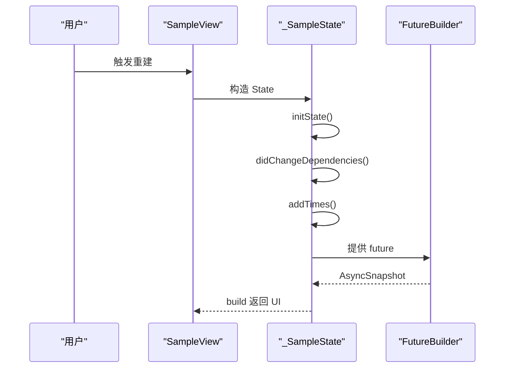

**图表来源**
- [client/app/lib/components/sample.dart:8-82](file://client/app/lib/components/sample.dart#L8-L82)

**章节来源**
- [client/app/lib/components/sample.dart:8-82](file://client/app/lib/components/sample.dart#L8-L82)

### Emoji 文本渲染（EmojiText）
- 设计原则：基于特殊文本扩展，将特定占位符替换为内嵌图片，兼容 Web 平台差异。
- 属性设计：textStyle、start；通过静态标志位匹配占位符。
- 状态管理：无内部状态，依赖工具类映射表。
- 事件处理：不直接处理事件，作为文本 Span 插入。
- 样式定制：图片尺寸、对齐与边距可配置；颜色与透明度可通过父级 TextStyle 影响。
- 最佳实践：确保资源路径正确；在 Web 平台避免使用 WidgetSpan；合理设置图片宽高比。

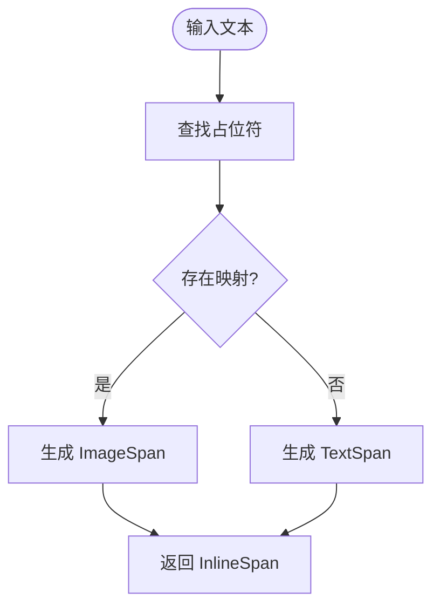

**图表来源**
- [client/app/lib/components/emoji.dart:5-37](file://client/app/lib/components/emoji.dart#L5-L37)

**章节来源**
- [client/app/lib/components/emoji.dart:5-53](file://client/app/lib/components/emoji.dart#L5-L53)

### 签名板（Signature）
- 设计原则：自定义画笔记录路径点，通过手势追踪绘制连续线条。
- 属性设计：无公开属性，内部维护点列表。
- 状态管理：SignatureState 内部保存路径点数组。
- 事件处理：onPanUpdate 追加点；onPanEnd 添加分隔标记。
- 样式定制：画笔颜色、线帽与宽度可配置；支持全屏绘制区域。
- 最佳实践：在 onPanEnd 添加 null 分隔，避免连接错误；必要时提供清空与保存接口。

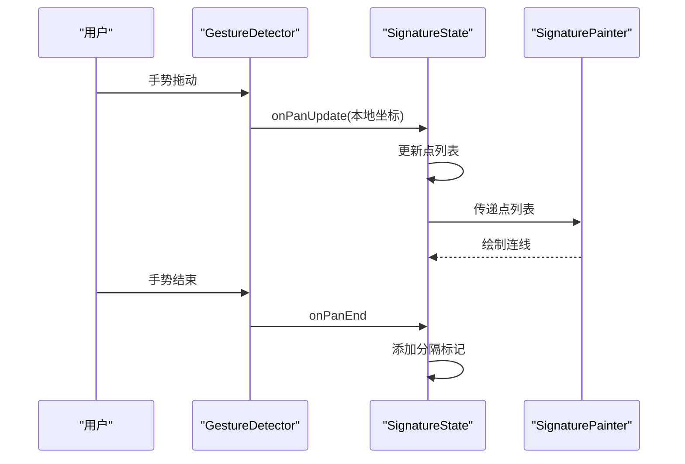

**图表来源**
- [client/app/lib/components/signature.dart:21-47](file://client/app/lib/components/signature.dart#L21-L47)

**章节来源**
- [client/app/lib/components/signature.dart:21-47](file://client/app/lib/components/signature.dart#L21-L47)

### Hero 图片过渡（HeroImage）
- 设计原则：增强 Hero 动画的滑出体验，结合外部滑动页状态修正位移与缩放。
- 属性设计：child、tag、slidePageKey、slideType。
- 状态管理：无内部状态，依赖外部状态与动画。
- 事件处理：通过飞行舱构建器与矩形补间实现平滑过渡。
- 样式定制：可按需调整透明度与变换层级。
- 最佳实践：确保 tag 唯一；在 pop 时根据 slideType 修复 transform；日志辅助定位问题。

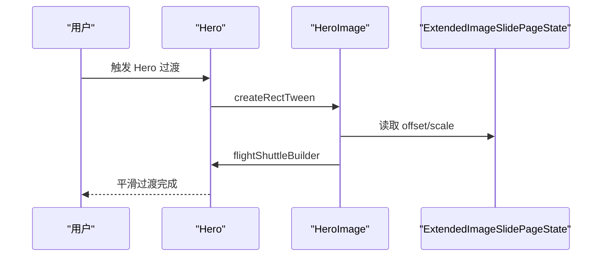

**图表来源**
- [client/app/lib/components/hero.dart:5-97](file://client/app/lib/components/hero.dart#L5-L97)

**章节来源**
- [client/app/lib/components/hero.dart:5-97](file://client/app/lib/components/hero.dart#L5-L97)

### 媒体选择与播放（MediaPick、MediaController、ImageFlowDelegate）
- 设计原则：封装图片/视频选择、播放与资源释放；提供流式布局委托。
- 属性设计：MediaPick 标题；MediaController 维护图片列表、URL 列表、错误信息与视频控制器；FlowDelegate 控制子项布局。
- 状态管理：MediaPick 内部维护文件列表、错误与控制器；MediaController 作为 mixin 提供复用能力。
- 事件处理：按钮点击触发选择；对话框收集压缩参数；播放器初始化与循环播放。
- 样式定制：列表预览、网络/文件差异化加载；流式布局可配置边距。
- 最佳实践：在 deactivate/dispose 中暂停/释放播放器；Web 平台自动静音以支持自动播放；提供丢失数据恢复入口。

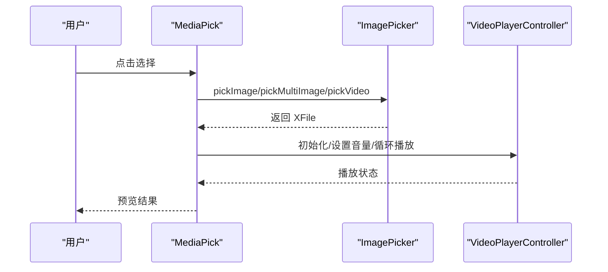

**图表来源**
- [client/app/lib/components/media/pick.dart:61-108](file://client/app/lib/components/media/pick.dart#L61-L108)
- [client/app/lib/components/media/media.dart:22-80](file://client/app/lib/components/media/media.dart#L22-L80)
- [client/app/lib/components/media/flow.dart:3-41](file://client/app/lib/components/media/flow.dart#L3-L41)

**章节来源**
- [client/app/lib/components/media/pick.dart:9-444](file://client/app/lib/components/media/pick.dart#L9-L444)
- [client/app/lib/components/media/media.dart:10-83](file://client/app/lib/components/media/media.dart#L10-L83)
- [client/app/lib/components/media/flow.dart:3-41](file://client/app/lib/components/media/flow.dart#L3-L41)

### JSON 查看器（JsonViewerRoot/JsonViewerMapNode/JsonViewerListNode/JsonViewerNode）
- 设计原则：递归渲染 JSON 结构，支持折叠/展开、层级控制与节点自定义。
- 属性设计：根对象、展开层级、节点构建回调。
- 状态管理：各节点维护 isOpen 状态与子节点列表。
- 事件处理：点击切换展开状态；根据类型渲染不同颜色与图标。
- 样式定制：颜色、字体、间距与宽度可配置；支持自定义节点构建。
- 最佳实践：合理设置 expandDeep；为复杂节点提供自定义构建回调；注意 null/布尔/数值等类型着色。

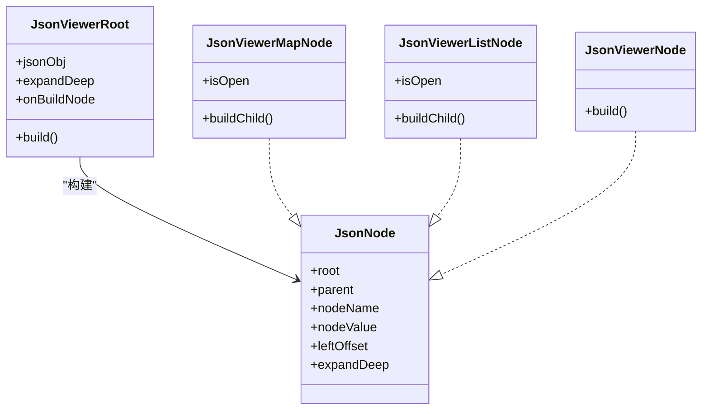

**图表来源**
- [client/app/lib/components/json_viewer.dart:9-328](file://client/app/lib/components/json_viewer.dart#L9-L328)

**章节来源**
- [client/app/lib/components/json_viewer.dart:9-328](file://client/app/lib/components/json_viewer.dart#L9-L328)

### 路径提供器（PathProvide）
- 设计原则：展示应用各类型目录路径，适配多平台差异。
- 属性设计：标题；内部维护各目录 Future。
- 状态管理：通过 FutureBuilder 异步展示结果。
- 事件处理：按钮点击触发目录查询。
- 样式定制：列表布局与提示文本。
- 最佳实践：在 iOS 上禁用外部存储相关按钮；统一错误与不可用状态提示。

**章节来源**
- [client/app/lib/components/path_provide.dart:7-209](file://client/app/lib/components/path_provide.dart#L7-L209)

### 天气背景（WeatherBg、WeatherCloudBg、WeatherType）
- 设计原则：组合云层、渐变、雨雪、雷电、夜空等元素，支持动态切换与淡入淡出。
- 属性设计：天气类型、宽高；云层根据类型选择绘制策略。
- 状态管理：WeatherBg 维护旧类型与交叉淡入状态。
- 事件处理：类型变更触发动画；尺寸通过 InheritedWidget 传递。
- 样式定制：颜色矩阵、缩放、位移与模糊滤镜。
- 最佳实践：在 didUpdateWidget 中识别类型变化；合理设置动画时长；按需裁剪与叠加。

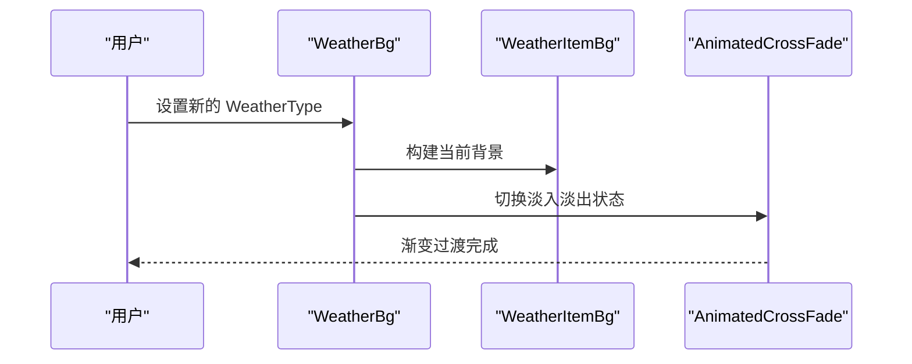

**图表来源**
- [client/app/lib/components/weather/weather_bg.dart:12-83](file://client/app/lib/components/weather/weather_bg.dart#L12-L83)
- [client/app/lib/components/weather/weather_cloud_bg.dart:10-59](file://client/app/lib/components/weather/weather_cloud_bg.dart#L10-L59)
- [client/app/lib/components/weather/weather_type.dart:4-20](file://client/app/lib/components/weather/weather_type.dart#L4-L20)

**章节来源**
- [client/app/lib/components/weather/weather_bg.dart:12-164](file://client/app/lib/components/weather/weather_bg.dart#L12-L164)
- [client/app/lib/components/weather/weather_cloud_bg.dart:10-585](file://client/app/lib/components/weather/weather_cloud_bg.dart#L10-L585)
- [client/app/lib/components/weather/weather_type.dart:4-128](file://client/app/lib/components/weather/weather_type.dart#L4-L128)

### 雪花动画（SnowWidget）
- 设计原则：基于 AnimationController 的粒子系统，实现自然飘落与边界回弹。
- 属性设计：雪花数量、速度、运行状态。
- 状态管理：AnimationController 控制时间轴；粒子列表随时间更新。
- 事件处理：控制器启动/停止；布局变化时重算屏幕尺寸。
- 样式定制：画笔填充白色圆形；半径与密度影响运动轨迹。
- 最佳实践：在 isRunning 变更时同步控制器；使用 CustomPaint 的 willChange 提示性能；提供语义标注。

**章节来源**
- [client/app/lib/components/snow.dart:9-194](file://client/app/lib/components/snow.dart#L9-L194)

### 自定义浮动按钮位置（CustomFloatingActionButtonLocation）
- 设计原则：在默认位置基础上增加偏移，满足复杂布局需求。
- 属性设计：基础位置、X/Y 偏移量。
- 状态管理：无内部状态。
- 事件处理：覆写 getOffset 返回偏移后的坐标。
- 最佳实践：与 Scaffold 配合使用；避免偏移超出可视范围。

**章节来源**
- [client/app/lib/components/floating_action_button_location.dart:3-14](file://client/app/lib/components/floating_action_button_location.dart#L3-L14)

## 依赖分析
- 组件依赖第三方库：image_picker、video_player、extended_image、extended_text、convex_bottom_bar、get、intl 等。
- 组件耦合：媒体相关组件通过 mixin 共享控制器；天气组件通过枚举与工具类解耦类型与颜色；签名板与雪花动画独立且可复用。
- 外部集成点：平台差异处理（Web/Android/iOS）、权限请求、资源加载与缓存。

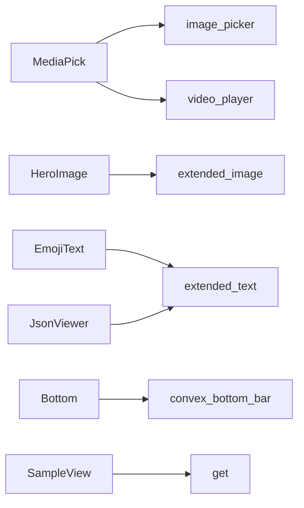

**图表来源**
- [client/app/lib/components/media/pick.dart:3-7](file://client/app/lib/components/media/pick.dart#L3-L7)
- [client/app/lib/components/hero.dart:1-3](file://client/app/lib/components/hero.dart#L1-L3)
- [client/app/lib/components/emoji.dart:1-2](file://client/app/lib/components/emoji.dart#L1-L2)
- [client/app/lib/components/bottom/bottom.dart:1-2](file://client/app/lib/components/bottom/bottom.dart#L1-L2)
- [client/app/lib/components/sample.dart:1-1](file://client/app/lib/components/sample.dart#L1-L1)
- [client/app/lib/components/json_viewer.dart:1-1](file://client/app/lib/components/json_viewer.dart#L1-L1)

**章节来源**
- [client/app/lib/components/media/pick.dart:3-7](file://client/app/lib/components/media/pick.dart#L3-L7)
- [client/app/lib/components/hero.dart:1-3](file://client/app/lib/components/hero.dart#L1-L3)
- [client/app/lib/components/emoji.dart:1-2](file://client/app/lib/components/emoji.dart#L1-L2)
- [client/app/lib/components/bottom/bottom.dart:1-2](file://client/app/lib/components/bottom/bottom.dart#L1-L2)
- [client/app/lib/components/sample.dart:1-1](file://client/app/lib/components/sample.dart#L1-L1)
- [client/app/lib/components/json_viewer.dart:1-1](file://client/app/lib/components/json_viewer.dart#L1-L1)

## 性能考量
- 复用与懒加载：媒体图片与视频控制器在使用前初始化，使用后及时释放；Web 平台自动静音以支持自动播放。
- 自定义绘制：签名板与雪花动画使用 CustomPainter；shouldRepaint/shouldRebuildSemantics 返回 false 以减少重绘与语义重建。
- 状态保活：SampleView 使用 AutomaticKeepAliveClientMixin 缓解频繁重建开销。
- 布局优化：ImageFlowDelegate 通过矩阵变换批量绘制子项，避免多余布局计算。
- 动画节流：WeatherBg 的交叉淡入淡出时长固定，避免频繁切换造成抖动。

[本节为通用指导，无需具体文件分析]

## 故障排查指南
- 媒体选择失败：检查权限与平台差异；捕获异常并显示错误信息；使用 retrieveLostData 恢复丢失数据。
- 视频无法自动播放（Web）：确认已设置静音；检查浏览器策略限制。
- Emoji 显示异常：确保资源路径正确；Web 平台避免使用 WidgetSpan。
- Hero 过渡异常：核对 tag 唯一性；在 pop 时根据 slideType 修复 transform。
- 自定义绘制不刷新：确认 shouldRepaint 返回值与数据变更；必要时使用 willChange 提示。
- 动画卡顿：降低粒子数量或帧率；合并动画控制器；避免在动画期间进行昂贵计算。

**章节来源**
- [client/app/lib/components/media/pick.dart:196-214](file://client/app/lib/components/media/pick.dart#L196-L214)
- [client/app/lib/components/emoji.dart:14-16](file://client/app/lib/components/emoji.dart#L14-L16)
- [client/app/lib/components/hero.dart:38-91](file://client/app/lib/components/hero.dart#L38-L91)
- [client/app/lib/components/signature.dart:18-20](file://client/app/lib/components/signature.dart#L18-L20)
- [client/app/lib/components/snow.dart:105-111](file://client/app/lib/components/snow.dart#L105-L111)

## 结论
Hoper Flutter 自定义 UI 组件体系以“属性驱动、状态清晰、事件可插拔”为核心理念，结合平台差异与第三方库能力，提供了从媒体处理、动画效果到数据可视化与过渡动画的完整解决方案。通过 mixin、自定义绘制与语义标注等手段，既保证了组件的可复用性，又兼顾了性能与可访问性。建议在实际项目中遵循本文的最佳实践与测试策略，持续演进组件能力。

[本节为总结性内容，无需具体文件分析]

## 附录
- 组件测试策略：为关键组件提供单元测试与 Widget 测试，覆盖状态变更、事件回调与平台差异；对自定义绘制组件进行像素级验证。
- 调试技巧：利用日志输出关键状态（如 WeatherBg 的类型切换、Hero 的矩形补间）；在 Web 平台启用开发者工具检查资源加载与播放状态。
- 可访问性：为重要区域添加语义标签（如 MediaPick 的图片列表、Sky 的太阳区域）；确保键盘与语音朗读可用。

[本节为通用指导，无需具体文件分析]