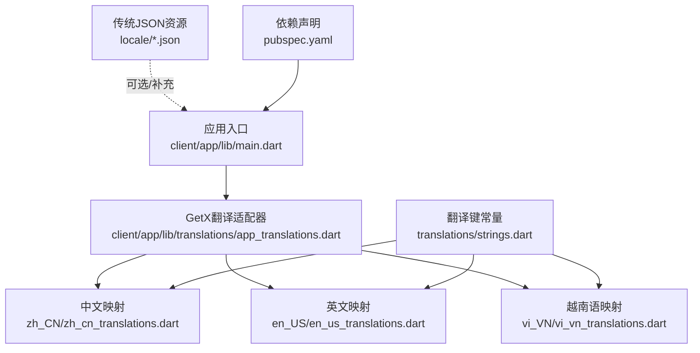
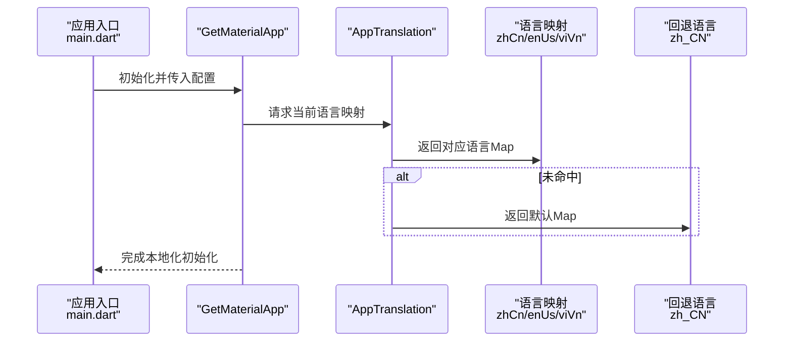
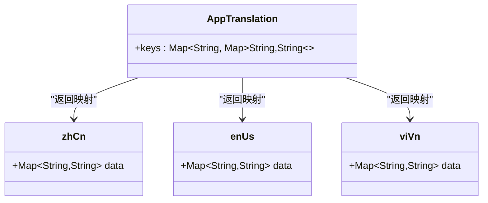
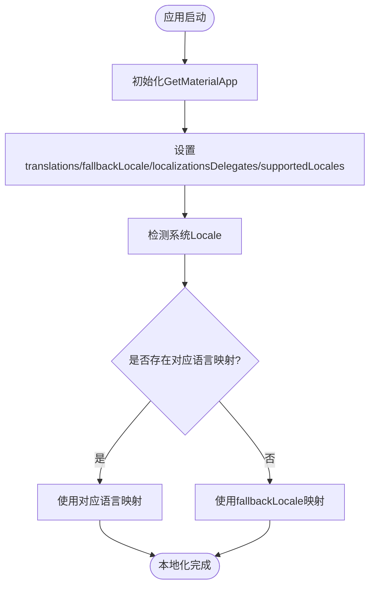
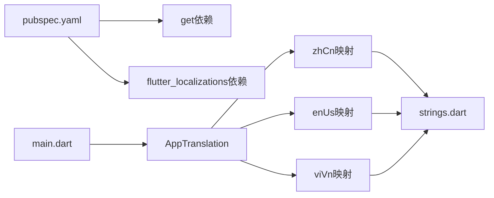

# 国际化与本地化

<cite>
**本文档引用的文件**
- [client/app/pubspec.yaml](file://client/app/pubspec.yaml)
- [client/app/lib/main.dart](file://client/app/lib/main.dart)
- [client/app/lib/translations/app_translations.dart](file://client/app/lib/translations/app_translations.dart)
- [client/app/lib/translations/strings.dart](file://client/app/lib/translations/strings.dart)
- [client/app/lib/translations/zh_CN/zh_cn_translations.dart](file://client/app/lib/translations/zh_CN/zh_cn_translations.dart)
- [client/app/lib/translations/en_US/en_us_translations.dart](file://client/app/lib/translations/en_US/en_us_translations.dart)
- [client/app/lib/translations/vi_VN/vi_vn_translations.dart](file://client/app/lib/translations/vi_VN/vi_vn_translations.dart)
- [locale/en.json](file://locale/en.json)
- [locale/zh-Hans.json](file://locale/zh-Hans.json)
</cite>

## 目录
1. [简介](#简介)
2. [项目结构](#项目结构)
3. [核心组件](#核心组件)
4. [架构总览](#架构总览)
5. [详细组件分析](#详细组件分析)
6. [依赖关系分析](#依赖关系分析)
7. [性能考量](#性能考量)
8. [故障排查指南](#故障排查指南)
9. [结论](#结论)
10. [附录](#附录)

## 简介
本文件面向Hoper Flutter应用的国际化与本地化体系，围绕GetX国际化插件的配置与使用进行系统性说明。内容涵盖多语言资源管理、语言切换机制、本地化格式化、翻译文件组织结构与命名规范、动态加载策略，以及日期时间、数字格式化与复数形式处理的实践建议。同时提供在UI中使用翻译键、新增语言支持、处理RTL语言的最佳实践与常见问题解决方案。

## 项目结构
Hoper Flutter国际化相关的核心位置如下：
- 应用入口与国际化配置：client/app/lib/main.dart
- GetX翻译适配器：client/app/lib/translations/app_translations.dart
- 翻译键常量：client/app/lib/translations/strings.dart
- 各语言翻译映射：client/app/lib/translations/zh_CN、client/app/lib/translations/en_US、client/app/lib/translations/vi_VN
- 传统JSON翻译资源：locale/en.json、locale/zh-Hans.json
- 依赖声明：client/app/pubspec.yaml

图表来源
- [client/app/lib/main.dart:29-65](file://client/app/lib/main.dart#L29-L65)
- [client/app/lib/translations/app_translations.dart:1-15](file://client/app/lib/translations/app_translations.dart#L1-L15)
- [client/app/lib/translations/zh_CN/zh_cn_translations.dart:1-7](file://client/app/lib/translations/zh_CN/zh_cn_translations.dart#L1-L7)
- [client/app/lib/translations/en_US/en_us_translations.dart:1-7](file://client/app/lib/translations/en_US/en_us_translations.dart#L1-L7)
- [client/app/lib/translations/vi_VN/vi_vn_translations.dart:1-6](file://client/app/lib/translations/vi_VN/vi_vn_translations.dart#L1-L6)
- [client/app/lib/translations/strings.dart:1-3](file://client/app/lib/translations/strings.dart#L1-L3)
- [client/app/pubspec.yaml:24-28](file://client/app/pubspec.yaml#L24-L28)

章节来源
- [client/app/lib/main.dart:17-69](file://client/app/lib/main.dart#L17-L69)
- [client/app/lib/translations/app_translations.dart:1-15](file://client/app/lib/translations/app_translations.dart#L1-L15)
- [client/app/lib/translations/strings.dart:1-3](file://client/app/lib/translations/strings.dart#L1-L3)
- [client/app/lib/translations/zh_CN/zh_cn_translations.dart:1-7](file://client/app/lib/translations/zh_CN/zh_cn_translations.dart#L1-L7)
- [client/app/lib/translations/en_US/en_us_translations.dart:1-7](file://client/app/lib/translations/en_US/en_us_translations.dart#L1-L7)
- [client/app/lib/translations/vi_VN/vi_vn_translations.dart:1-6](file://client/app/lib/translations/vi_VN/vi_vn_translations.dart#L1-L6)
- [client/app/pubspec.yaml:24-28](file://client/app/pubspec.yaml#L24-L28)

## 核心组件
- GetX翻译适配器：通过继承Translations，集中管理多语言映射字典，并以语言标签作为键。
- 翻译键常量：统一定义键名，避免硬编码，便于重构与IDE提示。
- 各语言映射：每个语言目录下维护独立Map，键来自strings.dart。
- 应用入口配置：设置GetMaterialApp的translations、fallbackLocale、localizationsDelegates与supportedLocales。
- 传统JSON资源：locale目录下的en.json、zh-Hans.json可作为备用或补充资源。

章节来源
- [client/app/lib/translations/app_translations.dart:7-14](file://client/app/lib/translations/app_translations.dart#L7-L14)
- [client/app/lib/translations/strings.dart:1-3](file://client/app/lib/translations/strings.dart#L1-L3)
- [client/app/lib/translations/zh_CN/zh_cn_translations.dart:3-6](file://client/app/lib/translations/zh_CN/zh_cn_translations.dart#L3-L6)
- [client/app/lib/translations/en_US/en_us_translations.dart:3-6](file://client/app/lib/translations/en_US/en_us_translations.dart#L3-L6)
- [client/app/lib/translations/vi_VN/vi_vn_translations.dart:3-6](file://client/app/lib/translations/vi_VN/vi_vn_translations.dart#L3-L6)
- [client/app/lib/main.dart:29-65](file://client/app/lib/main.dart#L29-L65)
- [locale/en.json:1-40](file://locale/en.json#L1-L40)
- [locale/zh-Hans.json:1-40](file://locale/zh-Hans.json#L1-L40)

## 架构总览
GetX国际化在Hoper中的工作流如下：
- 应用启动时，GetMaterialApp根据当前Locale从AppTranslation中查找对应语言映射。
- 若未匹配到语言，则回退到fallbackLocale。
- Flutter框架通过localizationsDelegates提供Material/Cupertino等本地化字符串。
- 支持的语言列表由supportedLocales决定。

图表来源
- [client/app/lib/main.dart:29-65](file://client/app/lib/main.dart#L29-L65)
- [client/app/lib/translations/app_translations.dart:7-14](file://client/app/lib/translations/app_translations.dart#L7-L14)
- [client/app/lib/translations/zh_CN/zh_cn_translations.dart:3-6](file://client/app/lib/translations/zh_CN/zh_cn_translations.dart#L3-L6)
- [client/app/lib/translations/en_US/en_us_translations.dart:3-6](file://client/app/lib/translations/en_US/en_us_translations.dart#L3-L6)
- [client/app/lib/translations/vi_VN/vi_vn_translations.dart:3-6](file://client/app/lib/translations/vi_VN/vi_vn_translations.dart#L3-L6)

## 详细组件分析

### 组件A：GetX翻译适配器（AppTranslation）
- 职责：集中管理多语言映射，提供keys访问接口。
- 设计要点：通过导入各语言映射文件，以语言标签为键返回Map；便于扩展新语言。
- 扩展建议：新增语言时仅需在keys中加入新键值对。

图表来源
- [client/app/lib/translations/app_translations.dart:7-14](file://client/app/lib/translations/app_translations.dart#L7-L14)
- [client/app/lib/translations/zh_CN/zh_cn_translations.dart:3-6](file://client/app/lib/translations/zh_CN/zh_cn_translations.dart#L3-L6)
- [client/app/lib/translations/en_US/en_us_translations.dart:3-6](file://client/app/lib/translations/en_US/en_us_translations.dart#L3-L6)
- [client/app/lib/translations/vi_VN/vi_vn_translations.dart:3-6](file://client/app/lib/translations/vi_VN/vi_vn_translations.dart#L3-L6)

章节来源
- [client/app/lib/translations/app_translations.dart:1-15](file://client/app/lib/translations/app_translations.dart#L1-L15)

### 组件B：翻译键常量（strings.dart）
- 职责：统一定义翻译键，避免硬编码，提升可维护性与重构安全性。
- 使用方式：在各语言映射中引用常量，确保键名一致性。

章节来源
- [client/app/lib/translations/strings.dart:1-3](file://client/app/lib/translations/strings.dart#L1-L3)

### 组件C：中文映射（zh_CN）
- 职责：提供中文语言的翻译键值对。
- 规范：键来自strings.dart，值为中文文案。

章节来源
- [client/app/lib/translations/zh_CN/zh_cn_translations.dart:1-7](file://client/app/lib/translations/zh_CN/zh_cn_translations.dart#L1-L7)

### 组件D：英文映射（en_US）
- 职责：提供英文语言的翻译键值对。
- 规范：键来自strings.dart，值为英文文案。

章节来源
- [client/app/lib/translations/en_US/en_us_translations.dart:1-7](file://client/app/lib/translations/en_US/en_us_translations.dart#L1-L7)

### 组件E：越南语映射（vi_VN）
- 职责：提供越南语语言的翻译键值对。
- 规范：键来自strings.dart，值为越南语文案。

章节来源
- [client/app/lib/translations/vi_VN/vi_vn_translations.dart:1-6](file://client/app/lib/translations/vi_VN/vi_vn_translations.dart#L1-L6)

### 组件F：应用入口国际化配置（main.dart）
- 职责：配置GetMaterialApp的translations、fallbackLocale、localizationsDelegates与supportedLocales。
- 机制：根据系统Locale自动选择语言；未命中时回退至fallbackLocale；通过localizationsDelegates提供Flutter内置本地化。

图表来源
- [client/app/lib/main.dart:29-65](file://client/app/lib/main.dart#L29-L65)
- [client/app/lib/translations/app_translations.dart:7-14](file://client/app/lib/translations/app_translations.dart#L7-L14)

章节来源
- [client/app/lib/main.dart:17-69](file://client/app/lib/main.dart#L17-L69)

### 组件G：传统JSON翻译资源（locale/*.json）
- 职责：提供基于JSON的翻译资源，可用于Web或其他场景的国际化。
- 结构：键为点号分隔的层级键，值为字符串模板，支持占位符替换。

章节来源
- [locale/en.json:1-40](file://locale/en.json#L1-L40)
- [locale/zh-Hans.json:1-40](file://locale/zh-Hans.json#L1-L40)

## 依赖关系分析
- GetX国际化依赖：pubspec.yaml中声明了get与flutter_localizations依赖，用于提供国际化能力。
- 应用入口依赖：main.dart依赖AppTranslation与各语言映射文件。
- 翻译键依赖：各语言映射依赖strings.dart中的键常量。

图表来源
- [client/app/pubspec.yaml:24-28](file://client/app/pubspec.yaml#L24-L28)
- [client/app/lib/main.dart:13-14](file://client/app/lib/main.dart#L13-L14)
- [client/app/lib/translations/app_translations.dart:1-5](file://client/app/lib/translations/app_translations.dart#L1-L5)
- [client/app/lib/translations/strings.dart:1-3](file://client/app/lib/translations/strings.dart#L1-L3)

章节来源
- [client/app/pubspec.yaml:24-28](file://client/app/pubspec.yaml#L24-L28)
- [client/app/lib/main.dart:13-14](file://client/app/lib/main.dart#L13-L14)
- [client/app/lib/translations/app_translations.dart:1-5](file://client/app/lib/translations/app_translations.dart#L1-L5)
- [client/app/lib/translations/strings.dart:1-3](file://client/app/lib/translations/strings.dart#L1-L3)

## 性能考量
- 语言映射加载：各语言映射为静态Map，在应用启动时一次性加载，无额外网络请求开销。
- 回退策略：fallbackLocale减少运行时查找失败的概率，降低异常分支成本。
- 本地化委托：通过localizationsDelegates引入Flutter内置本地化，避免重复实现。
- 建议：避免在热路径频繁切换Locale；如需动态切换，建议在合适时机触发重建。

## 故障排查指南
- 语言未生效
  - 检查supportedLocales是否包含目标Locale。
  - 确认AppTranslation.keys中存在对应语言键。
  - 验证fallbackLocale是否正确配置。
- 文案显示为键名而非翻译
  - 检查strings.dart中的键是否与映射文件一致。
  - 确认映射文件导入路径正确。
- 本地化委托缺失
  - 确保localizationsDelegates包含GlobalMaterialLocalizations、GlobalWidgetsLocalizations、GlobalCupertinoLocalizations等必要委托。
- JSON资源无法读取
  - 确认locale/*.json文件路径与读取逻辑一致；若使用GetX，请优先使用AppTranslation方案。

章节来源
- [client/app/lib/main.dart:54-64](file://client/app/lib/main.dart#L54-L64)
- [client/app/lib/translations/app_translations.dart:7-14](file://client/app/lib/translations/app_translations.dart#L7-L14)
- [client/app/lib/translations/strings.dart:1-3](file://client/app/lib/translations/strings.dart#L1-L3)

## 结论
Hoper Flutter国际化采用GetX与Flutter本地化委托相结合的方式，结构清晰、易于扩展。通过统一的翻译键常量与语言映射文件，实现了良好的可维护性与可扩展性。建议在后续迭代中持续完善多语言映射、补充更多语言支持，并结合业务需求引入日期时间、数字与复数形式的本地化格式化方案。

## 附录

### 在UI中使用翻译键
- 使用GetX的tr语法访问翻译键，键名来自strings.dart。
- 示例路径参考：
  - [client/app/lib/translations/strings.dart:1-3](file://client/app/lib/translations/strings.dart#L1-L3)
  - [client/app/lib/translations/zh_CN/zh_cn_translations.dart:3-6](file://client/app/lib/translations/zh_CN/zh_cn_translations.dart#L3-L6)
  - [client/app/lib/translations/en_US/en_us_translations.dart:3-6](file://client/app/lib/translations/en_US/en_us_translations.dart#L3-L6)
  - [client/app/lib/translations/vi_VN/vi_vn_translations.dart:3-6](file://client/app/lib/translations/vi_VN/vi_vn_translations.dart#L3-L6)

### 添加新的语言支持
- 步骤
  1) 在client/app/lib/translations/下创建新语言目录（如fr_FR），并在其中创建映射文件。
  2) 在映射文件中引用strings.dart中的键常量。
  3) 在AppTranslation.keys中加入新语言键值对。
  4) 在main.dart的supportedLocales中加入新Locale。
  5) 如需回退，更新fallbackLocale。
- 参考路径
  - [client/app/lib/translations/app_translations.dart:7-14](file://client/app/lib/translations/app_translations.dart#L7-L14)
  - [client/app/lib/main.dart:60-64](file://client/app/lib/main.dart#L60-L64)

### 处理RTL语言（如阿拉伯语、希伯来语）
- 在main.dart的MaterialApp或CupertinoApp中设置textDirection。
- 将localizationsDelegates中的GlobalCupertinoLocalizations.delegate替换为对应RTL委托（如Arabic或Hebrew本地化委托）。
- 在UI布局中使用Directionality组件包裹需要RTL适配的部分。
- 参考路径
  - [client/app/lib/main.dart:29-65](file://client/app/lib/main.dart#L29-L65)

### 本地化格式化（日期时间、数字、复数）
- 日期时间与数字格式化建议使用intl包提供的DateFormat与NumberFormat。
- 复数形式可通过条件判断或Intl.plural实现，键名可按规则扩展（如item_count_zero、item_count_one、item_count_other）。
- 参考依赖
  - [client/app/pubspec.yaml:76-76](file://client/app/pubspec.yaml#L76-L76)