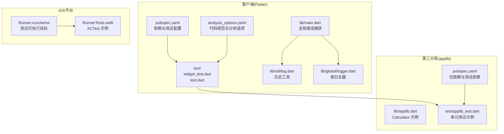
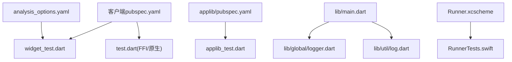
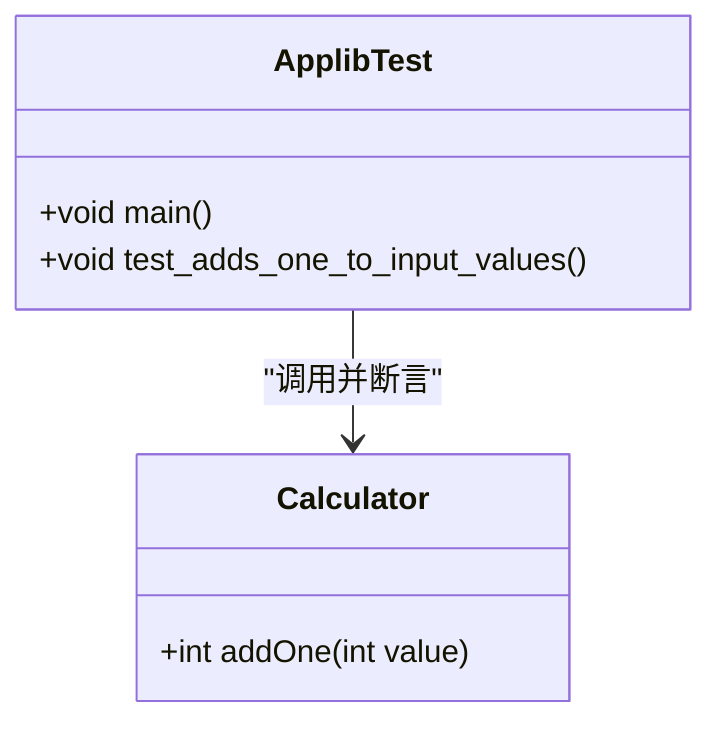
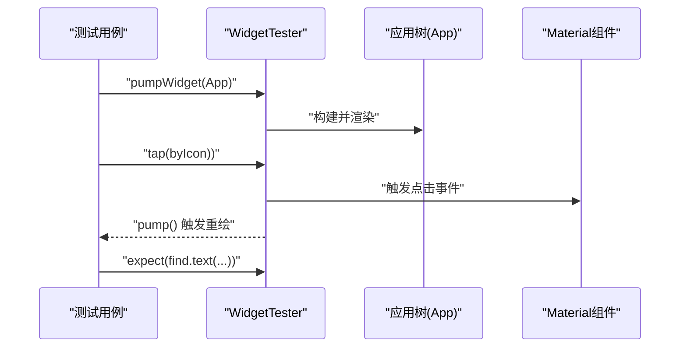
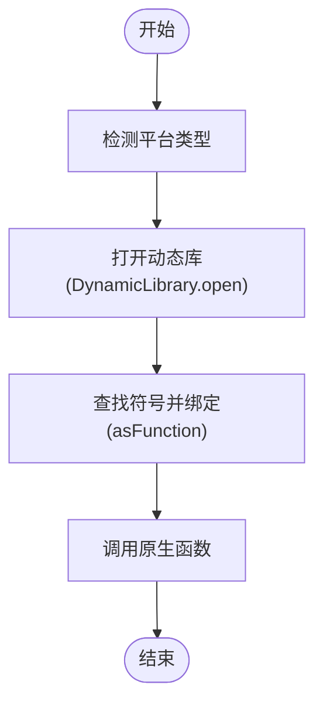
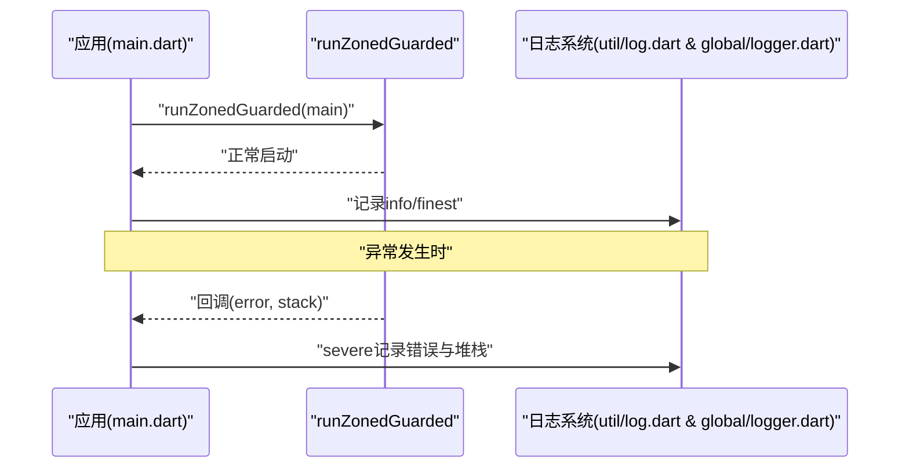
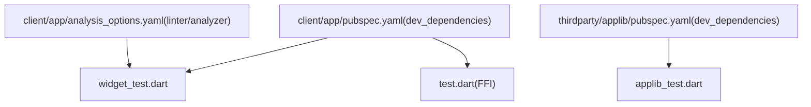

# 测试与调试

<cite>
**本文引用的文件**
- [client/app/pubspec.yaml](file://client/app/pubspec.yaml)
- [client/app/analysis_options.yaml](file://client/app/analysis_options.yaml)
- [client/app/test/widget_test.dart](file://client/app/test/widget_test.dart)
- [client/app/test/test.dart](file://client/app/test/test.dart)
- [thirdparty/applib/pubspec.yaml](file://thirdparty/applib/pubspec.yaml)
- [thirdparty/applib/lib/applib.dart](file://thirdparty/applib/lib/applib.dart)
- [thirdparty/applib/test/applib_test.dart](file://thirdparty/applib/test/applib_test.dart)
- [client/app/lib/main.dart](file://client/app/lib/main.dart)
- [client/app/lib/util/log.dart](file://client/app/lib/util/log.dart)
- [client/app/lib/global/logger.dart](file://client/app/lib/global/logger.dart)
- [client/app/ios/RunnerTests/RunnerTests.swift](file://client/app/ios/RunnerTests/RunnerTests.swift)
- [client/app/ios/Runner.xcodeproj/xcshareddata/xcschemes/Runner.xcscheme](file://client/app/ios/Runner.xcodeproj/xcshareddata/xcschemes/Runner.xcscheme)
</cite>

## 目录
1. [引言](#引言)
2. [项目结构](#项目结构)
3. [核心组件](#核心组件)
4. [架构总览](#架构总览)
5. [详细组件分析](#详细组件分析)
6. [依赖分析](#依赖分析)
7. [性能考虑](#性能考虑)
8. [故障排查指南](#故障排查指南)
9. [结论](#结论)
10. [附录](#附录)

## 引言
本文件面向Hoper Flutter应用，提供一套系统化的测试与调试实践指南。内容覆盖单元测试、集成测试与UI测试的编写方法，涵盖测试框架配置、Mock对象使用、测试数据准备、调试工具（Flutter DevTools、日志系统、错误追踪）的使用，以及性能分析、内存泄漏检测与崩溃日志分析的方法。同时给出状态管理、网络请求与UI组件的测试用例思路与最佳实践，并讨论测试自动化与持续集成的质量保障策略。

## 项目结构
Hoper项目采用多模块组织方式：客户端Flutter工程位于client/app，第三方库与工具位于thirdparty目录。测试相关的关键位置如下：
- 客户端测试入口与配置：client/app/test、client/app/analysis_options.yaml、client/app/pubspec.yaml
- 第三方库测试：thirdparty/applib/test
- 日志与全局错误捕获：client/app/lib/main.dart、client/app/lib/util/log.dart、client/app/lib/global/logger.dart
- iOS测试目标：client/app/ios/RunnerTests/RunnerTests.swift、client/app/ios/Runner.xcodeproj/xcshareddata/xcschemes/Runner.xcscheme

图表来源
- [client/app/pubspec.yaml:105-117](file://client/app/pubspec.yaml#L105-L117)
- [client/app/analysis_options.yaml:8-29](file://client/app/analysis_options.yaml#L8-L29)
- [client/app/test/widget_test.dart:1-32](file://client/app/test/widget_test.dart#L1-L32)
- [client/app/test/test.dart:1-38](file://client/app/test/test.dart#L1-L38)
- [client/app/lib/main.dart:17-70](file://client/app/lib/main.dart#L17-L70)
- [client/app/lib/util/log.dart:1-32](file://client/app/lib/util/log.dart#L1-L32)
- [client/app/lib/global/logger.dart:42-70](file://client/app/lib/global/logger.dart#L42-L70)
- [thirdparty/applib/pubspec.yaml:10-23](file://thirdparty/applib/pubspec.yaml#L10-L23)
- [thirdparty/applib/lib/applib.dart:1-6](file://thirdparty/applib/lib/applib.dart#L1-L6)
- [thirdparty/applib/test/applib_test.dart:1-13](file://thirdparty/applib/test/applib_test.dart#L1-L13)
- [client/app/ios/RunnerTests/RunnerTests.swift:1-12](file://client/app/ios/RunnerTests/RunnerTests.swift#L1-L12)
- [client/app/ios/Runner.xcodeproj/xcshareddata/xcschemes/Runner.xcscheme:40-52](file://client/app/ios/Runner.xcodeproj/xcshareddata/xcschemes/Runner.xcscheme#L40-L52)

章节来源
- [client/app/pubspec.yaml:105-117](file://client/app/pubspec.yaml#L105-L117)
- [client/app/analysis_options.yaml:8-29](file://client/app/analysis_options.yaml#L8-L29)
- [client/app/test/widget_test.dart:1-32](file://client/app/test/widget_test.dart#L1-L32)
- [client/app/test/test.dart:1-38](file://client/app/test/test.dart#L1-L38)
- [thirdparty/applib/pubspec.yaml:10-23](file://thirdparty/applib/pubspec.yaml#L10-L23)
- [thirdparty/applib/test/applib_test.dart:1-13](file://thirdparty/applib/test/applib_test.dart#L1-L13)
- [client/app/lib/main.dart:17-70](file://client/app/lib/main.dart#L17-L70)
- [client/app/lib/util/log.dart:1-32](file://client/app/lib/util/log.dart#L1-L32)
- [client/app/lib/global/logger.dart:42-70](file://client/app/lib/global/logger.dart#L42-L70)
- [client/app/ios/RunnerTests/RunnerTests.swift:1-12](file://client/app/ios/RunnerTests/RunnerTests.swift#L1-L12)
- [client/app/ios/Runner.xcodeproj/xcshareddata/xcschemes/Runner.xcscheme:40-52](file://client/app/ios/Runner.xcodeproj/xcshareddata/xcschemes/Runner.xcscheme#L40-L52)

## 核心组件
- 测试框架与配置
  - Flutter测试SDK与构建工具：在客户端pubspec中声明了flutter_test与构建工具依赖，用于运行单元测试与生成序列化代码等。
  - 分析规则与Lints：analysis_options.yaml引入推荐的Flutter Lints，确保代码风格与静态检查一致性。
- 单元测试示例
  - applib包提供Calculator类与其单元测试，演示基本断言与测试组织方式。
- UI测试示例
  - 客户端存在widget_test.dart，展示了基于WidgetTester的UI冒烟测试与交互流程验证。
- 集成测试与原生桥接
  - 存在test.dart用于加载本地动态库并调用原生函数，体现集成测试场景（如FFI桥接）。
- 日志与错误捕获
  - main.dart通过runZonedGuarded与ErrorWidget.builder进行全局异常捕获；util/log.dart与global/logger.dart提供日志记录与输出能力。
- iOS测试目标
  - RunnerTests.swift与Runner.xcscheme表明iOS侧具备XCTest测试目标与可执行配置。

章节来源
- [client/app/pubspec.yaml:105-117](file://client/app/pubspec.yaml#L105-L117)
- [client/app/analysis_options.yaml:8-29](file://client/app/analysis_options.yaml#L8-L29)
- [thirdparty/applib/lib/applib.dart:1-6](file://thirdparty/applib/lib/applib.dart#L1-L6)
- [thirdparty/applib/test/applib_test.dart:1-13](file://thirdparty/applib/test/applib_test.dart#L1-L13)
- [client/app/test/widget_test.dart:1-32](file://client/app/test/widget_test.dart#L1-L32)
- [client/app/test/test.dart:1-38](file://client/app/test/test.dart#L1-L38)
- [client/app/lib/main.dart:17-70](file://client/app/lib/main.dart#L17-L70)
- [client/app/lib/util/log.dart:1-32](file://client/app/lib/util/log.dart#L1-L32)
- [client/app/lib/global/logger.dart:42-70](file://client/app/lib/global/logger.dart#L42-L70)
- [client/app/ios/RunnerTests/RunnerTests.swift:1-12](file://client/app/ios/RunnerTests/RunnerTests.swift#L1-L12)
- [client/app/ios/Runner.xcodeproj/xcshareddata/xcschemes/Runner.xcscheme:40-52](file://client/app/ios/Runner.xcodeproj/xcshareddata/xcschemes/Runner.xcscheme#L40-L52)

## 架构总览
下图展示了测试与调试在Hoper Flutter应用中的整体关系：测试入口与配置位于客户端，第三方库提供独立的单元测试；日志与错误捕获贯穿应用启动阶段；iOS侧具备XCTest测试目标以支持平台级测试。

图表来源
- [client/app/pubspec.yaml:105-117](file://client/app/pubspec.yaml#L105-L117)
- [client/app/analysis_options.yaml:8-29](file://client/app/analysis_options.yaml#L8-L29)
- [client/app/test/widget_test.dart:1-32](file://client/app/test/widget_test.dart#L1-L32)
- [client/app/test/test.dart:1-38](file://client/app/test/test.dart#L1-L38)
- [thirdparty/applib/pubspec.yaml:10-23](file://thirdparty/applib/pubspec.yaml#L10-L23)
- [thirdparty/applib/test/applib_test.dart:1-13](file://thirdparty/applib/test/applib_test.dart#L1-L13)
- [client/app/lib/main.dart:17-70](file://client/app/lib/main.dart#L17-L70)
- [client/app/lib/util/log.dart:1-32](file://client/app/lib/util/log.dart#L1-L32)
- [client/app/lib/global/logger.dart:42-70](file://client/app/lib/global/logger.dart#L42-L70)
- [client/app/ios/RunnerTests/RunnerTests.swift:1-12](file://client/app/ios/RunnerTests/RunnerTests.swift#L1-L12)
- [client/app/ios/Runner.xcodeproj/xcshareddata/xcschemes/Runner.xcscheme:40-52](file://client/app/ios/Runner.xcodeproj/xcshareddata/xcschemes/Runner.xcscheme#L40-L52)

## 详细组件分析

### 单元测试：applib包
- 组件职责
  - Calculator提供简单加法逻辑，作为单元测试的被测对象。
  - applib_test.dart验证输入输出断言，示范测试组织与命名。
- 测试要点
  - 使用flutter_test框架进行断言。
  - 保持测试隔离，避免外部依赖。
- 最佳实践
  - 为每个功能模块提供独立的测试文件。
  - 使用参数化或边界值测试覆盖典型场景。

图表来源
- [thirdparty/applib/lib/applib.dart:1-6](file://thirdparty/applib/lib/applib.dart#L1-L6)
- [thirdparty/applib/test/applib_test.dart:1-13](file://thirdparty/applib/test/applib_test.dart#L1-L13)

章节来源
- [thirdparty/applib/lib/applib.dart:1-6](file://thirdparty/applib/lib/applib.dart#L1-L6)
- [thirdparty/applib/test/applib_test.dart:1-13](file://thirdparty/applib/test/applib_test.dart#L1-L13)

### UI测试：widget_test.dart
- 组件职责
  - 通过WidgetTester对UI进行交互与断言，验证控件渲染与事件响应。
- 测试要点
  - 构建应用树并触发手势（如点击）后断言UI变化。
  - 使用find系列定位子组件与文本。
- 最佳实践
  - 将UI测试拆分为“渲染验证”和“交互验证”两类。
  - 对关键页面与交互流程建立回归用例。

图表来源
- [client/app/test/widget_test.dart:14-31](file://client/app/test/widget_test.dart#L14-L31)

章节来源
- [client/app/test/widget_test.dart:1-32](file://client/app/test/widget_test.dart#L1-L32)

### 集成测试与原生桥接：test.dart
- 组件职责
  - 动态加载本地动态库并通过FFI调用原生函数，模拟跨语言集成场景。
- 测试要点
  - 跨平台动态库路径适配（Android/Linux/macOS/Windows）。
  - 通过DynamicLibrary.open与lookup<NativeFunction>完成符号绑定。
- 最佳实践
  - 在CI中提供一致的动态库构建产物与路径。
  - 将原生接口抽象为稳定ABI，减少集成测试波动。

图表来源
- [client/app/test/test.dart:5-38](file://client/app/test/test.dart#L5-L38)

章节来源
- [client/app/test/test.dart:1-38](file://client/app/test/test.dart#L1-L38)

### 日志系统与错误追踪
- 全局错误捕获
  - main.dart使用runZonedGuarded捕获未处理异常，并通过ErrorWidget.builder替换UI显示。
- 日志工具
  - util/log.dart提供Logger抽象与默认输出回调，结合logging库进行分级记录。
  - global/logger.dart注册根日志器，统一格式化输出与堆栈截取。
- 最佳实践
  - 在开发环境开启DEBUG级别日志，在生产环境限制敏感信息输出。
  - 将关键业务事件与异常记录到日志，便于问题复现与定位。

图表来源
- [client/app/lib/main.dart:17-70](file://client/app/lib/main.dart#L17-L70)
- [client/app/lib/util/log.dart:13-32](file://client/app/lib/util/log.dart#L13-L32)
- [client/app/lib/global/logger.dart:42-70](file://client/app/lib/global/logger.dart#L42-L70)

章节来源
- [client/app/lib/main.dart:17-70](file://client/app/lib/main.dart#L17-L70)
- [client/app/lib/util/log.dart:1-32](file://client/app/lib/util/log.dart#L1-L32)
- [client/app/lib/global/logger.dart:42-70](file://client/app/lib/global/logger.dart#L42-L70)

### iOS测试目标与配置
- RunnerTests.swift
  - 提供XCTest基础示例，可用于编写iOS平台特定测试。
- Runner.xcscheme
  - 配置了RunnerTests.xctest为目标，确保Xcode可直接运行测试。
- 最佳实践
  - 在iOS侧补充针对平台服务（如通知、权限）的测试。
  - 与Flutter侧测试联动，形成端到端覆盖。

图表来源
- [client/app/ios/RunnerTests/RunnerTests.swift:1-12](file://client/app/ios/RunnerTests/RunnerTests.swift#L1-L12)
- [client/app/ios/Runner.xcodeproj/xcshareddata/xcschemes/Runner.xcscheme:40-52](file://client/app/ios/Runner.xcodeproj/xcshareddata/xcschemes/Runner.xcscheme#L40-L52)

章节来源
- [client/app/ios/RunnerTests/RunnerTests.swift:1-12](file://client/app/ios/RunnerTests/RunnerTests.swift#L1-L12)
- [client/app/ios/Runner.xcodeproj/xcshareddata/xcschemes/Runner.xcscheme:40-52](file://client/app/ios/Runner.xcodeproj/xcshareddata/xcschemes/Runner.xcscheme#L40-L52)

## 依赖分析
- 测试依赖
  - 客户端通过flutter_test与构建工具（build_runner、json_serializable等）支撑测试与代码生成。
  - applib包同样声明flutter_test作为测试依赖，便于独立验证。
- 分析与规范
  - analysis_options.yaml启用推荐Lints，降低潜在问题并统一风格。
- 平台与原生
  - test.dart展示FFI桥接与动态库加载，需确保各平台产物一致。

图表来源
- [client/app/pubspec.yaml:105-117](file://client/app/pubspec.yaml#L105-L117)
- [client/app/analysis_options.yaml:8-29](file://client/app/analysis_options.yaml#L8-L29)
- [thirdparty/applib/pubspec.yaml:19-22](file://thirdparty/applib/pubspec.yaml#L19-L22)
- [client/app/test/widget_test.dart:1-32](file://client/app/test/widget_test.dart#L1-L32)
- [thirdparty/applib/test/applib_test.dart:1-13](file://thirdparty/applib/test/applib_test.dart#L1-L13)
- [client/app/test/test.dart:1-38](file://client/app/test/test.dart#L1-L38)

章节来源
- [client/app/pubspec.yaml:105-117](file://client/app/pubspec.yaml#L105-L117)
- [client/app/analysis_options.yaml:8-29](file://client/app/analysis_options.yaml#L8-L29)
- [thirdparty/applib/pubspec.yaml:19-22](file://thirdparty/applib/pubspec.yaml#L19-L22)
- [client/app/test/widget_test.dart:1-32](file://client/app/test/widget_test.dart#L1-L32)
- [thirdparty/applib/test/applib_test.dart:1-13](file://thirdparty/applib/test/applib_test.dart#L1-L13)
- [client/app/test/test.dart:1-38](file://client/app/test/test.dart#L1-L38)

## 性能考虑
- 性能分析
  - 使用Flutter DevTools进行CPU、内存、网络与帧率分析，识别热点与卡顿点。
- 内存泄漏检测
  - 结合DevTools Memory视图观察对象生命周期，配合日志定位异常增长。
- 崩溃日志分析
  - 通过main.dart的全局错误捕获与日志系统，收集异常堆栈与上下文，辅助定位崩溃原因。
- 最佳实践
  - 在开发阶段高频使用DevTools Profiler与Timeline，逐步收敛性能问题。
  - 对长列表、图片加载与动画密集区域进行专项优化与回归测试。

## 故障排查指南
- 日志与错误
  - 启动阶段使用runZonedGuarded捕获异常，ErrorWidget.builder提供降级UI提示。
  - 日志系统统一输出格式，便于快速检索与聚合。
- 常见问题
  - UI测试失败：检查WidgetTester的pump时机与find定位是否匹配当前渲染树。
  - FFI桥接失败：确认动态库路径与平台兼容性，确保CI构建产物一致。
  - iOS测试无法运行：核对RunnerTests目标与scheme配置。
- 建议流程
  - 复现 -> 打印日志 -> 使用DevTools采集指标 -> 定位根因 -> 修复与回归测试。

章节来源
- [client/app/lib/main.dart:17-70](file://client/app/lib/main.dart#L17-L70)
- [client/app/lib/util/log.dart:1-32](file://client/app/lib/util/log.dart#L1-L32)
- [client/app/lib/global/logger.dart:42-70](file://client/app/lib/global/logger.dart#L42-L70)
- [client/app/ios/RunnerTests/RunnerTests.swift:1-12](file://client/app/ios/RunnerTests/RunnerTests.swift#L1-L12)
- [client/app/ios/Runner.xcodeproj/xcshareddata/xcschemes/Runner.xcscheme:40-52](file://client/app/ios/Runner.xcodeproj/xcshareddata/xcschemes/Runner.xcscheme#L40-L52)

## 结论
本指南从测试框架配置、单元/集成/UI测试、日志与错误追踪、性能分析与内存泄漏检测、崩溃日志分析等方面，为Hoper Flutter应用提供了系统化的测试与调试实践。建议在日常开发中坚持“先单元后集成再UI”的测试金字塔，配合DevTools与日志体系，持续提升质量与稳定性。

## 附录
- 测试用例示例思路
  - 状态管理：对GetX控制器的状态变更进行断言，模拟用户操作序列。
  - 网络请求：使用mock或本地代理拦截HTTP请求，验证请求参数与响应处理。
  - UI组件：覆盖渲染、交互与无障碍属性，确保多设备与多语言场景一致。
- 测试自动化与CI
  - 在CI中执行flutter test与flutter analyze，结合覆盖率报告与静态检查，确保合并质量。
  - 对原生桥接与平台测试（iOS/Android）分别配置构建与测试步骤，保证跨平台一致性。