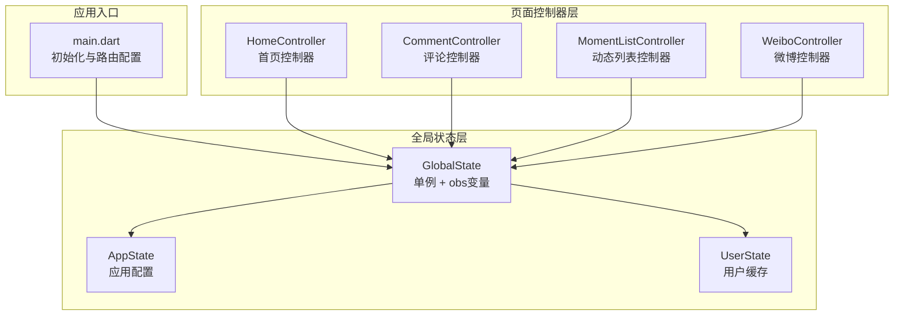
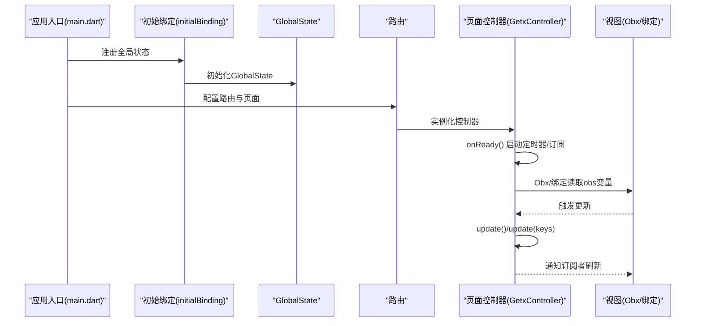
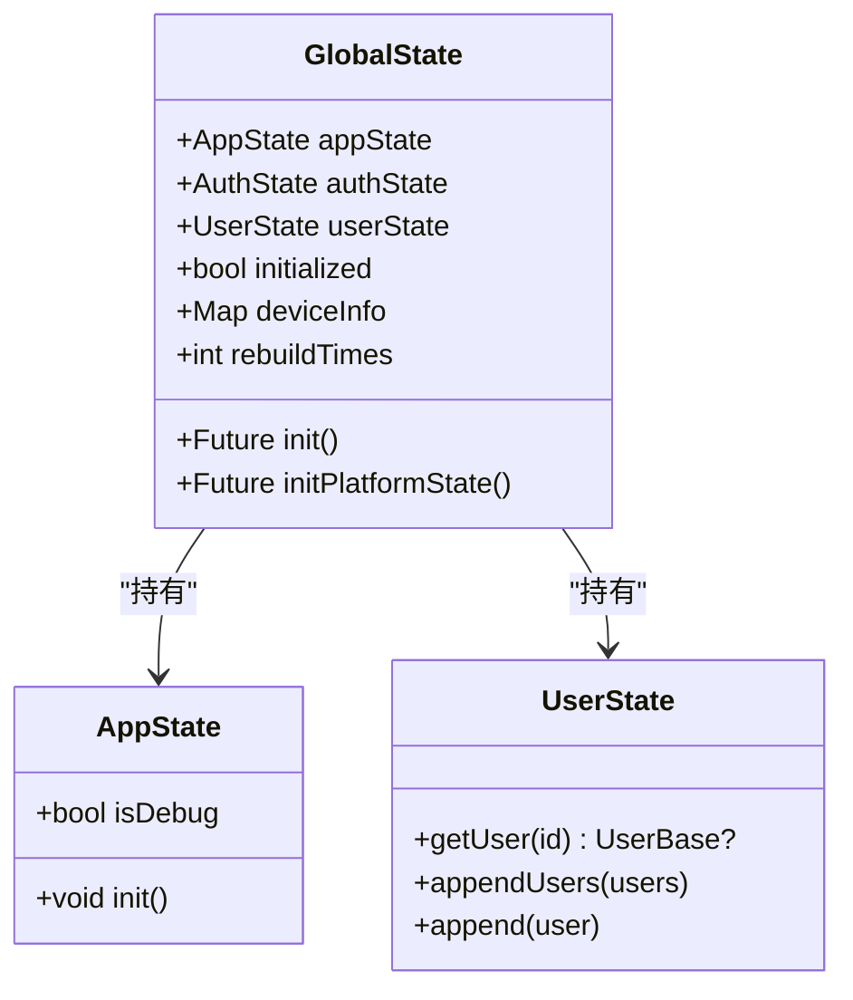
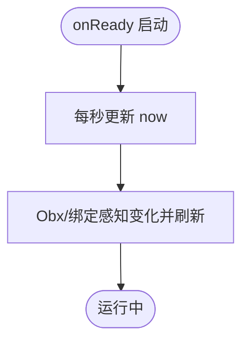
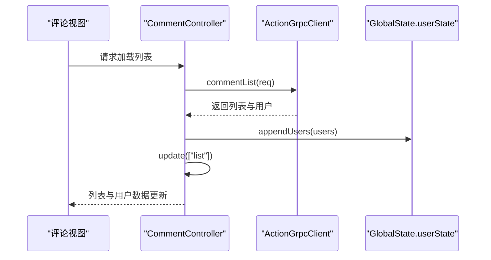
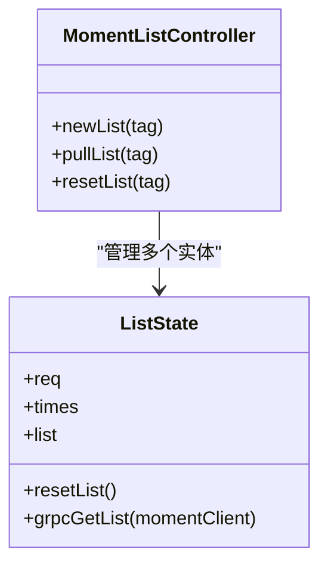
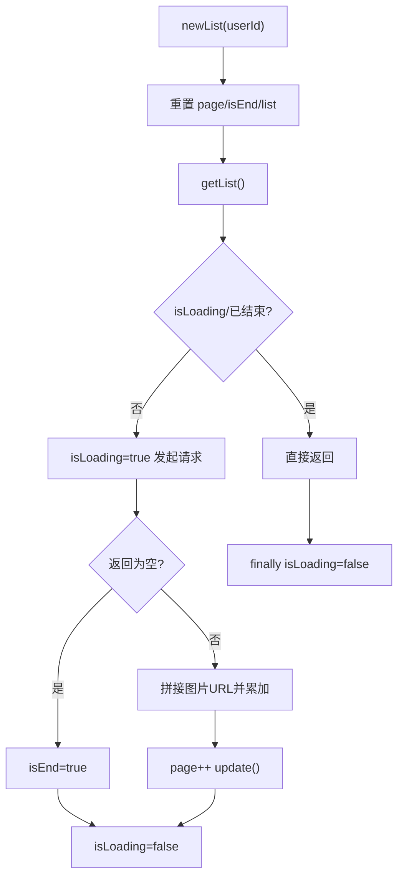
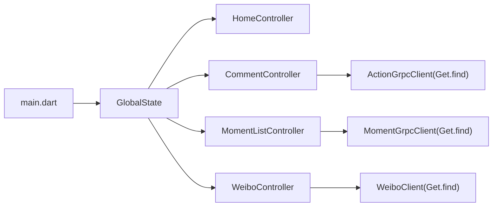

# GetX 响应式状态管理

<cite>
**本文档引用的文件**
- [main.dart](file://client/app/lib/main.dart)
- [state.dart](file://client/app/lib/global/state.dart)
- [app.dart](file://client/app/lib/global/state/app.dart)
- [user.dart](file://client/app/lib/global/state/user.dart)
- [home_controller.dart](file://client/app/lib/pages/home/home_controller.dart)
- [comment_controller.dart](file://client/app/lib/pages/comment/comment_controller.dart)
- [moment_list_controller.dart](file://client/app/lib/pages/moment/list/moment_list_controller.dart)
- [weibo_controller.dart](file://client/app/lib/pages/weibo/controller.dart)
</cite>

## 目录
1. [简介](#简介)
2. [项目结构](#项目结构)
3. [核心组件](#核心组件)
4. [架构总览](#架构总览)
5. [详细组件分析](#详细组件分析)
6. [依赖关系分析](#依赖关系分析)
7. [性能考量](#性能考量)
8. [故障排查指南](#故障排查指南)
9. [结论](#结论)
10. [附录](#附录)

## 简介
本文件面向Hoper项目的Flutter客户端，系统性梳理GetX响应式状态管理的实践与最佳实践。内容覆盖：
- RxJS风格的响应式编程模型在GetX中的体现：obs可观察对象、update局部刷新、依赖追踪与自动释放。
- 控制器生命周期管理：onReady、onClose等钩子的使用场景与注意事项。
- 依赖注入与自动释放：Get.find、initialBinding、以及GetX对控制器生命周期的托管。
- 响应式状态的创建、订阅与更新：变量监听、列表监听、复杂对象监听与局部刷新策略。
- 在Flutter组件中结合GetX进行状态绑定、事件处理与性能优化。

## 项目结构
Hoper客户端采用“全局状态 + 页面控制器”的分层组织方式：
- 全局状态：集中管理应用级状态（如主题、设备信息、认证态等），通过单例与obs变量对外提供响应式能力。
- 页面控制器：按页面职责拆分，继承GetxController，负责页面内局部状态与业务逻辑。
- 依赖注入：通过BindingsBuilder在应用启动时注册全局状态；控制器通过Get.find获取服务或控制器实例。
- 路由与视图：路由配置与页面渲染分离，控制器通过Obx/绑定语法驱动UI更新。

图表来源
- [main.dart:17-65](file://client/app/lib/main.dart#L17-L65)
- [state.dart:19-46](file://client/app/lib/global/state.dart#L19-L46)
- [home_controller.dart:9-20](file://client/app/lib/pages/home/home_controller.dart#L9-L20)
- [comment_controller.dart:14-25](file://client/app/lib/pages/comment/comment_controller.dart#L14-L25)
- [moment_list_controller.dart:10-23](file://client/app/lib/pages/moment/list/moment_list_controller.dart#L10-L23)
- [weibo_controller.dart:7-26](file://client/app/lib/pages/weibo/controller.dart#L7-L26)

章节来源
- [main.dart:17-65](file://client/app/lib/main.dart#L17-L65)
- [state.dart:19-46](file://client/app/lib/global/state.dart#L19-L46)

## 核心组件
- 全局状态GlobalState：单例持有AppState、AuthState、UserState，并提供obs变量（如isDarkMode）以驱动主题切换等全局UI更新。
- 页面控制器：各页面控制器继承GetxController，内部定义obs变量与update调用，实现局部状态响应式更新。
- 依赖注入：应用启动时通过initialBinding注册GlobalState；控制器通过Get.find获取服务实例，实现解耦与自动释放。
- 生命周期：控制器提供onReady/onClose钩子，用于定时器、网络请求等资源的初始化与释放。

章节来源
- [state.dart:19-46](file://client/app/lib/global/state.dart#L19-L46)
- [home_controller.dart:9-20](file://client/app/lib/pages/home/home_controller.dart#L9-L20)
- [comment_controller.dart:14-25](file://client/app/lib/pages/comment/comment_controller.dart#L14-L25)
- [moment_list_controller.dart:10-23](file://client/app/lib/pages/moment/list/moment_list_controller.dart#L10-L23)
- [weibo_controller.dart:7-26](file://client/app/lib/pages/weibo/controller.dart#L7-L26)

## 架构总览
下图展示了从应用启动到页面渲染的关键流程：入口初始化、全局状态注入、控制器生命周期与UI响应式更新。

图表来源
- [main.dart:49-51](file://client/app/lib/main.dart#L49-L51)
- [state.dart:39-46](file://client/app/lib/global/state.dart#L39-L46)
- [home_controller.dart:52-62](file://client/app/lib/pages/home/home_controller.dart#L52-L62)

## 详细组件分析

### GlobalState 全局状态
- 单例模式：通过静态instance确保全局唯一。
- obs变量：isDarkMode为obs类型，配合GetMaterialApp的themeMode实现主题切换的响应式更新。
- 设备信息：通过DeviceInfoPlugin采集平台信息，统一存储在deviceInfo中，供其他模块使用。
- 初始化：init方法串行完成服务初始化、认证态获取与设备信息采集。

图表来源
- [state.dart:19-46](file://client/app/lib/global/state.dart#L19-L46)
- [app.dart:3-20](file://client/app/lib/global/state/app.dart#L3-L20)
- [user.dart:7-24](file://client/app/lib/global/state/user.dart#L7-L24)

章节来源
- [state.dart:19-46](file://client/app/lib/global/state.dart#L19-L46)
- [app.dart:3-20](file://client/app/lib/global/state/app.dart#L3-L20)
- [user.dart:7-24](file://client/app/lib/global/state/user.dart#L7-L24)

### HomeController 首页控制器
- obs变量：selectedIndex、now为obs类型，分别驱动底部导航选中态与时间显示。
- 定时器：onReady中每秒更新now，演示obs变量驱动UI的周期性刷新。
- 事件处理：onItemTapped/onPageChanged通过修改obs变量触发UI更新。
- 生命周期：onReady/onClose提供资源管理入口。

图表来源
- [home_controller.dart:52-62](file://client/app/lib/pages/home/home_controller.dart#L52-L62)

章节来源
- [home_controller.dart:9-20](file://client/app/lib/pages/home/home_controller.dart#L9-L20)
- [home_controller.dart:52-62](file://client/app/lib/pages/home/home_controller.dart#L52-L62)

### CommentController 评论控制器
- 依赖注入：通过Get.find获取ActionGrpcClient，实现服务解耦。
- 局部刷新：使用update(["list"])仅刷新列表相关依赖，避免全量重建。
- 错误处理：捕获GrpcError并通过toast提示用户。
- 用户缓存：从响应中合并用户信息至GlobalState.userState，便于跨组件复用。

图表来源
- [comment_controller.dart:27-44](file://client/app/lib/pages/comment/comment_controller.dart#L27-L44)
- [comment_controller.dart:89-93](file://client/app/lib/pages/comment/comment_controller.dart#L89-L93)

章节来源
- [comment_controller.dart:14-25](file://client/app/lib/pages/comment/comment_controller.dart#L14-L25)
- [comment_controller.dart:27-44](file://client/app/lib/pages/comment/comment_controller.dart#L27-L44)
- [comment_controller.dart:89-93](file://client/app/lib/pages/comment/comment_controller.dart#L89-L93)

### MomentListController 动态列表控制器
- 多实体模式：通过MultiEntity<ListState>管理多标签下的列表状态，演示GetX在复杂场景下的扩展能力。
- 局部刷新：pullList中调用update([tag])仅刷新对应标签的数据依赖。
- 重置与拉取：resetList先清空再拉取，保证数据一致性。

图表来源
- [moment_list_controller.dart:10-23](file://client/app/lib/pages/moment/list/moment_list_controller.dart#L10-L23)
- [moment_list_controller.dart:43-68](file://client/app/lib/pages/moment/list/moment_list_controller.dart#L43-L68)

章节来源
- [moment_list_controller.dart:10-23](file://client/app/lib/pages/moment/list/moment_list_controller.dart#L10-L23)
- [moment_list_controller.dart:43-68](file://client/app/lib/pages/moment/list/moment_list_controller.dart#L43-L68)

### WeiboController 微博控制器
- 本地状态：userId、page、feature、sinceId、list、picWidth、picHeight、isEnd、isLoading等。
- 列表加载：newList重置状态后调用getList；getList中通过isLoading防重复请求。
- 更新策略：加载完成后调用update()触发UI刷新。

图表来源
- [weibo_controller.dart:19-51](file://client/app/lib/pages/weibo/controller.dart#L19-L51)

章节来源
- [weibo_controller.dart:7-26](file://client/app/lib/pages/weibo/controller.dart#L7-L26)
- [weibo_controller.dart:19-51](file://client/app/lib/pages/weibo/controller.dart#L19-L51)

## 依赖关系分析
- 入口依赖：main.dart通过initialBinding注册GlobalState，确保应用启动时全局状态可用。
- 控制器依赖：各页面控制器通过Get.find获取服务实例，实现松耦合。
- 状态依赖：控制器通过GlobalState访问全局状态（如主题、用户信息），实现跨页面共享。

图表来源
- [main.dart:49-51](file://client/app/lib/main.dart#L49-L51)
- [comment_controller.dart:19](file://client/app/lib/pages/comment/comment_controller.dart#L19)
- [moment_list_controller.dart:11](file://client/app/lib/pages/moment/list/moment_list_controller.dart#L11)
- [weibo_controller.dart:8](file://client/app/lib/pages/weibo/controller.dart#L8)

章节来源
- [main.dart:49-51](file://client/app/lib/main.dart#L49-L51)
- [comment_controller.dart:19](file://client/app/lib/pages/comment/comment_controller.dart#L19)
- [moment_list_controller.dart:11](file://client/app/lib/pages/moment/list/moment_list_controller.dart#L11)
- [weibo_controller.dart:8](file://client/app/lib/pages/weibo/controller.dart#L8)

## 性能考量
- 局部刷新：优先使用update(keys)或update(["key"])进行细粒度刷新，减少不必要的重建。
- 避免重复请求：在列表加载中使用isLoading等布尔标志防止并发请求。
- 定时器与资源：在onReady中启动定时器/订阅，在onClose中释放资源，避免内存泄漏。
- 全局状态瘦身：将跨页面共享的状态放入GlobalState，避免重复计算与冗余存储。
- 主题切换：通过obs变量驱动主题切换，避免全量重建。

## 故障排查指南
- UI不刷新：检查是否正确使用obs变量与update调用；确认Obx/绑定语法是否正确读取obs。
- 内存泄漏：确认控制器在onClose中释放定时器、订阅与控制器实例；避免闭包持有控制器引用。
- 依赖未注入：确保在initialBinding中注册GlobalState；服务实例通过Get.find获取。
- 错误处理：在异步请求中捕获异常并提示用户，避免崩溃。

章节来源
- [home_controller.dart:52-68](file://client/app/lib/pages/home/home_controller.dart#L52-L68)
- [comment_controller.dart:40-43](file://client/app/lib/pages/comment/comment_controller.dart#L40-L43)
- [moment_list_controller.dart:30-40](file://client/app/lib/pages/moment/list/moment_list_controller.dart#L30-L40)
- [weibo_controller.dart:30-50](file://client/app/lib/pages/weibo/controller.dart#L30-L50)

## 结论
Hoper项目通过GetX实现了清晰的响应式状态管理：全局状态以obs变量驱动主题与设备信息等跨页面共享；页面控制器以局部obs变量与update实现高效UI更新；依赖注入与生命周期管理确保了资源的正确释放与解耦。遵循局部刷新、防重复请求与资源清理的最佳实践，可在保证性能的同时提升开发效率与可维护性。

## 附录
- 示例路径参考
  - 全局状态初始化与主题绑定：[main.dart:29-35](file://client/app/lib/main.dart#L29-L35)
  - 全局状态单例与obs变量：[state.dart:19-48](file://client/app/lib/global/state.dart#L19-L48)
  - 首页控制器obs与定时器：[home_controller.dart:10-11](file://client/app/lib/pages/home/home_controller.dart#L10-L11), [home_controller.dart:56-61](file://client/app/lib/pages/home/home_controller.dart#L56-L61)
  - 评论控制器局部刷新：[comment_controller.dart:39](file://client/app/lib/pages/comment/comment_controller.dart#L39), [comment_controller.dart:89](file://client/app/lib/pages/comment/comment_controller.dart#L89)
  - 动态列表多实体与局部刷新：[moment_list_controller.dart:22](file://client/app/lib/pages/moment/list/moment_list_controller.dart#L22)
  - 微博控制器加载与更新：[weibo_controller.dart:29-50](file://client/app/lib/pages/weibo/controller.dart#L29-L50)