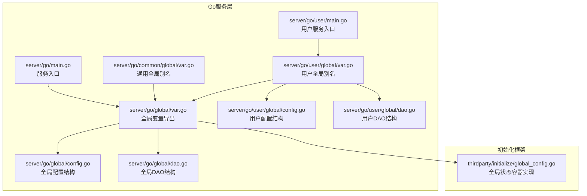
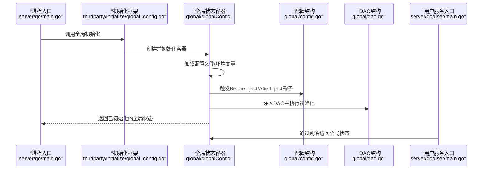
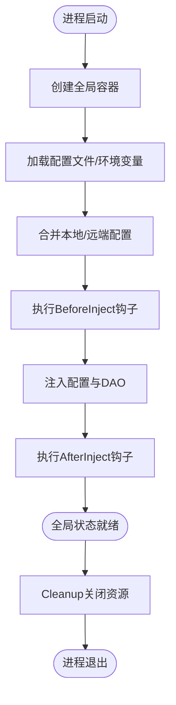
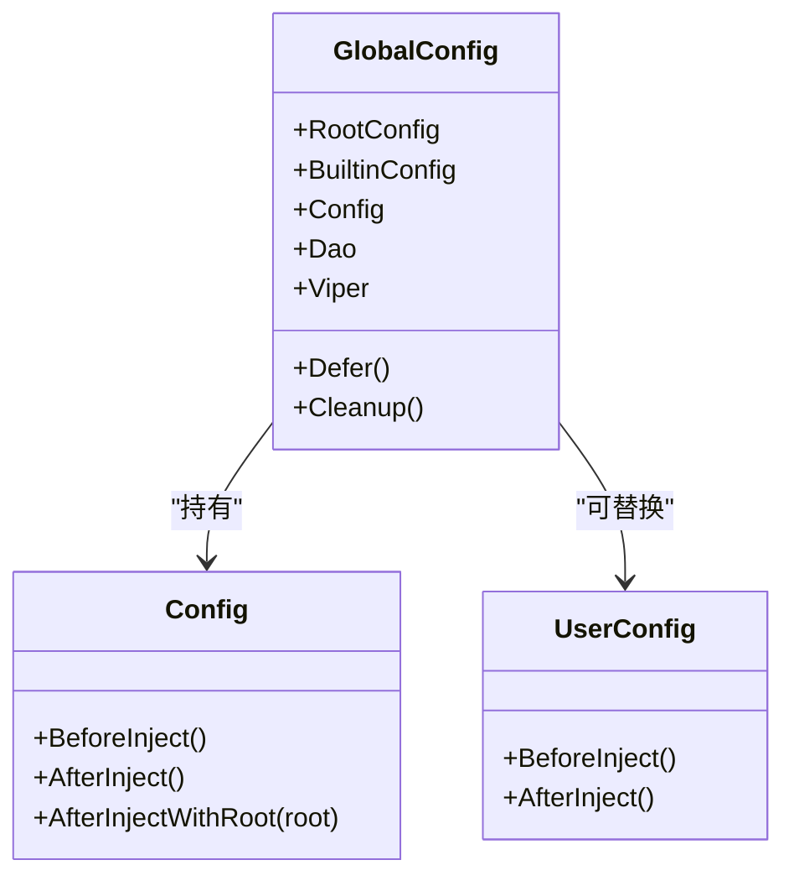
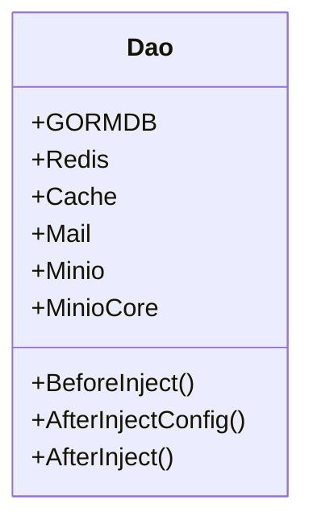
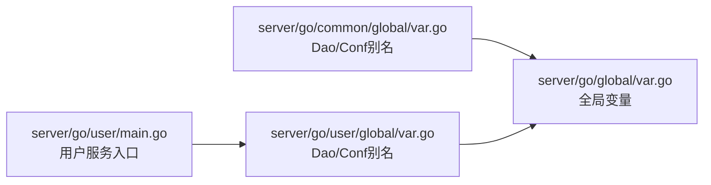
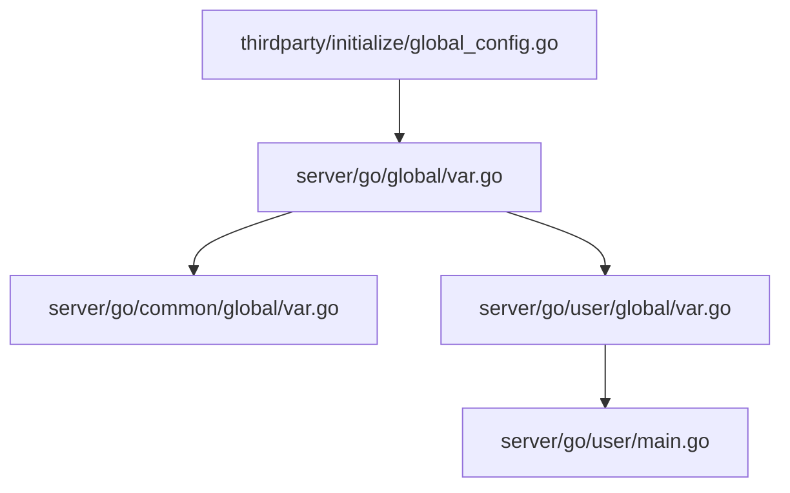

# 全局状态架构设计

<cite>
**本文档引用的文件**
- [server/go/global/var.go](file://server/go/global/var.go)
- [server/go/global/config.go](file://server/go/global/config.go)
- [server/go/global/dao.go](file://server/go/global/dao.go)
- [thirdparty/initialize/global_config.go](file://thirdparty/initialize/global_config.go)
- [server/go/main.go](file://server/go/main.go)
- [server/go/common/global/var.go](file://server/go/common/global/var.go)
- [server/go/user/global/var.go](file://server/go/user/global/var.go)
- [server/go/user/global/config.go](file://server/go/user/global/config.go)
- [server/go/user/global/dao.go](file://server/go/user/global/dao.go)
- [server/go/user/main.go](file://server/go/user/main.go)
</cite>

## 目录
1. [引言](#引言)
2. [项目结构](#项目结构)
3. [核心组件](#核心组件)
4. [架构总览](#架构总览)
5. [详细组件分析](#详细组件分析)
6. [依赖关系分析](#依赖关系分析)
7. [性能考量](#性能考量)
8. [故障排查指南](#故障排查指南)
9. [结论](#结论)

## 引言
本文件面向Hoper项目的全局状态架构，系统性阐述GlobalState单例模式的实现原理与工程化落地，覆盖状态初始化流程、设备信息与平台适配机制、全局状态的组织结构（appState、authState、userState等子状态模块）、状态间依赖与通信机制、状态同步策略与数据流转，并提供架构图与最佳实践建议，帮助开发者正确使用与扩展全局状态。

## 项目结构
Hoper采用“多模块共享全局状态”的架构：服务进程在启动阶段通过统一的全局状态容器初始化配置与DAO层资源，随后各业务模块（如用户、内容、文件、消息）共享该全局状态，避免重复初始化与状态漂移。

图表来源
- [server/go/main.go:29-69](file://server/go/main.go#L29-L69)
- [server/go/global/var.go:10-17](file://server/go/global/var.go#L10-L17)
- [server/go/global/config.go:19-31](file://server/go/global/config.go#L19-L31)
- [server/go/global/dao.go:20-31](file://server/go/global/dao.go#L20-L31)
- [server/go/common/global/var.go:7-9](file://server/go/common/global/var.go#L7-L9)
- [server/go/user/main.go:10-15](file://server/go/user/main.go#L10-L15)
- [server/go/user/global/var.go:7-9](file://server/go/user/global/var.go#L7-L9)
- [server/go/user/global/config.go:14-18](file://server/go/user/global/config.go#L14-L18)
- [server/go/user/global/dao.go:18-27](file://server/go/user/global/dao.go#L18-L27)
- [thirdparty/initialize/global_config.go:31-45](file://thirdparty/initialize/global_config.go#L31-L45)

章节来源
- [server/go/main.go:29-69](file://server/go/main.go#L29-L69)
- [server/go/global/var.go:10-17](file://server/go/global/var.go#L10-L17)
- [thirdparty/initialize/global_config.go:90-106](file://thirdparty/initialize/global_config.go#L90-L106)

## 核心组件
- 全局状态容器（Global）：由初始化框架提供，负责配置加载、环境注入、DAO初始化与生命周期管理。
- 配置模块（Config）：定义全局与业务配置结构，包含BeforeInject/AfterInject钩子以完成配置标准化与默认值设置。
- DAO模块（Dao）：集中管理数据库、缓存、对象存储、邮件等外部依赖的连接与初始化。
- 业务模块全局别名：各业务模块（如用户）通过简化的全局变量导出，复用全局状态。

章节来源
- [thirdparty/initialize/global_config.go:31-45](file://thirdparty/initialize/global_config.go#L31-L45)
- [server/go/global/config.go:19-31](file://server/go/global/config.go#L19-L31)
- [server/go/global/dao.go:20-31](file://server/go/global/dao.go#L20-L31)
- [server/go/user/global/var.go:7-9](file://server/go/user/global/var.go#L7-L9)

## 架构总览
下图展示了从进程启动到全局状态可用的关键流程，以及各模块之间的依赖关系。

图表来源
- [server/go/main.go:29-69](file://server/go/main.go#L29-L69)
- [thirdparty/initialize/global_config.go:90-106](file://thirdparty/initialize/global_config.go#L90-L106)
- [thirdparty/initialize/global_config.go:303-314](file://thirdparty/initialize/global_config.go#L303-L314)
- [server/go/global/config.go:38-45](file://server/go/global/config.go#L38-L45)
- [server/go/global/dao.go:33-61](file://server/go/global/dao.go#L33-L61)
- [server/go/user/main.go:10-15](file://server/go/user/main.go#L10-L15)

## 详细组件分析

### Global单例模式与初始化流程
- 容器类型与字段
  - 容器持有RootConfig、内置配置、用户配置与DAO实例，以及Viper配置源与互斥锁。
  - 提供初始化、清理、延迟关闭等能力。
- 初始化步骤
  - 应用标志位配置与根配置后处理。
  - 注册可插拔配置中心（本地文件/远端中心），合并本地与远端配置。
  - 执行BeforeInject钩子，生成配置模板，注入配置与DAO。
  - 在AfterInject阶段对配置进行归一化（如时间单位标准化），并对DAO执行Schema创建与迁移、缓存/追踪/指标接入等。
- 生命周期管理
  - 通过Cleanup倒序执行defer列表，确保DAO与配置中心安全关闭。

图表来源
- [thirdparty/initialize/global_config.go:90-106](file://thirdparty/initialize/global_config.go#L90-L106)
- [thirdparty/initialize/global_config.go:254-301](file://thirdparty/initialize/global_config.go#L254-L301)
- [thirdparty/initialize/global_config.go:303-314](file://thirdparty/initialize/global_config.go#L303-L314)
- [thirdparty/initialize/global_config.go:316-345](file://thirdparty/initialize/global_config.go#L316-L345)

章节来源
- [thirdparty/initialize/global_config.go:31-45](file://thirdparty/initialize/global_config.go#L31-L45)
- [thirdparty/initialize/global_config.go:90-106](file://thirdparty/initialize/global_config.go#L90-L106)
- [thirdparty/initialize/global_config.go:303-314](file://thirdparty/initialize/global_config.go#L303-L314)
- [thirdparty/initialize/global_config.go:322-345](file://thirdparty/initialize/global_config.go#L322-L345)

### 配置模块（Config）
- 结构设计
  - 全局配置包含分页大小、站点URL、上传策略、用户令牌有效期与密钥、内容限制等。
  - 业务模块（如用户）可定义自身配置结构，并复用全局生命周期钩子。
- 生命周期钩子
  - BeforeInject：设置默认令牌有效期等。
  - AfterInject：对时间单位进行标准化，将字符串密钥转换为字节数组等。
  - AfterInjectWithRoot：根据根配置切换运行模式（如Release），并生成上传策略JSON等。

图表来源
- [thirdparty/initialize/global_config.go:31-45](file://thirdparty/initialize/global_config.go#L31-L45)
- [server/go/global/config.go:38-45](file://server/go/global/config.go#L38-L45)
- [server/go/user/global/config.go:20-27](file://server/go/user/global/config.go#L20-L27)

章节来源
- [server/go/global/config.go:19-31](file://server/go/global/config.go#L19-L31)
- [server/go/global/config.go:38-45](file://server/go/global/config.go#L38-L45)
- [server/go/user/global/config.go:14-18](file://server/go/user/global/config.go#L14-L18)
- [server/go/user/global/config.go:20-27](file://server/go/user/global/config.go#L20-L27)

### DAO模块（Dao）
- 组件集合
  - 数据库（GORMDB）、Redis、缓存（Ristretto）、邮件（Mail）、对象存储（Minio）等。
- 初始化策略
  - BeforeInject/AfterInjectConfig/AfterInject分别用于日志、Schema创建与迁移、自动追踪与指标接入等。
  - 对Minio客户端进行封装以便后续使用。

图表来源
- [server/go/global/dao.go:20-31](file://server/go/global/dao.go#L20-L31)
- [server/go/user/global/dao.go:18-27](file://server/go/user/global/dao.go#L18-L27)

章节来源
- [server/go/global/dao.go:20-31](file://server/go/global/dao.go#L20-L31)
- [server/go/global/dao.go:33-61](file://server/go/global/dao.go#L33-L61)
- [server/go/user/global/dao.go:18-27](file://server/go/user/global/dao.go#L18-L27)
- [server/go/user/global/dao.go:35-55](file://server/go/user/global/dao.go#L35-L55)

### 业务模块全局别名
- 通用别名
  - common模块导出Dao与Conf别名，便于通用组件直接使用全局状态。
- 用户模块别名
  - user模块同样导出Dao与Conf别名，复用全局状态；用户服务入口通过别名启动HTTP与gRPC服务。

图表来源
- [server/go/common/global/var.go:7-9](file://server/go/common/global/var.go#L7-L9)
- [server/go/user/global/var.go:7-9](file://server/go/user/global/var.go#L7-L9)
- [server/go/user/main.go:10-15](file://server/go/user/main.go#L10-L15)

章节来源
- [server/go/common/global/var.go:7-9](file://server/go/common/global/var.go#L7-L9)
- [server/go/user/global/var.go:7-9](file://server/go/user/global/var.go#L7-L9)
- [server/go/user/main.go:10-15](file://server/go/user/main.go#L10-L15)

### 设备信息获取与平台适配机制
- 平台适配
  - 全局配置在AfterInjectWithRoot中根据根配置切换运行模式（如Release），影响日志与路由行为。
- 设备信息
  - 用户DAO在AfterInject中为数据库命名策略设置表前缀，并创建Schema与执行模型迁移，确保跨平台一致性。
- 追踪与指标
  - 用户DAO启用Redis的OpenTelemetry追踪与指标，保证跨平台可观测性一致。

章节来源
- [server/go/global/config.go:42-68](file://server/go/global/config.go#L42-L68)
- [server/go/user/global/dao.go:35-55](file://server/go/user/global/dao.go#L35-L55)

### 全局状态组织结构与设计理念
- appState（应用状态）
  - 通过全局配置与DAO承载应用级资源，如数据库连接、缓存、对象存储、邮件等。
- authState（认证状态）
  - 令牌有效期与密钥在配置钩子中完成标准化，确保认证逻辑的一致性。
- userState（用户状态）
  - 用户DAO负责用户相关Schema与模型迁移，提供用户会话、设备、积分等状态的基础能力。

章节来源
- [server/go/global/config.go:70-105](file://server/go/global/config.go#L70-L105)
- [server/go/user/global/dao.go:35-55](file://server/go/user/global/dao.go#L35-L55)

### 状态间依赖关系与通信机制
- 单向依赖
  - 各业务模块仅依赖全局别名，不直接依赖具体实现，降低耦合。
- 事件与变更
  - 配置中心支持热更新，onChange回调触发重新注入配置，保证运行期配置变更的传播。
- 生命周期
  - 通过全局Cleanup统一释放DAO与配置中心资源，避免资源泄漏。

章节来源
- [thirdparty/initialize/global_config.go:263-274](file://thirdparty/initialize/global_config.go#L263-L274)
- [thirdparty/initialize/global_config.go:113-127](file://thirdparty/initialize/global_config.go#L113-L127)

### 状态同步策略与数据流转
- 同步策略
  - 配置加载采用顺序合并：本地文件优先，远端配置中心次之；最终通过注入器将配置映射到结构体。
- 数据流转
  - 配置钩子在注入前后完成标准化与派生字段计算，DAO在注入后执行Schema与迁移，确保状态一致。
- 变更传播
  - 热更新通过onChange回调触发重新注入，editTimes递增，便于上层感知配置变更。

章节来源
- [thirdparty/initialize/global_config.go:254-301](file://thirdparty/initialize/global_config.go#L254-L301)
- [thirdparty/initialize/global_config.go:303-314](file://thirdparty/initialize/global_config.go#L303-L314)

## 依赖关系分析
- 组件耦合
  - 业务模块仅通过全局别名访问全局状态，保持高内聚低耦合。
- 外部依赖
  - 初始化框架提供配置中心、DAO字段抽象与生命周期管理，业务模块无需关心底层细节。
- 循环依赖
  - 通过别名导出避免直接导入，防止循环依赖。

图表来源
- [thirdparty/initialize/global_config.go:31-45](file://thirdparty/initialize/global_config.go#L31-L45)
- [server/go/global/var.go:10-17](file://server/go/global/var.go#L10-L17)
- [server/go/common/global/var.go:7-9](file://server/go/common/global/var.go#L7-L9)
- [server/go/user/global/var.go:7-9](file://server/go/user/global/var.go#L7-L9)
- [server/go/user/main.go:10-15](file://server/go/user/main.go#L10-L15)

章节来源
- [server/go/global/var.go:10-17](file://server/go/global/var.go#L10-L17)
- [server/go/common/global/var.go:7-9](file://server/go/common/global/var.go#L7-L9)
- [server/go/user/global/var.go:7-9](file://server/go/user/global/var.go#L7-L9)

## 性能考量
- 配置加载
  - 使用Viper进行高效配置解析与合并，减少启动时延。
- DAO初始化
  - 将Schema创建与模型迁移放在AfterInject阶段，避免请求路径上的阻塞。
- 追踪与指标
  - 在DAO初始化阶段启用Redis的OpenTelemetry集成，降低运行期开销。
- 缓存
  - Ristretto缓存用于热点数据加速，需结合业务场景合理设置容量与TTL。

## 故障排查指南
- 启动失败
  - 检查配置文件路径与格式，确认配置中心可用性与权限。
- DAO初始化异常
  - 关注AfterInject阶段的日志输出，定位数据库连接、Schema创建或迁移错误。
- 配置热更新无效
  - 确认配置中心监听正常，onChange回调能够触发重新注入。
- 资源未释放
  - 确保在进程退出时调用Cleanup，检查defer列表是否完整。

章节来源
- [thirdparty/initialize/global_config.go:113-127](file://thirdparty/initialize/global_config.go#L113-L127)
- [thirdparty/initialize/global_config.go:322-345](file://thirdparty/initialize/global_config.go#L322-L345)
- [server/go/global/dao.go:33-61](file://server/go/global/dao.go#L33-L61)

## 结论
Hoper的全局状态架构通过初始化框架提供的全局容器，实现了配置与DAO的统一管理与生命周期控制。业务模块通过简洁的全局别名共享状态，降低了复杂度与耦合度。借助钩子机制与热更新能力，系统在启动与运行期均具备良好的可维护性与可扩展性。建议在实际开发中遵循本文的最佳实践，确保状态一致性与性能表现。