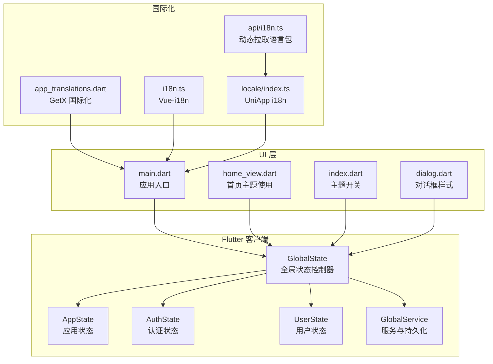
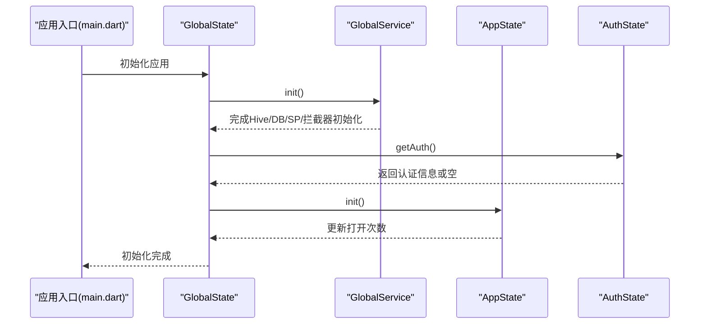
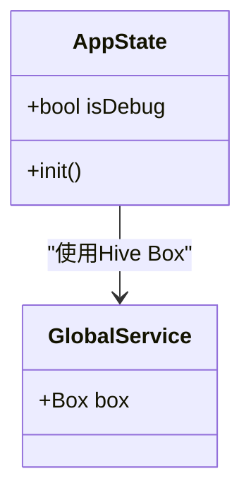
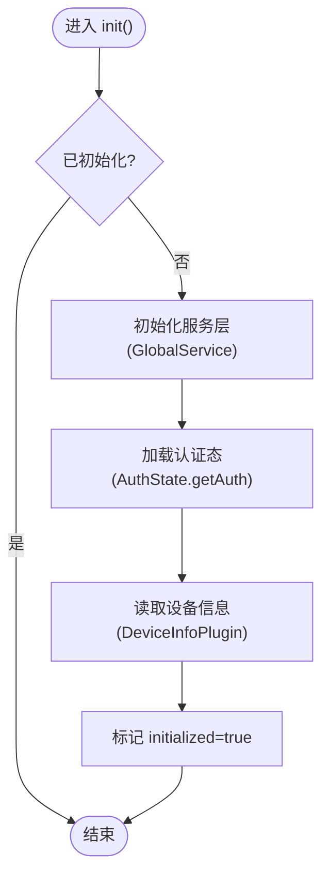
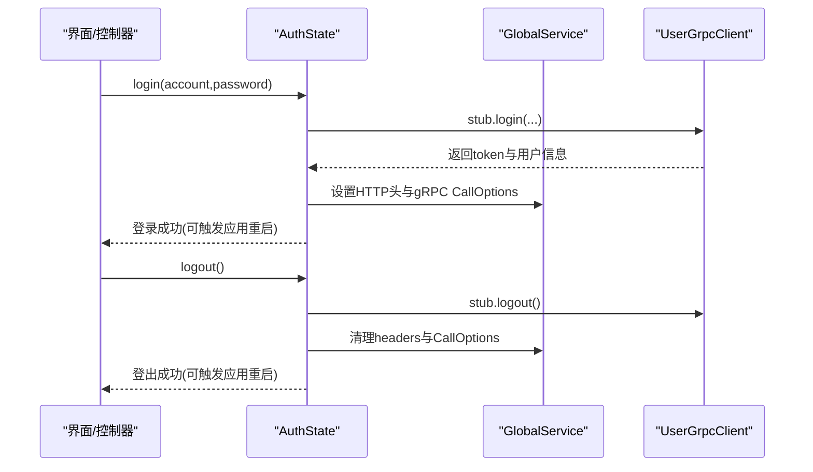
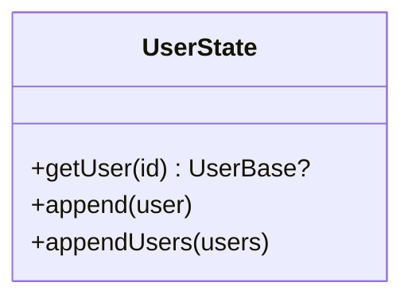
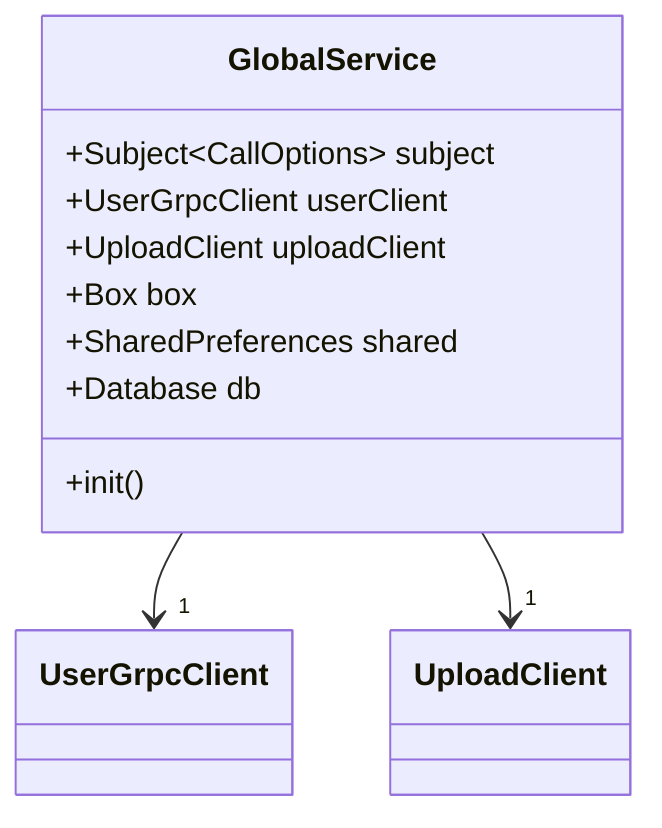
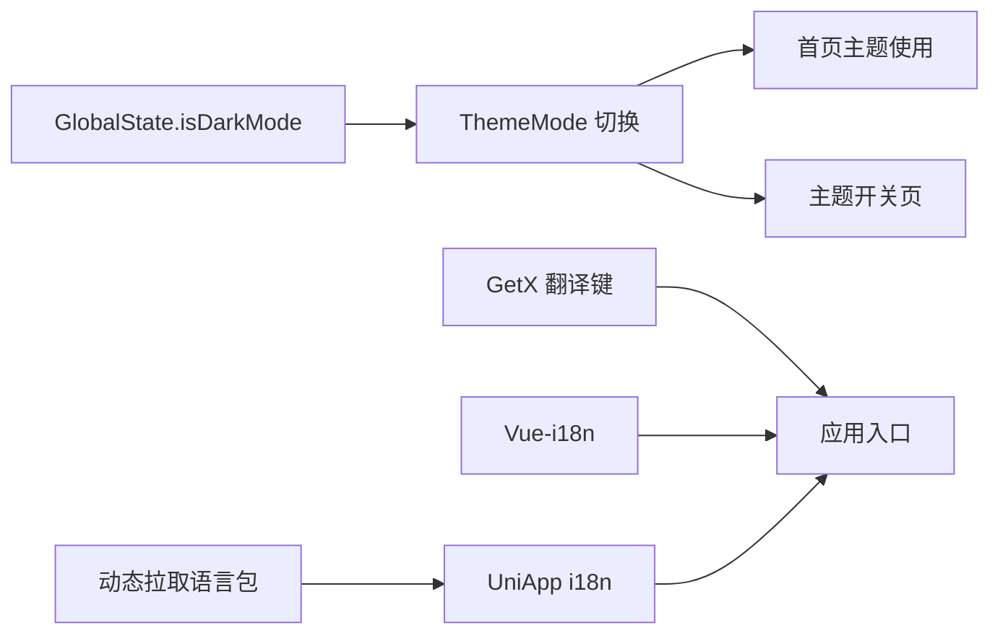
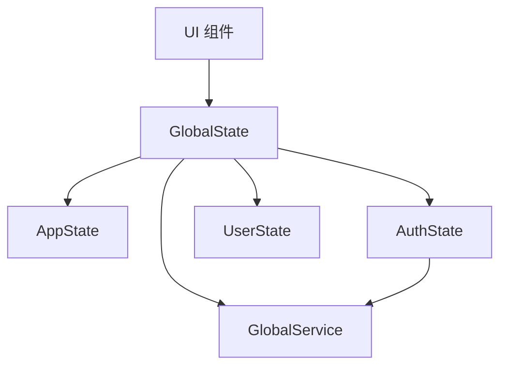

# 应用状态管理

<cite>
**本文引用的文件**
- [client/app/lib/global/state/app.dart](file://client/app/lib/global/state/app.dart)
- [client/app/lib/global/state.dart](file://client/app/lib/global/state.dart)
- [client/app/lib/global/state/auth.dart](file://client/app/lib/global/state/auth.dart)
- [client/app/lib/global/state/user.dart](file://client/app/lib/global/state/user.dart)
- [client/app/lib/global/service.dart](file://client/app/lib/global/service.dart)
- [client/app/lib/main.dart](file://client/app/lib/main.dart)
- [client/app/lib/pages/index/index.dart](file://client/app/lib/pages/index/index.dart)
- [client/app/lib/pages/home/home_view.dart](file://client/app/lib/pages/home/home_view.dart)
- [client/app/lib/util/dialog.dart](file://client/app/lib/util/dialog.dart)
- [client/web/src/plugin/i18n.ts](file://client/web/src/plugin/i18n.ts)
- [client/app/lib/translations/app_translations.dart](file://client/app/lib/translations/app_translations.dart)
- [client/uniapp/src/locale/index.ts](file://client/uniapp/src/locale/index.ts)
- [client/uniapp/src/api/i18n.ts](file://client/uniapp/src/api/i18n.ts)
</cite>

## 目录
1. [简介](#简介)
2. [项目结构](#项目结构)
3. [核心组件](#核心组件)
4. [架构总览](#架构总览)
5. [组件详解](#组件详解)
6. [依赖关系分析](#依赖关系分析)
7. [性能考量](#性能考量)
8. [故障排查指南](#故障排查指南)
9. [结论](#结论)
10. [附录](#附录)

## 简介
本文件围绕 Hoper 应用的状态管理进行系统性技术说明，重点覆盖以下方面：
- AppState 类的设计与实现：应用启动流程、环境配置与调试模式控制
- 应用级状态管理：主题切换、语言国际化、设备信息采集等
- 状态持久化策略、状态恢复机制与内存管理
- 使用示例：状态监听、状态更新与状态重置
- 调试技巧与性能优化建议

## 项目结构
Hoper 客户端采用多平台并行开发，状态管理主要集中在 Flutter 客户端的全局状态模块，同时 Web 与 UniApp 侧分别提供各自的国际化与运行时配置能力。

图表来源
- [client/app/lib/global/state.dart:19-46](file://client/app/lib/global/state.dart#L19-L46)
- [client/app/lib/global/state/app.dart:3-19](file://client/app/lib/global/state/app.dart#L3-L19)
- [client/app/lib/global/state/auth.dart:18-68](file://client/app/lib/global/state/auth.dart#L18-L68)
- [client/app/lib/global/state/user.dart:7-24](file://client/app/lib/global/state/user.dart#L7-L24)
- [client/app/lib/global/service.dart:21-83](file://client/app/lib/global/service.dart#L21-L83)
- [client/app/lib/main.dart:30-62](file://client/app/lib/main.dart#L30-L62)
- [client/app/lib/pages/home/home_view.dart:81-97](file://client/app/lib/pages/home/home_view.dart#L81-L97)
- [client/app/lib/pages/index/index.dart:95-99](file://client/app/lib/pages/index/index.dart#L95-L99)
- [client/app/lib/util/dialog.dart:32-36](file://client/app/lib/util/dialog.dart#L32-L36)
- [client/web/src/plugin/i18n.ts:104-114](file://client/web/src/plugin/i18n.ts#L104-L114)
- [client/app/lib/translations/app_translations.dart:7-13](file://client/app/lib/translations/app_translations.dart#L7-L13)
- [client/uniapp/src/locale/index.ts:25-30](file://client/uniapp/src/locale/index.ts#L25-L30)
- [client/uniapp/src/api/i18n.ts:10-13](file://client/uniapp/src/api/i18n.ts#L10-L13)

章节来源
- [client/app/lib/global/state.dart:19-46](file://client/app/lib/global/state.dart#L19-L46)
- [client/app/lib/global/service.dart:44-83](file://client/app/lib/global/service.dart#L44-L83)

## 核心组件
- GlobalState：单例全局状态控制器，聚合 AppState/AuthState/UserState，负责应用初始化、设备信息采集与主题状态等
- AppState：应用级配置与调试相关状态，包含调试模式标志与应用打开次数统计
- AuthState：认证态管理，负责登录、登出、Token 注入、用户信息获取与持久化
- UserState：用户数据缓存，基于内存映射维护用户基础信息
- GlobalService：统一的服务与持久化入口，负责 Hive Box、SharedPreferences、SQLite、日志与拦截器初始化

章节来源
- [client/app/lib/global/state.dart:19-46](file://client/app/lib/global/state.dart#L19-L46)
- [client/app/lib/global/state/app.dart:3-19](file://client/app/lib/global/state/app.dart#L3-L19)
- [client/app/lib/global/state/auth.dart:18-68](file://client/app/lib/global/state/auth.dart#L18-L68)
- [client/app/lib/global/state/user.dart:7-24](file://client/app/lib/global/state/user.dart#L7-L24)
- [client/app/lib/global/service.dart:21-83](file://client/app/lib/global/service.dart#L21-L83)

## 架构总览
下面以序列图展示应用启动与状态初始化的关键流程：

图表来源
- [client/app/lib/main.dart:30-62](file://client/app/lib/main.dart#L30-L62)
- [client/app/lib/global/state.dart:39-46](file://client/app/lib/global/state.dart#L39-L46)
- [client/app/lib/global/service.dart:44-83](file://client/app/lib/global/service.dart#L44-L83)
- [client/app/lib/global/state/app.dart:16-19](file://client/app/lib/global/state/app.dart#L16-L19)
- [client/app/lib/global/state/auth.dart:31-47](file://client/app/lib/global/state/auth.dart#L31-L47)

## 组件详解

### AppState 设计与实现
- 调试模式控制：通过静态布尔值控制调试行为，影响主题默认值等
- 应用打开次数统计：使用 Hive Box 存储键值，每次启动自增
- 初始化入口：提供 init 方法用于启动阶段的统计更新

图表来源
- [client/app/lib/global/state/app.dart:3-19](file://client/app/lib/global/state/app.dart#L3-L19)
- [client/app/lib/global/service.dart:39-42](file://client/app/lib/global/service.dart#L39-L42)

章节来源
- [client/app/lib/global/state/app.dart:3-19](file://client/app/lib/global/state/app.dart#L3-L19)

### GlobalState：应用级状态聚合与初始化
- 单例模式：通过私有构造与静态实例保证全局唯一
- 初始化流程：按顺序初始化服务层、认证态、设备信息
- 主题状态：基于 AppState.isDebug 的观察型变量，支持主题切换监听
- 设备信息采集：跨平台读取 Android/iOS/Linux/macOS/Windows/Web 浏览器信息

图表来源
- [client/app/lib/global/state.dart:39-46](file://client/app/lib/global/state.dart#L39-L46)
- [client/app/lib/global/service.dart:44-83](file://client/app/lib/global/service.dart#L44-L83)
- [client/app/lib/global/state/auth.dart:31-47](file://client/app/lib/global/state/auth.dart#L31-L47)

章节来源
- [client/app/lib/global/state.dart:19-46](file://client/app/lib/global/state.dart#L19-L46)

### AuthState：认证态与 Token 管理
- 账户与认证信息持久化：使用 Box 存储账号、认证信息键
- 登录流程：调用 gRPC 登录接口，成功后设置 Token 并刷新客户端 CallOptions
- 登出流程：清理认证信息、移除请求头、重置 gRPC CallOptions，并重启应用
- 自动校验：若存在认证键则尝试验证并填充用户信息

图表来源
- [client/app/lib/global/state/auth.dart:70-105](file://client/app/lib/global/state/auth.dart#L70-L105)
- [client/app/lib/global/service.dart:30-36](file://client/app/lib/global/service.dart#L30-L36)

章节来源
- [client/app/lib/global/state/auth.dart:18-105](file://client/app/lib/global/state/auth.dart#L18-L105)

### UserState：用户数据缓存
- 内存映射：维护用户基础信息字典，便于快速查询
- 追加与更新：支持批量追加与单条更新

图表来源
- [client/app/lib/global/state/user.dart:7-24](file://client/app/lib/global/state/user.dart#L7-L24)

章节来源
- [client/app/lib/global/state/user.dart:7-24](file://client/app/lib/global/state/user.dart#L7-L24)

### GlobalService：服务与持久化
- 统一初始化：日志、Hive Box、SQLite、SharedPreferences、拦截器
- gRPC 客户端：通过 Subject 动态下发 CallOptions，实现全局请求头与超时控制
- 缓存管理：提供默认缓存管理器

图表来源
- [client/app/lib/global/service.dart:21-83](file://client/app/lib/global/service.dart#L21-L83)

章节来源
- [client/app/lib/global/service.dart:21-83](file://client/app/lib/global/service.dart#L21-L83)

### 主题切换与国际化集成
- 主题切换：通过 GlobalState.isDarkMode.obs 控制 ThemeMode；UI 层根据其值选择深浅主题
- 国际化：
  - Flutter：GetX Translations 提供多语言键值
  - Web：Vue-i18n 结合 YAML 语言包与动态合并
  - UniApp：基于本地 JSON 与服务端拉取的语言包合并

图表来源
- [client/app/lib/global/state.dart:48-48](file://client/app/lib/global/state.dart#L48-L48)
- [client/app/lib/main.dart:30-62](file://client/app/lib/main.dart#L30-L62)
- [client/app/lib/pages/home/home_view.dart:81-97](file://client/app/lib/pages/home/home_view.dart#L81-L97)
- [client/app/lib/pages/index/index.dart:95-99](file://client/app/lib/pages/index/index.dart#L95-L99)
- [client/app/lib/translations/app_translations.dart:7-13](file://client/app/lib/translations/app_translations.dart#L7-L13)
- [client/web/src/plugin/i18n.ts:104-114](file://client/web/src/plugin/i18n.ts#L104-L114)
- [client/uniapp/src/locale/index.ts:25-30](file://client/uniapp/src/locale/index.ts#L25-L30)
- [client/uniapp/src/api/i18n.ts:10-13](file://client/uniapp/src/api/i18n.ts#L10-L13)

章节来源
- [client/app/lib/global/state.dart:48-48](file://client/app/lib/global/state.dart#L48-L48)
- [client/app/lib/main.dart:30-62](file://client/app/lib/main.dart#L30-L62)
- [client/app/lib/pages/index/index.dart:95-99](file://client/app/lib/pages/index/index.dart#L95-L99)
- [client/app/lib/pages/home/home_view.dart:81-97](file://client/app/lib/pages/home/home_view.dart#L81-L97)
- [client/app/lib/translations/app_translations.dart:7-13](file://client/app/lib/translations/app_translations.dart#L7-L13)
- [client/web/src/plugin/i18n.ts:104-114](file://client/web/src/plugin/i18n.ts#L104-L114)
- [client/uniapp/src/locale/index.ts:25-30](file://client/uniapp/src/locale/index.ts#L25-L30)
- [client/uniapp/src/api/i18n.ts:10-13](file://client/uniapp/src/api/i18n.ts#L10-L13)

## 依赖关系分析
- 组件耦合
  - GlobalState 依赖 GlobalService、AppState、AuthState、UserState
  - AuthState 依赖 GlobalService 的 gRPC 客户端与 Box
  - UI 层依赖 GlobalState 的观察型状态进行渲染与交互
- 外部依赖
  - GetX：状态响应式与依赖注入
  - Hive/SQFlite/SharedPreferences：本地持久化
  - grpc/dio：网络通信与拦截器
  - device_info_plus：跨平台设备信息采集

图表来源
- [client/app/lib/global/state.dart:19-46](file://client/app/lib/global/state.dart#L19-L46)
- [client/app/lib/global/state/auth.dart:18-68](file://client/app/lib/global/state/auth.dart#L18-L68)
- [client/app/lib/global/service.dart:30-36](file://client/app/lib/global/service.dart#L30-L36)

章节来源
- [client/app/lib/global/state.dart:19-46](file://client/app/lib/global/state.dart#L19-L46)
- [client/app/lib/global/state/auth.dart:18-68](file://client/app/lib/global/state/auth.dart#L18-L68)
- [client/app/lib/global/service.dart:30-36](file://client/app/lib/global/service.dart#L30-L36)

## 性能考量
- 响应式更新粒度：使用 obs 包裹轻量状态，避免不必要的重建
- 异步初始化：将网络与数据库初始化放入 Future.wait，减少首屏阻塞
- 缓存策略：合理利用缓存管理器与 Box，避免频繁 IO
- 主题切换：仅在必要时触发重建，避免深层树的重复渲染
- 网络层：通过 Subject 动态下发 CallOptions，集中管理超时与头部，降低分散配置成本

## 故障排查指南
- 登录失败
  - 检查 AuthState.login 的错误分支与 toast 提示
  - 确认 GlobalService.userClient 的 stub 调用与 Token 注入
- 登出异常
  - 确认 headers 清理与 CallOptions 重置
  - 观察是否正确触发应用重启
- 主题不生效
  - 检查 GlobalState.isDarkMode 的值与 UI 层绑定
  - 确认 main.dart 的 ThemeMode 配置
- 设备信息为空
  - 确认 initPlatformState 是否被调用
  - 检查各平台分支的读取逻辑
- 国际化未生效
  - Flutter：确认 AppTranslation 的键值与当前 locale
  - Web：确认 i18n.ts 的 locale 与 messages 合并
  - UniApp：确认本地 JSON 与动态拉取语言包合并逻辑

章节来源
- [client/app/lib/global/state/auth.dart:70-105](file://client/app/lib/global/state/auth.dart#L70-L105)
- [client/app/lib/global/service.dart:30-36](file://client/app/lib/global/service.dart#L30-L36)
- [client/app/lib/main.dart:30-62](file://client/app/lib/main.dart#L30-L62)
- [client/app/lib/global/state.dart:50-69](file://client/app/lib/global/state.dart#L50-L69)
- [client/app/lib/translations/app_translations.dart:7-13](file://client/app/lib/translations/app_translations.dart#L7-L13)
- [client/web/src/plugin/i18n.ts:104-114](file://client/web/src/plugin/i18n.ts#L104-L114)
- [client/uniapp/src/locale/index.ts:25-30](file://client/uniapp/src/locale/index.ts#L25-L30)
- [client/uniapp/src/api/i18n.ts:10-13](file://client/uniapp/src/api/i18n.ts#L10-L13)

## 结论
Hoper 的状态管理以 GlobalState 为核心，结合 AppState/AuthState/UserState 实现了从应用启动到认证、主题与国际化的完整闭环。通过 GlobalService 统一管理持久化与网络层，配合 GetX 的响应式机制，既保证了可维护性，也为扩展与优化提供了清晰的边界。

## 附录

### 使用示例（路径指引）
- 监听主题状态
  - 在 UI 中访问：[client/app/lib/pages/index/index.dart:95-99](file://client/app/lib/pages/index/index.dart#L95-L99)
  - 应用入口绑定：[client/app/lib/main.dart:30-62](file://client/app/lib/main.dart#L30-L62)
- 更新应用打开次数
  - 在启动流程调用：[client/app/lib/global/state/app.dart:16-19](file://client/app/lib/global/state/app.dart#L16-L19)
  - 初始化入口：[client/app/lib/global/state.dart:39-46](file://client/app/lib/global/state.dart#L39-L46)
- 登录与登出
  - 登录流程：[client/app/lib/global/state/auth.dart:70-87](file://client/app/lib/global/state/auth.dart#L70-L87)
  - 登出流程：[client/app/lib/global/state/auth.dart:89-105](file://client/app/lib/global/state/auth.dart#L89-L105)
- 用户信息缓存
  - 追加与查询：[client/app/lib/global/state/user.dart:11-24](file://client/app/lib/global/state/user.dart#L11-L24)
- 国际化使用
  - Flutter 键值：[client/app/lib/translations/app_translations.dart:7-13](file://client/app/lib/translations/app_translations.dart#L7-L13)
  - Web 动态语言包：[client/web/src/plugin/i18n.ts:104-114](file://client/web/src/plugin/i18n.ts#L104-L114)
  - UniApp 语言包合并：[client/uniapp/src/locale/index.ts:25-37](file://client/uniapp/src/locale/index.ts#L25-L37)
  - 服务端拉取：[client/uniapp/src/api/i18n.ts:10-13](file://client/uniapp/src/api/i18n.ts#L10-L13)