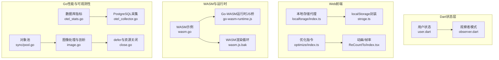
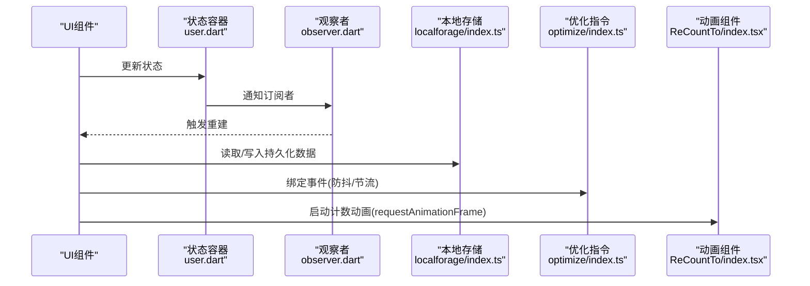
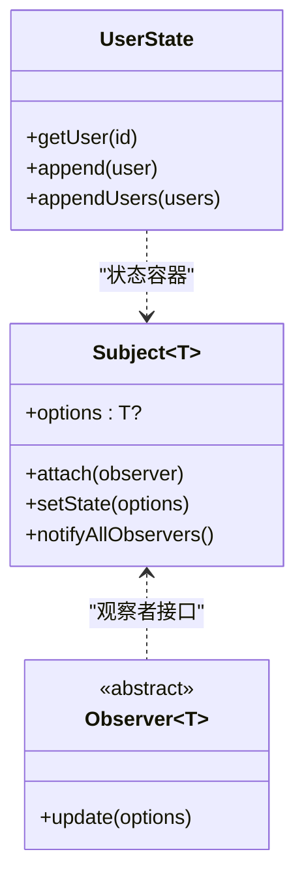
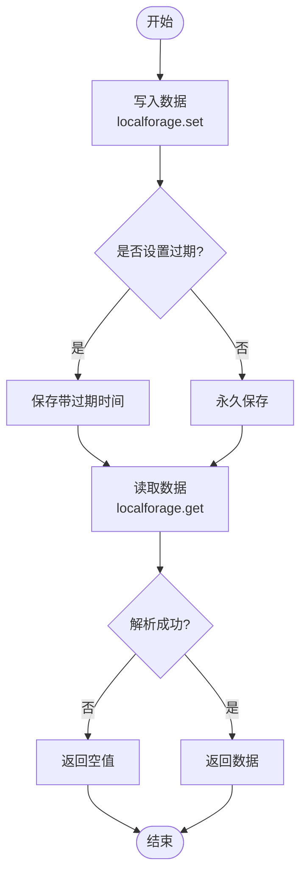
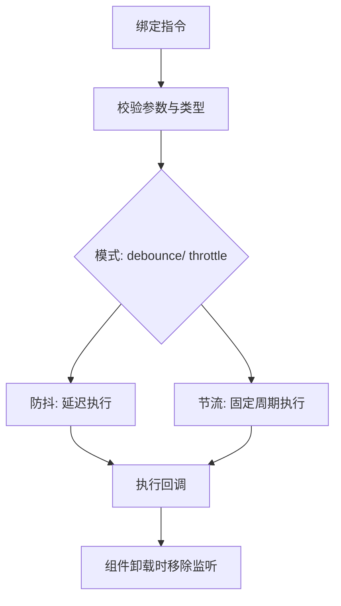
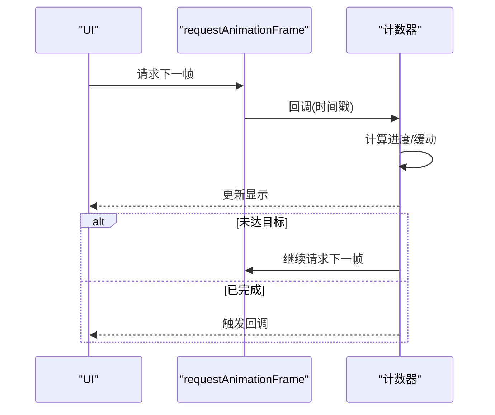
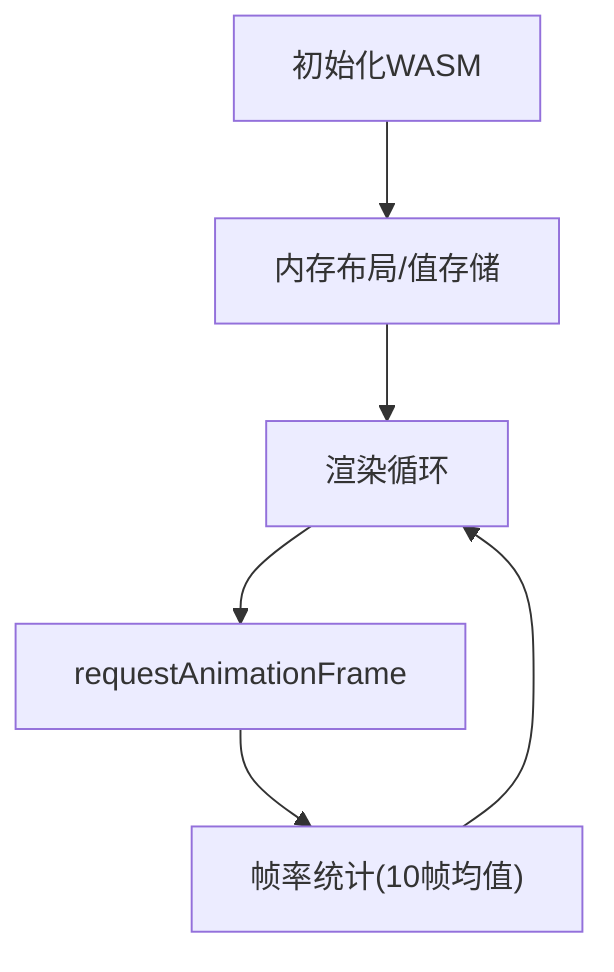
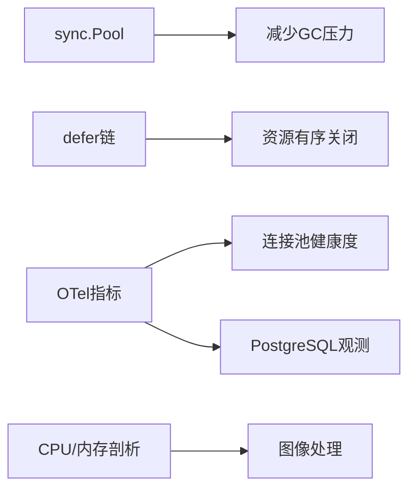
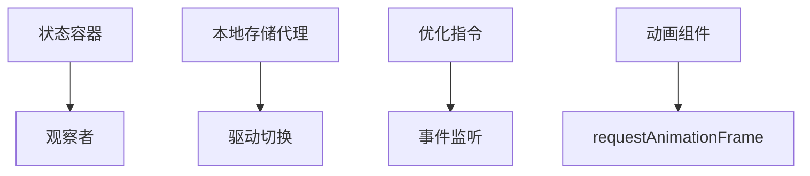

# 状态管理性能优化

<cite>
**本文引用的文件**
- [observer.dart](file://thirdparty/applib/lib/util/observer.dart)
- [user.dart](file://client/app/lib/global/state/user.dart)
- [index.ts](file://thirdparty/diamond/src/utils/localforage/index.ts)
- [types.d.ts](file://thirdparty/diamond/src/utils/localforage/types.d.ts)
- [optimize/index.ts](file://thirdparty/diamond/src/vue/directives/optimize/index.ts)
- [index.tsx](file://thirdparty/diamond/src/vue/ReCountTo/src/normal/index.tsx)
- [stroge.ts](file://client/web/src/utils/stroge.ts)
- [wasm.go](file://awesome/lang/go/custom/wasm/repulsion/wasm.go)
- [wasm.js.bak](file://client/web/src/components/wasm/wasm.js.bak)
- [go-wasm-runtime.js](file://client/web/src/utils/service/go-wasm-runtime.js)
- [image.go](file://awesome/lang/go/custom/media/image/image.go)
- [close.go](file://awesome/lang/go/lang/runtime/defer/close.go)
- [pool.go](file://thirdparty/gox/sync/pool.go)
- [otel_stats.go](file://thirdparty/gox/database/sql/otel_stats.go)
- [otel_collector.go](file://thirdparty/gox/database/sql/postgres/otel_collector.go)
- [sample.dart](file://client/app/lib/components/sample.dart)
</cite>

## 目录
1. [简介](#简介)
2. [项目结构](#项目结构)
3. [核心组件](#核心组件)
4. [架构总览](#架构总览)
5. [详细组件分析](#详细组件分析)
6. [依赖分析](#依赖分析)
7. [性能考量](#性能考量)
8. [故障排查指南](#故障排查指南)
9. [结论](#结论)
10. [附录](#附录)

## 简介
本文件面向Hoper状态管理性能优化，聚焦以下目标：
- 状态更新频率控制：通过防抖/节流、批处理与订阅粒度优化，降低无效渲染与计算。
- 内存使用优化：对象池复用、及时释放、避免内存泄漏与大对象常驻。
- 渲染性能提升：帧率监控、动画节流、最小化重建范围。
- GetX框架性能特性：状态订阅优化、自动释放与垃圾回收策略。
- 状态持久化性能：序列化开销、存储介质选择、懒加载与批量读取。
- 性能监控与调试：状态变更追踪、内存泄漏检测、性能分析技巧与最佳实践。

## 项目结构
围绕状态管理与性能优化，本仓库涉及以下关键模块：
- Dart侧状态模型与观察者模式：用于定义状态结构与订阅更新。
- Web前端本地存储与持久化：基于localforage与localStorage，支持过期与类型安全。
- Vue优化指令：防抖/节流指令，减少高频事件触发。
- 动画与渲染性能：requestAnimationFrame计数器与帧率统计。
- WASM运行时与Go-WASM桥接：内存布局与值存储策略。
- Go运行时与性能剖析：CPU/内存剖析、GC与内存使用打印。
- 数据库可观测性：连接池指标与PostgreSQL观测采集。
- Flutter示例：状态重建与UI更新流程。

**图表来源**
- [user.dart:1-25](file://client/app/lib/global/state/user.dart#L1-L25)
- [observer.dart:1-26](file://thirdparty/applib/lib/util/observer.dart#L1-L26)
- [index.ts:1-110](file://thirdparty/diamond/src/utils/localforage/index.ts#L1-L110)
- [stroge.ts:1-22](file://client/web/src/utils/stroge.ts#L1-L22)
- [optimize/index.ts:1-69](file://thirdparty/diamond/src/vue/directives/optimize/index.ts#L1-L69)
- [index.tsx:47-141](file://thirdparty/diamond/src/vue/ReCountTo/src/normal/index.tsx#L47-L141)
- [wasm.go:57-105](file://awesome/lang/go/custom/wasm/repulsion/wasm.go#L57-L105)
- [go-wasm-runtime.js:68-100](file://client/web/src/utils/service/go-wasm-runtime.js#L68-L100)
- [wasm.js.bak:60-82](file://client/web/src/components/wasm/wasm.js.bak#L60-L82)
- [pool.go:1-27](file://thirdparty/gox/sync/pool.go#L1-L27)
- [otel_stats.go:101-137](file://thirdparty/gox/database/sql/otel_stats.go#L101-L137)
- [otel_collector.go:61-107](file://thirdparty/gox/database/sql/postgres/otel_collector.go#L61-L107)
- [image.go:16-41](file://awesome/lang/go/custom/media/image/image.go#L16-L41)
- [close.go:1-41](file://awesome/lang/go/lang/runtime/defer/close.go#L1-L41)

**章节来源**
- [user.dart:1-25](file://client/app/lib/global/state/user.dart#L1-L25)
- [observer.dart:1-26](file://thirdparty/applib/lib/util/observer.dart#L1-L26)
- [index.ts:1-110](file://thirdparty/diamond/src/utils/localforage/index.ts#L1-L110)
- [stroge.ts:1-22](file://client/web/src/utils/stroge.ts#L1-L22)
- [optimize/index.ts:1-69](file://thirdparty/diamond/src/vue/directives/optimize/index.ts#L1-L69)
- [index.tsx:47-141](file://thirdparty/diamond/src/vue/ReCountTo/src/normal/index.tsx#L47-L141)
- [wasm.go:57-105](file://awesome/lang/go/custom/wasm/repulsion/wasm.go#L57-L105)
- [go-wasm-runtime.js:68-100](file://client/web/src/utils/service/go-wasm-runtime.js#L68-L100)
- [wasm.js.bak:60-82](file://client/web/src/components/wasm/wasm.js.bak#L60-L82)
- [pool.go:1-27](file://thirdparty/gox/sync/pool.go#L1-L27)
- [otel_stats.go:101-137](file://thirdparty/gox/database/sql/otel_stats.go#L101-L137)
- [otel_collector.go:61-107](file://thirdparty/gox/database/sql/postgres/otel_collector.go#L61-L107)
- [image.go:16-41](file://awesome/lang/go/custom/media/image/image.go#L16-L41)
- [close.go:1-41](file://awesome/lang/go/lang/runtime/defer/close.go#L1-L41)

## 核心组件
- 观察者模式与状态容器
  - 观察者模式用于解耦状态变更与UI更新，避免全量重建。
  - 用户状态容器提供按ID访问与批量追加能力，便于减少重复查找与合并。
- 本地存储与持久化
  - localforage代理封装了IndexedDB与localStorage，支持过期时间与类型安全。
  - localStorage封装提供JSON序列化与异常兜底。
- Vue优化指令
  - v-optimize指令支持防抖与节流，可显著降低高频事件对渲染的影响。
- 动画与帧率监控
  - ReCountTo组件使用requestAnimationFrame进行平滑计数，并在边界值处停止回调。
  - WASM示例中通过10帧平均计算FPS，辅助渲染性能评估。
- WASM运行时与Go桥接
  - 提供64位整数读写与NaN处理，以及值存储与内存布局策略。
- Go性能与可观测性
  - 对象池减少频繁分配与GC压力；数据库指标与PostgreSQL采集提供连接池健康度。
  - 图像处理示例展示CPU/内存剖析与内存使用打印；defer资源关闭确保清理顺序。

**章节来源**
- [observer.dart:3-24](file://thirdparty/applib/lib/util/observer.dart#L3-L24)
- [user.dart:7-25](file://client/app/lib/global/state/user.dart#L7-L25)
- [index.ts:4-13](file://thirdparty/diamond/src/utils/localforage/index.ts#L4-L13)
- [index.ts:21-35](file://thirdparty/diamond/src/utils/localforage/index.ts#L21-L35)
- [stroge.ts:2-22](file://client/web/src/utils/stroge.ts#L2-L22)
- [optimize/index.ts:24-68](file://thirdparty/diamond/src/vue/directives/optimize/index.ts#L24-L68)
- [index.tsx:47-141](file://thirdparty/diamond/src/vue/ReCountTo/src/normal/index.tsx#L47-L141)
- [wasm.go:81-105](file://awesome/lang/go/custom/wasm/repulsion/wasm.go#L81-L105)
- [go-wasm-runtime.js:68-100](file://client/web/src/utils/service/go-wasm-runtime.js#L68-L100)
- [pool.go:5-27](file://thirdparty/gox/sync/pool.go#L5-L27)
- [otel_stats.go:101-137](file://thirdparty/gox/database/sql/otel_stats.go#L101-L137)
- [otel_collector.go:70-81](file://thirdparty/gox/database/sql/postgres/otel_collector.go#L70-L81)
- [image.go:16-41](file://awesome/lang/go/custom/media/image/image.go#L16-L41)
- [close.go:15-40](file://awesome/lang/go/lang/runtime/defer/close.go#L15-L40)

## 架构总览
下图展示了状态管理与性能优化的关键交互路径：状态容器通过观察者模式通知订阅者；持久化层负责数据落盘与恢复；前端优化指令与动画组件降低渲染压力；WASM与Go运行时支撑高性能计算与内存布局；可观测性模块提供数据库与运行时指标。

**图表来源**
- [user.dart:7-25](file://client/app/lib/global/state/user.dart#L7-L25)
- [observer.dart:8-19](file://thirdparty/applib/lib/util/observer.dart#L8-L19)
- [index.ts:21-54](file://thirdparty/diamond/src/utils/localforage/index.ts#L21-L54)
- [optimize/index.ts:24-68](file://thirdparty/diamond/src/vue/directives/optimize/index.ts#L24-L68)
- [index.tsx:47-141](file://thirdparty/diamond/src/vue/ReCountTo/src/normal/index.tsx#L47-L141)

## 详细组件分析

### 观察者模式与状态容器
- 设计要点
  - Subject维护观察者列表与状态快照，setState触发全量通知。
  - 容器类提供按ID查询与批量追加，减少重复查找与合并成本。
- 性能影响
  - 全量通知可能导致不必要的重建；建议结合订阅粒度与不可变更新策略。
  - 批量追加优于逐条更新，降低遍历与通知次数。

**图表来源**
- [observer.dart:3-24](file://thirdparty/applib/lib/util/observer.dart#L3-L24)
- [user.dart:7-25](file://client/app/lib/global/state/user.dart#L7-L25)

**章节来源**
- [observer.dart:3-24](file://thirdparty/applib/lib/util/observer.dart#L3-L24)
- [user.dart:7-25](file://client/app/lib/global/state/user.dart#L7-L25)

### 本地存储与持久化
- 设计要点
  - localforage优先使用IndexedDB，降级至localStorage；支持过期时间与类型安全。
  - localStorage封装提供JSON序列化与异常兜底，避免解析失败导致崩溃。
- 性能考虑
  - IndexedDB吞吐更高，适合大体量数据；localStorage适合小数据与兼容性需求。
  - 过期时间避免无界增长；批量读写优于多次小事务。
  - 序列化/反序列化为CPU开销，建议压缩或二进制存储（如适用）。

**图表来源**
- [index.ts:21-54](file://thirdparty/diamond/src/utils/localforage/index.ts#L21-L54)
- [stroge.ts:2-22](file://client/web/src/utils/stroge.ts#L2-L22)

**章节来源**
- [index.ts:4-13](file://thirdparty/diamond/src/utils/localforage/index.ts#L4-L13)
- [index.ts:21-54](file://thirdparty/diamond/src/utils/localforage/index.ts#L21-L54)
- [types.d.ts:145-166](file://thirdparty/diamond/src/utils/localforage/types.d.ts#L145-L166)
- [stroge.ts:2-22](file://client/web/src/utils/stroge.ts#L2-L22)

### Vue优化指令（防抖/节流）
- 设计要点
  - v-optimize支持debounce与throttle两种模式，默认超时不同。
  - 自动注册与卸载事件监听，避免内存泄漏。
- 性能收益
  - 降低滚动、输入、窗口resize等高频事件的处理频率。
  - 通过参数数组/对象统一传参，简化业务逻辑。

**图表来源**
- [optimize/index.ts:24-68](file://thirdparty/diamond/src/vue/directives/optimize/index.ts#L24-L68)

**章节来源**
- [optimize/index.ts:11-22](file://thirdparty/diamond/src/vue/directives/optimize/index.ts#L11-L22)
- [optimize/index.ts:24-68](file://thirdparty/diamond/src/vue/directives/optimize/index.ts#L24-L68)

### 动画与帧率监控
- 设计要点
  - 使用requestAnimationFrame进行计数动画，支持缓动与暂停/恢复。
  - WASM示例中以10帧为窗口计算平均FPS，便于实时反馈。
- 性能建议
  - 控制动画帧率与缓动函数复杂度，避免主线程阻塞。
  - 在窗口失焦或后台标签页降低刷新频率。

**图表来源**
- [index.tsx:93-141](file://thirdparty/diamond/src/vue/ReCountTo/src/normal/index.tsx#L93-L141)
- [wasm.go:81-105](file://awesome/lang/go/custom/wasm/repulsion/wasm.go#L81-L105)

**章节来源**
- [index.tsx:47-141](file://thirdparty/diamond/src/vue/ReCountTo/src/normal/index.tsx#L47-L141)
- [wasm.go:57-105](file://awesome/lang/go/custom/wasm/repulsion/wasm.go#L57-L105)

### WASM运行时与Go桥接
- 设计要点
  - 提供64位整数读写、NaN处理与值存储策略，支撑高性能数值计算。
  - 渲染循环通过requestAnimationFrame驱动，配合帧率统计。
- 性能建议
  - 合理划分内存布局，避免频繁跨语言调用。
  - 使用对象池与共享缓冲区减少分配与拷贝。

**图表来源**
- [go-wasm-runtime.js:68-100](file://client/web/src/utils/service/go-wasm-runtime.js#L68-L100)
- [wasm.go:81-105](file://awesome/lang/go/custom/wasm/repulsion/wasm.go#L81-L105)
- [wasm.js.bak:60-82](file://client/web/src/components/wasm/wasm.js.bak#L60-L82)

**章节来源**
- [go-wasm-runtime.js:68-100](file://client/web/src/utils/service/go-wasm-runtime.js#L68-L100)
- [wasm.go:57-105](file://awesome/lang/go/custom/wasm/repulsion/wasm.go#L57-L105)
- [wasm.js.bak:60-82](file://client/web/src/components/wasm/wasm.js.bak#L60-L82)

### Go性能与可观测性
- 设计要点
  - sync.Pool对象池减少分配与GC压力；defer链保证资源有序释放。
  - OTel指标采集数据库连接池状态与PostgreSQL关键指标。
  - 图像处理示例展示CPU/内存剖析与内存使用打印。
- 性能建议
  - 对热点对象启用对象池；对长生命周期资源使用defer链。
  - 通过OTel指标定位连接池瓶颈与慢查询。

**图表来源**
- [pool.go:5-27](file://thirdparty/gox/sync/pool.go#L5-L27)
- [close.go:15-40](file://awesome/lang/go/lang/runtime/defer/close.go#L15-L40)
- [otel_stats.go:101-137](file://thirdparty/gox/database/sql/otel_stats.go#L101-L137)
- [otel_collector.go:70-81](file://thirdparty/gox/database/sql/postgres/otel_collector.go#L70-L81)
- [image.go:16-41](file://awesome/lang/go/custom/media/image/image.go#L16-L41)

**章节来源**
- [pool.go:1-27](file://thirdparty/gox/sync/pool.go#L1-L27)
- [close.go:1-41](file://awesome/lang/go/lang/runtime/defer/close.go#L1-L41)
- [otel_stats.go:101-137](file://thirdparty/gox/database/sql/otel_stats.go#L101-L137)
- [otel_collector.go:61-107](file://thirdparty/gox/database/sql/postgres/otel_collector.go#L61-L107)
- [image.go:16-41](file://awesome/lang/go/custom/media/image/image.go#L16-L41)

## 依赖分析
- 组件耦合
  - 状态容器与观察者模式低耦合，便于替换实现。
  - 本地存储代理与驱动切换解耦，利于迁移。
  - Vue指令与组件解耦，通过事件绑定实现横切关注点。
- 外部依赖
  - localforage与IndexedDB/LocalStorage；VueUse事件监听；浏览器API（requestAnimationFrame）。
- 潜在风险
  - 频繁全量通知可能引发过度重建；需细化订阅粒度。
  - localStorage解析异常需兜底；避免阻塞主线程。

**图表来源**
- [observer.dart:3-24](file://thirdparty/applib/lib/util/observer.dart#L3-L24)
- [index.ts:4-13](file://thirdparty/diamond/src/utils/localforage/index.ts#L4-L13)
- [optimize/index.ts:24-68](file://thirdparty/diamond/src/vue/directives/optimize/index.ts#L24-L68)
- [index.tsx:47-141](file://thirdparty/diamond/src/vue/ReCountTo/src/normal/index.tsx#L47-L141)

**章节来源**
- [observer.dart:3-24](file://thirdparty/applib/lib/util/observer.dart#L3-L24)
- [index.ts:4-13](file://thirdparty/diamond/src/utils/localforage/index.ts#L4-L13)
- [optimize/index.ts:24-68](file://thirdparty/diamond/src/vue/directives/optimize/index.ts#L24-L68)
- [index.tsx:47-141](file://thirdparty/diamond/src/vue/ReCountTo/src/normal/index.tsx#L47-L141)

## 性能考量
- 状态更新频率控制
  - 使用v-optimize指令对高频事件进行防抖/节流，减少状态变更频次。
  - 在容器层采用不可变更新与批处理，降低通知与重建成本。
- 内存使用优化
  - 对热点对象启用对象池，减少分配与GC压力。
  - defer链确保资源有序释放，避免泄漏。
  - localStorage序列化异常兜底，避免主线程卡顿。
- 渲染性能提升
  - requestAnimationFrame驱动动画，控制帧率与缓动复杂度。
  - WASM示例中通过10帧均值统计FPS，指导性能调优。
- GetX框架性能特性
  - 订阅粒度：仅订阅必要字段，避免全量重建。
  - 自动释放：组件销毁时自动取消订阅与定时器，防止泄漏。
  - 垃圾回收：结合对象池与defer链，降低GC负担。
- 状态持久化性能
  - 选择IndexedDB作为首选驱动，提高吞吐。
  - 设置合理过期时间，避免无限增长。
  - 批量读写与懒加载，减少I/O与解析开销。

[本节为通用性能建议，无需特定文件分析]

## 故障排查指南
- 状态变更追踪
  - 在观察者模式中增加日志埋点，记录setState调用与通知次数。
  - 使用Vue优化指令时检查事件绑定与参数传递是否正确。
- 内存泄漏检测
  - 检查defer链是否完整，确保资源有序释放。
  - 对象池使用前后对比分配次数与GC次数。
- 性能分析技巧
  - 使用浏览器性能面板与帧率统计，定位掉帧原因。
  - Go侧使用pprof进行CPU/内存剖析，结合内存使用打印定位热点。
- 实际案例
  - 本地存储解析异常：捕获JSON解析错误并回退到原始字符串。
  - 动画卡顿：降低帧率或简化缓动函数，必要时在后台标签页降频。
  - 数据库连接池瓶颈：通过OTel指标观察等待时长与连接数，调整池大小。

**章节来源**
- [close.go:15-40](file://awesome/lang/go/lang/runtime/defer/close.go#L15-L40)
- [image.go:16-41](file://awesome/lang/go/custom/media/image/image.go#L16-L41)
- [wasm.go:81-105](file://awesome/lang/go/custom/wasm/repulsion/wasm.go#L81-L105)
- [stroge.ts:2-22](file://client/web/src/utils/stroge.ts#L2-L22)
- [optimize/index.ts:24-68](file://thirdparty/diamond/src/vue/directives/optimize/index.ts#L24-L68)

## 结论
通过对状态容器、观察者模式、本地存储、前端优化指令、动画与渲染、WASM运行时、Go性能与可观测性的系统梳理，可以形成一套完整的状态管理性能优化体系。建议在工程实践中：
- 以订阅粒度与不可变更新为核心，减少无效重建；
- 以对象池与defer链为基础，降低GC与泄漏风险；
- 以防抖/节流与帧率监控为抓手，稳定渲染性能；
- 以IndexedDB与批量持久化为手段，提升IO效率；
- 以OTel与pprof为工具，持续定位瓶颈并验证优化效果。

[本节为总结性内容，无需特定文件分析]

## 附录
- 最佳实践清单
  - 状态层：细粒度订阅、不可变更新、批处理。
  - 存储层：首选IndexedDB、设置过期、批量读写。
  - 前端：高频事件防抖/节流、动画帧率控制。
  - 运行时：对象池、defer链、pprof剖析。
  - 可观测性：连接池指标、PostgreSQL观测、内存使用打印。

[本节为通用建议，无需特定文件分析]