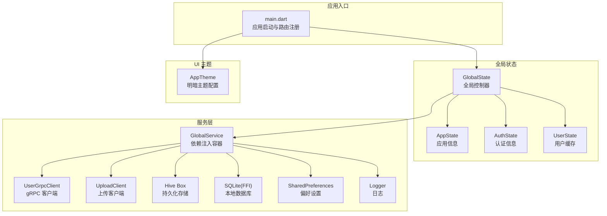
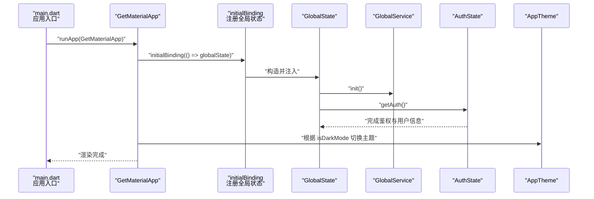
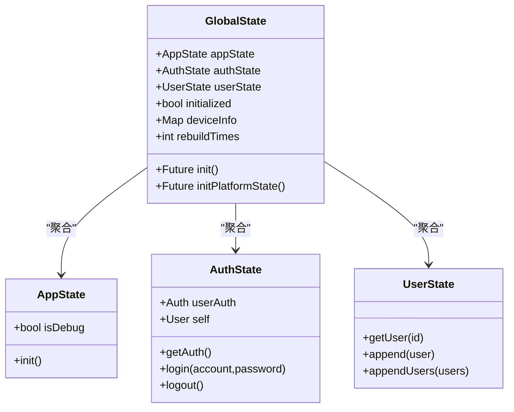
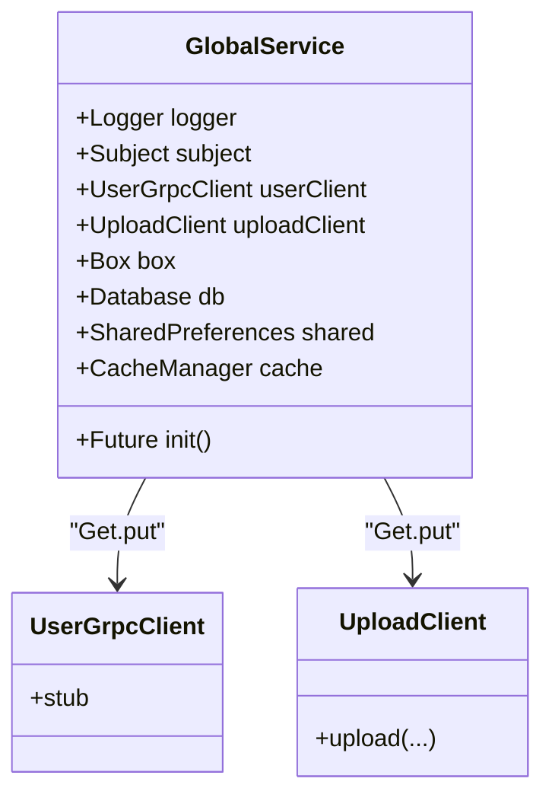
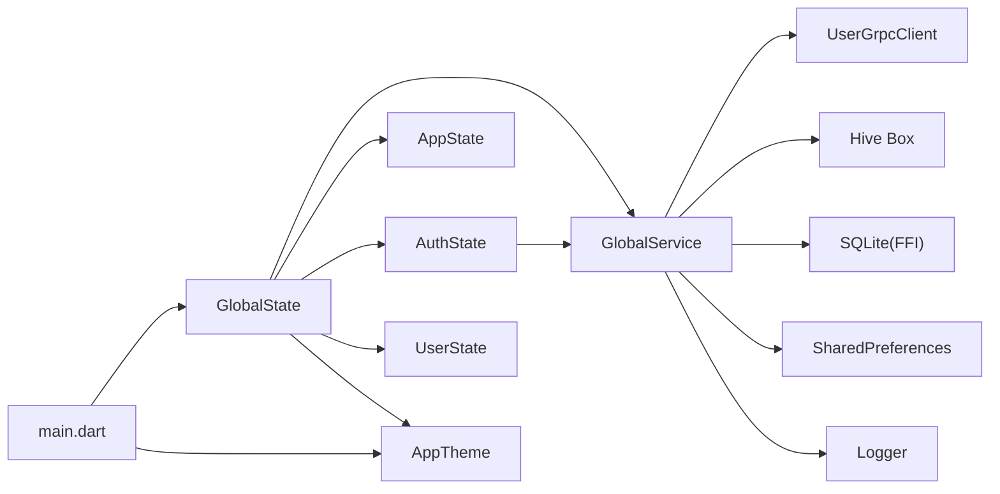

# 状态管理系统

<cite>
**本文引用的文件**
- [main.dart](file://client/app/lib/main.dart)
- [state.dart](file://client/app/lib/global/state.dart)
- [app.dart](file://client/app/lib/global/state/app.dart)
- [auth.dart](file://client/app/lib/global/state/auth.dart)
- [user.dart](file://client/app/lib/global/state/user.dart)
- [service.dart](file://client/app/lib/global/service.dart)
- [theme.dart](file://client/app/lib/global/theme.dart)
- [const.dart](file://client/app/lib/global/const.dart)
</cite>

## 目录
1. [简介](#简介)
2. [项目结构](#项目结构)
3. [核心组件](#核心组件)
4. [架构总览](#架构总览)
5. [详细组件分析](#详细组件分析)
6. [依赖关系分析](#依赖关系分析)
7. [性能考量](#性能考量)
8. [故障排查指南](#故障排查指南)
9. [结论](#结论)
10. [附录](#附录)

## 简介
本技术文档围绕 Hoper Flutter 应用中的状态管理子系统展开，系统以 GetX 为核心，结合 RxJS 风格的响应式状态、控制器生命周期与依赖注入机制，构建了清晰的全局状态模型。文档重点覆盖以下方面：
- 全局状态组织：GlobalState、AppState、AuthState、UserState 的职责划分与协作方式
- 响应式状态与订阅：通过 GetX 的 .obs 与 Subject 实现状态变化通知
- 控制器生命周期与初始化流程：init()、GetxController 生命周期钩子的使用
- 依赖注入与服务层：GlobalService 中对 RPC 客户端、缓存、数据库等的集中管理
- 状态持久化与同步：Hive Box、SharedPreferences、本地数据库的协同工作
- 性能优化与调试监控：日志体系、错误边界、主题切换与焦点管理等

## 项目结构
本状态管理相关代码主要位于 client/app/lib/global 目录下，采用“按功能域划分”的模块化组织方式：
- global/state：全局状态控制器与领域状态（AppState、AuthState、UserState）
- global/service.dart：全局服务容器，负责依赖注入与基础设施初始化
- global/theme.dart：主题配置与平台适配
- global/const.dart：常量定义（如基础地址、鉴权头名）



图表来源
- [main.dart:17-70](file://client/app/lib/main.dart#L17-L70)
- [state.dart:19-46](file://client/app/lib/global/state.dart#L19-L46)
- [service.dart:21-84](file://client/app/lib/global/service.dart#L21-L84)
- [theme.dart:69-72](file://client/app/lib/global/theme.dart#L69-L72)

章节来源
- [main.dart:17-70](file://client/app/lib/main.dart#L17-L70)
- [state.dart:19-46](file://client/app/lib/global/state.dart#L19-L46)
- [service.dart:21-84](file://client/app/lib/global/service.dart#L21-L84)
- [theme.dart:69-72](file://client/app/lib/global/theme.dart#L69-L72)

## 核心组件
本节从整体上梳理状态管理的核心构件及其职责：
- GlobalState：单例全局控制器，聚合 AppState、AuthState、UserState，并负责设备信息采集与主题观察
- AppState：应用级配置与统计（如打开次数），提供键空间前缀与初始化逻辑
- AuthState：认证上下文管理，负责登录、登出、鉴权头同步、用户信息获取与缓存
- UserState：轻量用户对象缓存，基于 Map 存储用户基础信息，便于跨组件复用
- GlobalService：依赖注入容器，统一管理 RPC 客户端、缓存、数据库、共享偏好、日志与 CallOptions 主题
- AppTheme：明/暗主题与平台字体适配

章节来源
- [state.dart:19-46](file://client/app/lib/global/state.dart#L19-L46)
- [app.dart:3-20](file://client/app/lib/global/state/app.dart#L3-L20)
- [auth.dart:18-113](file://client/app/lib/global/state/auth.dart#L18-L113)
- [user.dart:7-25](file://client/app/lib/global/state/user.dart#L7-L25)
- [service.dart:21-84](file://client/app/lib/global/service.dart#L21-L84)
- [theme.dart:69-72](file://client/app/lib/global/theme.dart#L69-L72)

## 架构总览
下图展示了应用启动到状态初始化的关键交互流程，包括 GetMaterialApp 注册、全局绑定、初始化顺序与主题切换。



图表来源
- [main.dart:29-51](file://client/app/lib/main.dart#L29-L51)
- [state.dart:39-46](file://client/app/lib/global/state.dart#L39-L46)
- [auth.dart:31-47](file://client/app/lib/global/state/auth.dart#L31-L47)

章节来源
- [main.dart:29-51](file://client/app/lib/main.dart#L29-L51)
- [state.dart:39-46](file://client/app/lib/global/state.dart#L39-L46)
- [auth.dart:31-47](file://client/app/lib/global/state/auth.dart#L31-L47)

## 详细组件分析

### GlobalState：全局状态控制器
- 单例模式：通过静态实例保证全局唯一性
- 聚合状态：持有 AppState、AuthState、UserState 三个领域状态
- 初始化：init() 并行初始化服务层，随后加载鉴权信息与设备信息
- 主题观察：isDarkMode 使用 .obs，配合 ThemeMode 动态切换
- 设备信息：按平台读取 Android/iOS/Linux/macOS/Windows/Web 的设备信息并归一化



图表来源
- [state.dart:19-46](file://client/app/lib/global/state.dart#L19-L46)
- [app.dart:3-20](file://client/app/lib/global/state/app.dart#L3-L20)
- [auth.dart:18-113](file://client/app/lib/global/state/auth.dart#L18-L113)
- [user.dart:7-25](file://client/app/lib/global/state/user.dart#L7-L25)

章节来源
- [state.dart:19-46](file://client/app/lib/global/state.dart#L19-L46)

### AppState：应用级状态
- 调试开关：isDebug 用于开发环境特性控制
- 打开次数统计：通过 Hive Box 记录应用启动次数，键空间前缀避免冲突
- 初始化：init() 读取并递增打开计数

章节来源
- [app.dart:3-20](file://client/app/lib/global/state/app.dart#L3-L20)

### AuthState：认证状态
- 鉴权信息：维护当前用户 Auth 与 UserBase 信息
- 登录流程：调用 gRPC 登录接口，成功后设置 Token 到 HTTP 与 gRPC 的 CallOptions，并持久化账户信息
- 登出流程：清理鉴权头与本地存储，调用后端登出接口，重启应用
- 自动恢复：启动时尝试从本地恢复 Token 并校验有效性
- 用户信息：支持获取当前用户详情并回填到 UserState

```mermaid
sequenceDiagram
participant UI as "界面"
participant AU as "AuthState"
participant RPC as "UserGrpcClient"
participant BOX as "Hive Box"
participant HC as "httpClient"
UI->>AU : "login(account,password)"
AU->>RPC : "stub.login(...)"
RPC-->>AU : "返回 token 与 user"
AU->>HC : "headers[Authorization]=token"
AU->>BOX : "持久化 token 与账户"
AU->>RPC : "authInfo(token)"
RPC-->>AU : "返回用户信息"
AU->>UI : "导航返回并重启应用"
```

图表来源
- [auth.dart:70-87](file://client/app/lib/global/state/auth.dart#L70-L87)
- [auth.dart:31-47](file://client/app/lib/global/state/auth.dart#L31-L47)

章节来源
- [auth.dart:18-113](file://client/app/lib/global/state/auth.dart#L18-L113)

### UserState：用户缓存
- 数据结构：以 Int64 为键的用户基础信息映射
- 写入策略：append() 与 appendUsers() 支持单个或批量写入
- 查询策略：getUser(id) 提供 O(1) 查找

章节来源
- [user.dart:7-25](file://client/app/lib/global/state/user.dart#L7-L25)

### GlobalService：依赖注入与基础设施
- 依赖注入：通过 Get.put 注册 gRPC 客户端与上传客户端
- 主题同步：Subject<CallOptions> 统一推送 CallOptions（含超时、鉴权头）到所有 RPC 请求
- 初始化：并行初始化 Hive Box、SQLite(FFI)、SharedPreferences，并挂载 HTTP 拦截器
- 日志：统一 Logger 实例，贯穿全局



图表来源
- [service.dart:21-84](file://client/app/lib/global/service.dart#L21-L84)

章节来源
- [service.dart:21-84](file://client/app/lib/global/service.dart#L21-L84)

### 主题与常量
- 主题：AppTheme.light/dark 提供明暗主题与平台字体适配；isDarkMode.obs 驱动 ThemeMode
- 常量：BASE_HOST/BASE_API_URL/BASE_STATIC_URL 与 Authorization 头名集中管理

章节来源
- [theme.dart:69-72](file://client/app/lib/global/theme.dart#L69-L72)
- [const.dart:1-5](file://client/app/lib/global/const.dart#L1-L5)

## 依赖关系分析
- 入口依赖：main.dart 依赖 GlobalState、AppTheme、路由与翻译
- 全局状态依赖：GlobalState 依赖 GlobalService、AppState、AuthState、UserState
- 认证依赖：AuthState 依赖 GlobalService 的用户 gRPC 客户端、Hive Box、HTTP 客户端
- 服务依赖：GlobalService 依赖 Get 注入、Hive、SQLite(FFI)、SharedPreferences、日志与拦截器
- 主题依赖：main.dart 与 GlobalState 共同驱动主题切换



图表来源
- [main.dart:17-70](file://client/app/lib/main.dart#L17-L70)
- [state.dart:19-46](file://client/app/lib/global/state.dart#L19-L46)
- [service.dart:21-84](file://client/app/lib/global/service.dart#L21-L84)

章节来源
- [main.dart:17-70](file://client/app/lib/main.dart#L17-L70)
- [state.dart:19-46](file://client/app/lib/global/state.dart#L19-L46)
- [service.dart:21-84](file://client/app/lib/global/service.dart#L21-L84)

## 性能考量
- 响应式更新粒度：通过 .obs 与 Subject 精准触发 UI 更新，避免全树重建
- 初始化并发：GlobalState.init() 与 GlobalService.init() 采用 Future.wait 并行初始化，缩短冷启动时间
- 本地缓存：Hive Box 与 SQLite(FFI) 提供快速读写，减少网络请求
- 主题切换：isDarkMode.obs 驱动 ThemeMode，避免重复渲染
- 网络拦截：统一拦截器与 CallOptions 主题，降低重复配置成本

## 故障排查指南
- 启动错误边界：main.dart 使用 runZonedGuarded 与 ErrorWidget.builder 捕获并记录异常
- 日志体系：GlobalService.logger 与 fine/severe 等级别输出，便于定位问题
- 鉴权失败：AuthState.login/logout 捕获 GrpcError 并提示，同时清理本地状态
- 焦点管理：Listener 在触摸时主动失焦，避免输入框遮挡
- 设备信息：initPlatformState() 按平台分支读取，若某平台信息缺失，检查设备信息插件初始化

章节来源
- [main.dart:17-70](file://client/app/lib/main.dart#L17-L70)
- [service.dart:28-33](file://client/app/lib/global/service.dart#L28-L33)
- [auth.dart:89-105](file://client/app/lib/global/state/auth.dart#L89-L105)

## 结论
该状态管理方案以 GetX 为基础，结合 RxJS 风格的响应式与 Subject 主题同步，实现了清晰的全局状态组织与高效的依赖注入。通过 AppState、AuthState、UserState 的分层设计，配合 GlobalService 对基础设施的统一管理，系统在可维护性、性能与扩展性方面均具备良好表现。建议在后续迭代中进一步完善：
- 将主题切换与 isDarkMode.obs 的联动抽象为独立控制器
- 对 AuthState 的鉴权头同步增加重试与降级策略
- 为 UserState 增加过期与淘汰机制，避免内存膨胀

## 附录
- 使用示例路径（不展示具体代码内容）：
  - 在任意组件中访问全局状态：[main.dart:50](file://client/app/lib/main.dart#L50)
  - 在控制器中订阅主题切换：[main.dart:31](file://client/app/lib/main.dart#L31)
  - 在控制器中调用登录流程：[auth.dart:70-87](file://client/app/lib/global/state/auth.dart#L70-L87)
  - 在控制器中读取用户信息并写入缓存：[auth.dart:49-62](file://client/app/lib/global/state/auth.dart#L49-L62)，[user.dart:20-24](file://client/app/lib/global/state/user.dart#L20-L24)
  - 在控制器中读取应用打开次数：[app.dart:16-19](file://client/app/lib/global/state/app.dart#L16-L19)
  - 在控制器中读取设备信息：[state.dart:50-69](file://client/app/lib/global/state.dart#L50-L69)