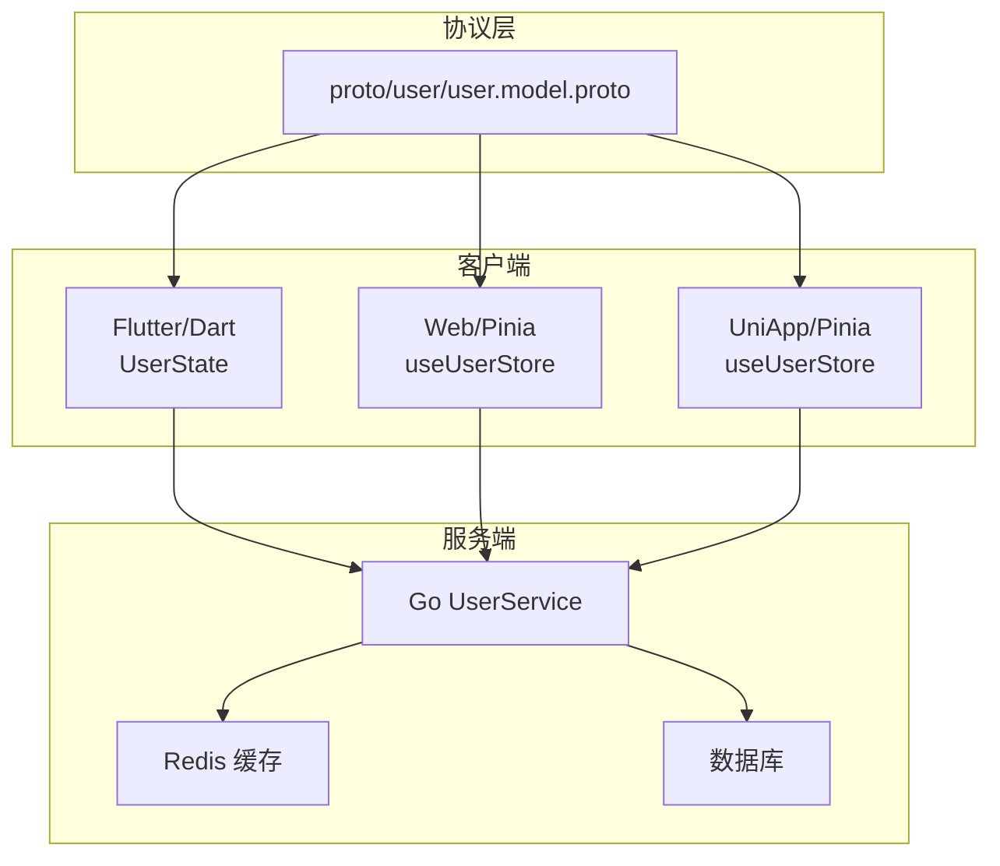
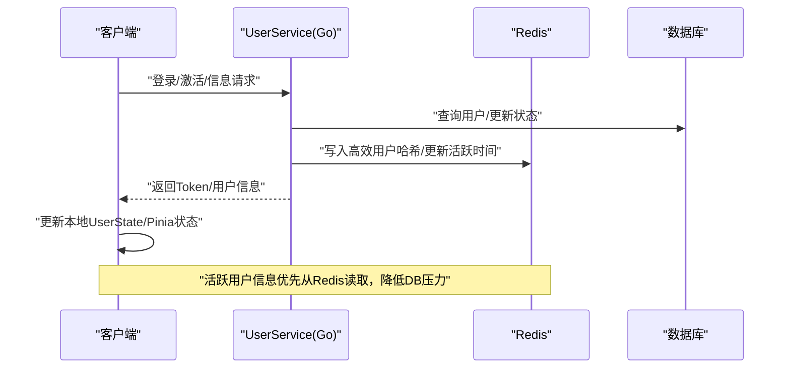
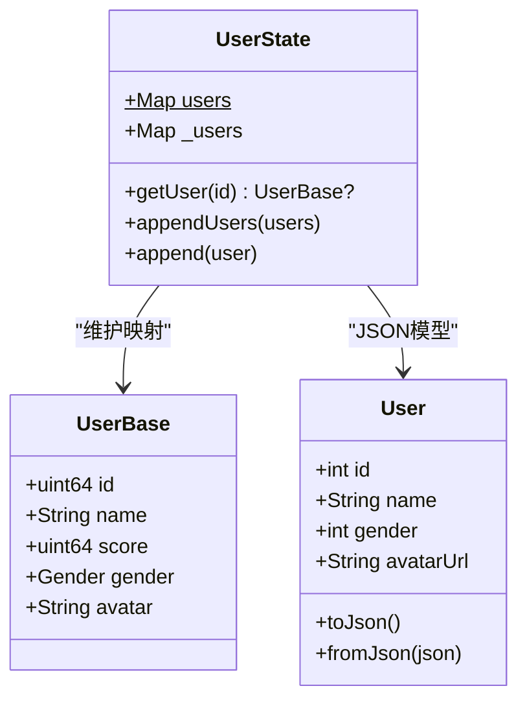
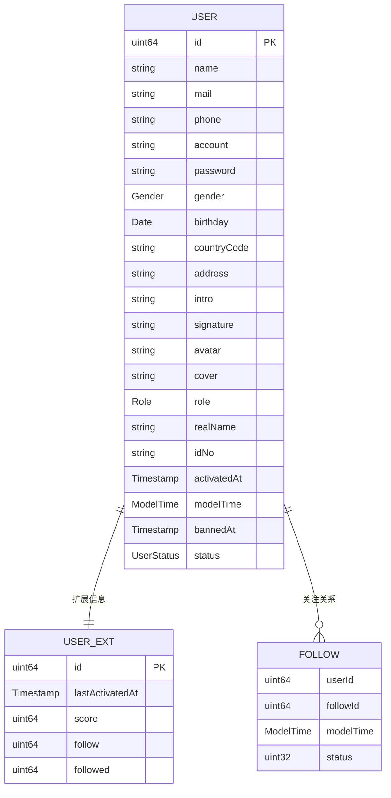
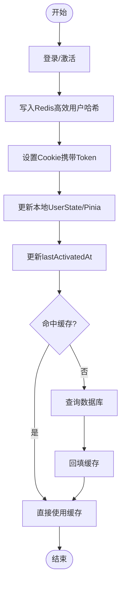
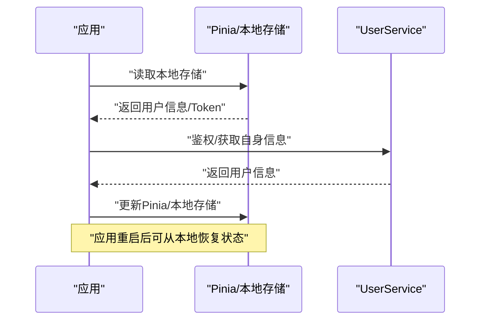
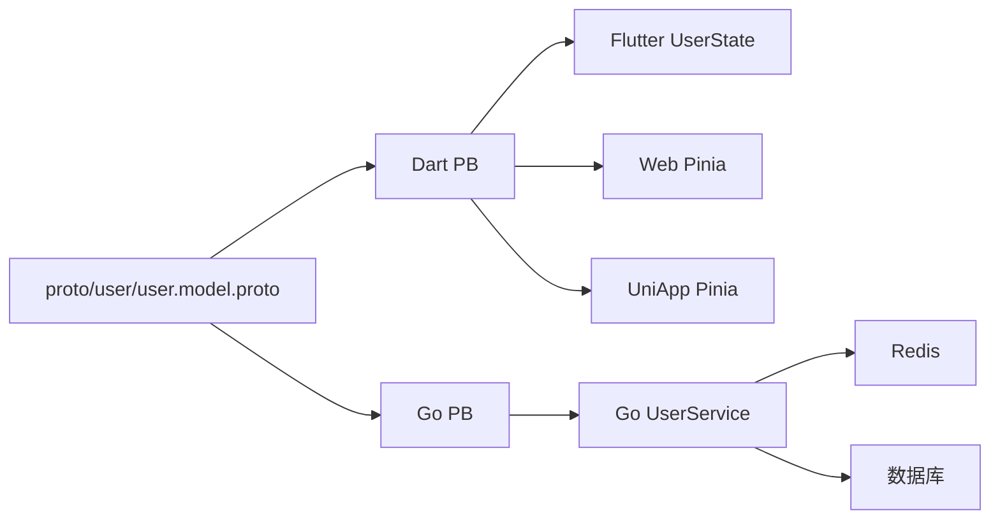

# 用户状态管理

<cite>
**本文档引用的文件**
- [client/app/lib/global/state/user.dart](file://client/app/lib/global/state/user.dart)
- [client/app/lib/model/user.dart](file://client/app/lib/model/user.dart)
- [client/app/lib/generated/protobuf/user/user.model.pb.dart](file://client/app/lib/generated/protobuf/user/user.model.pb.dart)
- [client/web/src/store/modules/user.ts](file://client/web/src/store/modules/user.ts)
- [client/uniapp/src/store/user.ts](file://client/uniapp/src/store/user.ts)
- [server/go/protobuf/user/user.model.pb.go](file://server/go/protobuf/user/user.model.pb.go)
- [server/go/user/service/user.go](file://server/go/user/service/user.go)
- [proto/user/user.model.proto](file://proto/user/user.model.proto)
- [client/app/lib/global/state/auth.dart](file://client/app/lib/global/state/auth.dart)
- [client/app/lib/pages/user/user_controller.dart](file://client/app/lib/pages/user/user_controller.dart)
</cite>

## 目录
1. [简介](#简介)
2. [项目结构](#项目结构)
3. [核心组件](#核心组件)
4. [架构总览](#架构总览)
5. [详细组件分析](#详细组件分析)
6. [依赖分析](#依赖分析)
7. [性能考量](#性能考量)
8. [故障排查指南](#故障排查指南)
9. [结论](#结论)
10. [附录](#附录)

## 简介
本文件面向Hoper平台的用户状态管理，围绕UserState类的设计与实现展开，覆盖用户信息管理、个人资料维护、用户偏好设置、状态模型、更新机制（在线/活跃/离线缓存）、状态同步与持久化、状态恢复以及隐私与安全等主题。文档以多端（Flutter/Dart、Web、UniApp）与服务端（Go）协同的架构为背景，结合协议定义与实际代码实现，帮助开发者快速理解并正确使用用户状态管理能力。

## 项目结构
Hoper采用前后端分离与多端一致的协议驱动架构：
- 协议层：通过proto定义用户模型与服务接口，生成跨语言的PB代码（Go、Dart）。
- 客户端层：Flutter/Dart侧使用PB消息与Pinia/Pinia-like状态管理；Web与UniApp侧使用TS与Pinia。
- 服务端层：Go实现用户服务，负责认证、登录、状态变更、Redis缓存与数据库交互。

**图表来源**
- [proto/user/user.model.proto:1-269](file://proto/user/user.model.proto#L1-L269)
- [client/app/lib/global/state/user.dart:1-25](file://client/app/lib/global/state/user.dart#L1-L25)
- [client/web/src/store/modules/user.ts:1-93](file://client/web/src/store/modules/user.ts#L1-L93)
- [client/uniapp/src/store/user.ts:1-87](file://client/uniapp/src/store/user.ts#L1-L87)
- [server/go/user/service/user.go:1-664](file://server/go/user/service/user.go#L1-L664)

**章节来源**
- [proto/user/user.model.proto:1-269](file://proto/user/user.model.proto#L1-L269)
- [client/app/lib/global/state/user.dart:1-25](file://client/app/lib/global/state/user.dart#L1-L25)
- [client/web/src/store/modules/user.ts:1-93](file://client/web/src/store/modules/user.ts#L1-L93)
- [client/uniapp/src/store/user.ts:1-87](file://client/uniapp/src/store/user.ts#L1-L87)
- [server/go/user/service/user.go:1-664](file://server/go/user/service/user.go#L1-L664)

## 核心组件
- UserState（Flutter/Dart）：轻量级内存态，维护用户映射与基础用户信息，支持按ID查询与批量追加。
- 用户模型（Dart/Go）：基于PB消息定义的User/UserBase/UserExt等，承载基本信息、头像、角色、状态、扩展字段等。
- Pinia状态（Web/UniApp）：持久化用户信息到本地存储，提供登录、登出、刷新Token等动作。
- 用户服务（Go）：实现登录、激活、信息获取、Token签发与过期、Redis高效用户哈希、登出清理等。

**章节来源**
- [client/app/lib/global/state/user.dart:7-25](file://client/app/lib/global/state/user.dart#L7-L25)
- [client/app/lib/model/user.dart:1-23](file://client/app/lib/model/user.dart#L1-L23)
- [client/app/lib/generated/protobuf/user/user.model.pb.dart:27-132](file://client/app/lib/generated/protobuf/user/user.model.pb.dart#L27-L132)
- [client/web/src/store/modules/user.ts:12-87](file://client/web/src/store/modules/user.ts#L12-L87)
- [client/uniapp/src/store/user.ts:10-80](file://client/uniapp/src/store/user.ts#L10-L80)
- [server/go/protobuf/user/user.model.pb.go:424-452](file://server/go/protobuf/user/user.model.pb.go#L424-L452)
- [server/go/user/service/user.go:333-420](file://server/go/user/service/user.go#L333-L420)

## 架构总览
用户状态管理贯穿“协议定义—客户端状态—服务端逻辑—缓存/数据库”的全链路：

**图表来源**
- [server/go/user/service/user.go:333-420](file://server/go/user/service/user.go#L333-L420)
- [server/go/user/service/user.go:475-485](file://server/go/user/service/user.go#L475-L485)
- [server/go/user/service/user.go:422-454](file://server/go/user/service/user.go#L422-L454)

## 详细组件分析

### UserState（Flutter/Dart）
- 设计目标：在内存中维护用户映射，支持按ID快速查询与批量追加，避免重复拉取。
- 数据结构：
  - 内部映射：Int64 → UserBase，用于快速定位用户。
  - JSON友好映射：int → User（Dart侧JSON模型），便于序列化/反序列化。
- 关键方法：
  - getUser：按ID查询用户。
  - appendUsers/append：批量或单个追加用户信息。
- 使用场景：在页面渲染、头像显示、用户卡片展示等场景中，先查UserState，缺失再通过RPC批量拉取并回填。

**图表来源**
- [client/app/lib/global/state/user.dart:7-25](file://client/app/lib/global/state/user.dart#L7-L25)
- [client/app/lib/model/user.dart:6-17](file://client/app/lib/model/user.dart#L6-L17)
- [client/app/lib/generated/protobuf/user/user.model.pb.dart:27-132](file://client/app/lib/generated/protobuf/user/user.model.pb.dart#L27-L132)

**章节来源**
- [client/app/lib/global/state/user.dart:7-25](file://client/app/lib/global/state/user.dart#L7-L25)
- [client/app/lib/model/user.dart:1-23](file://client/app/lib/model/user.dart#L1-L23)
- [client/app/lib/generated/protobuf/user/user.model.pb.dart:27-132](file://client/app/lib/generated/protobuf/user/user.model.pb.dart#L27-L132)

### 用户数据模型与协议
- 协议定义（proto）：
  - User：包含基础信息（昵称、邮箱、电话、账号、密码、性别、生日、地址、签名、头像、封面、角色、实名、身份证号、激活时间、模型时间、封禁时间、状态）。
  - UserBase：轻量用户信息（id、name、score、gender、avatar），用于跨端传输与缓存。
  - UserExt：用户扩展信息（lastActivatedAt、score、follow、followed）。
  - Follow/ScoreLog/BannedLog/ActionLog：社交关系、积分日志、封禁日志、操作日志等。
- Go侧PB生成：
  - 自动生成的Go消息体包含字段访问器与校验标签（gorm、validate等），便于服务端直接使用。
- Dart侧PB生成：
  - 自动生成的Dart消息体支持fromBuffer/fromJson等构造方式，便于网络与本地存储。

**图表来源**
- [proto/user/user.model.proto:19-93](file://proto/user/user.model.proto#L19-L93)
- [server/go/protobuf/user/user.model.pb.go:424-452](file://server/go/protobuf/user/user.model.pb.go#L424-L452)
- [server/go/protobuf/user/user.model.pb.go:638-647](file://server/go/protobuf/user/user.model.pb.go#L638-L647)
- [server/go/protobuf/user/user.model.pb.go:714-723](file://server/go/protobuf/user/user.model.pb.go#L714-L723)

**章节来源**
- [proto/user/user.model.proto:19-93](file://proto/user/user.model.proto#L19-L93)
- [server/go/protobuf/user/user.model.pb.go:424-452](file://server/go/protobuf/user/user.model.pb.go#L424-L452)
- [server/go/protobuf/user/user.model.pb.go:638-647](file://server/go/protobuf/user/user.model.pb.go#L638-L647)
- [server/go/protobuf/user/user.model.pb.go:714-723](file://server/go/protobuf/user/user.model.pb.go#L714-L723)

### 在线状态、活跃状态与离线缓存策略
- 在线状态：
  - 登录成功后，服务端将用户信息写入Redis高效哈希，并设置Cookie携带Token，客户端据此维持会话。
- 活跃状态：
  - 每次登录或登出，服务端更新UserExt.lastActivatedAt，用于统计与审计。
- 离线缓存：
  - Flutter侧UserState在内存中缓存用户信息；Web/UniApp侧通过Pinia与本地存储持久化用户信息，减少重复请求。
  - 服务端对高频读取的用户信息优先从Redis读取，降低数据库压力。

**图表来源**
- [server/go/user/service/user.go:370-420](file://server/go/user/service/user.go#L370-L420)
- [server/go/user/service/user.go:422-454](file://server/go/user/service/user.go#L422-L454)
- [client/uniapp/src/store/user.ts:75-79](file://client/uniapp/src/store/user.ts#L75-L79)
- [client/web/src/store/modules/user.ts:12-24](file://client/web/src/store/modules/user.ts#L12-L24)

**章节来源**
- [server/go/user/service/user.go:370-420](file://server/go/user/service/user.go#L370-L420)
- [server/go/user/service/user.go:422-454](file://server/go/user/service/user.go#L422-L454)
- [client/uniapp/src/store/user.ts:75-79](file://client/uniapp/src/store/user.ts#L75-L79)
- [client/web/src/store/modules/user.ts:12-24](file://client/web/src/store/modules/user.ts#L12-L24)

### 状态同步、数据持久化与状态恢复
- 状态同步：
  - Flutter：通过全局状态管理器在启动时拉取自身信息并回填UserState。
  - Web/UniApp：登录成功后将用户信息写入Pinia，并持久化到本地存储。
- 数据持久化：
  - Web：localStorage中保存用户关键字段（id、name、phone、roles、role、permissions）。
  - UniApp：本地存储token，HTTP默认携带Authorization。
- 状态恢复：
  - 启动时读取本地存储，恢复用户角色与权限；若存在Token则尝试鉴权并拉取用户信息。

**图表来源**
- [client/web/src/store/modules/user.ts:12-24](file://client/web/src/store/modules/user.ts#L12-L24)
- [client/web/src/store/modules/user.ts:51-62](file://client/web/src/store/modules/user.ts#L51-L62)
- [client/uniapp/src/store/user.ts:28-38](file://client/uniapp/src/store/user.ts#L28-L38)
- [client/uniapp/src/store/user.ts:39-55](file://client/uniapp/src/store/user.ts#L39-L55)
- [client/app/lib/global/state/auth.dart:31-47](file://client/app/lib/global/state/auth.dart#L31-L47)

**章节来源**
- [client/web/src/store/modules/user.ts:12-87](file://client/web/src/store/modules/user.ts#L12-L87)
- [client/uniapp/src/store/user.ts:10-80](file://client/uniapp/src/store/user.ts#L10-L80)
- [client/app/lib/global/state/auth.dart:31-68](file://client/app/lib/global/state/auth.dart#L31-L68)

### 用户偏好设置与头像管理
- 偏好设置：
  - Web/UniApp侧通过Pinia维护角色与权限等偏好信息，并持久化到本地存储。
- 头像管理：
  - 协议中包含avatar/cover字段；Dart模型提供头像URL字段；Flutter侧UserState可按需缓存UserBase以供展示。

**章节来源**
- [client/web/src/store/modules/user.ts:26-49](file://client/web/src/store/modules/user.ts#L26-L49)
- [client/uniapp/src/store/user.ts:28-38](file://client/uniapp/src/store/user.ts#L28-L38)
- [proto/user/user.model.proto:39-40](file://proto/user/user.model.proto#L39-L40)
- [client/app/lib/model/user.dart:9-12](file://client/app/lib/model/user.dart#L9-L12)

### 隐私保护与数据安全
- Token与Cookie：
  - 服务端登录成功后设置HttpOnly Cookie，降低XSS风险；客户端根据配置决定Secure与MaxAge。
- 密码安全：
  - 密码采用带盐哈希策略，服务端统一加密后再入库。
- 数据最小化：
  - 协议中password字段在JSON中隐藏（Dart侧标记为私密），避免泄露。
- 权限控制：
  - 服务端对敏感操作（如编辑他人资料、重置密码）进行鉴权与权限检查。

**章节来源**
- [server/go/user/service/user.go:370-420](file://server/go/user/service/user.go#L370-L420)
- [server/go/user/service/user.go:167-176](file://server/go/user/service/user.go#L167-L176)
- [client/app/lib/generated/protobuf/user/user.model.pb.dart:179-186](file://client/app/lib/generated/protobuf/user/user.model.pb.dart#L179-L186)
- [server/go/user/service/user.go:294-331](file://server/go/user/service/user.go#L294-L331)

## 依赖分析
- 协议到代码：
  - proto生成Dart/Go PB消息，客户端与服务端共享同一数据契约。
- 客户端状态：
  - Flutter使用UserState与PB消息；Web/UniApp使用Pinia与本地存储。
- 服务端逻辑：
  - UserService负责鉴权、登录、登出、信息获取、Redis缓存与数据库交互。

**图表来源**
- [proto/user/user.model.proto:1-269](file://proto/user/user.model.proto#L1-L269)
- [client/app/lib/generated/protobuf/user/user.model.pb.dart:1-200](file://client/app/lib/generated/protobuf/user/user.model.pb.dart#L1-L200)
- [server/go/protobuf/user/user.model.pb.go:1-80](file://server/go/protobuf/user/user.model.pb.go#L1-L80)
- [client/app/lib/global/state/user.dart:1-25](file://client/app/lib/global/state/user.dart#L1-L25)
- [client/web/src/store/modules/user.ts:1-93](file://client/web/src/store/modules/user.ts#L1-L93)
- [client/uniapp/src/store/user.ts:1-87](file://client/uniapp/src/store/user.ts#L1-L87)
- [server/go/user/service/user.go:1-664](file://server/go/user/service/user.go#L1-L664)

**章节来源**
- [proto/user/user.model.proto:1-269](file://proto/user/user.model.proto#L1-L269)
- [client/app/lib/global/state/user.dart:1-25](file://client/app/lib/global/state/user.dart#L1-L25)
- [client/web/src/store/modules/user.ts:1-93](file://client/web/src/store/modules/user.ts#L1-L93)
- [client/uniapp/src/store/user.ts:1-87](file://client/uniapp/src/store/user.ts#L1-L87)
- [server/go/user/service/user.go:1-664](file://server/go/user/service/user.go#L1-L664)

## 性能考量
- 缓存优先：活跃用户信息优先从Redis读取，降低DB压力。
- 批量拉取：Flutter侧支持按ID列表批量拉取用户信息并回填UserState，减少多次RPC调用。
- 轻量模型：UserBase仅包含必要字段，适合频繁传输与缓存。
- 本地持久化：Web/UniApp侧将用户信息持久化到本地存储，减少重复请求。

[本节为通用性能建议，无需特定文件引用]

## 故障排查指南
- 登录失败：
  - 检查验证码/账户有效性；确认服务端返回的错误码与提示。
- Token无效：
  - 确认Cookie是否正确设置与携带；检查Token过期时间与签名密钥。
- 用户信息未更新：
  - 确认Pinia/本地存储是否正确更新；Flutter侧是否调用appendUsers/append回填UserState。
- Redis异常：
  - 检查Redis连接与Key命名空间；确认高效用户哈希写入成功。

**章节来源**
- [server/go/user/service/user.go:333-368](file://server/go/user/service/user.go#L333-L368)
- [server/go/user/service/user.go:370-420](file://server/go/user/service/user.go#L370-L420)
- [client/uniapp/src/store/user.ts:75-79](file://client/uniapp/src/store/user.ts#L75-L79)
- [client/web/src/store/modules/user.ts:51-62](file://client/web/src/store/modules/user.ts#L51-L62)

## 结论
Hoper的用户状态管理以协议驱动为核心，结合客户端内存态与Pinia持久化、服务端Redis缓存与数据库，实现了高性能、可扩展且安全的用户状态管理方案。UserState作为Flutter侧的关键组件，承担了用户信息的快速查询与批量回填职责；Web/UniApp侧通过Pinia与本地存储保障状态恢复与用户体验；服务端UserService则确保鉴权、登录、活跃度与缓存的一致性与可靠性。遵循本文档的最佳实践，可在多端环境中稳定地实现用户状态的同步、持久化与恢复。

## 附录
- 快速上手（Flutter）：
  - 登录后调用鉴权接口，成功后拉取自身信息并回填UserState。
  - 需要展示用户信息时，先查UserState，不存在再通过RPC批量拉取。
- 快速上手（Web/UniApp）：
  - 登录成功后将用户信息写入Pinia并持久化；后续页面直接读取。
  - 若本地存在Token，启动时尝试鉴权并拉取用户信息。

**章节来源**
- [client/app/lib/global/state/auth.dart:31-68](file://client/app/lib/global/state/auth.dart#L31-L68)
- [client/uniapp/src/store/user.ts:28-38](file://client/uniapp/src/store/user.ts#L28-L38)
- [client/web/src/store/modules/user.ts:51-62](file://client/web/src/store/modules/user.ts#L51-L62)
- [client/app/lib/pages/user/user_controller.dart:1-18](file://client/app/lib/pages/user/user_controller.dart#L1-L18)