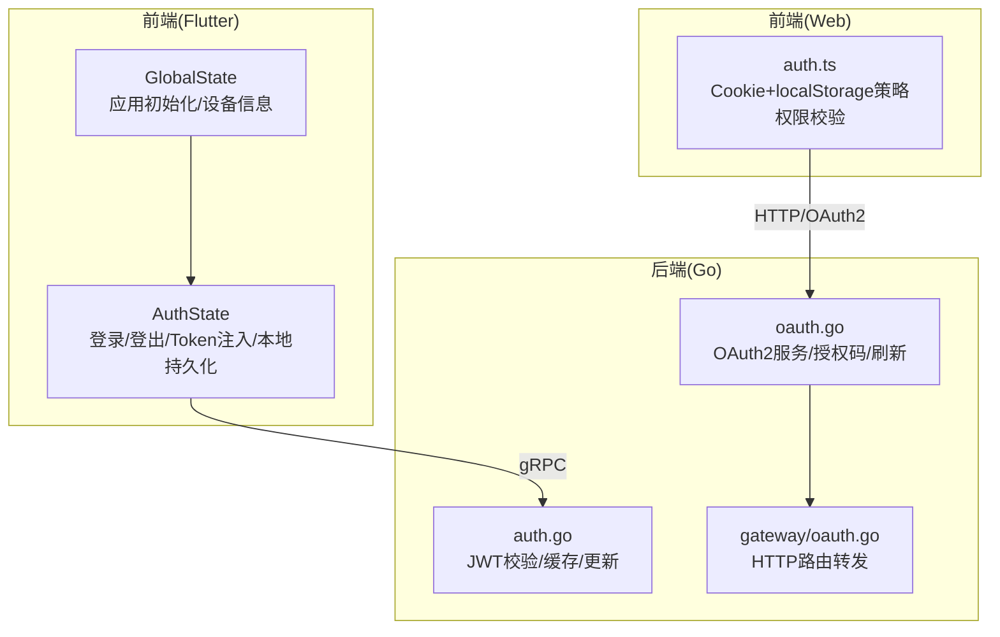
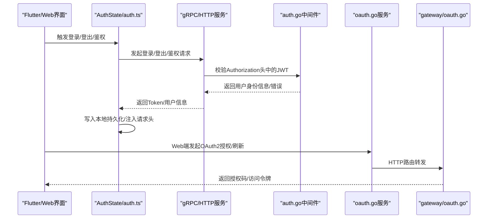
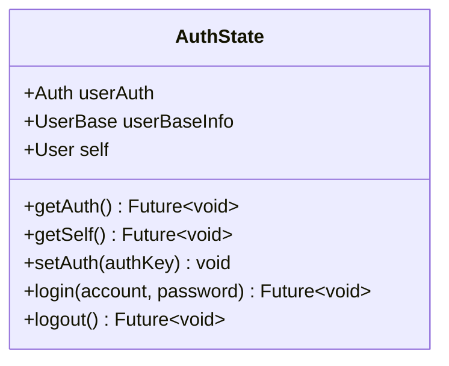
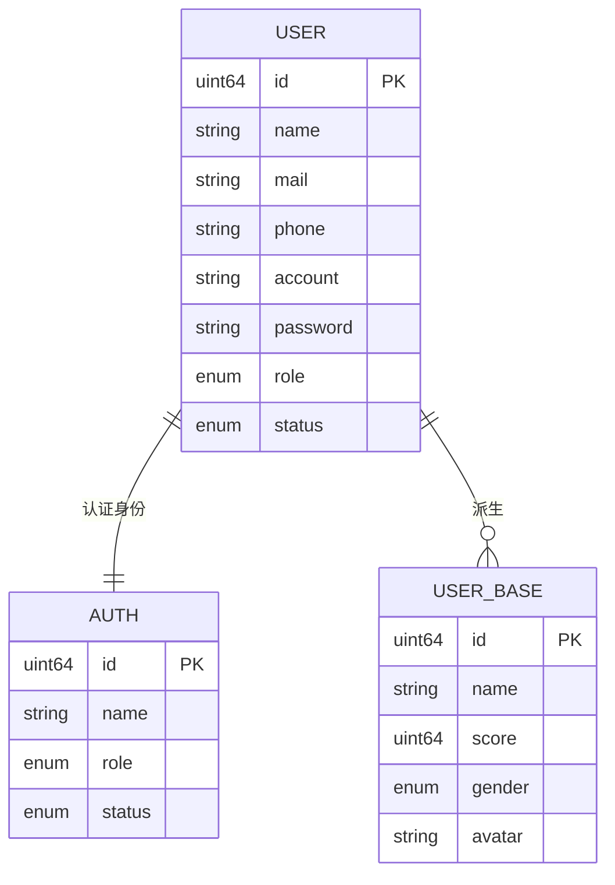
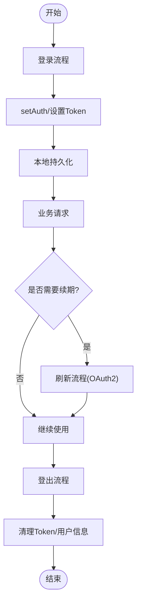
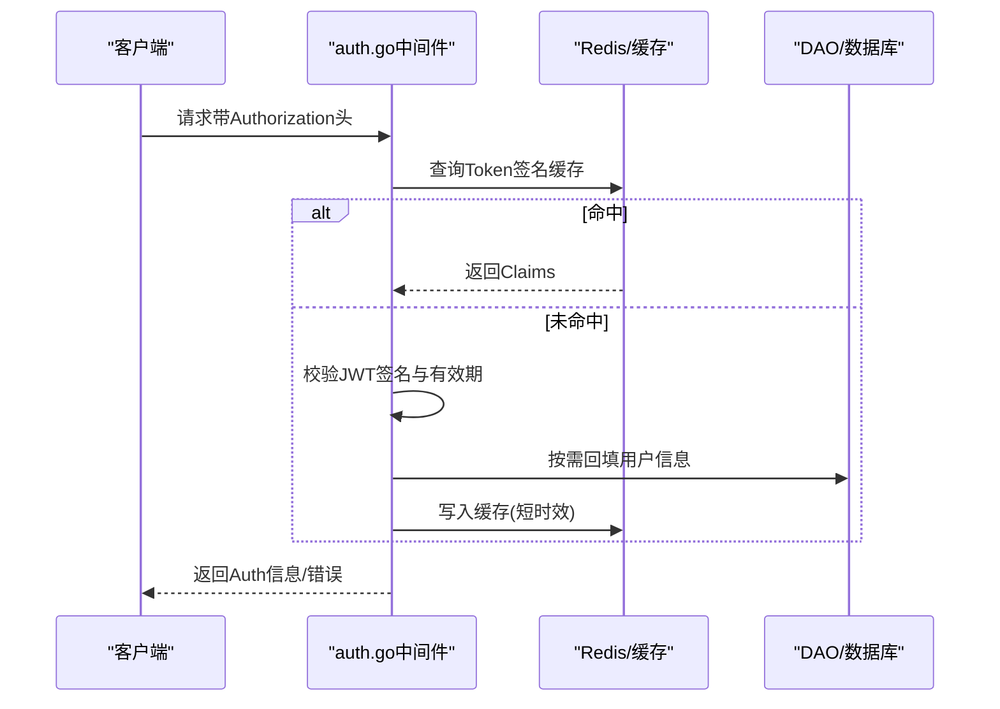
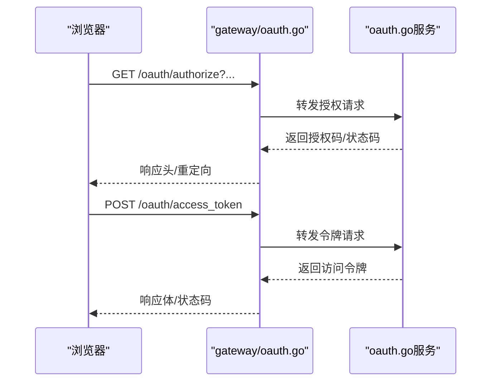
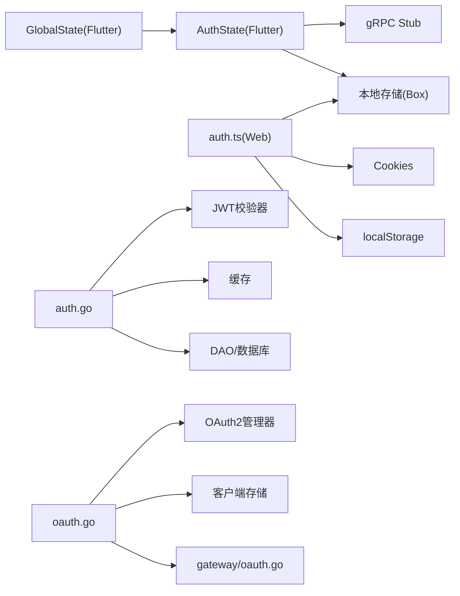

# 认证状态管理

<cite>
**本文引用的文件**   
- [client/app/lib/global/state/auth.dart](file://client/app/lib/global/state/auth.dart)
- [client/app/lib/global/state.dart](file://client/app/lib/global/state.dart)
- [server/go/user/service/auth.go](file://server/go/user/service/auth.go)
- [server/go/user/service/oauth.go](file://server/go/user/service/oauth.go)
- [thirdparty/cherry/gateway/oauth.go](file://thirdparty/cherry/gateway/oauth.go)
- [proto/user/user.model.proto](file://proto/user/user.model.proto)
- [client/web/src/utils/auth.ts](file://client/web/src/utils/auth.ts)
- [thirdparty/gox/net/http/oauth/oauth.go](file://thirdparty/gox/net/http/oauth/oauth.go)
</cite>

## 目录
1. [简介](#简介)
2. [项目结构](#项目结构)
3. [核心组件](#核心组件)
4. [架构总览](#架构总览)
5. [详细组件分析](#详细组件分析)
6. [依赖分析](#依赖分析)
7. [性能考虑](#性能考虑)
8. [故障排查指南](#故障排查指南)
9. [结论](#结论)
10. [附录](#附录)

## 简介
本文件围绕 Hoper 的认证状态管理进行系统化技术文档整理，重点剖析前端 AuthState 类的设计与实现，覆盖用户认证流程、Token 管理机制、认证状态维护与生命周期；同时结合服务端 JWT 校验、OAuth 授权流程与客户端 Web 端 Token 策略，给出可操作的最佳实践与常见问题解决方案。

## 项目结构
Hoper 的认证状态管理横跨前端 Flutter 应用、Web 应用与后端 Go 服务：
- 前端 Flutter：全局状态管理包含 AuthState，负责登录、登出、Token 注入、本地持久化与用户信息获取。
- 前端 Web：提供 Cookie + localStorage 的 Token 策略，支持多标签页与权限校验。
- 后端 Go：基于 JWT 的认证中间件与 OAuth2 服务，负责 Token 校验、缓存与授权码/刷新流程。

**图示来源**
- [client/app/lib/global/state/auth.dart:18-113](file://client/app/lib/global/state/auth.dart#L18-L113)
- [client/app/lib/global/state.dart:39-46](file://client/app/lib/global/state.dart#L39-L46)
- [server/go/user/service/auth.go:22-61](file://server/go/user/service/auth.go#L22-L61)
- [server/go/user/service/oauth.go:30-76](file://server/go/user/service/oauth.go#L30-L76)
- [thirdparty/cherry/gateway/oauth.go:26-45](file://thirdparty/cherry/gateway/oauth.go#L26-L45)
- [client/web/src/utils/auth.ts:26-106](file://client/web/src/utils/auth.ts#L26-L106)

**章节来源**
- [client/app/lib/global/state/auth.dart:18-113](file://client/app/lib/global/state/auth.dart#L18-L113)
- [client/app/lib/global/state.dart:39-46](file://client/app/lib/global/state.dart#L39-L46)
- [server/go/user/service/auth.go:22-61](file://server/go/user/service/auth.go#L22-L61)
- [server/go/user/service/oauth.go:30-76](file://server/go/user/service/oauth.go#L30-L76)
- [thirdparty/cherry/gateway/oauth.go:26-45](file://thirdparty/cherry/gateway/oauth.go#L26-L45)
- [client/web/src/utils/auth.ts:26-106](file://client/web/src/utils/auth.ts#L26-L106)

## 核心组件
- AuthState（Flutter）：封装认证状态、登录/登出、Token 注入、本地持久化、用户信息获取与基础信息派生。
- GlobalState（Flutter）：应用启动时初始化服务与认证状态，确保应用启动即完成认证态加载。
- auth 中间件（Go）：从请求头提取 Token，校验签名与有效期，支持缓存命中与用户信息回填。
- OAuth2 服务（Go）：提供授权码与刷新流程，生成 JWT 访问令牌，配置客户端存储。
- auth.ts（Web）：统一 Token 存储与刷新策略，支持多标签页与权限校验。

**章节来源**
- [client/app/lib/global/state/auth.dart:18-113](file://client/app/lib/global/state/auth.dart#L18-L113)
- [client/app/lib/global/state.dart:39-46](file://client/app/lib/global/state.dart#L39-L46)
- [server/go/user/service/auth.go:22-61](file://server/go/user/service/auth.go#L22-L61)
- [server/go/user/service/oauth.go:30-76](file://server/go/user/service/oauth.go#L30-L76)
- [client/web/src/utils/auth.ts:26-106](file://client/web/src/utils/auth.ts#L26-L106)

## 架构总览
下图展示了从客户端到服务端的认证交互路径，涵盖 Flutter 与 Web 两端的不同策略与服务端的 JWT/OAuth2 协作。

**图示来源**
- [client/app/lib/global/state/auth.dart:70-105](file://client/app/lib/global/state/auth.dart#L70-L105)
- [client/web/src/utils/auth.ts:40-106](file://client/web/src/utils/auth.ts#L40-L106)
- [server/go/user/service/auth.go:22-61](file://server/go/user/service/auth.go#L22-L61)
- [server/go/user/service/oauth.go:103-144](file://server/go/user/service/oauth.go#L103-L144)
- [thirdparty/cherry/gateway/oauth.go:26-45](file://thirdparty/cherry/gateway/oauth.go#L26-L45)

## 详细组件分析

### AuthState 类设计与实现
- 数据结构
  - userAuth：当前认证用户的 Auth 信息（id、name、role、status）。
  - self：当前登录用户完整 User 信息。
  - userBaseInfo：从 self 派生的基础信息（id、name、gender、avatar）。
  - 本地键：StringAuthKey、StringAccountKey、StringAuthInfoKey，分别用于保存 Token、账号与认证信息。
- 关键方法
  - getAuth：从本地读取 Token，调用服务端 authInfo 校验并注入请求头，随后拉取 self 并更新全局用户状态。
  - getSelf：若 self 为空则先确保已认证，再调用 info 接口获取用户详情。
  - setAuth：将 Token 写入 HTTP 请求头与 gRPC CallOptions，并持久化到本地存储。
  - login：调用登录接口，成功后设置 userAuth/self、注入 Token、保存账号并重启应用。
  - logout：清理 userAuth/self、移除请求头中的 Authorization、删除本地 Token、通知服务端登出并重启应用。

**图示来源**
- [client/app/lib/global/state/auth.dart:18-113](file://client/app/lib/global/state/auth.dart#L18-L113)

**章节来源**
- [client/app/lib/global/state/auth.dart:18-113](file://client/app/lib/global/state/auth.dart#L18-L113)

### 认证状态数据结构
- Auth（服务端/Proto 定义）
  - 字段：id、name、role、status
  - 用途：作为认证态的核心身份载体，用于鉴权与权限判断
- User（服务端/Proto 定义）
  - 字段：id、name、mail、phone、account、password、gender、birthday、countryCode、address、intro、signature、avatar、cover、role、realName、idNo、activatedAt、modelTime、bannedAt、status
  - 用途：完整用户资料，getSelf 成功后填充
- UserBase（服务端/Proto 定义）
  - 字段：id、name、score、gender、avatar
  - 用途：轻量用户信息，供 UI 展示与状态派生
- Role/Status（枚举）
  - Role：普通用户、管理员、超级管理员
  - UserStatus：未激活、已激活、已冻结、已注销

**图示来源**
- [proto/user/user.model.proto:190-197](file://proto/user/user.model.proto#L190-L197)
- [proto/user/user.model.proto:20-50](file://proto/user/user.model.proto#L20-L50)
- [proto/user/user.model.proto:137-147](file://proto/user/user.model.proto#L137-L147)

**章节来源**
- [proto/user/user.model.proto:190-197](file://proto/user/user.model.proto#L190-L197)
- [proto/user/user.model.proto:20-50](file://proto/user/user.model.proto#L20-L50)
- [proto/user/user.model.proto:137-147](file://proto/user/user.model.proto#L137-L147)

### 认证状态生命周期管理
- 登录
  - Flutter：login 调用服务端登录接口，成功后设置 userAuth/self、注入 Token、持久化账号并重启应用。
  - Web：setToken 将 accessToken、refreshToken、expires 写入 Cookie，用户信息写入 localStorage。
- 自动续期
  - Flutter：当前实现未见显式自动续期逻辑，建议在请求拦截器中检测 401 并触发刷新流程（参见 OAuth2 刷新流程）。
  - Web：auth.ts 提供 refreshToken 与 expires 字段，建议在 Token 过期前主动刷新。
- 错误处理
  - Flutter：捕获 GrpcError 并提示，未知异常打印日志。
  - Web：hasPerms 统一权限校验入口，支持通配符与数组校验。

**图示来源**
- [client/app/lib/global/state/auth.dart:70-105](file://client/app/lib/global/state/auth.dart#L70-L105)
- [client/web/src/utils/auth.ts:40-106](file://client/web/src/utils/auth.ts#L40-L106)
- [server/go/user/service/oauth.go:118-144](file://server/go/user/service/oauth.go#L118-L144)

**章节来源**
- [client/app/lib/global/state/auth.dart:70-105](file://client/app/lib/global/state/auth.dart#L70-L105)
- [client/web/src/utils/auth.ts:40-106](file://client/web/src/utils/auth.ts#L40-L106)
- [server/go/user/service/oauth.go:118-144](file://server/go/user/service/oauth.go#L118-L144)

### 认证流程与 Token 管理机制
- Flutter（gRPC）
  - getAuth：从本地读取 Token，调用 authInfo 校验，成功后 setAuth 注入请求头并持久化。
  - setAuth：同时更新 HTTP 请求头与 gRPC CallOptions，保证后续请求携带 Authorization。
- Web（HTTP/OAuth2）
  - setToken：将 accessToken、refreshToken、expires 写入 Cookie；用户信息写入 localStorage。
  - hasPerms：基于用户权限数组进行按钮级权限校验。
- 服务端 JWT 校验
  - auth.go：从请求头提取 Token，校验签名与有效期，支持缓存命中与用户信息回填。
  - oauth.go：配置 JWT AccessGenerate、授权码与刷新流程，生成访问令牌。

**图示来源**
- [server/go/user/service/auth.go:22-61](file://server/go/user/service/auth.go#L22-L61)

**章节来源**
- [client/app/lib/global/state/auth.dart:31-68](file://client/app/lib/global/state/auth.dart#L31-L68)
- [client/web/src/utils/auth.ts:40-106](file://client/web/src/utils/auth.ts#L40-L106)
- [server/go/user/service/auth.go:22-61](file://server/go/user/service/auth.go#L22-L61)
- [server/go/user/service/oauth.go:30-76](file://server/go/user/service/oauth.go#L30-L76)

### OAuth2 授权与刷新流程
- 授权码流程
  - /oauth/authorize：接收授权参数，生成授权码并返回响应头。
  - /oauth/access_token：使用授权码换取访问令牌。
- 刷新流程
  - 使用 refresh_token 刷新访问令牌，支持范围校验与过期处理。
- 路由转发
  - Cherry 网关将 HTTP 请求转发至 OAuth2 服务并返回响应。

**图示来源**
- [thirdparty/cherry/gateway/oauth.go:26-45](file://thirdparty/cherry/gateway/oauth.go#L26-L45)
- [server/go/user/service/oauth.go:103-144](file://server/go/user/service/oauth.go#L103-L144)
- [thirdparty/gox/net/http/oauth/oauth.go:326-426](file://thirdparty/gox/net/http/oauth/oauth.go#L326-L426)

**章节来源**
- [thirdparty/cherry/gateway/oauth.go:26-45](file://thirdparty/cherry/gateway/oauth.go#L26-L45)
- [server/go/user/service/oauth.go:103-144](file://server/go/user/service/oauth.go#L103-L144)
- [thirdparty/gox/net/http/oauth/oauth.go:326-426](file://thirdparty/gox/net/http/oauth/oauth.go#L326-L426)

### 在应用中使用 AuthState 的示例路径
- 初始化与认证加载
  - GlobalState.init：初始化服务并调用 AuthState.getAuth 完成认证态加载。
  - 参考路径：[client/app/lib/global/state.dart:39-46](file://client/app/lib/global/state.dart#L39-L46)
- 登录与登出
  - AuthState.login：发起登录请求，成功后设置 userAuth/self 并注入 Token。
  - AuthState.logout：清理认证态并通知服务端登出。
  - 参考路径：[client/app/lib/global/state/auth.dart:70-105](file://client/app/lib/global/state/auth.dart#L70-L105)
- 状态监听与权限验证
  - Flutter：通过 GetX 状态管理监听 userAuth/self 变化，结合 UI 组件更新。
  - Web：hasPerms 实现按钮级权限校验，配合 store/modules/user 使用。
  - 参考路径：[client/web/src/utils/auth.ts:113-124](file://client/web/src/utils/auth.ts#L113-L124)

**章节来源**
- [client/app/lib/global/state.dart:39-46](file://client/app/lib/global/state.dart#L39-L46)
- [client/app/lib/global/state/auth.dart:70-105](file://client/app/lib/global/state/auth.dart#L70-L105)
- [client/web/src/utils/auth.ts:113-124](file://client/web/src/utils/auth.ts#L113-L124)

## 依赖分析
- 前端 Flutter
  - AuthState 依赖 gRPC stub 与本地存储，通过 GlobalState.init 在应用启动时完成认证态加载。
- 前端 Web
  - auth.ts 依赖 Cookies 与 localStorage，提供 Token 与用户信息的持久化与权限校验。
- 后端 Go
  - auth.go 依赖 JWT 校验器与缓存，按需回填用户信息；oauth.go 依赖 OAuth2 管理器与客户端存储。

**图示来源**
- [client/app/lib/global/state/auth.dart:18-113](file://client/app/lib/global/state/auth.dart#L18-L113)
- [client/app/lib/global/state.dart:39-46](file://client/app/lib/global/state.dart#L39-L46)
- [client/web/src/utils/auth.ts:26-106](file://client/web/src/utils/auth.ts#L26-L106)
- [server/go/user/service/auth.go:22-61](file://server/go/user/service/auth.go#L22-L61)
- [server/go/user/service/oauth.go:30-76](file://server/go/user/service/oauth.go#L30-L76)
- [thirdparty/cherry/gateway/oauth.go:26-45](file://thirdparty/cherry/gateway/oauth.go#L26-L45)

**章节来源**
- [client/app/lib/global/state/auth.dart:18-113](file://client/app/lib/global/state/auth.dart#L18-L113)
- [client/app/lib/global/state.dart:39-46](file://client/app/lib/global/state.dart#L39-L46)
- [client/web/src/utils/auth.ts:26-106](file://client/web/src/utils/auth.ts#L26-L106)
- [server/go/user/service/auth.go:22-61](file://server/go/user/service/auth.go#L22-L61)
- [server/go/user/service/oauth.go:30-76](file://server/go/user/service/oauth.go#L30-L76)
- [thirdparty/cherry/gateway/oauth.go:26-45](file://thirdparty/cherry/gateway/oauth.go#L26-L45)

## 性能考虑
- Token 缓存：服务端 auth.go 对 JWT 签名进行缓存，减少重复校验开销，建议合理设置 TTL。
- 按需回填：仅在需要时回填用户信息，避免频繁访问数据库。
- 前端懒加载：getAuth 仅在首次需要时调用，避免重复请求。
- Web 端 Cookie 生命周期：根据 expires 动态设置 Cookie 过期时间，平衡安全性与体验。

[本节为通用指导，不直接分析具体文件]

## 故障排查指南
- 未登录/Token 错误
  - 现象：服务端返回未登录或 Token 错误。
  - 排查：确认前端是否正确注入 Authorization 头，Flutter 使用 setAuth 更新 gRPC CallOptions，Web 使用 setToken 写入 Cookie。
  - 参考路径：
    - [client/app/lib/global/state/auth.dart:64-68](file://client/app/lib/global/state/auth.dart#L64-L68)
    - [client/web/src/utils/auth.ts:40-106](file://client/web/src/utils/auth.ts#L40-L106)
- 登录失败
  - 现象：登录接口抛出 GrpcError 或未知异常。
  - 排查：检查账户/密码输入、网络连通性、服务端日志；前端已做错误提示与日志打印。
  - 参考路径：
    - [client/app/lib/global/state/auth.dart:81-86](file://client/app/lib/global/state/auth.dart#L81-L86)
- 权限不足
  - 现象：按钮/页面不可见或访问被拒。
  - 排查：确认用户权限数组与 hasPerms 校验逻辑，检查服务端权限定义。
  - 参考路径：
    - [client/web/src/utils/auth.ts:113-124](file://client/web/src/utils/auth.ts#L113-L124)

**章节来源**
- [client/app/lib/global/state/auth.dart:64-68](file://client/app/lib/global/state/auth.dart#L64-L68)
- [client/web/src/utils/auth.ts:40-106](file://client/web/src/utils/auth.ts#L40-L106)
- [client/app/lib/global/state/auth.dart:81-86](file://client/app/lib/global/state/auth.dart#L81-L86)
- [client/web/src/utils/auth.ts:113-124](file://client/web/src/utils/auth.ts#L113-L124)

## 结论
Hoper 的认证状态管理以 AuthState 为核心，结合 Flutter 与 Web 两端的 Token 策略与服务端 JWT/OAuth2 协作，实现了从登录、鉴权到登出的完整闭环。建议在现有基础上补充 Web 端 Token 自动续期与前端统一错误处理，进一步提升用户体验与安全性。

[本节为总结性内容，不直接分析具体文件]

## 附录
- 最佳实践
  - Token 安全：避免明文存储敏感信息，使用 HTTPS 传输，合理设置 Cookie SameSite 与 Secure。
  - 权限最小化：前端按钮级权限校验与后端接口级校验双保险。
  - 日志与监控：记录认证失败与 Token 过期事件，便于追踪与告警。
- 常见问题
  - Token 过期：建议在请求拦截器中统一处理 401，触发刷新或跳转登录。
  - 多标签页：Web 端通过 Cookie 与 localStorage 同步状态，注意并发写入冲突。

[本节为通用指导，不直接分析具体文件]