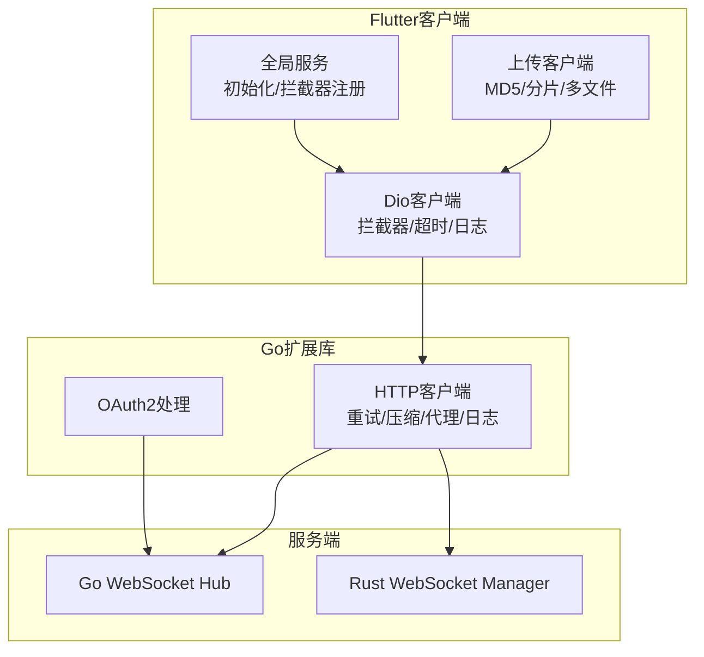
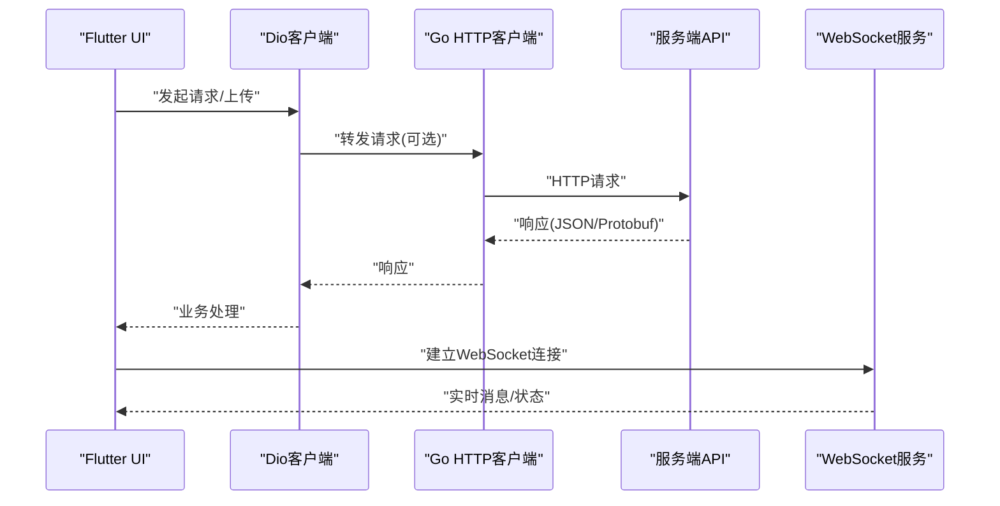
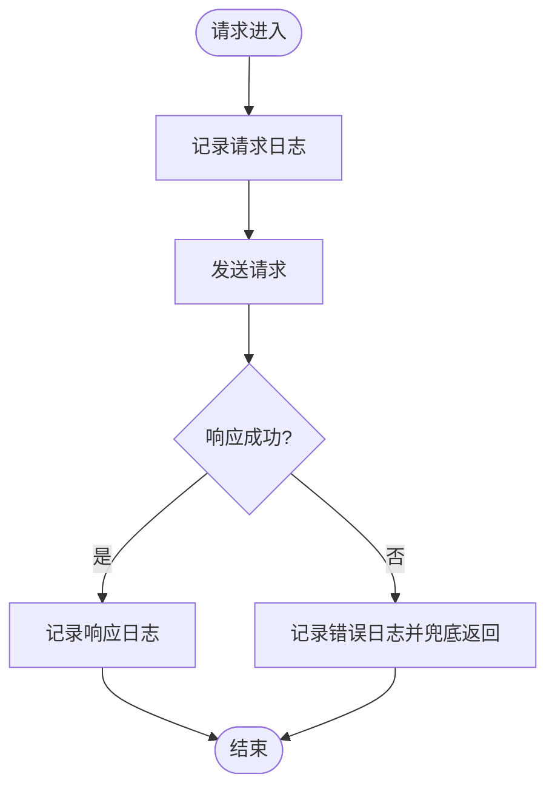
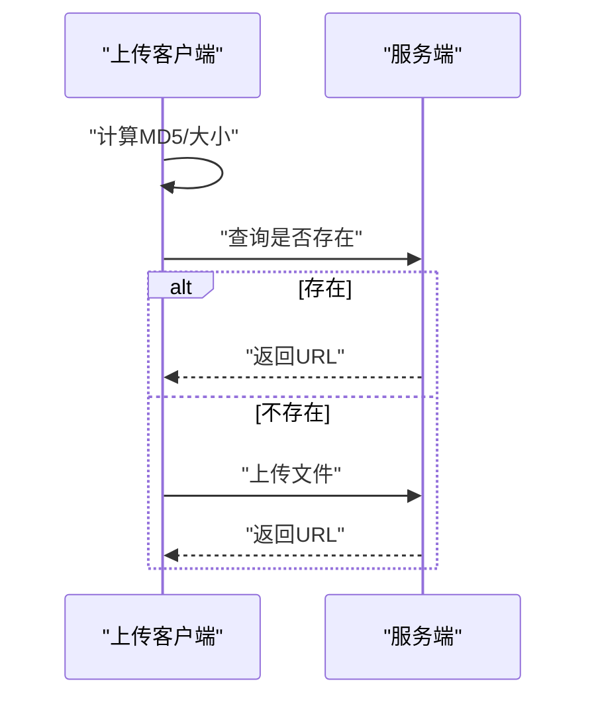
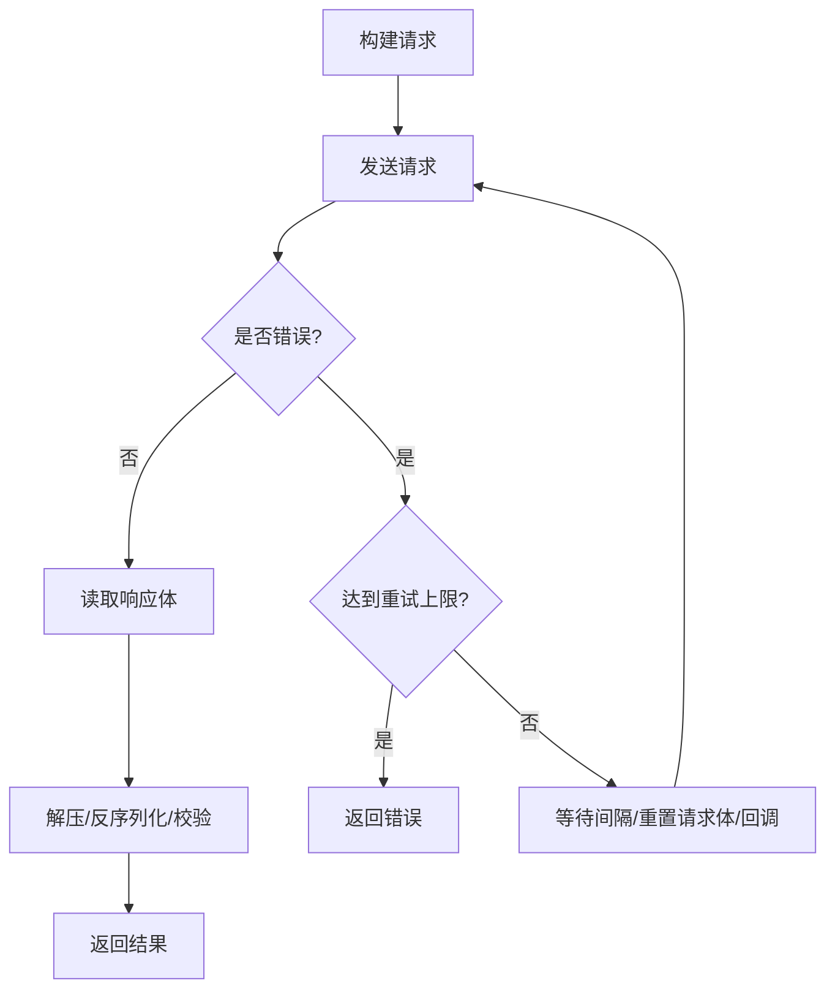
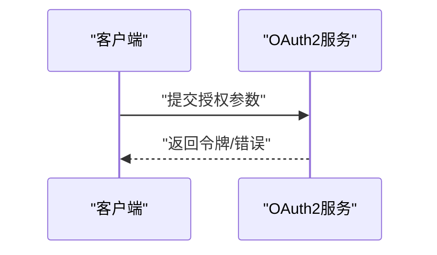
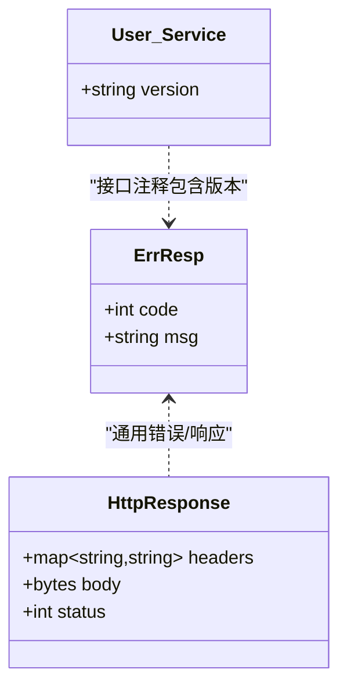
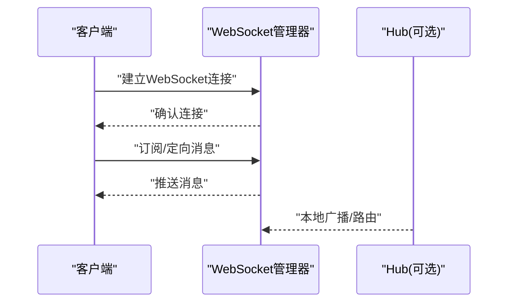
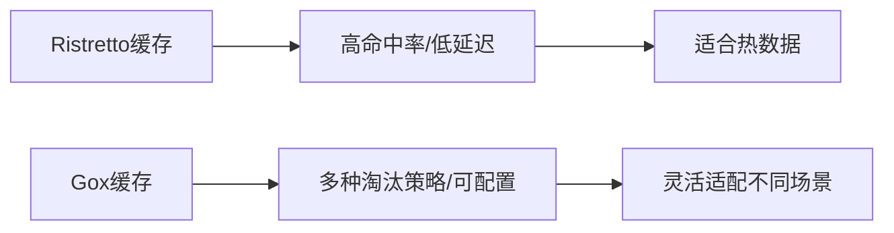
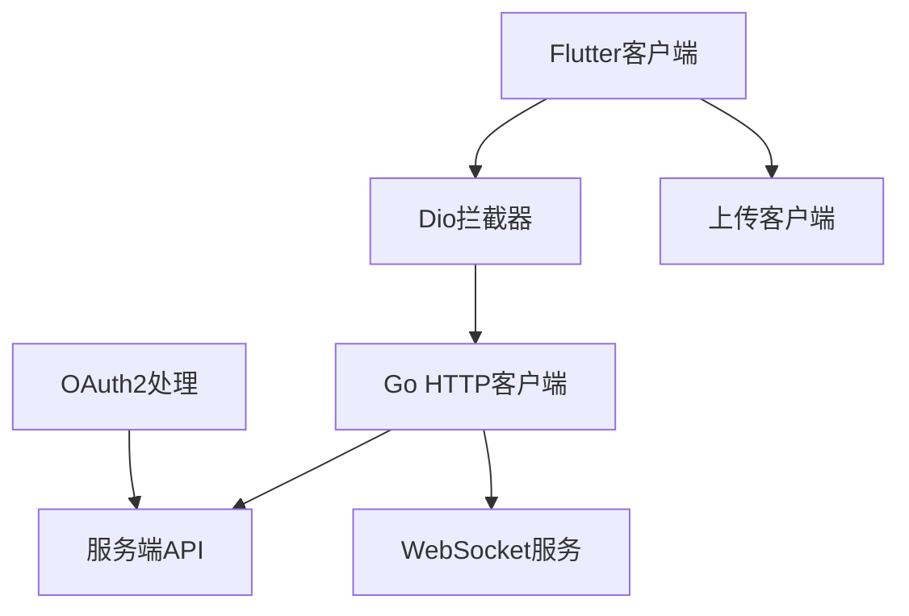

# 网络请求与API集成

<cite>
**本文档引用的文件**
- [client/app/lib/rpc/upload.dart](file://client/app/lib/rpc/upload.dart)
- [client/app/lib/rpc/http.dart](file://client/app/lib/rpc/http.dart)
- [client/app/lib/global/const.dart](file://client/app/lib/global/const.dart)
- [client/app/lib/global/service.dart](file://client/app/lib/global/service.dart)
- [thirdparty/gox/net/http/client/client.go](file://thirdparty/gox/net/http/client/client.go)
- [thirdparty/gox/net/http/client/request.go](file://thirdparty/gox/net/http/client/request.go)
- [thirdparty/gox/net/http/oauth/oauth.go](file://thirdparty/gox/net/http/oauth/oauth.go)
- [thirdparty/protobuf/response/response.pb.go](file://thirdparty/protobuf/response/response.pb.go)
- [proto/.generated/ts/src/hopeio/response/response.ts](file://proto/.generated/ts/src/hopeio/response/response.ts)
- [server/go/protobuf/user/user.service.pb.go](file://server/go/protobuf/user/service/user.service.pb.go)
- [proto/.generated/ts/src/file/file.service.ts](file://proto/.generated/ts/src/file/file.service.ts)
- [server/rust/message/src/websocket_manager.rs](file://server/rust/message/src/websocket_manager.rs)
- [server/rust/message/src/websocket_handler.rs](file://server/rust/message/src/websocket_handler.rs)
- [server/go/message/service/hub.go](file://server/go/message/service/hub.go)
- [thirdparty/initialize/dao/ristretto/cache.go](file://thirdparty/initialize/dao/ristretto/cache.go)
- [thirdparty/gox/container/cache/cache.go](file://thirdparty/gox/container/cache/cache.go)
- [client/web/buildconfig/compress.ts](file://client/web/buildconfig/compress.ts)
- [thirdparty/gox/net/http/gzip.go](file://thirdparty/gox/net/http/gzip.go)
</cite>

## 目录
1. [简介](#简介)
2. [项目结构](#项目结构)
3. [核心组件](#核心组件)
4. [架构总览](#架构总览)
5. [详细组件分析](#详细组件分析)
6. [依赖关系分析](#依赖关系分析)
7. [性能考量](#性能考量)
8. [故障排查指南](#故障排查指南)
9. [结论](#结论)
10. [附录](#附录)

## 简介
本文件面向Hoper Flutter网络请求系统，系统性梳理HTTP客户端封装、请求拦截器、响应处理与错误重试机制；详解API调用方式、数据模型映射与缓存策略；阐述WebSocket连接管理、实时消息处理与离线数据同步；并提供认证令牌处理、文件上传下载、API版本管理等实践示例与最佳实践。

## 项目结构
Hoper网络栈由三层组成：
- Flutter客户端层：基于Dio封装HTTP客户端，统一拦截器、超时与日志；文件上传通过自定义客户端实现。
- Go扩展库层：提供可插拔的HTTP客户端（含重试、压缩、代理、日志），以及OAuth2处理能力。
- 服务端层：Go与Rust双栈WebSocket消息服务，支持连接管理、广播与定向推送。

图表来源
- [client/app/lib/rpc/http.dart:5-31](file://client/app/lib/rpc/http.dart#L5-L31)
- [client/app/lib/rpc/upload.dart:13-87](file://client/app/lib/rpc/upload.dart#L13-L87)
- [client/app/lib/global/service.dart:44-83](file://client/app/lib/global/service.dart#L44-L83)
- [thirdparty/gox/net/http/client/client.go:56-80](file://thirdparty/gox/net/http/client/client.go#L56-L80)
- [server/rust/message/src/websocket_manager.rs:24-42](file://server/rust/message/src/websocket_manager.rs#L24-L42)
- [server/go/message/service/hub.go:18-25](file://server/go/message/service/hub.go#L18-L25)

章节来源
- [client/app/lib/rpc/http.dart:5-31](file://client/app/lib/rpc/http.dart#L5-L31)
- [client/app/lib/rpc/upload.dart:13-87](file://client/app/lib/rpc/upload.dart#L13-L87)
- [client/app/lib/global/service.dart:44-83](file://client/app/lib/global/service.dart#L44-L83)
- [thirdparty/gox/net/http/client/client.go:56-80](file://thirdparty/gox/net/http/client/client.go#L56-L80)

## 核心组件
- Flutter HTTP客户端与拦截器
  - 基于Dio的两个客户端：JSON与Protobuf，分别设置基础URL、超时、内容类型与默认头。
  - 统一拦截器：请求/响应/错误日志输出，错误时兜底返回空响应，避免崩溃。
- 文件上传客户端
  - 支持单文件与多文件上传，先查询是否存在同MD5与大小的文件，存在则复用；否则上传并返回URL。
- Go HTTP客户端
  - 支持请求/响应处理器钩子、请求体/响应体自定义编解码、重试次数与间隔、代理、BasicAuth、日志级别。
- OAuth2处理
  - 验证授权码/刷新令牌等流程，生成访问令牌。
- 数据模型与版本管理
  - Protobuf定义通用响应结构；服务端OpenAPI注释中包含版本号，便于API演进追踪。
- WebSocket服务
  - Rust侧提供连接管理、广播与定向发送；Go侧提供Hub与本地广播/点对点路由。

章节来源
- [client/app/lib/rpc/http.dart:5-31](file://client/app/lib/rpc/http.dart#L5-L31)
- [client/app/lib/rpc/upload.dart:13-87](file://client/app/lib/rpc/upload.dart#L13-L87)
- [thirdparty/gox/net/http/client/client.go:56-80](file://thirdparty/gox/net/http/client/client.go#L56-L80)
- [thirdparty/gox/net/http/oauth/oauth.go:292-338](file://thirdparty/gox/net/http/oauth/oauth.go#L292-L338)
- [thirdparty/protobuf/response/response.pb.go:205-212](file://thirdparty/protobuf/response/response.pb.go#L205-L212)
- [proto/.generated/ts/src/hopeio/response/response.ts:307-335](file://proto/.generated/ts/src/hopeio/response/response.ts#L307-L335)
- [server/go/protobuf/user/user.service.pb.go:1082-1107](file://server/go/protobuf/user/service/user.service.pb.go#L1082-L1107)

## 架构总览
下图展示了从Flutter客户端到Go/Rust服务端的完整调用链路，包括认证、上传、WebSocket实时通信与缓存策略。

图表来源
- [client/app/lib/rpc/http.dart:5-31](file://client/app/lib/rpc/http.dart#L5-L31)
- [thirdparty/gox/net/http/client/client.go:226-235](file://thirdparty/gox/net/http/client/client.go#L226-L235)
- [server/rust/message/src/websocket_manager.rs:50-83](file://server/rust/message/src/websocket_manager.rs#L50-L83)

## 详细组件分析

### Flutter HTTP客户端与拦截器
- 客户端配置
  - JSON客户端：默认JSON内容类型与接受类型，短连接/接收超时。
  - Protobuf客户端：响应类型为字节数组，内容类型为application/x-protobuf。
- 拦截器
  - onRequest：记录请求方法与路径。
  - onResponse：记录状态码与路径。
  - onError：记录异常与堆栈，并兜底返回空响应，避免崩溃。
- 全局服务
  - 初始化时注册拦截器至两个客户端。
  - 提供Subject驱动的CallOptions，便于集中控制超时等参数。

图表来源
- [client/app/lib/rpc/http.dart:33-52](file://client/app/lib/rpc/http.dart#L33-L52)
- [client/app/lib/global/service.dart:54-55](file://client/app/lib/global/service.dart#L54-L55)

章节来源
- [client/app/lib/rpc/http.dart:5-31](file://client/app/lib/rpc/http.dart#L5-L31)
- [client/app/lib/rpc/http.dart:33-52](file://client/app/lib/rpc/http.dart#L33-L52)
- [client/app/lib/global/service.dart:44-83](file://client/app/lib/global/service.dart#L44-L83)

### 文件上传客户端
- 单文件上传
  - 计算文件大小与MD5，先查询服务端是否存在同MD5/大小的文件；若存在直接返回URL；否则上传并返回URL。
- 多文件上传
  - 并行计算MD5与大小，构造FormData批量上传，返回URL列表。
- 错误处理
  - 任一步骤异常均返回空字符串，上层可降级处理。

图表来源
- [client/app/lib/rpc/upload.dart:19-55](file://client/app/lib/rpc/upload.dart#L19-L55)
- [client/app/lib/rpc/upload.dart:57-81](file://client/app/lib/rpc/upload.dart#L57-L81)

章节来源
- [client/app/lib/rpc/upload.dart:13-87](file://client/app/lib/rpc/upload.dart#L13-L87)

### Go HTTP客户端与重试机制
- 客户端能力
  - 请求头合并、请求体/响应体自定义编解码、响应处理器钩子、日志记录、代理、BasicAuth。
  - 支持按需设置HttpClient选项与超时。
- 重试策略
  - 可配置重试次数与间隔；每次重试前可执行自定义回调；当发生错误且未达上限时触发重试。
- 响应处理
  - 自动识别gzip/br/deflate/zstd等压缩；支持返回原始流或字节；支持自定义反序列化。

图表来源
- [thirdparty/gox/net/http/client/request.go:211-243](file://thirdparty/gox/net/http/client/request.go#L211-L243)
- [thirdparty/gox/net/http/client/request.go:314-333](file://thirdparty/gox/net/http/client/request.go#L314-L333)
- [thirdparty/gox/net/http/client/request.go:335-365](file://thirdparty/gox/net/http/client/request.go#L335-L365)

章节来源
- [thirdparty/gox/net/http/client/client.go:56-80](file://thirdparty/gox/net/http/client/client.go#L56-L80)
- [thirdparty/gox/net/http/client/client.go:179-220](file://thirdparty/gox/net/http/client/client.go#L179-L220)
- [thirdparty/gox/net/http/client/request.go:113-365](file://thirdparty/gox/net/http/client/request.go#L113-L365)

### OAuth2令牌处理
- 授权流程
  - 验证授权码/刷新令牌等请求参数，根据grant_type生成对应令牌生成请求。
  - 成功后返回令牌数据，失败时返回标准化错误结构。
- 应用场景
  - 在HTTP客户端中结合BasicAuth或拦截器注入令牌，保障受保护资源访问。

图表来源
- [thirdparty/gox/net/http/oauth/oauth.go:292-338](file://thirdparty/gox/net/http/oauth/oauth.go#L292-L338)

章节来源
- [thirdparty/gox/net/http/oauth/oauth.go:292-338](file://thirdparty/gox/net/http/oauth/oauth.go#L292-L338)

### 数据模型映射与API版本管理
- 通用响应模型
  - Go/TS两端均提供通用ErrResp与HttpResponse模型，字段覆盖状态码、消息与响应体。
- 版本管理
  - 服务端OpenAPI注释中包含版本号（如v1.0.0），便于客户端按版本适配与灰度发布。
- Protobuf与Dart互操作
  - 通过生成的Dart类进行序列化/反序列化，确保跨语言一致性。

图表来源
- [thirdparty/protobuf/response/response.pb.go:191-212](file://thirdparty/protobuf/response/response.pb.go#L191-L212)
- [proto/.generated/ts/src/hopeio/response/response.ts:296-335](file://proto/.generated/ts/src/hopeio/response/response.ts#L296-L335)
- [server/go/protobuf/user/user.service.pb.go:1082-1107](file://server/go/protobuf/user/service/user.service.pb.go#L1082-L1107)

章节来源
- [thirdparty/protobuf/response/response.pb.go:191-212](file://thirdparty/protobuf/response/response.pb.go#L191-L212)
- [proto/.generated/ts/src/hopeio/response/response.ts:296-335](file://proto/.generated/ts/src/hopeio/response/response.ts#L296-L335)
- [server/go/protobuf/user/user.service.pb.go:1082-1107](file://server/go/protobuf/user/service/user.service.pb.go#L1082-L1107)

### WebSocket连接管理与实时消息
- Rust WebSocket
  - 管理器维护用户会话映射与全局广播通道；处理连接生命周期、消息收发与断开清理。
- Go WebSocket Hub
  - 本地Hub负责广播与点对点消息路由，支持多实例场景下的消息分发。
- 在线用户查询
  - 提供在线用户列表接口，便于前端展示与统计。

图表来源
- [server/rust/message/src/websocket_manager.rs:50-83](file://server/rust/message/src/websocket_manager.rs#L50-L83)
- [server/rust/message/src/websocket_handler.rs:46-78](file://server/rust/message/src/websocket_handler.rs#L46-L78)
- [server/go/message/service/hub.go:52-72](file://server/go/message/service/hub.go#L52-L72)

章节来源
- [server/rust/message/src/websocket_manager.rs:24-42](file://server/rust/message/src/websocket_manager.rs#L24-L42)
- [server/rust/message/src/websocket_handler.rs:46-78](file://server/rust/message/src/websocket_handler.rs#L46-L78)
- [server/go/message/service/hub.go:18-25](file://server/go/message/service/hub.go#L18-L25)

### 缓存策略
- 内存缓存
  - Ristretto：高性能键值缓存，适合热点数据；可通过配置调整计数器、最大成本与缓冲项。
  - Gox缓存：支持LRU/LFU/ARC/Simple多种淘汰策略，带过期时间与清理/加载钩子。
- 使用建议
  - 对频繁读取的元数据、用户信息等采用LRU；对热点配置采用Ristretto；对需要持久化的场景结合本地数据库或Hive。

图表来源
- [thirdparty/initialize/dao/ristretto/cache.go:41-61](file://thirdparty/initialize/dao/ristretto/cache.go#L41-L61)
- [thirdparty/gox/container/cache/cache.go:135-157](file://thirdparty/gox/container/cache/cache.go#L135-L157)

章节来源
- [thirdparty/initialize/dao/ristretto/cache.go:13-61](file://thirdparty/initialize/dao/ristretto/cache.go#L13-L61)
- [thirdparty/gox/container/cache/cache.go:11-171](file://thirdparty/gox/container/cache/cache.go#L11-L171)

## 依赖关系分析
- 客户端依赖
  - Flutter客户端依赖Dio与拦截器；全局服务负责初始化与注册。
  - 上传客户端依赖HTTP客户端与模型类。
- 服务端依赖
  - Go HTTP客户端作为统一入口，服务端API与WebSocket服务在其之上运行。
  - OAuth2处理为令牌颁发与校验提供支撑。
- 压缩与传输
  - 服务端Gzip处理器与客户端支持的压缩格式相匹配，减少带宽消耗。

图表来源
- [client/app/lib/rpc/http.dart:5-31](file://client/app/lib/rpc/http.dart#L5-L31)
- [client/app/lib/rpc/upload.dart:13-87](file://client/app/lib/rpc/upload.dart#L13-L87)
- [thirdparty/gox/net/http/client/client.go:56-80](file://thirdparty/gox/net/http/client/client.go#L56-L80)
- [thirdparty/gox/net/http/gzip.go:94-135](file://thirdparty/gox/net/http/gzip.go#L94-L135)

章节来源
- [client/app/lib/rpc/http.dart:5-31](file://client/app/lib/rpc/http.dart#L5-L31)
- [client/app/lib/rpc/upload.dart:13-87](file://client/app/lib/rpc/upload.dart#L13-L87)
- [thirdparty/gox/net/http/client/client.go:56-80](file://thirdparty/gox/net/http/client/client.go#L56-L80)
- [thirdparty/gox/net/http/gzip.go:94-135](file://thirdparty/gox/net/http/gzip.go#L94-L135)

## 性能考量
- 压缩策略
  - 服务端启用Gzip/Brotli压缩，客户端自动识别Content-Encoding并解压，显著降低传输体积。
  - 前端构建阶段可开启gzip/brotli压缩插件，进一步优化静态资源。
- 重试与超时
  - Go HTTP客户端支持指数退避与固定间隔重试，结合短超时与快速失败，提升稳定性。
- 缓存
  - 热点数据采用Ristretto或Gox缓存，减少重复请求；结合LRU/ARC策略平衡命中率与内存占用。
- 上传优化
  - 上传前先查询同MD5/大小文件，避免重复上传；多文件上传采用并行计算与批量上传，缩短总耗时。

章节来源
- [thirdparty/gox/net/http/gzip.go:94-135](file://thirdparty/gox/net/http/gzip.go#L94-L135)
- [client/web/buildconfig/compress.ts:1-62](file://client/web/buildconfig/compress.ts#L1-L62)
- [thirdparty/gox/net/http/client/client.go:179-188](file://thirdparty/gox/net/http/client/client.go#L179-L188)
- [client/app/lib/rpc/upload.dart:57-81](file://client/app/lib/rpc/upload.dart#L57-L81)

## 故障排查指南
- 常见问题
  - 请求超时：检查Dio超时配置与网络环境；必要时在Go HTTP客户端中增加重试。
  - 响应解码失败：确认Content-Type与期望的响应类型一致；必要时使用原始流读取。
  - WebSocket连接失败：检查握手路径、令牌校验与服务器负载。
- 日志定位
  - Flutter拦截器记录请求/响应/错误；Go HTTP客户端支持访问日志参数，便于定位问题。
- 降级策略
  - 上传客户端在异常时返回空字符串，上层可回退到本地缓存或提示重试。

章节来源
- [client/app/lib/rpc/http.dart:33-52](file://client/app/lib/rpc/http.dart#L33-L52)
- [thirdparty/gox/net/http/client/request.go:131-152](file://thirdparty/gox/net/http/client/request.go#L131-L152)

## 结论
Hoper网络栈通过Flutter Dio客户端、Go HTTP客户端与服务端WebSocket服务形成完整的请求-响应与实时通信闭环。借助拦截器、重试、压缩与缓存等机制，系统在可用性、性能与可观测性方面具备良好表现。配合Protobuf与OpenAPI版本标注，便于跨语言协作与API演进。

## 附录
- 认证令牌处理要点
  - 在拦截器中注入Authorization头；或使用BasicAuth；OAuth2流程由服务端处理，客户端负责携带令牌访问受保护资源。
- 文件上传下载
  - 上传前先查询同MD5/大小文件；多文件上传采用并行策略；下载可使用流式读取以节省内存。
- API版本管理
  - 服务端OpenAPI注释中标注版本号，客户端按版本适配；Protobuf模型保持向前兼容。