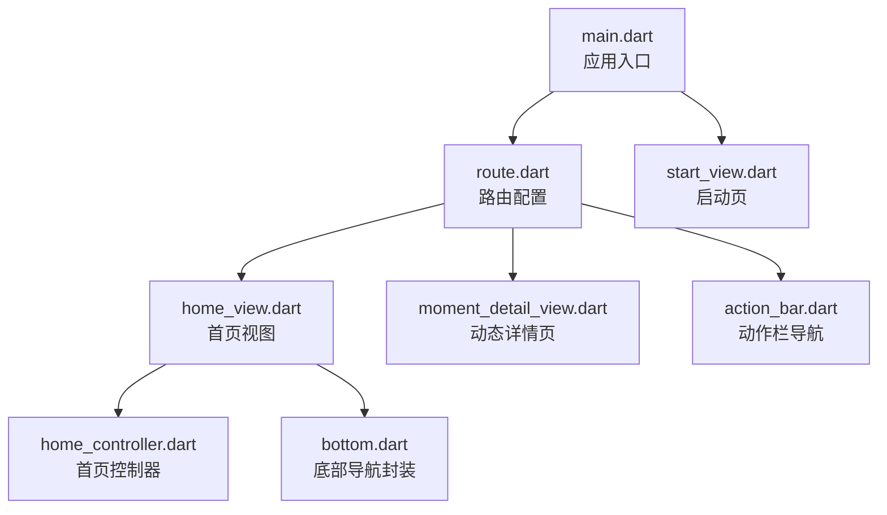
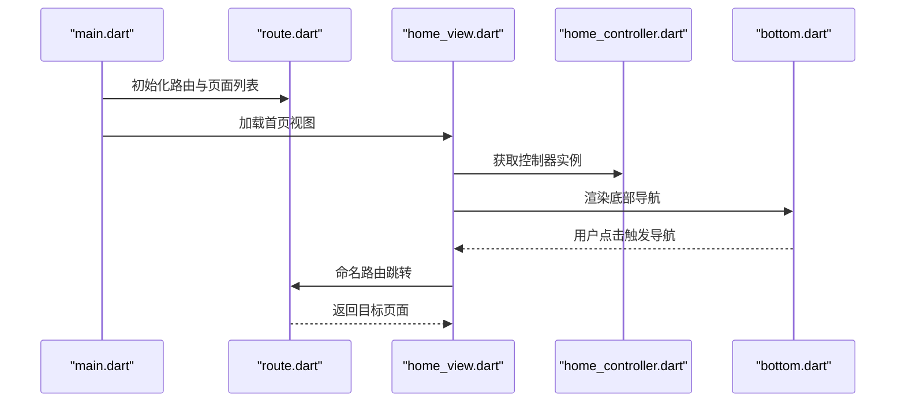
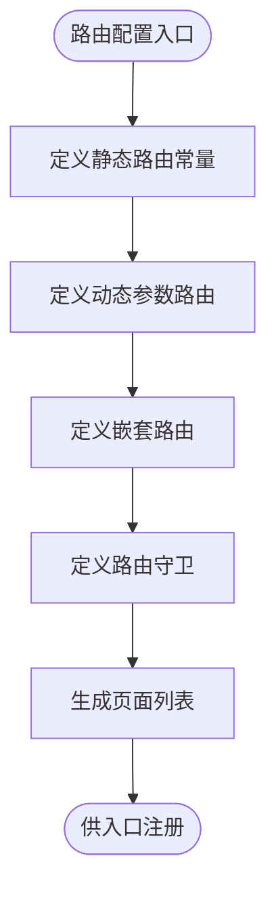
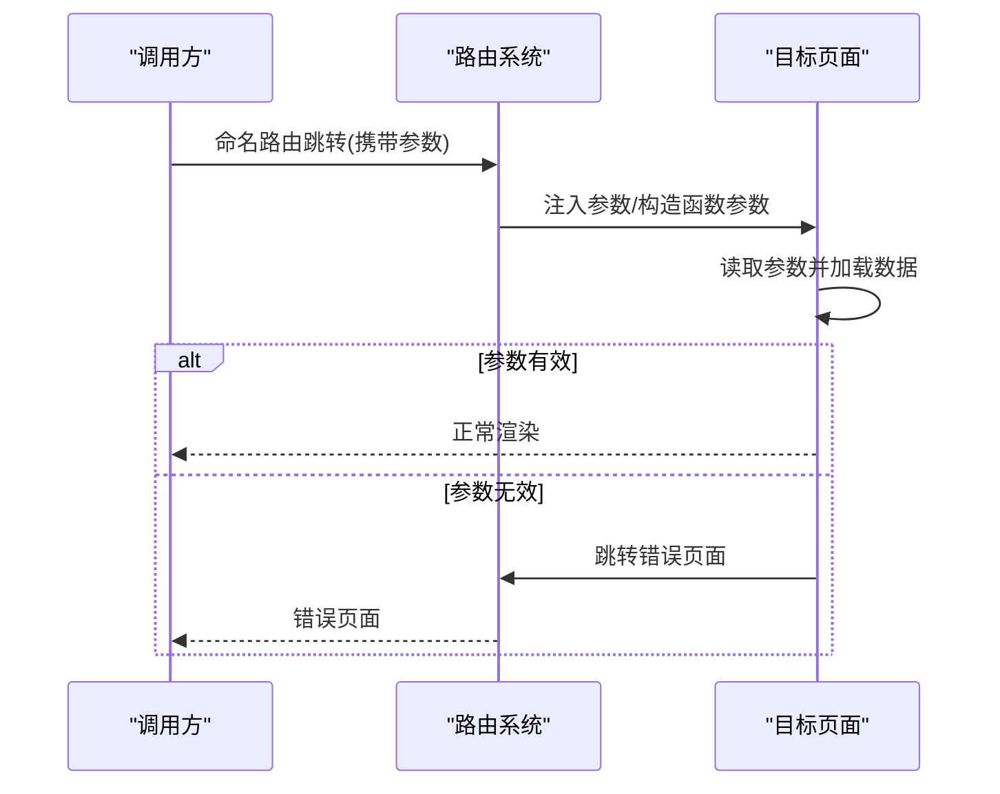
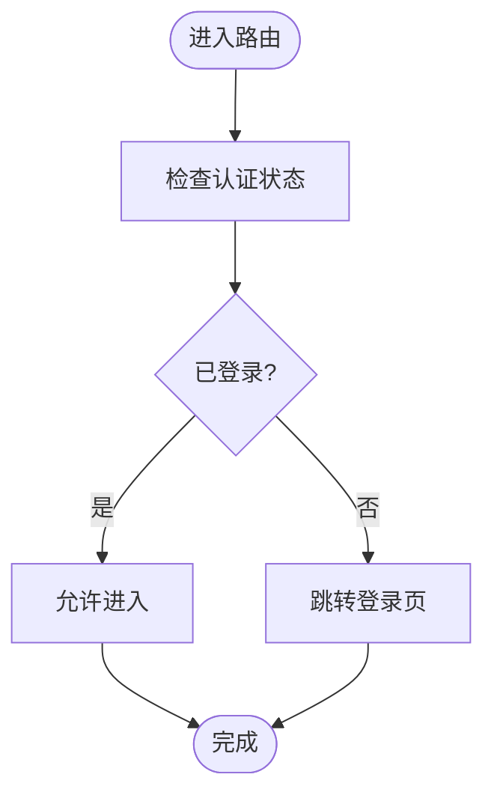
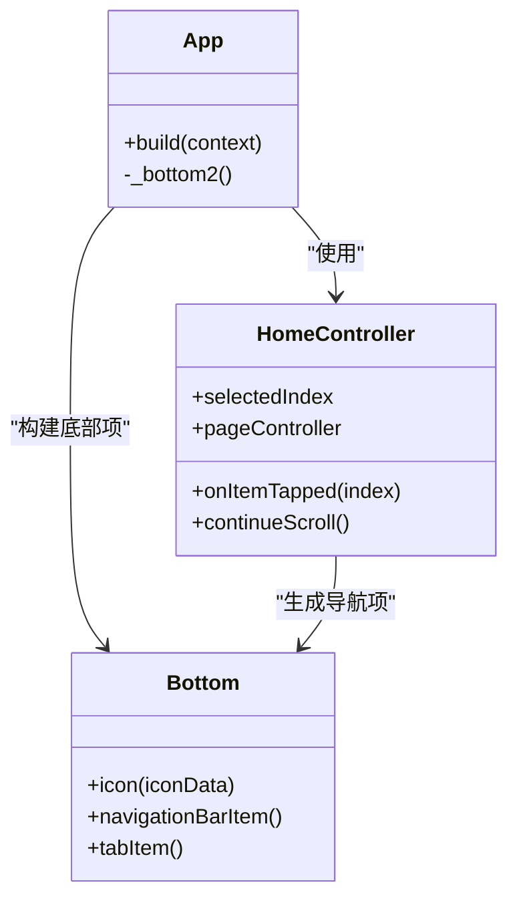
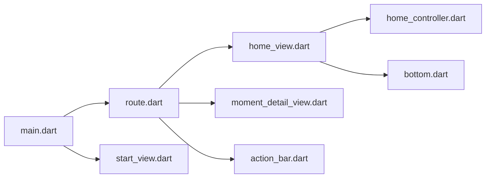

# 路由与导航系统

<cite>
**本文档引用的文件**
- [main.dart](file://client/app/lib/main.dart)
- [route.dart](file://client/app/lib/pages/route.dart)
- [home_view.dart](file://client/app/lib/pages/home/home_view.dart)
- [home_controller.dart](file://client/app/lib/pages/home/home_controller.dart)
- [bottom.dart](file://client/app/lib/components/bottom/bottom.dart)
- [moment_detail_view.dart](file://client/app/lib/pages/moment/detail/moment_detail_view.dart)
- [action_bar.dart](file://client/app/lib/pages/action_bar/action_bar.dart)
- [start_view.dart](file://client/app/lib/pages/splash/start_view.dart)
</cite>

## 目录
1. [简介](#简介)
2. [项目结构](#项目结构)
3. [核心组件](#核心组件)
4. [架构总览](#架构总览)
5. [详细组件分析](#详细组件分析)
6. [依赖关系分析](#依赖关系分析)
7. [性能考虑](#性能考虑)
8. [故障排查指南](#故障排查指南)
9. [结论](#结论)
10. [附录](#附录)

## 简介
本文件面向Hoper Flutter客户端的路由与导航系统，基于GetX路由管理器进行技术文档梳理。内容涵盖：
- 命名路由与动态参数传递
- 路由守卫与拦截机制
- 页面导航策略与Tab导航实现
- 路由拦截器与深度链接处理思路
- 路由动画与页面转场
- 导航状态管理与复杂场景（如Tab切换、堆栈管理、服务端路由跳转）
- 调试技巧与性能优化建议

## 项目结构
Hoper Flutter客户端采用GetX作为路由与状态管理核心，路由集中定义在路由配置文件中，并通过主入口统一注册。页面间导航通过命名路由与参数传递完成，同时结合控制器与绑定实现状态管理。

图表来源
- [main.dart:17-70](file://client/app/lib/main.dart#L17-L70)
- [route.dart:23-102](file://client/app/lib/pages/route.dart#L23-L102)
- [home_view.dart:29-117](file://client/app/lib/pages/home/home_view.dart#L29-L117)
- [home_controller.dart:9-70](file://client/app/lib/pages/home/home_controller.dart#L9-L70)
- [bottom.dart:7-35](file://client/app/lib/components/bottom/bottom.dart#L7-L35)
- [moment_detail_view.dart:16-88](file://client/app/lib/pages/moment/detail/moment_detail_view.dart#L16-L88)
- [action_bar.dart:50-182](file://client/app/lib/pages/action_bar/action_bar.dart#L50-L182)
- [start_view.dart:1-50](file://client/app/lib/pages/splash/start_view.dart#L1-L50)

章节来源
- [main.dart:17-70](file://client/app/lib/main.dart#L17-L70)
- [route.dart:23-102](file://client/app/lib/pages/route.dart#L23-L102)

## 核心组件
- 应用入口与全局配置：在入口中初始化GetX并注册国际化、主题、初始路由与页面列表。
- 路由配置中心：集中定义命名路由、动态参数路由、嵌套路由以及路由守卫。
- 视图与控制器：通过GetX控制器管理页面状态，配合底部导航与Tab切换实现复杂导航场景。
- 参数传递与动态路由：通过动态段与参数对象实现灵活的路由参数传递。

章节来源
- [main.dart:17-70](file://client/app/lib/main.dart#L17-L70)
- [route.dart:23-102](file://client/app/lib/pages/route.dart#L23-L102)
- [home_view.dart:29-117](file://client/app/lib/pages/home/home_view.dart#L29-L117)
- [home_controller.dart:9-70](file://client/app/lib/pages/home/home_controller.dart#L9-L70)
- [bottom.dart:7-35](file://client/app/lib/components/bottom/bottom.dart#L7-L35)
- [moment_detail_view.dart:16-88](file://client/app/lib/pages/moment/detail/moment_detail_view.dart#L16-L88)
- [action_bar.dart:50-182](file://client/app/lib/pages/action_bar/action_bar.dart#L50-L182)

## 架构总览
下图展示了从应用启动到页面渲染、路由导航与状态管理的整体流程。

图表来源
- [main.dart:17-70](file://client/app/lib/main.dart#L17-L70)
- [route.dart:56-99](file://client/app/lib/pages/route.dart#L56-L99)
- [home_view.dart:29-117](file://client/app/lib/pages/home/home_view.dart#L29-L117)
- [home_controller.dart:9-70](file://client/app/lib/pages/home/home_controller.dart#L9-L70)
- [bottom.dart:7-35](file://client/app/lib/components/bottom/bottom.dart#L7-L35)

## 详细组件分析

### 路由配置与命名路由
- 路由常量与动态参数：集中定义静态路由与动态参数路由，支持通过动态段接收参数。
- 嵌套路由：在父路由下定义子路由，形成父子层级关系，便于模块化管理。
- 路由守卫：提供统一的认证检查方法，在进入受保护页面前进行拦截与跳转。

图表来源
- [route.dart:23-102](file://client/app/lib/pages/route.dart#L23-L102)

章节来源
- [route.dart:23-102](file://client/app/lib/pages/route.dart#L23-L102)

### 参数传递与动态路由
- 动态参数接收：在目标页面中通过参数字典获取动态段值，结合业务逻辑加载数据。
- 参数对象传递：通过构造函数或参数对象向目标页面传递完整数据，避免二次查询。
- 错误处理：当参数缺失或无效时，跳转至错误页面或默认页面。

图表来源
- [moment_detail_view.dart:16-88](file://client/app/lib/pages/moment/detail/moment_detail_view.dart#L16-L88)

章节来源
- [moment_detail_view.dart:16-88](file://client/app/lib/pages/moment/detail/moment_detail_view.dart#L16-L88)

### 路由守卫与拦截机制
- 统一认证检查：在路由守卫中判断用户登录状态，未登录则跳转登录页。
- 条件拦截：根据业务条件决定是否允许进入目标页面，例如权限校验或前置流程。

图表来源
- [route.dart:53-53](file://client/app/lib/pages/route.dart#L53-L53)
- [action_bar.dart:165-180](file://client/app/lib/pages/action_bar/action_bar.dart#L165-L180)

章节来源
- [route.dart:53-53](file://client/app/lib/pages/route.dart#L53-L53)
- [action_bar.dart:165-180](file://client/app/lib/pages/action_bar/action_bar.dart#L165-L180)

### 页面导航策略与Tab导航
- 首页容器：通过PageController控制多个子页面的切换，实现类似Tab的导航体验。
- 底部导航：使用自定义底部导航封装，支持图标、标签与点击事件。
- 中央按钮拦截：在特定Tab点击时拦截并跳转到新增页面，体现路由拦截与导航策略。

图表来源
- [home_controller.dart:9-70](file://client/app/lib/pages/home/home_controller.dart#L9-L70)
- [bottom.dart:7-35](file://client/app/lib/components/bottom/bottom.dart#L7-L35)
- [home_view.dart:29-117](file://client/app/lib/pages/home/home_view.dart#L29-L117)

章节来源
- [home_controller.dart:9-70](file://client/app/lib/pages/home/home_controller.dart#L9-L70)
- [bottom.dart:7-35](file://client/app/lib/components/bottom/bottom.dart#L7-L35)
- [home_view.dart:29-117](file://client/app/lib/pages/home/home_view.dart#L29-L117)

### 路由拦截器与深度链接处理
- 路由拦截器：可利用GetX提供的路由拦截能力，在进入/离开路由时执行钩子逻辑，实现埋点、鉴权、状态同步等。
- 深度链接处理：通过动态参数路由与命名路由组合，支持从外部链接直接打开指定页面；结合路由守卫实现安全访问。

章节来源
- [route.dart:23-102](file://client/app/lib/pages/route.dart#L23-L102)

### 路由动画效果与页面转场
- 页面转场：GetX支持多种页面转场动画，可通过路由配置或导航API传入动画参数。
- 动画控制：在控制器中结合动画控制器实现页面内动画，提升用户体验。

章节来源
- [home_view.dart:29-117](file://client/app/lib/pages/home/home_view.dart#L29-L117)

### 导航状态管理
- 控制器与绑定：通过GetX控制器管理页面状态，结合绑定实现状态与视图解耦。
- 全局状态：在入口处注册全局绑定，确保应用级状态在路由切换后仍可访问。

章节来源
- [main.dart:17-70](file://client/app/lib/main.dart#L17-L70)
- [home_controller.dart:9-70](file://client/app/lib/pages/home/home_controller.dart#L9-L70)

### 复杂导航场景示例
- Tab导航：首页通过PageController与底部导航实现多页面切换。
- 堆栈管理：通过命名路由与参数传递实现页面间数据共享与状态复用。
- 服务端路由跳转：结合动态参数与路由守卫，实现服务端下发的页面跳转。

章节来源
- [home_view.dart:29-117](file://client/app/lib/pages/home/home_view.dart#L29-L117)
- [route.dart:23-102](file://client/app/lib/pages/route.dart#L23-L102)

## 依赖关系分析
- 入口依赖路由配置：应用入口依赖路由配置文件以注册页面与初始路由。
- 视图依赖控制器：视图通过GetX查找控制器实例，实现状态与交互。
- 路由依赖守卫：路由配置依赖守卫方法实现统一拦截。
- 底部导航依赖封装：底部导航组件提供统一的导航项构建。

图表来源
- [main.dart:17-70](file://client/app/lib/main.dart#L17-L70)
- [route.dart:56-99](file://client/app/lib/pages/route.dart#L56-L99)
- [home_view.dart:29-117](file://client/app/lib/pages/home/home_view.dart#L29-L117)
- [home_controller.dart:9-70](file://client/app/lib/pages/home/home_controller.dart#L9-L70)
- [bottom.dart:7-35](file://client/app/lib/components/bottom/bottom.dart#L7-L35)
- [moment_detail_view.dart:16-88](file://client/app/lib/pages/moment/detail/moment_detail_view.dart#L16-L88)
- [action_bar.dart:50-182](file://client/app/lib/pages/action_bar/action_bar.dart#L50-L182)
- [start_view.dart:1-50](file://client/app/lib/pages/splash/start_view.dart#L1-L50)

章节来源
- [main.dart:17-70](file://client/app/lib/main.dart#L17-L70)
- [route.dart:56-99](file://client/app/lib/pages/route.dart#L56-L99)
- [home_view.dart:29-117](file://client/app/lib/pages/home/home_view.dart#L29-L117)
- [home_controller.dart:9-70](file://client/app/lib/pages/home/home_controller.dart#L9-L70)
- [bottom.dart:7-35](file://client/app/lib/components/bottom/bottom.dart#L7-L35)
- [moment_detail_view.dart:16-88](file://client/app/lib/pages/moment/detail/moment_detail_view.dart#L16-L88)
- [action_bar.dart:50-182](file://client/app/lib/pages/action_bar/action_bar.dart#L50-L182)
- [start_view.dart:1-50](file://client/app/lib/pages/splash/start_view.dart#L1-L50)

## 性能考虑
- 路由懒加载：通过延迟实例化页面组件，减少启动时的内存占用。
- 状态最小化：仅在必要时更新控制器状态，避免不必要的重建。
- 动画节流：合理设置动画时长与曲线，避免过度动画影响性能。
- 参数传递优化：优先使用构造函数参数传递完整对象，减少重复查询。

## 故障排查指南
- 页面无法找到：检查路由常量与页面注册是否一致，确认命名路由拼写正确。
- 参数缺失：在目标页面中校验参数字典与动态段，必要时跳转错误页面。
- 登录拦截失效：确认路由守卫逻辑与全局状态检查一致。
- 导航异常：检查控制器与底部导航的回调绑定，确保点击事件正确触发。

章节来源
- [moment_detail_view.dart:16-88](file://client/app/lib/pages/moment/detail/moment_detail_view.dart#L16-L88)
- [route.dart:53-53](file://client/app/lib/pages/route.dart#L53-L53)
- [home_view.dart:29-117](file://client/app/lib/pages/home/home_view.dart#L29-L117)

## 结论
Hoper Flutter客户端通过GetX实现了清晰的路由与导航体系：集中化的路由配置、灵活的参数传递、完善的路由守卫与拦截、以及可扩展的Tab导航与状态管理。该架构既满足日常导航需求，也为复杂场景（如嵌套路由、深度链接、服务端跳转）提供了良好基础。

## 附录
- 路由配置示例路径：[路由配置:23-102](file://client/app/lib/pages/route.dart#L23-L102)
- 入口注册示例路径：[应用入口:17-70](file://client/app/lib/main.dart#L17-L70)
- 动态参数接收示例路径：[动态详情页:16-88](file://client/app/lib/pages/moment/detail/moment_detail_view.dart#L16-L88)
- Tab导航示例路径：[首页视图:29-117](file://client/app/lib/pages/home/home_view.dart#L29-L117)，[首页控制器:9-70](file://client/app/lib/pages/home/home_controller.dart#L9-L70)，[底部导航封装:7-35](file://client/app/lib/components/bottom/bottom.dart#L7-L35)
- 路由拦截示例路径：[动作栏导航:50-182](file://client/app/lib/pages/action_bar/action_bar.dart#L50-L182)，[路由守卫:53-53](file://client/app/lib/pages/route.dart#L53-L53)
- 启动页跳转示例路径：[启动页:1-50](file://client/app/lib/pages/splash/start_view.dart#L1-L50)