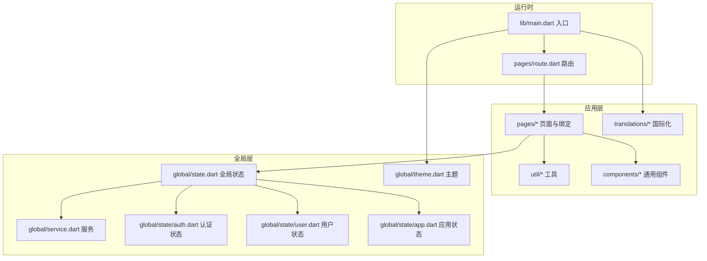
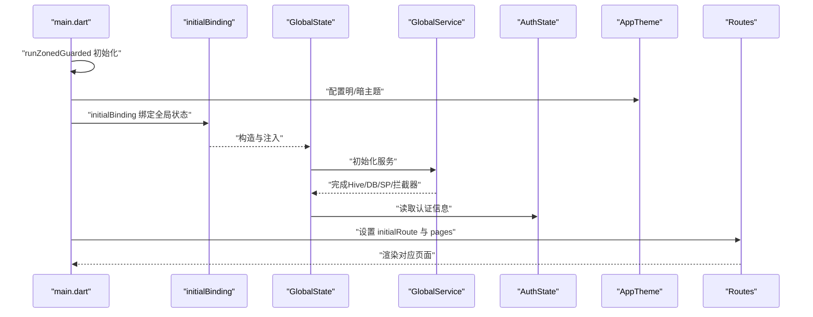
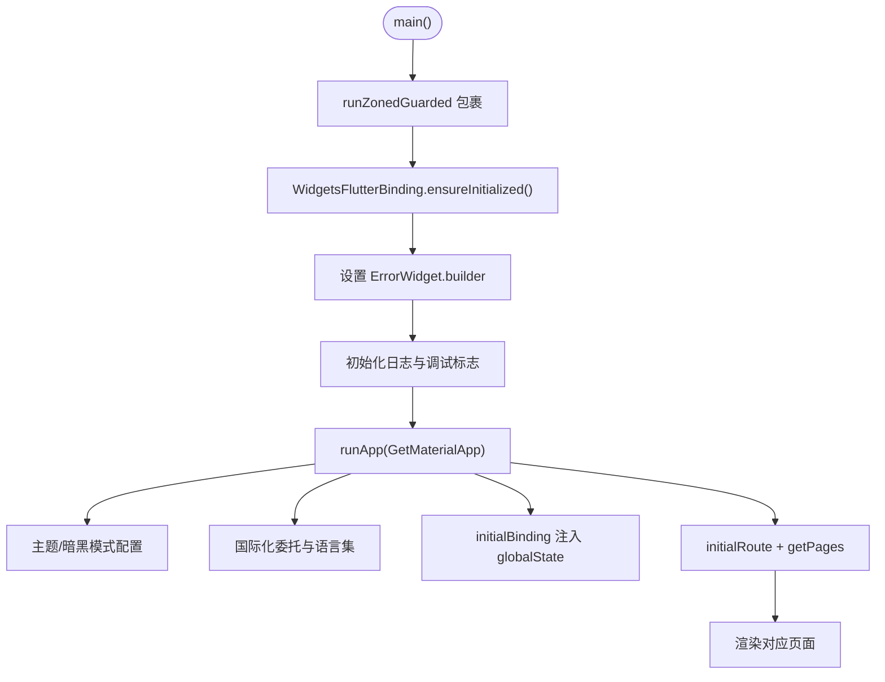
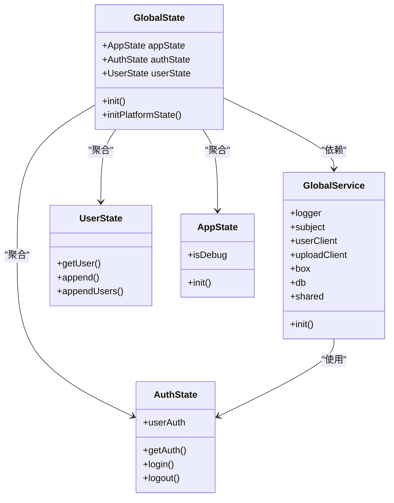
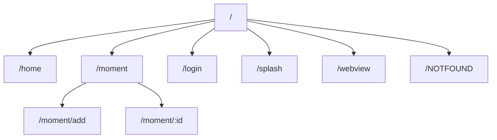
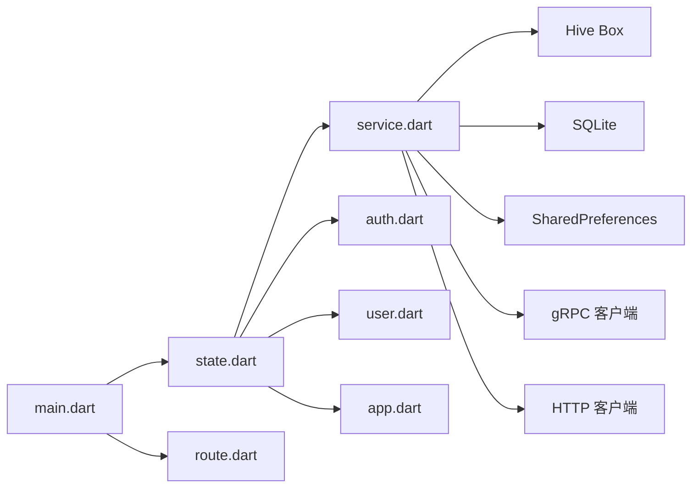

# 项目初始化与配置

<cite>
**本文档引用的文件**
- [pubspec.yaml](file://client/app/pubspec.yaml)
- [main.dart](file://client/app/lib/main.dart)
- [analysis_options.yaml](file://client/app/analysis_options.yaml)
- [build.yaml](file://client/app/build.yaml)
- [flutter_native_splash.yaml](file://client/app/flutter_native_splash.yaml)
- [state.dart](file://client/app/lib/global/state.dart)
- [theme.dart](file://client/app/lib/global/theme.dart)
- [route.dart](file://client/app/lib/pages/route.dart)
- [app.dart](file://client/app/lib/global/state/app.dart)
- [auth.dart](file://client/app/lib/global/state/auth.dart)
- [user.dart](file://client/app/lib/global/state/user.dart)
- [service.dart](file://client/app/lib/global/service.dart)
- [README.md](file://README.md)
</cite>

## 目录
1. [简介](#简介)
2. [项目结构](#项目结构)
3. [核心组件](#核心组件)
4. [架构总览](#架构总览)
5. [详细组件分析](#详细组件分析)
6. [依赖分析](#依赖分析)
7. [性能考虑](#性能考虑)
8. [故障排查指南](#故障排查指南)
9. [结论](#结论)
10. [附录](#附录)

## 简介
本文件面向Hoper Flutter客户端（client/app）的初始化与配置，围绕以下目标展开：  
- 深入解释pubspec.yaml依赖管理配置、Flutter SDK版本要求与插件依赖关系  
- 详解main.dart入口文件的初始化流程，包括错误处理机制、全局状态绑定与主题配置  
- 阐述项目的目录结构设计原则、代码规范与分析选项配置  
- 提供开发环境搭建步骤、依赖安装流程与常见配置问题的解决方案  
- 给出具体配置示例与最佳实践指导  

## 项目结构
client/app为标准Flutter应用工程，采用模块化组织：  
- lib/components：通用UI组件  
- lib/global：全局状态、服务、主题、常量等  
- lib/pages：路由页面与绑定  
- lib/rpc：gRPC/HTTP客户端封装  
- lib/translations：国际化资源  
- lib/util：工具类  
- 资源与构建配置：assets、pubspec.yaml、analysis_options.yaml、build.yaml、flutter_native_splash.yaml等  

图表来源
- [main.dart:17-70](file://client/app/lib/main.dart#L17-L70)
- [route.dart:23-102](file://client/app/lib/pages/route.dart#L23-L102)
- [state.dart:19-200](file://client/app/lib/global/state.dart#L19-L200)
- [theme.dart:8-72](file://client/app/lib/global/theme.dart#L8-L72)
- [service.dart:21-85](file://client/app/lib/global/service.dart#L21-L85)
- [auth.dart:18-113](file://client/app/lib/global/state/auth.dart#L18-L113)
- [user.dart:7-25](file://client/app/lib/global/state/user.dart#L7-L25)
- [app.dart:3-21](file://client/app/lib/global/state/app.dart#L3-L21)

章节来源
- [main.dart:17-70](file://client/app/lib/main.dart#L17-L70)
- [route.dart:23-102](file://client/app/lib/pages/route.dart#L23-L102)

## 核心组件
- 入口与运行时：main.dart通过runZonedGuarded包裹应用启动，配置国际化、主题、初始绑定与路由。  
- 全局状态：GlobalState集中管理AppState/AuthState/UserState，统一初始化设备信息与平台能力。  
- 服务层：GlobalService负责日志、Hive Box、SQLite数据库、SharedPreferences、gRPC/HTTP客户端初始化与拦截器注入。  
- 路由系统：基于GetX的Routes抽象，集中定义静态路由与动态路由参数，支持权限校验与子路由。  
- 主题与国际化：AppTheme提供明暗主题；main.dart配置多语言委托与支持语言集。  

章节来源
- [main.dart:17-70](file://client/app/lib/main.dart#L17-L70)
- [state.dart:19-200](file://client/app/lib/global/state.dart#L19-L200)
- [service.dart:21-85](file://client/app/lib/global/service.dart#L21-L85)
- [route.dart:23-102](file://client/app/lib/pages/route.dart#L23-L102)
- [theme.dart:8-72](file://client/app/lib/global/theme.dart#L8-L72)

## 架构总览
下图展示从入口到状态与服务的初始化流程，以及路由与页面的关系。

图表来源
- [main.dart:17-70](file://client/app/lib/main.dart#L17-L70)
- [state.dart:39-46](file://client/app/lib/global/state.dart#L39-L46)
- [service.dart:44-83](file://client/app/lib/global/service.dart#L44-L83)
- [auth.dart:31-47](file://client/app/lib/global/state/auth.dart#L31-L47)
- [route.dart:56-99](file://client/app/lib/pages/route.dart#L56-L99)

## 详细组件分析

### 依赖管理与SDK版本（pubspec.yaml）
- SDK版本要求：Flutter SDK版本约束为^3.10.1，确保与Dart 3生态兼容性。  
- 依赖分类：  
  - 运行时依赖：flutter、flutter_localizations、第三方包如dio、grpc、protobuf、get、sqflite/drift、hive、intl、permission_handler等。  
  - 开发依赖：build_runner、json_serializable、protoc_plugin、freezed、dart_style、flutter_lints、flutter_native_splash、flutter_launcher_icons等。  
- 资源与图标：assets目录包含图片、JS、dist等；flutter_launcher_icons配置跨平台启动图标与最小SDK版本。  
- 依赖覆盖：通过dependency_overrides锁定vector_math版本，避免潜在冲突。  

章节来源
- [pubspec.yaml:20-120](file://client/app/pubspec.yaml#L20-L120)
- [pubspec.yaml:134-182](file://client/app/pubspec.yaml#L134-L182)

### 分析选项与代码规范（analysis_options.yaml）
- 启用推荐规则：include使用flutter_lints/flutter.yaml，统一风格与质量基线。  
- 自定义规则：可按需开启/关闭特定lint规则，例如单引号偏好等。  
- 分析器排除：排除生成文件（*.g.dart、*.freezed.dart），减少误报。  
- 错误忽略：针对特定注解目标忽略无效警告，保证生成代码的可读性。  

章节来源
- [analysis_options.yaml:8-36](file://client/app/analysis_options.yaml#L8-L36)

### 代码生成配置（build.yaml）
- json_serializable默认行为：启用工厂与toJSON生成，字段映射与未识别键策略可按需调整。  
- 生成策略：checked=false、explicit_to_json=false等，平衡类型安全与性能。  

章节来源
- [build.yaml:4-23](file://client/app/build.yaml#L4-L23)

### 启动页配置（flutter_native_splash.yaml）
- 背景与图标：支持背景图与Android 12专属图标；可分别配置明/暗模式参数。  
- 平台定制：android_12.image、颜色、品牌图、定位等均可按平台细化。  
- 屏幕方向与全屏：可通过参数控制横竖屏与通知栏显示。  

章节来源
- [flutter_native_splash.yaml:17-154](file://client/app/flutter_native_splash.yaml#L17-L154)

### 入口初始化流程（main.dart）
- 错误处理：runZonedGuarded捕获未处理异常，并通过ErrorWidget.builder统一呈现“找不到页面”提示。  
- 初始化顺序：ensureInitialized -> 设置ErrorWidget.builder -> 初始化日志 -> 设置调试标志 -> runApp。  
- 全局状态绑定：initialBinding将globalState注入GetX容器，确保页面可直接访问。  
- 主题与国际化：根据globalState.isDarkMode.value选择ThemeMode；配置多语言委托与支持语言。  
- 路由与页面：initialRoute指向START；getPages提供完整路由表，含动态路由与权限校验。  
- 触摸焦点：Listener在指针按下时主动失焦，改善输入体验。  

图表来源
- [main.dart:17-70](file://client/app/lib/main.dart#L17-L70)

章节来源
- [main.dart:17-70](file://client/app/lib/main.dart#L17-L70)

### 全局状态与服务（state.dart、service.dart）
- GlobalState：单例模式，聚合AppState/AuthState/UserState；提供init()统一初始化服务与认证信息；收集平台设备信息。  
- GlobalService：单例模式，负责日志、Hive Box、SQLite数据库、SharedPreferences、gRPC/HTTP客户端初始化与拦截器注入；提供Subject驱动的CallOptions订阅。  
- 设备信息：按平台读取Android/iOS/Linux/macOS/Windows/Web浏览器信息，便于统计与适配。  

图表来源
- [state.dart:19-200](file://client/app/lib/global/state.dart#L19-L200)
- [service.dart:21-85](file://client/app/lib/global/service.dart#L21-L85)
- [auth.dart:18-113](file://client/app/lib/global/state/auth.dart#L18-L113)
- [user.dart:7-25](file://client/app/lib/global/state/user.dart#L7-L25)
- [app.dart:3-21](file://client/app/lib/global/state/app.dart#L3-L21)

章节来源
- [state.dart:19-200](file://client/app/lib/global/state.dart#L19-L200)
- [service.dart:21-85](file://client/app/lib/global/service.dart#L21-L85)

### 路由与页面（route.dart）
- 路由常量：START/HOME/CONTENT/MOMENT/ADD/LOGIN/SETTINGS/SPLASH/PRODUCT/DynamicId/WEBVIEW/NOTFOUND等。  
- 动态路由：支持/:id等参数化路由，结合getContentRoute进行内容类型路由分发。  
- 权限校验：authCheck在未登录时重定向至登录页，已登录则渲染目标页面。  
- 子路由：Moment页面内嵌ADD与DynamicId详情页，体现层级路由结构。  

图表来源
- [route.dart:26-51](file://client/app/lib/pages/route.dart#L26-L51)
- [route.dart:56-99](file://client/app/lib/pages/route.dart#L56-L99)

章节来源
- [route.dart:23-102](file://client/app/lib/pages/route.dart#L23-L102)

### 主题与国际化（theme.dart、main.dart）
- AppTheme：提供light/dark两套Material主题，启用Material3与平台字体适配。  
- 国际化：main.dart配置GlobalMaterial/Cupertino/Widgets Localizations委托与支持语言（简中、英、越南语）。  
- 明暗切换：根据globalState.isDarkMode.value动态选择ThemeMode.system或dark。  

章节来源
- [theme.dart:8-72](file://client/app/lib/global/theme.dart#L8-L72)
- [main.dart:29-65](file://client/app/lib/main.dart#L29-L65)

## 依赖分析
- 组件耦合：main.dart依赖GlobalState与Routes；GlobalState依赖GlobalService与各状态子模块；GlobalService依赖Hive、SQLite、SharedPreferences与gRPC/HTTP客户端。  
- 外部依赖：Flutter SDK、grpc、dio、protobuf、get、sqflite/drift、hive、intl、permission_handler等。  
- 生成依赖：build_runner、json_serializable、protoc_plugin用于代码生成；flutter_native_splash、flutter_launcher_icons用于启动页与图标生成。  

图表来源
- [main.dart:17-70](file://client/app/lib/main.dart#L17-L70)
- [state.dart:19-200](file://client/app/lib/global/state.dart#L19-L200)
- [service.dart:21-85](file://client/app/lib/global/service.dart#L21-L85)
- [auth.dart:18-113](file://client/app/lib/global/state/auth.dart#L18-L113)
- [user.dart:7-25](file://client/app/lib/global/state/user.dart#L7-L25)
- [app.dart:3-21](file://client/app/lib/global/state/app.dart#L3-L21)

章节来源
- [pubspec.yaml:23-116](file://client/app/pubspec.yaml#L23-L116)

## 性能考虑
- 代码生成：合理配置json_serializable与protoc_plugin，避免过度生成导致编译时间增长。  
- 数据持久化：Hive与SQLite按需使用，避免频繁I/O；SharedPreferences仅存储轻量配置。  
- 网络请求：统一拦截器与超时配置，结合Subject驱动的CallOptions实现全局超时与认证头注入。  
- 主题与国际化：按需加载字体与资源，避免启动阶段阻塞。  
- 启动页：native splash减少白屏时间，提升用户体验。  

## 故障排查指南
- 启动崩溃或白屏：检查runZonedGuarded错误回调与ErrorWidget.builder是否正确输出日志；确认GlobalService.init()已完成。  
- 路由跳转异常：核对Routes常量与getPages配置，确认动态路由参数与权限校验逻辑。  
- 国际化不生效：确认supportedLocales与localizationsDelegates配置一致，且翻译资源存在。  
- 依赖冲突：查看dependency_overrides与pubspec.lock，必要时清理缓存后重新安装依赖。  
- 生成代码问题：检查analysis_options排除项与build.yaml生成策略，确保生成文件未被误改。  

章节来源
- [main.dart:17-70](file://client/app/lib/main.dart#L17-L70)
- [service.dart:44-83](file://client/app/lib/global/service.dart#L44-L83)
- [route.dart:56-99](file://client/app/lib/pages/route.dart#L56-L99)
- [analysis_options.yaml:32-36](file://client/app/analysis_options.yaml#L32-L36)
- [build.yaml:4-23](file://client/app/build.yaml#L4-L23)

## 结论
本项目以GetX为核心的状态与导航框架，结合gRPC/HTTP双通道通信、Hive/SQLite持久化与完善的国际化/主题体系，形成清晰的模块化结构。通过pubspec.yaml的依赖管理、analysis_options.yaml的代码规范、build.yaml的生成策略与flutter_native_splash.yaml的启动页配置，确保开发效率与运行稳定性。建议在后续迭代中持续优化生成配置与网络拦截器策略，以进一步提升性能与可维护性。

## 附录

### 开发环境搭建步骤
- 安装protoc工具（参考根目录README中的快速开始说明）。  
- 初始化子模块：执行递归初始化与更新。  
- 生成protobuf代码：进入server/go目录，运行工具脚本生成Go侧proto代码。  
- 启动后端服务：使用配置文件启动Go服务。  
- Flutter工程准备：在client/app目录执行依赖安装与生成命令（如需要生成protobuf Dart代码）。  

章节来源
- [README.md:10-20](file://README.md#L10-L20)

### 依赖安装流程
- 在client/app目录执行依赖安装与生成：  
  - 安装依赖：flutter pub get  
  - 生成代码：flutter pub run build_runner build --delete-conflicting-outputs  
  - 生成启动页与图标：dart run flutter_native_splash:create  
  - 生成图标：dart run flutter_launcher_icons:main  

章节来源
- [pubspec.yaml:105-116](file://client/app/pubspec.yaml#L105-L116)
- [flutter_native_splash.yaml:4-7](file://client/app/flutter_native_splash.yaml#L4-L7)

### 常见配置问题与解决方案
- SDK版本不匹配：确保Flutter SDK版本满足pubspec.yaml中的^3.10.1要求。  
- 生成文件冲突：使用build_runner的delete-conflicting-outputs参数清理旧生成文件。  
- 启动页不生效：确认flutter_native_splash.yaml路径与生成命令执行成功。  
- 国际化缺失：检查supportedLocales与localizationsDelegates，确保翻译资源存在。  
- 依赖覆盖冲突：通过dependency_overrides锁定vector_math版本，避免与第三方包冲突。  

章节来源
- [pubspec.yaml:20-22](file://client/app/pubspec.yaml#L20-L22)
- [pubspec.yaml:118-120](file://client/app/pubspec.yaml#L118-L120)
- [flutter_native_splash.yaml:17-18](file://client/app/flutter_native_splash.yaml#L17-L18)
- [main.dart:60-65](file://client/app/lib/main.dart#L60-L65)