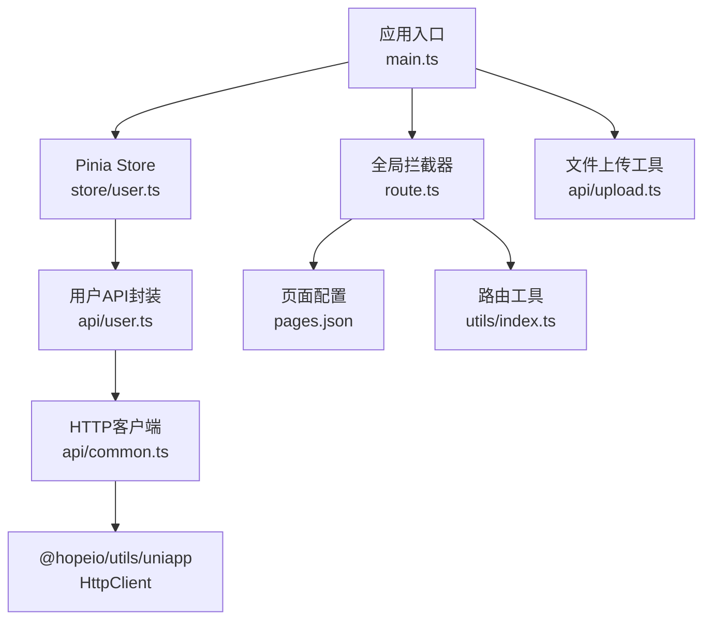
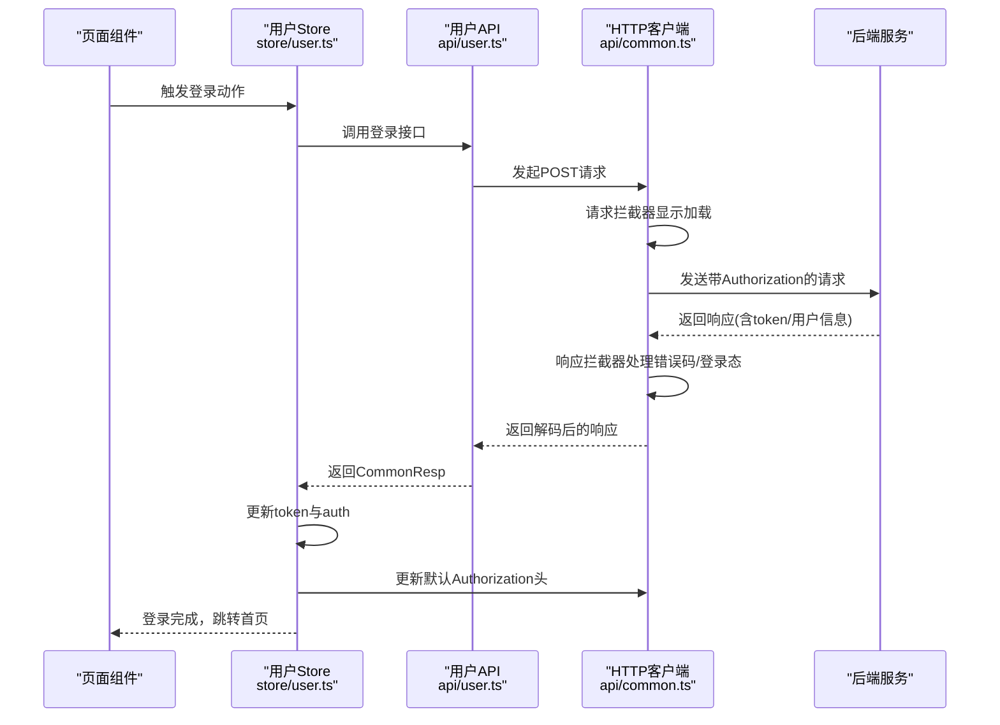
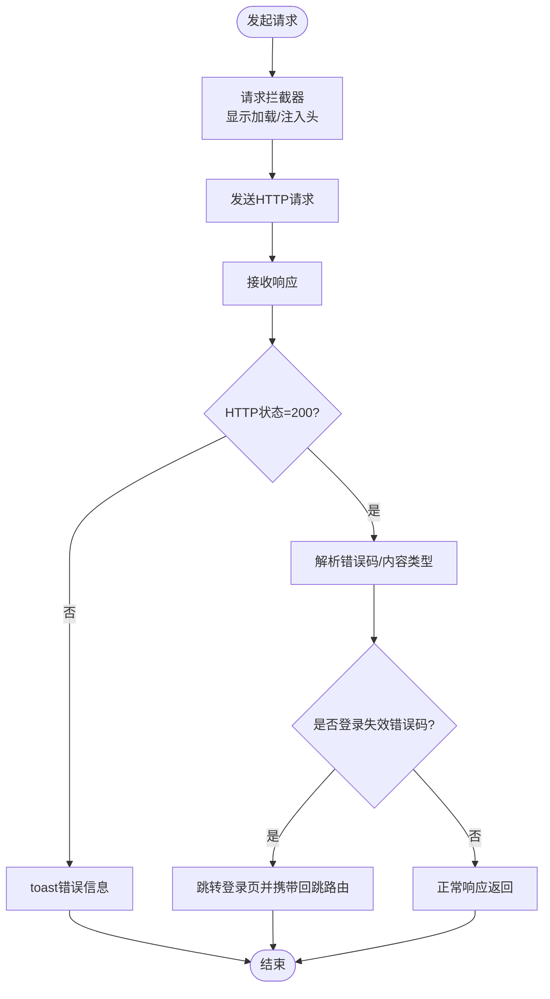
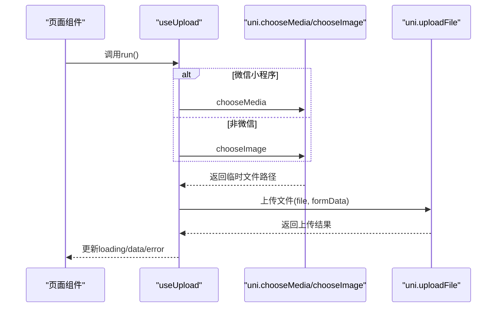
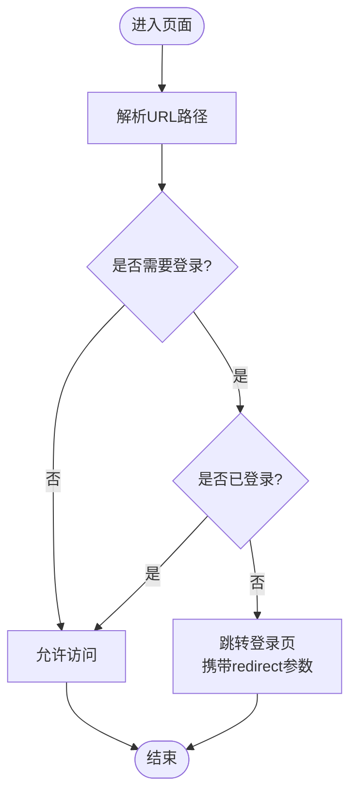
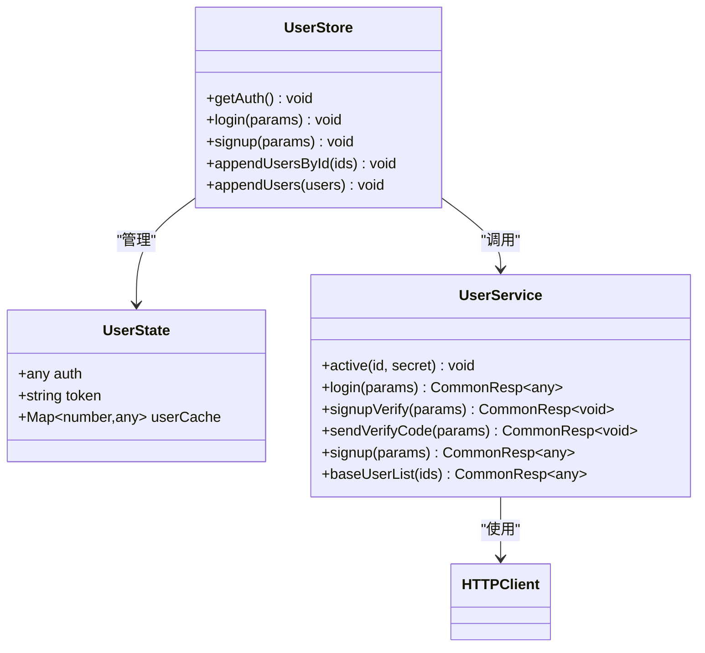
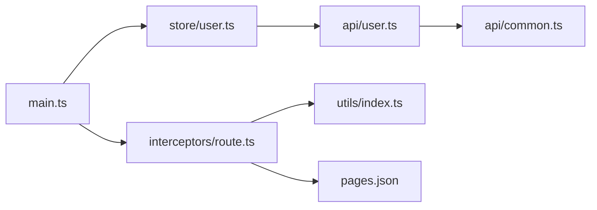

# API接口与数据交互

<cite>
**本文档引用的文件**
- [client/uniapp/src/main.ts](file://client/uniapp/src/main.ts)
- [client/uniapp/src/api/common.ts](file://client/uniapp/src/api/common.ts)
- [client/uniapp/src/api/upload.ts](file://client/uniapp/src/api/upload.ts)
- [client/uniapp/src/api/user.ts](file://client/uniapp/src/api/user.ts)
- [client/uniapp/src/interceptors/route.ts](file://client/uniapp/src/interceptors/route.ts)
- [client/uniapp/src/utils/index.ts](file://client/uniapp/src/utils/index.ts)
- [client/uniapp/src/store/user.ts](file://client/uniapp/src/store/user.ts)
- [client/uniapp/src/pages.json](file://client/uniapp/src/pages.json)
</cite>

## 目录
1. [简介](#简介)
2. [项目结构](#项目结构)
3. [核心组件](#核心组件)
4. [架构总览](#架构总览)
5. [详细组件分析](#详细组件分析)
6. [依赖关系分析](#依赖关系分析)
7. [性能考虑](#性能考虑)
8. [故障排查指南](#故障排查指南)
9. [结论](#结论)
10. [附录](#附录)

## 简介
本文件面向Hoper UniApp应用的API接口与数据交互，系统性梳理网络请求封装、拦截器体系、认证与路由拦截、用户态数据管理、文件上传流程以及错误处理与重试策略。文档同时给出接口Mock、联调测试与性能优化建议，并覆盖跨域、安全验证与缓存策略等工程实践。

## 项目结构
UniApp前端位于 client/uniapp，核心交互围绕以下模块展开：
- 应用入口与全局插件注册：main.ts
- HTTP客户端与通用请求封装：api/common.ts
- 文件上传工具：api/upload.ts
- 用户相关API：api/user.ts
- 路由与登录拦截：interceptors/route.ts
- 页面与路由工具：utils/index.ts、pages.json
- 用户状态管理：store/user.ts

图表来源
- [client/uniapp/src/main.ts:11-21](file://client/uniapp/src/main.ts#L11-L21)
- [client/uniapp/src/interceptors/route.ts:47-53](file://client/uniapp/src/interceptors/route.ts#L47-L53)
- [client/uniapp/src/store/user.ts:1-86](file://client/uniapp/src/store/user.ts#L1-L86)
- [client/uniapp/src/api/user.ts:1-30](file://client/uniapp/src/api/user.ts#L1-L30)
- [client/uniapp/src/api/common.ts:1-112](file://client/uniapp/src/api/common.ts#L1-L112)
- [client/uniapp/src/api/upload.ts:1-67](file://client/uniapp/src/api/upload.ts#L1-L67)
- [client/uniapp/src/pages.json:17-106](file://client/uniapp/src/pages.json#L17-L106)
- [client/uniapp/src/utils/index.ts:1-108](file://client/uniapp/src/utils/index.ts#L1-L108)

章节来源
- [client/uniapp/src/main.ts:1-22](file://client/uniapp/src/main.ts#L1-L22)
- [client/uniapp/src/pages.json:1-140](file://client/uniapp/src/pages.json#L1-L140)

## 核心组件
- HTTP客户端与默认配置
  - 基础URL、超时、响应类型、通用请求头（Authorization、Content-Type等）均在默认配置中集中定义，便于统一管理与环境切换。
  - 请求拦截器在发送前显示加载提示，简化页面逻辑。
  - 响应拦截器统一处理HTTP状态码、错误码、Protobuf错误体解码、登录态失效跳转等。
- 请求钩子 useRequest
  - 提供 loading/error/data/run 的统一状态管理，支持 immediate 控制是否在 onLoad 自动执行。
- 文件上传 useUpload
  - 封装图片选择与 uni.uploadFile 流程，自动处理平台差异（微信小程序与非微信）。
- 路由拦截与登录态控制
  - 通过 pages.json 中的 middlewares 或 needLogin 标记，结合拦截器实现“黑名单”登录拦截。
- 用户状态管理
  - 使用 Pinia 管理 token、auth 与用户缓存，登录成功后更新全局 Authorization 头并进行页面跳转。

章节来源
- [client/uniapp/src/api/common.ts:7-112](file://client/uniapp/src/api/common.ts#L7-L112)
- [client/uniapp/src/api/upload.ts:8-67](file://client/uniapp/src/api/upload.ts#L8-L67)
- [client/uniapp/src/interceptors/route.ts:21-53](file://client/uniapp/src/interceptors/route.ts#L21-L53)
- [client/uniapp/src/store/user.ts:9-86](file://client/uniapp/src/store/user.ts#L9-L86)

## 架构总览
下图展示从页面到API、再到拦截器与状态管理的整体交互：

图表来源
- [client/uniapp/src/store/user.ts:38-54](file://client/uniapp/src/store/user.ts#L38-L54)
- [client/uniapp/src/api/user.ts:11-13](file://client/uniapp/src/api/user.ts#L11-L13)
- [client/uniapp/src/api/common.ts:23-67](file://client/uniapp/src/api/common.ts#L23-L67)

## 详细组件分析

### HTTP客户端与请求拦截器
- 默认配置
  - 基于 import.meta.env.VITE_SERVER_BASEURL 动态配置基础地址，支持开发/生产环境切换。
  - 设置超时、响应类型为 arraybuffer，确保二进制与Protobuf场景兼容。
  - 统一设置 Content-Type、Accept、X-Requested-With，并从本地存储读取 token 注入 Authorization。
- 请求拦截器
  - 展示加载提示，支持自定义 loadingMsg。
  - 支持代理开关逻辑占位，便于联调阶段的特殊处理。
- 响应拦截器
  - 校验HTTP状态码，提取服务端错误码与内容类型。
  - 当响应头指示 Protobuf 错误体时，使用 ErrResp 解码错误消息。
  - 对特定错误码范围（如1003-1005）触发登录态失效处理，跳转登录页并携带回跳路由。
  - 其他错误码统一 toast 提示，便于用户感知。
- useRequest 钩子
  - 将 loading、error、data 与 run 函数暴露，支持 immediate 自动执行。
  - 在 onLoad 生命周期内按需触发请求，避免重复请求与状态不一致。

图表来源
- [client/uniapp/src/api/common.ts:23-67](file://client/uniapp/src/api/common.ts#L23-L67)

章节来源
- [client/uniapp/src/api/common.ts:7-112](file://client/uniapp/src/api/common.ts#L7-L112)

### 文件上传组件
- useUpload
  - 封装图片选择与上传流程，自动区分微信小程序与非微信平台。
  - 选择成功后调用 uploadFile，内部使用 uni.uploadFile 完成上传。
  - 成功回调将服务端返回的字符串数据赋值给 data，失败设置 error 并记录日志。
- 上传流程
  - 选择媒体/图片 -> 读取临时路径 -> uni.uploadFile -> 回调处理 -> 结束。

图表来源
- [client/uniapp/src/api/upload.ts:8-67](file://client/uniapp/src/api/upload.ts#L8-L67)

章节来源
- [client/uniapp/src/api/upload.ts:1-67](file://client/uniapp/src/api/upload.ts#L1-L67)

### 路由拦截与登录态控制
- 黑名单策略
  - 通过 pages.json 中的 middlewares 或 needLogin 字段标记需要登录的页面。
  - 拦截 navigateTo/reLaunch/redirectTo 等路由行为，未登录时跳转登录页并携带 redirect 参数。
- 开发/生产差异化
  - 开发环境下每次动态读取需要登录的页面列表，保证调试时的准确性；生产环境可复用预计算结果以提升性能。
- 登录态判定
  - 通过 Pinia 用户Store中的 auth 字段判断是否已登录。

图表来源
- [client/uniapp/src/interceptors/route.ts:21-53](file://client/uniapp/src/interceptors/route.ts#L21-L53)
- [client/uniapp/src/utils/index.ts:67-108](file://client/uniapp/src/utils/index.ts#L67-L108)
- [client/uniapp/src/pages.json:17-106](file://client/uniapp/src/pages.json#L17-L106)

章节来源
- [client/uniapp/src/interceptors/route.ts:1-54](file://client/uniapp/src/interceptors/route.ts#L1-L54)
- [client/uniapp/src/utils/index.ts:1-108](file://client/uniapp/src/utils/index.ts#L1-L108)
- [client/uniapp/src/pages.json:1-140](file://client/uniapp/src/pages.json#L1-L140)

### 用户状态管理与认证
- 状态模型
  - auth：当前用户信息或null
  - token：本地存储的令牌
  - userCache：基于Map的用户信息缓存
- 主要动作
  - getAuth：若存在token则调用 /api/auth 获取用户信息并写入状态
  - login：调用 UserService.login，成功后写入token、更新HTTP默认头、跳转首页
  - appendUsersById：批量拉取用户信息并填充缓存
- 与HTTP客户端的协作
  - 登录成功后更新 httpclient.defaults.headers.Authorization，确保后续请求自动带上token

图表来源
- [client/uniapp/src/store/user.ts:9-86](file://client/uniapp/src/store/user.ts#L9-L86)
- [client/uniapp/src/api/user.ts:7-30](file://client/uniapp/src/api/user.ts#L7-L30)
- [client/uniapp/src/api/common.ts:1-20](file://client/uniapp/src/api/common.ts#L1-L20)

章节来源
- [client/uniapp/src/store/user.ts:1-86](file://client/uniapp/src/store/user.ts#L1-L86)
- [client/uniapp/src/api/user.ts:1-30](file://client/uniapp/src/api/user.ts#L1-L30)

## 依赖关系分析
- 组件耦合
  - main.ts 作为应用入口，集中注册拦截器与全局插件，降低页面侧样板代码。
  - store/user.ts 依赖 api/user.ts 与 api/common.ts，形成“状态-接口-网络”的清晰分层。
  - interceptors/route.ts 依赖 utils/index.ts 与 store/user.ts，实现登录态与页面权限控制。
- 外部依赖
  - @hopeio/utils/uniapp 提供 HttpClient 与通用类型，统一网络层能力。
  - Pinia 提供状态管理，减少全局变量与副作用。
- 潜在风险
  - 登录拦截依赖 pages.json 的 middlewares/needLogin 标记，需确保配置一致性。
  - 响应拦截器对错误码与内容类型的判断依赖后端约定，变更时需同步调整。

图表来源
- [client/uniapp/src/main.ts:11-21](file://client/uniapp/src/main.ts#L11-L21)
- [client/uniapp/src/interceptors/route.ts:47-53](file://client/uniapp/src/interceptors/route.ts#L47-L53)
- [client/uniapp/src/store/user.ts:1-86](file://client/uniapp/src/store/user.ts#L1-L86)
- [client/uniapp/src/api/user.ts:1-30](file://client/uniapp/src/api/user.ts#L1-L30)
- [client/uniapp/src/api/common.ts:1-112](file://client/uniapp/src/api/common.ts#L1-L112)
- [client/uniapp/src/utils/index.ts:1-108](file://client/uniapp/src/utils/index.ts#L1-L108)
- [client/uniapp/src/pages.json:17-106](file://client/uniapp/src/pages.json#L17-L106)

章节来源
- [client/uniapp/src/main.ts:1-22](file://client/uniapp/src/main.ts#L1-L22)
- [client/uniapp/src/interceptors/route.ts:1-54](file://client/uniapp/src/interceptors/route.ts#L1-L54)
- [client/uniapp/src/store/user.ts:1-86](file://client/uniapp/src/store/user.ts#L1-L86)
- [client/uniapp/src/api/user.ts:1-30](file://client/uniapp/src/api/user.ts#L1-L30)
- [client/uniapp/src/api/common.ts:1-112](file://client/uniapp/src/api/common.ts#L1-L112)
- [client/uniapp/src/utils/index.ts:1-108](file://client/uniapp/src/utils/index.ts#L1-L108)
- [client/uniapp/src/pages.json:1-140](file://client/uniapp/src/pages.json#L1-L140)

## 性能考虑
- 请求去抖与并发控制
  - 对高频请求（如滚动加载）建议在页面侧增加节流/去抖，避免短时间内大量重复请求。
- 缓存策略
  - 用户信息缓存：store/user.ts 已内置 Map 缓存，建议在批量查询时合并请求，减少重复拉取。
  - 本地持久化：token 与用户信息使用本地存储，注意在退出登录时清理。
- 图片上传优化
  - 上传前可进行压缩与尺寸裁剪，减少带宽与服务器压力。
- 响应处理
  - 对大体积响应（如Protobuf）建议采用分块处理或延迟渲染，避免主线程阻塞。
- 网络层优化
  - 合理设置超时时间与重试次数，避免长时间无响应占用资源。
  - 对静态资源与公共接口启用CDN与缓存头，缩短首屏加载时间。

## 故障排查指南
- 登录态失效
  - 现象：收到特定错误码范围提示并被强制跳转登录页。
  - 排查：检查响应拦截器对错误码与内容类型的判断逻辑；确认后端返回头是否正确。
- 上传失败
  - 现象：选择图片后无响应或失败回调触发。
  - 排查：确认 uni.chooseMedia/chooseImage 选择流程是否成功；检查 uni.uploadFile 的回调与网络状态。
- 路由拦截异常
  - 现象：未登录页面被拦截或登录后仍被拦截。
  - 排查：核对 pages.json 中 middlewares/needLogin 配置；确认拦截器是否正确安装；检查开发/生产环境下的页面列表读取逻辑。
- Token未生效
  - 现象：登录成功但后续请求仍提示未登录。
  - 排查：确认 store/user.ts 是否在登录成功后更新了 httpclient.defaults.headers.Authorization；检查本地存储的 token 是否正确写入。

章节来源
- [client/uniapp/src/api/common.ts:35-67](file://client/uniapp/src/api/common.ts#L35-L67)
- [client/uniapp/src/api/upload.ts:49-67](file://client/uniapp/src/api/upload.ts#L49-L67)
- [client/uniapp/src/interceptors/route.ts:21-53](file://client/uniapp/src/interceptors/route.ts#L21-L53)
- [client/uniapp/src/store/user.ts:49-50](file://client/uniapp/src/store/user.ts#L49-L50)

## 结论
本项目在UniApp生态下构建了清晰的网络层与拦截器体系，通过统一的HTTP客户端、请求钩子与路由拦截，实现了认证、权限控制与数据交互的一致性体验。配合Pinia的状态管理与用户缓存，整体具备良好的可维护性与扩展性。建议在后续迭代中完善重试策略、接口Mock与联调测试流程，并持续优化上传与大响应的性能表现。

## 附录

### 接口Mock与联调测试
- 接口Mock
  - 建议在开发环境引入轻量Mock方案，对关键接口（如登录、用户信息）进行本地模拟，提升联调效率。
- 联调测试
  - 使用抓包工具观察请求头与响应体，重点核对 Authorization、Content-Type、错误码与Protobuf解码逻辑。
  - 对多端差异（H5/小程序）分别验证路由拦截与上传流程。

### 跨域、安全与缓存
- 跨域
  - 前端通过代理或后端CORS配置解决跨域问题；开发环境可通过代理开关进行隔离。
- 安全
  - 严格管理 token 存储与刷新；避免在URL中明文传递敏感参数。
- 缓存
  - 对只读数据与用户信息建立合理的缓存策略，减少不必要的网络请求。