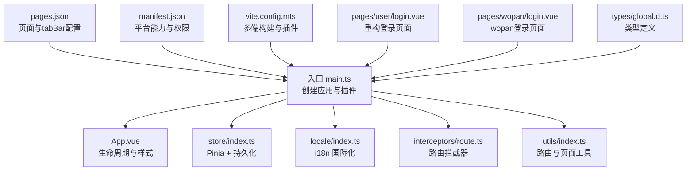
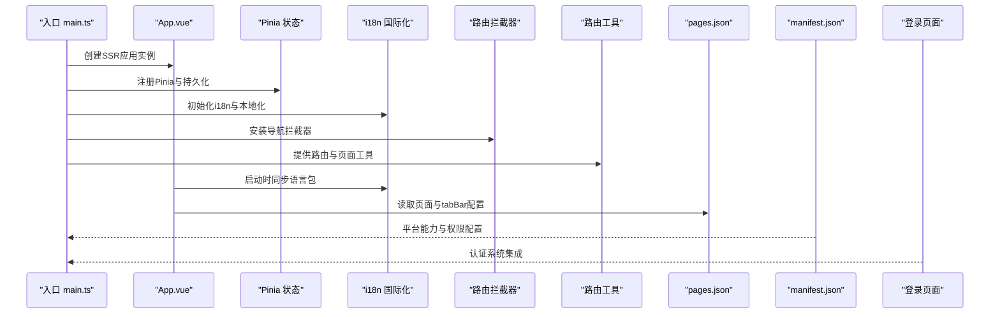
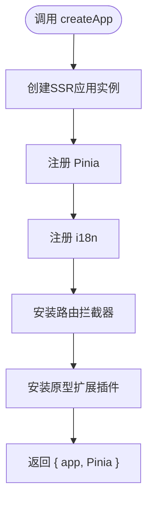
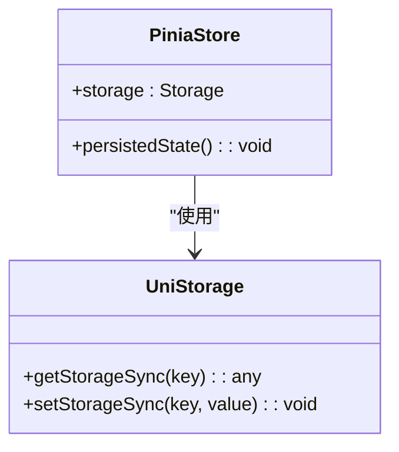
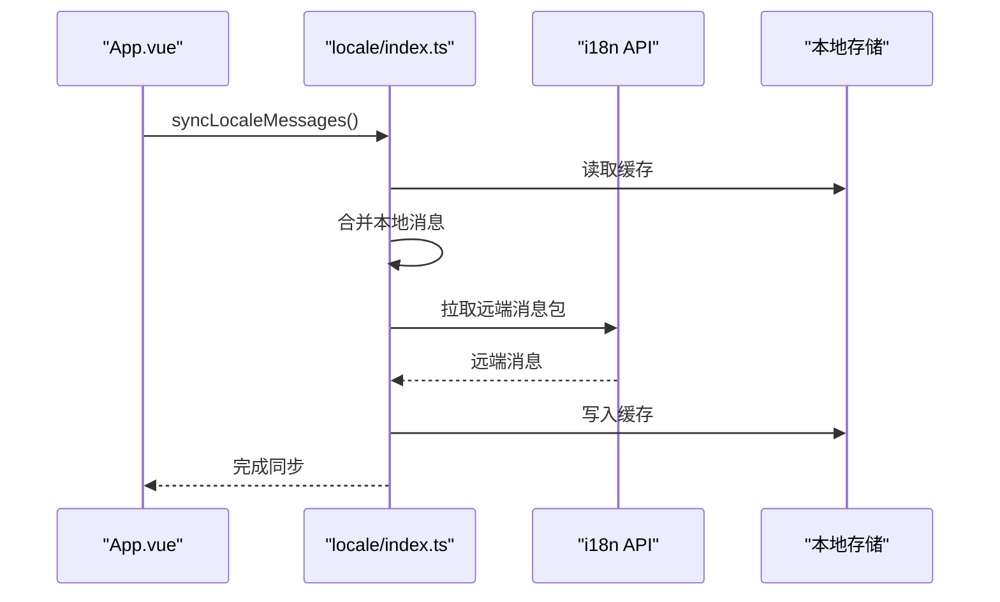
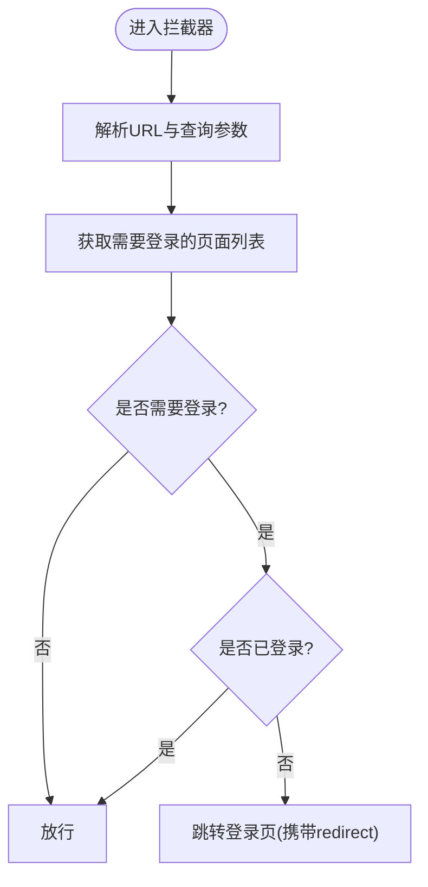
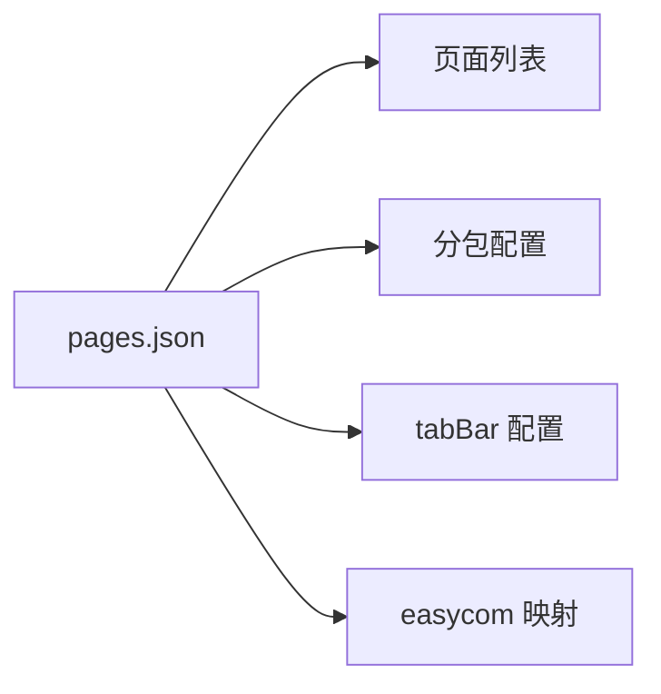
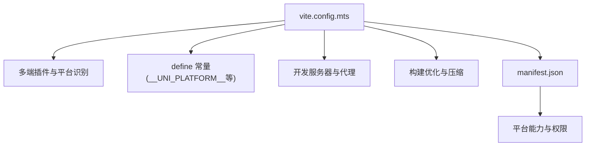
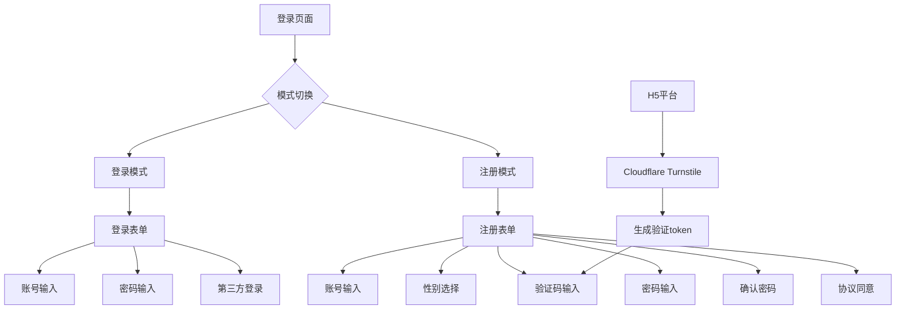
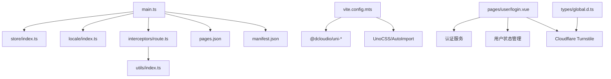

# UniApp 小程序

<cite>
**本文档引用的文件**
- [client/uniapp/src/main.ts](file://client/uniapp/src/main.ts)
- [client/uniapp/src/App.vue](file://client/uniapp/src/App.vue)
- [client/uniapp/src/manifest.json](file://client/uniapp/src/manifest.json)
- [client/uniapp/src/pages.json](file://client/uniapp/src/pages.json)
- [client/uniapp/vite.config.mts](file://client/uniapp/vite.config.mts)
- [client/uniapp/package.json](file://client/uniapp/package.json)
- [client/uniapp/src/store/index.ts](file://client/uniapp/src/store/index.ts)
- [client/uniapp/src/locale/index.ts](file://client/uniapp/src/locale/index.ts)
- [client/uniapp/src/interceptors/route.ts](file://client/uniapp/src/interceptors/route.ts)
- [client/uniapp/src/utils/index.ts](file://client/uniapp/src/utils/index.ts)
- [client/uniapp/src/pages/user/login.vue](file://client/uniapp/src/pages/user/login.vue)
- [client/uniapp/src/pages/wopan/login.vue](file://client/uniapp/src/pages/wopan/login.vue)
- [client/uniapp/src/types/global.d.ts](file://client/uniapp/src/types/global.d.ts)
</cite>

## 目录
1. [简介](#简介)
2. [项目结构](#项目结构)
3. [核心组件](#核心组件)
4. [架构总览](#架构总览)
5. [详细组件分析](#详细组件分析)
6. [认证系统重大改进](#认证系统重大改进)
7. [依赖关系分析](#依赖关系分析)
8. [性能考虑](#性能考虑)
9. [故障排查指南](#故障排查指南)
10. [结论](#结论)
11. [附录](#附录)

## 简介
本项目为 Hoper 的 UniApp 小程序前端，采用 Vue 3 + TypeScript + Pinia + UnoCSS + Vite 的现代化多端编译体系，支持 H5、微信小程序、App 等多平台。项目通过条件编译、平台差异化配置、路由拦截与状态持久化等手段，实现跨平台一致体验与高性能交付。

**更新** 本次更新重点关注认证系统的重大改进，包括登录页面重构、注册流程增强、人类验证集成 Cloudflare Turnstile、国际化支持扩展等关键变化。

## 项目结构
- 应用入口与框架装配：应用通过入口文件创建 SSR 应用实例，注册 Pinia、i18n、路由拦截器与原型扩展插件。
- 页面与分包：页面清单集中于 pages.json，支持 easycom 组件自动扫描与第三方组件映射；分包配置可按需拆分。
- 平台配置：manifest.json 提供各平台能力开关、权限与分发配置；vite.config.mts 集成多端构建插件与平台识别。
- 状态与国际化：Pinia 实现全局状态管理与持久化；i18n 支持本地与远端消息包同步及格式化工具。
- 路由与拦截：基于 uni.addInterceptor 对导航类 API 进行统一拦截，实现登录态校验与重定向。
- **新增** 认证系统：重构登录页面，集成 Cloudflare Turnstile 人类验证，增强注册流程和国际化支持。

**图表来源**
- [client/uniapp/src/main.ts:1-22](file://client/uniapp/src/main.ts#L1-L22)
- [client/uniapp/src/App.vue:1-62](file://client/uniapp/src/App.vue#L1-L62)
- [client/uniapp/src/store/index.ts:1-13](file://client/uniapp/src/store/index.ts#L1-L13)
- [client/uniapp/src/locale/index.ts:1-116](file://client/uniapp/src/locale/index.ts#L1-L116)
- [client/uniapp/src/interceptors/route.ts:1-54](file://client/uniapp/src/interceptors/route.ts#L1-L54)
- [client/uniapp/src/utils/index.ts:1-108](file://client/uniapp/src/utils/index.ts#L1-L108)
- [client/uniapp/src/pages.json:1-140](file://client/uniapp/src/pages.json#L1-L140)
- [client/uniapp/src/manifest.json:1-89](file://client/uniapp/src/manifest.json#L1-L89)
- [client/uniapp/vite.config.mts:1-156](file://client/uniapp/vite.config.mts#L1-L156)
- [client/uniapp/src/pages/user/login.vue:1-365](file://client/uniapp/src/pages/user/login.vue#L1-L365)
- [client/uniapp/src/pages/wopan/login.vue:1-112](file://client/uniapp/src/pages/wopan/login.vue#L1-L112)
- [client/uniapp/src/types/global.d.ts:1-26](file://client/uniapp/src/types/global.d.ts#L1-L26)

**章节来源**
- [client/uniapp/src/main.ts:1-22](file://client/uniapp/src/main.ts#L1-L22)
- [client/uniapp/src/App.vue:1-62](file://client/uniapp/src/App.vue#L1-L62)
- [client/uniapp/src/pages.json:1-140](file://client/uniapp/src/pages.json#L1-L140)
- [client/uniapp/src/manifest.json:1-89](file://client/uniapp/src/manifest.json#L1-L89)
- [client/uniapp/vite.config.mts:1-156](file://client/uniapp/vite.config.mts#L1-L156)

## 核心组件
- 应用入口与插件装配
  - 创建 SSR 应用实例，注册 Pinia、i18n、路由拦截器与原型扩展插件，并返回 app 与 Pinia 实例，确保多端一致初始化。
- 状态管理与持久化
  - 使用 Pinia 并启用持久化插件，存储实现基于 uni.getStorageSync/ setStorageSync，保障多端兼容。
- 国际化与本地化
  - 基于 vue-i18n，支持本地默认消息与远端动态拉取，缓存至本地存储，提供格式化工具函数。
- 路由拦截与登录态校验
  - 通过 uni.addInterceptor 对 navigateTo/reLaunch/redirectTo 等进行拦截，结合 needLogin 标记与用户登录态决定放行或重定向。
- 页面与分包配置
  - pages.json 统一声明页面、tabBar、easycom 映射与分包，支持多端差异化配置。
- 平台配置与构建
  - manifest.json 定义 App、H5、小程序等平台能力与权限；vite.config.mts 集成多端插件、平台识别、代理与打包优化。
- **新增** 认证系统
  - 重构登录页面，支持登录/注册双模式切换，集成 Cloudflare Turnstile 人类验证，增强表单验证和用户体验。

**章节来源**
- [client/uniapp/src/main.ts:11-21](file://client/uniapp/src/main.ts#L11-L21)
- [client/uniapp/src/store/index.ts:1-13](file://client/uniapp/src/store/index.ts#L1-L13)
- [client/uniapp/src/locale/index.ts:1-116](file://client/uniapp/src/locale/index.ts#L1-L116)
- [client/uniapp/src/interceptors/route.ts:1-54](file://client/uniapp/src/interceptors/route.ts#L1-L54)
- [client/uniapp/src/pages.json:1-140](file://client/uniapp/src/pages.json#L1-L140)
- [client/uniapp/src/manifest.json:1-89](file://client/uniapp/src/manifest.json#L1-L89)
- [client/uniapp/vite.config.mts:26-156](file://client/uniapp/vite.config.mts#L26-L156)

## 架构总览
下图展示从入口到多端渲染的关键流程：应用初始化、插件注册、页面路由、拦截与状态管理协同工作。

**图表来源**
- [client/uniapp/src/main.ts:11-21](file://client/uniapp/src/main.ts#L11-L21)
- [client/uniapp/src/App.vue:5-16](file://client/uniapp/src/App.vue#L5-L16)
- [client/uniapp/src/store/index.ts:1-13](file://client/uniapp/src/store/index.ts#L1-L13)
- [client/uniapp/src/locale/index.ts:45-57](file://client/uniapp/src/locale/index.ts#L45-L57)
- [client/uniapp/src/interceptors/route.ts:47-53](file://client/uniapp/src/interceptors/route.ts#L47-L53)
- [client/uniapp/src/utils/index.ts:1-108](file://client/uniapp/src/utils/index.ts#L1-L108)
- [client/uniapp/src/pages.json:1-140](file://client/uniapp/src/pages.json#L1-L140)
- [client/uniapp/src/manifest.json:1-89](file://client/uniapp/src/manifest.json#L1-L89)

## 详细组件分析

### 应用入口与插件装配
- 入口职责
  - 创建 SSR 应用实例，挂载全局插件：Pinia、i18n、路由拦截器、原型扩展插件。
  - 返回 app 与 Pinia，确保多端初始化一致性。
- 设计要点
  - 将 Pinia 作为返回值之一，便于多端统一使用。
  - 引入 UnoCSS 与全局样式，保证样式一致性。

**图表来源**
- [client/uniapp/src/main.ts:11-21](file://client/uniapp/src/main.ts#L11-L21)

**章节来源**
- [client/uniapp/src/main.ts:11-21](file://client/uniapp/src/main.ts#L11-L21)

### 状态管理与持久化（Pinia）
- 状态持久化
  - 使用 pinia-plugin-persistedstate，存储实现基于 uni.getStorageSync/ setStorageSync，覆盖多端。
- 生命周期
  - 在应用启动时完成状态初始化，避免重复注册。

**图表来源**
- [client/uniapp/src/store/index.ts:1-13](file://client/uniapp/src/store/index.ts#L1-L13)

**章节来源**
- [client/uniapp/src/store/index.ts:1-13](file://client/uniapp/src/store/index.ts#L1-L13)

### 国际化与本地化（i18n）
- 初始化策略
  - 以设备语言为基准，规范化语言代码；设置回退语言为简体中文。
- 动态同步
  - 启动时先合并本地缓存，再异步拉取远端语言包并缓存。
- 工具函数
  - 提供 translate 与格式化函数，支持字符串与对象模板占位符替换。

**图表来源**
- [client/uniapp/src/App.vue:5-9](file://client/uniapp/src/App.vue#L5-L9)
- [client/uniapp/src/locale/index.ts:45-57](file://client/uniapp/src/locale/index.ts#L45-L57)

**章节来源**
- [client/uniapp/src/locale/index.ts:1-116](file://client/uniapp/src/locale/index.ts#L1-L116)
- [client/uniapp/src/App.vue:5-9](file://client/uniapp/src/App.vue#L5-L9)

### 路由拦截与登录态校验
- 拦截范围
  - 对 navigateTo、reLaunch、redirectTo 进行统一拦截。
- 登录判定
  - 通过用户状态判断是否需要登录；若未登录，携带 redirect 参数跳转登录页。
- 白/黑名单策略
  - 通过 pages.json 中的 needLogin 字段标记受保护页面，拦截器根据该标记执行放行或重定向。

**图表来源**
- [client/uniapp/src/interceptors/route.ts:20-45](file://client/uniapp/src/interceptors/route.ts#L20-L45)
- [client/uniapp/src/utils/index.ts:67-108](file://client/uniapp/src/utils/index.ts#L67-L108)

**章节来源**
- [client/uniapp/src/interceptors/route.ts:1-54](file://client/uniapp/src/interceptors/route.ts#L1-L54)
- [client/uniapp/src/utils/index.ts:1-108](file://client/uniapp/src/utils/index.ts#L1-L108)

### 页面与分包配置（pages.json）
- 页面声明
  - 统一在 pages.json 中声明页面与样式，支持 navigationStyle、标题文本等。
- easycom
  - 自动扫描与第三方组件映射，减少手工引入成本。
- 分包
  - 支持主包与分包页面，拦截器可同时处理主包与分包的 needLogin 页面。

**图表来源**
- [client/uniapp/src/pages.json:1-140](file://client/uniapp/src/pages.json#L1-L140)

**章节来源**
- [client/uniapp/src/pages.json:1-140](file://client/uniapp/src/pages.json#L1-L140)

### 平台配置与构建（manifest.json 与 vite.config.mts）
- 平台能力
  - manifest.json 配置 App、H5、小程序等平台的权限、分发与编译选项。
- 多端构建
  - vite.config.mts 集成多端插件、平台识别、代理与打包优化；通过 define 暴露平台常量，便于条件编译与差异化逻辑。
- 环境变量
  - 通过 loadEnv 加载不同模式下的环境变量，支持代理与日志输出控制。

**图表来源**
- [client/uniapp/vite.config.mts:26-156](file://client/uniapp/vite.config.mts#L26-L156)
- [client/uniapp/src/manifest.json:1-89](file://client/uniapp/src/manifest.json#L1-L89)

**章节来源**
- [client/uniapp/src/manifest.json:1-89](file://client/uniapp/src/manifest.json#L1-L89)
- [client/uniapp/vite.config.mts:26-156](file://client/uniapp/vite.config.mts#L26-L156)

## 认证系统重大改进

### 登录页面重构
**更新** 登录页面进行了全面重构，提供更优质的用户体验和更强的安全保障。

- **双模式切换**
  - 支持登录和注册两种模式的无缝切换，通过 Tab 切换实现
  - 登录模式包含账号密码登录和第三方登录选项
  - 注册模式支持邮箱或手机号注册，包含性别选择和协议同意

- **Cloudflare Turnstile 集成**
  - H5 平台集成 Cloudflare Turnstile 人类验证
  - 通过 `#ifdef H5` 条件编译实现平台差异化
  - Turnstile 验证成功后生成 token，用于注册验证码发送

- **增强的表单验证**
  - 登录表单：账号和密码必填验证
  - 注册表单：邮箱/手机格式验证、密码长度验证、协议同意验证
  - 实时反馈和视觉提示，提升用户体验

- **安全特性**
  - 密码输入支持显示/隐藏切换
  - 验证码发送倒计时功能
  - 第三方登录预留接口

**图表来源**
- [client/uniapp/src/pages/user/login.vue:160-365](file://client/uniapp/src/pages/user/login.vue#L160-L365)
- [client/uniapp/src/types/global.d.ts:18-25](file://client/uniapp/src/types/global.d.ts#L18-L25)

**章节来源**
- [client/uniapp/src/pages/user/login.vue:1-365](file://client/uniapp/src/pages/user/login.vue#L1-L365)
- [client/uniapp/src/types/global.d.ts:1-26](file://client/uniapp/src/types/global.d.ts#L1-L26)

### 注册流程增强
**更新** 注册流程得到显著增强，提供更灵活的用户注册体验。

- **智能账号识别**
  - 自动识别邮箱格式和手机号格式
  - 支持邮箱前缀作为默认用户名
  - 手机号注册时自动生成用户名

- **验证码机制**
  - H5 平台使用 Cloudflare Turnstile token
  - 其他平台支持环境变量配置的验证码
  - 验证码发送倒计时功能

- **用户信息收集**
  - 必填性别信息（男性/女性）
  - 密码强度验证（至少6位）
  - 协议同意机制

- **用户体验优化**
  - 实时表单验证和错误提示
  - 成功注册后的界面切换
  - 清晰的注册状态反馈

**章节来源**
- [client/uniapp/src/pages/user/login.vue:232-305](file://client/uniapp/src/pages/user/login.vue#L232-L305)

### 国际化支持扩展
**更新** 国际化支持得到扩展，更好地服务于多语言用户群体。

- **认证相关文案国际化**
  - 登录、注册、忘记密码等核心功能文案
  - 错误提示信息的多语言支持
  - 协议条款的国际化显示

- **动态语言切换**
  - 基于 vue-i18n 的实时语言切换
  - 设备语言检测和回退机制
  - 本地缓存与远端同步的语言包

**章节来源**
- [client/uniapp/src/pages/user/login.vue:160-174](file://client/uniapp/src/pages/user/login.vue#L160-L174)
- [client/uniapp/src/locale/index.ts:1-116](file://client/uniapp/src/locale/index.ts#L1-L116)

### 类型定义更新
**更新** 新增了 Cloudflare Turnstile 相关的类型定义，确保类型安全。

- **Window 接口扩展**
  - 添加 `turnstile` 属性定义
  - 支持 Turnstile SDK 的类型检查
  - 与其他窗口对象属性保持一致

**章节来源**
- [client/uniapp/src/types/global.d.ts:18-25](file://client/uniapp/src/types/global.d.ts#L18-L25)

## 依赖关系分析
- 组件耦合
  - 入口文件对各插件存在直接依赖；拦截器依赖用户状态与页面配置；国际化依赖 API 与本地存储。
  - **新增** 登录页面依赖认证服务和用户状态管理。
- 外部依赖
  - @dcloudio/uni-app 系列包提供多端运行时；UnoCSS、AutoImport、Visualizer 等辅助开发与优化。
  - **新增** Cloudflare Turnstile SDK（仅 H5 平台）。
- 条件编译与平台差异
  - 通过 __UNI_PLATFORM__ 与各平台包实现差异化行为；pages.json 与 manifest.json 提供页面与平台级配置。
  - **新增** 通过 `#ifdef H5` 实现平台特定功能的条件编译。

**图表来源**
- [client/uniapp/src/main.ts:1-22](file://client/uniapp/src/main.ts#L1-L22)
- [client/uniapp/src/store/index.ts:1-13](file://client/uniapp/src/store/index.ts#L1-L13)
- [client/uniapp/src/locale/index.ts:1-116](file://client/uniapp/src/locale/index.ts#L1-L116)
- [client/uniapp/src/interceptors/route.ts:1-54](file://client/uniapp/src/interceptors/route.ts#L1-L54)
- [client/uniapp/src/utils/index.ts:1-108](file://client/uniapp/src/utils/index.ts#L1-L108)
- [client/uniapp/src/pages.json:1-140](file://client/uniapp/src/pages.json#L1-L140)
- [client/uniapp/src/manifest.json:1-89](file://client/uniapp/src/manifest.json#L1-L89)
- [client/uniapp/vite.config.mts:1-156](file://client/uniapp/vite.config.mts#L1-L156)
- [client/uniapp/src/pages/user/login.vue:160-365](file://client/uniapp/src/pages/user/login.vue#L160-L365)
- [client/uniapp/src/types/global.d.ts:1-26](file://client/uniapp/src/types/global.d.ts#L1-L26)

**章节来源**
- [client/uniapp/package.json:77-104](file://client/uniapp/package.json#L77-L104)
- [client/uniapp/vite.config.mts:56-100](file://client/uniapp/vite.config.mts#L56-L100)

## 性能考虑
- 构建优化
  - 生产环境启用 Terser 压缩与删除 console；H5 平台可生成可视化统计报告，便于定位体积瓶颈。
  - **新增** 条件编译减少不必要代码的打包。
- 运行时优化
  - Pinia 持久化减少重复加载；国际化消息包缓存降低网络请求；easycom 自动扫描减少组件引入开销。
  - **新增** 登录页面的懒加载和按需渲染优化。
- 调试与可观测
  - 开发服务器支持热更新与代理；可按需开启 SourceMap 与日志输出。
  - **新增** Cloudflare Turnstile 的调试支持。

**章节来源**
- [client/uniapp/vite.config.mts:142-153](file://client/uniapp/vite.config.mts#L142-L153)
- [client/uniapp/src/store/index.ts:5-12](file://client/uniapp/src/store/index.ts#L5-L12)
- [client/uniapp/src/locale/index.ts:32-57](file://client/uniapp/src/locale/index.ts#L32-L57)

## 故障排查指南
- 国际化同步失败
  - 检查网络请求与远端接口可用性；确认本地缓存键与消息结构；查看错误日志。
- 路由拦截异常
  - 确认 needLogin 标记是否正确；检查用户登录态；验证 redirect 参数编码。
- 多端差异问题
  - 根据 __UNI_PLATFORM__ 判断平台，核对 manifest.json 权限与页面配置；必要时在页面级使用条件编译后缀。
- 构建与代理
  - 检查环境变量与代理前缀配置；确认开发服务器端口与跨域设置。
- **新增** 认证系统问题
  - 登录页面功能异常：检查条件编译配置和平台支持情况
  - Cloudflare Turnstile 验证失败：确认站点密钥配置和网络连接
  - 注册验证码发送失败：验证环境变量配置和验证码服务可用性
  - 表单验证错误：检查输入格式和验证规则

**章节来源**
- [client/uniapp/src/locale/index.ts:54-57](file://client/uniapp/src/locale/index.ts#L54-L57)
- [client/uniapp/src/interceptors/route.ts:33-43](file://client/uniapp/src/interceptors/route.ts#L33-L43)
- [client/uniapp/vite.config.mts:127-141](file://client/uniapp/vite.config.mts#L127-L141)
- [client/uniapp/src/pages/user/login.vue:232-260](file://client/uniapp/src/pages/user/login.vue#L232-L260)

## 结论
本项目通过清晰的入口装配、完善的拦截与状态管理、以及多端构建与平台配置，实现了跨平台的一致体验与良好性能。**本次更新重点加强了认证系统的安全性与用户体验**，包括登录页面重构、注册流程增强、Cloudflare Turnstile 集成和国际化支持扩展。建议在后续迭代中持续关注页面与分包的拆分策略、国际化消息包的增量更新与缓存策略，以及多端差异的最小化与条件编译的合理使用。

## 附录
- 脚本与命令
  - 开发与构建脚本覆盖 H5、App、微信小程序等多端；可通过平台参数切换目标端。
- 版本与依赖
  - 依赖版本集中在 package.json，建议定期升级以获得稳定性与新特性。
- **新增** 认证系统配置
  - Cloudflare Turnstile 站点密钥配置
  - 环境变量 VITE_SIGNUP_VERIFY_CODE 设置
  - 多语言文案扩展

**章节来源**
- [client/uniapp/package.json:18-61](file://client/uniapp/package.json#L18-L61)
- [client/uniapp/src/pages/user/login.vue:183-241](file://client/uniapp/src/pages/user/login.vue#L183-L241)