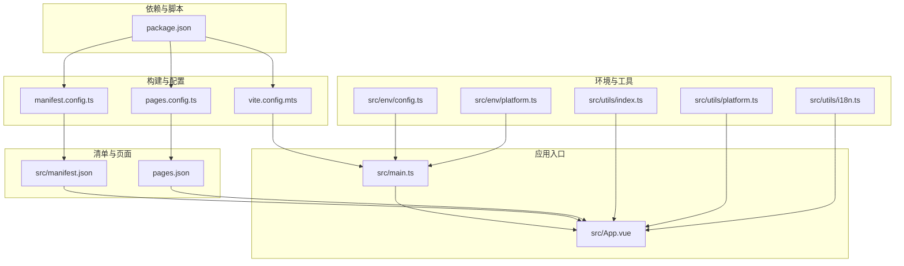
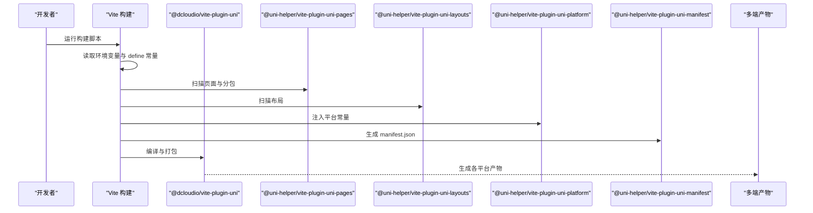
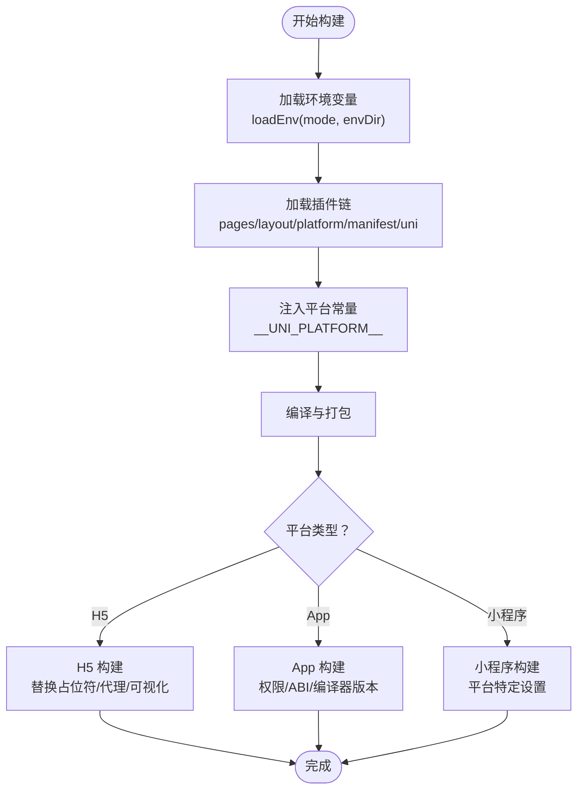
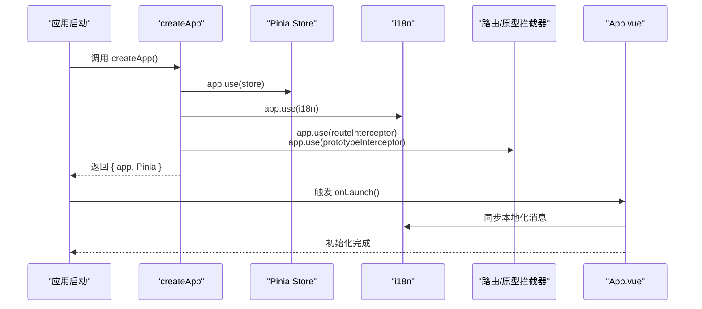
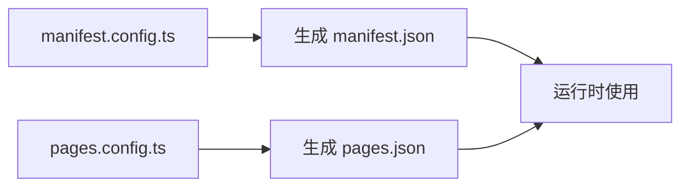
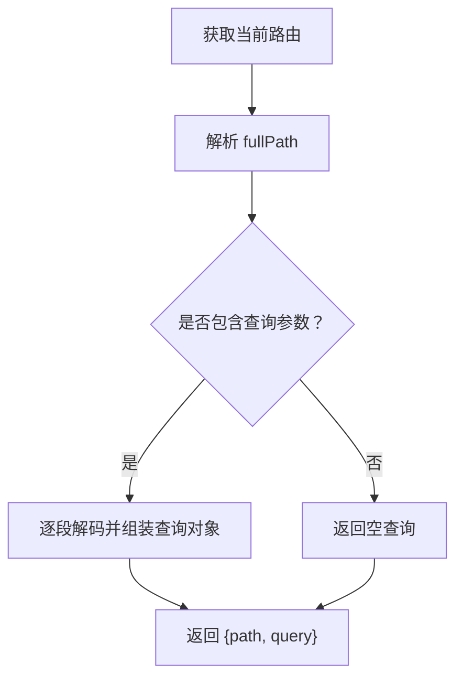
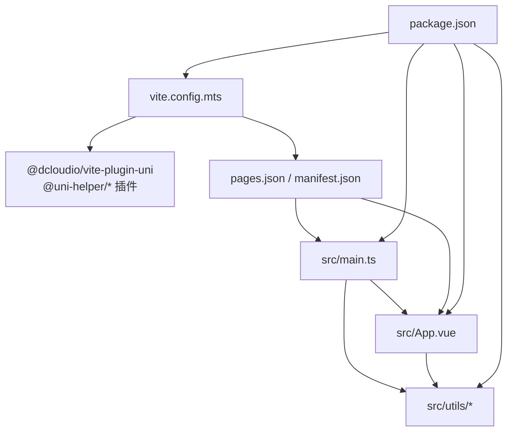

# 多平台编译与适配

<cite>
**本文引用的文件**
- [client/uniapp/src/manifest.json](file://client/uniapp/src/manifest.json)
- [client/uniapp/manifest.config.ts](file://client/uniapp/manifest.config.ts)
- [client/uniapp/pages.config.ts](file://client/uniapp/pages.config.ts)
- [client/uniapp/vite.config.mts](file://client/uniapp/vite.config.mts)
- [client/uniapp/src/main.ts](file://client/uniapp/src/main.ts)
- [client/uniapp/src/App.vue](file://client/uniapp/src/App.vue)
- [client/uniapp/src/env/config.ts](file://client/uniapp/src/env/config.ts)
- [client/uniapp/src/env/platform.ts](file://client/uniapp/src/env/platform.ts)
- [client/uniapp/src/utils/index.ts](file://client/uniapp/src/utils/index.ts)
- [client/uniapp/src/utils/platform.ts](file://client/uniapp/src/utils/platform.ts)
- [client/uniapp/src/utils/i18n.ts](file://client/uniapp/src/utils/i18n.ts)
- [client/uniapp/package.json](file://client/uniapp/package.json)
</cite>

## 目录
1. [引言](#引言)
2. [项目结构](#项目结构)
3. [核心组件](#核心组件)
4. [架构总览](#架构总览)
5. [详细组件分析](#详细组件分析)
6. [依赖关系分析](#依赖关系分析)
7. [性能考量](#性能考量)
8. [故障排查指南](#故障排查指南)
9. [结论](#结论)
10. [附录](#附录)

## 引言
本技术文档围绕 Hoper 的 UniApp 多平台编译与适配展开，系统阐述多端编译原理、平台差异识别与条件编译机制，详解 manifest.json 与 manifest.config.ts 的配置项、平台特定设置与应用元数据；并结合运行时环境判断、API 适配策略，覆盖微信小程序、H5、App 等平台的差异化处理、原生能力集成与性能优化。最后提供兼容性测试、调试技巧与发布注意事项，帮助团队高效完成多端交付。

## 项目结构
Hoper 的前端采用 UniApp 3 技术栈，核心位于 client/uniapp 目录，包含源码、构建配置、页面与应用清单、环境与工具模块等。关键文件如下：
- 构建与平台配置：vite.config.mts、manifest.config.ts、pages.config.ts
- 应用入口与生命周期：src/main.ts、src/App.vue
- 清单与页面：src/manifest.json、pages.json（由 pages.config.ts 生成）
- 环境与平台枚举：src/env/config.ts、src/env/platform.ts
- 工具与适配：src/utils/index.ts、src/utils/platform.ts、src/utils/i18n.ts
- 依赖与脚本：package.json

图表来源
- [client/uniapp/vite.config.mts:26-155](file://client/uniapp/vite.config.mts#L26-L155)
- [client/uniapp/manifest.config.ts:17-107](file://client/uniapp/manifest.config.ts#L17-L107)
- [client/uniapp/pages.config.ts:3-50](file://client/uniapp/pages.config.ts#L3-L50)
- [client/uniapp/src/main.ts:11-21](file://client/uniapp/src/main.ts#L11-L21)
- [client/uniapp/src/App.vue:1-17](file://client/uniapp/src/App.vue#L1-L17)
- [client/uniapp/src/manifest.json:1-89](file://client/uniapp/src/manifest.json#L1-L89)
- [client/uniapp/src/env/config.ts:1-7](file://client/uniapp/src/env/config.ts#L1-L7)
- [client/uniapp/src/env/platform.ts:1-11](file://client/uniapp/src/env/platform.ts#L1-L11)
- [client/uniapp/src/utils/index.ts:1-108](file://client/uniapp/src/utils/index.ts#L1-L108)
- [client/uniapp/src/utils/platform.ts](file://client/uniapp/src/utils/platform.ts)
- [client/uniapp/src/utils/i18n.ts](file://client/uniapp/src/utils/i18n.ts)
- [client/uniapp/package.json:18-57](file://client/uniapp/package.json#L18-L57)

章节来源
- [client/uniapp/vite.config.mts:26-155](file://client/uniapp/vite.config.mts#L26-L155)
- [client/uniapp/manifest.config.ts:17-107](file://client/uniapp/manifest.config.ts#L17-L107)
- [client/uniapp/pages.config.ts:3-50](file://client/uniapp/pages.config.ts#L3-L50)
- [client/uniapp/src/main.ts:11-21](file://client/uniapp/src/main.ts#L11-L21)
- [client/uniapp/src/App.vue:1-17](file://client/uniapp/src/App.vue#L1-L17)
- [client/uniapp/src/manifest.json:1-89](file://client/uniapp/src/manifest.json#L1-L89)
- [client/uniapp/src/env/config.ts:1-7](file://client/uniapp/src/env/config.ts#L1-L7)
- [client/uniapp/src/env/platform.ts:1-11](file://client/uniapp/src/env/platform.ts#L1-L11)
- [client/uniapp/src/utils/index.ts:1-108](file://client/uniapp/src/utils/index.ts#L1-L108)
- [client/uniapp/src/utils/platform.ts](file://client/uniapp/src/utils/platform.ts)
- [client/uniapp/src/utils/i18n.ts](file://client/uniapp/src/utils/i18n.ts)
- [client/uniapp/package.json:18-57](file://client/uniapp/package.json#L18-L57)

## 核心组件
- 构建与平台插件体系：基于 Vite，通过 @dcloudio/vite-plugin-uni 与 @uni-helper 系列插件实现多端编译、页面与布局扫描、平台注入、清单生成等。
- 应用入口与生命周期：统一的 createApp 工厂函数与 App.vue 生命周期钩子，负责国际化同步与全局初始化。
- 清单与页面配置：manifest.config.ts 定义应用元数据与各平台特定设置；pages.config.ts 定义导航样式、easycom 组件映射与 tabbar。
- 环境与平台枚举：提供运行时平台常量与环境变量访问封装。
- 工具与适配：路由与页面判断、URL 解析、国际化同步等工具方法。

章节来源
- [client/uniapp/vite.config.mts:56-100](file://client/uniapp/vite.config.mts#L56-L100)
- [client/uniapp/src/main.ts:11-21](file://client/uniapp/src/main.ts#L11-L21)
- [client/uniapp/src/App.vue:5-16](file://client/uniapp/src/App.vue#L5-L16)
- [client/uniapp/manifest.config.ts:17-107](file://client/uniapp/manifest.config.ts#L17-L107)
- [client/uniapp/pages.config.ts:3-50](file://client/uniapp/pages.config.ts#L3-L50)
- [client/uniapp/src/env/platform.ts:1-11](file://client/uniapp/src/env/platform.ts#L1-L11)
- [client/uniapp/src/env/config.ts:1-7](file://client/uniapp/src/env/config.ts#L1-L7)
- [client/uniapp/src/utils/index.ts:1-108](file://client/uniapp/src/utils/index.ts#L1-L108)

## 架构总览
下图展示从构建到运行的关键流程：Vite 加载环境变量与插件，生成 pages.json 与 manifest.json，注入平台常量，最终输出多端产物。

图表来源
- [client/uniapp/vite.config.mts:26-105](file://client/uniapp/vite.config.mts#L26-L105)
- [client/uniapp/manifest.config.ts:17-107](file://client/uniapp/manifest.config.ts#L17-L107)
- [client/uniapp/pages.config.ts:3-50](file://client/uniapp/pages.config.ts#L3-L50)

章节来源
- [client/uniapp/vite.config.mts:26-105](file://client/uniapp/vite.config.mts#L26-L105)
- [client/uniapp/manifest.config.ts:17-107](file://client/uniapp/manifest.config.ts#L17-L107)
- [client/uniapp/pages.config.ts:3-50](file://client/uniapp/pages.config.ts#L3-L50)

## 详细组件分析

### 构建与平台插件体系
- 插件职责
  - uni-pages：扫描页面与分包，生成 pages.json，并支持 DTS 输出。
  - uni-layouts：扫描布局文件，统一布局结构。
  - uni-platform：注入平台常量 __UNI_PLATFORM__，便于运行时判断。
  - uni-manifest：根据 manifest.config.ts 生成 src/manifest.json。
  - uni：核心编译器，驱动多端构建。
- 条件编译与平台注入
  - 通过 define: { __UNI_PLATFORM__ } 在编译期注入平台标识，配合运行时判断实现差异化逻辑。
  - H5 环境可替换 HTML 中的占位符，用于注入构建时间等信息。
- 环境变量与代理
  - 通过 loadEnv 读取 src/env 下的环境变量，支持代理与端口配置，仅 H5 开发服务器生效。
- 产物优化
  - 生产环境启用 Terser 压缩，可按需移除 console 与 debugger。
  - 可选打包可视化分析（H5 生产）。

图表来源
- [client/uniapp/vite.config.mts:26-155](file://client/uniapp/vite.config.mts#L26-L155)

章节来源
- [client/uniapp/vite.config.mts:26-155](file://client/uniapp/vite.config.mts#L26-L155)

### 应用入口与生命周期
- 入口工厂：createApp 创建 SSR 应用，注册 store、i18n、路由拦截器与原型拦截器，返回 app 与 Pinia。
- 生命周期：App.vue 中 onLaunch 同步国际化消息，确保启动时本地资源可用；onShow/onHide 记录状态变化。

图表来源
- [client/uniapp/src/main.ts:11-21](file://client/uniapp/src/main.ts#L11-L21)
- [client/uniapp/src/App.vue:5-16](file://client/uniapp/src/App.vue#L5-L16)

章节来源
- [client/uniapp/src/main.ts:11-21](file://client/uniapp/src/main.ts#L11-L21)
- [client/uniapp/src/App.vue:5-16](file://client/uniapp/src/App.vue#L5-L16)

### 清单与页面配置
- manifest.config.ts
  - 应用元数据：名称、描述、版本、转换 px 等。
  - 平台特定：H5 路由 base、App-plus 模块与分发配置（Android min/target SDK、abiFilters、权限）、小程序平台（如微信 appid、安全设置）。
  - 统计开关：uniStatistics 控制统计上报。
- pages.config.ts
  - 全局样式：导航栏样式、背景色、文字颜色等。
  - easycom：自动扫描与组件映射，简化第三方组件使用。
  - tabbar：图标路径、选中态、高度、字体大小、列表等。
- 运行时清单：src/manifest.json 由 manifest.config.ts 生成，供编译器与平台侧使用。

图表来源
- [client/uniapp/manifest.config.ts:17-107](file://client/uniapp/manifest.config.ts#L17-L107)
- [client/uniapp/pages.config.ts:3-50](file://client/uniapp/pages.config.ts#L3-L50)
- [client/uniapp/src/manifest.json:1-89](file://client/uniapp/src/manifest.json#L1-L89)

章节来源
- [client/uniapp/manifest.config.ts:17-107](file://client/uniapp/manifest.config.ts#L17-L107)
- [client/uniapp/pages.config.ts:3-50](file://client/uniapp/pages.config.ts#L3-L50)
- [client/uniapp/src/manifest.json:1-89](file://client/uniapp/src/manifest.json#L1-L89)

### 环境与平台枚举
- 环境变量：通过 import.meta.env 访问，提供静态目录等运行时参数。
- 平台枚举：定义 H5、WEAPP、APP 以及 Android、iOS 的枚举值，便于在代码中进行平台分支判断。

章节来源
- [client/uniapp/src/env/config.ts:1-7](file://client/uniapp/src/env/config.ts#L1-L7)
- [client/uniapp/src/env/platform.ts:1-11](file://client/uniapp/src/env/platform.ts#L1-L11)

### 工具与适配
- 页面与路由工具
  - 判断 tabbar 页面：基于 pages.json 的 tabBar 列表与当前路由对比。
  - 当前路由解析：统一解析 fullPath，兼容 H5 与小程序查询参数编码差异。
  - 登录页集合：聚合主包与分包的登录页路径，支持过滤键值。
- 国际化同步：在 App.onLaunch 时拉取本地化资源，保证首次渲染可用。
- 平台工具：预留平台能力检测与适配扩展点。

图表来源
- [client/uniapp/src/utils/index.ts:47-61](file://client/uniapp/src/utils/index.ts#L47-L61)

章节来源
- [client/uniapp/src/utils/index.ts:1-108](file://client/uniapp/src/utils/index.ts#L1-L108)
- [client/uniapp/src/utils/i18n.ts](file://client/uniapp/src/utils/i18n.ts)

## 依赖关系分析
- 构建阶段
  - vite.config.mts 依赖 @dcloudio/vite-plugin-uni 与 @uni-helper 系列插件，生成 pages.json 与 manifest.json。
  - define 常量注入平台标识，影响运行时分支。
- 运行阶段
  - src/main.ts 注册 store、i18n、拦截器，App.vue 触发生命周期。
  - utils 提供路由、页面与国际化辅助方法。
- 依赖与版本
  - package.json 统一管理依赖与脚本，涵盖多端运行时与构建工具。

图表来源
- [client/uniapp/vite.config.mts:56-100](file://client/uniapp/vite.config.mts#L56-L100)
- [client/uniapp/src/main.ts:11-21](file://client/uniapp/src/main.ts#L11-L21)
- [client/uniapp/src/App.vue:1-17](file://client/uniapp/src/App.vue#L1-L17)
- [client/uniapp/src/utils/index.ts:1-108](file://client/uniapp/src/utils/index.ts#L1-L108)
- [client/uniapp/package.json:77-163](file://client/uniapp/package.json#L77-L163)

章节来源
- [client/uniapp/vite.config.mts:56-100](file://client/uniapp/vite.config.mts#L56-L100)
- [client/uniapp/src/main.ts:11-21](file://client/uniapp/src/main.ts#L11-L21)
- [client/uniapp/src/App.vue:1-17](file://client/uniapp/src/App.vue#L1-L17)
- [client/uniapp/src/utils/index.ts:1-108](file://client/uniapp/src/utils/index.ts#L1-L108)
- [client/uniapp/package.json:77-163](file://client/uniapp/package.json#L77-L163)

## 性能考量
- 构建优化
  - 生产环境启用 Terser 压缩，可移除 console 与 debugger，降低包体与运行开销。
  - H5 生产环境可选打包可视化分析，定位体积热点。
- 运行时优化
  - 使用 UnoCSS 按需生成样式，减少冗余。
  - 组件按需引入与 easycom 映射，避免全量引入第三方组件。
  - 页面与分包合理拆分，降低首屏加载压力。
- 平台差异
  - App 端关注 ABI 与权限配置，避免无用权限导致审核或包体膨胀。
  - 小程序端关闭严格域名校验（示例）以提升联调效率，但上线前应恢复安全策略。

章节来源
- [client/uniapp/vite.config.mts:142-153](file://client/uniapp/vite.config.mts#L142-L153)
- [client/uniapp/manifest.config.ts:48-70](file://client/uniapp/manifest.config.ts#L48-L70)
- [client/uniapp/pages.config.ts:11-19](file://client/uniapp/pages.config.ts#L11-L19)

## 故障排查指南
- 平台常量未生效
  - 确认 vite.config.mts 中 define 注入与 @uni-helper/vite-plugin-uni-platform 是否正确启用。
  - 检查运行时是否读取 __UNI_PLATFORM__。
- 页面未显示或跳转异常
  - 使用 utils/index.ts 的路由解析工具核对 fullPath 与查询参数，确认编码一致性。
  - 检查 pages.config.ts 的 easycom 映射与组件路径。
- 国际化未生效
  - 确保 App.vue onLaunch 中已调用国际化同步方法。
- H5 开发代理无效
  - 检查环境变量 VITE_APP_PROXY、VITE_APP_PROXY_PREFIX、VITE_SERVER_BASEURL 是否正确，且仅 H5 开发服务器生效。
- App 权限与 ABI 问题
  - 对照 manifest.config.ts 的 android.permissions 与 abiFilters，确保与目标设备匹配。

章节来源
- [client/uniapp/vite.config.mts:101-141](file://client/uniapp/vite.config.mts#L101-L141)
- [client/uniapp/src/utils/index.ts:47-61](file://client/uniapp/src/utils/index.ts#L47-L61)
- [client/uniapp/src/App.vue:5-16](file://client/uniapp/src/App.vue#L5-L16)
- [client/uniapp/manifest.config.ts:48-70](file://client/uniapp/manifest.config.ts#L48-L70)

## 结论
通过 Vite 插件链与 UniApp 3 的工程化能力，Hoper 实现了高效的多端编译与适配。借助 manifest.config.ts 与 pages.config.ts 的集中配置、define 常量注入的平台识别、以及 utils 层的路由与国际化工具，项目在微信小程序、H5、App 等平台实现了统一开发与差异化优化。建议在持续集成中固定平台常量与清单生成流程，配合打包可视化分析与严格的上线前安全检查，保障多端质量与稳定性。

## 附录
- 常用构建脚本
  - 开发：dev、dev:h5、dev:mp-weixin、dev:app
  - 构建：build、build:h5、build:mp-weixin、build:app
- 关键配置要点
  - 平台常量：__UNI_PLATFORM__
  - H5 路由 base：manifest.config.ts 的 h5.router.base
  - App 权限与 ABI：manifest.config.ts 的 app-plus.distribute.android.permissions 与 abiFilters
  - 小程序 appid：manifest.config.ts 的 mp-weixin.appid
  - easycom 组件映射：pages.config.ts 的 easycom.custom

章节来源
- [client/uniapp/package.json:18-57](file://client/uniapp/package.json#L18-L57)
- [client/uniapp/manifest.config.ts:25-29](file://client/uniapp/manifest.config.ts#L25-L29)
- [client/uniapp/manifest.config.ts:48-70](file://client/uniapp/manifest.config.ts#L48-L70)
- [client/uniapp/manifest.config.ts:84-92](file://client/uniapp/manifest.config.ts#L84-L92)
- [client/uniapp/pages.config.ts:11-19](file://client/uniapp/pages.config.ts#L11-L19)