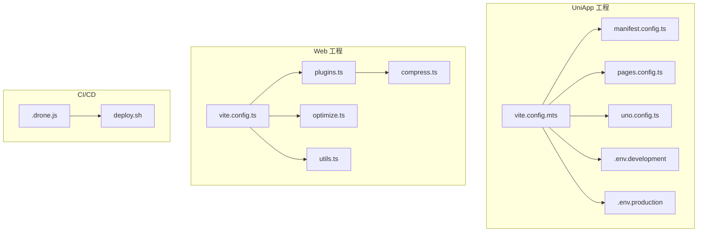
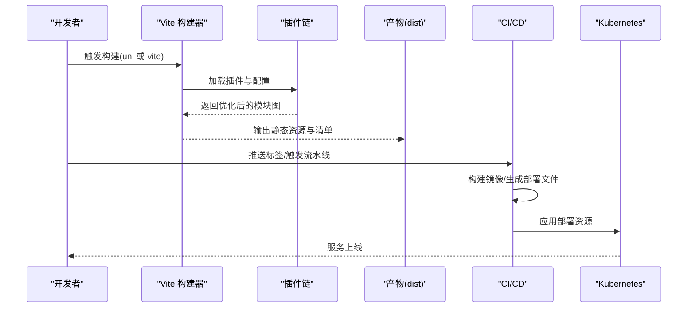
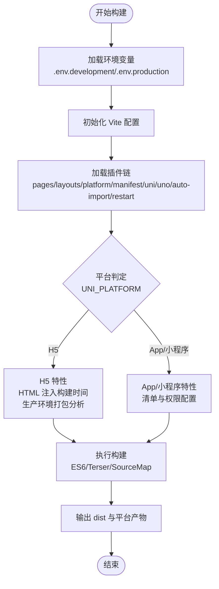
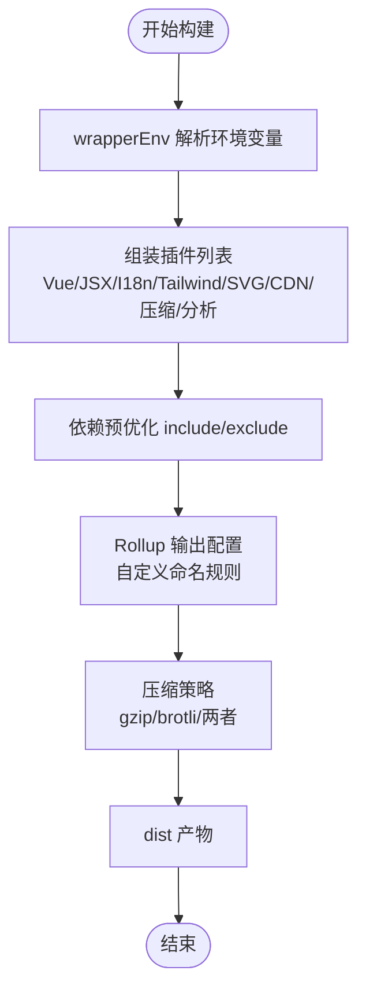
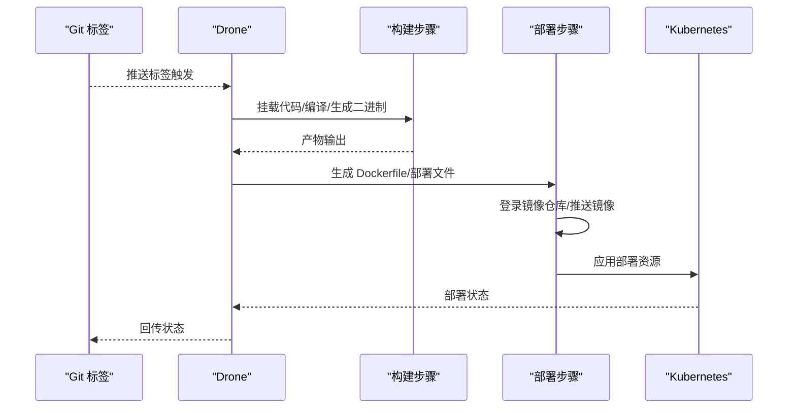
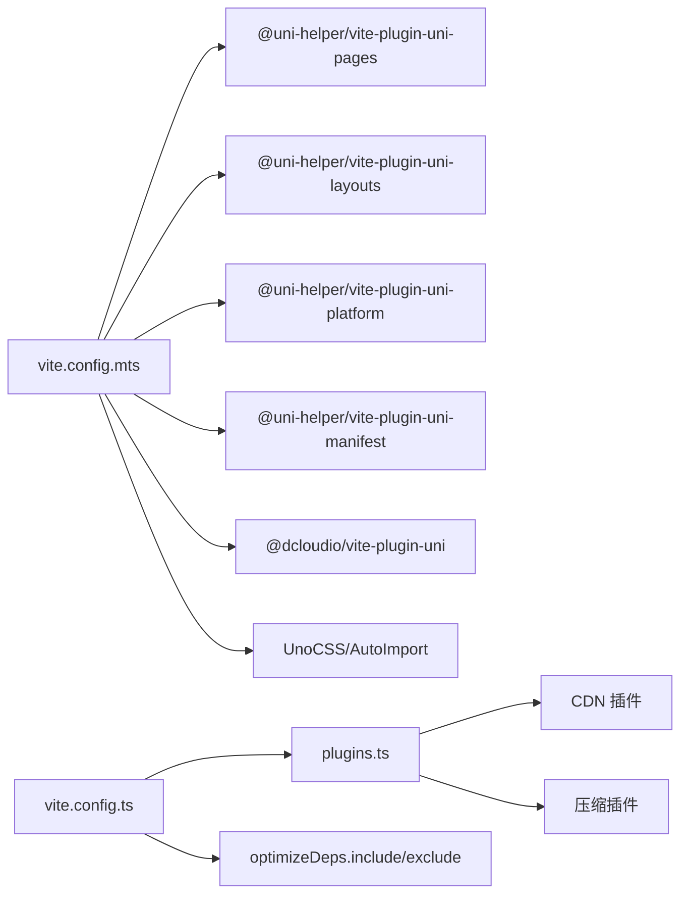

# 构建与发布流程

<cite>
**本文引用的文件**
- [vite.config.mts](file://client/uniapp/vite.config.mts)
- [package.json](file://client/uniapp/package.json)
- [manifest.config.ts](file://client/uniapp/manifest.config.ts)
- [pages.config.ts](file://client/uniapp/pages.config.ts)
- [uno.config.ts](file://client/uniapp/uno.config.ts)
- [vite.config.ts](file://client/web/vite.config.ts)
- [plugins.ts](file://client/web/buildconfig/plugins.ts)
- [compress.ts](file://client/web/buildconfig/compress.ts)
- [optimize.ts](file://client/web/buildconfig/optimize.ts)
- [utils.ts](file://client/web/buildconfig/utils.ts)
- [.env.development](file://client/uniapp/src/env/.env.development)
- [.env.production](file://client/uniapp/src/env/.env.production)
- [deploy.sh](file://deploy/shell/drone/deploy.sh)
- [.drone.js](file://.drone.js)
</cite>

## 目录
1. [简介](#简介)
2. [项目结构](#项目结构)
3. [核心组件](#核心组件)
4. [架构总览](#架构总览)
5. [详细组件分析](#详细组件分析)
6. [依赖关系分析](#依赖关系分析)
7. [性能考量](#性能考量)
8. [故障排查指南](#故障排查指南)
9. [结论](#结论)
10. [附录](#附录)

## 简介
本运维文档面向 Hoper UniApp 项目的构建与发布流程，聚焦以下目标：
- 深入解析 Vite 构建配置、打包优化与产物分析
- 细化多平台构建策略（小程序、H5、App）与差异化配置
- 提供资源压缩、代码分割、缓存与热更新实践
- 规划 CI/CD 集成、自动化部署与版本管理
- 总结构建性能优化与常见问题的诊断与修复

## 项目结构
本项目包含两套前端工程：
- UniApp 工程：基于 Vite 与 @dcloudio/vite-plugin-uni 的多端统一构建，覆盖 H5、App、微信小程序等平台
- Web 工程：独立的 H5 端工程，采用模块化构建配置与 CDN/压缩插件

图表来源
- [vite.config.mts:26-156](file://client/uniapp/vite.config.mts#L26-L156)
- [manifest.config.ts:17-108](file://client/uniapp/manifest.config.ts#L17-L108)
- [pages.config.ts:3-51](file://client/uniapp/pages.config.ts#L3-L51)
- [uno.config.ts:17-31](file://client/uniapp/uno.config.ts#L17-L31)
- [vite.config.ts:14-69](file://client/web/vite.config.ts#L14-L69)
- [plugins.ts:16-59](file://client/web/buildconfig/plugins.ts#L16-L59)
- [compress.ts:4-63](file://client/web/buildconfig/compress.ts#L4-L63)
- [optimize.ts:7-25](file://client/web/buildconfig/optimize.ts#L7-L25)
- [utils.ts:46-73](file://client/web/buildconfig/utils.ts#L46-L73)
- [.drone.js:31-189](file://.drone.js#L31-L189)
- [deploy.sh:1-170](file://deploy/shell/drone/deploy.sh#L1-L170)

章节来源
- [vite.config.mts:26-156](file://client/uniapp/vite.config.mts#L26-L156)
- [vite.config.ts:14-69](file://client/web/vite.config.ts#L14-L69)

## 核心组件
- UniApp 构建配置：统一入口、多平台插件链、环境变量与构建参数
- Web 工程构建配置：模块化插件、依赖预优化、产物输出与压缩
- CI/CD 流水线：Drone 脚本驱动的镜像构建、推送与 K8s 部署

章节来源
- [package.json:18-62](file://client/uniapp/package.json#L18-L62)
- [vite.config.mts:56-100](file://client/uniapp/vite.config.mts#L56-L100)
- [vite.config.ts:36-67](file://client/web/vite.config.ts#L36-L67)

## 架构总览
UniApp 与 Web 工程均以 Vite 为核心，结合各自插件生态实现多端构建与优化；CI/CD 通过 Drone 脚本完成镜像构建与 Kubernetes 部署。

图表来源
- [vite.config.mts:26-156](file://client/uniapp/vite.config.mts#L26-L156)
- [vite.config.ts:14-69](file://client/web/vite.config.ts#L14-L69)
- [.drone.js:31-189](file://.drone.js#L31-L189)
- [deploy.sh:94-167](file://deploy/shell/drone/deploy.sh#L94-L167)

## 详细组件分析

### UniApp 构建配置与多平台策略
- 插件链与平台能力
  - 页面与布局：@uni-helper/vite-plugin-uni-pages、@uni-helper/vite-plugin-uni-layouts
  - 平台识别：@uni-helper/vite-plugin-uni-platform
  - 清单生成：@uni-helper/vite-plugin-uni-manifest
  - 多端渲染：@dcloudio/vite-plugin-uni
  - CSS 工具：UnoCSS、AutoImport、vite-plugin-restart
  - Polyfill：vite-plugin-node-polyfills
- 环境变量与平台注入
  - 通过 loadEnv 读取 src/env 下的 .env.*，注入构建期常量
  - define 中注入平台与代理开关，便于运行时分支逻辑
- H5 特殊处理
  - HTML 注入构建时间占位符，便于追踪版本
  - 生产环境 H5 打包分析可视化
- 构建参数
  - ES6 目标、Terser 压缩、可选删除 console 与 debugger
  - 可选 SourceMap 以平衡调试与体积

图表来源
- [vite.config.mts:26-156](file://client/uniapp/vite.config.mts#L26-L156)
- [uno.config.ts:17-31](file://client/uniapp/uno.config.ts#L17-L31)
- [manifest.config.ts:17-108](file://client/uniapp/manifest.config.ts#L17-L108)

章节来源
- [vite.config.mts:26-156](file://client/uniapp/vite.config.mts#L26-L156)
- [uno.config.ts:17-31](file://client/uniapp/uno.config.ts#L17-L31)
- [manifest.config.ts:17-108](file://client/uniapp/manifest.config.ts#L17-L108)
- [pages.config.ts:3-51](file://client/uniapp/pages.config.ts#L3-L51)
- [.env.development:1-11](file://client/uniapp/src/env/.env.development#L1-L11)
- [.env.production:1-11](file://client/uniapp/src/env/.env.production#L1-L11)

### Web 工程构建配置与优化
- 插件体系
  - Vue/JSX、I18n、TailwindCSS、SVG Loader、路由警告清理、构建信息、打包分析
  - CDN 与压缩插件按需启用
- 依赖预优化
  - optimizeDeps.include 明确预构建模块，避免开发时“重装”导致卡顿
  - exclude 排除无需预构建的图标模块
- 产物输出
  - 自定义 chunk/entry/asset 文件命名规则，利于缓存与 CDN 管理
  - 关闭 SourceMap，降低线上体积与泄露风险
- 压缩策略
  - 支持 gzip/brotli/两者，可选删除源文件，按阈值过滤

图表来源
- [vite.config.ts:14-69](file://client/web/vite.config.ts#L14-L69)
- [plugins.ts:16-59](file://client/web/buildconfig/plugins.ts#L16-L59)
- [optimize.ts:7-25](file://client/web/buildconfig/optimize.ts#L7-L25)
- [compress.ts:4-63](file://client/web/buildconfig/compress.ts#L4-L63)
- [utils.ts:46-73](file://client/web/buildconfig/utils.ts#L46-L73)

章节来源
- [vite.config.ts:14-69](file://client/web/vite.config.ts#L14-L69)
- [plugins.ts:16-59](file://client/web/buildconfig/plugins.ts#L16-L59)
- [optimize.ts:7-25](file://client/web/buildconfig/optimize.ts#L7-L25)
- [compress.ts:4-63](file://client/web/buildconfig/compress.ts#L4-L63)
- [utils.ts:46-73](file://client/web/buildconfig/utils.ts#L46-L73)

### CI/CD 集成与自动化部署
- Drone 流水线
  - 通过 .drone.js 定义编排，按标签触发构建
  - 本地代码挂载到容器内进行编译，生成二进制产物
- 部署脚本
  - 自动生成 Dockerfile 与 Kubernetes 部署文件
  - 登录镜像仓库、推送镜像、应用 K8s 资源
  - 支持按集群设置 kubeconfig，并处理证书

图表来源
- [.drone.js:31-189](file://.drone.js#L31-L189)
- [deploy.sh:78-167](file://deploy/shell/drone/deploy.sh#L78-L167)

章节来源
- [.drone.js:31-189](file://.drone.js#L31-L189)
- [deploy.sh:1-170](file://deploy/shell/drone/deploy.sh#L1-L170)

## 依赖关系分析
- UniApp 工程
  - 构建入口依赖 @dcloudio/vite-plugin-uni 与多平台辅助插件
  - Manifest 与 Pages 配置决定平台特性与页面结构
  - UnoCSS 预设随平台切换，小程序使用 presetApplet，H5 使用官方预设
- Web 工程
  - 插件按需装配，CDN 与压缩插件通过环境变量控制
  - optimizeDeps 与 include/exclude 精准控制预构建范围
- CI/CD
  - Drone 脚本负责镜像构建与 K8s 应用，部署脚本处理变量替换与证书

图表来源
- [vite.config.mts:56-100](file://client/uniapp/vite.config.mts#L56-L100)
- [uno.config.ts:17-31](file://client/uniapp/uno.config.ts#L17-L31)
- [vite.config.ts:36-41](file://client/web/vite.config.ts#L36-L41)
- [plugins.ts:16-59](file://client/web/buildconfig/plugins.ts#L16-L59)
- [optimize.ts:7-25](file://client/web/buildconfig/optimize.ts#L7-L25)

章节来源
- [vite.config.mts:56-100](file://client/uniapp/vite.config.mts#L56-L100)
- [uno.config.ts:17-31](file://client/uniapp/uno.config.ts#L17-L31)
- [vite.config.ts:36-41](file://client/web/vite.config.ts#L36-L41)
- [plugins.ts:16-59](file://client/web/buildconfig/plugins.ts#L16-L59)
- [optimize.ts:7-25](file://client/web/buildconfig/optimize.ts#L7-L25)

## 性能考量
- 代码分割与产物组织
  - Web 工程 Rollup 输出自定义命名规则，有利于浏览器缓存与 CDN 缓存命中
- 依赖预优化
  - 明确 include/exclude，减少首次加载等待与重复编译
- 压缩与体积控制
  - 生产环境关闭 SourceMap，启用 Terser 删除 console 与 debugger
  - Web 工程可选 gzip/brotli 压缩，按需删除源文件
- 开发体验
  - H5 端注入构建时间，便于快速定位版本
  - 开发服务器端口与代理由环境变量控制，支持跨域调试

章节来源
- [vite.config.mts:142-154](file://client/uniapp/vite.config.mts#L142-L154)
- [vite.config.ts:44-61](file://client/web/vite.config.ts#L44-L61)
- [optimize.ts:7-25](file://client/web/buildconfig/optimize.ts#L7-L25)
- [compress.ts:4-63](file://client/web/buildconfig/compress.ts#L4-L63)
- [uno.config.ts:17-31](file://client/uniapp/uno.config.ts#L17-L31)

## 故障排查指南
- 构建失败
  - 检查 UNI_PLATFORM 与命令行参数是否匹配（dev/build、development/production）
  - 确认 src/env 下的 .env.* 是否存在且变量前缀为 VITE_
  - 查看插件顺序与平台插件依赖关系（UniXXX 需在 Uni 之前）
- 包体积过大
  - 生产环境启用 Terser 删除 console 与 debugger
  - Web 工程启用 gzip/brotli 压缩，评估删除源文件对回滚的影响
  - 优化 optimizeDeps.include，避免不必要的模块进入预构建
- 兼容性问题
  - App/H5 与小程序 UnoCSS 预设差异，确保样式单位与平台适配
  - Manifest 中 Android/iOS 权限与配置按平台核对
- 开发调试
  - H5 代理通过 VITE_APP_PROXY/VITE_APP_PROXY_PREFIX 控制
  - 开启 SourceMap 仅限开发环境，避免线上泄露

章节来源
- [vite.config.mts:26-51](file://client/uniapp/vite.config.mts#L26-L51)
- [vite.config.mts:142-154](file://client/uniapp/vite.config.mts#L142-L154)
- [vite.config.ts:36-41](file://client/web/vite.config.ts#L36-L41)
- [compress.ts:4-63](file://client/web/buildconfig/compress.ts#L4-L63)
- [uno.config.ts:17-31](file://client/uniapp/uno.config.ts#L17-L31)
- [manifest.config.ts:48-80](file://client/uniapp/manifest.config.ts#L48-L80)
- [.env.development:1-11](file://client/uniapp/src/env/.env.development#L1-L11)
- [.env.production:1-11](file://client/uniapp/src/env/.env.production#L1-L11)

## 结论
本项目通过 Vite 与多端插件链实现了高效的多平台构建，配合模块化的 Web 工程优化与 CI/CD 自动化，形成从开发到发布的完整闭环。建议持续关注包体积与首屏性能，结合缓存与压缩策略进一步优化用户体验。

## 附录
- 常用构建脚本
  - UniApp：dev:app、dev:h5、dev:mp-weixin、build:app、build:h5、build:mp-weixin
  - Web：dev、build、report（打包分析）
- 环境变量关键项
  - VITE_DELETE_CONSOLE、VITE_SHOW_SOURCEMAP、VITE_APP_PORT、VITE_SERVER_BASEURL、VITE_APP_PROXY、VITE_APP_PROXY_PREFIX

章节来源
- [package.json:18-62](file://client/uniapp/package.json#L18-L62)
- [vite.config.ts:14-69](file://client/web/vite.config.ts#L14-L69)
- [.env.development:1-11](file://client/uniapp/src/env/.env.development#L1-L11)
- [.env.production:1-11](file://client/uniapp/src/env/.env.production#L1-L11)