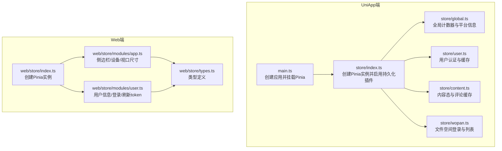
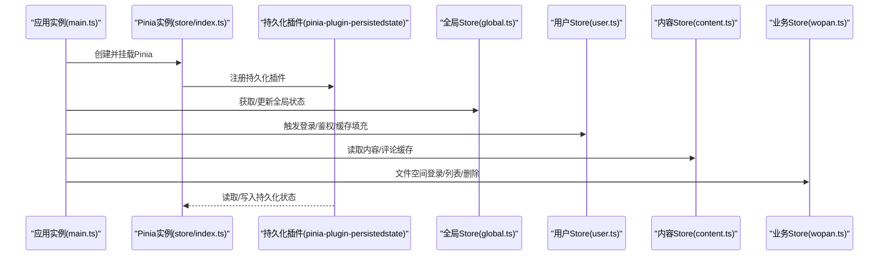
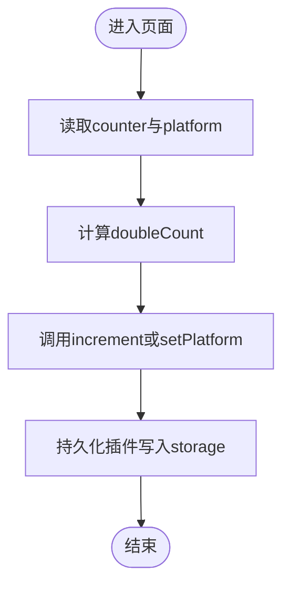
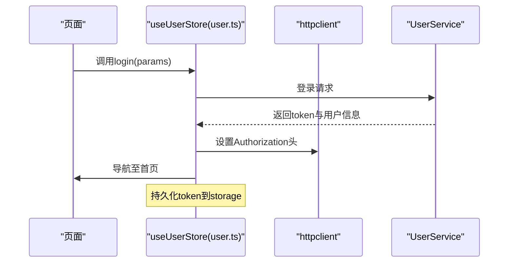
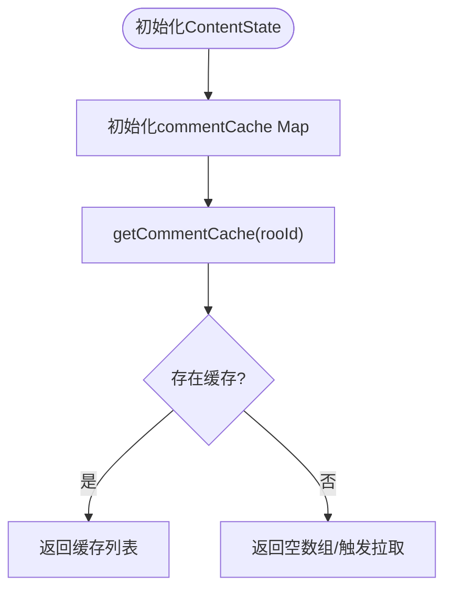
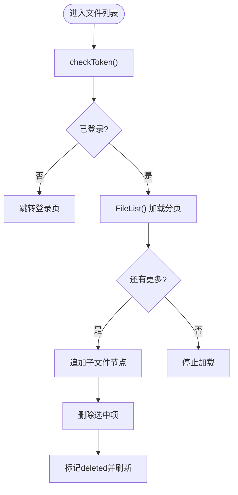
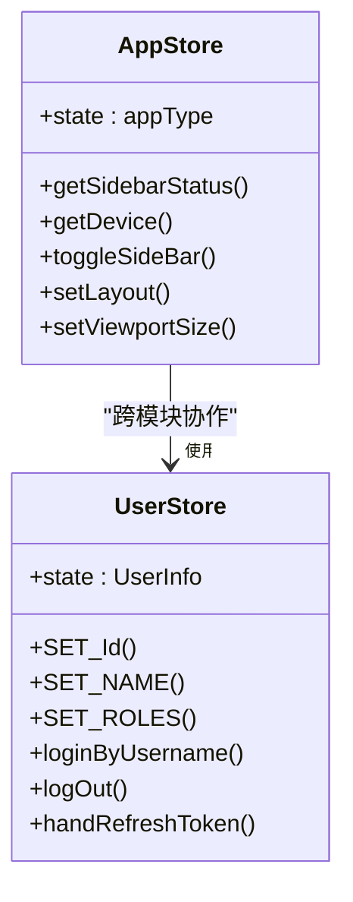
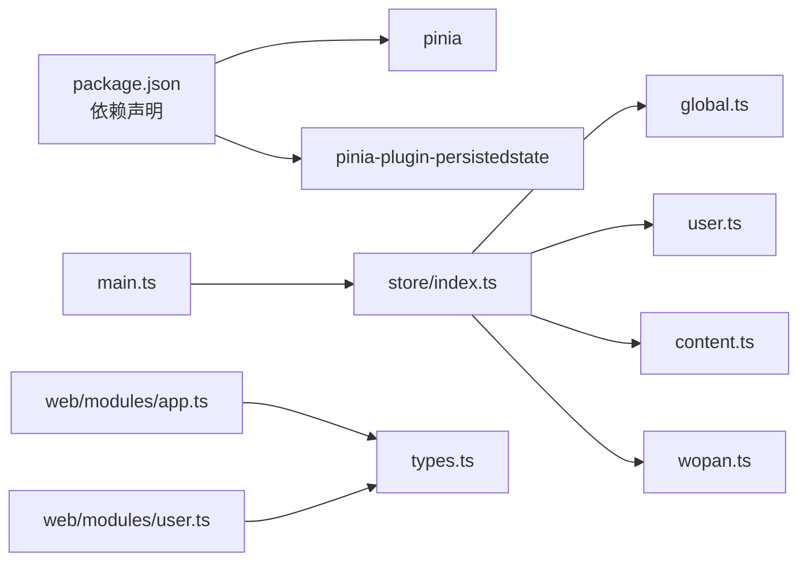

# 状态管理与数据流

<cite>
**本文档引用的文件**
- [client/uniapp/src/store/index.ts](file://client/uniapp/src/store/index.ts)
- [client/uniapp/src/store/global.ts](file://client/uniapp/src/store/global.ts)
- [client/uniapp/src/store/user.ts](file://client/uniapp/src/store/user.ts)
- [client/uniapp/src/store/content.ts](file://client/uniapp/src/store/content.ts)
- [client/uniapp/src/store/wopan.ts](file://client/uniapp/src/store/wopan.ts)
- [client/uniapp/src/main.ts](file://client/uniapp/src/main.ts)
- [client/uniapp/package.json](file://client/uniapp/package.json)
- [client/web/src/store/modules/app.ts](file://client/web/src/store/modules/app.ts)
- [client/web/src/store/modules/user.ts](file://client/web/src/store/modules/user.ts)
- [client/web/src/store/types.ts](file://client/web/src/store/types.ts)
- [client/web/src/store/index.ts](file://client/web/src/store/index.ts)
</cite>

## 目录
1. [简介](#简介)
2. [项目结构](#项目结构)
3. [核心组件](#核心组件)
4. [架构总览](#架构总览)
5. [详细组件分析](#详细组件分析)
6. [依赖关系分析](#依赖关系分析)
7. [性能考量](#性能考量)
8. [故障排查指南](#故障排查指南)
9. [结论](#结论)
10. [附录](#附录)

## 简介
本文件面向Hoper UniApp应用的状态管理与数据流，系统性梳理Pinia在UniApp与Web双端的集成方式、Store模块化设计、数据流组织与持久化策略，并给出全局状态、用户状态与其他业务状态的划分建议。文档同时覆盖异步状态管理、跨页面数据共享、状态模块拆分策略、命名规范与调试技巧，并针对状态冲突、性能优化与内存泄漏提出解决方案。

## 项目结构
本项目在UniApp与Web两端分别实现了Pinia状态管理：
- UniApp端：集中式Store入口与多模块Store（全局、用户、内容、业务空间等）
- Web端：模块化Store（应用侧边栏布局、用户认证等），并通过工具函数统一挂载

图表来源
- [client/uniapp/src/main.ts:11-21](file://client/uniapp/src/main.ts#L11-L21)
- [client/uniapp/src/store/index.ts:1-13](file://client/uniapp/src/store/index.ts#L1-L13)
- [client/uniapp/src/store/global.ts:1-27](file://client/uniapp/src/store/global.ts#L1-L27)
- [client/uniapp/src/store/user.ts:1-86](file://client/uniapp/src/store/user.ts#L1-L86)
- [client/uniapp/src/store/content.ts:1-49](file://client/uniapp/src/store/content.ts#L1-L49)
- [client/uniapp/src/store/wopan.ts:1-200](file://client/uniapp/src/store/wopan.ts#L1-L200)
- [client/web/src/store/index.ts:1-9](file://client/web/src/store/index.ts#L1-L9)
- [client/web/src/store/modules/app.ts:1-86](file://client/web/src/store/modules/app.ts#L1-L86)
- [client/web/src/store/modules/user.ts:1-93](file://client/web/src/store/modules/user.ts#L1-L93)
- [client/web/src/store/types.ts:1-38](file://client/web/src/store/types.ts#L1-L38)

章节来源
- [client/uniapp/src/main.ts:11-21](file://client/uniapp/src/main.ts#L11-L21)
- [client/uniapp/src/store/index.ts:1-13](file://client/uniapp/src/store/index.ts#L1-L13)
- [client/web/src/store/index.ts:1-9](file://client/web/src/store/index.ts#L1-L9)

## 核心组件
- Pinia实例与持久化
  - 在UniApp端通过插件启用持久化，存储介质使用uni.getStorageSync/uni.setStorageSync，确保跨页面与重启后状态可恢复。
  - Web端同样创建Pinia实例，便于后续扩展模块化与SSR支持。
- 全局状态
  - 提供计数器与平台信息，演示基础getter与action的使用。
- 用户状态
  - 维护认证态、token与用户缓存；封装登录、注册、鉴权查询与用户批量拉取。
- 内容状态
  - 定义内容域字段与评论缓存Map，提供按ID获取评论的Getter。
- 业务状态（示例：文件空间）
  - 封装登录、校验、文件列表加载、删除等动作，维护当前目录与分页状态。

章节来源
- [client/uniapp/src/store/index.ts:1-13](file://client/uniapp/src/store/index.ts#L1-L13)
- [client/uniapp/src/store/global.ts:1-27](file://client/uniapp/src/store/global.ts#L1-L27)
- [client/uniapp/src/store/user.ts:1-86](file://client/uniapp/src/store/user.ts#L1-L86)
- [client/uniapp/src/store/content.ts:1-49](file://client/uniapp/src/store/content.ts#L1-L49)
- [client/uniapp/src/store/wopan.ts:1-200](file://client/uniapp/src/store/wopan.ts#L1-L200)

## 架构总览
下图展示从应用启动到各Store被使用的整体流程，以及持久化插件如何介入状态生命周期。

图表来源
- [client/uniapp/src/main.ts:11-21](file://client/uniapp/src/main.ts#L11-L21)
- [client/uniapp/src/store/index.ts:1-13](file://client/uniapp/src/store/index.ts#L1-L13)
- [client/uniapp/src/store/global.ts:1-27](file://client/uniapp/src/store/global.ts#L1-L27)
- [client/uniapp/src/store/user.ts:1-86](file://client/uniapp/src/store/user.ts#L1-L86)
- [client/uniapp/src/store/content.ts:1-49](file://client/uniapp/src/store/content.ts#L1-L49)
- [client/uniapp/src/store/wopan.ts:1-200](file://client/uniapp/src/store/wopan.ts#L1-L200)

## 详细组件分析

### 全局状态（global.ts）
- 设计要点
  - 使用defineStore定义全局状态，包含计数器与平台枚举。
  - 提供doubleCount getter与increment/setPlatform action，演示基本读写与派生状态。
- 数据流
  - 组件通过store实例访问useGlobalStore，直接读取getter或调用action。
- 性能与内存
  - 状态粒度小，无复杂对象，开销低；注意避免在getter中进行昂贵计算。

图表来源
- [client/uniapp/src/store/global.ts:14-27](file://client/uniapp/src/store/global.ts#L14-L27)

章节来源
- [client/uniapp/src/store/global.ts:1-27](file://client/uniapp/src/store/global.ts#L1-L27)

### 用户状态（user.ts）
- 设计要点
  - 定义UserState接口，包含认证态、token与用户Map缓存。
  - 提供鉴权查询、登录、注册、批量用户拉取与缓存填充等动作。
  - 使用持久化存储token键值，结合HTTP客户端默认头实现自动鉴权。
- 异步与错误处理
  - 登录/注册采用try/catch捕获异常并提示；鉴权查询根据后端响应码控制状态。
- 跨页面共享
  - 通过Pinia全局状态在页面间共享用户信息与token。

图表来源
- [client/uniapp/src/store/user.ts:38-54](file://client/uniapp/src/store/user.ts#L38-L54)

章节来源
- [client/uniapp/src/store/user.ts:1-86](file://client/uniapp/src/store/user.ts#L1-L86)

### 内容状态（content.ts）
- 设计要点
  - 定义内容域字段与评论缓存Map，提供按根ID获取评论的Getter。
  - 动作区目前为空，便于后续扩展内容增删改查。
- 缓存策略
  - 评论缓存以Map结构按根ID组织，避免重复请求与跨页面共享。

图表来源
- [client/uniapp/src/store/content.ts:22-29](file://client/uniapp/src/store/content.ts#L22-L29)

章节来源
- [client/uniapp/src/store/content.ts:1-49](file://client/uniapp/src/store/content.ts#L1-L49)

### 业务状态（wopan.ts）
- 设计要点
  - 定义文件节点树与当前目录状态，封装登录、校验、文件列表加载、删除等动作。
  - 通过常量键值持久化访问令牌与私有空间令牌，保障会话连续性。
- 分页与删除
  - 列表加载基于pageNo与pageSize，删除后标记deleted并触发UI刷新。
- 错误与边界
  - 当前目录为根目录时禁止删除；空列表时回退父级目录。

图表来源
- [client/uniapp/src/store/wopan.ts:100-144](file://client/uniapp/src/store/wopan.ts#L100-L144)
- [client/uniapp/src/store/wopan.ts:158-192](file://client/uniapp/src/store/wopan.ts#L158-L192)

章节来源
- [client/uniapp/src/store/wopan.ts:1-200](file://client/uniapp/src/store/wopan.ts#L1-L200)

### Web端模块（app.ts 与 user.ts）
- 应用模块（app.ts）
  - 维护侧边栏开关、布局模式、设备类型与视口尺寸，提供toggle与setLayout等动作。
  - 通过storage与响应式命名空间持久化布局配置。
- 用户模块（user.ts）
  - 维护用户基本信息、角色与权限，提供登录、登出与token刷新动作。
  - 与路由联动，登出后重定向至登录页。

图表来源
- [client/web/src/store/modules/app.ts:12-81](file://client/web/src/store/modules/app.ts#L12-L81)
- [client/web/src/store/modules/user.ts:13-87](file://client/web/src/store/modules/user.ts#L13-L87)
- [client/web/src/store/types.ts:13-37](file://client/web/src/store/types.ts#L13-L37)

章节来源
- [client/web/src/store/modules/app.ts:1-86](file://client/web/src/store/modules/app.ts#L1-L86)
- [client/web/src/store/modules/user.ts:1-93](file://client/web/src/store/modules/user.ts#L1-L93)
- [client/web/src/store/types.ts:1-38](file://client/web/src/store/types.ts#L1-L38)

## 依赖关系分析
- 依赖清单（UniApp端）
  - pinia与pinia-plugin-persistedstate用于状态管理与持久化。
  - 通过main.ts挂载Pinia实例，store/index.ts统一创建与配置。
- 模块耦合
  - 各Store相对独立，仅在用户态与业务态之间存在间接交互（如用户登录影响业务态令牌）。
  - Web端模块通过工具函数与类型文件解耦。

图表来源
- [client/uniapp/package.json:98-99](file://client/uniapp/package.json#L98-L99)
- [client/uniapp/src/main.ts:9-13](file://client/uniapp/src/main.ts#L9-L13)
- [client/uniapp/src/store/index.ts:1-13](file://client/uniapp/src/store/index.ts#L1-L13)
- [client/web/src/store/index.ts:1-9](file://client/web/src/store/index.ts#L1-L9)

章节来源
- [client/uniapp/package.json:77-103](file://client/uniapp/package.json#L77-L103)
- [client/uniapp/src/main.ts:9-13](file://client/uniapp/src/main.ts#L9-L13)
- [client/uniapp/src/store/index.ts:1-13](file://client/uniapp/src/store/index.ts#L1-L13)

## 性能考量
- 状态粒度与派生计算
  - 将可派生状态放入getter，避免在组件中重复计算；对昂贵计算考虑缓存或节流。
- 异步与并发
  - 用户态批量拉取用户时，先做缓存命中检查，减少网络请求；对重复ID去重。
- 持久化策略
  - 仅持久化必要字段（如token、布局配置），避免大对象频繁序列化带来的开销。
- 内存管理
  - 对Map类缓存（如评论缓存、用户缓存）提供清理机制或LRU策略，防止无限增长。
- 渲染与订阅
  - 避免在getter中产生副作用；组件订阅最小化状态片段，减少不必要的重渲染。

## 故障排查指南
- 登录后未生效
  - 检查登录动作是否正确设置HTTP头与本地存储；确认持久化插件已启用。
- 鉴权失败或token过期
  - 校验后端响应码与token字段；必要时调用刷新token动作并重新设置头。
- 文件列表不更新
  - 确认分页pageNo推进逻辑与hasMore标志；删除后需标记deleted并刷新UI。
- 评论缓存未命中
  - 检查根ID是否一致；确认缓存Map是否已填充；必要时触发重新拉取。
- 调试技巧
  - 在store中打印关键状态变化；利用浏览器/开发者工具的Vuex/Pinia面板观察状态树。
  - 对异步动作增加loading状态，便于定位卡顿点。

章节来源
- [client/uniapp/src/store/user.ts:28-54](file://client/uniapp/src/store/user.ts#L28-L54)
- [client/uniapp/src/store/wopan.ts:100-144](file://client/uniapp/src/store/wopan.ts#L100-L144)
- [client/uniapp/src/store/content.ts:22-29](file://client/uniapp/src/store/content.ts#L22-L29)

## 结论
本项目在UniApp与Web两端均采用Pinia作为状态管理核心，通过集中式与模块化相结合的方式实现全局状态、用户状态与业务状态的清晰分离。持久化插件确保关键状态在重启后可用，异步动作封装了登录、鉴权与业务操作，具备良好的可扩展性。建议在后续迭代中完善缓存清理、错误统一处理与调试工具链，持续优化性能与稳定性。

## 附录
- 状态模块拆分策略
  - 按领域拆分：全局、用户、内容、业务（如文件空间）等。
  - 按职责拆分：读取（getter）、写入（actions）、持久化（插件配置）。
- 命名规范
  - Store命名：useXxxStore（如useUserStore、useGlobalStore）。
  - 状态接口：XxxState（如UserState、GlobalState）。
  - Getter与Action：语义化动词短语（如getUser、toggleSideBar）。
- 调试与可观测性
  - 在store中记录关键事件日志；对异步动作添加loading与错误提示。
  - 对Map类缓存提供size统计与清理阈值，防止内存泄漏。