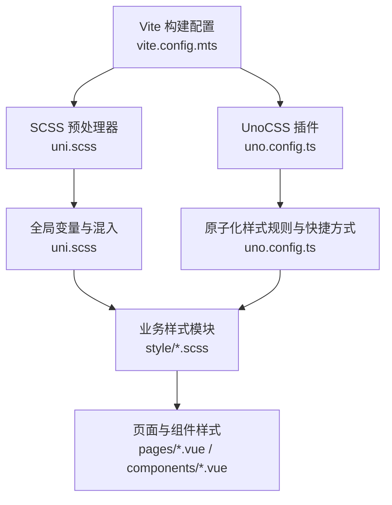
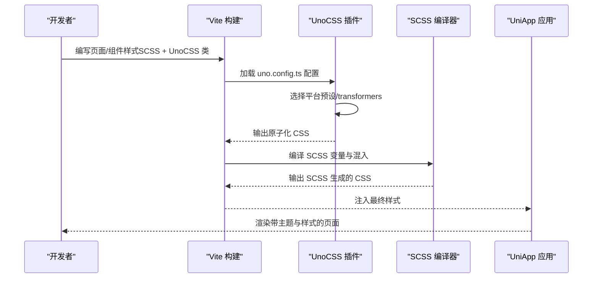
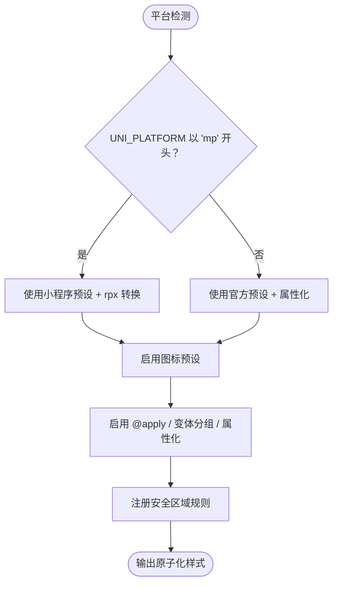
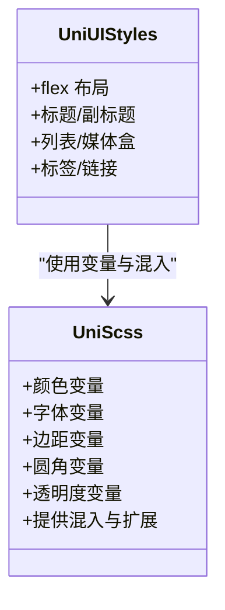
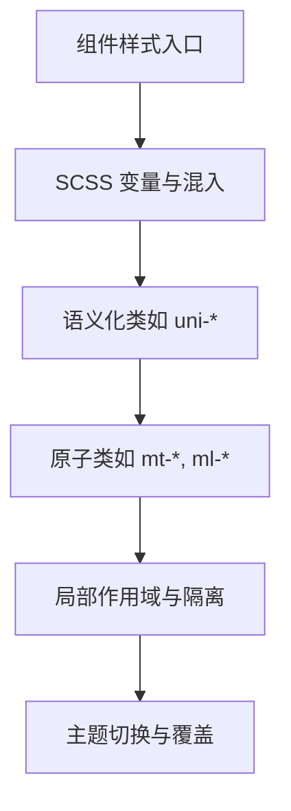
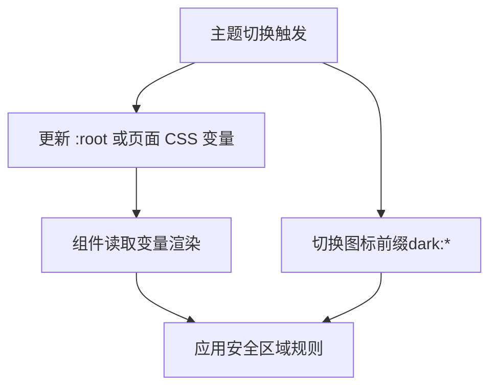
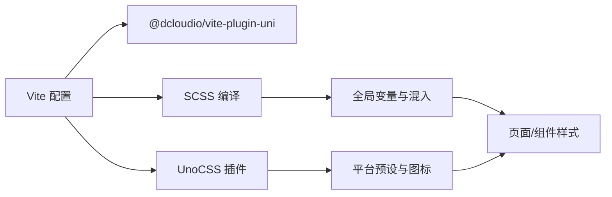

# 界面样式与主题

<cite>
**本文档引用的文件**
- [uno.config.ts](file://client/uniapp/uno.config.ts)
- [uni.scss](file://client/uniapp/src/uni.scss)
- [index.scss](file://client/uniapp/src/style/index.scss)
- [uni-ui.scss](file://client/uniapp/src/style/uni-ui.scss)
- [vite.config.mts](file://client/uniapp/vite.config.mts)
- [index.scss](file://thirdparty/diamond/src/vue/directives/ripple/index.scss)
</cite>

## 目录
1. [简介](#简介)
2. [项目结构](#项目结构)
3. [核心组件](#核心组件)
4. [架构总览](#架构总览)
5. [详细组件分析](#详细组件分析)
6. [依赖关系分析](#依赖关系分析)
7. [性能考虑](#性能考虑)
8. [故障排查指南](#故障排查指南)
9. [结论](#结论)
10. [附录](#附录)

## 简介
本设计文档聚焦于 Hoper UniApp 项目的界面样式与主题体系，系统阐述样式架构、SCSS 变量与混入、组件样式隔离策略；深入解析 UnoCSS 原子化样式的配置、实用类与响应式设计；覆盖图标字体集成、主题切换与暗黑模式实现思路；并提供命名规范、性能优化与浏览器兼容性处理建议，以及样式冲突、打包优化与移动端适配的解决方案。

## 项目结构
UniApp 样式与主题相关的核心位置集中在 client/uniapp/src 下，主要由以下部分组成：
- 全局 SCSS 变量与混入：uni.scss
- 原子化样式配置：uno.config.ts
- 页面与组件级样式：style/*.scss（如 uni-ui.scss、index.scss）
- 构建与插件：vite.config.mts（集成 UnoCSS、自动导入等）

图表来源
- [vite.config.mts:56-100](file://client/uniapp/vite.config.mts#L56-L100)
- [uno.config.ts:31-80](file://client/uniapp/uno.config.ts#L31-L80)
- [uni.scss:16-78](file://client/uniapp/src/uni.scss#L16-L78)
- [uni-ui.scss:1-120](file://client/uniapp/src/style/uni-ui.scss#L1-L120)
- [index.scss:1-19](file://client/uniapp/src/style/index.scss#L1-L19)

章节来源
- [vite.config.mts:56-100](file://client/uniapp/vite.config.mts#L56-L100)
- [uno.config.ts:17-30](file://client/uniapp/uno.config.ts#L17-L30)
- [uni.scss:16-78](file://client/uniapp/src/uni.scss#L16-L78)

## 核心组件
- UnoCSS 原子化样式引擎：通过 presets、transformers、rules、shortcuts 实现跨平台（H5/小程序/App）统一的原子化样式能力，支持图标、属性化 class、变体分组与安全区域适配。
- SCSS 变量与混入：提供颜色、字体、边距、圆角等基础变量，支撑主题定制与组件样式隔离。
- 页面与组件样式：通过 SCSS 模块化组织，结合 UnoCSS 快捷方式，形成“原子化 + 语义化”的混合策略。
- 构建与插件：Vite 集成 UnoCSS、自动导入、可视化分析与 polyfill，确保开发体验与产物质量。

章节来源
- [uno.config.ts:31-80](file://client/uniapp/uno.config.ts#L31-L80)
- [uni.scss:16-78](file://client/uniapp/src/uni.scss#L16-L78)
- [vite.config.mts:56-100](file://client/uniapp/vite.config.mts#L56-L100)

## 架构总览
样式架构采用“构建期原子化 + 运行期 SCSS 变量”的双轨设计：
- 构建期：Vite 引入 UnoCSS 插件，按平台选择预设（小程序/非小程序），启用 @apply、变体分组与属性化 class，生成最小化原子类。
- 运行期：SCSS 提供全局变量与混入，组件内通过局部样式与变量实现主题隔离与可维护性。

图表来源
- [vite.config.mts:70-71](file://client/uniapp/vite.config.mts#L70-L71)
- [uno.config.ts:31-80](file://client/uniapp/uno.config.ts#L31-L80)
- [uni.scss:16-78](file://client/uniapp/src/uni.scss#L16-L78)

## 详细组件分析

### UnoCSS 原子化样式配置
- 平台差异化预设：根据 UNI_PLATFORM 是否以 mp 开头选择小程序预设或官方预设；小程序端启用 rpx/Rem 转换，保证设计稿一致性。
- 图标支持：启用 presetIcons，提供 inline-block 与 vertical-align 的额外属性，便于暗黑模式下的图标切换。
- 变体与属性化：启用 @apply、变体分组与属性化 class，配合 prefixedOnly 与前缀避免第三方框架冲突。
- 安全区域：自定义规则 p-safe、pt-safe、pb-safe，适配刘海屏与底部安全区域。
- 设计稿适配：注释给出基于设计稿 1500 的换算建议，便于直接按设计稿 px 写原子类。

图表来源
- [uno.config.ts:17-30](file://client/uniapp/uno.config.ts#L17-L30)
- [uno.config.ts:35-42](file://client/uniapp/uno.config.ts#L35-L42)
- [uno.config.ts:56-68](file://client/uniapp/uno.config.ts#L56-L68)
- [uno.config.ts:69-79](file://client/uniapp/uno.config.ts#L69-L79)

章节来源
- [uno.config.ts:17-30](file://client/uniapp/uno.config.ts#L17-L30)
- [uno.config.ts:35-42](file://client/uniapp/uno.config.ts#L35-L42)
- [uno.config.ts:56-68](file://client/uniapp/uno.config.ts#L56-L68)
- [uno.config.ts:69-79](file://client/uniapp/uno.config.ts#L69-L79)

### SCSS 变量系统与混入
- 变量覆盖：uni.scss 提供颜色、字体、边距、圆角、透明度等变量，便于主题定制与统一管理。
- 混入与扩展：通过 SCSS 混入与 @extend，形成语义化类（如 uni-flex、uni-title、uni-thumb 等），降低重复样式。
- 主题隔离：页面与组件样式通过局部作用域与变量覆盖实现主题隔离，避免全局污染。

图表来源
- [uni.scss:16-78](file://client/uniapp/src/uni.scss#L16-L78)
- [uni-ui.scss:1-120](file://client/uniapp/src/style/uni-ui.scss#L1-L120)

章节来源
- [uni.scss:16-78](file://client/uniapp/src/uni.scss#L16-L78)
- [uni-ui.scss:1-120](file://client/uniapp/src/style/uni-ui.scss#L1-L120)

### 组件样式隔离与命名规范
- 命名规范：采用语义化类名（如 uni-title、uni-thumb），结合原子类（如 mt-4、ml-4）提升可读性与复用性。
- 样式隔离：通过 SCSS 模块化与局部作用域，避免样式泄漏；必要时使用 :root 或页面级变量覆盖实现主题切换。
- 交互与动画：参考 ripple 指令的 SCSS 变量与动画过渡，确保交互一致性与性能。

图表来源
- [index.scss:1-19](file://client/uniapp/src/style/index.scss#L1-L19)
- [index.scss:11-18](file://client/uniapp/src/style/index.scss#L11-L18)
- [index.scss:3-9](file://client/uniapp/src/style/index.scss#L3-L9)
- [index.scss:11-18](file://client/uniapp/src/style/index.scss#L11-L18)
- [index.scss:1-19](file://client/uniapp/src/style/index.scss#L1-L19)

章节来源
- [index.scss:1-19](file://client/uniapp/src/style/index.scss#L1-L19)
- [index.scss:11-18](file://client/uniapp/src/style/index.scss#L11-L18)
- [index.scss:3-9](file://client/uniapp/src/style/index.scss#L3-L9)

### 主题切换与暗黑模式实现
- 变量驱动：通过 :root 或页面级 CSS 变量（如 --wot-color-theme）控制主题色；在组件内使用变量实现自动切换。
- 图标适配：利用 presetIcons 的暗黑模式图标切换语法（如 dark:i-carbon-moon），实现明暗模式图标同步。
- 安全区域：p-safe、pt-safe、pb-safe 规则保障暗黑模式下视觉一致性与安全区域适配。

图表来源
- [index.scss:11-18](file://client/uniapp/src/style/index.scss#L11-L18)
- [uno.config.ts:35-42](file://client/uniapp/uno.config.ts#L35-L42)
- [uno.config.ts:69-79](file://client/uniapp/uno.config.ts#L69-L79)

章节来源
- [index.scss:11-18](file://client/uniapp/src/style/index.scss#L11-L18)
- [uno.config.ts:35-42](file://client/uniapp/uno.config.ts#L35-L42)
- [uno.config.ts:69-79](file://client/uniapp/uno.config.ts#L69-L79)

### 响应式设计与移动端适配
- 单位策略：小程序端使用 rpx，H5 端使用 rem，结合 UnoCSS 预设与注释建议，实现设计稿 px 直写。
- 安全区域：p-safe、pt-safe、pb-safe 规则自动适配刘海屏与底部安全区域。
- 属性化与变体：通过属性化 class 与变体分组，减少条件样式代码，提升可维护性。

章节来源
- [uno.config.ts:17-30](file://client/uniapp/uno.config.ts#L17-L30)
- [uno.config.ts:69-79](file://client/uniapp/uno.config.ts#L69-L79)

### 图标字体集成
- 预设启用：presetIcons 提供图标能力，需配合图标库（如 @iconify-json/carbon）使用。
- 暗黑模式：通过 dark:* 语法实现明暗模式图标切换。
- 兼容性：注释说明颜色函数逗号分隔的兼容性建议，避免与群友写法冲突。

章节来源
- [uno.config.ts:35-42](file://client/uniapp/uno.config.ts#L35-L42)
- [uno.config.ts:47-49](file://client/uniapp/uno.config.ts#L47-L49)

### 性能与交互细节
- Ripple 指令样式：通过 SCSS 变量控制动画过渡与可见性，确保交互流畅与性能友好。
- 构建优化：Vite 配置开启 Terser 压缩、可选删除 console、SourceMap 控制与打包分析，平衡体积与调试成本。

章节来源
- [index.scss:1-19](file://client/uniapp/src/style/index.scss#L1-L19)
- [vite.config.mts:147-152](file://client/uniapp/vite.config.mts#L147-L152)
- [vite.config.mts:92-99](file://client/uniapp/vite.config.mts#L92-L99)

## 依赖关系分析
- 构建插件耦合：Vite 通过 @dcloudio/vite-plugin-uni 与 UnoCSS 插件协同工作；UnoCSS 依赖平台环境变量决定预设与行为。
- 样式依赖：页面与组件样式依赖 SCSS 变量与混入；UnoCSS 原子类与 SCSS 类共同构成最终样式。
- 第三方影响：属性化 class 的 prefixedOnly 与前缀配置用于规避第三方框架样式冲突。

图表来源
- [vite.config.mts:56-100](file://client/uniapp/vite.config.mts#L56-L100)
- [uno.config.ts:31-80](file://client/uniapp/uno.config.ts#L31-L80)
- [uni.scss:16-78](file://client/uniapp/src/uni.scss#L16-L78)

章节来源
- [vite.config.mts:56-100](file://client/uniapp/vite.config.mts#L56-L100)
- [uno.config.ts:31-80](file://client/uniapp/uno.config.ts#L31-L80)
- [uni.scss:16-78](file://client/uniapp/src/uni.scss#L16-L78)

## 性能考虑
- 原子化优先：优先使用 UnoCSS 原子类，减少重复样式与体积膨胀。
- 变量与混入：合理使用 SCSS 变量与混入，避免过度嵌套与深层选择器。
- 构建优化：开启 Terser 压缩、按需删除 console、启用打包分析，平衡体积与调试成本。
- 移动端适配：rpx/Rem 单位策略与安全区域规则，减少重排与布局抖动。

## 故障排查指南
- 样式冲突：启用属性化 class 的 prefixedOnly 与自定义前缀，避免与第三方框架冲突。
- 图标不生效：确认已安装并注册对应图标库，检查图标类名与暗黑模式前缀。
- 平台差异：小程序端与 H5 端单位与预设不同，注意设计稿换算与样式书写差异。
- 主题切换无效：检查 :root 或页面 CSS 变量是否正确更新，确认组件读取逻辑。

章节来源
- [uno.config.ts:63-67](file://client/uniapp/uno.config.ts#L63-L67)
- [uno.config.ts:35-42](file://client/uniapp/uno.config.ts#L35-L42)
- [uno.config.ts:17-30](file://client/uniapp/uno.config.ts#L17-L30)

## 结论
本项目通过 UnoCSS 原子化与 SCSS 变量系统的结合，实现了跨平台一致、可维护性强且性能友好的样式架构。配合主题切换、暗黑模式与安全区域适配，满足多端需求。建议在后续迭代中持续优化变量命名、减少冗余样式，并完善主题变量的文档与示例，以提升团队协作效率与长期可维护性。

## 附录
- 命名规范建议：语义化类名（uni-*）与原子类（如 mt-*, ml-*）结合；属性化 class 使用受控前缀。
- 主题变量清单：颜色、字体、边距、圆角、透明度等，集中管理并在组件内按需覆盖。
- 平台适配清单：小程序端 rpx、H5 端 rem；安全区域规则 p-safe、pt-safe、pb-safe。