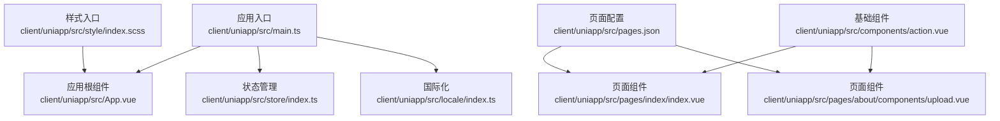
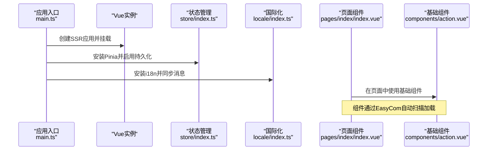
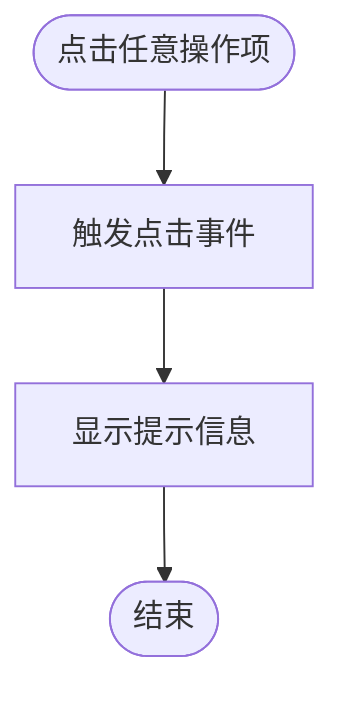
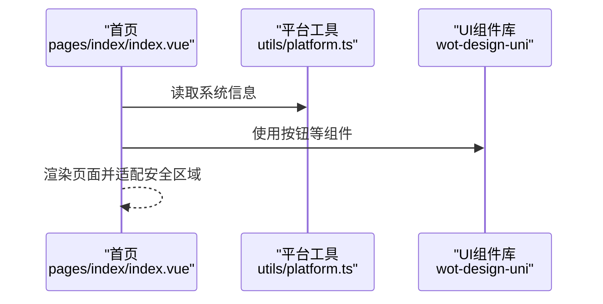
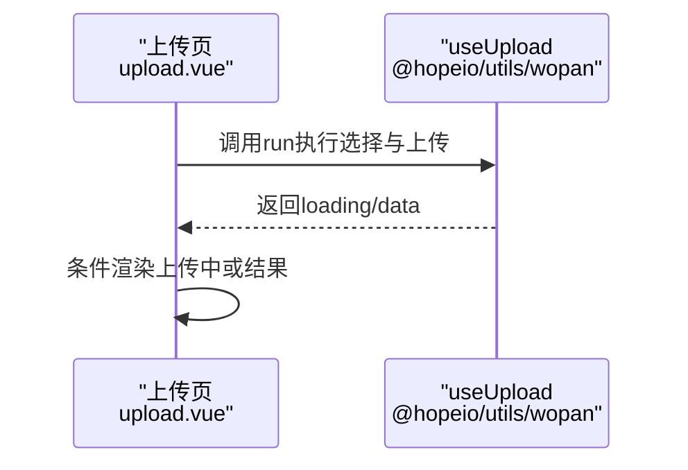
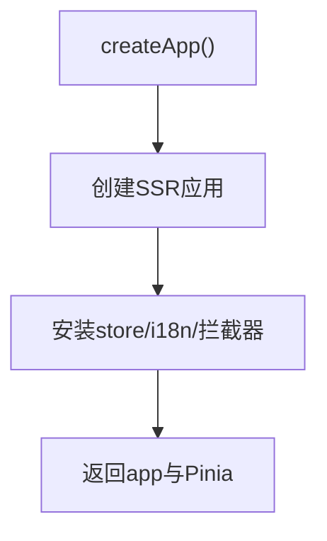
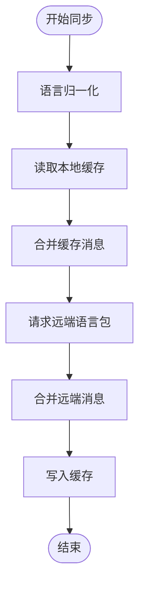
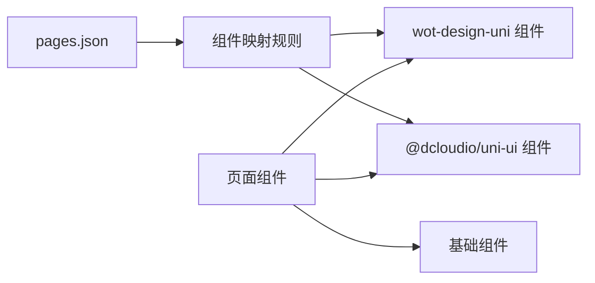

# 组件开发与复用

<cite>
**本文档引用的文件**
- [client/uniapp/src/main.ts](file://client/uniapp/src/main.ts)
- [client/uniapp/src/App.vue](file://client/uniapp/src/App.vue)
- [client/uniapp/src/components/action.vue](file://client/uniapp/src/components/action.vue)
- [client/uniapp/src/pages.json](file://client/uniapp/src/pages.json)
- [client/uniapp/src/pages/index/index.vue](file://client/uniapp/src/pages/index/index.vue)
- [client/uniapp/src/pages/about/components/upload.vue](file://client/uniapp/src/pages/about/components/upload.vue)
- [client/uniapp/src/store/index.ts](file://client/uniapp/src/store/index.ts)
- [client/uniapp/src/locale/index.ts](file://client/uniapp/src/locale/index.ts)
- [client/uniapp/src/style/index.scss](file://client/uniapp/src/style/index.scss)
</cite>

## 目录
1. [引言](#引言)
2. [项目结构](#项目结构)
3. [核心组件](#核心组件)
4. [架构总览](#架构总览)
5. [详细组件分析](#详细组件分析)
6. [依赖关系分析](#依赖关系分析)
7. [性能考量](#性能考量)
8. [故障排查指南](#故障排查指南)
9. [结论](#结论)
10. [附录](#附录)

## 引言
本文件面向Hoper UniApp生态下的组件化开发与复用，系统性梳理组件化理念、设计原则与复用策略；详解自定义组件的创建、props传递与事件处理机制；阐述组件间通信、插槽与作用域插槽的应用；给出UI组件库封装、业务组件抽象与组件测试方法；并提供命名规范、样式管理与性能优化建议，以解决组件耦合、状态共享与生命周期管理等问题。

## 项目结构
本项目采用基于页面的组织方式，结合EasyCom自动扫描机制与第三方UI库（wot-design-uni、@dcloudio/uni-ui）进行组件化开发。应用入口在主程序文件中初始化全局插件、状态管理与国际化；页面配置集中于pages.json，统一声明导航栏、tabBar、分包与组件映射规则；组件以功能模块划分，既有通用基础组件，也有页面级业务组件。

**图表来源**
- [client/uniapp/src/main.ts:1-22](file://client/uniapp/src/main.ts#L1-L22)
- [client/uniapp/src/App.vue:1-62](file://client/uniapp/src/App.vue#L1-L62)
- [client/uniapp/src/pages.json:1-140](file://client/uniapp/src/pages.json#L1-L140)
- [client/uniapp/src/pages/index/index.vue:1-36](file://client/uniapp/src/pages/index/index.vue#L1-L36)
- [client/uniapp/src/pages/about/components/upload.vue:1-31](file://client/uniapp/src/pages/about/components/upload.vue#L1-L31)
- [client/uniapp/src/components/action.vue:1-56](file://client/uniapp/src/components/action.vue#L1-L56)
- [client/uniapp/src/style/index.scss:1-19](file://client/uniapp/src/style/index.scss#L1-L19)

**章节来源**
- [client/uniapp/src/main.ts:1-22](file://client/uniapp/src/main.ts#L1-L22)
- [client/uniapp/src/App.vue:1-62](file://client/uniapp/src/App.vue#L1-L62)
- [client/uniapp/src/pages.json:1-140](file://client/uniapp/src/pages.json#L1-L140)
- [client/uniapp/src/style/index.scss:1-19](file://client/uniapp/src/style/index.scss#L1-L19)

## 核心组件
- 应用入口与插件注册：在入口文件中完成Vue实例创建、状态管理、国际化、路由拦截器与原型拦截器的安装，确保全局可用。
- 页面级组件：如首页与上传示例页，展示页面级逻辑、导航配置与业务交互。
- 基础组件：如动作条组件，演示事件绑定与简单交互。
- 全局样式与主题：通过样式入口与UnoCSS/SCSS变量进行主题色与组件样式的统一管理。
- 国际化：提供运行时消息同步、缓存与格式化工具，支持非Vue环境调用。

**章节来源**
- [client/uniapp/src/main.ts:11-21](file://client/uniapp/src/main.ts#L11-L21)
- [client/uniapp/src/pages/index/index.vue:12-29](file://client/uniapp/src/pages/index/index.vue#L12-L29)
- [client/uniapp/src/pages/about/components/upload.vue:24-26](file://client/uniapp/src/pages/about/components/upload.vue#L24-L26)
- [client/uniapp/src/components/action.vue:1-56](file://client/uniapp/src/components/action.vue#L1-L56)
- [client/uniapp/src/style/index.scss:1-19](file://client/uniapp/src/style/index.scss#L1-L19)
- [client/uniapp/src/locale/index.ts:45-64](file://client/uniapp/src/locale/index.ts#L45-L64)

## 架构总览
下图展示了从应用启动到页面渲染、组件加载与第三方UI库集成的整体流程。

**图表来源**
- [client/uniapp/src/main.ts:11-21](file://client/uniapp/src/main.ts#L11-L21)
- [client/uniapp/src/store/index.ts:1-13](file://client/uniapp/src/store/index.ts#L1-L13)
- [client/uniapp/src/locale/index.ts:45-64](file://client/uniapp/src/locale/index.ts#L45-L64)
- [client/uniapp/src/pages/index/index.vue:12-29](file://client/uniapp/src/pages/index/index.vue#L12-L29)
- [client/uniapp/src/components/action.vue:1-56](file://client/uniapp/src/components/action.vue#L1-L56)

## 详细组件分析

### 基础组件：动作条（action）
- 组件职责：提供一组可点击的操作项，用于触发业务行为并反馈提示。
- 事件处理：每个操作项绑定点击事件，触发时弹出提示。
- 样式管理：使用scoped样式隔离组件样式，避免污染全局。
- 复用策略：作为通用基础组件，在多个页面中直接引入使用。

**图表来源**
- [client/uniapp/src/components/action.vue:26-33](file://client/uniapp/src/components/action.vue#L26-L33)

**章节来源**
- [client/uniapp/src/components/action.vue:1-56](file://client/uniapp/src/components/action.vue#L1-L56)

### 页面组件：首页（index）
- 页面配置：通过definePage与defineOptions声明页面样式与组件名称。
- 平台适配：读取系统信息获取安全区域边距，适配刘海屏。
- 依赖注入：引入UI库组件与工具模块，提升开发效率。

**图表来源**
- [client/uniapp/src/pages/index/index.vue:12-29](file://client/uniapp/src/pages/index/index.vue#L12-L29)

**章节来源**
- [client/uniapp/src/pages/index/index.vue:12-29](file://client/uniapp/src/pages/index/index.vue#L12-L29)

### 页面组件：上传示例（about/components/upload）
- 组合式函数：通过useUpload组合式函数封装上传逻辑，实现“状态一体化”。
- 条件渲染：根据loading状态切换上传中与结果展示。
- 图片预览：结果返回后以image组件展示。

**图表来源**
- [client/uniapp/src/pages/about/components/upload.vue:24-26](file://client/uniapp/src/pages/about/components/upload.vue#L24-L26)

**章节来源**
- [client/uniapp/src/pages/about/components/upload.vue:1-31](file://client/uniapp/src/pages/about/components/upload.vue#L1-L31)

### 应用入口与全局初始化
- 插件安装：包括状态管理、国际化、路由拦截器与原型拦截器。
- 返回上下文：将Pinia返回给框架，保证运行时可用。

**图表来源**
- [client/uniapp/src/main.ts:11-21](file://client/uniapp/src/main.ts#L11-L21)

**章节来源**
- [client/uniapp/src/main.ts:1-22](file://client/uniapp/src/main.ts#L1-L22)

### 国际化与消息同步
- 运行时同步：从远端拉取语言包并合并到本地，同时写入缓存。
- 语言归一化：对传入语言进行标准化处理，确保兼容性。
- 非Vue环境：提供translate与formatI18n等工具函数。

**图表来源**
- [client/uniapp/src/locale/index.ts:45-64](file://client/uniapp/src/locale/index.ts#L45-L64)

**章节来源**
- [client/uniapp/src/locale/index.ts:1-116](file://client/uniapp/src/locale/index.ts#L1-L116)

### 样式与主题管理
- 样式入口：集中定义全局样式与主题变量。
- UnoCSS：通过虚拟样式入口统一原子化样式。
- 组件样式：使用scoped样式避免样式泄漏。

**章节来源**
- [client/uniapp/src/style/index.scss:1-19](file://client/uniapp/src/style/index.scss#L1-L19)
- [client/uniapp/src/App.vue:19-61](file://client/uniapp/src/App.vue#L19-L61)

## 依赖关系分析
- EasyCom自动扫描：pages.json中配置了组件映射规则，使wot-design-uni与@uni-ui组件可直接在页面中使用，降低导入成本。
- 页面与组件：页面组件通过import或直接使用基础组件，形成“页面-组件”的单向依赖。
- 插件与全局：应用入口集中安装插件，页面仅需按需使用，降低耦合度。

**图表来源**
- [client/uniapp/src/pages.json:9-16](file://client/uniapp/src/pages.json#L9-L16)

**章节来源**
- [client/uniapp/src/pages.json:1-140](file://client/uniapp/src/pages.json#L1-L140)

## 性能考量
- 组件懒加载：通过EasyCom按需加载第三方UI组件，减少首屏体积。
- 状态持久化：Pinia配合持久化插件，避免刷新丢失关键状态。
- 样式隔离：使用scoped样式与原子化工具，减少全局样式冲突与重绘。
- 平台适配：读取系统信息进行安全区域适配，避免布局抖动。

**章节来源**
- [client/uniapp/src/store/index.ts:1-13](file://client/uniapp/src/store/index.ts#L1-L13)
- [client/uniapp/src/pages/index/index.vue:27-28](file://client/uniapp/src/pages/index/index.vue#L27-L28)

## 故障排查指南
- 组件无法识别：检查pages.json中的EasyCom映射规则，确认组件名与路径一致。
- 国际化消息未生效：确认语言归一化逻辑与缓存写入流程，检查远端请求是否成功。
- 样式覆盖异常：检查scoped与全局样式的优先级，避免过度使用深度选择器。
- 页面跳转失效：核对pages.json中页面路径与导航配置，确认中间件与权限设置。

**章节来源**
- [client/uniapp/src/pages.json:9-16](file://client/uniapp/src/pages.json#L9-L16)
- [client/uniapp/src/locale/index.ts:45-64](file://client/uniapp/src/locale/index.ts#L45-L64)

## 结论
本项目通过EasyCom与第三方UI库实现了高效的组件化开发；以页面为中心的结构便于业务扩展；Pinia与i18n的全局初始化保障了状态与国际化的一致性。建议在后续实践中进一步完善组件API设计、事件命名规范与测试体系，持续优化性能与可维护性。

## 附录

### 组件设计原则与复用策略
- 单一职责：每个组件聚焦单一功能，便于复用与测试。
- 明确接口：通过清晰的props与事件定义，降低使用门槛。
- 无副作用：尽量保持纯展示或轻交互，复杂逻辑下沉至组合式函数或store。
- 可配置性：提供必要的样式与行为开关，满足多场景需求。

### 自定义组件创建与事件处理
- 创建步骤：新建组件文件，定义模板、脚本与样式；在页面中直接使用或通过EasyCom自动加载。
- 事件处理：在组件内通过事件回调向外抛出，父组件监听并处理。

**章节来源**
- [client/uniapp/src/components/action.vue:26-33](file://client/uniapp/src/components/action.vue#L26-L33)

### 组件间通信与插槽应用
- 父子通信：通过props向下传递数据，通过事件向上反馈。
- 插槽：在组件中预留默认插槽与具名插槽，增强内容可定制性。
- 作用域插槽：当子组件需要向父组件传递渲染上下文时，使用作用域插槽。

### UI组件库封装与业务抽象
- 封装策略：对第三方UI组件进行二次封装，统一风格与交互。
- 业务抽象：将通用业务逻辑抽取为组合式函数或store模块，供多页面复用。

### 组件测试方法
- 单元测试：针对组合式函数与纯函数进行断言测试。
- 集成测试：在页面中模拟交互，验证组件协作效果。
- 端到端测试：在目标平台上验证真实交互流程。

### 命名规范与样式管理
- 命名规范：组件名采用帕斯卡命名，文件名与组件名一致；事件与方法使用动词短语。
- 样式管理：优先使用原子化工具与主题变量，避免全局污染；组件内部使用scoped样式。

### 性能优化技巧
- 懒加载：对非首屏组件与资源进行懒加载。
- 缓存策略：合理利用本地缓存与持久化状态。
- 渲染优化：减少不必要的响应式依赖，避免深层嵌套与重复渲染。