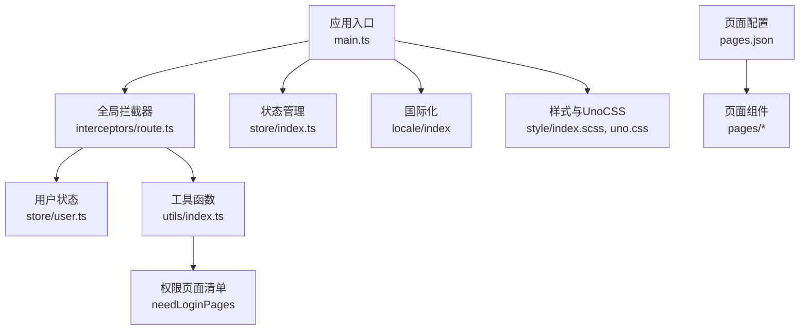
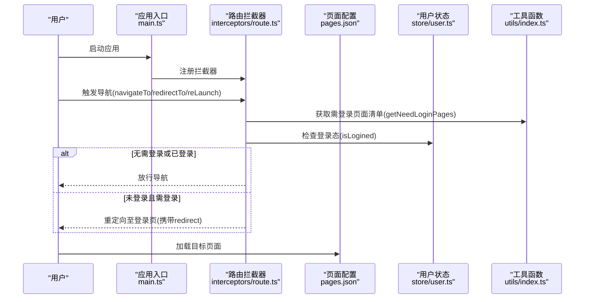
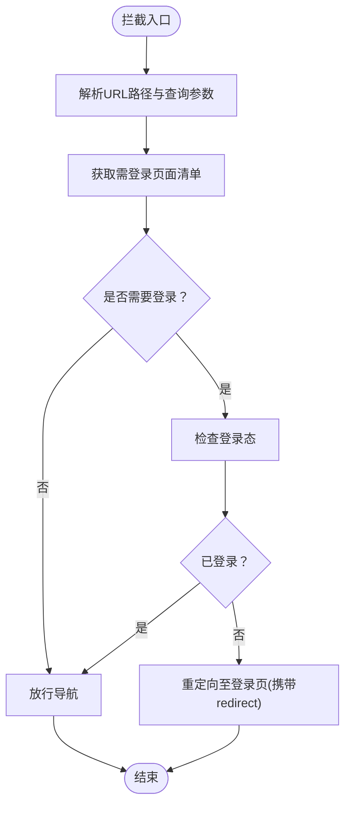
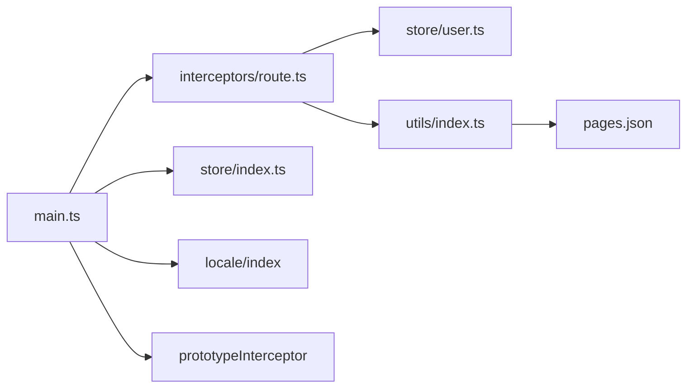

# 路由与导航系统

<cite>
**本文档引用的文件**
- [pages.json](file://client/uniapp/src/pages.json)
- [main.ts](file://client/uniapp/src/main.ts)
- [App.vue](file://client/uniapp/src/App.vue)
- [route.ts](file://client/uniapp/src/interceptors/route.ts)
- [index.ts（拦截器导出）](file://client/uniapp/src/interceptors/index.ts)
- [user.ts](file://client/uniapp/src/store/user.ts)
- [global.ts](file://client/uniapp/src/store/global.ts)
- [index.ts（Pinia存储）](file://client/uniapp/src/store/index.ts)
- [utils/index.ts](file://client/uniapp/src/utils/index.ts)
- [utils/user.ts](file://client/uniapp/src/utils/user.ts)
</cite>

## 目录
1. [简介](#简介)
2. [项目结构](#项目结构)
3. [核心组件](#核心组件)
4. [架构总览](#架构总览)
5. [详细组件分析](#详细组件分析)
6. [依赖关系分析](#依赖关系分析)
7. [性能考虑](#性能考虑)
8. [故障排除指南](#故障排除指南)
9. [结论](#结论)
10. [附录](#附录)

## 简介
本文件面向Hoper UniApp路由与导航系统，围绕pages.json页面配置、路由拦截与权限控制、页面生命周期管理、导航动画与参数传递等主题进行系统性技术说明。文档基于仓库现有代码实现，重点解释以下方面：
- pages.json的页面配置、页面层级结构与tabBar配置
- 路由拦截器的实现方式、权限验证与页面跳转控制
- 路由参数传递、页面生命周期管理与导航动画效果
- 路由守卫配置、动态路由与嵌套路由的最佳实践
- 常见路由问题与性能优化策略

## 项目结构
Hoper UniApp前端位于client/uniapp/src目录，路由与导航相关的核心文件如下：
- 应用入口与全局安装：main.ts、App.vue
- 页面配置：pages.json
- 路由拦截与权限控制：interceptors/route.ts、interceptors/index.ts
- 状态管理：store/user.ts、store/global.ts、store/index.ts
- 工具函数：utils/index.ts、utils/user.ts

图表来源
- [main.ts:11-21](file://client/uniapp/src/main.ts#L11-L21)
- [route.ts:47-53](file://client/uniapp/src/interceptors/route.ts#L47-L53)
- [pages.json:1-140](file://client/uniapp/src/pages.json#L1-L140)

章节来源
- [main.ts:1-22](file://client/uniapp/src/main.ts#L1-L22)
- [pages.json:1-140](file://client/uniapp/src/pages.json#L1-L140)

## 核心组件
- 应用入口与全局安装
  - 在应用启动时注册Pinia、i18n、路由拦截器与原型插件，确保全局可用性与拦截生效。
- 路由拦截器
  - 通过拦截navigateTo、redirectTo、reLaunch等路由API，实现“黑名单”式登录拦截，未登录访问需登录页面的路由将被重定向并携带redirect参数。
- 页面配置
  - pages.json集中定义页面路径、样式、分包与tabBar，支持在页面级配置中间件（如auth），用于路由拦截。
- 状态管理
  - 用户状态store负责认证态、token与用户缓存；全局store维护平台信息等。
- 工具函数
  - 提供获取tabbar页、解析URL、生成需登录页面清单等功能。

章节来源
- [main.ts:11-21](file://client/uniapp/src/main.ts#L11-L21)
- [route.ts:21-45](file://client/uniapp/src/interceptors/route.ts#L21-L45)
- [pages.json:17-106](file://client/uniapp/src/pages.json#L17-L106)
- [user.ts:1-86](file://client/uniapp/src/store/user.ts#L1-L86)
- [utils/index.ts:67-107](file://client/uniapp/src/utils/index.ts#L67-L107)

## 架构总览
下图展示从用户触发导航到页面渲染与拦截校验的整体流程：

图表来源
- [main.ts:15](file://client/uniapp/src/main.ts#L15)
- [route.ts:23-44](file://client/uniapp/src/interceptors/route.ts#L23-L44)
- [utils/index.ts:67-107](file://client/uniapp/src/utils/index.ts#L67-L107)
- [user.ts:13-16](file://client/uniapp/src/store/user.ts#L13-L16)

## 详细组件分析

### 页面配置与层级结构（pages.json）
- 全局样式与组件自动扫描
  - navigationStyle、navigationBarTitleText、backgroundColor等全局导航样式配置。
  - easycom自动扫描与自定义组件映射，简化组件引入。
- 页面列表与中间件
  - pages数组定义各页面路径与样式；部分页面配置middlewares字段，用于路由拦截。
- 分包与tabBar
  - subPackages支持分包；tabBar定义底部导航项及图标路径、文本与对应页面路径。
- 页面层级与导航
  - 页面层级由pages.json决定，navigateTo/redirectTo/reLaunch等API均基于此配置进行拦截与校验。

章节来源
- [pages.json:1-140](file://client/uniapp/src/pages.json#L1-L140)

### 路由拦截器与权限控制
- 拦截范围
  - 对navigateTo、redirectTo、reLaunch进行统一拦截，确保导航安全。
- 黑名单策略
  - 通过getNeedLoginPages或needLoginPages常量判断目标页面是否需要登录；未登录则重定向至登录页，并携带redirect参数以便登录后回跳。
- 登录态检查
  - 通过useUserStore读取auth状态，判断是否已登录。
- 开发与生产差异
  - 开发环境每次动态获取需登录页面清单，便于调试；生产环境使用预构建常量，减少重复计算。

图表来源
- [route.ts:23-44](file://client/uniapp/src/interceptors/route.ts#L23-L44)
- [utils/index.ts:67-107](file://client/uniapp/src/utils/index.ts#L67-L107)
- [user.ts:13-16](file://client/uniapp/src/store/user.ts#L13-L16)

章节来源
- [route.ts:1-54](file://client/uniapp/src/interceptors/route.ts#L1-L54)
- [utils/index.ts:67-107](file://client/uniapp/src/utils/index.ts#L67-L107)
- [user.ts:13-16](file://client/uniapp/src/store/user.ts#L13-L16)

### 页面生命周期与导航动画
- 应用生命周期
  - App.vue中定义onLaunch、onShow、onHide等生命周期钩子，用于应用启动、显示与隐藏时的初始化与日志记录。
- 页面生命周期
  - 页面组件可使用uni-app标准生命周期（如onLoad、onShow等），结合路由拦截与状态管理实现页面级逻辑。
- 导航动画
  - pages.json中未显式配置导航动画参数，若需自定义可在具体页面style中按需扩展（例如通过平台特定配置或运行时切换）。

章节来源
- [App.vue:1-62](file://client/uniapp/src/App.vue#L1-L62)
- [pages.json:22-104](file://client/uniapp/src/pages.json#L22-L104)

### 路由参数传递与URL解析
- 参数传递
  - 通过redirect参数在登录页与目标页之间传递URL，登录成功后根据redirect进行回跳。
- URL解析
  - 工具函数提供currRoute与getUrlObj，解析fullPath与查询参数，兼容H5与小程序多端差异。

章节来源
- [route.ts:41](file://client/uniapp/src/interceptors/route.ts#L41)
- [utils/index.ts:23-61](file://client/uniapp/src/utils/index.ts#L23-L61)

### 状态管理与用户认证
- 用户状态store
  - 维护auth、token与用户缓存；提供登录、注册、获取认证信息等动作；登录成功后更新token并设置HTTP默认请求头。
- 全局store
  - 维护平台信息等全局状态，便于跨页面共享。

章节来源
- [user.ts:1-86](file://client/uniapp/src/store/user.ts#L1-L86)
- [global.ts:1-28](file://client/uniapp/src/store/global.ts#L1-L28)
- [index.ts（Pinia存储）:1-13](file://client/uniapp/src/store/index.ts#L1-L13)

### 工具函数与页面清单
- tabbar判断
  - 基于getCurrentPages与tabBar配置判断当前页是否为tabbar页。
- 页面清单生成
  - getAllPages按需过滤页面（默认按needLogin键），支持主包与分包合并；提供字符串数组形式的needLoginPages与常量形式的needLoginPages。

章节来源
- [utils/index.ts:3-16](file://client/uniapp/src/utils/index.ts#L3-L16)
- [utils/index.ts:67-107](file://client/uniapp/src/utils/index.ts#L67-L107)

## 依赖关系分析
- 组件耦合
  - 路由拦截器依赖用户状态store与工具函数；工具函数依赖pages.json的结构；应用入口统一注册拦截器与插件。
- 外部依赖
  - 使用@hopeio/utils插件、wot-design-uni与z-paging等第三方UI组件库；Pinia持久化插件用于本地存储。

图表来源
- [main.ts:11-21](file://client/uniapp/src/main.ts#L11-L21)
- [route.ts:7-8](file://client/uniapp/src/interceptors/route.ts#L7-L8)
- [utils/index.ts:1](file://client/uniapp/src/utils/index.ts#L1)
- [pages.json:1-140](file://client/uniapp/src/pages.json#L1-L140)

章节来源
- [main.ts:11-21](file://client/uniapp/src/main.ts#L11-L21)
- [route.ts:7-8](file://client/uniapp/src/interceptors/route.ts#L7-L8)
- [utils/index.ts:1](file://client/uniapp/src/utils/index.ts#L1)

## 性能考虑
- 拦截器性能
  - 生产环境使用needLoginPages常量避免重复计算；开发环境动态获取便于调试。
- 状态持久化
  - Pinia持久化插件使用uni的同步存储接口，减少异步开销与内存占用。
- 组件懒加载与分包
  - 通过subPackages拆分页面，降低首屏包体与初次渲染压力。
- 导航动画
  - 默认不配置动画参数，避免不必要的过渡开销；如需自定义可在页面style中按需开启。

章节来源
- [route.ts:28-32](file://client/uniapp/src/interceptors/route.ts#L28-L32)
- [index.ts（Pinia存储）:4-12](file://client/uniapp/src/store/index.ts#L4-L12)
- [pages.json:107](file://client/uniapp/src/pages.json#L107)

## 故障排除指南
- 登录后无法回跳
  - 检查redirect参数是否正确传递与解码；确认登录成功后的回跳逻辑。
- 拦截器未生效
  - 确认已在main.ts中注册routeInterceptor；检查拦截器安装方法是否调用。
- 页面未加入需登录清单
  - 若页面需要登录保护，请在pages.json中添加middlewares或在工具函数中完善needLoginPages。
- 登录态异常
  - 检查用户store的auth状态与token存储；确认登录成功后是否正确设置HTTP请求头。

章节来源
- [route.ts:41](file://client/uniapp/src/interceptors/route.ts#L41)
- [main.ts:15](file://client/uniapp/src/main.ts#L15)
- [utils/index.ts:101-107](file://client/uniapp/src/utils/index.ts#L101-L107)
- [user.ts:38-54](file://client/uniapp/src/store/user.ts#L38-L54)

## 结论
Hoper UniApp路由与导航系统采用集中式页面配置与拦截器机制，结合状态管理与工具函数，实现了灵活的权限控制与页面跳转管理。通过黑名单策略与分包配置，系统在保证安全性的同时兼顾性能与可维护性。建议在后续迭代中进一步完善路由守卫、动态路由与嵌套路由的配置示例，并持续优化拦截器与状态持久化的性能表现。

## 附录
- 最佳实践
  - 路由守卫：在页面级配置middlewares或在拦截器中扩展更细粒度的守卫逻辑。
  - 动态路由：结合pages.json的动态生成能力与工具函数，实现按需加载与权限过滤。
  - 嵌套路由：利用subPackages与tabBar配置，合理划分页面层级与导航结构。
  - 参数传递：统一使用redirect参数进行回跳，配合URL解析工具函数确保多端兼容。
  - 性能优化：生产环境使用常量清单、启用分包、减少拦截器内重复计算。