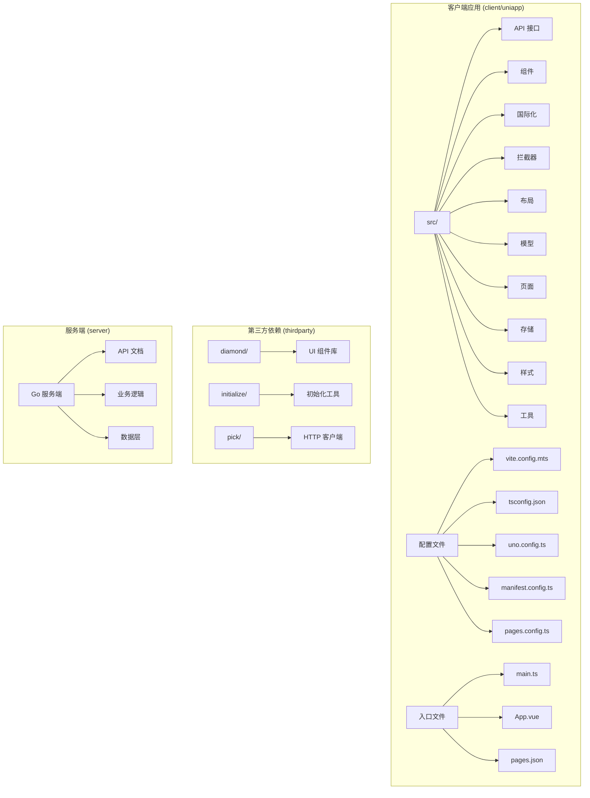
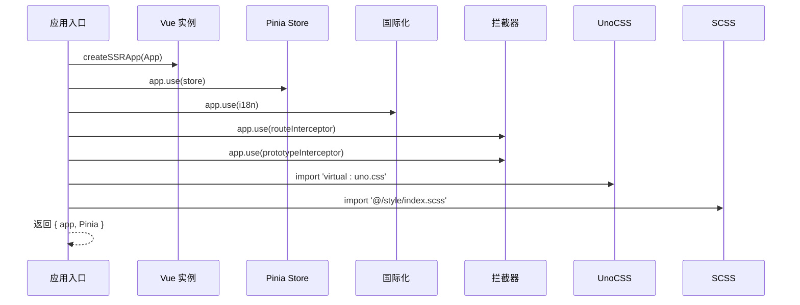
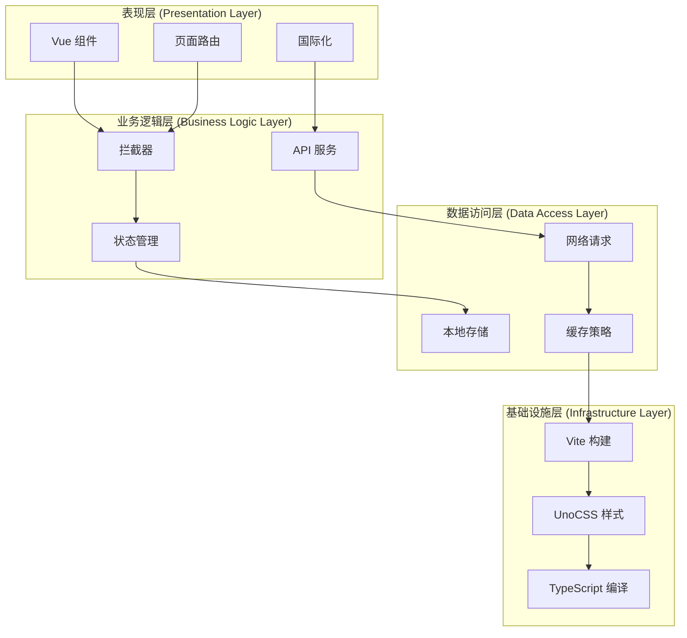
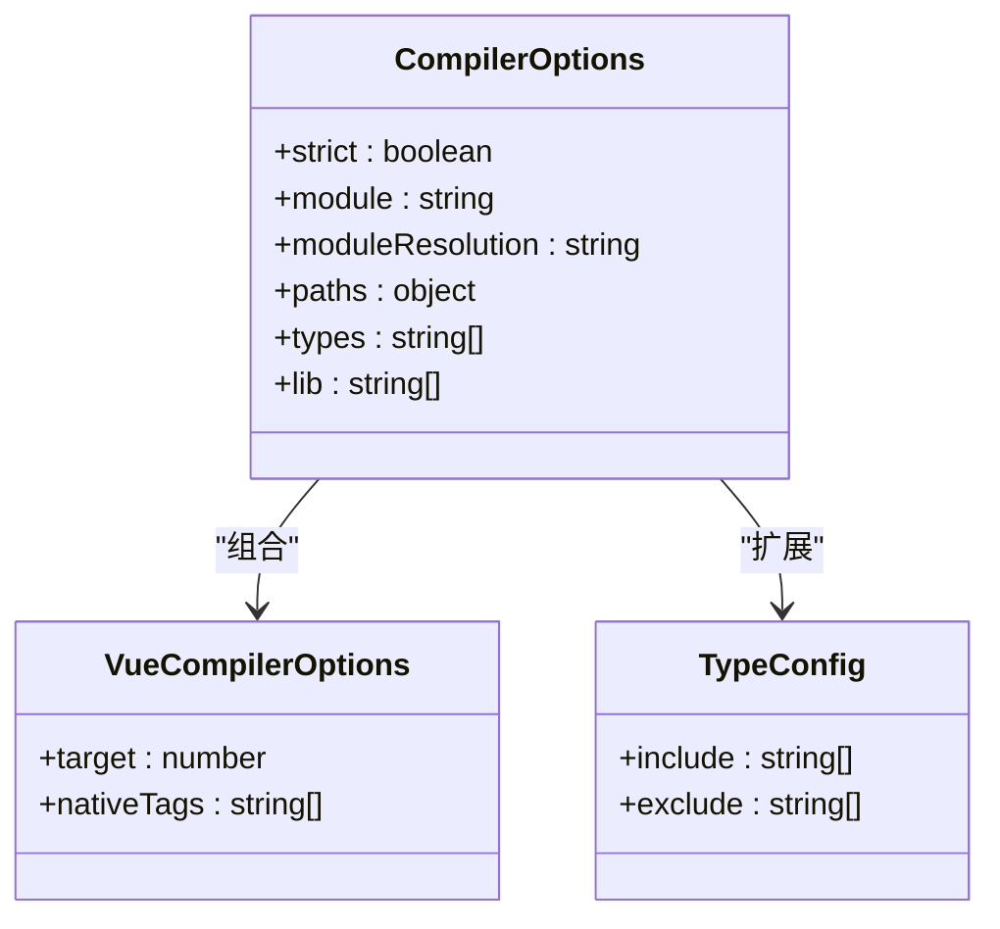
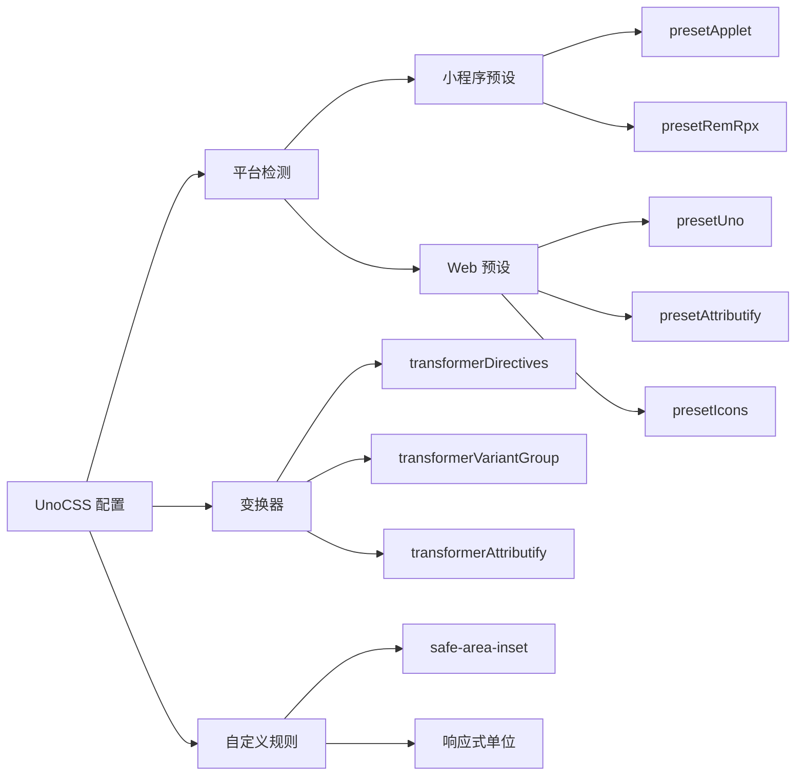
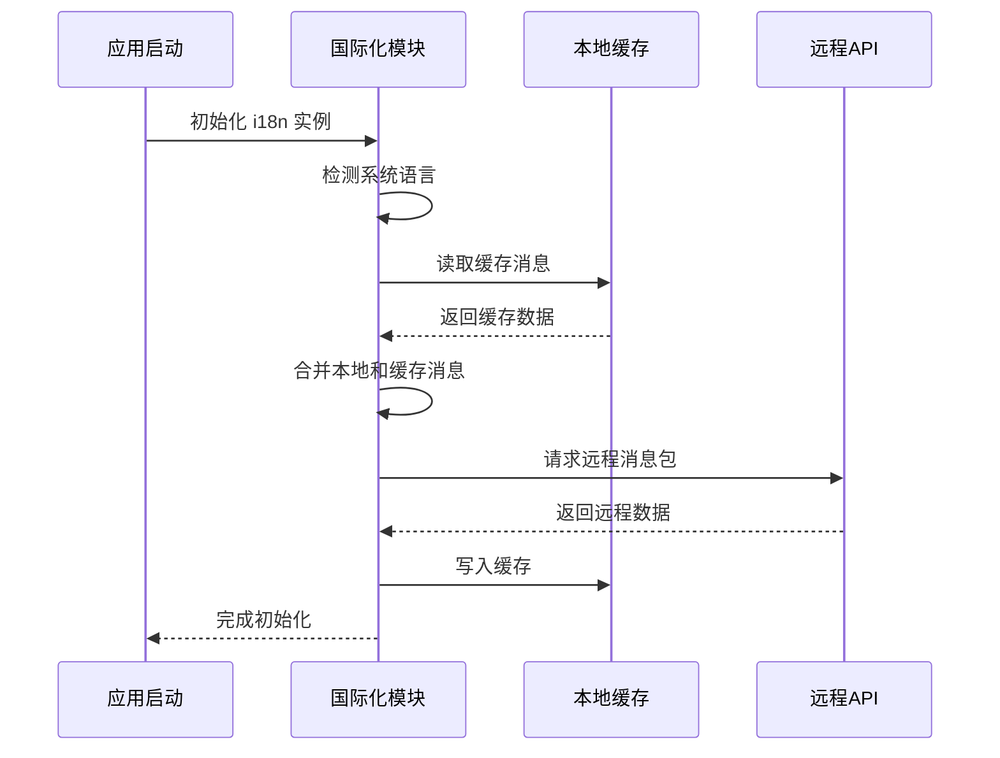
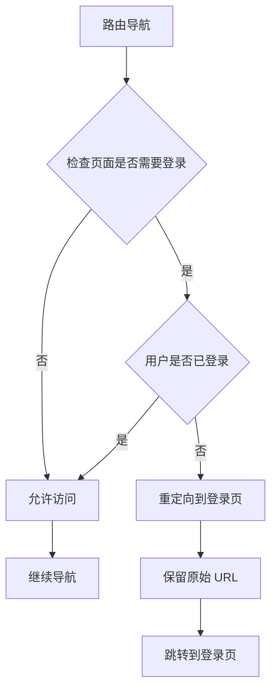
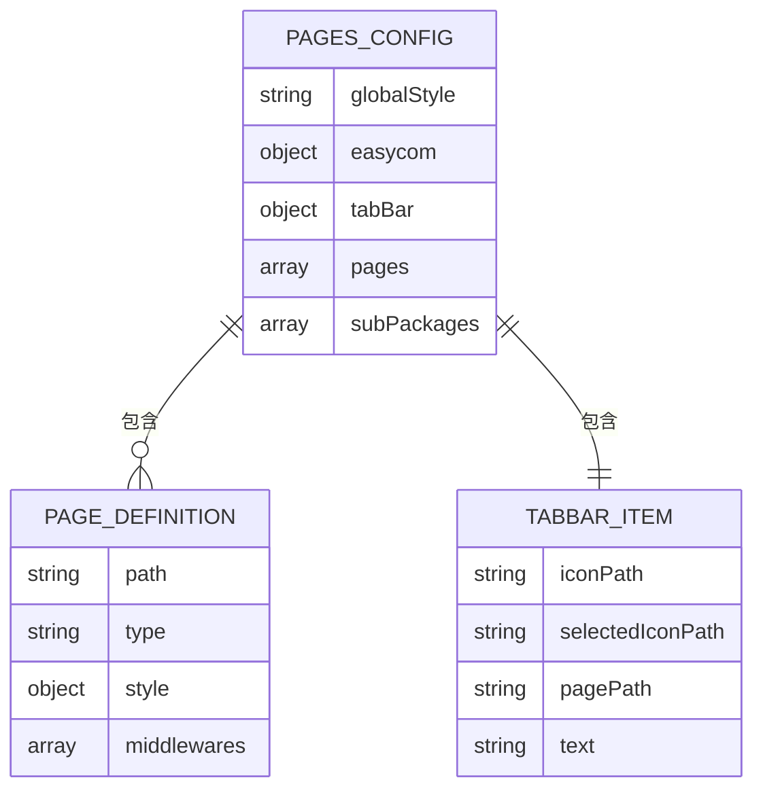
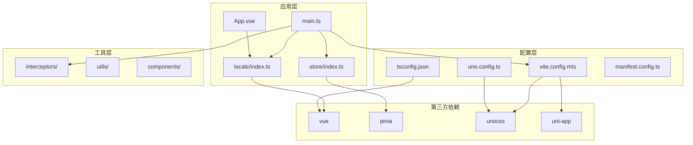

# 项目初始化与配置

<cite>
**本文档引用的文件**
- [main.ts](file://client/uniapp/src/main.ts)
- [package.json](file://client/uniapp/package.json)
- [vite.config.mts](file://client/uniapp/vite.config.mts)
- [tsconfig.json](file://client/uniapp/tsconfig.json)
- [uno.config.ts](file://client/uniapp/uno.config.ts)
- [App.vue](file://client/uniapp/src/App.vue)
- [store/index.ts](file://client/uniapp/src/store/index.ts)
- [locale/index.ts](file://client/uniapp/src/locale/index.ts)
- [interceptors/index.ts](file://client/uniapp/src/interceptors/index.ts)
- [interceptors/route.ts](file://client/uniapp/src/interceptors/route.ts)
- [pages.config.ts](file://client/uniapp/pages.config.ts)
- [src/pages.json](file://client/uniapp/src/pages.json)
- [src/style/index.scss](file://client/uniapp/src/style/index.scss)
- [manifest.config.ts](file://client/uniapp/manifest.config.ts)
</cite>

## 目录
1. [简介](#简介)
2. [项目结构](#项目结构)
3. [核心组件](#核心组件)
4. [架构概览](#架构概览)
5. [详细组件分析](#详细组件分析)
6. [依赖分析](#依赖分析)
7. [性能考虑](#性能考虑)
8. [故障排除指南](#故障排除指南)
9. [结论](#结论)
10. [附录](#附录)

## 简介

Hoper UniApp 项目是一个基于 Vue 3 和 TypeScript 的跨平台应用，支持 H5、小程序和原生 App 多端部署。该项目采用现代化的开发工具链，集成了 Vite 构建系统、UnoCSS 原子化样式系统、Pinia 状态管理以及完整的 TypeScript 类型支持。

## 项目结构

项目采用模块化的组织方式，主要分为以下几个核心目录：



**图表来源**
- [main.ts:1-22](file://client/uniapp/src/main.ts#L1-L22)
- [package.json:1-174](file://client/uniapp/package.json#L1-L174)

**章节来源**
- [main.ts:1-22](file://client/uniapp/src/main.ts#L1-L22)
- [package.json:1-174](file://client/uniapp/package.json#L1-L174)

## 核心组件

### Vue 应用入口配置

应用入口文件负责创建 Vue 实例并注册所有必要的插件和服务：



**图表来源**
- [main.ts:11-21](file://client/uniapp/src/main.ts#L11-L21)

### 依赖管理系统

项目使用 pnpm 作为包管理器，支持工作区模式和链接依赖：

| 依赖类型 | 版本范围 | 主要用途 |
|---------|---------|----------|
| Vue 生态 | ^3.5.8 | 核心框架和响应式系统 |
| UniApp 生态 | 3.0.0-5000720260410001 | 跨平台应用开发 |
| 状态管理 | 3.0.4 | 全局状态管理 |
| UI 组件库 | ^1.5.12 | 基础 UI 组件 |
| 工具库 | ^0.0.6 | 通用工具函数 |

**章节来源**
- [package.json:77-104](file://client/uniapp/package.json#L77-L104)
- [package.json:105-163](file://client/uniapp/package.json#L105-L163)

## 架构概览

项目采用分层架构设计，各层职责明确：



**图表来源**
- [main.ts:1-22](file://client/uniapp/src/main.ts#L1-L22)
- [vite.config.mts:26-53](file://client/uniapp/vite.config.mts#L26-L53)

## 详细组件分析

### Vite 构建配置

Vite 配置文件提供了完整的构建和开发环境支持：

```mermaid
flowchart TD
A[Vite 配置入口] --> B[插件加载]
B --> C[环境变量处理]
B --> D[路径别名配置]
B --> E[开发服务器配置]
B --> F[构建优化配置]
C --> C1[UNI_PLATFORM 检测]
C --> C2[环境变量目录]
C --> C3[代理配置]
D --> D1[@ 别名指向 src]
D --> D2[@gen 别名指向 gen]
E --> E1[HMR 热更新]
E --> E2[端口配置]
E --> E3[代理规则]
F --> F1[Terser 压缩]
F --> F2[Source Map]
F --> F3[构建分析]
```

**图表来源**
- [vite.config.mts:26-155](file://client/uniapp/vite.config.mts#L26-L155)

#### 关键配置特性

1. **多平台支持**: 通过 `UNI_PLATFORM` 环境变量区分 H5、小程序和 App 平台
2. **智能代理**: 支持条件代理配置，仅在 H5 环境启用
3. **构建优化**: 生产环境自动移除 console 日志，支持 Source Map 调试
4. **插件生态**: 集成 UniHelper 生态系统的完整插件链

**章节来源**
- [vite.config.mts:26-155](file://client/uniapp/vite.config.mts#L26-L155)

### TypeScript 配置

TypeScript 配置确保了完整的类型安全和开发体验：



**图表来源**
- [tsconfig.json:2-32](file://client/uniapp/tsconfig.json#L2-L32)

#### 类型系统特性

1. **严格模式**: 启用严格类型检查，提高代码质量
2. **路径映射**: 支持 `@/*` 和 `@gen/*` 路径别名
3. **Vue 支持**: 针对 Vue 3 的编译选项优化
4. **第三方类型**: 集成 UniApp 和小程序类型定义

**章节来源**
- [tsconfig.json:1-54](file://client/uniapp/tsconfig.json#L1-L54)

### UnoCSS 原子化样式系统

UnoCSS 提供了高效的原子化样式解决方案：



**图表来源**
- [uno.config.ts:17-80](file://client/uniapp/uno.config.ts#L17-L80)

#### 样式系统特性

1. **平台适配**: 自动根据平台切换预设，小程序使用 `presetApplet`
2. **响应式设计**: 支持 rpx 和 rem 单位转换
3. **图标系统**: 集成 Iconify 图标库，支持丰富的图标资源
4. **自定义规则**: 支持安全区域和特殊样式需求

**章节来源**
- [uno.config.ts:1-94](file://client/uniapp/uno.config.ts#L1-L94)

### 国际化系统

国际化系统提供了完整的多语言支持：



**图表来源**
- [locale/index.ts:45-57](file://client/uniapp/src/locale/index.ts#L45-L57)

#### 国际化特性

1. **动态同步**: 启动时自动同步本地和远程消息包
2. **缓存机制**: 使用本地存储缓存翻译内容
3. **格式化支持**: 提供字符串和对象格式化功能
4. **运行时切换**: 支持运行时语言切换

**章节来源**
- [locale/index.ts:1-116](file://client/uniapp/src/locale/index.ts#L1-L116)

### 路由拦截系统

路由拦截系统实现了灵活的权限控制：



**图表来源**
- [interceptors/route.ts:20-45](file://client/uniapp/src/interceptors/route.ts#L20-L45)

#### 拦截器特性

1. **黑名单机制**: 默认允许访问，仅拦截需要登录的页面
2. **动态配置**: 支持从页面配置中动态获取需要登录的页面列表
3. **参数保留**: 登录成功后自动跳转回原页面
4. **多端兼容**: 支持 navigateTo、redirectTo、reLaunch 等多种导航方式

**章节来源**
- [interceptors/route.ts:1-54](file://client/uniapp/src/interceptors/route.ts#L1-L54)

### 页面配置系统

页面配置系统提供了灵活的页面管理和路由定义：



**图表来源**
- [pages.config.ts:3-50](file://client/uniapp/pages.config.ts#L3-L50)
- [src/pages.json:1-140](file://client/uniapp/src/pages.json#L1-L140)

**章节来源**
- [pages.config.ts:1-51](file://client/uniapp/pages.config.ts#L1-L51)
- [src/pages.json:1-140](file://client/uniapp/src/pages.json#L1-L140)

## 依赖分析

项目依赖关系展示了各个模块之间的耦合程度：



**图表来源**
- [main.ts:1-22](file://client/uniapp/src/main.ts#L1-L22)
- [package.json:77-163](file://client/uniapp/package.json#L77-L163)

### 依赖管理策略

1. **版本锁定**: 使用精确版本号确保构建一致性
2. **工作区模式**: 支持多包开发和依赖共享
3. **链接依赖**: 支持本地开发时的依赖链接
4. **覆盖机制**: 通过 overrides 解决依赖冲突

**章节来源**
- [package.json:164-174](file://client/uniapp/package.json#L164-L174)

## 性能考虑

### 构建优化

项目采用了多项性能优化措施：

1. **Tree Shaking**: 通过 ES 模块系统实现无用代码消除
2. **代码分割**: 自动进行代码分割，减少首屏加载时间
3. **压缩优化**: 生产环境自动移除 console 和 debugger 语句
4. **缓存策略**: 利用浏览器缓存和 CDN 加速静态资源

### 运行时优化

1. **懒加载**: 组件和页面支持懒加载机制
2. **虚拟滚动**: 大列表使用虚拟滚动提升性能
3. **防抖节流**: 高频事件使用防抖节流优化
4. **内存管理**: 合理的生命周期管理和内存释放

## 故障排除指南

### 常见问题及解决方案

#### 构建问题

**问题**: Vite 构建失败或热更新异常
**解决方案**: 
1. 清理缓存: `pnpm run clear:cache`
2. 重新安装依赖: `pnpm install`
3. 检查环境变量配置

**章节来源**
- [package.json:61-61](file://client/uniapp/package.json#L61-L61)

#### 样式问题

**问题**: UnoCSS 样式不生效或冲突
**解决方案**:
1. 检查平台预设配置
2. 验证样式优先级
3. 使用 `!` 前缀强制覆盖

#### 国际化问题

**问题**: 语言切换不生效或消息丢失
**解决方案**:
1. 检查本地缓存状态
2. 验证 API 请求
3. 确认消息包格式

**章节来源**
- [locale/index.ts:45-57](file://client/uniapp/src/locale/index.ts#L45-L57)

## 结论

Hoper UniApp 项目展现了现代前端开发的最佳实践，通过合理的架构设计和工具配置，实现了高质量的跨平台应用开发。项目的主要优势包括：

1. **完整的工具链**: 从开发到构建的全链路自动化
2. **强大的类型系统**: TypeScript 提供完整的类型安全保障
3. **高效的样式系统**: UnoCSS 实现原子化样式的高性能
4. **灵活的配置**: 支持多平台和多环境的灵活配置
5. **良好的可维护性**: 清晰的模块划分和依赖管理

## 附录

### 开发环境搭建步骤

1. **环境要求**: Node.js >= 18, pnpm >= 9
2. **克隆项目**: `git clone <repository-url>`
3. **安装依赖**: `pnpm install`
4. **启动开发**: `pnpm dev:h5`
5. **构建生产**: `pnpm build:h5`

### IDE 配置建议

1. **VS Code 插件**: Vue Language Features, TypeScript Importer
2. **格式化工具**: Prettier + ESLint + Stylelint
3. **TypeScript**: 启用严格模式和路径映射
4. **Git 配置**: 配置 lint-staged 和 commitlint

### 脚本命令参考

| 命令 | 用途 | 平台 |
|------|------|------|
| `pnpm dev:h5` | H5 开发模式 | H5 |
| `pnpm dev:mp-weixin` | 微信小程序开发 | 小程序 |
| `pnpm build:h5` | H5 生产构建 | H5 |
| `pnpm build:mp-weixin` | 微信小程序构建 | 小程序 |
| `pnpm type-check` | TypeScript 类型检查 | 全平台 |