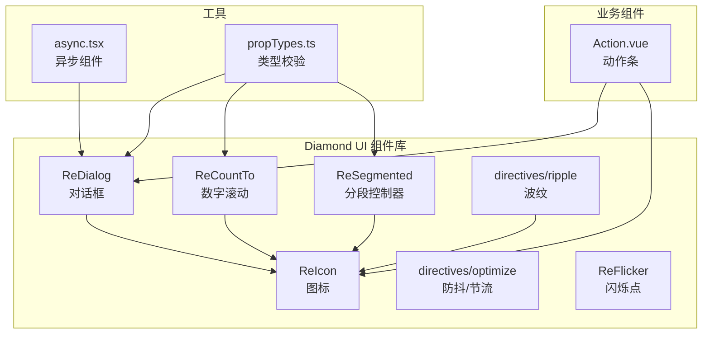
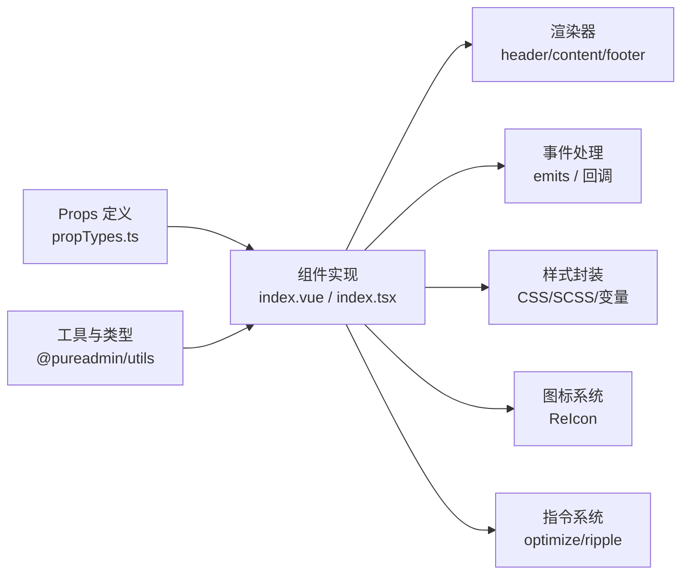
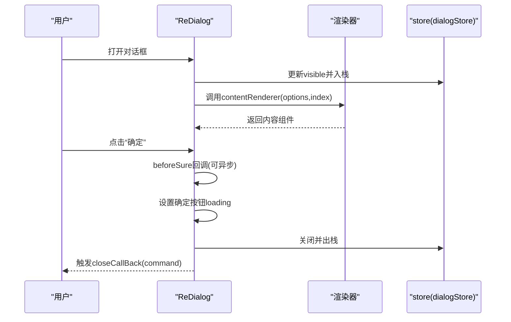
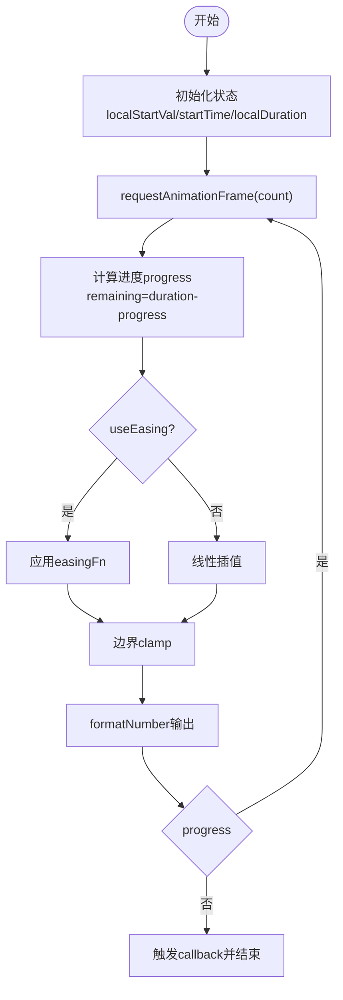
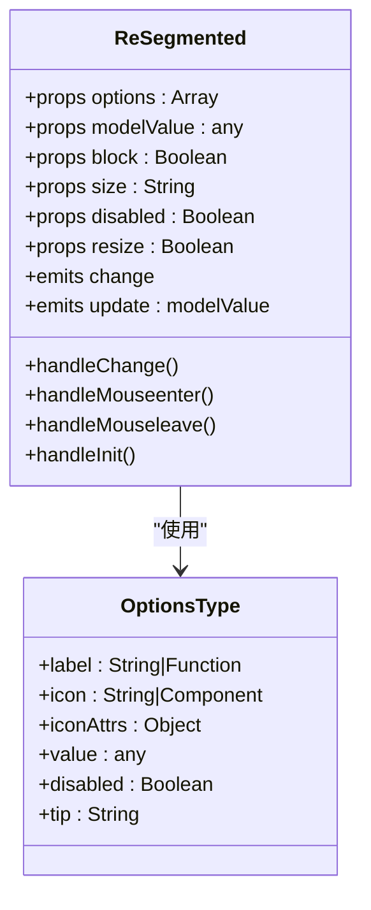
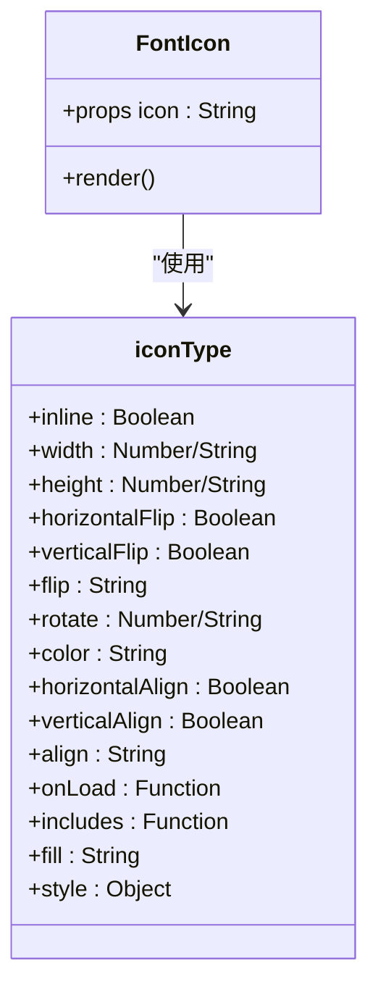
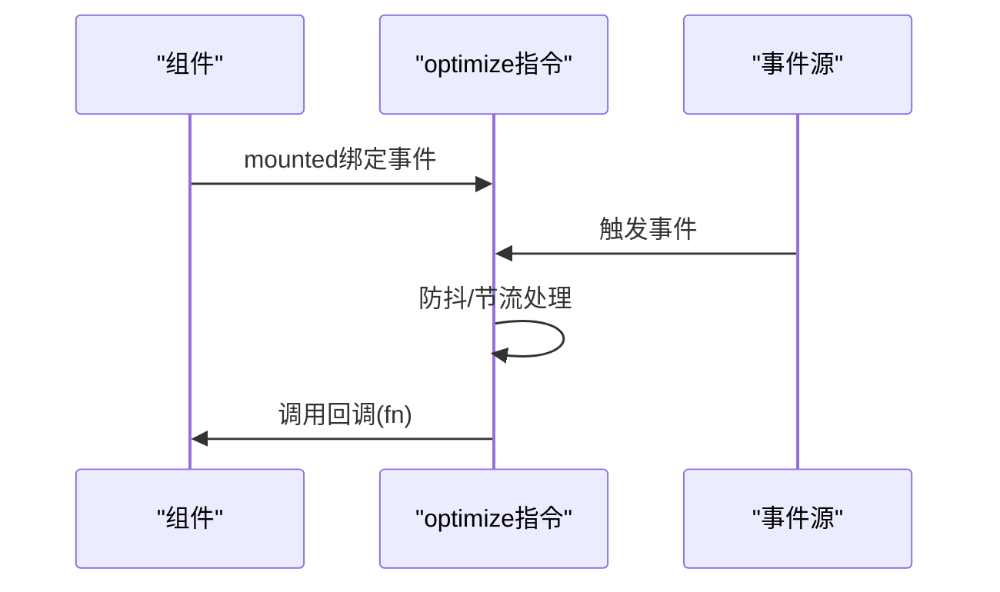
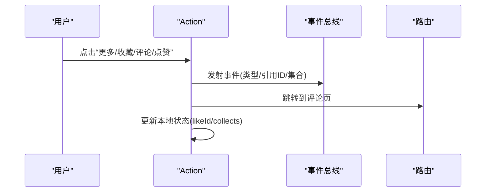
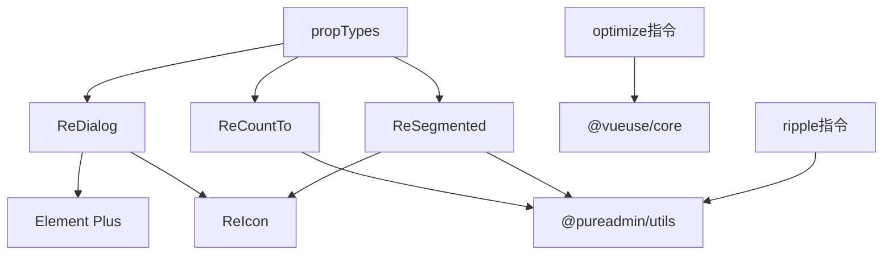

# UI组件开发

<cite>
**本文档引用的文件**
- [thirdparty/diamond/src/vue/ReDialog/index.vue](file://thirdparty/diamond/src/vue/ReDialog/index.vue)
- [thirdparty/diamond/src/vue/ReDialog/type.ts](file://thirdparty/diamond/src/vue/ReDialog/type.ts)
- [thirdparty/diamond/src/vue/ReCountTo/src/normal/index.tsx](file://thirdparty/diamond/src/vue/ReCountTo/src/normal/index.tsx)
- [thirdparty/diamond/src/vue/ReCountTo/src/normal/props.ts](file://thirdparty/diamond/src/vue/ReCountTo/src/normal/props.ts)
- [thirdparty/diamond/src/vue/ReCountTo/src/rebound/rebound.css](file://thirdparty/diamond/src/vue/ReCountTo/src/rebound/rebound.css)
- [thirdparty/diamond/src/vue/ReSegmented/src/index.tsx](file://thirdparty/diamond/src/vue/ReSegmented/src/index.tsx)
- [thirdparty/diamond/src/vue/ReSegmented/src/type.ts](file://thirdparty/diamond/src/vue/ReSegmented/src/type.ts)
- [thirdparty/diamond/src/vue/ReIcon/src/iconfont.ts](file://thirdparty/diamond/src/vue/ReIcon/src/iconfont.ts)
- [thirdparty/diamond/src/vue/ReIcon/src/offlineIcon.ts](file://thirdparty/diamond/src/vue/ReIcon/src/offlineIcon.ts)
- [thirdparty/diamond/src/vue/ReIcon/src/types.ts](file://thirdparty/diamond/src/vue/ReIcon/src/types.ts)
- [thirdparty/diamond/src/vue/directives/optimize/index.ts](file://thirdparty/diamond/src/vue/directives/optimize/index.ts)
- [thirdparty/diamond/src/vue/directives/ripple/index.ts](file://thirdparty/diamond/src/vue/directives/ripple/index.ts)
- [thirdparty/diamond/src/vue/directives/ripple/index.scss](file://thirdparty/diamond/src/vue/directives/ripple/index.scss)
- [thirdparty/diamond/src/vue/ReFlicker/index.css](file://thirdparty/diamond/src/vue/ReFlicker/index.css)
- [thirdparty/diamond/src/vue/vue/propTypes.ts](file://thirdparty/diamond/src/vue/vue/propTypes.ts)
- [thirdparty/diamond/src/utils/types/directives.d.ts](file://thirdparty/diamond/src/utils/types/directives.d.ts)
- [client/web/src/components/action/Action.vue](file://client/web/src/components/action/Action.vue)
- [client/web/src/utils/async.tsx](file://client/web/src/utils/async.tsx)
</cite>

## 目录
1. [简介](#简介)
2. [项目结构](#项目结构)
3. [核心组件](#核心组件)
4. [架构总览](#架构总览)
5. [组件详解](#组件详解)
6. [依赖关系分析](#依赖关系分析)
7. [性能考量](#性能考量)
8. [故障排查指南](#故障排查指南)
9. [结论](#结论)
10. [附录](#附录)

## 简介
本文件面向Hoper Vue3 UI组件开发，系统梳理组件设计模式、Props定义与事件处理机制；阐述可复用性设计、插槽与作用域插槽应用；说明样式封装、主题定制与响应式布局；给出业务组件开发、第三方组件集成与组件测试策略；并总结开发规范、性能优化与用户体验优化最佳实践。

## 项目结构
本仓库包含多端前端工程与统一的Vue3 UI能力沉淀。与UI组件直接相关的关键目录与文件包括：
- thirdparty/diamond/src/vue：统一的Vue3组件库，涵盖对话框、计数动画、分段控制器、图标、指令与消息等模块
- client/web/src/components：业务组件示例（如Action）
- client/web/src/utils：工具与异步组件封装

**图表来源**
- [thirdparty/diamond/src/vue/ReDialog/index.vue:1-207](file://thirdparty/diamond/src/vue/ReDialog/index.vue#L1-L207)
- [thirdparty/diamond/src/vue/ReCountTo/src/normal/index.tsx:1-180](file://thirdparty/diamond/src/vue/ReCountTo/src/normal/index.tsx#L1-L180)
- [thirdparty/diamond/src/vue/ReSegmented/src/index.tsx:1-217](file://thirdparty/diamond/src/vue/ReSegmented/src/index.tsx#L1-L217)
- [thirdparty/diamond/src/vue/ReIcon/src/iconfont.ts:1-49](file://thirdparty/diamond/src/vue/ReIcon/src/iconfont.ts#L1-L49)
- [thirdparty/diamond/src/vue/directives/optimize/index.ts:1-69](file://thirdparty/diamond/src/vue/directives/optimize/index.ts#L1-L69)
- [thirdparty/diamond/src/vue/directives/ripple/index.ts:1-230](file://thirdparty/diamond/src/vue/directives/ripple/index.ts#L1-L230)
- [thirdparty/diamond/src/vue/ReFlicker/index.css:1-40](file://thirdparty/diamond/src/vue/ReFlicker/index.css#L1-L40)
- [client/web/src/components/action/Action.vue:1-91](file://client/web/src/components/action/Action.vue#L1-L91)
- [client/web/src/utils/async.tsx:1-69](file://client/web/src/utils/async.tsx#L1-L69)
- [thirdparty/diamond/src/vue/vue/propTypes.ts:1-40](file://thirdparty/diamond/src/vue/vue/propTypes.ts#L1-L40)

**章节来源**
- [thirdparty/diamond/src/vue/ReDialog/index.vue:1-207](file://thirdparty/diamond/src/vue/ReDialog/index.vue#L1-L207)
- [thirdparty/diamond/src/vue/ReCountTo/src/normal/index.tsx:1-180](file://thirdparty/diamond/src/vue/ReCountTo/src/normal/index.tsx#L1-L180)
- [thirdparty/diamond/src/vue/ReSegmented/src/index.tsx:1-217](file://thirdparty/diamond/src/vue/ReSegmented/src/index.tsx#L1-L217)
- [thirdparty/diamond/src/vue/ReIcon/src/iconfont.ts:1-49](file://thirdparty/diamond/src/vue/ReIcon/src/iconfont.ts#L1-L49)
- [thirdparty/diamond/src/vue/directives/optimize/index.ts:1-69](file://thirdparty/diamond/src/vue/directives/optimize/index.ts#L1-L69)
- [thirdparty/diamond/src/vue/directives/ripple/index.ts:1-230](file://thirdparty/diamond/src/vue/directives/ripple/index.ts#L1-L230)
- [thirdparty/diamond/src/vue/ReFlicker/index.css:1-40](file://thirdparty/diamond/src/vue/ReFlicker/index.css#L1-L40)
- [client/web/src/components/action/Action.vue:1-91](file://client/web/src/components/action/Action.vue#L1-L91)
- [client/web/src/utils/async.tsx:1-69](file://client/web/src/utils/async.tsx#L1-L69)
- [thirdparty/diamond/src/vue/vue/propTypes.ts:1-40](file://thirdparty/diamond/src/vue/vue/propTypes.ts#L1-L40)

## 核心组件
- 对话框组件 ReDialog：通过渲染器与事件钩子实现高扩展性，支持头部、内容、底部渲染器与多种回调事件
- 数字滚动组件 ReCountTo：基于requestAnimationFrame的高性能数值动画，支持自定义缓动函数与格式化
- 分段控制器 ReSegmented：支持图标、提示、禁用与响应式布局，具备暗色适配
- 图标组件 ReIcon：统一封装iconfont、svg与在线离线Iconify图标
- 指令集：optimize（防抖/节流）、ripple（波纹）、copy、longpress、loading等
- 业务组件 Action：聚合点赞、收藏、评论、更多等交互，演示事件总线与路由跳转

**章节来源**
- [thirdparty/diamond/src/vue/ReDialog/index.vue:1-207](file://thirdparty/diamond/src/vue/ReDialog/index.vue#L1-L207)
- [thirdparty/diamond/src/vue/ReDialog/type.ts:1-276](file://thirdparty/diamond/src/vue/ReDialog/type.ts#L1-L276)
- [thirdparty/diamond/src/vue/ReCountTo/src/normal/index.tsx:1-180](file://thirdparty/diamond/src/vue/ReCountTo/src/normal/index.tsx#L1-L180)
- [thirdparty/diamond/src/vue/ReCountTo/src/normal/props.ts:1-33](file://thirdparty/diamond/src/vue/ReCountTo/src/normal/props.ts#L1-L33)
- [thirdparty/diamond/src/vue/ReSegmented/src/index.tsx:1-217](file://thirdparty/diamond/src/vue/ReSegmented/src/index.tsx#L1-L217)
- [thirdparty/diamond/src/vue/ReSegmented/src/type.ts:1-21](file://thirdparty/diamond/src/vue/ReSegmented/src/type.ts#L1-L21)
- [thirdparty/diamond/src/vue/ReIcon/src/iconfont.ts:1-49](file://thirdparty/diamond/src/vue/ReIcon/src/iconfont.ts#L1-L49)
- [thirdparty/diamond/src/vue/directives/optimize/index.ts:1-69](file://thirdparty/diamond/src/vue/directives/optimize/index.ts#L1-L69)
- [thirdparty/diamond/src/vue/directives/ripple/index.ts:1-230](file://thirdparty/diamond/src/vue/directives/ripple/index.ts#L1-L230)
- [client/web/src/components/action/Action.vue:1-91](file://client/web/src/components/action/Action.vue#L1-L91)

## 架构总览
Diamond UI 采用“组件 + 渲染器 + 指令 + 类型校验”的分层架构：
- 组件层：以组合式API与TSX/JSX实现，强调Props与事件解耦
- 渲染器层：通过headerRenderer/contentRenderer/footerRenderer实现内容与布局的完全可插拔
- 指令层：以轻量指令扩展交互体验（防抖节流、波纹、复制等）
- 类型层：统一的propTypes与类型声明，保障Props校验与IDE智能提示

**图表来源**
- [thirdparty/diamond/src/vue/vue/propTypes.ts:1-40](file://thirdparty/diamond/src/vue/vue/propTypes.ts#L1-L40)
- [thirdparty/diamond/src/vue/ReDialog/index.vue:1-207](file://thirdparty/diamond/src/vue/ReDialog/index.vue#L1-L207)
- [thirdparty/diamond/src/vue/ReSegmented/src/index.tsx:1-217](file://thirdparty/diamond/src/vue/ReSegmented/src/index.tsx#L1-L217)
- [thirdparty/diamond/src/vue/directives/optimize/index.ts:1-69](file://thirdparty/diamond/src/vue/directives/optimize/index.ts#L1-L69)
- [thirdparty/diamond/src/vue/directives/ripple/index.ts:1-230](file://thirdparty/diamond/src/vue/directives/ripple/index.ts#L1-L230)

## 组件详解

### 对话框组件 ReDialog
- 设计要点
  - 使用渲染器实现头部、内容、底部的完全可插拔，支持自定义组件注入
  - 通过dialogStore驱动多个实例，配合事件钩子（open/close/openAutoFocus/closeAutoFocus/fullscreenCallBack）实现生命周期管理
  - 支持全屏切换、确认前回调、取消前回调、确定按钮loading状态映射
- Props与事件
  - Props继承Element Plus Dialog属性，并扩展props、headerRenderer、contentRenderer、footerRenderer、footerButtons、sureBtnLoading、popconfirm等
  - 事件包括open、close、closeCallBack、fullscreenCallBack、openAutoFocus、closeAutoFocus、beforeCancel、beforeSure
- 插槽与作用域插槽
  - 使用具名插槽#header与#footer承载渲染器输出
  - 通过渲染器函数参数传递上下文（如close、titleId、titleClass），实现作用域插槽语义
- 样式与主题
  - 通过类名与Tailwind类组合实现主题一致性
  - 全屏图标与切换逻辑内聚在组件内部，减少外部耦合

**图表来源**
- [thirdparty/diamond/src/vue/ReDialog/index.vue:1-207](file://thirdparty/diamond/src/vue/ReDialog/index.vue#L1-L207)
- [thirdparty/diamond/src/vue/ReDialog/type.ts:1-276](file://thirdparty/diamond/src/vue/ReDialog/type.ts#L1-L276)

**章节来源**
- [thirdparty/diamond/src/vue/ReDialog/index.vue:1-207](file://thirdparty/diamond/src/vue/ReDialog/index.vue#L1-L207)
- [thirdparty/diamond/src/vue/ReDialog/type.ts:1-276](file://thirdparty/diamond/src/vue/ReDialog/type.ts#L1-L276)

### 数字滚动组件 ReCountTo
- 设计要点
  - 基于requestAnimationFrame实现流畅动画，支持倒计与正向计数
  - 支持自定义缓动函数、小数位、千分符、前后缀、颜色与字号
  - 提供autoplay、pause/resume/reset控制与mounted/callback事件
- Props与事件
  - Props定义：startVal、endVal、duration、autoplay、decimals、color、fontSize、decimal、separator、prefix、suffix、useEasing、easingFn
  - 事件：mounted、callback
- 性能与复杂度
  - 动画主循环O(1)/帧，watch监听O(n)初始化，整体复杂度与动画时长成正比

**图表来源**
- [thirdparty/diamond/src/vue/ReCountTo/src/normal/index.tsx:1-180](file://thirdparty/diamond/src/vue/ReCountTo/src/normal/index.tsx#L1-L180)
- [thirdparty/diamond/src/vue/ReCountTo/src/normal/props.ts:1-33](file://thirdparty/diamond/src/vue/ReCountTo/src/normal/props.ts#L1-L33)

**章节来源**
- [thirdparty/diamond/src/vue/ReCountTo/src/normal/index.tsx:1-180](file://thirdparty/diamond/src/vue/ReCountTo/src/normal/index.tsx#L1-L180)
- [thirdparty/diamond/src/vue/ReCountTo/src/normal/props.ts:1-33](file://thirdparty/diamond/src/vue/ReCountTo/src/normal/props.ts#L1-L33)
- [thirdparty/diamond/src/vue/ReCountTo/src/rebound/rebound.css:1-78](file://thirdparty/diamond/src/vue/ReCountTo/src/rebound/rebound.css#L1-L78)

### 分段控制器 ReSegmented
- 设计要点
  - 支持选项label/icon/disabled/tip/value，动态计算选中项宽高与位移，实现滑块跟随
  - 支持block、size、resize、disabled等属性，结合useResizeObserver实现自适应
  - 暗色模式下自动调整选中态与悬停态颜色
- Props与事件
  - Props：options、modelValue、block、size、disabled、resize
  - 事件：change、update:modelValue
- 插槽与作用域插槽
  - 通过render函数生成选项，label支持字符串或函数式组件，实现作用域插槽语义

**图表来源**
- [thirdparty/diamond/src/vue/ReSegmented/src/index.tsx:1-217](file://thirdparty/diamond/src/vue/ReSegmented/src/index.tsx#L1-L217)
- [thirdparty/diamond/src/vue/ReSegmented/src/type.ts:1-21](file://thirdparty/diamond/src/vue/ReSegmented/src/type.ts#L1-L21)

**章节来源**
- [thirdparty/diamond/src/vue/ReSegmented/src/index.tsx:1-217](file://thirdparty/diamond/src/vue/ReSegmented/src/index.tsx#L1-L217)
- [thirdparty/diamond/src/vue/ReSegmented/src/type.ts:1-21](file://thirdparty/diamond/src/vue/ReSegmented/src/type.ts#L1-L21)

### 图标组件 ReIcon
- 设计要点
  - 统一封装iconfont（unicode/font-class/symbol）、svg use与Iconify离线图标
  - 通过iconType接口扩展尺寸、翻转、旋转、align、fill等属性
  - offlineIcon集中注册本地菜单图标，避免首屏加载阻塞
- 可复用性
  - useRenderIcon钩子与图标类型统一，便于在其他组件中复用

**图表来源**
- [thirdparty/diamond/src/vue/ReIcon/src/iconfont.ts:1-49](file://thirdparty/diamond/src/vue/ReIcon/src/iconfont.ts#L1-L49)
- [thirdparty/diamond/src/vue/ReIcon/src/types.ts:1-21](file://thirdparty/diamond/src/vue/ReIcon/src/types.ts#L1-L21)
- [thirdparty/diamond/src/vue/ReIcon/src/offlineIcon.ts:1-15](file://thirdparty/diamond/src/vue/ReIcon/src/offlineIcon.ts#L1-L15)

**章节来源**
- [thirdparty/diamond/src/vue/ReIcon/src/iconfont.ts:1-49](file://thirdparty/diamond/src/vue/ReIcon/src/iconfont.ts#L1-L49)
- [thirdparty/diamond/src/vue/ReIcon/src/types.ts:1-21](file://thirdparty/diamond/src/vue/ReIcon/src/types.ts#L1-L21)
- [thirdparty/diamond/src/vue/ReIcon/src/offlineIcon.ts:1-15](file://thirdparty/diamond/src/vue/ReIcon/src/offlineIcon.ts#L1-L15)

### 指令系统
- optimize（防抖/节流）
  - 通过useEventListener在挂载时绑定事件，支持参数数组/对象与立即执行
  - 校验事件名与回调函数类型，确保运行期安全
- ripple（波纹）
  - 基于Pointer事件计算点击位置与半径，动态创建与清理波纹元素
  - 支持center/circle修饰符与自定义颜色class

**图表来源**
- [thirdparty/diamond/src/vue/directives/optimize/index.ts:1-69](file://thirdparty/diamond/src/vue/directives/optimize/index.ts#L1-L69)

**章节来源**
- [thirdparty/diamond/src/vue/directives/optimize/index.ts:1-69](file://thirdparty/diamond/src/vue/directives/optimize/index.ts#L1-L69)
- [thirdparty/diamond/src/vue/directives/ripple/index.ts:1-230](file://thirdparty/diamond/src/vue/directives/ripple/index.ts#L1-L230)
- [thirdparty/diamond/src/vue/directives/ripple/index.scss:1-230](file://thirdparty/diamond/src/vue/directives/ripple/index.scss#L1-L230)
- [thirdparty/diamond/src/utils/types/directives.d.ts:1-23](file://thirdparty/diamond/src/utils/types/directives.d.ts#L1-L23)

### 业务组件 Action
- 设计要点
  - 使用事件总线（emitter）与路由跳转（jump）解耦交互
  - 通过响应式对象更新本地状态，避免重复请求
- 可复用性
  - 将点赞/收藏/评论/更多等动作抽象为单一组件，便于在多页面复用

**图表来源**
- [client/web/src/components/action/Action.vue:1-91](file://client/web/src/components/action/Action.vue#L1-L91)

**章节来源**
- [client/web/src/components/action/Action.vue:1-91](file://client/web/src/components/action/Action.vue#L1-L91)

### 异步组件与高级模式
- 异步组件封装
  - 通过defineAsyncComponent与Suspense实现懒加载与占位
  - 支持动态resolve组件与事件透传
- 高级模式
  - 通过defineComponent与render函数实现更灵活的渲染控制

**章节来源**
- [client/web/src/utils/async.tsx:1-69](file://client/web/src/utils/async.tsx#L1-L69)

## 依赖关系分析
- 组件间依赖
  - ReDialog依赖Element Plus Dialog与ReIcon；通过渲染器注入任意子组件
  - ReCountTo与ReSegmented均依赖ReIcon与@pureadmin/utils（类型校验、工具函数）
  - 指令依赖@vueuse/core与@pureadmin/utils
- 外部依赖
  - Element Plus、Iconify、VueUse等生态库
- 类型与校验
  - propTypes.ts提供统一的Props校验类型，配合TS类型声明增强IDE体验

**图表来源**
- [thirdparty/diamond/src/vue/ReDialog/index.vue:1-207](file://thirdparty/diamond/src/vue/ReDialog/index.vue#L1-L207)
- [thirdparty/diamond/src/vue/ReCountTo/src/normal/index.tsx:1-180](file://thirdparty/diamond/src/vue/ReCountTo/src/normal/index.tsx#L1-L180)
- [thirdparty/diamond/src/vue/ReSegmented/src/index.tsx:1-217](file://thirdparty/diamond/src/vue/ReSegmented/src/index.tsx#L1-L217)
- [thirdparty/diamond/src/vue/directives/optimize/index.ts:1-69](file://thirdparty/diamond/src/vue/directives/optimize/index.ts#L1-L69)
- [thirdparty/diamond/src/vue/directives/ripple/index.ts:1-230](file://thirdparty/diamond/src/vue/directives/ripple/index.ts#L1-L230)
- [thirdparty/diamond/src/vue/vue/propTypes.ts:1-40](file://thirdparty/diamond/src/vue/vue/propTypes.ts#L1-L40)

**章节来源**
- [thirdparty/diamond/src/vue/vue/propTypes.ts:1-40](file://thirdparty/diamond/src/vue/vue/propTypes.ts#L1-L40)
- [thirdparty/diamond/src/utils/types/directives.d.ts:1-23](file://thirdparty/diamond/src/utils/types/directives.d.ts#L1-L23)

## 性能考量
- 动画与渲染
  - ReCountTo使用requestAnimationFrame，避免主线程阻塞；建议合理设置duration与decimals
  - ReSegmented使用useResizeObserver与nextTick，仅在必要时重排，减少重绘
- 事件优化
  - optimize指令提供debounce/throttle，建议根据场景选择合适阈值
  - ripple指令在pointer事件中计算与清理，避免多余DOM操作
- 组件懒加载
  - 异步组件与Suspense提升首屏性能，建议对大组件或非关键路径组件启用

[本节为通用指导，无需特定文件来源]

## 故障排查指南
- Props校验失败
  - 检查propTypes定义与实际传入类型是否一致；优先使用统一的propTypes进行校验
- 渲染器未生效
  - 确认renderer函数返回VNode或Component；检查key与v-bind传参
- 事件未触发
  - 确认组件是否正确emit事件；检查父组件是否正确接收
- 指令异常
  - optimize：检查event与fn是否传入且为函数；params需为数组或对象
  - ripple：检查修饰符center/circle与class配置；确认容器position

**章节来源**
- [thirdparty/diamond/src/vue/vue/propTypes.ts:1-40](file://thirdparty/diamond/src/vue/vue/propTypes.ts#L1-L40)
- [thirdparty/diamond/src/vue/ReDialog/index.vue:1-207](file://thirdparty/diamond/src/vue/ReDialog/index.vue#L1-L207)
- [thirdparty/diamond/src/vue/directives/optimize/index.ts:1-69](file://thirdparty/diamond/src/vue/directives/optimize/index.ts#L1-L69)
- [thirdparty/diamond/src/vue/directives/ripple/index.ts:1-230](file://thirdparty/diamond/src/vue/directives/ripple/index.ts#L1-L230)

## 结论
本项目通过Diamond UI实现了高内聚、低耦合的Vue3组件体系：以渲染器为核心扩展点，以指令增强交互体验，以统一类型校验保障质量。业务组件与工具函数进一步提升了可复用性与开发效率。建议在后续迭代中持续完善测试策略与主题变量体系，以支撑更大规模的组件生态。

[本节为总结，无需特定文件来源]

## 附录
- 开发规范
  - Props命名与类型统一；事件命名遵循“onXxx”或“emitXxx”约定
  - 组件导出统一入口，避免循环依赖
- 测试策略
  - 单元测试：针对动画与指令逻辑（如easing、防抖/节流阈值）
  - 集成测试：渲染器注入与事件回调链路
  - 端到端测试：业务组件交互流程（如Action）
- 主题与响应式
  - 使用CSS变量与Tailwind类组合实现主题切换
  - 响应式布局通过block/size/resize等属性与媒体查询协同

[本节为通用指导，无需特定文件来源]