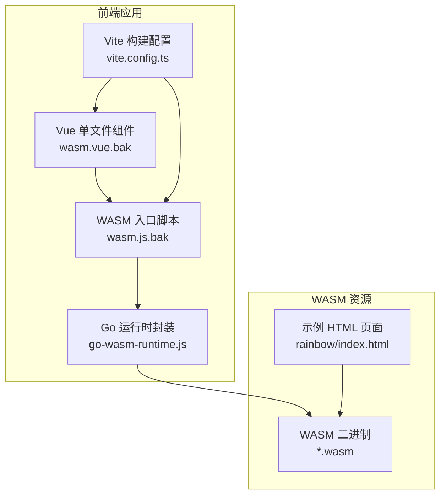
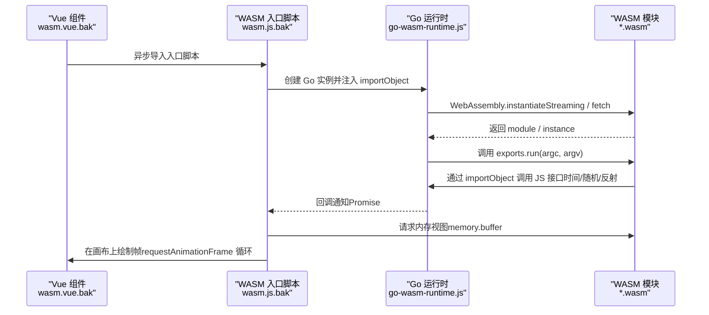
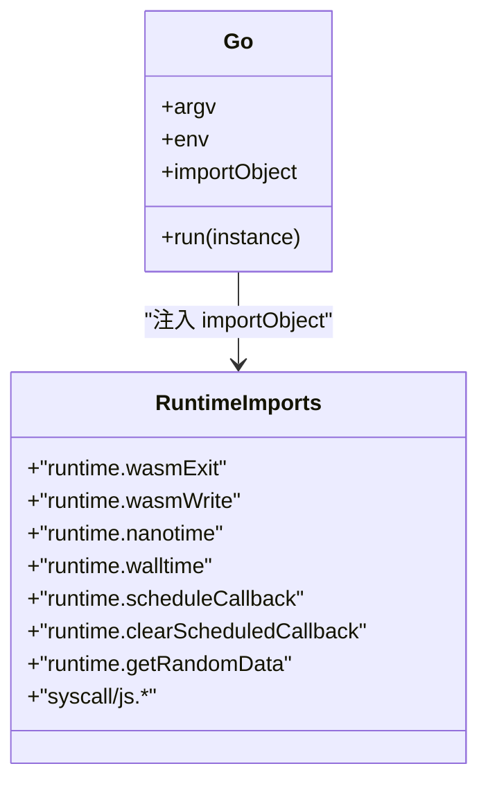
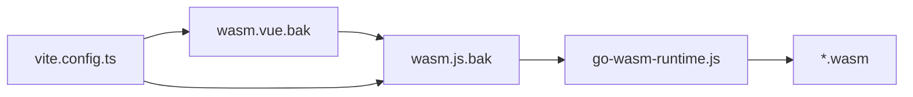

# WASM组件

<cite>
**本文引用的文件**
- [wasm.vue.bak](file://client/web/src/components/wasm/wasm.vue.bak)
- [wasm.js.bak](file://client/web/src/components/wasm/wasm.js.bak)
- [go-wasm-runtime.js](file://client/web/src/utils/service/go-wasm-runtime.js)
- [wasm.js（示例）](file://awesome/lang/go/custom/wasm/wasm.js)
- [Go WASM 示例（Rainbow）](file://awesome/lang/go/custom/wasm/rainbow/index.html)
- [Vite 配置](file://client/web/vite.config.ts)
- [CanvasKit WASM 文件列表](file://client/app/build/web/canvaskit/)
- [wasm.js（服务封装）](file://client/web/src/utils/service/wasm.js)
</cite>

## 目录
1. [简介](#简介)
2. [项目结构](#项目结构)
3. [核心组件](#核心组件)
4. [架构总览](#架构总览)
5. [组件详解](#组件详解)
6. [依赖关系分析](#依赖关系分析)
7. [性能考量](#性能考量)
8. [故障排查指南](#故障排查指南)
9. [结论](#结论)
10. [附录](#附录)

## 简介
本文件面向Hoper Vue3应用中的WASM组件，系统性阐述以下主题：
- WASM组件的集成方式与在前端的运行机制
- WebAssembly模块的加载、内存管理与线程安全要点
- WASM与JavaScript的互操作、数据转换与错误处理
- 编译配置、优化策略与浏览器兼容性
- 开发流程、调试技巧与性能监控最佳实践

## 项目结构
与Vue3 WASM组件直接相关的核心位置如下：
- 组件层：Vue单文件组件用于承载画布与异步加载WASM入口脚本
- 运行时层：Go提供的WASM运行时（Go Runtime）桥接JS与WASM
- 构建层：Vite配置控制目标环境、产物输出与依赖预优化
- 资源层：WASM二进制与示例HTML页面

图表来源
- [wasm.vue.bak:1-12](file://client/web/src/components/wasm/wasm.vue.bak#L1-L12)
- [wasm.js.bak:1-60](file://client/web/src/components/wasm/wasm.js.bak#L1-L60)
- [go-wasm-runtime.js:1-409](file://client/web/src/utils/service/go-wasm-runtime.js#L1-L409)
- [Vite 配置:1-69](file://client/web/vite.config.ts#L1-L69)
- [Go WASM 示例（Rainbow）:1-25](file://awesome/lang/go/custom/wasm/rainbow/index.html#L1-L25)

章节来源
- [wasm.vue.bak:1-12](file://client/web/src/components/wasm/wasm.vue.bak#L1-L12)
- [wasm.js.bak:1-60](file://client/web/src/components/wasm/wasm.js.bak#L1-L60)
- [go-wasm-runtime.js:1-409](file://client/web/src/utils/service/go-wasm-runtime.js#L1-L409)
- [Vite 配置:1-69](file://client/web/vite.config.ts#L1-L69)
- [Go WASM 示例（Rainbow）:1-25](file://awesome/lang/go/custom/wasm/rainbow/index.html#L1-L25)

## 核心组件
- Vue组件：负责挂载画布与按需加载WASM入口脚本，确保在DOM就绪后执行初始化
- WASM入口脚本：通过Go运行时封装加载WASM模块、初始化实例并驱动渲染循环
- Go运行时：提供JS与WASM之间的互操作接口（如时间、随机数、字符串、反射调用等），并管理线性内存访问
- 构建配置：定义浏览器兼容目标、产物命名与依赖优化策略

章节来源
- [wasm.vue.bak:1-12](file://client/web/src/components/wasm/wasm.vue.bak#L1-L12)
- [wasm.js.bak:1-60](file://client/web/src/components/wasm/wasm.js.bak#L1-L60)
- [go-wasm-runtime.js:51-381](file://client/web/src/utils/service/go-wasm-runtime.js#L51-L381)
- [Vite 配置:44-61](file://client/web/vite.config.ts#L44-L61)

## 架构总览
下图展示从Vue组件到WASM模块的完整调用链路与数据流。

图表来源
- [wasm.vue.bak:5-9](file://client/web/src/components/wasm/wasm.vue.bak#L5-L9)
- [wasm.js.bak:9-27](file://client/web/src/components/wasm/wasm.js.bak#L9-L27)
- [go-wasm-runtime.js:171-314](file://client/web/src/utils/service/go-wasm-runtime.js#L171-L314)
- [go-wasm-runtime.js:317-381](file://client/web/src/utils/service/go-wasm-runtime.js#L317-L381)

## 组件详解

### Vue组件（wasm.vue.bak）
- 功能：提供承载画布的容器，并在组件挂载后异步加载WASM入口脚本
- 注意：当前模板未绑定事件或状态，后续可扩展为通过props传入配置或回调

章节来源
- [wasm.vue.bak:1-12](file://client/web/src/components/wasm/wasm.vue.bak#L1-L12)

### WASM入口脚本（wasm.js.bak）
- 功能：初始化WASM运行时、加载模块、获取内存缓冲、驱动渲染循环
- 数据访问：通过实例内存缓冲读取网格状态，绘制规则网格与单元格
- 渲染：基于requestAnimationFrame周期性调用tick并重绘

章节来源
- [wasm.js.bak:1-60](file://client/web/src/components/wasm/wasm.js.bak#L1-L60)

### Go运行时（go-wasm-runtime.js）
- 作用：提供JS与WASM互操作的importObject，包括：
  - 时间与随机数：nanotime、walltime、getRandomData
  - 字符串与值：stringVal、valuePrepareString、valueLoadString、valueLength
  - 反射调用：valueGet、valueSet、valueIndex、valueSetIndex、valueCall、valueInvoke、valueNew、valueInstanceOf
  - 运行时控制：wasmExit、wasmWrite、scheduleCallback、clearScheduledCallback
- 内存管理：通过DataView访问线性内存；支持将JS值映射为WASM侧引用，避免重复分配
- 线程安全：运行时采用单线程模型，回调通过Promise触发，避免竞态；注意不要在WASM侧直接进行阻塞操作

图表来源
- [go-wasm-runtime.js:51-314](file://client/web/src/utils/service/go-wasm-runtime.js#L51-L314)

章节来源
- [go-wasm-runtime.js:51-381](file://client/web/src/utils/service/go-wasm-runtime.js#L51-L381)

### 示例与对比（Go WASM 示例、CanvasKit）
- 示例页面：通过标准wasm_exec加载WASM并初始化
- CanvasKit：提供多平台WASM产物（Canvaskit/Skia），便于高性能图形渲染

章节来源
- [Go WASM 示例（Rainbow）:1-25](file://awesome/lang/go/custom/wasm/rainbow/index.html#L1-L25)
- [CanvasKit WASM 文件列表:1-4](file://client/app/build/web/canvaskit/#L1-L4)

## 依赖关系分析
- 组件依赖：Vue组件依赖WASM入口脚本；入口脚本依赖Go运行时；运行时依赖WASM模块
- 构建依赖：Vite配置决定浏览器兼容目标与产物输出；optimizeDeps影响首次加载性能
- 资源依赖：WASM二进制由构建流程产出或由示例页面直接加载

图表来源
- [wasm.vue.bak:5-9](file://client/web/src/components/wasm/wasm.vue.bak#L5-L9)
- [wasm.js.bak:9-27](file://client/web/src/components/wasm/wasm.js.bak#L9-L27)
- [go-wasm-runtime.js:171-314](file://client/web/src/utils/service/go-wasm-runtime.js#L171-L314)
- [Vite 配置:44-61](file://client/web/vite.config.ts#L44-L61)

章节来源
- [wasm.vue.bak:1-12](file://client/web/src/components/wasm/wasm.vue.bak#L1-L12)
- [wasm.js.bak:1-60](file://client/web/src/components/wasm/wasm.js.bak#L1-L60)
- [go-wasm-runtime.js:1-409](file://client/web/src/utils/service/go-wasm-runtime.js#L1-L409)
- [Vite 配置:1-69](file://client/web/vite.config.ts#L1-L69)

## 性能考量
- 浏览器兼容性
  - 目标：ES2017（vite.config.ts中明确）
  - Polyfill：当浏览器不支持instantiateStreaming时，运行时提供polyfill逻辑
- 加载与初始化
  - 使用instantiateStreaming可减少中间数组缓冲开销；若不可用则回退至instantiate
  - 初始化阶段尽量避免大对象分配，优先复用内存视图
- 内存管理
  - 通过DataView访问线性内存，避免频繁拷贝；对字符串与值建立引用映射，减少重复存储
  - 注意：当前运行时注释提示值表未来可能引入GC，现阶段应避免泄漏
- 渲染与回调
  - 使用requestAnimationFrame驱动渲染循环，避免阻塞主线程
  - 回调通过Promise触发，确保异步执行，避免死锁
- 构建优化
  - 通过optimizeDeps排除不必要的依赖，缩短冷启动时间
  - 合理拆分chunk，结合CDN与压缩策略（见plugins配置）

章节来源
- [Vite 配置:44-61](file://client/web/vite.config.ts#L44-L61)
- [go-wasm-runtime.js:3-25](file://client/web/src/utils/service/go-wasm-runtime.js#L3-L25)
- [go-wasm-runtime.js:342-381](file://client/web/src/utils/service/go-wasm-runtime.js#L342-L381)
- [wasm.js（服务封装）:3-8](file://client/web/src/utils/service/wasm.js#L3-L8)

## 故障排查指南
- 模块加载失败
  - 现象：控制台打印“Error importing wasm.js”
  - 排查：确认wasm.js路径正确、服务器可访问；检查CORS与静态资源部署
- instantiateStreaming 不可用
  - 现象：部分旧浏览器或特定环境下无法使用streaming
  - 处理：运行时已内置polyfill，确保polyfill逻辑被加载
- 死锁或无回调
  - 现象：Go运行时在Node环境下提示“所有goroutine休眠且无JS回调待处理”
  - 处理：确保WASM侧存在回调调度（scheduleCallback）或避免无限等待
- 内存越界或类型不匹配
  - 现象：读取内存缓冲时报错或数据异常
  - 处理：核对偏移量、长度与数据类型；使用DataView访问前先校验边界
- 渲染卡顿
  - 现象：requestAnimationFrame导致掉帧
  - 处理：减少每帧绘制像素数量、合并绘制批次、使用离屏Canvas或WebGL

章节来源
- [wasm.vue.bak:6-8](file://client/web/src/components/wasm/wasm.vue.bak#L6-L8)
- [go-wasm-runtime.js:3-8](file://client/web/src/utils/service/go-wasm-runtime.js#L3-L8)
- [go-wasm-runtime.js:384-407](file://client/web/src/utils/service/go-wasm-runtime.js#L384-L407)

## 结论
Hoper Vue3 WASM组件通过Go运行时实现了稳定的JS/WASM互操作，具备良好的浏览器兼容性与可扩展性。建议在实际项目中：
- 明确WASM模块职责，保持入口脚本轻量化
- 严格遵循内存访问规范，避免越界与类型不匹配
- 使用回调与Promise解耦异步逻辑，避免阻塞主线程
- 结合Vite优化策略与CDN部署，提升首屏性能

## 附录

### 开发流程（建议）
- 编写WASM模块（Go/Rust等），导出必要的函数与内存指针
- 在Vue组件中挂载画布并按需加载入口脚本
- 在入口脚本中初始化Go运行时、加载WASM、获取内存视图并驱动渲染
- 通过Vite构建并部署，必要时接入CDN与缓存策略

### 调试技巧
- 在运行时注入debug接口，输出关键参数与状态
- 使用浏览器开发者工具断点观察内存视图变化
- 对比instantiateStreaming与instantiate两种加载路径的耗时差异

### 性能监控最佳实践
- 监控首屏加载时间（含WASM下载与初始化）
- 统计每帧渲染耗时，识别热点路径
- 关注内存占用峰值，避免长期运行下的内存泄漏