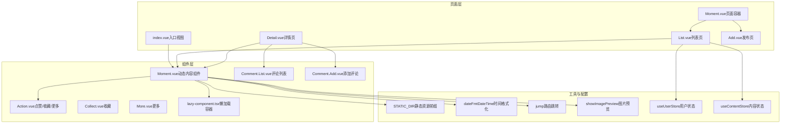
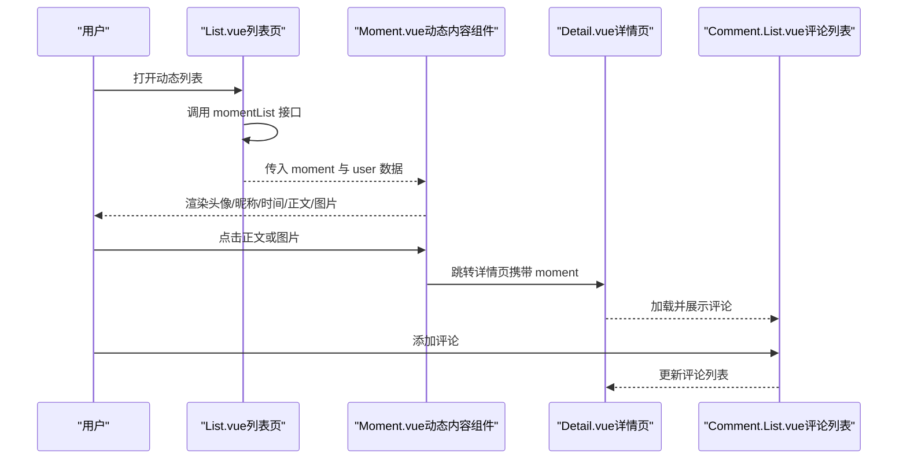
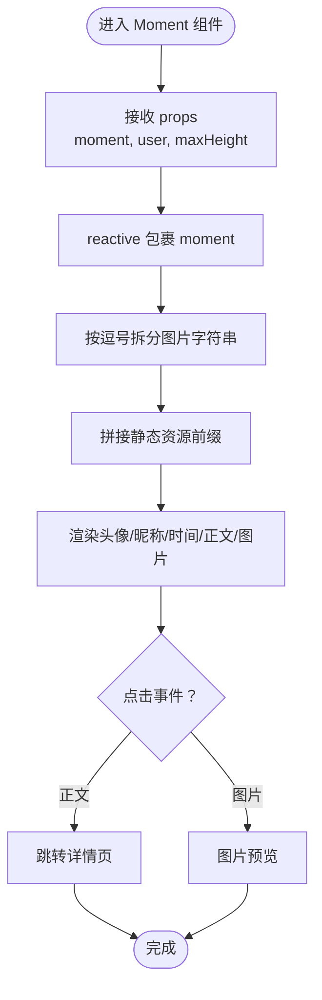
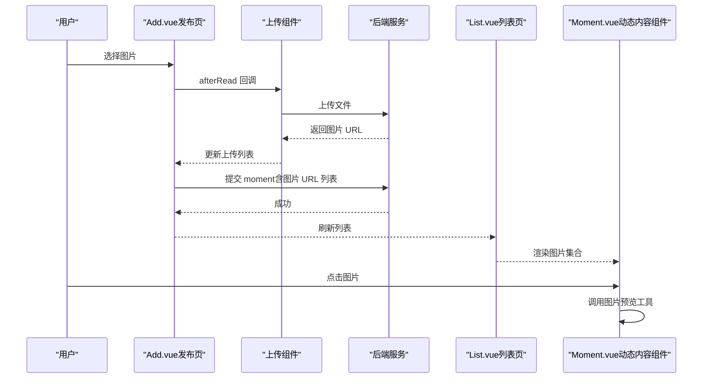
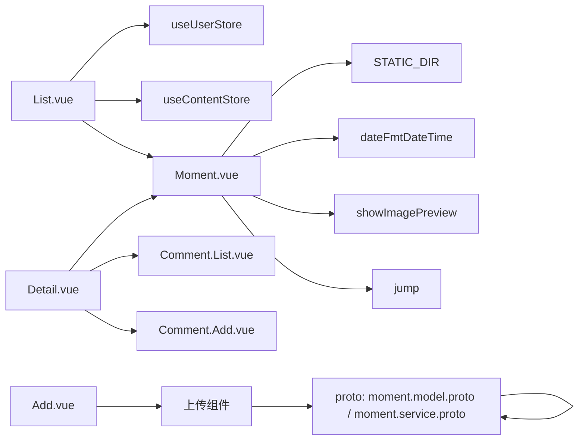

# 动态组件

<cite>
**本文档引用的文件**
- [Moment.vue（组件）](file://client/web/src/components/moment/Moment.vue)
- [Moment.vue（页面容器）](file://client/web/src/views/moment/Moment.vue)
- [Moment 列表页](file://client/web/src/views/moment/List.vue)
- [Moment 详情页](file://client/web/src/views/moment/Detail.vue)
- [Moment 发布页](file://client/web/src/views/moment/Add.vue)
- [index.vue（入口视图）](file://client/web/src/views/index.vue)
- [async.tsx（异步组件示例）](file://client/web/src/components/async.tsx)
- [Action 组件](file://client/web/src/components/action/Action.vue)
- [Collect 组件](file://client/web/src/components/action/Collect.vue)
- [More 组件](file://client/web/src/components/action/More.vue)
- [Comment 组件（列表）](file://client/web/src/components/comment/List.vue)
- [Comment 组件（添加）](file://client/web/src/components/comment/Add.vue)
- [懒加载组件 lazy-component](file://client/web/src/components/lazy-component.tsx)
- [Vant 图片预览工具 showImagePreview](file://client/web/src/utils/vant-image-preview.ts)
- [静态资源配置 STATIC_DIR](file://client/web/src/plugin/config.ts)
- [时间格式化工具 dateFmtDateTime](file://client/web/src/utils/time.ts)
- [路由跳转工具 jump](file://client/web/src/router/utils.ts)
- [Moment 服务 momentList](file://client/web/src/service/moment.ts)
- [用户状态管理 useUserStore](file://client/web/src/store/user.ts)
- [内容状态管理 useContentStore](file://client/web/src/store/content.ts)
- [Moment 原型定义（proto）](file://proto/content/moment.model.proto)
- [Moment 服务接口（proto）](file://proto/content/moment.service.proto)
</cite>

## 目录
1. [简介](#简介)
2. [项目结构](#项目结构)
3. [核心组件](#核心组件)
4. [架构总览](#架构总览)
5. [详细组件分析](#详细组件分析)
6. [依赖关系分析](#依赖关系分析)
7. [性能考量](#性能考量)
8. [故障排查指南](#故障排查指南)
9. [结论](#结论)
10. [附录](#附录)

## 简介
本文件围绕 Hoper 的 Vue3 动态组件体系，聚焦“Moment 动态内容组件”的设计与实现，系统阐述其数据绑定、生命周期管理、动态内容渲染、媒体资源处理（图片预览）、交互行为（点赞/收藏/更多操作、评论联动）、以及可扩展性与主题定制的实践建议。同时给出与后端服务、状态管理、UI 库等的集成关系，并提供性能优化与故障排查建议。

## 项目结构
动态组件主要分布在 Web 前端的 views 与 components 两个层次：
- 页面层：Moment 容器页、列表页、详情页、发布页
- 组件层：Moment 展示组件、Action 行为组件、Comment 评论组件、懒加载容器等
- 工具与配置：静态资源路径、时间格式化、路由跳转、图片预览工具、状态管理等

图表来源
- [index.vue（入口视图）:1-9](file://client/web/src/views/index.vue#L1-L9)
- [Moment.vue（页面容器）:1-49](file://client/web/src/views/moment/Moment.vue#L1-L49)
- [Moment.vue（组件）:1-130](file://client/web/src/components/moment/Moment.vue#L1-L130)
- [List.vue（列表页）:1-100](file://client/web/src/views/moment/List.vue#L1-L100)
- [Detail.vue（详情页）:1-53](file://client/web/src/views/moment/Detail.vue#L1-L53)
- [Add.vue（发布页）:1-87](file://client/web/src/views/moment/Add.vue#L1-L87)
- [lazy-component.tsx](file://client/web/src/components/lazy-component.tsx)
- [plugin/config.ts](file://client/web/src/plugin/config.ts)
- [utils/time.ts](file://client/web/src/utils/time.ts)
- [router/utils.ts](file://client/web/src/router/utils.ts)
- [utils/vant-image-preview.ts](file://client/web/src/utils/vant-image-preview.ts)
- [store/user.ts](file://client/web/src/store/user.ts)
- [store/content.ts](file://client/web/src/store/content.ts)

章节来源
- [index.vue（入口视图）:1-9](file://client/web/src/views/index.vue#L1-L9)
- [Moment.vue（页面容器）:1-49](file://client/web/src/views/moment/Moment.vue#L1-L49)
- [Moment.vue（组件）:1-130](file://client/web/src/components/moment/Moment.vue#L1-L130)
- [List.vue（列表页）:1-100](file://client/web/src/views/moment/List.vue#L1-L100)
- [Detail.vue（详情页）:1-53](file://client/web/src/views/moment/Detail.vue#L1-L53)
- [Add.vue（发布页）:1-87](file://client/web/src/views/moment/Add.vue#L1-L87)

## 核心组件
- Moment 动态内容组件：负责头像、昵称、发布时间、正文、图片集的渲染与交互；支持图片预览与详情跳转。
- Action/Collect/More：封装点赞、收藏、更多操作的 UI 与交互。
- Comment 列表与添加：在详情页联动展示与新增评论。
- 懒加载容器：对图片等资源进行延迟加载，降低首屏压力。
- 页面容器：列表页、详情页、发布页分别承载不同场景下的动态内容展示与交互。

章节来源
- [Moment.vue（组件）:1-130](file://client/web/src/components/moment/Moment.vue#L1-L130)
- [Action.vue](file://client/web/src/components/action/Action.vue)
- [Collect.vue](file://client/web/src/components/action/Collect.vue)
- [More.vue](file://client/web/src/components/action/More.vue)
- [Comment.List.vue](file://client/web/src/components/comment/List.vue)
- [Comment.Add.vue](file://client/web/src/components/comment/Add.vue)
- [lazy-component.tsx](file://client/web/src/components/lazy-component.tsx)

## 架构总览
动态组件的运行时流程如下：
- 列表页通过拉取接口获取 Moment 列表，结合用户状态管理填充作者信息。
- 列表项渲染 Moment 组件，Moment 组件内部根据 props 渲染内容并绑定交互事件。
- Moment 组件支持点击进入详情页，或点击图片触发图片预览。
- 详情页加载单条 Moment 并联动评论组件，支持添加评论。

图表来源
- [List.vue（列表页）:64-96](file://client/web/src/views/moment/List.vue#L64-L96)
- [Moment.vue（组件）:69-71](file://client/web/src/components/moment/Moment.vue#L69-L71)
- [Detail.vue（详情页）:14-43](file://client/web/src/views/moment/Detail.vue#L14-L43)
- [Comment.List.vue（评论列表）](file://client/web/src/components/comment/List.vue)

## 详细组件分析

### Moment 动态内容组件
- 设计目标：以最小成本渲染一条动态内容，支持富文本（正文）、多图展示、懒加载、图片预览、详情跳转。
- 数据绑定与响应式：
  - 使用 props 接收 moment 与 user，内部以 reactive 包裹 moment，确保后续字段变更可被监听。
  - 图片列表通过逗号分隔字符串转换为静态资源 URL 数组，统一加上静态资源前缀。
- 渲染机制：
  - 文本区域使用只读 textarea，支持自动高度与最大高度限制，点击进入详情。
  - 图片区域使用懒加载容器包裹，逐个渲染图片，点击触发图片预览。
- 交互功能：
  - 预览：调用图片预览工具，支持起始位置、可关闭。
  - 跳转：通过路由工具跳转到详情页，传递当前 moment。
- 主题与样式：
  - 使用 less 编写局部样式，控制头像、时间、内容区域布局与间距。

图表来源
- [Moment.vue（组件）:39-72](file://client/web/src/components/moment/Moment.vue#L39-L72)
- [plugin/config.ts](file://client/web/src/plugin/config.ts)
- [utils/vant-image-preview.ts](file://client/web/src/utils/vant-image-preview.ts)
- [router/utils.ts](file://client/web/src/router/utils.ts)

章节来源
- [Moment.vue（组件）:1-130](file://client/web/src/components/moment/Moment.vue#L1-L130)
- [plugin/config.ts](file://client/web/src/plugin/config.ts)
- [utils/time.ts](file://client/web/src/utils/time.ts)
- [router/utils.ts](file://client/web/src/router/utils.ts)

### 动态内容渲染与富文本
- 正文渲染采用只读多行文本域，支持自动高度与最大高度限制，避免长文本溢出。
- 通过点击事件触发详情页跳转，实现“摘要—详情”的两级浏览体验。
- 在详情页，Moment 组件再次渲染，配合评论组件形成完整的内容生态。

章节来源
- [Moment.vue（组件）:8-22](file://client/web/src/components/moment/Moment.vue#L8-L22)
- [Detail.vue（详情页）:1-53](file://client/web/src/views/moment/Detail.vue#L1-L53)

### 媒体资源处理与图片展示
- 图片集合：后端返回以逗号分隔的图片相对路径，前端拼接静态资源前缀生成完整 URL。
- 懒加载：图片外层使用懒加载容器，减少初始渲染负担。
- 预览：点击任意图片，调用图片预览工具，支持起始位置与关闭按钮。
- 上传与尺寸限制：发布页使用上传组件，限制最大数量与单文件大小，超限提示。

图表来源
- [Add.vue（发布页）:50-52](file://client/web/src/views/moment/Add.vue#L50-L52)
- [List.vue（列表页）:64-87](file://client/web/src/views/moment/List.vue#L64-L87)
- [Moment.vue（组件）:23-34](file://client/web/src/components/moment/Moment.vue#L23-L34)
- [utils/vant-image-preview.ts](file://client/web/src/utils/vant-image-preview.ts)

章节来源
- [Add.vue（发布页）:1-87](file://client/web/src/views/moment/Add.vue#L1-L87)
- [List.vue（列表页）:1-100](file://client/web/src/views/moment/List.vue#L1-L100)
- [Moment.vue（组件）:23-34](file://client/web/src/components/moment/Moment.vue#L23-L34)

### 交互功能与行为组件
- Action：封装点赞/收藏/更多等操作，作为 Moment 的子组件复用。
- Collect/More：细化收藏与更多菜单的交互。
- 评论联动：详情页引入评论列表与添加组件，实现评论的增删查。

章节来源
- [Action.vue](file://client/web/src/components/action/Action.vue)
- [Collect.vue](file://client/web/src/components/action/Collect.vue)
- [More.vue](file://client/web/src/components/action/More.vue)
- [Comment.List.vue](file://client/web/src/components/comment/List.vue)
- [Comment.Add.vue](file://client/web/src/components/comment/Add.vue)
- [Detail.vue（详情页）:1-53](file://client/web/src/views/moment/Detail.vue#L1-L53)

### 页面容器与路由
- 页面容器：Moment 页面容器提供标签页切换、导航栏左右插槽，右侧添加入口。
- 路由跳转：Moment 组件通过路由工具跳转详情页，传递当前 moment。
- 异步组件示例：提供异步组件的定义方式，便于按需加载重型模块。

章节来源
- [Moment.vue（页面容器）:1-49](file://client/web/src/views/moment/Moment.vue#L1-L49)
- [router/utils.ts](file://client/web/src/router/utils.ts)
- [async.tsx（异步组件示例）:1-29](file://client/web/src/components/async.tsx#L1-L29)

## 依赖关系分析
- 组件耦合：
  - Moment 组件依赖静态资源前缀、时间格式化、图片预览工具、路由跳转工具。
  - 列表页依赖用户状态管理与内容状态管理，用于填充作者信息与缓存内容。
- 外部依赖：
  - Vant UI 组件库：Field、Image、Uploader、Popup、Picker、Button、Tabs、Tab、PullRefresh、List、Cell、Skeleton 等。
  - Axios：用于接口请求。
- 后端协议：
  - Moment 模型与服务接口由 proto 定义，前端通过服务模块调用。

图表来源
- [Moment.vue（组件）:39-72](file://client/web/src/components/moment/Moment.vue#L39-L72)
- [List.vue（列表页）:32-36](file://client/web/src/views/moment/List.vue#L32-L36)
- [Detail.vue（详情页）:14-22](file://client/web/src/views/moment/Detail.vue#L14-L22)
- [Add.vue（发布页）:24-28](file://client/web/src/views/moment/Add.vue#L24-L28)
- [moment.model.proto](file://proto/content/moment.model.proto)
- [moment.service.proto](file://proto/content/moment.service.proto)

章节来源
- [Moment.vue（组件）:1-130](file://client/web/src/components/moment/Moment.vue#L1-L130)
- [List.vue（列表页）:1-100](file://client/web/src/views/moment/List.vue#L1-L100)
- [Detail.vue（详情页）:1-53](file://client/web/src/views/moment/Detail.vue#L1-L53)
- [Add.vue（发布页）:1-87](file://client/web/src/views/moment/Add.vue#L1-L87)
- [moment.model.proto](file://proto/content/moment.model.proto)
- [moment.service.proto](file://proto/content/moment.service.proto)

## 性能考量
- 懒加载与骨架屏：
  - 列表页使用 PullRefresh 与 List 结合 Skeleton，在加载过程中提供占位，改善感知性能。
  - 图片使用懒加载容器，减少首屏渲染压力。
- 请求与状态管理：
  - 分页加载与“没有更多”判定，避免一次性加载过多数据。
  - 用户信息与内容缓存，减少重复请求。
- 交互与渲染：
  - Moment 组件内部使用 reactive 包裹 moment，确保细粒度更新。
  - 图片预览仅在点击时触发，避免不必要的初始化。
- 可选优化建议：
  - 对图片 URL 进行 CDN 缓存与压缩策略。
  - 对长文本进行截断与“展开/收起”交互，减少 DOM 节点数量。
  - 对评论列表启用虚拟滚动，提升大数据量场景下的流畅度。

章节来源
- [List.vue（列表页）:2-24](file://client/web/src/views/moment/List.vue#L2-L24)
- [Moment.vue（组件）:23-34](file://client/web/src/components/moment/Moment.vue#L23-L34)

## 故障排查指南
- 图片不显示或 404：
  - 检查静态资源前缀配置与后端返回的相对路径是否正确拼接。
  - 确认图片 URL 是否带查询参数或特殊字符需要编码。
- 图片预览异常：
  - 确认传入的图片数组顺序与点击索引一致。
  - 检查图片预览工具的调用参数（如起始位置、可关闭）。
- 详情页空白：
  - 确认路由参数 id 是否正确传递，接口返回数据结构是否符合预期。
  - 检查用户状态管理是否已填充对应用户信息。
- 发布页上传失败：
  - 检查上传组件回调 afterRead 是否正确返回 URL。
  - 确认后端接口返回的 URL 可访问且未过期。
- 列表刷新/加载异常：
  - 检查分页参数 pageNo/pageSize 与后端接口是否一致。
  - 确认“没有更多”逻辑与后端返回长度是否匹配。

章节来源
- [plugin/config.ts](file://client/web/src/plugin/config.ts)
- [utils/vant-image-preview.ts](file://client/web/src/utils/vant-image-preview.ts)
- [Detail.vue（详情页）:24-43](file://client/web/src/views/moment/Detail.vue#L24-L43)
- [Add.vue（发布页）:50-52](file://client/web/src/views/moment/Add.vue#L50-L52)
- [List.vue（列表页）:64-96](file://client/web/src/views/moment/List.vue#L64-L96)

## 结论
Moment 动态内容组件通过清晰的职责划分与成熟的 UI 组件库集成，实现了从列表到详情、从富文本到图片预览的完整闭环。借助懒加载、骨架屏与状态管理，整体具备良好的性能表现与可维护性。后续可在图片优化、长文本交互、评论虚拟滚动等方面进一步增强用户体验。

## 附录
- 可扩展性设计建议：
  - 将 Moment 的渲染规则抽象为可配置模板，支持不同类型的动态内容（富文本、图片、视频、投票等）。
  - 将 Action 行为抽离为统一的行为中心，支持插件化扩展（如打赏、转发、举报）。
- 主题定制最佳实践：
  - 使用 CSS 变量与 less 变量集中管理颜色、字体、间距，便于主题切换。
  - 为图片懒加载与骨架屏提供可配置的占位样式，适配深色/浅色模式。
- 用户体验优化：
  - 为长文本提供“展开/收起”按钮，避免一次性渲染大量 DOM。
  - 为图片预览增加手势缩放与指示器，提升移动端体验。
  - 为列表下拉刷新与上拉加载提供更明确的状态反馈（如错误重试）。