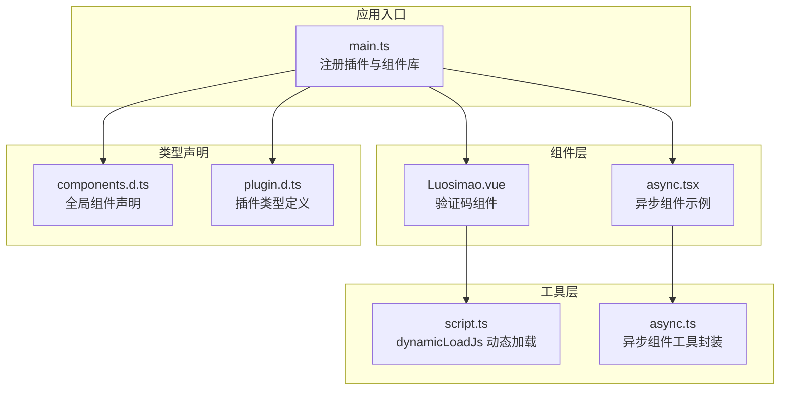
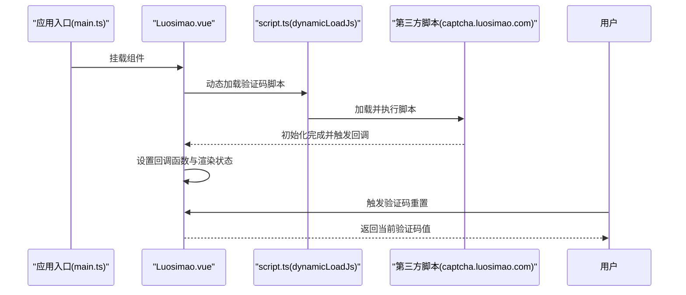
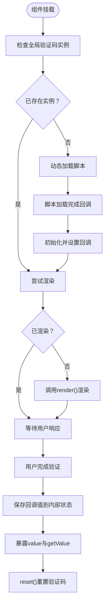
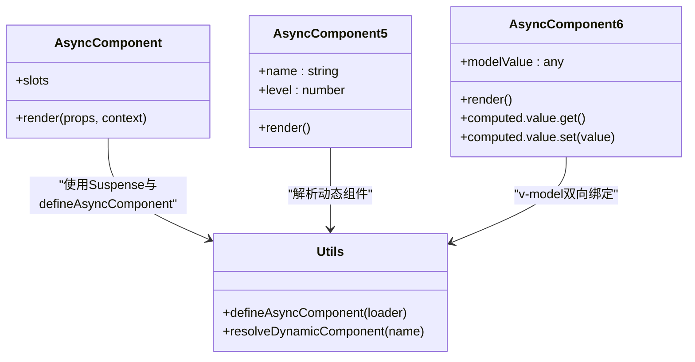
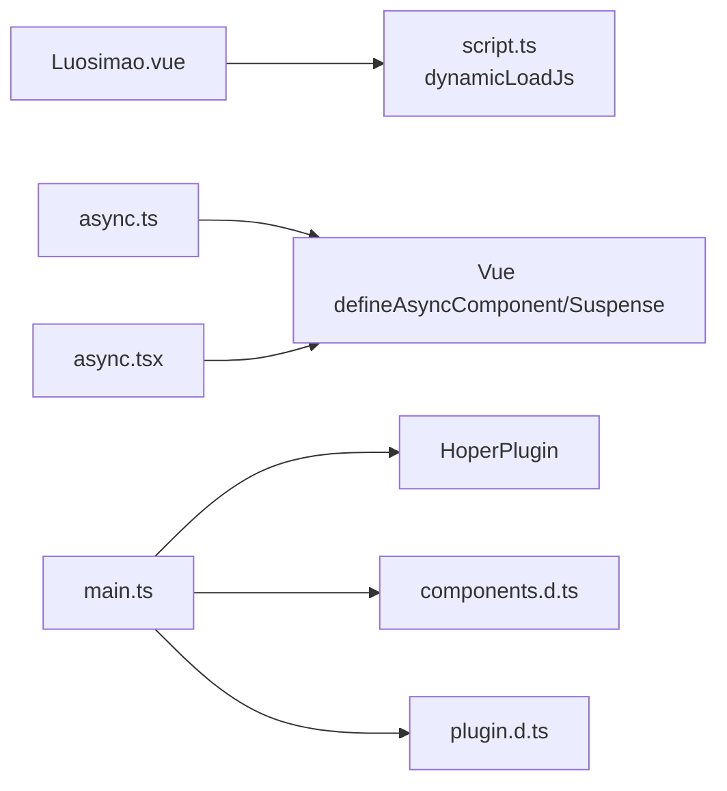

# 工具组件

<cite>
**本文档引用的文件**
- [Luosimao.vue](file://client/web/src/components/Luosimao.vue)
- [async.ts](file://client/web/src/utils/async.ts)
- [script.ts](file://thirdparty/diamond/src/utils/browser/script.ts)
- [main.ts](file://client/web/src/main.ts)
- [components.d.ts](file://client/web/components.d.ts)
- [plugin.d.ts](file://client/web/src/plugin/plugin.d.ts)
- [async.tsx](file://client/web/src/components/async.tsx)
</cite>

## 目录
1. [简介](#简介)
2. [项目结构](#项目结构)
3. [核心组件](#核心组件)
4. [架构总览](#架构总览)
5. [详细组件分析](#详细组件分析)
6. [依赖关系分析](#依赖关系分析)
7. [性能考量](#性能考量)
8. [故障排除指南](#故障排除指南)
9. [结论](#结论)
10. [附录](#附录)

## 简介
本文件面向Hoper Vue3工具组件，重点围绕两类组件展开：
- Luosimao验证码组件：基于第三方服务luosimao的滑动验证码，采用动态脚本加载与回调机制，提供异步渲染与重置能力。
- async异步组件工具：封装Vue异步组件与Suspense的使用方式，简化异步组件的加载、错误恢复与交互。

文档将从架构、数据流、处理逻辑、集成点、错误处理、性能优化与用户体验等维度进行深入剖析，并给出配置参数、回调函数、事件处理、安全考虑、最佳实践与故障排除建议。

## 项目结构
Hoper前端工程采用Vite+Vue3技术栈，工具组件主要分布在以下位置：
- 组件层：client/web/src/components 下存放业务组件与工具组件
- 工具层：thirdparty/diamond/src/utils 提供浏览器脚本动态加载等通用工具
- 应用入口：client/web/src/main.ts 注册全局插件与组件库
- 类型声明：client/web/components.d.ts 与 client/web/src/plugin/plugin.d.ts 提供组件类型与插件接口

**图表来源**
- [main.ts:1-60](file://client/web/src/main.ts#L1-L60)
- [Luosimao.vue:1-52](file://client/web/src/components/Luosimao.vue#L1-L52)
- [async.tsx:1-28](file://client/web/src/components/async.tsx#L1-L28)
- [script.ts:1-16](file://thirdparty/diamond/src/utils/browser/script.ts#L1-L16)
- [async.ts:1-87](file://client/web/src/utils/async.ts#L1-L87)
- [components.d.ts:1-38](file://client/web/components.d.ts#L1-L38)
- [plugin.d.ts:1-14](file://client/web/src/plugin/plugin.d.ts#L1-L14)

**章节来源**
- [main.ts:1-60](file://client/web/src/main.ts#L1-L60)
- [components.d.ts:1-38](file://client/web/components.d.ts#L1-L38)
- [plugin.d.ts:1-14](file://client/web/src/plugin/plugin.d.ts#L1-L14)

## 核心组件
- Luosimao验证码组件：负责在页面中渲染第三方验证码UI，通过动态加载脚本初始化验证码实例，监听回调并暴露获取值与重置方法。
- async异步组件工具：提供多种异步组件封装形式，包括基于defineAsyncComponent的懒加载、基于Suspense的占位与错误恢复，以及动态组件解析示例。

**章节来源**
- [Luosimao.vue:1-52](file://client/web/src/components/Luosimao.vue#L1-L52)
- [async.ts:1-87](file://client/web/src/utils/async.ts#L1-L87)

## 架构总览
下图展示Luosimao验证码组件与异步组件工具在应用中的交互关系与数据流向：

**图表来源**
- [main.ts:1-60](file://client/web/src/main.ts#L1-L60)
- [Luosimao.vue:1-52](file://client/web/src/components/Luosimao.vue#L1-L52)
- [script.ts:1-16](file://thirdparty/diamond/src/utils/browser/script.ts#L1-L16)

## 详细组件分析

### Luosimao验证码组件
- 设计目标：在不阻塞主线程的情况下按需加载第三方验证码脚本，提供可复用的验证码渲染、重置与值获取能力。
- 关键实现要点：
  - 动态脚本加载：通过工具函数在运行时插入<script>标签，监听onload回调以确保脚本可用后再初始化。
  - 实例管理：检测全局是否存在验证码实例，避免重复初始化；通过全局标志位控制渲染状态。
  - 回调绑定：在脚本加载完成后设置回调函数，将验证结果写入组件内部状态。
  - 生命周期：在组件挂载时尝试渲染，保证首次进入页面即可显示验证码。
  - 公开接口：通过defineExpose暴露value与getValue，便于父组件读取验证结果；提供reset用于刷新验证码。

**图表来源**
- [Luosimao.vue:1-52](file://client/web/src/components/Luosimao.vue#L1-L52)
- [script.ts:1-16](file://thirdparty/diamond/src/utils/browser/script.ts#L1-L16)

**章节来源**
- [Luosimao.vue:1-52](file://client/web/src/components/Luosimao.vue#L1-L52)
- [script.ts:1-16](file://thirdparty/diamond/src/utils/browser/script.ts#L1-L16)

### async异步组件工具
- 设计目标：简化Vue异步组件的使用，统一错误恢复与加载占位策略，提供动态组件解析示例。
- 关键实现要点：
  - 封装Suspense：通过自定义高阶组件将子组件以Suspense包裹，简化异步渲染流程。
  - defineAsyncComponent：提供带默认配置的异步组件工厂，便于在路由或模板中直接使用。
  - 动态组件解析：示例组件演示如何在运行时解析组件名称并渲染对应子组件。
  - 双向绑定示例：示例组件展示如何通过emit实现v-model双向绑定，便于在异步场景中传递状态。

**图表来源**
- [async.ts:1-87](file://client/web/src/utils/async.ts#L1-L87)
- [async.tsx:1-28](file://client/web/src/components/async.tsx#L1-L28)

**章节来源**
- [async.ts:1-87](file://client/web/src/utils/async.ts#L1-L87)
- [async.tsx:1-28](file://client/web/src/components/async.tsx#L1-L28)

## 依赖关系分析
- 组件与工具的耦合：
  - Luosimao.vue依赖thirdparty/diamond/src/utils/browser/script.ts提供的动态加载能力。
  - 异步组件工具位于client/web/src/utils/async.ts，为其他组件提供统一的异步加载模式。
- 插件与类型声明：
  - 应用入口通过main.ts注册HoperPlugin与各类UI组件，components.d.ts与plugin.d.ts提供类型支持，确保IDE与TS编译期提示。

**图表来源**
- [Luosimao.vue:1-52](file://client/web/src/components/Luosimao.vue#L1-L52)
- [script.ts:1-16](file://thirdparty/diamond/src/utils/browser/script.ts#L1-L16)
- [async.ts:1-87](file://client/web/src/utils/async.ts#L1-L87)
- [async.tsx:1-28](file://client/web/src/components/async.tsx#L1-L28)
- [main.ts:1-60](file://client/web/src/main.ts#L1-L60)
- [components.d.ts:1-38](file://client/web/components.d.ts#L1-L38)
- [plugin.d.ts:1-14](file://client/web/src/plugin/plugin.d.ts#L1-L14)

**章节来源**
- [main.ts:1-60](file://client/web/src/main.ts#L1-L60)
- [components.d.ts:1-38](file://client/web/components.d.ts#L1-L38)
- [plugin.d.ts:1-14](file://client/web/src/plugin/plugin.d.ts#L1-L14)

## 性能考量
- 资源加载优化
  - 按需加载：Luosimao验证码仅在需要时加载第三方脚本，减少初始包体与首屏阻塞。
  - 缓存与去重：组件内通过全局标志位避免重复渲染与重复初始化，降低无效调用。
- 渲染与交互
  - 使用Suspense：异步组件工具提供基于Suspense的占位与错误恢复，改善长尾加载体验。
  - 事件解绑：动态脚本加载完成后及时清理onload回调，避免内存泄漏。
- 体积与打包
  - 合理拆分：将第三方脚本与业务逻辑分离，利用CDN与缓存策略提升二次访问速度。
  - 分析与压缩：构建阶段开启可视化与压缩，结合类型声明减少冗余代码。

[本节为通用性能建议，无需特定文件引用]

## 故障排除指南
- 第三方脚本加载失败
  - 现象：验证码未显示或报错。
  - 排查：确认网络可达性与域名白名单；检查动态加载回调是否被正确执行；查看浏览器控制台错误信息。
  - 处理：在回调中增加错误日志；必要时提供降级方案（如静态图片或本地校验）。
- 重复初始化与渲染异常
  - 现象：多次渲染或状态不一致。
  - 排查：检查全局标志位与实例检测逻辑；确认组件挂载时机与生命周期钩子。
  - 处理：在初始化前清理旧状态；确保只在首次挂载时渲染。
- 异步组件空白或长时间无响应
  - 现象：页面长时间处于loading或空白。
  - 排查：检查defineAsyncComponent的loader路径与超时配置；确认Suspense的fallback与错误处理。
  - 处理：设置合理timeout与errorComponent；提供用户可感知的加载提示。
- 类型与IDE提示问题
  - 现象：组件未被识别或缺少类型提示。
  - 排查：确认components.d.ts与plugin.d.ts是否正确生成与引入；检查模块声明是否覆盖到组件文件。
  - 处理：重建类型声明文件；确保路径与模块名一致。

**章节来源**
- [Luosimao.vue:1-52](file://client/web/src/components/Luosimao.vue#L1-L52)
- [async.ts:1-87](file://client/web/src/utils/async.ts#L1-L87)
- [components.d.ts:1-38](file://client/web/components.d.ts#L1-L38)
- [plugin.d.ts:1-14](file://client/web/src/plugin/plugin.d.ts#L1-L14)

## 结论
Luosimao验证码组件与async异步组件工具在Hoper Vue3项目中分别承担“第三方服务集成”与“异步加载与错误恢复”的关键职责。前者通过动态脚本加载与回调机制实现平滑集成，后者通过Suspense与defineAsyncComponent提供统一的异步渲染体验。两者配合可显著提升首屏性能与用户体验，同时保持代码的可维护性与可扩展性。

[本节为总结性内容，无需特定文件引用]

## 附录

### 配置参数与回调函数清单
- Luosimao验证码组件
  - 参数：站点密钥、宽度、回调函数名（由第三方约定）
  - 方法：reset（重置）、getValue（获取当前值）
  - 生命周期：onMounted（初次渲染）
- 异步组件工具
  - 工厂函数：defineAsyncComponent（含loader、delay、timeout、errorComponent等）
  - 渲染：Suspense（占位与错误恢复）
  - 示例：动态组件解析与v-model双向绑定

**章节来源**
- [Luosimao.vue:1-52](file://client/web/src/components/Luosimao.vue#L1-L52)
- [async.ts:1-87](file://client/web/src/utils/async.ts#L1-L87)
- [async.tsx:1-28](file://client/web/src/components/async.tsx#L1-L28)

### 使用示例与最佳实践
- 使用Luosimao验证码组件
  - 在需要验证的表单页引入组件，调用reset刷新验证码，通过getValue获取验证结果。
  - 注意：确保网络环境允许访问第三方域名；在生产环境配置CDN与缓存策略。
- 使用async异步组件工具
  - 在路由或模板中直接使用defineAsyncComponent工厂函数；为长耗时组件提供loading与error组件。
  - 最佳实践：为loader函数添加超时与重试策略；在父组件中集中处理错误与重试逻辑。

[本节为通用指导，无需特定文件引用]