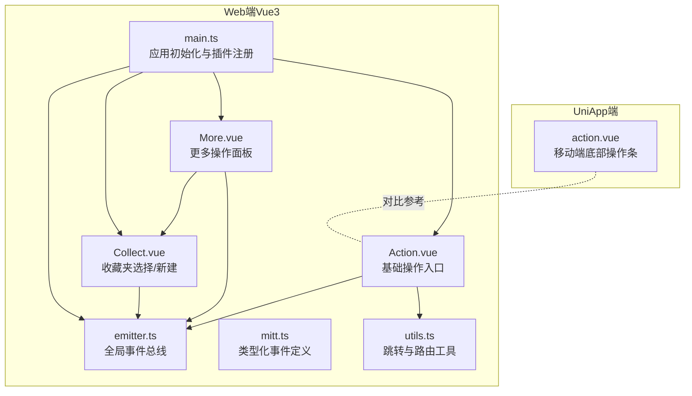
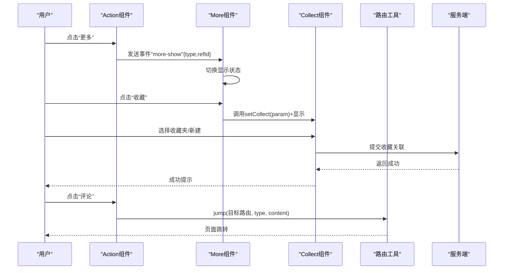
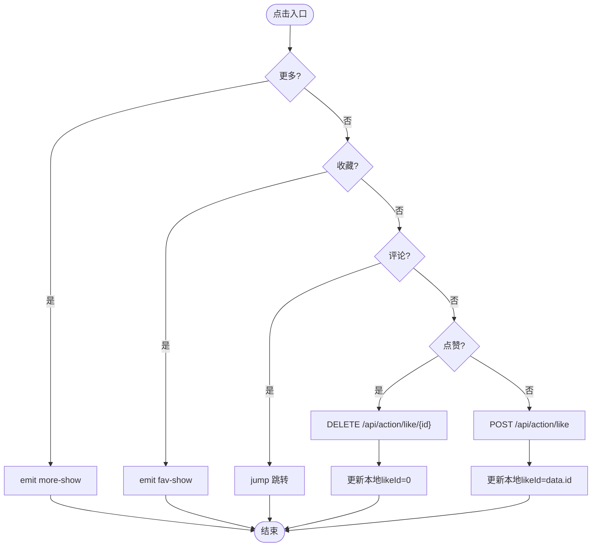
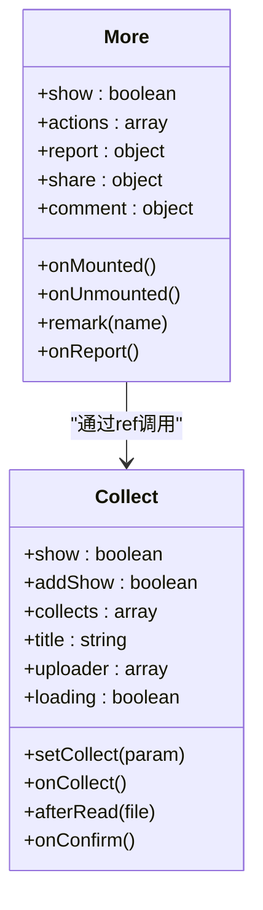
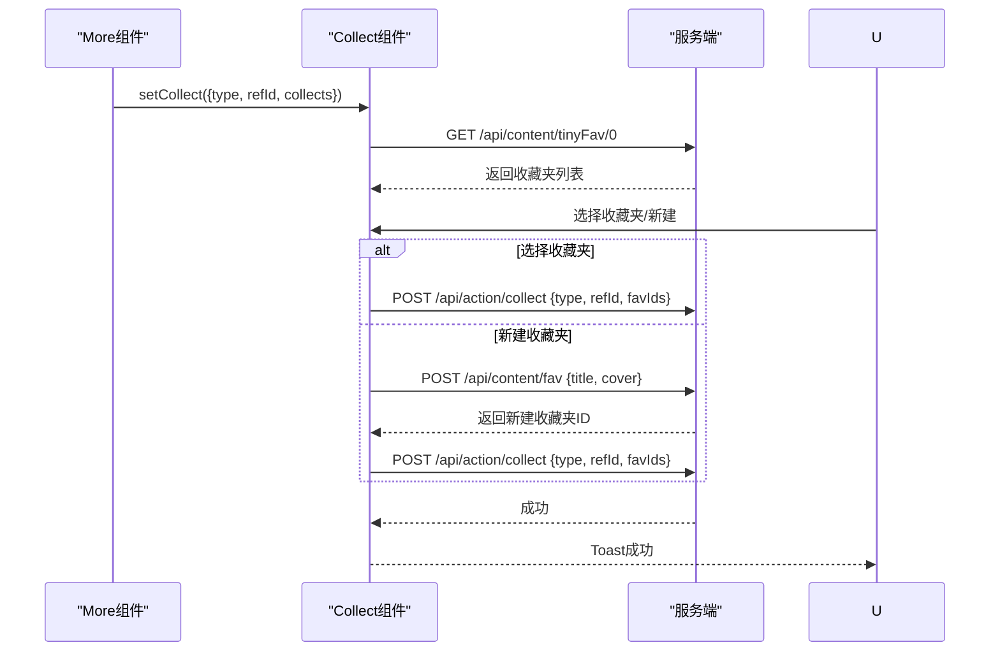
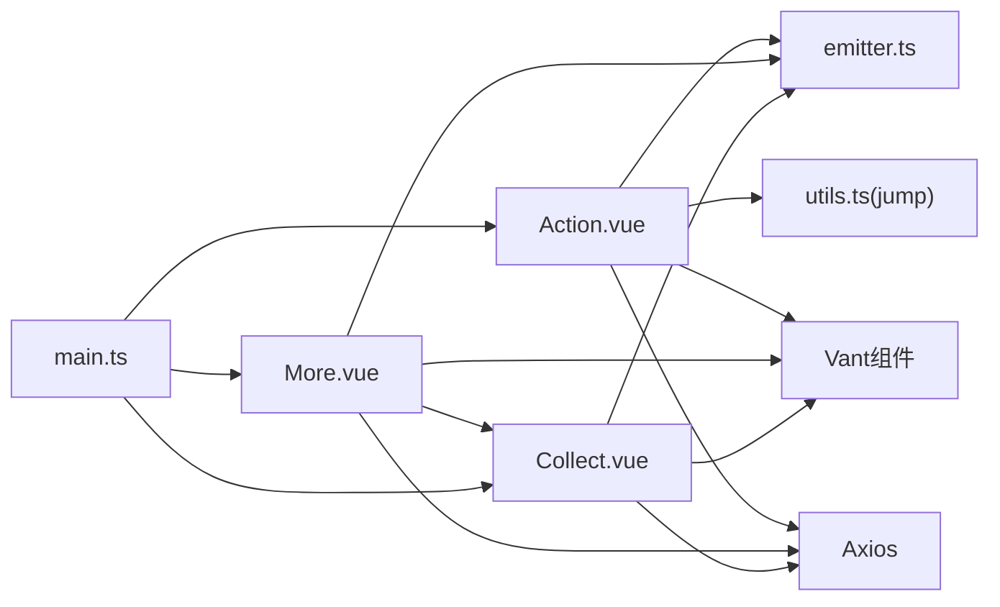

# 操作组件

<cite>
**本文档引用的文件**
- [Action.vue](file://client/web/src/components/action/Action.vue)
- [More.vue](file://client/web/src/components/action/More.vue)
- [Collect.vue](file://client/web/src/components/action/Collect.vue)
- [emitter.ts](file://client/web/src/plugin/emitter.ts)
- [mitt.ts](file://client/web/src/utils/mitt.ts)
- [utils.ts](file://client/web/src/router/utils.ts)
- [main.ts](file://client/web/src/main.ts)
- [action.vue](file://client/uniapp/src/components/action.vue)
</cite>

## 目录
1. [简介](#简介)
2. [项目结构](#项目结构)
3. [核心组件](#核心组件)
4. [架构总览](#架构总览)
5. [详细组件分析](#详细组件分析)
6. [依赖关系分析](#依赖关系分析)
7. [性能考量](#性能考量)
8. [故障排查指南](#故障排查指南)
9. [结论](#结论)
10. [附录](#附录)

## 简介
本文件面向Hoper Vue3生态中的操作组件体系，围绕Action、Collect、More三大组件进行深入技术文档整理。重点阐释设计理念、Props接口、事件触发机制、状态管理、可复用性设计、图标与交互反馈、组件协作模式、权限与用户态控制、以及开发规范、性能与可访问性最佳实践。同时补充了UniApp端的简化操作组件作为对比参考。

## 项目结构
操作组件位于Web端Vue3工程的组件目录下，采用按功能域划分的组织方式：
- Web端Vue3组件：client/web/src/components/action
- UniApp端组件：client/uniapp/src/components
- 事件总线与工具：client/web/src/plugin、client/web/src/utils、client/web/src/router

图表来源
- [Action.vue:1-91](file://client/web/src/components/action/Action.vue#L1-L91)
- [More.vue:1-136](file://client/web/src/components/action/More.vue#L1-L136)
- [Collect.vue:1-127](file://client/web/src/components/action/Collect.vue#L1-L127)
- [emitter.ts:1-4](file://client/web/src/plugin/emitter.ts#L1-L4)
- [mitt.ts:1-13](file://client/web/src/utils/mitt.ts#L1-L13)
- [utils.ts:1-48](file://client/web/src/router/utils.ts#L1-L48)
- [main.ts:1-60](file://client/web/src/main.ts#L1-L60)
- [action.vue:1-56](file://client/uniapp/src/components/action.vue#L1-L56)

章节来源
- [Action.vue:1-91](file://client/web/src/components/action/Action.vue#L1-L91)
- [More.vue:1-136](file://client/web/src/components/action/More.vue#L1-L136)
- [Collect.vue:1-127](file://client/web/src/components/action/Collect.vue#L1-L127)
- [emitter.ts:1-4](file://client/web/src/plugin/emitter.ts#L1-L4)
- [mitt.ts:1-13](file://client/web/src/utils/mitt.ts#L1-L13)
- [utils.ts:1-48](file://client/web/src/router/utils.ts#L1-L48)
- [main.ts:1-60](file://client/web/src/main.ts#L1-L60)
- [action.vue:1-56](file://client/uniapp/src/components/action.vue#L1-L56)

## 核心组件
- Action：提供“更多”、“收藏”、“评论”、“点赞”四个基础操作入口，负责状态展示与部分交互逻辑，并通过事件总线驱动更复杂的操作面板。
- More：承载“分享”、“举报”、“删除”等扩展能力，聚合弹窗、对话框、分享面板等交互容器，协调收藏面板显示。
- Collect：底部弹出式收藏夹选择与新建流程，支持图片上传、校验与提交，完成收藏关联。

章节来源
- [Action.vue:1-91](file://client/web/src/components/action/Action.vue#L1-L91)
- [More.vue:1-136](file://client/web/src/components/action/More.vue#L1-L136)
- [Collect.vue:1-127](file://client/web/src/components/action/Collect.vue#L1-L127)

## 架构总览
组件间通过事件总线解耦，Action负责触发事件，More集中承接并分发，Collect作为子面板被More唤起。路由工具jump用于评论场景的页面跳转，应用初始化阶段统一注册UI库与插件。

图表来源
- [Action.vue:48-64](file://client/web/src/components/action/Action.vue#L48-L64)
- [More.vue:107-122](file://client/web/src/components/action/More.vue#L107-L122)
- [Collect.vue:66-98](file://client/web/src/components/action/Collect.vue#L66-L98)
- [utils.ts:20-27](file://client/web/src/router/utils.ts#L20-L27)

## 详细组件分析

### Action 组件
- 设计理念
  - 轻量入口：以四宫格图标承载常用操作，减少首屏复杂度。
  - 状态内聚：基于传入内容对象维护本地响应式状态，避免频繁请求。
  - 事件驱动：将复杂交互下沉至More/Collect，保持Action职责单一。
- Props接口
  - content: 任意对象，承载收藏、点赞、评论计数等字段
  - type: 操作类型编号，用于区分业务实体
- 事件触发机制
  - more-show：携带{type, refId}，由More监听并切换显示
  - fav-show：携带{type, refId, collects}，由More唤起Collect并预填
  - onComment：评论跳转后由路由工具触发
- 状态管理
  - 使用reactive包裹props.content，确保计数与状态变更响应式更新
  - 点赞逻辑通过删除/新增两条分支实现正交状态切换
- 图标与交互反馈
  - 使用Vant图标，根据状态动态切换实/空心与颜色
  - 点击区域采用栅格布局，保证移动端触控面积
- 权限与用户态
  - 收藏列表缺失时自动补空数组，避免未登录态异常
- 性能与可访问性
  - 仅在必要时发起网络请求；按钮级事件绑定避免全局监听
  - 建议为图标添加aria-label提升可访问性

图表来源
- [Action.vue:48-80](file://client/web/src/components/action/Action.vue#L48-L80)

章节来源
- [Action.vue:1-91](file://client/web/src/components/action/Action.vue#L1-L91)
- [utils.ts:20-27](file://client/web/src/router/utils.ts#L20-L27)

### More 组件
- 设计理念
  - 集中式扩展面板：承载分享、举报、删除等非高频操作，降低主操作区干扰
  - 弹层组合：ActionSheet、Dialog、ShareSheet、Popup等按需组合
- Props接口
  - 无直接Props，通过事件总线接收上下文
- 事件与状态
  - 监听"more-show"：记录type/refId并切换显示
  - 监听"fav-show"：调用Collect.setCollect并显示
  - 内部状态：actions、report、share、comment
- 交互反馈
  - 举报：单选分类，当选择“其他原因”时显示备注输入
  - 分享：多行多列平台选项，支持图标
  - 删除：高亮警示色
- 协作模式
  - 与Collect强关联：通过ref直接调用其方法与状态
  - 与Action弱耦合：通过事件总线通信

图表来源
- [More.vue:54-136](file://client/web/src/components/action/More.vue#L54-L136)
- [Collect.vue:45-127](file://client/web/src/components/action/Collect.vue#L45-L127)

章节来源
- [More.vue:1-136](file://client/web/src/components/action/More.vue#L1-L136)
- [Collect.vue:1-127](file://client/web/src/components/action/Collect.vue#L1-L127)

### Collect 组件
- 设计理念
  - 底部弹出式交互：符合移动端使用习惯
  - 选择与新建并行：先选择已有收藏夹，再支持新建收藏夹
- 状态与行为
  - 选择收藏夹：Checkbox组绑定fav列表
  - 新建收藏夹：底部弹层输入标题与封面上传
  - 数据持久化：提交后Toast反馈并关闭面板
- 与用户态集成
  - 通过用户仓库获取当前用户ID，用于新建收藏夹归属
- 上传与校验
  - 上传前loading状态，上传后回填URL
  - 标题必填校验失败提示

图表来源
- [Collect.vue:66-119](file://client/web/src/components/action/Collect.vue#L66-L119)

章节来源
- [Collect.vue:1-127](file://client/web/src/components/action/Collect.vue#L1-L127)

### 事件总线与路由工具
- 事件总线
  - emitter.ts：基于mitt的全局事件实例
  - mitt.ts：类型化事件定义（示例），便于扩展
- 路由工具
  - jump：根据type与content.id计算目标路由，避免重复跳转，完成后触发评论事件

章节来源
- [emitter.ts:1-4](file://client/web/src/plugin/emitter.ts#L1-L4)
- [mitt.ts:1-13](file://client/web/src/utils/mitt.ts#L1-L13)
- [utils.ts:20-27](file://client/web/src/router/utils.ts#L20-L27)

### UniApp端操作组件（对比参考）
- 结构：底部操作条，包含分享、评论、收藏、点赞、更多五项
- 交互：点击各按钮通过toast提示对应动作
- 设计差异：无复杂状态与事件总线，适合轻量场景

章节来源
- [action.vue:1-56](file://client/uniapp/src/components/action.vue#L1-L56)

## 依赖关系分析
- 组件依赖
  - Action依赖事件总线与路由工具
  - More依赖事件总线与Collect
  - Collect依赖上传工具、用户仓库与UI组件
- 外部依赖
  - Vant UI库：Icon、Button、Field、Checkbox、Popup、ActionSheet、Dialog、ShareSheet等
  - Axios：HTTP请求
  - mitt：事件总线
  - Vue Router：路由跳转
- 初始化
  - main.ts中统一注册Vant组件与Hoper插件，确保组件可用

图表来源
- [Action.vue:32-42](file://client/web/src/components/action/Action.vue#L32-L42)
- [More.vue:54-61](file://client/web/src/components/action/More.vue#L54-L61)
- [Collect.vue:45-52](file://client/web/src/components/action/Collect.vue#L45-L52)
- [utils.ts:1-14](file://client/web/src/router/utils.ts#L1-L14)
- [main.ts:16-52](file://client/web/src/main.ts#L16-L52)

章节来源
- [Action.vue:1-91](file://client/web/src/components/action/Action.vue#L1-L91)
- [More.vue:1-136](file://client/web/src/components/action/More.vue#L1-L136)
- [Collect.vue:1-127](file://client/web/src/components/action/Collect.vue#L1-L127)
- [utils.ts:1-48](file://client/web/src/router/utils.ts#L1-L48)
- [main.ts:1-60](file://client/web/src/main.ts#L1-L60)

## 性能考量
- 渲染优化
  - Action使用响应式包裹props.content，避免不必要的重渲染
  - More与Collect采用条件渲染与teleport挂载，减少DOM层级
- 网络优化
  - 点赞与收藏采用幂等请求，避免重复提交
  - 收藏夹列表懒加载，仅在打开面板时请求
- 事件优化
  - 使用事件总线替代深层props传递，降低组件耦合
  - 长按等高频事件建议结合防抖/节流指令（见diamond目录中的优化指令）

## 故障排查指南
- 事件未触发
  - 检查emitter实例是否正确导入与使用
  - 确认More组件在卸载时清理监听
- 路由跳转异常
  - 确认jump参数与contentRoute映射一致
  - 检查路由是否存在重复跳转保护
- 收藏失败
  - 校验收藏夹列表是否已加载
  - 检查新建收藏夹标题是否为空
  - 确认上传流程是否成功回填URL
- 图标与样式问题
  - 检查Vant组件是否正确注册
  - 确认teleport挂载点存在

章节来源
- [emitter.ts:1-4](file://client/web/src/plugin/emitter.ts#L1-L4)
- [More.vue:119-122](file://client/web/src/components/action/More.vue#L119-L122)
- [utils.ts:20-27](file://client/web/src/router/utils.ts#L20-L27)
- [Collect.vue:104-119](file://client/web/src/components/action/Collect.vue#L104-L119)

## 结论
Hoper操作组件体系以Action为核心入口，通过事件总线与More/Collect形成清晰的职责分离与协作模式。组件具备良好的可复用性与可扩展性，配合Vant与路由工具实现流畅的交互体验。建议在后续迭代中进一步完善类型化事件、可访问性标签与性能监控，持续提升稳定性与可维护性。

## 附录
- 开发规范
  - Props尽量使用明确类型，避免any
  - 事件命名统一使用动词短语，如"more-show"
  - 弹层组件统一使用teleport挂载到#app
  - 表单校验与错误提示规范化
- 权限控制
  - 在组件入口处对未登录态进行降级处理
  - 收藏与点赞等敏感操作增加二次确认
- 可访问性
  - 为图标按钮添加aria-label
  - 为弹层提供键盘可聚焦与Esc关闭
- 性能与监控
  - 对高频事件使用防抖/节流
  - 对关键接口埋点统计成功率与耗时