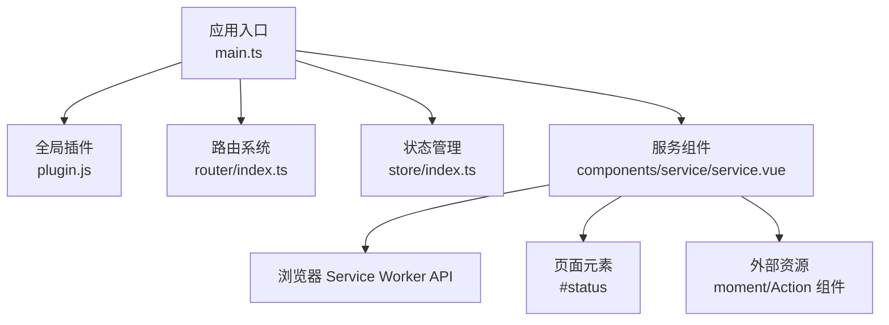
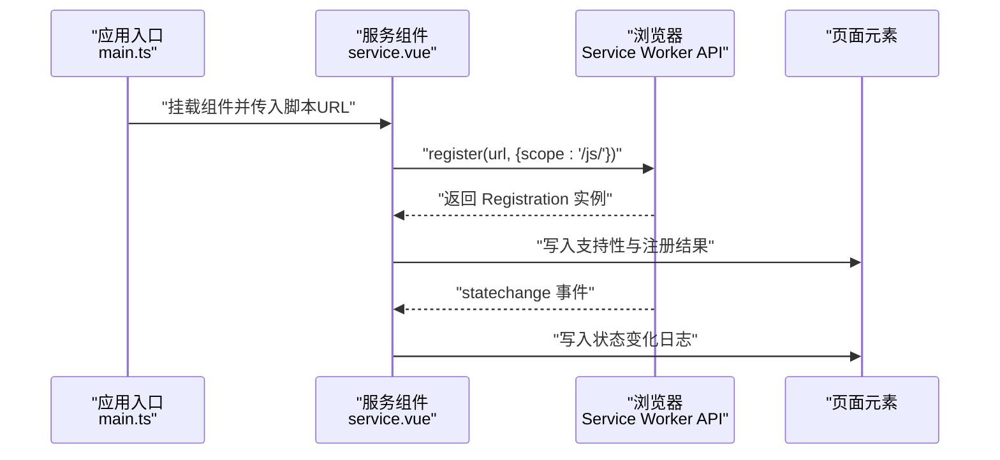
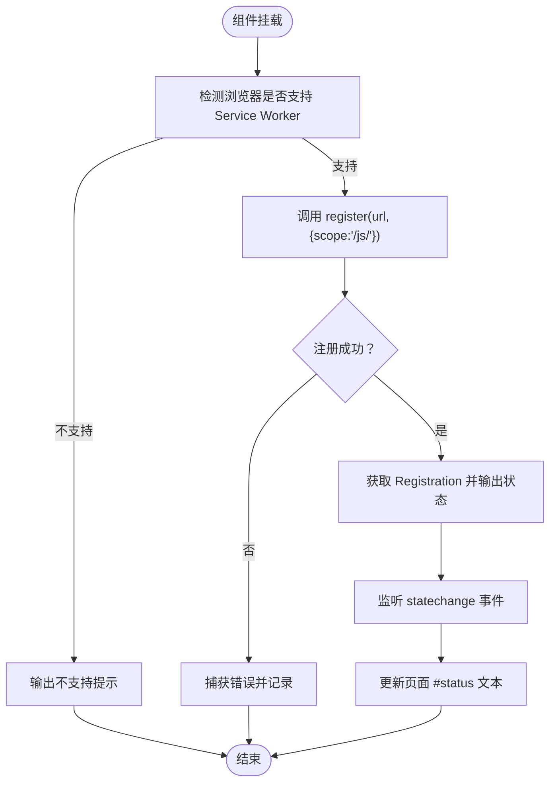
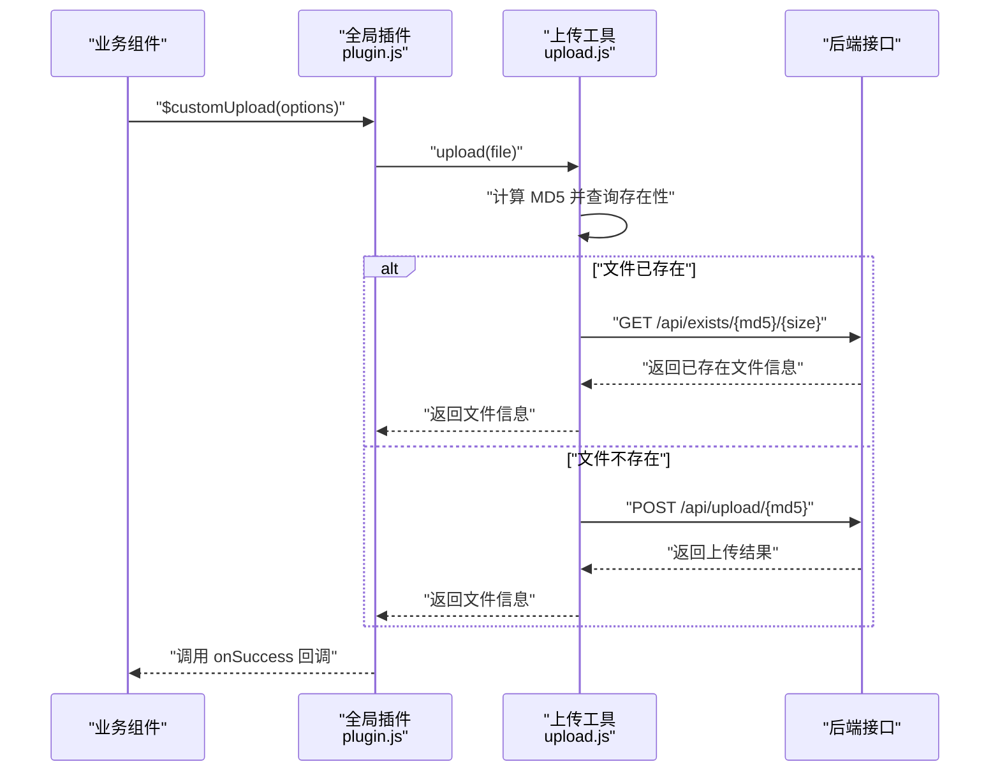
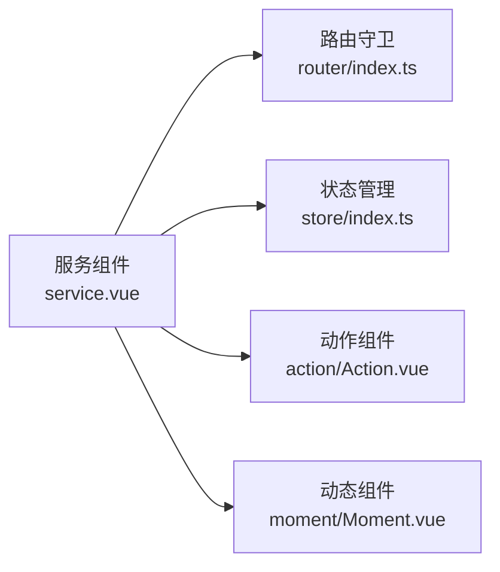
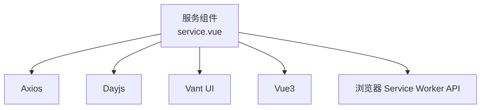

# 服务组件

<cite>
**本文引用的文件**
- [service.vue](file://client/web/src/components/service/service.vue)
- [plugin.js](file://client/web/src/plugin/plugin.js)
- [upload.js](file://client/web/src/utils/upload.js)
- [main.ts](file://client/web/src/main.ts)
- [router/index.ts](file://client/web/src/router/index.ts)
- [store/index.ts](file://client/web/src/store/index.ts)
- [Action.vue](file://client/web/src/components/action/Action.vue)
- [Moment.vue](file://client/web/src/components/moment/Moment.vue)
</cite>

## 目录
1. [简介](#简介)
2. [项目结构](#项目结构)
3. [核心组件](#核心组件)
4. [架构总览](#架构总览)
5. [详细组件分析](#详细组件分析)
6. [依赖分析](#依赖分析)
7. [性能考虑](#性能考虑)
8. [故障排查指南](#故障排查指南)
9. [结论](#结论)
10. [附录](#附录)

## 简介
本文件聚焦于 Hoper Vue3 前端中的“服务组件”，该组件以 Service Worker 的注册与状态监控为核心功能，用于在浏览器端启用离线缓存与后台更新等能力。本文从系统架构、组件职责、数据流与事件交互、配置与扩展、依赖管理与维护策略等方面进行深入说明，并给出开发规范、测试与部署最佳实践。

## 项目结构
前端采用基于 Vue3 + Vite 的单页应用（SPA）架构，核心入口在 Web 平台，服务组件位于 components/service 目录下；全局插件与工具通过 plugin 与 utils 提供；路由与状态管理分别由 router 与 store 组织。

图表来源
- [main.ts:16-60](file://client/web/src/main.ts#L16-L60)
- [plugin.js:8-38](file://client/web/src/plugin/plugin.js#L8-L38)
- [router/index.ts:1-62](file://client/web/src/router/index.ts#L1-L62)
- [store/index.ts:1-10](file://client/web/src/store/index.ts#L1-L10)
- [service.vue:1-57](file://client/web/src/components/service/service.vue#L1-L57)

章节来源
- [main.ts:16-60](file://client/web/src/main.ts#L16-L60)
- [router/index.ts:1-62](file://client/web/src/router/index.ts#L1-L62)
- [store/index.ts:1-10](file://client/web/src/store/index.ts#L1-L10)

## 核心组件
- 服务组件（Service Worker 管理）
  - 职责：注册 Service Worker、监听其生命周期状态变化、在页面展示注册与状态信息。
  - 关键点：接收外部传入的脚本地址，限定作用域，绑定状态变更事件。
- 全局插件（工具与指令）
  - 职责：提供日期格式化指令与全局时间处理方法，封装上传流程。
  - 关键点：通过 app.directive 与 app.config.globalProperties 注入。
- 上传工具
  - 职责：计算文件 MD5、查询已存在文件、执行分片读取与上传。
  - 关键点：结合后端接口完成去重与断点复用。

章节来源
- [service.vue:6-54](file://client/web/src/components/service/service.vue#L6-L54)
- [plugin.js:8-38](file://client/web/src/plugin/plugin.js#L8-L38)
- [upload.js:58-92](file://client/web/src/utils/upload.js#L58-L92)

## 架构总览
服务组件在应用启动后被挂载，负责与浏览器 Service Worker API 对接，向页面输出注册状态与运行时状态。它与路由守卫、状态管理、以及业务组件（如 moment、action）共同构成前端运行时的协作体系。

图表来源
- [service.vue:18-53](file://client/web/src/components/service/service.vue#L18-L53)
- [main.ts:54-60](file://client/web/src/main.ts#L54-L60)

## 详细组件分析

### 服务组件（Service Worker 管理）
- 设计目的
  - 在 Web 平台启用 Service Worker，以实现离线缓存、网络降级与后台更新等能力。
  - 通过页面可视化展示注册状态与运行时状态，便于调试与运维。
- 实现方式
  - 使用 onMounted 生命周期在挂载时执行注册逻辑。
  - 通过 document.querySelector 获取页面占位元素，实时输出注册与状态信息。
  - 限定作用域为 “/js/”，确保对目标资源生效。
- 数据与事件流
  - 输入：组件属性 url（脚本地址）。
  - 输出：页面 #status 内容（支持性、注册结果、状态变化）。
  - 事件：监听 Service Worker 的 statechange 事件，动态刷新状态文本。
- 配置与扩展
  - 支持通过 props.url 动态传入脚本路径，便于多环境或多版本切换。
  - 作用域 scope 可按需调整，建议与静态资源路径保持一致。
  - 可扩展为统一的 SW 状态管理模块，集中处理更新、拦截与缓存策略。
- 与其他组件的协作
  - 与路由守卫配合：在用户认证与页面跳转前确保 SW 就绪。
  - 与业务组件（moment、action）协作：在离线场景下保证关键交互可用。

图表来源
- [service.vue:18-53](file://client/web/src/components/service/service.vue#L18-L53)

章节来源
- [service.vue:6-54](file://client/web/src/components/service/service.vue#L6-L54)

### 全局插件与上传工具
- 插件能力
  - 指令与全局方法：提供日期格式化指令与全局时间处理方法，统一时间显示风格。
  - 上传封装：提供 $customUpload 方法，内部调用 upload 工具，简化上传流程。
- 上传工具
  - 文件去重：先计算 MD5 并查询后端是否存在同名文件，避免重复上传。
  - 分片读取：按 2MB 分片读取文件，降低内存占用，提升大文件稳定性。
  - 表单上传：构造 FormData，调用后端上传接口，返回结果并回调 onSuccess。

图表来源
- [plugin.js:21-36](file://client/web/src/plugin/plugin.js#L21-L36)
- [upload.js:58-92](file://client/web/src/utils/upload.js#L58-L92)

章节来源
- [plugin.js:8-38](file://client/web/src/plugin/plugin.js#L8-L38)
- [upload.js:19-56](file://client/web/src/utils/upload.js#L19-L56)
- [upload.js:58-92](file://client/web/src/utils/upload.js#L58-L92)

### 与业务组件的协作
- 与 Action 组件协作
  - Action 组件通过事件总线触发更多操作弹窗、收藏与点赞等交互。
  - 服务组件可作为前置条件，在交互前确保 SW 就绪，提升离线体验。
- 与 Moment 组件协作
  - Moment 展示内容与图片预览，服务组件的状态变化可用于提示用户网络/缓存状态。
- 与路由与状态管理协作
  - 路由守卫在进入受保护页面前检查认证状态；服务组件可在应用初始化阶段加载。
  - Pinia 状态管理为全局状态提供集中存储，服务组件可与之联动进行缓存策略控制。

图表来源
- [router/index.ts:39-59](file://client/web/src/router/index.ts#L39-L59)
- [store/index.ts:5-7](file://client/web/src/store/index.ts#L5-L7)
- [Action.vue:32-81](file://client/web/src/components/action/Action.vue#L32-L81)
- [Moment.vue:39-72](file://client/web/src/components/moment/Moment.vue#L39-L72)

章节来源
- [router/index.ts:1-62](file://client/web/src/router/index.ts#L1-L62)
- [store/index.ts:1-10](file://client/web/src/store/index.ts#L1-L10)
- [Action.vue:32-81](file://client/web/src/components/action/Action.vue#L32-L81)
- [Moment.vue:39-72](file://client/web/src/components/moment/Moment.vue#L39-L72)

## 依赖分析
- 运行时依赖
  - 浏览器原生 Service Worker API：用于注册与状态监听。
  - Axios：用于上传与查询接口调用。
  - SparkMD5：用于大文件分片计算 MD5。
- 应用层依赖
  - Vue3 生态：组件生命周期、响应式与事件总线。
  - Vant UI：提供基础交互组件（如图片预览、图标等）。
  - Dayjs：提供本地化日期格式化能力（由插件注入）。

图表来源
- [service.vue:7-10](file://client/web/src/components/service/service.vue#L7-L10)
- [plugin.js:1-6](file://client/web/src/plugin/plugin.js#L1-L6)
- [upload.js:1-2](file://client/web/src/utils/upload.js#L1-L2)

章节来源
- [service.vue:7-10](file://client/web/src/components/service/service.vue#L7-L10)
- [plugin.js:1-6](file://client/web/src/plugin/plugin.js#L1-L6)
- [upload.js:1-2](file://client/web/src/utils/upload.js#L1-L2)

## 性能考虑
- Service Worker 注册
  - 仅在必要时注册，避免重复注册与资源浪费。
  - 合理设置 scope，缩小拦截范围，减少不必要的缓存与拦截开销。
- 上传性能
  - 分片大小建议维持在 2MB 左右，兼顾内存占用与并发效率。
  - 对于大文件，优先使用已存在文件校验，减少重复传输。
- 页面渲染
  - 将状态输出与 UI 解耦，避免频繁 DOM 更新造成卡顿。
  - 使用虚拟滚动与懒加载（如图片懒加载）提升列表渲染性能。

## 故障排查指南
- Service Worker 未注册
  - 检查浏览器是否支持 Service Worker，确认脚本路径与作用域正确。
  - 查看页面 #status 输出，定位注册失败原因。
- 状态异常
  - 监听 statechange 事件，关注 installing/waiting/active 状态切换。
  - 若长时间停留在 waiting，尝试刷新页面或手动激活。
- 上传失败
  - 校验 MD5 计算与后端接口返回一致性。
  - 检查 FormData 构造与 Content-Type 设置。
- 路由与认证
  - 确认路由守卫逻辑与白名单配置，避免未登录用户被重定向至登录页。

章节来源
- [service.vue:18-53](file://client/web/src/components/service/service.vue#L18-L53)
- [upload.js:58-92](file://client/web/src/utils/upload.js#L58-L92)
- [router/index.ts:39-59](file://client/web/src/router/index.ts#L39-L59)

## 结论
服务组件以 Service Worker 为核心，承担了前端离线与缓存的关键职责，并通过可视化输出帮助开发者快速定位问题。结合全局插件与上传工具，形成从界面到网络的一体化能力。建议在实际项目中进一步抽象 SW 管理、完善缓存策略与错误处理，并将其纳入 CI/CD 流程，确保在多环境下稳定运行。

## 附录
- 开发规范
  - 组件命名与目录结构遵循 feature-based 原则，便于维护与扩展。
  - 所有全局能力通过插件注入，避免污染全局作用域。
- 测试方法
  - 单元测试：针对上传工具的 MD5 计算与接口调用进行模拟测试。
  - 集成测试：在本地或测试环境中验证 Service Worker 注册与状态变化。
- 部署考虑
  - 将 Service Worker 脚本放置于受控的静态资源目录，确保 scope 与路径一致。
  - 在生产环境开启 HTTPS，部分浏览器对 Service Worker 有严格要求。
  - 通过版本号或哈希命名策略管理 SW 缓存，避免旧版本干扰。